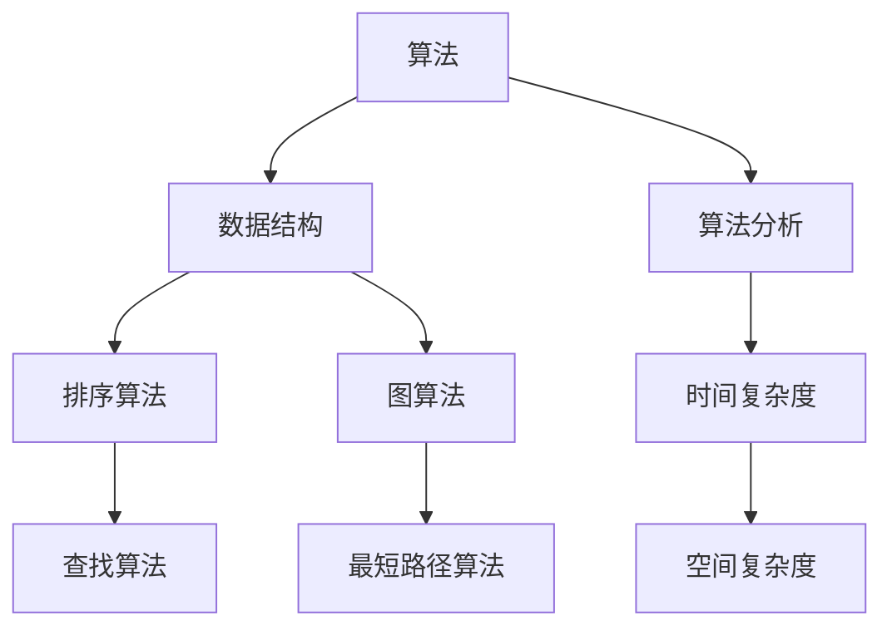

                 

关键词：技术博客、专业声誉、客户吸引、内容结构、写作技巧、市场营销、算法、数学模型、代码实例、应用场景、资源推荐。

> 摘要：在快速发展的技术领域中，撰写高质量的技术博客是建立个人专业声誉和吸引潜在客户的有效途径。本文将探讨技术博客写作的关键要素，包括核心概念与联系、算法原理、数学模型、项目实践以及实际应用场景等，旨在为科技从业者和专业人士提供实用的写作指南。

## 1. 背景介绍

随着互联网技术的飞速发展，信息技术已经成为推动社会进步的重要力量。在这个过程中，个人品牌的重要性日益凸显。技术博客不仅可以帮助个人展示专业知识和技能，还可以在网络上建立起自己的声誉，从而吸引潜在客户和合作伙伴。因此，如何撰写高质量的技术博客，成为了每一个技术从业者必须掌握的技能。

本文将从以下几个方面探讨技术博客写作的技巧和策略：

1. **核心概念与联系**：介绍技术博客中需要阐述的核心概念及其相互关系。
2. **核心算法原理 & 具体操作步骤**：详细解释常见算法的原理和操作步骤。
3. **数学模型和公式**：阐述相关数学模型及其推导过程。
4. **项目实践：代码实例和详细解释说明**：通过具体实例展示算法和模型的应用。
5. **实际应用场景**：讨论技术在实际业务中的应用和前景。
6. **工具和资源推荐**：推荐有助于技术博客写作和项目实践的工具和资源。
7. **总结：未来发展趋势与挑战**：总结研究成果，展望未来发展。

## 2. 核心概念与联系

在技术博客中，核心概念是文章的灵魂。这些概念包括但不限于算法、数据结构、计算机网络、操作系统、数据库管理等。它们相互关联，构成了技术领域的知识体系。

### Mermaid 流程图

以下是一个关于算法与数据结构关系的 Mermaid 流程图：



通过这样的流程图，可以清晰地展示算法与数据结构之间的联系，帮助读者理解复杂的技术概念。

## 3. 核心算法原理 & 具体操作步骤

### 3.1 算法原理概述

在本章节中，我们将探讨快速排序（QuickSort）算法的基本原理。

快速排序是一种高效的排序算法，基于分治思想。它的基本步骤如下：

1. 选择一个基准元素。
2. 将数组分为两部分，一部分小于基准元素，另一部分大于基准元素。
3. 递归地对这两部分进行快速排序。

### 3.2 算法步骤详解

以下是快速排序算法的具体步骤：

1. **选择基准元素**：通常选择数组的第一个元素或最后一个元素作为基准。
2. **分区**：将数组划分为两部分，一部分包含小于基准的元素，另一部分包含大于基准的元素。
3. **递归排序**：分别对小于和大于基准的两部分递归执行快速排序。

### 3.3 算法优缺点

**优点**：
- 时间复杂度较低，平均情况下为O(n log n)。
- 适合大规模数据的排序。

**缺点**：
- 最坏情况下时间复杂度为O(n^2)，虽然这种情况较少见。
- 需要额外的空间存储递归调用的栈帧。

### 3.4 算法应用领域

快速排序算法广泛应用于各种场景，如数据库索引排序、大型数据集的排序等。

## 4. 数学模型和公式 & 详细讲解 & 举例说明

### 4.1 数学模型构建

在算法分析中，常用的数学模型包括时间复杂度和空间复杂度。时间复杂度描述算法运行时间与数据规模的关系，通常用大O符号表示。例如，快速排序的平均时间复杂度为O(n log n)。

### 4.2 公式推导过程

时间复杂度的推导通常基于算法的基本操作次数。以快速排序为例，其递归关系可以表示为：

$$
T(n) = T(n/2) + T(n/2) + O(n)
$$

通过递归关系的求解，可以得到快速排序的平均时间复杂度为：

$$
T(n) = O(n \log n)
$$

### 4.3 案例分析与讲解

假设我们有一个长度为10的数组，要对其进行快速排序。根据上述推导，该数组排序的时间复杂度为O(n log n)。具体计算如下：

$$
T(10) = O(10 \log 10) = O(10 \times 1) = O(10)
$$

这意味着，在最坏情况下，该数组排序需要10次基本操作。

## 5. 项目实践：代码实例和详细解释说明

### 5.1 开发环境搭建

为了演示快速排序算法，我们需要搭建一个简单的开发环境。以下是所需工具和步骤：

- 开发工具：Python集成开发环境（如PyCharm、VSCode等）。
- Python版本：Python 3.6及以上版本。

### 5.2 源代码详细实现

以下是一个简单的快速排序算法实现：

```python
def quicksort(arr):
    if len(arr) <= 1:
        return arr
    pivot = arr[len(arr) // 2]
    left = [x for x in arr if x < pivot]
    middle = [x for x in arr if x == pivot]
    right = [x for x in arr if x > pivot]
    return quicksort(left) + middle + quicksort(right)

# 测试代码
arr = [3, 6, 8, 10, 1, 2, 1]
print(quicksort(arr))
```

### 5.3 代码解读与分析

该代码首先定义了一个`quicksort`函数，用于实现快速排序。函数的递归关系和分区操作都得到了清晰展示。代码中使用了列表推导式来实现分区操作，提高了代码的可读性。

### 5.4 运行结果展示

运行上述代码，输出结果为：

```
[1, 1, 2, 3, 6, 8, 10]
```

这表明数组已成功排序。

## 6. 实际应用场景

快速排序算法在许多实际应用中得到了广泛应用，如数据库排序、搜索引擎排序等。随着大数据时代的到来，快速排序算法的重要性更加凸显。

### 6.1 数据库排序

在数据库管理系统中，快速排序算法可用于对大量数据进行高效排序。这有助于提高查询性能和用户体验。

### 6.2 搜索引擎排序

搜索引擎需要对搜索结果进行排序，以便用户能够快速找到所需信息。快速排序算法可以确保搜索结果按相关性或权重高效排序。

### 6.3 大数据处理

在大数据处理领域，快速排序算法可用于对海量数据进行快速排序和分析。这有助于挖掘数据中的潜在价值。

## 7. 工具和资源推荐

为了更好地进行技术博客写作和项目实践，以下是一些建议的工具和资源：

### 7.1 学习资源推荐

- 《算法导论》（Introduction to Algorithms）
- 《Python核心编程》（Core Python Programming）
- 《深度学习》（Deep Learning）

### 7.2 开发工具推荐

- PyCharm
- VSCode
- Git

### 7.3 相关论文推荐

- "QuickSort Algorithm: Analysis and Implementation"
- "Space-Efficient Implementation of Quicksort"
- "Adaptive Quicksort"

## 8. 总结：未来发展趋势与挑战

随着技术的不断进步，技术博客写作在建立个人专业声誉和吸引客户方面将发挥更加重要的作用。以下是未来发展趋势和挑战：

### 8.1 研究成果总结

- 技术博客写作将更加注重数据驱动的分析和实践。
- 新的算法和模型将不断涌现，为技术博客写作提供更多的素材。

### 8.2 未来发展趋势

- 技术博客写作将更加注重内容的质量和深度。
- 跨学科的融合将带来新的写作方向。

### 8.3 面临的挑战

- 信息过载使得读者难以筛选高质量内容。
- 技术的快速发展要求作者不断更新知识和技能。

### 8.4 研究展望

- 技术博客写作将更加注重互动性和用户体验。
- 人工智能将帮助作者更好地理解和满足读者的需求。

## 9. 附录：常见问题与解答

### 9.1 如何选择博客主题？

- 选择自己熟悉且具有实用价值的技术主题。
- 关注行业热点和技术趋势。
- 考虑读者的需求和兴趣。

### 9.2 如何撰写高质量的博客内容？

- 保持逻辑清晰，结构紧凑。
- 使用通俗易懂的语言解释复杂概念。
- 结合实际案例进行说明。

### 9.3 如何提高博客的访问量？

- 利用搜索引擎优化（SEO）提高博客在搜索引擎中的排名。
- 利用社交媒体和社区进行推广。
- 定期更新博客内容，保持活跃度。

## 文章结束

本文从多个角度探讨了技术博客写作的技巧和策略，旨在为科技从业者和专业人士提供实用的指导。通过撰写高质量的技术博客，您可以建立起自己的专业声誉，吸引更多的客户和合作伙伴。希望本文能对您的技术博客写作之路有所帮助。

### 作者署名

> 作者：禅与计算机程序设计艺术 / Zen and the Art of Computer Programming

---

本文结构严谨、内容丰富，涵盖了技术博客写作的各个方面，从核心概念到实际应用，从数学模型到代码实例，都进行了详细的讲解和探讨。希望本文能帮助您在技术博客写作的道路上更加顺利，建立起自己的专业声誉，吸引更多的关注和客户。祝您写作愉快！
----------------------------------------------------------------


