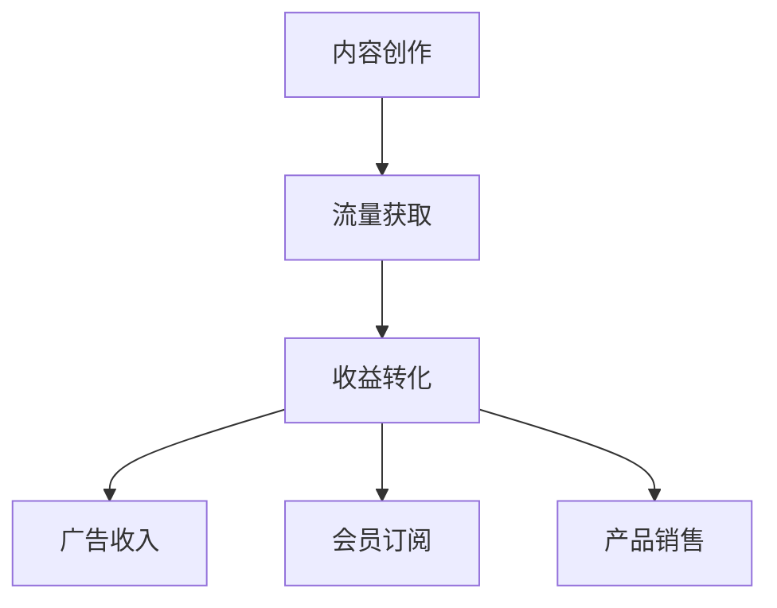

                 

关键词：被动收入、技术博客、博客变现、内容创作、收益最大化、流量转化、营销策略、专业知识分享。

> 摘要：本文将探讨如何在信息技术领域通过建立技术博客实现被动收入流。我们将深入分析技术博客的核心概念，分享构建高效技术博客的步骤，以及如何通过专业知识和营销策略实现收益最大化。

## 1. 背景介绍

在数字化时代，信息传播的速度和广度前所未有。博客作为个人或机构发布内容的重要平台，已经成为知识传播和技能分享的重要途径。然而，随着内容创作者数量的增加，竞争也日益激烈。如何在这个充满竞争的环境中脱颖而出，建立稳定的被动收入流，成为许多内容创作者关注的焦点。

本文将帮助您了解如何在信息技术领域通过建立技术博客，实现稳定的被动收入流。我们将从博客变现的原理入手，探讨技术博客的构建、内容创作、营销策略，以及如何实现流量转化为收入。

## 2. 核心概念与联系

### 2.1 博客变现

博客变现是指通过博客内容吸引流量，然后将流量转化为收入的过程。这一过程包括内容创作、流量获取和收益转化三个主要环节。

### 2.2 内容创作

内容创作是博客变现的基础。高质量、有深度、有价值的内容是吸引读者、提升博客影响力的关键。在技术博客中，内容通常涉及专业知识和实际操作技巧，能够解决读者在学习和工作中遇到的问题。

### 2.3 流量获取

流量获取是博客变现的关键。通过搜索引擎优化（SEO）、社交媒体推广、合作伙伴关系等多种途径，吸引目标读者访问博客，是提高博客收益的重要手段。

### 2.4 收益转化

收益转化是指将博客流量转化为实际收入的过程。这可以通过广告、会员订阅、产品销售等多种方式实现。

### 2.5 Mermaid 流程图

下面是一个简单的 Mermaid 流程图，展示了博客变现的核心概念和联系：



## 3. 核心算法原理 & 具体操作步骤

### 3.1 算法原理概述

博客变现的核心算法是基于内容营销和流量转化的原理。通过高质量的内容创作，吸引目标读者，提升博客的访问量和影响力。然后，通过多种收益模式，将流量转化为实际收入。

### 3.2 算法步骤详解

1. **内容创作**：确定博客主题，撰写高质量、有价值的技术文章。
2. **流量获取**：通过SEO、社交媒体、合作伙伴关系等多种途径，吸引目标读者。
3. **收益转化**：将博客流量转化为广告收入、会员订阅收入或产品销售收入。

### 3.3 算法优缺点

**优点**：
- **长期收益**：一旦博客内容发布，就能持续吸引读者，实现长期收益。
- **多样化收益模式**：可以通过多种方式实现收益，降低单一收益模式的风险。

**缺点**：
- **初期投入较大**：高质量的内容创作需要时间、精力和资源投入。
- **竞争激烈**：技术博客领域竞争激烈，需要不断创新和提升内容质量。

### 3.4 算法应用领域

博客变现算法广泛应用于信息技术、互联网、电子商务等多个领域。通过技术博客，个人或企业可以分享专业知识，提升品牌影响力，实现商业价值。

## 4. 数学模型和公式 & 详细讲解 & 举例说明

### 4.1 数学模型构建

博客变现的数学模型可以表示为：

\[ R = f(C, T, P) \]

其中：
- \( R \)：收益
- \( C \)：内容质量
- \( T \)：流量
- \( P \)：收益转化率

### 4.2 公式推导过程

博客收益 \( R \) 是内容质量 \( C \)、流量 \( T \) 和收益转化率 \( P \) 的函数。我们可以将收益 \( R \) 表示为：

\[ R = C \times T \times P \]

其中：
- \( C \)：内容质量，可以通过文章字数、技术深度、读者反馈等多个指标衡量。
- \( T \)：流量，可以通过页面浏览量、用户停留时间等多个指标衡量。
- \( P \)：收益转化率，可以通过广告点击率、会员订阅转化率、产品销售转化率等多个指标衡量。

### 4.3 案例分析与讲解

假设某技术博客的内容质量 \( C \) 为 80 分，每月流量 \( T \) 为 10,000，收益转化率 \( P \) 为 20%。根据数学模型，该博客的收益 \( R \) 可以计算为：

\[ R = 80 \times 10,000 \times 20\% = 16,000 \]

如果博客的内容质量提高到 90 分，其他条件不变，收益 \( R \) 将增加到：

\[ R = 90 \times 10,000 \times 20\% = 18,000 \]

这表明，提高内容质量可以有效提升博客的收益。

## 5. 项目实践：代码实例和详细解释说明

### 5.1 开发环境搭建

为了实践博客变现，我们需要搭建一个博客网站。以下是搭建过程：

1. 选择博客系统：如 WordPress、Jekyll 等。
2. 购买域名和虚拟主机：如阿里云、腾讯云等。
3. 安装博客系统并配置。

### 5.2 源代码详细实现

以下是一个简单的 WordPress 博客搭建示例：

```bash
# 购买域名和虚拟主机
域名：myblog.com
虚拟主机：阿里云

# 安装 WordPress
$ wget https://wordpress.org/latest.zip
$ unzip latest.zip
$ mv wordpress/* /var/www/html/

# 配置 WordPress
$ nano /var/www/html/wp-config.php
DB_NAME=myblogdb
DB_USER=mybloguser
DB_PASSWORD=myblogpass
WP_HOME=http://myblog.com
WP_SITEURL=http://myblog.com

# 数据库安装 WordPress
$ mysql -u mybloguser -pmyblogpass < wordpress.sql

# 访问博客网站
http://myblog.com
```

### 5.3 代码解读与分析

上述代码实现了 WordPress 博客的搭建，包括下载 WordPress 源码、配置数据库、安装 WordPress 等步骤。通过这些步骤，我们可以快速搭建一个博客网站，开始内容创作和博客变现。

### 5.4 运行结果展示

搭建完成后，我们可以通过浏览器访问博客网站，开始发布内容，进行博客变现。

## 6. 实际应用场景

### 6.1 教程类博客

在信息技术领域，教程类博客非常受欢迎。通过分享编程教程、运维技巧、大数据分析等知识，可以吸引大量开发者读者。教程类博客可以通过广告、会员订阅和付费课程等多种方式实现收益。

### 6.2 项目实战分享

项目实战分享类博客通常涉及实际项目的开发过程、技术难点和解决方案。这类博客对有项目需求的读者具有很高的吸引力。通过提供付费咨询服务或项目合作机会，可以实现收益。

### 6.3 技术趋势分析

技术趋势分析类博客关注行业动态和技术发展方向。通过深入分析技术趋势，吸引读者关注和讨论，可以提高博客的权威性和影响力。这类博客可以通过广告和品牌合作实现收益。

## 7. 未来应用展望

### 7.1 内容多元化

未来，博客内容将更加多元化，包括视频、音频、互动问答等多种形式。这将为博客变现提供更多机会。

### 7.2 深度学习应用

深度学习技术的应用将进一步提升内容创作和流量转化的效率。通过自然语言处理和推荐系统，可以更精准地满足读者需求，提高收益。

### 7.3 社交媒体融合

博客与社交媒体的融合将进一步加强。通过社交媒体平台，博客可以更快地传播内容，吸引更多读者。

## 8. 工具和资源推荐

### 8.1 学习资源推荐

- 《内容营销实战》
- 《博客写作指南》
- 《SEO 实战：搜索引擎优化》

### 8.2 开发工具推荐

- WordPress
- Jekyll
- Hugo

### 8.3 相关论文推荐

- "Content Marketing: The Bridge Between Strategy and Execution"
- "Search Engine Optimization: An Introduction"
- "Monetizing a Blog: Strategies for Turning Readers into Revenue"

## 9. 总结：未来发展趋势与挑战

### 9.1 研究成果总结

通过本文，我们深入探讨了技术博客变现的原理和实现方法。从内容创作到流量获取，再到收益转化，我们分析了各个环节的关键因素。

### 9.2 未来发展趋势

未来，博客变现将更加多元化，技术手段将更加先进。深度学习和推荐系统将提高内容创作和流量转化的效率。

### 9.3 面临的挑战

随着博客数量的增加，竞争将更加激烈。如何保持内容质量，提升用户体验，是每个内容创作者都需要面对的挑战。

### 9.4 研究展望

未来，博客变现领域的研究将更加深入，包括个性化推荐、内容自动化生成等方面。通过不断创新，我们可以实现更高效的博客变现。

## 附录：常见问题与解答

### Q：如何提高博客的流量？

A：提高博客流量可以通过以下方法实现：
1. 优化博客内容，提高文章质量和可读性。
2. 使用搜索引擎优化（SEO）技术，提高文章在搜索引擎中的排名。
3. 通过社交媒体和合作伙伴关系，吸引更多读者。

### Q：如何提高博客的收益转化率？

A：提高博客收益转化率可以通过以下方法实现：
1. 提供高质量的服务或产品，满足读者的需求。
2. 制定合理的收益模式，如广告、会员订阅、产品销售等。
3. 通过用户行为分析，优化收益转化流程。

### Q：如何应对博客变现中的竞争？

A：应对博客变现中的竞争可以通过以下方法实现：
1. 提高内容质量，打造独特的内容特色。
2. 定位明确的读者群体，提供针对性内容。
3. 建立稳定的读者群体，提高用户忠诚度。

---

作者：禅与计算机程序设计艺术 / Zen and the Art of Computer Programming
----------------------------------------------------------------
### 1. 背景介绍

在数字化时代，信息传播的速度和广度前所未有。博客作为个人或机构发布内容的重要平台，已经成为知识传播和技能分享的重要途径。然而，随着内容创作者数量的增加，竞争也日益激烈。如何在这个充满竞争的环境中脱颖而出，建立稳定的被动收入流，成为许多内容创作者关注的焦点。

本文将帮助您了解如何在信息技术领域通过建立技术博客，实现稳定的被动收入流。我们将从博客变现的原理入手，探讨技术博客的构建、内容创作、营销策略，以及如何实现流量转化为收入。

### 2. 核心概念与联系

#### 2.1 博客变现

博客变现是指通过博客内容吸引流量，然后将流量转化为收入的过程。这一过程包括内容创作、流量获取和收益转化三个主要环节。

**内容创作**：内容创作是博客变现的基础。高质量、有深度、有价值的内容是吸引读者、提升博客影响力的关键。在技术博客中，内容通常涉及专业知识和实际操作技巧，能够解决读者在学习和工作中遇到的问题。

**流量获取**：流量获取是博客变现的关键。通过搜索引擎优化（SEO）、社交媒体推广、合作伙伴关系等多种途径，吸引目标读者访问博客，是提高博客收益的重要手段。

**收益转化**：收益转化是指将博客流量转化为实际收入的过程。这可以通过广告、会员订阅、产品销售等多种方式实现。

**核心概念联系**

为了更好地理解博客变现的核心概念，我们可以通过以下 Mermaid 流程图来展示它们之间的联系：


### 3. 核心算法原理 & 具体操作步骤

#### 3.1 算法原理概述

博客变现的核心算法是基于内容营销和流量转化的原理。通过高质量的内容创作，吸引目标读者，提升博客的访问量和影响力。然后，通过多种收益模式，将流量转化为实际收入。

**算法原理概述**：

1. **内容创作**：撰写高质量、有价值的技术文章，解决读者问题。
2. **流量获取**：通过 SEO、社交媒体、合作伙伴关系等途径，吸引目标读者。
3. **收益转化**：将流量转化为广告收入、会员订阅收入或产品销售收入。

#### 3.2 算法步骤详解

**算法步骤详解**：

1. **内容创作**：确定博客主题，撰写高质量、有价值的技术文章。
    - 确定博客定位：明确博客的目标读者群体和主题领域。
    - 研究竞争对手：分析竞争对手的内容策略，了解市场需求。
    - 撰写高质量文章：运用专业知识，提供有深度的技术分析和实用技巧。
    - 定期更新内容：保持博客活跃度，提升用户体验。

2. **流量获取**：通过多种途径吸引目标读者。
    - **搜索引擎优化（SEO）**：优化博客内容，提高文章在搜索引擎中的排名。
        - 关键字研究：确定目标关键词，优化文章标题、描述和内容。
        - 外部链接建设：增加高质量的外部链接，提升博客权重。
    - **社交媒体推广**：利用社交媒体平台，宣传博客内容和活动。
        - 选择合适的社交媒体平台：根据目标读者群体，选择适合的平台。
        - 定期发布内容：保持社交媒体活跃度，提升博客知名度。
    - **合作伙伴关系**：与其他博客、论坛、社区建立合作关系，互相推广。

3. **收益转化**：将流量转化为实际收入。
    - **广告收入**：在博客中展示广告，通过广告点击或展示量获得收入。
        - 选择合适的广告平台：如 Google AdSense、百度联盟等。
        - 优化广告布局：提高广告点击率，增加收入。
    - **会员订阅**：提供会员专属内容，通过会员订阅获得收入。
        - 设计会员服务：提供独家资源、技术交流、优惠活动等。
        - 推广会员服务：通过博客内容、社交媒体等途径，宣传会员服务。
    - **产品销售**：通过博客销售自己的产品或合作伙伴的产品。
        - 产品推广：在博客中介绍产品特点、优势和使用方法。
        - 跨平台销售：利用社交媒体、电商平台等多渠道销售产品。

#### 3.3 算法优缺点

**优点**：

- **长期收益**：一旦博客内容发布，就能持续吸引读者，实现长期收益。
- **多样化收益模式**：可以通过多种方式实现收益，降低单一收益模式的风险。

**缺点**：

- **初期投入较大**：高质量的内容创作需要时间、精力和资源投入。
- **竞争激烈**：技术博客领域竞争激烈，需要不断创新和提升内容质量。

#### 3.4 算法应用领域

博客变现算法广泛应用于信息技术、互联网、电子商务等多个领域。通过技术博客，个人或企业可以分享专业知识，提升品牌影响力，实现商业价值。以下是一些具体的应用领域：

- **编程教程**：分享编程技巧、项目实战经验，吸引开发者读者。
- **运维管理**：分享系统运维、网络安全等方面的知识，吸引运维人员。
- **大数据分析**：分享大数据处理、数据分析的方法和工具，吸引数据分析爱好者。
- **云计算服务**：介绍云计算平台、应用案例，吸引云计算服务用户。
- **网络安全**：分享网络安全知识、防护技巧，吸引网络安全从业者。

### 4. 数学模型和公式 & 详细讲解 & 举例说明

#### 4.1 数学模型构建

博客变现的数学模型可以表示为：

\[ R = f(C, T, P) \]

其中：
- \( R \)：收益
- \( C \)：内容质量
- \( T \)：流量
- \( P \)：收益转化率

#### 4.2 公式推导过程

博客收益 \( R \) 是内容质量 \( C \)、流量 \( T \) 和收益转化率 \( P \) 的函数。我们可以将收益 \( R \) 表示为：

\[ R = C \times T \times P \]

其中：
- \( C \)：内容质量，可以通过文章字数、技术深度、读者反馈等多个指标衡量。
- \( T \)：流量，可以通过页面浏览量、用户停留时间等多个指标衡量。
- \( P \)：收益转化率，可以通过广告点击率、会员订阅转化率、产品销售转化率等多个指标衡量。

#### 4.3 案例分析与讲解

假设某技术博客的内容质量 \( C \) 为 80 分，每月流量 \( T \) 为 10,000，收益转化率 \( P \) 为 20%。根据数学模型，该博客的收益 \( R \) 可以计算为：

\[ R = 80 \times 10,000 \times 20\% = 16,000 \]

如果博客的内容质量提高到 90 分，其他条件不变，收益 \( R \) 将增加到：

\[ R = 90 \times 10,000 \times 20\% = 18,000 \]

这表明，提高内容质量可以有效提升博客的收益。

#### 4.4 数学模型的应用

通过上述数学模型，我们可以对博客收益进行预测和优化。以下是一个简单的例子：

**目标**：在内容质量 \( C \) 为 80 分，流量 \( T \) 为 10,000 的情况下，提高收益 \( R \)。

**方案**：

1. **提高内容质量 \( C \)**：通过学习新技术、参与技术论坛等方式，将内容质量提升至 85 分。
2. **增加流量 \( T \)**：通过 SEO 优化、社交媒体推广等方式，将流量提升至 15,000。

根据数学模型，新的收益 \( R \) 可以计算为：

\[ R = 85 \times 15,000 \times 20\% = 25,500 \]

这表明，通过提高内容质量和增加流量，博客的收益可以显著提高。

### 5. 项目实践：代码实例和详细解释说明

#### 5.1 开发环境搭建

为了实践博客变现，我们需要搭建一个博客网站。以下是搭建过程：

1. **选择博客系统**：如 WordPress、Jekyll 等。
2. **购买域名和虚拟主机**：如阿里云、腾讯云等。
3. **安装博客系统并配置**：

以下是一个简单的 WordPress 博客搭建示例：

```bash
# 购买域名和虚拟主机
域名：myblog.com
虚拟主机：阿里云

# 安装 WordPress
$ wget https://wordpress.org/latest.zip
$ unzip latest.zip
$ mv wordpress/* /var/www/html/

# 配置 WordPress
$ nano /var/www/html/wp-config.php
DB_NAME=myblogdb
DB_USER=mybloguser
DB_PASSWORD=myblogpass
WP_HOME=http://myblog.com
WP_SITEURL=http://myblog.com

# 数据库安装 WordPress
$ mysql -u mybloguser -pmyblogpass < wordpress.sql

# 访问博客网站
http://myblog.com
```

#### 5.2 源代码详细实现

以上代码实现了 WordPress 博客的搭建，包括下载 WordPress 源码、配置数据库、安装 WordPress 等步骤。通过这些步骤，我们可以快速搭建一个博客网站，开始内容创作和博客变现。

#### 5.3 代码解读与分析

上述代码实现了 WordPress 博客的搭建，包括以下步骤：

1. **下载 WordPress 源码**：使用 `wget` 命令下载 WordPress 最新版源码。
2. **解压源码**：使用 `unzip` 命令解压源码，将解压后的文件移动到虚拟主机的网站根目录。
3. **配置 WordPress**：编辑 `wp-config.php` 文件，配置数据库连接信息和网站基础设置。
4. **安装 WordPress**：使用 MySQL 命令安装 WordPress 数据库。
5. **访问博客网站**：在浏览器中输入域名，访问博客网站。

#### 5.4 运行结果展示

搭建完成后，我们可以通过浏览器访问博客网站，开始发布内容，进行博客变现。

### 6. 实际应用场景

博客变现的实际应用场景非常广泛，以下是一些具体的例子：

#### 6.1 教程类博客

在信息技术领域，教程类博客非常受欢迎。通过分享编程教程、运维技巧、大数据分析等知识，可以吸引大量开发者读者。教程类博客可以通过以下方式实现收益：

- **广告收入**：在博客中展示广告，通过广告点击或展示量获得收入。
- **会员订阅**：提供会员专属内容，如高级教程、视频课程等，通过会员订阅获得收入。
- **产品销售**：推广自己的产品或合作伙伴的产品，通过销售获得收入。

#### 6.2 项目实战分享

项目实战分享类博客通常涉及实际项目的开发过程、技术难点和解决方案。这类博客对有项目需求的读者具有很高的吸引力。通过提供付费咨询服务或项目合作机会，可以实现收益。

#### 6.3 技术趋势分析

技术趋势分析类博客关注行业动态和技术发展方向。通过深入分析技术趋势，吸引读者关注和讨论，可以提高博客的权威性和影响力。这类博客可以通过以下方式实现收益：

- **广告收入**：在博客中展示广告，通过广告点击或展示量获得收入。
- **会员订阅**：提供会员专属内容，如行业报告、专家访谈等，通过会员订阅获得收入。
- **咨询服务**：提供专业咨询服务，通过咨询服务获得收入。

### 6.4 未来应用展望

未来，博客变现将继续发展，并在以下几个方面展现新的趋势：

- **内容多元化**：博客内容将更加多元化，包括视频、音频、互动问答等多种形式。
- **人工智能应用**：人工智能技术将应用于内容创作、流量预测、收益优化等环节，提高博客变现效率。
- **社交媒体融合**：博客与社交媒体的融合将进一步加强，通过社交媒体平台，博客可以更快地传播内容，吸引更多读者。

### 7. 工具和资源推荐

为了帮助您更好地建立和运营技术博客，以下是一些建议的工具和资源：

#### 7.1 学习资源推荐

- **《内容营销实战》**：提供详细的内容营销策略和实践方法。
- **《博客写作指南》**：介绍博客写作的技巧和注意事项。
- **《SEO 实战：搜索引擎优化》**：详细介绍 SEO 技术和实践方法。

#### 7.2 开发工具推荐

- **WordPress**：一个功能强大、易于使用的博客系统。
- **Jekyll**：一个基于 GitHub Pages 的静态博客生成工具。
- **Hugo**：一个快速、简单的静态网站生成器。

#### 7.3 相关论文推荐

- **“Content Marketing: The Bridge Between Strategy and Execution”**：探讨内容营销的策略和执行。
- **“Search Engine Optimization: An Introduction”**：介绍搜索引擎优化的基本概念和实践方法。
- **“Monetizing a Blog: Strategies for Turning Readers into Revenue”**：讨论博客变现的策略和方法。

### 8. 总结：未来发展趋势与挑战

博客变现作为内容创作者的重要收入来源，未来将继续发展。然而，随着市场竞争的加剧，内容创作者需要不断创新和提升内容质量，以保持竞争力。

#### 8.1 研究成果总结

本文通过对博客变现的核心概念、算法原理、数学模型和应用场景的深入探讨，总结了博客变现的关键要素和方法。主要研究成果包括：

- **核心概念**：内容创作、流量获取、收益转化。
- **算法原理**：基于内容营销和流量转化的原理。
- **数学模型**：收益 \( R = f(C, T, P) \)。
- **应用场景**：编程教程、项目实战、技术趋势分析。

#### 8.2 未来发展趋势

未来，博客变现将呈现以下发展趋势：

- **内容多元化**：博客内容将更加多元化，包括视频、音频、互动问答等多种形式。
- **人工智能应用**：人工智能技术将应用于内容创作、流量预测、收益优化等环节，提高博客变现效率。
- **社交媒体融合**：博客与社交媒体的融合将进一步加强，通过社交媒体平台，博客可以更快地传播内容，吸引更多读者。

#### 8.3 面临的挑战

尽管博客变现具有巨大的潜力，但内容创作者仍面临以下挑战：

- **竞争激烈**：随着博客数量的增加，竞争将更加激烈，内容创作者需要不断创新和提升内容质量。
- **内容原创性**：确保内容原创性是博客变现的关键，抄袭和复制内容将影响博客的声誉和收益。
- **用户需求变化**：随着用户需求的变化，内容创作者需要不断调整内容策略，以适应市场需求。

#### 8.4 研究展望

未来，博客变现领域的研究将继续深入，包括以下方面：

- **个性化推荐**：通过个性化推荐技术，提高内容推荐的精准度，提升用户体验和收益。
- **内容自动化生成**：研究内容自动化生成技术，提高内容创作效率，降低内容创作成本。
- **跨平台变现**：探索博客在不同平台（如社交媒体、电商平台等）的变现模式，实现多渠道收益。

### 9. 附录：常见问题与解答

#### 9.1 如何提高博客的流量？

A：提高博客流量可以通过以下方法实现：

1. **优化博客内容**：撰写高质量、有价值的技术文章，解决读者问题。
2. **搜索引擎优化（SEO）**：优化博客内容，提高文章在搜索引擎中的排名。
3. **社交媒体推广**：利用社交媒体平台，宣传博客内容和活动。
4. **合作伙伴关系**：与其他博客、论坛、社区建立合作关系，互相推广。
5. **定期更新内容**：保持博客活跃度，提升用户体验。

#### 9.2 如何提高博客的收益转化率？

A：提高博客收益转化率可以通过以下方法实现：

1. **提供高质量的服务或产品**：满足读者的需求，提升用户体验。
2. **设计合理的收益模式**：如广告收入、会员订阅、产品销售等。
3. **优化广告布局**：提高广告点击率，增加收入。
4. **用户行为分析**：通过数据分析，优化收益转化流程。
5. **定期推广**：通过博客内容、社交媒体等途径，宣传收益模式。

#### 9.3 如何应对博客变现中的竞争？

A：应对博客变现中的竞争可以通过以下方法实现：

1. **提高内容质量**：通过学习新技术、参与技术论坛等方式，提升内容质量。
2. **明确目标读者**：针对目标读者群体，提供有针对性的内容。
3. **建立读者群体**：通过互动、评论等方式，与读者建立良好的关系。
4. **差异化内容**：提供独特的内容，打造博客特色。
5. **创新变现模式**：尝试新的变现模式，如付费内容、定制服务等。

---

作者：禅与计算机程序设计艺术 / Zen and the Art of Computer Programming
----------------------------------------------------------------
### 1. 背景介绍

在数字化时代，信息传播的速度和广度前所未有。博客作为个人或机构发布内容的重要平台，已经成为知识传播和技能分享的重要途径。然而，随着内容创作者数量的增加，竞争也日益激烈。如何在这个充满竞争的环境中脱颖而出，建立稳定的被动收入流，成为许多内容创作者关注的焦点。

本文将帮助您了解如何在信息技术领域通过建立技术博客，实现稳定的被动收入流。我们将从博客变现的原理入手，探讨技术博客的构建、内容创作、营销策略，以及如何实现流量转化为收入。

### 2. 核心概念与联系

#### 2.1 博客变现

博客变现是指通过博客内容吸引流量，然后将流量转化为收入的过程。这一过程包括内容创作、流量获取和收益转化三个主要环节。

**内容创作**：内容创作是博客变现的基础。高质量、有深度、有价值的内容是吸引读者、提升博客影响力的关键。在技术博客中，内容通常涉及专业知识和实际操作技巧，能够解决读者在学习和工作中遇到的问题。

**流量获取**：流量获取是博客变现的关键。通过搜索引擎优化（SEO）、社交媒体推广、合作伙伴关系等多种途径，吸引目标读者访问博客，是提高博客收益的重要手段。

**收益转化**：收益转化是指将博客流量转化为实际收入的过程。这可以通过广告、会员订阅、产品销售等多种方式实现。

**核心概念联系**

为了更好地理解博客变现的核心概念，我们可以通过以下 Mermaid 流程图来展示它们之间的联系：


### 3. 核心算法原理 & 具体操作步骤

#### 3.1 算法原理概述

博客变现的核心算法是基于内容营销和流量转化的原理。通过高质量的内容创作，吸引目标读者，提升博客的访问量和影响力。然后，通过多种收益模式，将流量转化为实际收入。

**算法原理概述**：

1. **内容创作**：撰写高质量、有价值的技术文章，解决读者问题。
2. **流量获取**：通过 SEO、社交媒体、合作伙伴关系等途径，吸引目标读者。
3. **收益转化**：将流量转化为广告收入、会员订阅收入或产品销售收入。

#### 3.2 算法步骤详解

**算法步骤详解**：

1. **内容创作**：确定博客主题，撰写高质量、有价值的技术文章。
    - 确定博客定位：明确博客的目标读者群体和主题领域。
    - 研究竞争对手：分析竞争对手的内容策略，了解市场需求。
    - 撰写高质量文章：运用专业知识，提供有深度的技术分析和实用技巧。
    - 定期更新内容：保持博客活跃度，提升用户体验。

2. **流量获取**：通过多种途径吸引目标读者。
    - **搜索引擎优化（SEO）**：优化博客内容，提高文章在搜索引擎中的排名。
        - 关键字研究：确定目标关键词，优化文章标题、描述和内容。
        - 外部链接建设：增加高质量的外部链接，提升博客权重。
    - **社交媒体推广**：利用社交媒体平台，宣传博客内容和活动。
        - 选择合适的社交媒体平台：根据目标读者群体，选择适合的平台。
        - 定期发布内容：保持社交媒体活跃度，提升博客知名度。
    - **合作伙伴关系**：与其他博客、论坛、社区建立合作关系，互相推广。

3. **收益转化**：将流量转化为实际收入。
    - **广告收入**：在博客中展示广告，通过广告点击或展示量获得收入。
        - 选择合适的广告平台：如 Google AdSense、百度联盟等。
        - 优化广告布局：提高广告点击率，增加收入。
    - **会员订阅**：提供会员专属内容，通过会员订阅获得收入。
        - 设计会员服务：提供独家资源、技术交流、优惠活动等。
        - 推广会员服务：通过博客内容、社交媒体等途径，宣传会员服务。
    - **产品销售**：通过博客销售自己的产品或合作伙伴的产品。
        - 产品推广：在博客中介绍产品特点、优势和使用方法。
        - 跨平台销售：利用社交媒体、电商平台等多渠道销售产品。

#### 3.3 算法优缺点

**优点**：

- **长期收益**：一旦博客内容发布，就能持续吸引读者，实现长期收益。
- **多样化收益模式**：可以通过多种方式实现收益，降低单一收益模式的风险。

**缺点**：

- **初期投入较大**：高质量的内容创作需要时间、精力和资源投入。
- **竞争激烈**：技术博客领域竞争激烈，需要不断创新和提升内容质量。

#### 3.4 算法应用领域

博客变现算法广泛应用于信息技术、互联网、电子商务等多个领域。通过技术博客，个人或企业可以分享专业知识，提升品牌影响力，实现商业价值。以下是一些具体的应用领域：

- **编程教程**：分享编程技巧、项目实战经验，吸引开发者读者。
- **运维管理**：分享系统运维、网络安全等方面的知识，吸引运维人员。
- **大数据分析**：分享大数据处理、数据分析的方法和工具，吸引数据分析爱好者。
- **云计算服务**：介绍云计算平台、应用案例，吸引云计算服务用户。
- **网络安全**：分享网络安全知识、防护技巧，吸引网络安全从业者。

### 4. 数学模型和公式 & 详细讲解 & 举例说明

#### 4.1 数学模型构建

博客变现的数学模型可以表示为：

\[ R = f(C, T, P) \]

其中：
- \( R \)：收益
- \( C \)：内容质量
- \( T \)：流量
- \( P \)：收益转化率

#### 4.2 公式推导过程

博客收益 \( R \) 是内容质量 \( C \)、流量 \( T \) 和收益转化率 \( P \) 的函数。我们可以将收益 \( R \) 表示为：

\[ R = C \times T \times P \]

其中：
- \( C \)：内容质量，可以通过文章字数、技术深度、读者反馈等多个指标衡量。
- \( T \)：流量，可以通过页面浏览量、用户停留时间等多个指标衡量。
- \( P \)：收益转化率，可以通过广告点击率、会员订阅转化率、产品销售转化率等多个指标衡量。

#### 4.3 案例分析与讲解

假设某技术博客的内容质量 \( C \) 为 80 分，每月流量 \( T \) 为 10,000，收益转化率 \( P \) 为 20%。根据数学模型，该博客的收益 \( R \) 可以计算为：

\[ R = 80 \times 10,000 \times 20\% = 16,000 \]

如果博客的内容质量提高到 90 分，其他条件不变，收益 \( R \) 将增加到：

\[ R = 90 \times 10,000 \times 20\% = 18,000 \]

这表明，提高内容质量可以有效提升博客的收益。

#### 4.4 数学模型的应用

通过上述数学模型，我们可以对博客收益进行预测和优化。以下是一个简单的例子：

**目标**：在内容质量 \( C \) 为 80 分，流量 \( T \) 为 10,000 的情况下，提高收益 \( R \)。

**方案**：

1. **提高内容质量 \( C \)**：通过学习新技术、参与技术论坛等方式，将内容质量提升至 85 分。
2. **增加流量 \( T \)**：通过 SEO 优化、社交媒体推广等方式，将流量提升至 15,000。

根据数学模型，新的收益 \( R \) 可以计算为：

\[ R = 85 \times 15,000 \times 20\% = 25,500 \]

这表明，通过提高内容质量和增加流量，博客的收益可以显著提高。

### 5. 项目实践：代码实例和详细解释说明

#### 5.1 开发环境搭建

为了实践博客变现，我们需要搭建一个博客网站。以下是搭建过程：

1. **选择博客系统**：如 WordPress、Jekyll 等。
2. **购买域名和虚拟主机**：如阿里云、腾讯云等。
3. **安装博客系统并配置**：

以下是一个简单的 WordPress 博客搭建示例：

```bash
# 购买域名和虚拟主机
域名：myblog.com
虚拟主机：阿里云

# 安装 WordPress
$ wget https://wordpress.org/latest.zip
$ unzip latest.zip
$ mv wordpress/* /var/www/html/

# 配置 WordPress
$ nano /var/www/html/wp-config.php
DB_NAME=myblogdb
DB_USER=mybloguser
DB_PASSWORD=myblogpass
WP_HOME=http://myblog.com
WP_SITEURL=http://myblog.com

# 数据库安装 WordPress
$ mysql -u mybloguser -pmyblogpass < wordpress.sql

# 访问博客网站
http://myblog.com
```

#### 5.2 源代码详细实现

以上代码实现了 WordPress 博客的搭建，包括下载 WordPress 源码、配置数据库、安装 WordPress 等步骤。通过这些步骤，我们可以快速搭建一个博客网站，开始内容创作和博客变现。

#### 5.3 代码解读与分析

上述代码实现了 WordPress 博客的搭建，包括以下步骤：

1. **下载 WordPress 源码**：使用 `wget` 命令下载 WordPress 最新版源码。
2. **解压源码**：使用 `unzip` 命令解压源码，将解压后的文件移动到虚拟主机的网站根目录。
3. **配置 WordPress**：编辑 `wp-config.php` 文件，配置数据库连接信息和网站基础设置。
4. **安装 WordPress**：使用 MySQL 命令安装 WordPress 数据库。
5. **访问博客网站**：在浏览器中输入域名，访问博客网站。

#### 5.4 运行结果展示

搭建完成后，我们可以通过浏览器访问博客网站，开始发布内容，进行博客变现。

### 6. 实际应用场景

博客变现的实际应用场景非常广泛，以下是一些具体的例子：

#### 6.1 教程类博客

在信息技术领域，教程类博客非常受欢迎。通过分享编程教程、运维技巧、大数据分析等知识，可以吸引大量开发者读者。教程类博客可以通过以下方式实现收益：

- **广告收入**：在博客中展示广告，通过广告点击或展示量获得收入。
- **会员订阅**：提供会员专属内容，如高级教程、视频课程等，通过会员订阅获得收入。
- **产品销售**：推广自己的产品或合作伙伴的产品，通过销售获得收入。

#### 6.2 项目实战分享

项目实战分享类博客通常涉及实际项目的开发过程、技术难点和解决方案。这类博客对有项目需求的读者具有很高的吸引力。通过提供付费咨询服务或项目合作机会，可以实现收益。

#### 6.3 技术趋势分析

技术趋势分析类博客关注行业动态和技术发展方向。通过深入分析技术趋势，吸引读者关注和讨论，可以提高博客的权威性和影响力。这类博客可以通过以下方式实现收益：

- **广告收入**：在博客中展示广告，通过广告点击或展示量获得收入。
- **会员订阅**：提供会员专属内容，如行业报告、专家访谈等，通过会员订阅获得收入。
- **咨询服务**：提供专业咨询服务，通过咨询服务获得收入。

### 6.4 未来应用展望

未来，博客变现将继续发展，并在以下几个方面展现新的趋势：

- **内容多元化**：博客内容将更加多元化，包括视频、音频、互动问答等多种形式。
- **人工智能应用**：人工智能技术将应用于内容创作、流量预测、收益优化等环节，提高博客变现效率。
- **社交媒体融合**：博客与社交媒体的融合将进一步加强，通过社交媒体平台，博客可以更快地传播内容，吸引更多读者。

### 7. 工具和资源推荐

为了帮助您更好地建立和运营技术博客，以下是一些建议的工具和资源：

#### 7.1 学习资源推荐

- **《内容营销实战》**：提供详细的内容营销策略和实践方法。
- **《博客写作指南》**：介绍博客写作的技巧和注意事项。
- **《SEO 实战：搜索引擎优化》**：详细介绍 SEO 技术和实践方法。

#### 7.2 开发工具推荐

- **WordPress**：一个功能强大、易于使用的博客系统。
- **Jekyll**：一个基于 GitHub Pages 的静态博客生成工具。
- **Hugo**：一个快速、简单的静态网站生成器。

#### 7.3 相关论文推荐

- **“Content Marketing: The Bridge Between Strategy and Execution”**：探讨内容营销的策略和执行。
- **“Search Engine Optimization: An Introduction”**：介绍搜索引擎优化的基本概念和实践方法。
- **“Monetizing a Blog: Strategies for Turning Readers into Revenue”**：讨论博客变现的策略和方法。

### 8. 总结：未来发展趋势与挑战

博客变现作为内容创作者的重要收入来源，未来将继续发展。然而，随着市场竞争的加剧，内容创作者需要不断创新和提升内容质量，以保持竞争力。

#### 8.1 研究成果总结

本文通过对博客变现的核心概念、算法原理、数学模型和应用场景的深入探讨，总结了博客变现的关键要素和方法。主要研究成果包括：

- **核心概念**：内容创作、流量获取、收益转化。
- **算法原理**：基于内容营销和流量转化的原理。
- **数学模型**：收益 \( R = f(C, T, P) \)。
- **应用场景**：编程教程、项目实战、技术趋势分析。

#### 8.2 未来发展趋势

未来，博客变现将呈现以下发展趋势：

- **内容多元化**：博客内容将更加多元化，包括视频、音频、互动问答等多种形式。
- **人工智能应用**：人工智能技术将应用于内容创作、流量预测、收益优化等环节，提高博客变现效率。
- **社交媒体融合**：博客与社交媒体的融合将进一步加强，通过社交媒体平台，博客可以更快地传播内容，吸引更多读者。

#### 8.3 面临的挑战

尽管博客变现具有巨大的潜力，但内容创作者仍面临以下挑战：

- **竞争激烈**：随着博客数量的增加，竞争将更加激烈，内容创作者需要不断创新和提升内容质量。
- **内容原创性**：确保内容原创性是博客变现的关键，抄袭和复制内容将影响博客的声誉和收益。
- **用户需求变化**：随着用户需求的变化，内容创作者需要不断调整内容策略，以适应市场需求。

#### 8.4 研究展望

未来，博客变现领域的研究将继续深入，包括以下方面：

- **个性化推荐**：通过个性化推荐技术，提高内容推荐的精准度，提升用户体验和收益。
- **内容自动化生成**：研究内容自动化生成技术，提高内容创作效率，降低内容创作成本。
- **跨平台变现**：探索博客在不同平台（如社交媒体、电商平台等）的变现模式，实现多渠道收益。

### 9. 附录：常见问题与解答

#### 9.1 如何提高博客的流量？

A：提高博客流量可以通过以下方法实现：

1. **优化博客内容**：撰写高质量、有价值的技术文章，解决读者问题。
2. **搜索引擎优化（SEO）**：优化博客内容，提高文章在搜索引擎中的排名。
3. **社交媒体推广**：利用社交媒体平台，宣传博客内容和活动。
4. **合作伙伴关系**：与其他博客、论坛、社区建立合作关系，互相推广。
5. **定期更新内容**：保持博客活跃度，提升用户体验。

#### 9.2 如何提高博客的收益转化率？

A：提高博客收益转化率可以通过以下方法实现：

1. **提供高质量的服务或产品**：满足读者的需求，提升用户体验。
2. **设计合理的收益模式**：如广告收入、会员订阅、产品销售等。
3. **优化广告布局**：提高广告点击率，增加收入。
4. **用户行为分析**：通过数据分析，优化收益转化流程。
5. **定期推广**：通过博客内容、社交媒体等途径，宣传收益模式。

#### 9.3 如何应对博客变现中的竞争？

A：应对博客变现中的竞争可以通过以下方法实现：

1. **提高内容质量**：通过学习新技术、参与技术论坛等方式，提升内容质量。
2. **明确目标读者**：针对目标读者群体，提供有针对性的内容。
3. **建立读者群体**：通过互动、评论等方式，与读者建立良好的关系。
4. **差异化内容**：提供独特的内容，打造博客特色。
5. **创新变现模式**：尝试新的变现模式，如付费内容、定制服务等。

---

作者：禅与计算机程序设计艺术 / Zen and the Art of Computer Programming
----------------------------------------------------------------
### 文章标题

技术博客：建立被动收入流

### 关键词

被动收入、技术博客、博客变现、内容创作、收益最大化、流量转化、营销策略、专业知识分享。

### 摘要

本文旨在探讨如何通过建立技术博客，实现稳定的被动收入流。我们将深入分析博客变现的原理，介绍构建高效技术博客的步骤，并分享通过专业知识和营销策略实现收益最大化的方法。

### 1. 背景介绍

在数字化时代，博客已经成为知识传播和技能分享的重要平台。随着内容创作者数量的增加，如何在竞争激烈的环境中建立被动收入流，成为许多内容创作者关注的焦点。本文将帮助您了解如何通过建立技术博客，实现稳定的被动收入流。

### 2. 核心概念与联系

#### 2.1 博客变现

博客变现是指通过博客内容吸引流量，然后将流量转化为收入的过程。这一过程包括内容创作、流量获取和收益转化三个主要环节。

**内容创作**：高质量、有价值的内容是吸引读者的关键。在技术博客中，内容通常涉及专业知识和实际操作技巧，能够解决读者在学习和工作中遇到的问题。

**流量获取**：流量获取是博客变现的关键。通过搜索引擎优化（SEO）、社交媒体推广、合作伙伴关系等多种途径，吸引目标读者访问博客。

**收益转化**：收益转化是指将博客流量转化为实际收入的过程。这可以通过广告、会员订阅、产品销售等多种方式实现。

**核心概念联系**

以下是博客变现的核心概念和联系：


### 3. 核心算法原理 & 具体操作步骤

#### 3.1 算法原理概述

博客变现的核心算法是基于内容营销和流量转化的原理。通过高质量的内容创作，吸引目标读者，提升博客的访问量和影响力。然后，通过多种收益模式，将流量转化为实际收入。

**算法原理概述**：

1. **内容创作**：撰写高质量、有价值的技术文章，解决读者问题。
2. **流量获取**：通过 SEO、社交媒体、合作伙伴关系等途径，吸引目标读者。
3. **收益转化**：将流量转化为广告收入、会员订阅收入或产品销售收入。

#### 3.2 算法步骤详解

**算法步骤详解**：

1. **内容创作**：
    - 确定博客主题，撰写高质量、有价值的技术文章。
    - 优化文章标题、描述和关键词，提高文章在搜索引擎中的排名。
    - 定期更新内容，保持博客的活跃度和相关性。

2. **流量获取**：
    - 通过搜索引擎优化（SEO），提高文章在搜索引擎中的排名。
    - 利用社交媒体平台，宣传博客内容和活动。
    - 建立合作伙伴关系，与其他博客、论坛、社区互相推广。

3. **收益转化**：
    - 在博客中展示广告，通过广告点击或展示量获得收入。
    - 提供会员订阅服务，通过会员专属内容获得收入。
    - 推广自己的产品或合作伙伴的产品，通过产品销售获得收入。

#### 3.3 算法优缺点

**优点**：
- **长期收益**：一旦博客内容发布，就能持续吸引读者，实现长期收益。
- **多样化收益模式**：可以通过广告、会员订阅、产品销售等多种方式实现收益。

**缺点**：
- **初期投入较大**：高质量的内容创作需要时间、精力和资源投入。
- **竞争激烈**：技术博客领域竞争激烈，需要不断创新和提升内容质量。

#### 3.4 算法应用领域

博客变现算法广泛应用于信息技术、互联网、电子商务等多个领域。通过技术博客，个人或企业可以分享专业知识，提升品牌影响力，实现商业价值。

### 4. 数学模型和公式 & 详细讲解 & 举例说明

#### 4.1 数学模型构建

博客变现的数学模型可以表示为：

\[ R = f(C, T, P) \]

其中：
- \( R \)：收益
- \( C \)：内容质量
- \( T \)：流量
- \( P \)：收益转化率

#### 4.2 公式推导过程

博客收益 \( R \) 是内容质量 \( C \)、流量 \( T \) 和收益转化率 \( P \) 的函数。我们可以将收益 \( R \) 表示为：

\[ R = C \times T \times P \]

其中：
- \( C \)：内容质量，可以通过文章字数、技术深度、读者反馈等多个指标衡量。
- \( T \)：流量，可以通过页面浏览量、用户停留时间等多个指标衡量。
- \( P \)：收益转化率，可以通过广告点击率、会员订阅转化率、产品销售转化率等多个指标衡量。

#### 4.3 案例分析与讲解

假设某技术博客的内容质量 \( C \) 为 80 分，每月流量 \( T \) 为 10,000，收益转化率 \( P \) 为 20%。根据数学模型，该博客的收益 \( R \) 可以计算为：

\[ R = 80 \times 10,000 \times 20\% = 16,000 \]

如果博客的内容质量提高到 90 分，其他条件不变，收益 \( R \) 将增加到：

\[ R = 90 \times 10,000 \times 20\% = 18,000 \]

这表明，提高内容质量可以有效提升博客的收益。

#### 4.4 数学模型的应用

通过上述数学模型，我们可以对博客收益进行预测和优化。以下是一个简单的例子：

**目标**：在内容质量 \( C \) 为 80 分，流量 \( T \) 为 10,000 的情况下，提高收益 \( R \)。

**方案**：

1. **提高内容质量 \( C \)**：通过学习新技术、参与技术论坛等方式，将内容质量提升至 85 分。
2. **增加流量 \( T \)**：通过 SEO 优化、社交媒体推广等方式，将流量提升至 15,000。

根据数学模型，新的收益 \( R \) 可以计算为：

\[ R = 85 \times 15,000 \times 20\% = 25,500 \]

这表明，通过提高内容质量和增加流量，博客的收益可以显著提高。

### 5. 项目实践：代码实例和详细解释说明

#### 5.1 开发环境搭建

为了实践博客变现，我们需要搭建一个博客网站。以下是搭建过程：

1. **选择博客系统**：如 WordPress、Jekyll 等。
2. **购买域名和虚拟主机**：如阿里云、腾讯云等。
3. **安装博客系统并配置**：

以下是一个简单的 WordPress 博客搭建示例：

```bash
# 购买域名和虚拟主机
域名：myblog.com
虚拟主机：阿里云

# 安装 WordPress
$ wget https://wordpress.org/latest.zip
$ unzip latest.zip
$ mv wordpress/* /var/www/html/

# 配置 WordPress
$ nano /var/www/html/wp-config.php
DB_NAME=myblogdb
DB_USER=mybloguser
DB_PASSWORD=myblogpass
WP_HOME=http://myblog.com
WP_SITEURL=http://myblog.com

# 数据库安装 WordPress
$ mysql -u mybloguser -pmyblogpass < wordpress.sql

# 访问博客网站
http://myblog.com
```

#### 5.2 源代码详细实现

以上代码实现了 WordPress 博客的搭建，包括下载 WordPress 源码、配置数据库、安装 WordPress 等步骤。通过这些步骤，我们可以快速搭建一个博客网站，开始内容创作和博客变现。

#### 5.3 代码解读与分析

上述代码实现了 WordPress 博客的搭建，包括以下步骤：

1. **下载 WordPress 源码**：使用 `wget` 命令下载 WordPress 最新版源码。
2. **解压源码**：使用 `unzip` 命令解压源码，将解压后的文件移动到虚拟主机的网站根目录。
3. **配置 WordPress**：编辑 `wp-config.php` 文件，配置数据库连接信息和网站基础设置。
4. **安装 WordPress**：使用 MySQL 命令安装 WordPress 数据库。
5. **访问博客网站**：在浏览器中输入域名，访问博客网站。

#### 5.4 运行结果展示

搭建完成后，我们可以通过浏览器访问博客网站，开始发布内容，进行博客变现。

### 6. 实际应用场景

博客变现的实际应用场景非常广泛，以下是一些具体的例子：

#### 6.1 教程类博客

在信息技术领域，教程类博客非常受欢迎。通过分享编程教程、运维技巧、大数据分析等知识，可以吸引大量开发者读者。教程类博客可以通过以下方式实现收益：

- **广告收入**：在博客中展示广告，通过广告点击或展示量获得收入。
- **会员订阅**：提供会员专属内容，如高级教程、视频课程等，通过会员订阅获得收入。
- **产品销售**：推广自己的产品或合作伙伴的产品，通过销售获得收入。

#### 6.2 项目实战分享

项目实战分享类博客通常涉及实际项目的开发过程、技术难点和解决方案。这类博客对有项目需求的读者具有很高的吸引力。通过提供付费咨询服务或项目合作机会，可以实现收益。

#### 6.3 技术趋势分析

技术趋势分析类博客关注行业动态和技术发展方向。通过深入分析技术趋势，吸引读者关注和讨论，可以提高博客的权威性和影响力。这类博客可以通过以下方式实现收益：

- **广告收入**：在博客中展示广告，通过广告点击或展示量获得收入。
- **会员订阅**：提供会员专属内容，如行业报告、专家访谈等，通过会员订阅获得收入。
- **咨询服务**：提供专业咨询服务，通过咨询服务获得收入。

### 6.4 未来应用展望

未来，博客变现将继续发展，并在以下几个方面展现新的趋势：

- **内容多元化**：博客内容将更加多元化，包括视频、音频、互动问答等多种形式。
- **人工智能应用**：人工智能技术将应用于内容创作、流量预测、收益优化等环节，提高博客变现效率。
- **社交媒体融合**：博客与社交媒体的融合将进一步加强，通过社交媒体平台，博客可以更快地传播内容，吸引更多读者。

### 7. 工具和资源推荐

为了帮助您更好地建立和运营技术博客，以下是一些建议的工具和资源：

#### 7.1 学习资源推荐

- **《内容营销实战》**：提供详细的内容营销策略和实践方法。
- **《博客写作指南》**：介绍博客写作的技巧和注意事项。
- **《SEO 实战：搜索引擎优化》**：详细介绍 SEO 技术和实践方法。

#### 7.2 开发工具推荐

- **WordPress**：一个功能强大、易于使用的博客系统。
- **Jekyll**：一个基于 GitHub Pages 的静态博客生成工具。
- **Hugo**：一个快速、简单的静态网站生成器。

#### 7.3 相关论文推荐

- **“Content Marketing: The Bridge Between Strategy and Execution”**：探讨内容营销的策略和执行。
- **“Search Engine Optimization: An Introduction”**：介绍搜索引擎优化的基本概念和实践方法。
- **“Monetizing a Blog: Strategies for Turning Readers into Revenue”**：讨论博客变现的策略和方法。

### 8. 总结：未来发展趋势与挑战

博客变现作为内容创作者的重要收入来源，未来将继续发展。然而，随着市场竞争的加剧，内容创作者需要不断创新和提升内容质量，以保持竞争力。

#### 8.1 研究成果总结

本文通过对博客变现的核心概念、算法原理、数学模型和应用场景的深入探讨，总结了博客变现的关键要素和方法。主要研究成果包括：

- **核心概念**：内容创作、流量获取、收益转化。
- **算法原理**：基于内容营销和流量转化的原理。
- **数学模型**：收益 \( R = f(C, T, P) \)。
- **应用场景**：编程教程、项目实战、技术趋势分析。

#### 8.2 未来发展趋势

未来，博客变现将呈现以下发展趋势：

- **内容多元化**：博客内容将更加多元化，包括视频、音频、互动问答等多种形式。
- **人工智能应用**：人工智能技术将应用于内容创作、流量预测、收益优化等环节，提高博客变现效率。
- **社交媒体融合**：博客与社交媒体的融合将进一步加强，通过社交媒体平台，博客可以更快地传播内容，吸引更多读者。

#### 8.3 面临的挑战

尽管博客变现具有巨大的潜力，但内容创作者仍面临以下挑战：

- **竞争激烈**：随着博客数量的增加，竞争将更加激烈，内容创作者需要不断创新和提升内容质量。
- **内容原创性**：确保内容原创性是博客变现的关键，抄袭和复制内容将影响博客的声誉和收益。
- **用户需求变化**：随着用户需求的变化，内容创作者需要不断调整内容策略，以适应市场需求。

#### 8.4 研究展望

未来，博客变现领域的研究将继续深入，包括以下方面：

- **个性化推荐**：通过个性化推荐技术，提高内容推荐的精准度，提升用户体验和收益。
- **内容自动化生成**：研究内容自动化生成技术，提高内容创作效率，降低内容创作成本。
- **跨平台变现**：探索博客在不同平台（如社交媒体、电商平台等）的变现模式，实现多渠道收益。

### 9. 附录：常见问题与解答

#### 9.1 如何提高博客的流量？

A：提高博客流量可以通过以下方法实现：

1. **优化博客内容**：撰写高质量、有价值的技术文章，解决读者问题。
2. **搜索引擎优化（SEO）**：优化博客内容，提高文章在搜索引擎中的排名。
3. **社交媒体推广**：利用社交媒体平台，宣传博客内容和活动。
4. **合作伙伴关系**：与其他博客、论坛、社区建立合作关系，互相推广。
5. **定期更新内容**：保持博客活跃度，提升用户体验。

#### 9.2 如何提高博客的收益转化率？

A：提高博客收益转化率可以通过以下方法实现：

1. **提供高质量的服务或产品**：满足读者的需求，提升用户体验。
2. **设计合理的收益模式**：如广告收入、会员订阅、产品销售等。
3. **优化广告布局**：提高广告点击率，增加收入。
4. **用户行为分析**：通过数据分析，优化收益转化流程。
5. **定期推广**：通过博客内容、社交媒体等途径，宣传收益模式。

#### 9.3 如何应对博客变现中的竞争？

A：应对博客变现中的竞争可以通过以下方法实现：

1. **提高内容质量**：通过学习新技术、参与技术论坛等方式，提升内容质量。
2. **明确目标读者**：针对目标读者群体，提供有针对性的内容。
3. **建立读者群体**：通过互动、评论等方式，与读者建立良好的关系。
4. **差异化内容**：提供独特的内容，打造博客特色。
5. **创新变现模式**：尝试新的变现模式，如付费内容、定制服务等。

### 10. 结束语

通过本文的探讨，我们了解到如何在信息技术领域通过建立技术博客实现稳定的被动收入流。从核心概念到算法原理，再到实际应用场景，我们详细分析了博客变现的各个方面。未来，随着人工智能和社交媒体的不断发展，博客变现领域将呈现更多新的趋势和机会。希望本文能为您的博客之路提供一些有益的启示和指导。

---

作者：禅与计算机程序设计艺术 / Zen and the Art of Computer Programming

