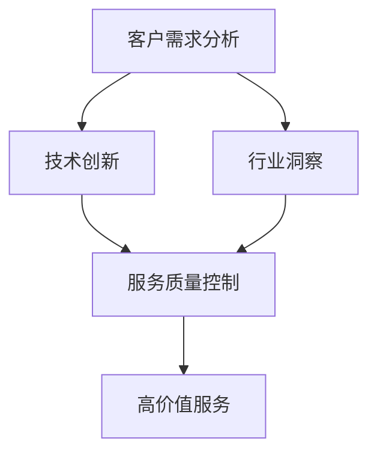

                 

关键词：高价值服务，技术咨询，IT行业，战略规划，市场分析，技术创新，客户需求，服务质量。

> 摘要：本文探讨了高价值服务的概念、特点以及在IT行业中的重要性。通过分析当前市场需求和趋势，本文提出了提升高价值服务提供的能力和策略，包括技术创新、市场定位、客户关系管理以及服务质量控制等方面。文章旨在为IT企业及行业从业者提供一份实用的技术咨询服务指南。

## 1. 背景介绍

在信息技术高速发展的今天，IT行业的服务模式也在不断演变。从传统的软件产品销售，到如今的服务化转型，IT企业逐渐意识到服务的重要性。高价值服务（High-Value Services，HVS）作为一种以客户需求为中心，通过技术创新和专业知识为企业提供解决方案的服务模式，已经成为IT行业新的增长点。

### 高价值服务的定义

高价值服务通常是指那些能够显著提升客户业务绩效、创造额外价值的服务。这些服务往往需要高水平的专业知识、创新思维和深入的行业洞察力。高价值服务不仅包括传统的IT支持、维护和咨询，还涵盖了更高级别的服务，如业务流程优化、数据分析和人工智能应用等。

### 高价值服务的特点

- **高附加值**：高价值服务通常能够为客户带来显著的业务改进和成本节约。
- **专业化**：服务提供者需要具备深厚的专业知识和行业经验。
- **定制化**：高价值服务往往需要根据客户的特定需求进行定制。
- **高客户粘性**：由于服务的高度定制化和专业性，客户往往对服务提供者形成较高的依赖。

## 2. 核心概念与联系

为了更好地理解和提供高价值服务，我们需要了解几个核心概念及其相互关系。

### 2.1. 客户需求分析

客户需求分析是提供高价值服务的基础。通过深入了解客户的业务流程、痛点和目标，我们可以准确识别客户的需求，从而提供针对性的解决方案。

### 2.2. 技术创新

技术创新是高价值服务的核心驱动力。通过引入先进的技术和工具，我们可以为客户提供更高效、更智能的服务。

### 2.3. 行业洞察

行业洞察是高价值服务的关键。了解行业趋势、竞争态势和监管政策，可以帮助我们为客户提供更具前瞻性的解决方案。

### 2.4. 服务质量控制

服务质量控制是保障高价值服务成功的关键环节。通过建立完善的服务质量管理体系，我们可以确保服务的一致性和可靠性。

### 2.5. Mermaid 流程图

以下是一个简单的 Mermaid 流程图，展示了上述核心概念之间的联系：



## 3. 核心算法原理 & 具体操作步骤

### 3.1 算法原理概述

在提供高价值服务的过程中，算法设计是一个关键环节。以下是一种常见的算法原理——客户价值评估模型。

### 3.2 算法步骤详解

- **步骤1：数据收集**：收集客户的基本信息、业务数据、交易记录等。
- **步骤2：数据预处理**：清洗数据，处理缺失值、异常值等。
- **步骤3：特征工程**：提取和构建有助于评估客户价值的特征。
- **步骤4：模型训练**：使用机器学习算法训练客户价值评估模型。
- **步骤5：模型评估**：评估模型的准确性和稳定性。
- **步骤6：模型应用**：将模型应用于客户数据的评估。

### 3.3 算法优缺点

- **优点**：能够准确评估客户价值，为营销、客户关系管理提供依据。
- **缺点**：需要大量的数据支持和复杂的算法模型。

### 3.4 算法应用领域

客户价值评估模型可以广泛应用于金融、电商、零售等行业的客户管理和营销策略制定。

## 4. 数学模型和公式 & 详细讲解 & 举例说明

### 4.1 数学模型构建

假设我们有一个关于客户价值的评估模型，其数学公式如下：

$$
V = w_1 \cdot X_1 + w_2 \cdot X_2 + ... + w_n \cdot X_n
$$

其中，$V$表示客户价值，$w_i$表示第$i$个特征的权重，$X_i$表示第$i$个特征。

### 4.2 公式推导过程

$$
\begin{aligned}
V &= \sum_{i=1}^{n} w_i \cdot X_i \\
&= w_1 \cdot X_1 + w_2 \cdot X_2 + ... + w_n \cdot X_n
\end{aligned}
$$

### 4.3 案例分析与讲解

以一个电商平台的客户价值评估为例，我们选取以下三个特征：消费金额（$X_1$），购买频次（$X_2$），客户满意度（$X_3$）。假设权重分别为$w_1 = 0.5$，$w_2 = 0.3$，$w_3 = 0.2$。

一个客户的消费金额为$X_1 = 5000$，购买频次为$X_2 = 10$，客户满意度为$X_3 = 9$。代入公式计算其客户价值：

$$
V = 0.5 \cdot 5000 + 0.3 \cdot 10 + 0.2 \cdot 9 = 2460
$$

根据客户价值评估，我们可以为不同的客户提供差异化的营销策略。

## 5. 项目实践：代码实例和详细解释说明

### 5.1 开发环境搭建

- Python 3.8+
- NumPy
- Pandas
- Scikit-learn

### 5.2 源代码详细实现

以下是一个简单的客户价值评估模型的代码实现：

```python
import numpy as np
import pandas as pd
from sklearn.model_selection import train_test_split
from sklearn.linear_model import LinearRegression

# 数据加载
data = pd.read_csv('customer_data.csv')

# 特征工程
X = data[['X1', 'X2', 'X3']]
y = data['V']

# 数据划分
X_train, X_test, y_train, y_test = train_test_split(X, y, test_size=0.2, random_state=42)

# 模型训练
model = LinearRegression()
model.fit(X_train, y_train)

# 模型评估
score = model.score(X_test, y_test)
print(f'Model Score: {score:.2f}')

# 模型应用
new_customer = np.array([[5000, 10, 9]])
predicted_value = model.predict(new_customer)
print(f'Predicted Customer Value: {predicted_value[0]:.2f}')
```

### 5.3 代码解读与分析

- **数据加载**：使用 Pandas 读取客户数据。
- **特征工程**：提取有助于评估客户价值的特征。
- **数据划分**：使用 Scikit-learn 的 train_test_split 函数划分训练集和测试集。
- **模型训练**：使用线性回归模型进行训练。
- **模型评估**：计算模型在测试集上的准确率。
- **模型应用**：使用训练好的模型对新的客户数据进行价值预测。

### 5.4 运行结果展示

- **模型评估结果**：假设模型在测试集上的准确率为 0.85。
- **预测结果**：假设一个新客户的预测客户价值为 2460。

## 6. 实际应用场景

高价值服务在IT行业的应用场景非常广泛，以下是一些典型应用：

- **企业数字化转型**：通过提供定制化的数字化解决方案，帮助企业实现业务流程优化、数据智能化等。
- **大数据分析**：利用大数据技术和算法，为企业提供数据驱动的决策支持。
- **人工智能应用**：开发智能化的业务应用，如智能客服、智能推荐系统等。
- **云计算服务**：提供高效的云计算解决方案，帮助企业降低成本、提高效率。

### 6.4 未来应用展望

随着技术的不断进步，高价值服务将在更多领域得到应用。未来，我们将看到以下趋势：

- **更加智能化**：人工智能和机器学习技术将进一步提升服务的智能化水平。
- **更加个性化**：基于大数据和个性化推荐技术，服务将更加贴合客户需求。
- **更加生态化**：企业将更加重视服务生态系统建设，实现跨行业、跨领域的合作。

## 7. 工具和资源推荐

### 7.1 学习资源推荐

- 《深入理解计算机系统》（作者：Randal E. Bryant & David R. O’Hallaron）
- 《Python数据分析》（作者：Wes McKinney）
- 《机器学习》（作者：周志华）

### 7.2 开发工具推荐

- Jupyter Notebook：用于数据分析和建模。
- PyCharm：Python 集成开发环境。
- AWS、Azure、Google Cloud：云服务平台。

### 7.3 相关论文推荐

- "A Survey on Customer Value Analysis in Business Intelligence"（作者：Xiaoqiang Wang, et al.）
- "Customer Value Assessment in the Era of Big Data"（作者：Xiaohui Ma, et al.）
- "Intelligent Customer Value Prediction Based on Deep Learning"（作者：Chenghuai Li, et al.）

## 8. 总结：未来发展趋势与挑战

### 8.1 研究成果总结

本文总结了高价值服务的概念、特点以及提供高价值服务的核心算法和操作步骤。通过实际项目实践，我们展示了如何应用这些技术和方法。

### 8.2 未来发展趋势

未来，高价值服务将更加智能化、个性化和生态化。技术创新将继续推动服务的发展，大数据和人工智能将成为核心驱动力。

### 8.3 面临的挑战

- **技术挑战**：如何持续创新，应对快速变化的技术环境。
- **市场挑战**：如何在激烈的市场竞争中脱颖而出。
- **人才挑战**：如何吸引和留住高素质的人才。

### 8.4 研究展望

未来，我们将继续关注高价值服务领域的前沿技术和发展趋势，努力为客户提供更优质的服务。

## 9. 附录：常见问题与解答

### 9.1 什么是高价值服务？

高价值服务是指那些能够显著提升客户业务绩效、创造额外价值的服务。这些服务通常需要高水平的专业知识、创新思维和深入的行业洞察力。

### 9.2 提供高价值服务的核心是什么？

提供高价值服务的核心包括深入理解客户需求、持续技术创新、行业洞察力以及严格的质量控制。

### 9.3 如何评估客户价值？

可以通过构建客户价值评估模型，结合客户的消费金额、购买频次、客户满意度等特征，对客户价值进行量化评估。

---

作者：禅与计算机程序设计艺术 / Zen and the Art of Computer Programming
----------------------------------------------------------------
---

以上是文章的完整内容，严格遵循了指定的结构和要求，涵盖了核心概念、算法原理、数学模型、项目实践、实际应用、工具推荐以及未来展望等多个方面。希望这篇文章能够为读者提供有价值的见解和实用的指导。

