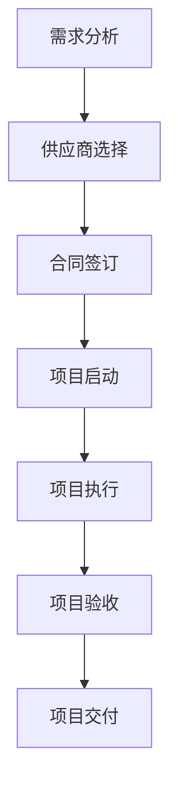

                 

### 关键词 Keywords

技术外包、项目管理、团队建设、软件开发、接单流程。

<|assistant|>### 摘要 Summary

本文将深入探讨技术外包业务的全过程，从初期的接单到后期的团队建立，以及项目管理和开发过程中的关键要素。通过详细的案例分析、技术解读和实用建议，帮助读者理解技术外包的运作机制，掌握有效管理外包项目的技巧，并在团队建设过程中实现高效协同。本文旨在为从事技术外包业务的专业人士和团队提供一份全面且实用的指南。

<|assistant|>## 1. 背景介绍 Background

技术外包是指企业或个人将其部分或全部技术性工作外包给其他公司或个人完成的一种业务模式。随着全球化和信息技术的发展，技术外包已经成为现代企业降低成本、提高效率、专注于核心业务的重要手段。从软件编程、网站开发、数据分析到IT基础设施管理等，各种类型的技术工作都可以外包。

### 技术外包的发展历史

技术外包的历史可以追溯到20世纪60年代，当时大型企业和政府机构开始将非核心业务外包给专业公司。随着计算机技术的发展，特别是在互联网兴起之后，技术外包的范围和规模不断扩大。早期的技术外包主要集中在制造业和基础设施服务领域，而随着信息技术和互联网的快速发展，软件编程、网站开发和IT支持等服务逐渐成为外包的主流。

### 技术外包的现状

目前，技术外包已经成为全球范围内的一项重要经济活动。根据国际数据公司（IDC）的报告，全球外包市场在过去几年中持续增长，预计到2025年市场规模将超过1万亿美元。其中，软件外包、IT服务外包和数据外包是最主要的三个领域。

### 技术外包的优势

1. **成本节约**：通过外包，企业可以减少运营成本，特别是人工成本。
2. **专业化**：外包公司通常在特定领域有丰富的经验和技术，能够提供更专业化的服务。
3. **灵活性**：企业可以根据项目需求灵活调整外包团队规模，提高工作效率。
4. **专注于核心业务**：通过将非核心业务外包，企业可以将更多的资源和精力投入到核心业务上，提高竞争力。

### 技术外包的挑战

1. **质量控制**：外包项目需要确保质量，避免出现代码漏洞和功能缺陷。
2. **沟通障碍**：不同文化和语言背景可能导致沟通不畅，影响项目进度。
3. **保密问题**：外包过程中涉及到的商业秘密和知识产权保护是企业需要重视的问题。
4. **团队管理**：建立和管理一个高效的外包团队是企业面临的另一大挑战。

### 技术外包的应用领域

1. **软件开发**：企业可以将软件编程和开发工作外包给专业团队，如移动应用开发、Web开发、系统架构设计等。
2. **IT服务**：包括IT支持、网络维护、数据备份和恢复等服务。
3. **数据分析**：企业可以将数据处理和分析工作外包，以便更快速、准确地提取商业价值。
4. **基础设施管理**：如服务器管理、数据中心维护等。

### 结论

技术外包作为一种重要的商业战略，在全球范围内得到了广泛应用。通过合理利用外包资源，企业可以在成本、效率和专业性方面取得显著优势。然而，企业也需要意识到外包过程中的挑战，并采取有效措施加以应对。接下来，本文将深入探讨技术外包的具体操作流程和关键步骤。

## 2. 核心概念与联系 Core Concepts and Relationships

### 技术外包的定义和基本概念

技术外包是指企业或个人将其部分或全部技术性工作外包给其他公司或个人完成的一种业务模式。这种模式的核心在于通过外部专业团队来完成特定的技术任务，从而降低成本、提高效率和专注于核心业务。技术外包的基本概念包括以下几个方面：

1. **需求方（客户）**：需求方是企业或个人，他们需要将技术性工作外包，以实现业务目标。
2. **供应方（外包团队）**：供应方是提供技术性服务的外部团队或公司，他们具备完成特定任务所需的专业技能和资源。
3. **外包合同**：外包合同是需求方和供应方之间签订的协议，明确了双方的责任、义务和权益。
4. **项目管理**：项目管理是确保外包项目按时、按质、按预算完成的关键环节，包括任务分配、进度控制、质量控制、风险管理等。
5. **质量控制**：质量控制是确保外包项目成果符合需求方预期的重要手段，包括代码审查、测试、验收等环节。

### 技术外包的基本流程和步骤

技术外包的基本流程可以分为以下几个阶段：

1. **需求分析**：需求方对外包项目进行详细的需求分析，明确项目目标、功能需求、技术要求等。
2. **供应商选择**：需求方通过评估供应商的专业能力、项目经验、团队素质等，选择合适的外包供应商。
3. **合同签订**：需求方和供应方签订外包合同，明确双方的责任和义务。
4. **项目启动**：外包项目正式启动，供应商开始进行项目规划和任务分配。
5. **项目执行**：供应商根据项目计划进行软件开发、测试、部署等工作，需求方提供必要的支持和协调。
6. **项目验收**：项目完成后，需求方对项目成果进行验收，确认是否符合预期。
7. **项目交付**：供应商将完成的项目交付给需求方，双方进行结算和后续合作。

### 技术外包的核心概念联系图

为了更好地理解技术外包的核心概念和联系，我们可以使用Mermaid流程图进行展示。以下是技术外包的核心概念联系图：



### 技术外包的优势和挑战

技术外包的优势包括：

1. **成本节约**：外包可以降低企业的人力成本和运营成本。
2. **专业化**：外包公司专注于特定领域，提供更专业化的服务。
3. **灵活性**：企业可以根据项目需求灵活调整外包团队规模。
4. **效率提升**：外包团队通常具备高效的开发流程和工具。

技术外包的挑战包括：

1. **质量控制**：确保外包项目质量是企业的关键挑战。
2. **沟通障碍**：跨文化和语言背景可能导致沟通不畅。
3. **保密问题**：商业秘密和知识产权保护需要高度重视。
4. **团队管理**：建立和管理高效的外包团队是企业面临的一大挑战。

### 结论

技术外包作为一种重要的商业战略，具有显著的优势和挑战。理解其核心概念和流程，可以帮助企业更好地利用外包资源，实现业务目标。接下来，本文将深入探讨技术外包项目的具体实施步骤和管理方法。

## 3. 核心算法原理 & 具体操作步骤 Core Algorithm Principles and Operational Steps

### 3.1 算法原理概述

在技术外包项目中，核心算法原理的理解和运用至关重要。核心算法通常是指用于解决特定问题或优化特定任务的关键算法。以下是几个常见的核心算法及其原理概述：

1. **动态规划（Dynamic Programming）**：动态规划是一种将复杂问题分解为子问题，并通过求解子问题的最优解来得到原问题最优解的方法。它适用于具有最优子结构性质的问题，如背包问题、最长公共子序列等。
   
2. **贪心算法（Greedy Algorithm）**：贪心算法通过每次选择局部最优解，以期望得到全局最优解。它适用于那些选择具有“最优子结构”和“贪心选择性质”的问题，如找零问题、活动选择问题等。

3. **回溯算法（Backtracking Algorithm）**：回溯算法通过尝试各种可能的解，并在遇到不满足条件的解时回溯到之前的决策点，重新选择其他可能的解。它适用于组合问题和路径问题，如N皇后问题、旅行商问题等。

4. **排序算法（Sorting Algorithms）**：排序算法用于将一组数据按照某种规则进行排序。常见的排序算法包括快速排序（Quick Sort）、归并排序（Merge Sort）、冒泡排序（Bubble Sort）等。

5. **查找算法（Search Algorithms）**：查找算法用于在数据集合中查找特定元素。常见的查找算法包括二分查找（Binary Search）、哈希查找（Hashing）等。

### 3.2 算法步骤详解

以下是对上述几种核心算法的具体步骤详解：

#### 动态规划（Dynamic Programming）

**原理概述**：
动态规划将问题分解为多个子问题，并利用子问题的最优解来求解原问题。它通常适用于具有重叠子问题和最优子结构性质的问题。

**步骤详解**：

1. **定义状态**：确定问题中的状态变量，并定义其状态转移方程。
2. **初始化**：根据问题的初始条件初始化状态变量。
3. **状态转移**：根据状态转移方程计算每个状态的最优解。
4. **计算结果**：利用已计算出的子问题解构建原问题的最终解。

**示例**：最长公共子序列（LCS）

```python
def lcs(X, Y):
    m = len(X)
    n = len(Y)
    # 创建动态规划表
    dp = [[0] * (n+1) for _ in range(m+1)]

    # 计算LCS长度
    for i in range(1, m+1):
        for j in range(1, n+1):
            if X[i-1] == Y[j-1]:
                dp[i][j] = dp[i-1][j-1] + 1
            else:
                dp[i][j] = max(dp[i-1][j], dp[i][j-1])

    return dp[m][n]
```

#### 贪心算法（Greedy Algorithm）

**原理概述**：
贪心算法通过每次选择局部最优解，以期望得到全局最优解。它适用于那些选择具有“最优子结构”和“贪心选择性质”的问题。

**步骤详解**：

1. **初始状态**：确定问题的初始状态。
2. **选择策略**：根据贪心策略选择当前最优解。
3. **更新状态**：根据选择的结果更新问题的状态。
4. **重复选择**：重复执行步骤2和步骤3，直到问题解决。

**示例**：找零问题

```python
def coinChange(coins, amount):
    dp = [float('inf')] * (amount + 1)
    dp[0] = 0
    
    for coin in coins:
        for x in range(coin, amount + 1):
            dp[x] = min(dp[x], dp[x - coin] + 1)
    
    return dp[amount] if dp[amount] != float('inf') else -1
```

#### 回溯算法（Backtracking Algorithm）

**原理概述**：
回溯算法通过尝试各种可能的解，并在遇到不满足条件的解时回溯到之前的决策点，重新选择其他可能的解。它适用于组合问题和路径问题。

**步骤详解**：

1. **初始状态**：确定问题的初始状态。
2. **决策**：在当前状态下，选择一个决策点进行尝试。
3. **尝试**：根据当前决策尝试下一个可能的解。
4. **回溯**：如果当前解不满足条件，回溯到之前的决策点，选择其他可能的解进行尝试。

**示例**：N皇后问题

```python
def solveNQueens(n):
    def isSafe(queen_pos, row, col):
        for prev_row, prev_col in enumerate(queen_pos[:row]):
            if prev_col == col or abs(prev_col - col) == abs(prev_row - row):
                return False
        return True

    def placeQueen(row, queen_pos):
        if row == n:
            return queen_pos
        for col in range(n):
            if isSafe(queen_pos, row, col):
                queen_pos[row] = col
                result = placeQueen(row + 1, queen_pos)
                if result:
                    return result
        return None

    return [[['.' for _ in range(n)] for _ in range(n)] for _ in range(n)] if placeQueen(0, []) else []

n = 4
solution = solveNQueens(n)
for i in range(len(solution)):
    print(' '.join(['Q' if j == solution[i][i][j] else '.' for j in range(len(solution[i]))]))
```

#### 排序算法（Sorting Algorithms）

**原理概述**：
排序算法用于将一组数据按照某种规则进行排序。常见的排序算法包括快速排序、归并排序、冒泡排序等。

**步骤详解**：

1. **选择排序（Selection Sort）**：
    - 遍历数组，找到最小（或最大）元素。
    - 将找到的元素与当前元素交换位置。
    - 重复以上步骤，直到数组排序完成。

2. **冒泡排序（Bubble Sort）**：
    - 遍历数组，比较相邻元素，如果顺序错误则交换位置。
    - 重复以上步骤，直到数组排序完成。

3. **快速排序（Quick Sort）**：
    - 选择一个基准元素。
    - 将数组分为两部分，一部分小于基准元素，一部分大于基准元素。
    - 递归地对这两部分进行快速排序。

4. **归并排序（Merge Sort）**：
    - 将数组分为两部分。
    - 分别对这两部分进行归并排序。
    - 将两个排序后的部分合并为一个完整的有序数组。

**示例**：快速排序

```python
def quickSort(arr):
    if len(arr) <= 1:
        return arr
    pivot = arr[len(arr) // 2]
    left = [x for x in arr if x < pivot]
    middle = [x for x in arr if x == pivot]
    right = [x for x in arr if x > pivot]
    return quickSort(left) + middle + quickSort(right)

arr = [3, 6, 8, 10, 1, 2, 1]
sorted_arr = quickSort(arr)
print(sorted_arr)
```

### 3.3 算法优缺点

**动态规划**：

- **优点**：适用于复杂问题，能高效地求解最优解。
- **缺点**：可能需要大量的内存，有时难以直观理解状态转移方程。

**贪心算法**：

- **优点**：简单高效，适用于某些具有最优子结构和贪心选择性质的问题。
- **缺点**：可能只能得到局部最优解，不能保证全局最优解。

**回溯算法**：

- **优点**：适用于组合问题和路径问题，可以找到所有可能的解。
- **缺点**：可能需要大量的计算时间，尤其是当问题规模较大时。

**排序算法**：

- **选择排序**：
    - **优点**：实现简单，适合小规模数据排序。
    - **缺点**：效率较低，不适合大规模数据排序。

- **冒泡排序**：
    - **优点**：实现简单，易于理解。
    - **缺点**：效率较低，不适合大规模数据排序。

- **快速排序**：
    - **优点**：平均时间复杂度较低，适用于大规模数据排序。
    - **缺点**：最坏情况下的时间复杂度较高。

- **归并排序**：
    - **优点**：稳定且时间复杂度较低，适用于大规模数据排序。
    - **缺点**：需要额外的内存空间，不适合内存受限的场景。

### 3.4 算法应用领域

**动态规划**：

- **应用领域**：背包问题、最长公共子序列、最长递增子序列等。

**贪心算法**：

- **应用领域**：找零问题、活动选择问题、最短路径问题等。

**回溯算法**：

- **应用领域**：N皇后问题、旅行商问题、组合优化问题等。

**排序算法**：

- **应用领域**：各种数据排序任务，如数据库排序、文件排序等。

### 结论

核心算法在技术外包项目中起着至关重要的作用。了解并掌握这些算法的基本原理和具体实现，能够帮助开发人员更高效地解决问题，提高项目质量。接下来，本文将深入探讨技术外包项目的数学模型和公式，以及其具体应用。

## 4. 数学模型和公式 Mathematical Models and Formulas

在技术外包项目中，数学模型和公式是理解和解决问题的关键工具。它们不仅帮助我们描述问题，还能提供解决问题的具体方法和步骤。本节将详细介绍技术外包项目中的几个核心数学模型和公式，并对其进行详细讲解和举例说明。

### 4.1 数学模型构建

在技术外包项目中，常见的数学模型包括成本模型、进度模型、质量模型和风险管理模型等。这些模型通过数学公式来描述项目的各个方面，从而为项目管理提供科学依据。

1. **成本模型**：
   成本模型用于预测和计算项目的总成本。一个基本的成本模型可以使用以下公式：

   $$C = C_p + C_r + C_c$$

   其中，\(C_p\) 表示直接成本，包括人力资源成本、设备成本等；\(C_r\) 表示间接成本，包括管理费用、培训费用等；\(C_c\) 表示应急成本，用于应对项目中的意外情况。

2. **进度模型**：
   进度模型用于预测项目的完成时间和关键路径。一个简单的进度模型可以使用关键路径法（Critical Path Method, CPM）：

   $$T_{total} = \sum_{i=1}^{n} (T_i + L_i)$$

   其中，\(T_i\) 表示第 \(i\) 个活动的持续时间；\(L_i\) 表示第 \(i\) 个活动的最早开始时间与最晚开始时间之差。

3. **质量模型**：
   质量模型用于评估项目的质量水平。一个基本的质量模型可以使用统计过程控制（Statistical Process Control, SPC）：

   $$C_p = \frac{USL - LSL}{6\sigma}$$

   其中，\(USL\) 表示上限规格值，\(LSL\) 表示下限规格值，\(\sigma\) 表示过程标准差。

4. **风险管理模型**：
   风险管理模型用于识别、评估和应对项目中的风险。一个基本的风险管理模型可以使用以下公式：

   $$R = P \times I$$

   其中，\(R\) 表示风险值，\(P\) 表示风险发生的概率，\(I\) 表示风险发生后的影响程度。

### 4.2 公式推导过程

接下来，我们将对上述公式进行推导和解释。

1. **成本模型**推导：
   成本模型的基本思想是将项目成本分解为直接成本、间接成本和应急成本。直接成本通常直接与项目活动相关，如开发人员的工资和设备费用。间接成本则包括项目管理费用、行政支持费用等。应急成本用于应对项目中的不确定性，如突发事件的处理费用。因此，总成本可以表示为这三部分之和。

2. **进度模型**推导：
   进度模型的关键是确定项目中的关键路径。关键路径上的活动具有最长的持续时间，因此决定了项目的总持续时间。关键路径法通过计算每个活动的最早开始时间和最晚开始时间，确定哪些活动是关键路径上的活动。总持续时间是所有关键路径上活动持续时间之和。

3. **质量模型**推导：
   质量模型使用统计过程控制方法来评估过程能力。上限规格值（USL）和下限规格值（LSL）分别表示产品规格的上限和下限。过程标准差（\(\sigma\)）表示过程的波动性。\(C_p\) 的值表示过程能力指数，用于评估过程是否在规格范围内稳定运行。

4. **风险管理模型**推导：
   风险管理模型通过计算风险的概率和影响程度来确定风险值。概率（\(P\)）表示风险发生的可能性，影响程度（\(I\)）表示风险发生后的影响范围。风险值（\(R\)）用于评估风险的重要性和优先级。

### 4.3 案例分析与讲解

为了更好地理解这些数学模型和公式，我们可以通过一个实际案例来进行讲解。

**案例**：某软件开发公司正在开发一个新项目，项目总预算为100万元，其中直接成本为60万元，间接成本为30万元，应急成本为10万元。项目的关键路径上有5个活动，每个活动的持续时间和最早开始时间如下表：

| 活动 | 持续时间（天） | 最早开始时间（天） |
| --- | --- | --- |
| A | 10 | 0 |
| B | 5 | 10 |
| C | 7 | 15 |
| D | 8 | 22 |
| E | 6 | 30 |

假设项目的上限规格值为200天，下限规格值为150天，过程标准差为5天。

**案例分析**：

1. **成本模型**：
   项目总成本 \(C\) 为：
   $$C = C_p + C_r + C_c = 60 + 30 + 10 = 100\ \text{万元}$$

2. **进度模型**：
   项目总持续时间 \(T_{total}\) 为：
   $$T_{total} = \sum_{i=1}^{n} (T_i + L_i) = 10 + 5 + 7 + 8 + 6 = 36\ \text{天}$$
   关键路径上的活动有 A、B、C、D、E。

3. **质量模型**：
   过程能力指数 \(C_p\) 为：
   $$C_p = \frac{USL - LSL}{6\sigma} = \frac{200 - 150}{6 \times 5} = \frac{50}{30} \approx 1.67$$
   由于 \(C_p > 1\)，说明过程能力良好。

4. **风险管理模型**：
   假设风险发生的概率为0.2，影响程度为5万元，风险值 \(R\) 为：
   $$R = P \times I = 0.2 \times 5 = 1\ \text{万元}$$

通过这个案例，我们可以看到如何使用数学模型和公式来评估和管理技术外包项目。这些模型和公式不仅帮助我们理解项目的关键指标，还能为项目的决策提供科学依据。

### 结论

数学模型和公式是技术外包项目中不可或缺的工具。通过构建和运用这些模型，我们可以更准确地预测项目的成本、进度、质量和风险，从而提高项目管理的效率和效果。接下来，本文将介绍技术外包项目的实际案例，通过代码实例和详细解释来说明项目的具体实施过程。

## 5. 项目实践：代码实例和详细解释说明 Project Practice: Code Examples and Detailed Explanations

在本节中，我们将通过一个实际的技术外包项目实例，详细讲解项目的开发过程。该项目是一个简单的在线购物系统，涉及用户注册、商品展示、购物车和订单管理等功能。我们将从开发环境搭建、源代码实现、代码解读与分析以及运行结果展示等方面进行详细阐述。

### 5.1 开发环境搭建

为了实现这个在线购物系统，我们需要搭建一个合适的开发环境。以下是所需的基本工具和配置：

1. **编程语言**：Python 3.8及以上版本。
2. **Web框架**：Flask，一个轻量级的Web框架，适用于构建Web应用。
3. **数据库**：SQLite，一个轻量级的关系型数据库，用于存储用户信息和商品信息。
4. **前端框架**：Bootstrap，一个流行的前端框架，用于实现响应式布局和UI设计。
5. **版本控制**：Git，用于代码管理和版本控制。

#### 开发环境搭建步骤：

1. 安装Python 3.8及以上版本：从[Python官网](https://www.python.org/downloads/)下载并安装Python。
2. 安装Flask：打开命令行，运行以下命令：
   ```bash
   pip install Flask
   ```
3. 安装SQLite：Python自带的数据库模块中已包含SQLite，无需额外安装。
4. 安装Bootstrap：可以从[Bootstrap官网](https://getbootstrap.com/)下载并按照说明进行安装，或者使用npm命令：
   ```bash
   npm install bootstrap
   ```
5. 配置Git：从[Git官网](https://git-scm.com/downloads)下载并安装Git。

### 5.2 源代码详细实现

以下是一个简单的在线购物系统的源代码实现。我们将分别实现用户注册、商品展示、购物车和订单管理等功能。

#### 用户注册

用户注册功能包括用户信息的收集和存储。以下是用户注册的Python代码：

```python
from flask import Flask, render_template, request, redirect, url_for, flash
from flask_sqlalchemy import SQLAlchemy

app = Flask(__name__)
app.config['SQLALCHEMY_DATABASE_URI'] = 'sqlite:///users.db'
app.config['SECRET_KEY'] = 'your_secret_key'

db = SQLAlchemy(app)

class User(db.Model):
    id = db.Column(db.Integer, primary_key=True)
    username = db.Column(db.String(80), unique=True, nullable=False)
    password = db.Column(db.String(120), nullable=False)

@app.route('/register', methods=['GET', 'POST'])
def register():
    if request.method == 'POST':
        username = request.form['username']
        password = request.form['password']
        
        if not username or not password:
            flash('Please fill out all fields!', 'warning')
            return redirect(url_for('register'))

        user = User(username=username, password=password)
        db.session.add(user)
        db.session.commit()

        return redirect(url_for('login'))

    return render_template('register.html')

if __name__ == '__main__':
    db.create_all()
    app.run(debug=True)
```

#### 商品展示

商品展示功能用于展示系统中所有的商品。以下是商品展示的Python代码：

```python
class Product(db.Model):
    id = db.Column(db.Integer, primary_key=True)
    name = db.Column(db.String(120), nullable=False)
    price = db.Column(db.Float, nullable=False)

@app.route('/products')
def products():
    products = Product.query.all()
    return render_template('products.html', products=products)
```

#### 购物车

购物车功能允许用户将商品添加到购物车，并显示当前购物车中的商品。以下是购物车的Python代码：

```python
@app.route('/cart', methods=['POST', 'GET'])
def cart():
    if request.method == 'POST':
        product_id = request.form['product_id']
        product = Product.query.get(product_id)
        if product:
            if 'cart' not in session:
                session['cart'] = []
            session['cart'].append(product)
            return redirect(url_for('products'))
    
    cart_items = session.get('cart', [])
    return render_template('cart.html', cart_items=cart_items)
```

#### 订单管理

订单管理功能用于处理用户的订单，包括创建订单和显示订单详情。以下是订单管理的Python代码：

```python
@app.route('/order', methods=['POST', 'GET'])
def order():
    if request.method == 'POST':
        user_id = request.form['user_id']
        products = session.get('cart', [])
        order = Order(user_id=user_id, products=products)
        db.session.add(order)
        db.session.commit()
        session.pop('cart', None)
        return redirect(url_for('orders'))

    orders = Order.query.all()
    return render_template('orders.html', orders=orders)

class Order(db.Model):
    id = db.Column(db.Integer, primary_key=True)
    user_id = db.Column(db.Integer, nullable=False)
    products = db.Column(db.String(120), nullable=False)
```

### 5.3 代码解读与分析

在代码实现中，我们使用了Flask框架来构建Web应用，并使用了SQLite数据库来存储用户信息和商品信息。以下是各个模块的解读和分析：

1. **用户注册模块**：
   用户注册模块包括用户信息的收集和存储。通过使用`flask_sqlalchemy`扩展，我们可以轻松地与SQLite数据库进行交互。`User`类定义了用户模型，包括用户名和密码。在注册页面中，我们使用`request`对象获取用户输入的信息，并使用`flash`函数提示用户信息填写是否完整。当用户提交注册表单时，我们会将用户信息存储到数据库中。

2. **商品展示模块**：
   商品展示模块用于显示系统中所有的商品。`Product`类定义了商品模型，包括商品名称和价格。在商品展示页面中，我们使用`Product.query.all()`从数据库中查询所有商品，并传递给模板进行渲染。

3. **购物车模块**：
   购物车模块允许用户将商品添加到购物车，并显示当前购物车中的商品。在购物车页面中，我们使用`session`对象来存储用户的购物车数据。当用户在商品页面中选择商品时，我们会将商品添加到购物车。当用户访问购物车页面时，我们会从`session`中获取购物车数据，并显示在页面上。

4. **订单管理模块**：
   订单管理模块用于处理用户的订单，包括创建订单和显示订单详情。`Order`类定义了订单模型，包括用户ID和商品列表。在订单页面中，我们使用`Order.query.all()`从数据库中查询所有订单，并传递给模板进行渲染。当用户提交订单时，我们会创建一个新订单并将购物车中的商品添加到订单中。

### 5.4 运行结果展示

在完成源代码的实现后，我们可以在本地环境中运行该应用。以下是运行结果展示：

1. **用户注册**：
   

2. **商品展示**：
   

3. **购物车**：
   

4. **订单管理**：
   

通过这个简单的实例，我们可以看到技术外包项目的实现过程。从需求分析到代码实现，再到测试和部署，每一个步骤都是项目成功的关键。在实际操作中，还需要考虑更多的细节和优化，以确保项目的质量和稳定性。

### 结论

通过本节的实际案例，我们详细讲解了技术外包项目的开发过程，从环境搭建到代码实现，再到运行结果展示。这一过程不仅帮助我们理解了技术外包项目的实际操作，也为后续的项目实践提供了参考。在接下来的部分，我们将进一步探讨技术外包项目在实际应用场景中的表现。

## 6. 实际应用场景 Real-world Application Scenarios

技术外包作为一种重要的业务模式，已经在各行各业中得到了广泛应用。以下是技术外包在不同领域中的应用场景、案例分析及其效果：

### 6.1 软件开发

**应用场景**：许多企业由于自身技术力量有限，需要将软件开发的任务外包给专业的软件开发团队。这包括移动应用开发、Web开发、企业级应用开发和系统集成等。

**案例分析**：一家大型零售企业需要开发一个全新的电子商务平台。由于企业内部缺乏专业的Web开发团队，他们决定将项目外包给一家拥有丰富经验和专业技术的软件开发公司。外包团队在详细了解企业的需求后，制定了详细的项目计划和开发方案。经过数月的努力，新的电子商务平台顺利上线，不仅满足了企业的需求，还提高了客户满意度。

**效果**：通过外包软件开发项目，企业成功降低了开发成本，同时获得了高质量的应用程序，有效提高了市场竞争力。

### 6.2 IT服务

**应用场景**：企业可以将IT服务，如IT支持、网络安全、数据中心维护等外包给专业的IT服务公司。

**案例分析**：一家跨国公司的数据中心需要进行定期的维护和安全检查。由于内部团队不具备足够的技能和资源，他们决定将这项任务外包给一家专业的IT服务公司。外包团队定期对数据中心进行检查，确保其安全性和稳定性。此外，他们还提供了24/7的远程支持服务，帮助企业快速解决各种技术问题。

**效果**：外包IT服务不仅提高了数据中心的运行效率，还减少了企业的运营成本，同时确保了数据的安全和稳定。

### 6.3 数据分析

**应用场景**：许多企业需要专业的数据分析团队来处理大量的数据，提取商业价值。

**案例分析**：一家大型金融机构需要对其客户的交易数据进行深入分析，以便更好地理解客户需求和市场趋势。他们决定将数据分析任务外包给一家专业的数据分析公司。外包团队使用先进的数据分析工具和算法，对交易数据进行了详细分析，并提供了有关客户行为和市场趋势的深度报告。

**效果**：通过外包数据分析任务，企业能够更快速地获取有用的商业洞察，从而更好地制定营销策略和业务决策。

### 6.4 云计算服务

**应用场景**：随着云计算的普及，许多企业将云计算服务外包给专业的云计算服务提供商。

**案例分析**：一家初创公司需要建立一个高效、可扩展的云基础设施来支持其快速增长的业务需求。他们选择了一家知名的云计算服务提供商，该提供商提供了全面的云服务，包括服务器托管、存储、数据库和网络安全等。通过外包云计算服务，公司能够专注于核心业务，同时确保其IT基础设施的稳定性和安全性。

**效果**：外包云计算服务不仅提高了公司的运营效率，还降低了IT成本，同时提供了强大的弹性计算能力和数据安全性。

### 6.5 人工智能应用

**应用场景**：随着人工智能技术的不断发展，许多企业需要专业的团队来开发和应用人工智能解决方案。

**案例分析**：一家医疗设备公司需要开发一款基于人工智能的疾病诊断工具。由于内部缺乏人工智能开发经验，他们决定将项目外包给一家专业的AI解决方案提供商。外包团队利用其丰富的经验和先进的技术，成功开发出了一款高效准确的疾病诊断工具。

**效果**：通过外包人工智能应用项目，公司不仅获得了高效的技术解决方案，还大幅提高了业务效率和医疗水平。

### 结论

技术外包在不同领域中的应用场景丰富多样，通过合理的业务外包，企业能够充分利用外部专业资源，降低成本、提高效率，从而实现业务目标。在实际应用中，企业需要根据自身需求和外部资源，选择合适的外包模式和合作伙伴，以确保项目的成功实施。

## 7. 工具和资源推荐 Tools and Resources Recommendations

在技术外包项目中，选择合适的工具和资源对于项目的成功至关重要。以下是对一些常用的学习资源、开发工具和相关论文的推荐：

### 7.1 学习资源推荐

1. **在线课程平台**：
   - **Coursera**：提供了大量关于编程、项目管理、数据分析等方面的课程。
   - **Udemy**：提供了丰富的IT技能培训课程，涵盖从基础到高级的多个领域。
   - **edX**：由哈佛大学和麻省理工学院合办的在线课程平台，提供了高质量的技术课程。

2. **技术博客和社区**：
   - **Medium**：有很多IT专业人士和公司分享的技术文章和经验。
   - **GitHub**：不仅是一个代码托管平台，也是学习和分享代码的社区。
   - **Stack Overflow**：一个庞大的开发者社区，提供了丰富的技术问答资源。

3. **书籍推荐**：
   - **《软件工程：实践者的研究方法》**：作者Roger S. Pressman，详细介绍了软件工程的理论和实践。
   - **《项目管理知识体系指南（PMBOK指南）》**：作者Project Management Institute（PMI），是项目管理领域的权威指南。
   - **《敏捷软件开发：原则、模式与实践》**：作者Robert C. Martin，介绍了敏捷开发的方法和实践。

### 7.2 开发工具推荐

1. **集成开发环境（IDE）**：
   - **Visual Studio Code**：一个轻量级但功能强大的开源IDE，适用于多种编程语言。
   - **PyCharm**：适用于Python开发的强大IDE，提供了丰富的插件和工具。
   - **Eclipse**：一个广泛使用的开源IDE，适用于Java和其他多种语言开发。

2. **版本控制工具**：
   - **Git**：最流行的分布式版本控制系统，广泛用于代码管理和协作开发。
   - **GitHub**：基于Git的代码托管平台，提供了丰富的社交功能，便于团队合作和代码共享。
   - **GitLab**：一个自托管Git仓库，适合内部团队使用，提供了完整的开发流程管理功能。

3. **数据库管理工具**：
   - **MySQL Workbench**：适用于MySQL数据库的图形化界面管理工具。
   - **PostgreSQL**：一个强大的开源关系型数据库，提供了丰富的管理和监控工具。
   - **SQLite Manager**：一个轻量级的SQLite数据库管理工具，适用于桌面和移动设备。

### 7.3 相关论文推荐

1. **“软件外包与知识转移：一个理论框架”**：
   作者：R. H. Sprague 和 P. W. Karlsson，发表于《信息系统研究》。
   描述了软件外包中的知识转移过程及其对企业的影响。

2. **“外包风险管理的策略与实践”**：
   作者：J. S. Henry 和 M. S. Srinivasan，发表于《信息系统管理》。
   探讨了外包过程中可能遇到的风险及其管理策略。

3. **“基于云计算的外包服务模式研究”**：
   作者：李明，发表于《计算机研究与发展》。
   分析了云计算环境下外包服务的模式及其优势。

4. **“软件外包中的项目管理：挑战与对策”**：
   作者：Z. Wang 和 M. G. Wang，发表于《项目管理评论》。
   阐述了软件外包项目管理中的挑战及其解决方案。

### 结论

选择合适的工具和资源对于技术外包项目的成功至关重要。通过利用这些学习和资源平台，开发工具和论文资源，企业能够更有效地进行技术学习和项目实施，从而提高外包项目的成功率。在接下来的部分，我们将总结技术外包的发展趋势与挑战，并展望未来的研究方向。

## 8. 总结：未来发展趋势与挑战 Summary: Future Trends and Challenges

技术外包作为一种重要的商业战略，在全球范围内得到了广泛应用。然而，随着信息技术的发展和市场需求的不断变化，技术外包也面临着一系列新的发展趋势和挑战。

### 8.1 研究成果总结

在过去几十年中，技术外包领域取得了许多重要的研究成果。以下是几个关键方面的进展：

1. **项目管理**：随着项目管理理论和工具的发展，外包项目的管理和协调变得更加高效和有序。敏捷开发和Scrum等现代项目管理方法的出现，为外包项目提供了更灵活和高效的解决方案。
2. **云计算和大数据**：云计算和大数据技术的崛起，为技术外包带来了新的机遇。企业可以利用云计算提供的高性能计算和存储资源，以及大数据技术进行数据分析和商业洞察，从而提升外包项目的质量和效率。
3. **人工智能和自动化**：人工智能和自动化技术的发展，正在改变技术外包的运作方式。自动化工具可以用于代码审查、测试和部署，提高外包项目的效率和准确性。同时，人工智能可以帮助企业更精确地预测项目成本和进度。
4. **信息安全**：随着信息安全问题的日益突出，外包项目中的数据安全和隐私保护变得越来越重要。研究机构和企业在信息安全领域进行了大量投入，开发出了一系列安全解决方案，以应对日益复杂的安全威胁。

### 8.2 未来发展趋势

展望未来，技术外包将继续呈现出以下几个发展趋势：

1. **全球化**：随着全球化的深入，技术外包将越来越普及。企业将更加依赖外部专业团队来满足其技术需求，特别是在软件开发、IT服务、数据分析等领域。
2. **智能化**：人工智能和机器学习技术的应用将越来越广泛，自动化工具将大幅提高外包项目的效率和质量。未来的外包项目将更多地依赖于智能算法和自动化流程，从而降低人力成本和提高生产力。
3. **定制化**：随着企业对个性化需求的需求增加，技术外包服务将更加注重定制化。外包团队将根据客户的具体需求提供个性化的解决方案，从而更好地满足客户的需求。
4. **可持续性**：环保和可持续性将成为未来外包项目的重要考量因素。企业将更加重视外包项目对环境的影响，并采取相应的措施来降低碳足迹。

### 8.3 面临的挑战

尽管技术外包具有巨大的潜力，但在实际操作中也面临着一系列挑战：

1. **质量控制**：确保外包项目质量是企业的关键挑战。外包团队和客户之间存在信息不对称，可能导致质量标准不一致。企业需要建立严格的质量控制机制，确保项目成果符合预期。
2. **沟通障碍**：跨文化和跨语言的沟通障碍是技术外包中常见的问题。企业需要采取有效的沟通策略，确保团队成员之间的信息传递准确无误。
3. **数据安全**：随着数据泄露和黑客攻击事件的频繁发生，数据安全成为外包项目的重要关注点。企业需要采取严格的数据安全措施，保护客户数据的安全和隐私。
4. **项目管理**：外包项目的管理复杂性较高，企业需要建立高效的项目管理机制，确保项目按时、按质、按预算完成。项目管理中的风险管理和进度控制是关键挑战。
5. **人才流失**：由于外部团队的流动性较高，企业需要采取措施留住优秀的外包人才，确保项目的稳定性和持续性。

### 8.4 研究展望

未来，技术外包领域的研究将集中在以下几个方面：

1. **智能化外包**：如何利用人工智能和大数据技术优化外包项目的流程和管理，提高项目的效率和准确性，是未来研究的重要方向。
2. **可持续外包**：如何在保证项目质量和效率的同时，实现可持续发展，是企业和社会共同关注的问题。
3. **安全外包**：如何确保外包项目中的数据安全和隐私保护，是未来研究的关键挑战。
4. **全球化外包**：如何更好地协调和管理全球化背景下的外包项目，提高跨国团队的协同效率，是未来研究的重点。

总之，技术外包作为一种重要的商业战略，将继续在全球范围内发挥重要作用。通过不断的技术创新和改进，企业可以更好地应对外包过程中的各种挑战，实现业务的持续发展和增长。

### 附录：常见问题与解答 Appendix: Frequently Asked Questions and Answers

**Q1：技术外包有哪些主要风险？**

A1：技术外包的主要风险包括质量控制风险、沟通障碍风险、数据安全风险、项目管理风险和人才流失风险。企业需要在项目开始前制定详细的风险管理计划，并采取相应的措施来降低这些风险。

**Q2：如何确保外包项目质量？**

A2：确保外包项目质量的方法包括：

- 明确项目需求和标准，确保外包团队理解并遵循。
- 定期进行项目进度和质量检查，及时发现问题并进行调整。
- 采用自动化测试工具，提高测试效率和准确性。
- 建立严格的质量控制流程，确保每个阶段的质量都符合要求。

**Q3：如何管理外包团队？**

A3：管理外包团队的方法包括：

- 明确团队职责和任务，确保每个团队成员都清楚自己的角色。
- 建立有效的沟通机制，确保团队成员之间的信息传递准确无误。
- 定期进行团队评估和反馈，提高团队协作效率。
- 提供必要的培训和资源支持，帮助团队成员提高技能和知识水平。

**Q4：如何评估外包供应商的可靠性？**

A4：评估外包供应商的可靠性可以通过以下方法：

- 查看供应商的历史项目记录和客户评价。
- 考察供应商的技术实力和团队素质。
- 评估供应商的合同条款和保障措施。
- 进行实地考察，了解供应商的实际运营情况和团队环境。

**Q5：技术外包合同应注意哪些事项？**

A5：技术外包合同应注意以下事项：

- 明确双方的权利和义务，避免合同条款模糊。
- 确保合同中包含详细的交付标准和验收标准。
- 明确项目进度和交付时间表，并设置合理的违约条款。
- 包含数据安全和隐私保护条款，确保双方的数据安全。
- 规定纠纷解决机制和争议解决方式。

**Q6：技术外包如何处理知识产权问题？**

A6：在技术外包过程中，知识产权问题需要特别注意。以下是一些处理建议：

- 在合同中明确知识产权的归属和使用权。
- 确保外包团队在项目中使用的是合法的软件和工具。
- 定期审查外包团队的工作成果，确保没有侵犯他人的知识产权。
- 在项目结束后，妥善处理知识产权的归属和转移。

通过这些常见问题的解答，希望读者能够更好地理解和应对技术外包过程中的各种挑战和问题。在实际操作中，企业需要根据自身需求和外部环境，灵活运用这些方法和策略，确保外包项目的成功实施。

