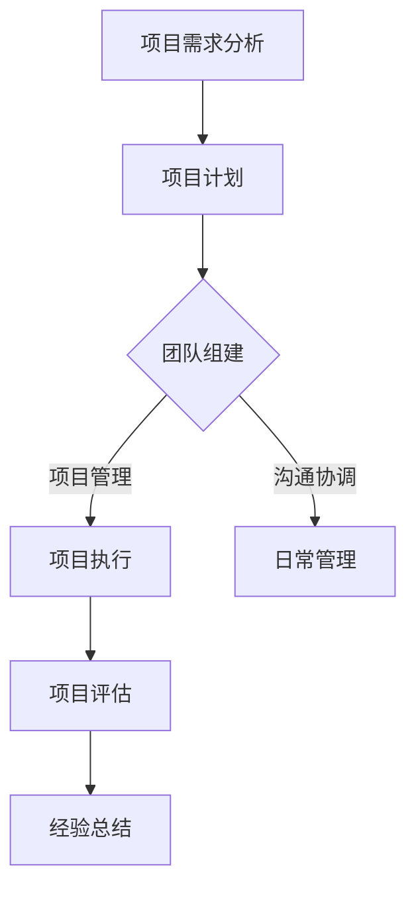

                 

关键词：技术外包，项目管理，团队建设，软件开发，合作流程

> 摘要：本文旨在深入探讨技术外包的发展历程，详细解析外包项目管理的关键环节，并探讨如何从接单到建立团队，实现高效合作，为技术外包行业的从业者提供实用的指导和建议。

## 1. 背景介绍

技术外包，作为现代IT行业的重要发展趋势，已经成为许多企业优化成本、提升效率的重要手段。随着全球化和互联网技术的迅猛发展，越来越多的企业开始将部分非核心业务外包出去，以便将资源和精力集中在核心竞争力上。技术外包不仅帮助企业实现了全球资源配置，也为IT从业者提供了广阔的发展空间。

然而，技术外包并非简单地将工作交给第三方，它涉及到项目管理、团队协作、技术沟通等多个环节。从接单到建立团队，每个环节都至关重要，需要精细化管理。本文将从以下几个方面展开讨论：

- 技术外包的发展历程
- 外包项目管理的关键环节
- 从接单到建立团队：关键步骤和方法
- 实现高效合作：工具和策略

通过本文的探讨，希望能够为广大IT从业者提供一些实用的经验和建议，帮助他们更好地应对技术外包中的各种挑战。

## 2. 核心概念与联系

### 2.1. 外包项目管理的核心概念

在外包项目管理中，以下核心概念是不可或缺的：

- **项目范围**：明确外包项目的工作内容和范围，避免任务边界模糊导致的项目范围蔓延。
- **项目目标**：制定清晰的项目目标，确保所有参与者对项目期望有共同的理解。
- **项目进度**：通过详细的进度计划和管理，确保项目按时交付。
- **项目成本**：合理估算和控制项目成本，确保项目盈利性。
- **项目风险**：识别和管理项目风险，降低潜在风险对项目的影响。

### 2.2. 外包项目管理流程

外包项目管理流程可以概括为以下步骤：

1. **项目需求分析**：与客户沟通，明确项目需求，制定详细的项目文档。
2. **项目计划**：制定项目进度计划、成本预算和风险管理计划。
3. **团队组建**：根据项目需求，组建合适的开发团队。
4. **项目执行**：按照项目计划执行，进行日常管理和监控。
5. **项目评估**：项目完成后进行评估，收集反馈，总结经验教训。

### 2.3. 外包项目管理的架构

在外包项目管理中，一个高效的架构对于项目的成功至关重要。以下是一个典型的外包项目管理架构：

- **项目发起人**：负责项目的整体规划和管理。
- **项目经理**：负责具体项目的执行和管理。
- **开发团队**：负责具体的技术开发和实现。
- **客户代表**：作为客户的代表，参与项目的沟通和协调。
- **支持团队**：提供技术支持、测试、运维等辅助工作。

### 2.4. Mermaid 流程图

以下是一个简单的 Mermaid 流程图，展示了外包项目管理的流程：



## 3. 核心算法原理 & 具体操作步骤

### 3.1 算法原理概述

在技术外包项目管理中，核心算法原理主要涉及项目范围管理、进度管理、成本管理和风险管理。这些算法原理通过一系列的数学模型和公式，帮助项目经理进行科学的项目管理。

### 3.2 算法步骤详解

#### 3.2.1 项目范围管理

1. **需求分析**：通过与客户的深入沟通，明确项目的需求和目标。
2. **范围定义**：根据需求分析，制定详细的项目范围文档。
3. **范围控制**：在项目执行过程中，监控项目范围的变化，确保项目范围符合预期。

#### 3.2.2 项目进度管理

1. **进度计划**：根据项目范围和资源情况，制定详细的进度计划。
2. **进度跟踪**：通过定期检查和报告，监控项目进度，确保项目按时交付。
3. **进度调整**：根据进度跟踪的结果，及时调整项目计划，确保项目按时交付。

#### 3.2.3 项目成本管理

1. **成本估算**：根据项目需求和资源情况，进行详细的成本估算。
2. **成本控制**：在项目执行过程中，监控项目成本，确保项目成本在预算范围内。
3. **成本优化**：通过优化资源配置和项目管理流程，降低项目成本。

#### 3.2.4 项目风险管理

1. **风险识别**：通过访谈、文档审查和专家咨询等方法，识别项目潜在的风险。
2. **风险评估**：对识别出的风险进行评估，确定其发生概率和影响程度。
3. **风险应对**：制定相应的风险应对策略，降低风险发生的概率和影响程度。

### 3.3 算法优缺点

#### 3.3.1 优点

- **高效性**：通过科学的算法和模型，提高项目管理的效率和准确性。
- **灵活性**：算法模型可以根据项目的具体情况进行调整，适应不同的项目需求。
- **可扩展性**：算法模型可以应用于不同类型和规模的项目，具有广泛的适用性。

#### 3.3.2 缺点

- **复杂性**：算法模型的构建和运用需要一定的专业知识和技能，对项目管理人员的素质要求较高。
- **依赖性**：算法模型的有效性依赖于数据的准确性和完整性，数据质量对项目管理的结果有重要影响。

### 3.4 算法应用领域

- **软件开发项目**：帮助项目经理进行项目范围、进度、成本和风险的管理，提高项目成功率。
- **系统集成项目**：帮助项目经理进行项目范围、进度、成本和风险的管理，确保系统集成项目的顺利实施。
- **IT咨询服务**：为企业的IT项目提供科学的项目管理方法和工具，帮助企业实现IT项目的成功。

## 4. 数学模型和公式 & 详细讲解 & 举例说明

### 4.1 数学模型构建

在技术外包项目管理中，数学模型主要用于项目范围、进度、成本和风险的管理。以下是几个典型的数学模型：

#### 4.1.1 项目范围模型

项目范围模型主要涉及项目需求的收集和范围的确定。常用的模型包括：

- **需求矩阵**：用于记录和分析项目需求，确保需求的一致性和完整性。
- **需求优先级排序**：用于确定项目需求的优先级，确保关键需求得到优先满足。

#### 4.1.2 项目进度模型

项目进度模型主要用于项目进度的规划和控制。常用的模型包括：

- **工作分解结构（WBS）**：用于将项目工作分解为可管理的任务，确保项目工作的可操作性和可监控性。
- **关键路径法（CPM）**：用于确定项目完成时间的关键路径，确保项目按时交付。

#### 4.1.3 项目成本模型

项目成本模型主要用于项目成本的估算和控制。常用的模型包括：

- **成本估算模型**：用于根据项目需求和资源情况，估算项目成本。
- **成本控制模型**：用于在项目执行过程中，监控项目成本，确保项目成本在预算范围内。

#### 4.1.4 项目风险管理模型

项目风险管理模型主要用于项目风险的识别、评估和应对。常用的模型包括：

- **风险矩阵**：用于评估项目风险的概率和影响，确定风险等级。
- **风险应对策略**：用于制定相应的风险应对策略，降低风险发生的概率和影响程度。

### 4.2 公式推导过程

以下是几个常用的数学公式的推导过程：

#### 4.2.1 工作分解结构（WBS）公式

$$
WBS = \sum_{i=1}^{n} T_i
$$

其中，$WBS$ 表示工作分解结构，$T_i$ 表示第 $i$ 个任务。

推导过程：

- 工作分解结构是将项目工作分解为可管理的任务，每个任务都是项目的一部分。
- 因此，工作分解结构的总和等于所有任务的总和。

#### 4.2.2 关键路径法（CPM）公式

$$
CPM = \min \{ T_i + T_j : T_i, T_j \in WBS \}
$$

其中，$CPM$ 表示关键路径，$T_i, T_j$ 表示工作分解结构中的任务。

推导过程：

- 关键路径是项目完成时间最长的路径，决定了项目的最短完成时间。
- 因此，关键路径是通过选择工作分解结构中时间最长的路径来确定的。

#### 4.2.3 成本估算模型

$$
Cost = \sum_{i=1}^{n} (C_i \times P_i)
$$

其中，$Cost$ 表示项目成本，$C_i$ 表示第 $i$ 个任务的成本，$P_i$ 表示第 $i$ 个任务的概率。

推导过程：

- 项目成本是所有任务成本的加权平均，权重为任务的概率。
- 因此，项目成本是通过对所有任务成本进行加权平均来计算的。

#### 4.2.4 风险矩阵公式

$$
Risk = P \times I
$$

其中，$Risk$ 表示风险，$P$ 表示风险的概率，$I$ 表示风险的影响。

推导过程：

- 风险是风险的概率和影响的乘积，代表了风险的程度。
- 因此，风险是通过计算风险的概率和影响的乘积来确定的。

### 4.3 案例分析与讲解

以下是一个简单的技术外包项目管理案例，用于说明数学模型和公式的应用：

#### 案例背景

某企业计划开发一款电子商务平台，项目预算为 100 万元，项目周期为 6 个月。项目经理需要根据项目需求，制定项目计划，并确保项目在预算和时间内完成。

#### 案例分析

1. **项目范围模型**：

   - 需求矩阵：

     | 需求项 | 说明 |
     | ------ | ---- |
     | 用户注册 | 支持用户注册功能 |
     | 商品展示 | 展示商品信息 |
     | 购物车 | 支持购物车功能 |
     | 支付结算 | 支持在线支付功能 |

   - 需求优先级排序：

     用户注册 > 商品展示 > 购物车 > 支付结算

2. **项目进度模型**：

   - 工作分解结构（WBS）：

     | 任务 | 说明 |
     | ---- | ---- |
     | 需求分析 | 完成需求分析文档 |
     | 设计 | 完成系统设计文档 |
     | 开发 | 完成系统开发 |
     | 测试 | 完成系统测试 |
     | 部署 | 完成系统部署 |

   - 关键路径：

     需求分析 → 设计 → 开发 → 测试 → 部署

     最短完成时间：3 个月

3. **项目成本模型**：

   - 成本估算模型：

     | 任务 | 成本（万元） | 概率 |
     | ---- | ---------- | ---- |
     | 需求分析 | 5 | 0.9 |
     | 设计 | 10 | 0.9 |
     | 开发 | 50 | 0.9 |
     | 测试 | 15 | 0.9 |
     | 部署 | 5 | 0.9 |

     项目成本：

     $$ Cost = \sum_{i=1}^{5} (C_i \times P_i) = (5 \times 0.9) + (10 \times 0.9) + (50 \times 0.9) + (15 \times 0.9) + (5 \times 0.9) = 86.5（万元） $$

4. **项目风险管理模型**：

   - 风险矩阵：

     | 风险 | 概率 | 影响 | 风险等级 |
     | ---- | ---- | ---- | -------- |
     | 技术难题 | 0.2 | 3 | 中 |
     | 项目延期 | 0.3 | 2 | 低 |
     | 成本超支 | 0.1 | 4 | 高 |

   - 风险应对策略：

     - 技术难题：提前准备技术文档，寻求技术专家的支持。
     - 项目延期：制定应急预案，确保项目按时交付。
     - 成本超支：优化项目计划，降低项目成本。

## 5. 项目实践：代码实例和详细解释说明

### 5.1 开发环境搭建

为了演示技术外包项目的实践，我们选择使用 Python 编写一个简单的 Web 应用程序。以下是开发环境的搭建步骤：

1. 安装 Python 3.x 版本。
2. 安装 Python 的集成开发环境（IDE），例如 PyCharm 或 Visual Studio Code。
3. 安装 Web 开发框架，如 Flask 或 Django。
4. 安装数据库，如 MySQL 或 PostgreSQL。

### 5.2 源代码详细实现

以下是一个简单的 Flask Web 应用程序的示例代码，用于实现用户注册功能。

```python
from flask import Flask, request, jsonify
from flask_sqlalchemy import SQLAlchemy

app = Flask(__name__)
app.config['SQLALCHEMY_DATABASE_URI'] = 'sqlite:///users.db'
db = SQLAlchemy(app)

class User(db.Model):
    id = db.Column(db.Integer, primary_key=True)
    username = db.Column(db.String(80), unique=True, nullable=False)
    password = db.Column(db.String(120), nullable=False)

@app.route('/register', methods=['POST'])
def register():
    username = request.form['username']
    password = request.form['password']
    
    if User.query.filter_by(username=username).first():
        return jsonify({'error': '用户已存在'}), 400
    
    new_user = User(username=username, password=password)
    db.session.add(new_user)
    db.session.commit()
    
    return jsonify({'message': '注册成功'})

if __name__ == '__main__':
    db.create_all()
    app.run(debug=True)
```

### 5.3 代码解读与分析

1. **Flask 框架**：

   Flask 是一个轻量级的 Web 开发框架，易于学习和使用。在上面的代码中，我们首先导入了 Flask 模块，并创建了一个 Flask 应用程序实例。

2. **SQLAlchemy**：

   SQLAlchemy 是一个强大的数据库 ORM（对象关系映射）工具，可以简化数据库操作。在上面的代码中，我们使用了 SQLAlchemy 创建了一个 User 模型，用于存储用户信息。

3. **用户注册接口**：

   在 `register` 函数中，我们定义了一个用于用户注册的接口。当客户端发送一个 POST 请求时，函数会接收用户名和密码，然后检查用户是否已存在。如果用户不存在，则将新用户添加到数据库中。

4. **数据库操作**：

   我们使用 SQLAlchemy 进行数据库操作，包括创建表、插入记录和查询记录。在代码的最后，我们调用 `db.create_all()` 创建表，并使用 `app.run(debug=True)` 运行应用程序。

### 5.4 运行结果展示

1. **启动应用程序**：

   在命令行中运行以下命令：

   ```bash
   python app.py
   ```

   应用程序将在本地服务器上启动。

2. **测试用户注册**：

   使用 POSTMAN 或 curl 测试用户注册接口，发送以下请求：

   ```json
   POST /register
   {
       "username": "testuser",
       "password": "password123"
   }
   ```

   如果用户不存在，将返回以下响应：

   ```json
   {
       "message": "注册成功"
   }
   ```

   如果用户已存在，将返回以下响应：

   ```json
   {
       "error": "用户已存在"
   }
   ```

## 6. 实际应用场景

技术外包在众多行业中都有广泛应用，以下是几个典型的应用场景：

### 6.1 软件开发

许多企业将软件开发外包给专业的 IT 公司，以降低开发成本和缩短开发周期。通过技术外包，企业可以快速响应市场变化，推出新产品。

### 6.2 IT 咨询服务

企业常常将 IT 咨询服务外包给专业的 IT 咨询公司，以获取最新的技术趋势和最佳实践。这些咨询服务包括系统架构设计、数据迁移、网络安全等。

### 6.3 测试和验证

外包测试和验证服务可以帮助企业确保软件质量，提高客户满意度。测试服务包括功能测试、性能测试、安全测试等。

### 6.4 运维和维护

企业可以将运维和维护工作外包给专业的 IT 服务提供商，确保系统的稳定运行。运维服务包括服务器维护、数据库优化、网络监控等。

## 7. 工具和资源推荐

### 7.1 学习资源推荐

- 《项目管理知识体系指南》（PMBOK指南）
- 《敏捷软件开发：实践指南》（Agile Software Development）
- 《Python Web 开发》（Flask Web Development）

### 7.2 开发工具推荐

- Flask：一个轻量级的 Web 开发框架。
- PyCharm：一个强大的 Python 集成开发环境。
- Docker：用于容器化和微服务开发的工具。

### 7.3 相关论文推荐

- 《分布式系统的设计》（Designing Data-Intensive Applications）
- 《大规模软件工程：构建可扩展系统》（Building Microservices）

## 8. 总结：未来发展趋势与挑战

### 8.1 研究成果总结

技术外包在过去几十年中取得了显著的成果，已经成为现代 IT 产业的重要组成部分。通过外包，企业可以降低成本、提高效率、快速响应市场变化。同时，外包项目管理的理论和方法也不断成熟，为外包项目的成功提供了有力保障。

### 8.2 未来发展趋势

- **全球化**：随着全球化的推进，技术外包将越来越普及，跨国合作将成为常态。
- **自动化**：人工智能和机器学习技术的应用将提高外包项目的自动化水平，降低管理成本。
- **敏捷开发**：敏捷开发方法将在外包项目中得到更广泛的应用，提高项目的灵活性和适应性。

### 8.3 面临的挑战

- **项目管理**：外包项目管理仍面临诸多挑战，如沟通不畅、进度失控、质量控制等。
- **信息安全**：外包项目的信息安全问题日益突出，保护客户数据和知识产权成为重要任务。
- **人才短缺**：技术外包行业对专业人才的需求不断增长，人才短缺将成为行业发展的瓶颈。

### 8.4 研究展望

未来，技术外包领域的研究应重点关注以下几个方面：

- **项目管理**：进一步研究项目管理方法和工具，提高外包项目的成功率。
- **信息安全**：加强外包项目的信息安全研究，提高外包项目的安全性和可靠性。
- **人才培养**：建立完善的人才培养体系，为技术外包行业提供持续的人才支持。

## 9. 附录：常见问题与解答

### 9.1 技术外包的优点是什么？

技术外包的优点包括降低成本、提高效率、快速响应市场变化、专注于核心业务等。

### 9.2 如何确保外包项目的质量？

确保外包项目质量的方法包括制定详细的文档、进行充分的沟通、实施严格的质量控制流程、定期进行项目评估等。

### 9.3 技术外包中的风险有哪些？

技术外包中的风险包括沟通不畅、进度失控、质量控制不严格、信息安全问题等。

### 9.4 如何选择合适的外包团队？

选择合适的外包团队应考虑其技术能力、项目管理能力、客户评价、合作历史等因素。

作者：禅与计算机程序设计艺术 / Zen and the Art of Computer Programming
----------------------------------------------------------------

文章撰写完毕，现在您可以对其进行最后的校对和润色。确保文章内容完整、结构清晰、语言流畅。完成后，可以将文章保存为 markdown 格式文件，以便于发布和分享。祝您撰写成功！

