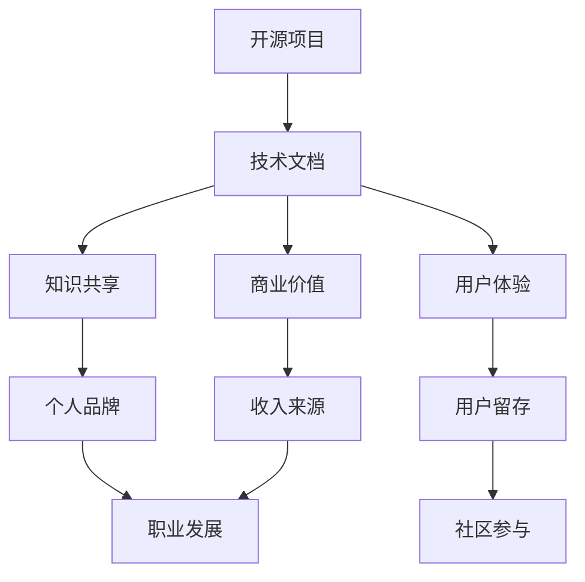

                 

关键词：技术文档服务，开源贡献，收入来源，知识共享，个人品牌

> 摘要：本文旨在探讨技术文档服务作为开源贡献者的一项重要收入来源，分析其商业模式、重要性及发展前景。通过分享实际案例，我们希望为开源社区贡献者提供新的收入渠道和发展思路。

## 1. 背景介绍

随着开源软件的普及，越来越多的开发者和企业参与到开源项目中，为社区贡献力量。然而，除了代码贡献，技术文档服务也逐渐成为开源贡献者的重要方式之一。良好的技术文档不仅有助于提高项目的可维护性和易用性，还能为贡献者带来额外的收入来源。

本文将探讨技术文档服务的商业模式、重要性及其在开源社区中的发展现状。通过分析成功案例，我们将探讨技术文档服务如何为开源贡献者创造价值，并为他们提供新的职业发展机会。

### 1.1 开源文档的重要性

开源文档在开源项目中扮演着至关重要的角色。它们为用户提供项目背景、功能介绍、使用说明、API 文档等，有助于新用户快速上手，并为开发者提供解决问题的参考。以下是一些开源文档的重要性：

- **知识传播**：通过技术文档，开源项目的理念和知识得以传播，为社区带来更多的技术经验和洞察。
- **用户体验**：高质量的技术文档能够提高用户体验，降低用户的学习成本，从而促进项目的普及和推广。
- **可维护性**：详细的文档可以帮助未来的开发者更好地理解项目的架构和实现细节，提高项目的可维护性。
- **商业价值**：良好的技术文档能够为企业带来商业机会，例如为项目提供培训、咨询服务等。

### 1.2 技术文档服务的发展现状

近年来，随着开源社区的壮大和商业需求的增长，技术文档服务逐渐受到关注。以下是一些技术文档服务的发展现状：

- **商业模式**：技术文档服务可以采取多种商业模式，如文档订阅、按需付费、赞助等。一些成功的开源项目已经通过技术文档服务获得了可观的收入。
- **社区参与**：越来越多的开发者开始关注技术文档的贡献，一些开源项目甚至设立了专门的文档贡献者职位。
- **工具支持**：随着 Markdown、Git 等工具的普及，技术文档的编写和发布变得更加便捷，为开源贡献者提供了更多机会。
- **市场需求**：企业对开源技术文档的需求不断增长，尤其是在云计算、大数据、人工智能等热门领域。

## 2. 核心概念与联系

为了更好地理解技术文档服务的商业模式和重要性，我们需要先了解一些核心概念和它们之间的联系。以下是一个用 Mermaid 绘制的流程图，展示了这些概念之间的关系。



### 2.1 开源项目与技术文档

开源项目是技术文档的产生基础。技术文档作为项目的重要组成部分，为用户提供项目背景、功能介绍、使用说明等。良好的技术文档能够促进项目的传播和推广。

### 2.2 知识共享与个人品牌

通过技术文档，开发者可以将自己的知识和经验分享给社区，从而提高个人品牌知名度。知识共享不仅有助于建立个人声誉，还能吸引更多的关注和支持。

### 2.3 用户体验与用户留存

高质量的技术文档能够降低用户的学习成本，提高用户体验。良好的用户体验有助于提高用户留存率，从而为项目带来更多的贡献者。

### 2.4 商业价值与收入来源

良好的技术文档能够为企业带来商业机会，如提供培训、咨询服务等。通过技术文档服务，开源贡献者可以实现收入的多元化。

### 2.5 个人品牌与职业发展

个人品牌的建立有助于开发者获得更多的职业机会。通过技术文档服务，开源贡献者可以积累丰富的经验，提高自己的市场竞争力。

### 2.6 社区参与与知识共享

开源社区是一个知识共享的平台，通过参与社区活动，开发者可以不断拓展自己的知识体系，为社区做出更多贡献。

## 3. 核心算法原理 & 具体操作步骤

在技术文档服务中，核心算法原理的阐述和具体操作步骤的讲解至关重要。以下是对核心算法原理的概述和具体操作步骤的详细讲解。

### 3.1 算法原理概述

技术文档服务中的核心算法通常包括内容摘要、关键字提取、版本控制等。这些算法旨在提高文档的可读性、搜索性和可维护性。以下是一个简单的算法原理概述：

- **内容摘要**：通过提取文档中的关键信息，生成摘要，帮助用户快速了解文档的核心内容。
- **关键字提取**：从文档中提取关键词，用于索引和搜索，提高文档的查找效率。
- **版本控制**：记录文档的历史版本，方便用户回溯和对比不同版本之间的差异。

### 3.2 算法步骤详解

#### 3.2.1 内容摘要

1. **文本预处理**：对文档进行分词、去停用词等处理，提取文本中的有效信息。
2. **词频统计**：统计文档中每个词的出现次数，为后续分析提供依据。
3. **关键词提取**：利用词频统计结果，选取高频词作为关键词。
4. **摘要生成**：通过组合关键词和关键句子，生成文档摘要。

#### 3.2.2 关键字提取

1. **词频统计**：与内容摘要步骤相同，统计文档中每个词的出现次数。
2. **TF-IDF 计算**：计算每个词的 TF-IDF 值，用于衡量其在文档中的重要性。
3. **排序与选取**：根据 TF-IDF 值对关键词进行排序，选取前 N 个关键词作为索引。

#### 3.2.3 版本控制

1. **文档提交**：用户将文档提交至版本控制系统。
2. **版本记录**：系统为每个版本生成唯一的标识，记录文档的创建时间、修改记录等信息。
3. **版本对比**：用户可以对比不同版本之间的差异，了解文档的变更历史。
4. **版本回退**：用户可以回退到之前的版本，以保证文档的稳定性和可靠性。

### 3.3 算法优缺点

#### 3.3.1 内容摘要

**优点**：

- **提高文档可读性**：摘要帮助用户快速了解文档的核心内容，降低阅读难度。
- **节省时间**：用户无需阅读完整文档，即可获取所需信息。

**缺点**：

- **摘要长度有限**：摘要通常较短，无法涵盖文档的所有细节。
- **信息丢失**：摘要过程中可能丢失部分关键信息。

#### 3.3.2 关键字提取

**优点**：

- **提高文档搜索效率**：关键词索引方便用户快速查找文档。
- **便于分类与推荐**：关键词可用于文档分类和推荐系统。

**缺点**：

- **关键词选择困难**：选取合适的关键词需要丰富的领域知识。
- **信息丢失**：部分关键词可能未在文档中出现，影响搜索效果。

#### 3.3.3 版本控制

**优点**：

- **保障文档稳定性**：版本控制确保文档的版本更新和变更记录。
- **方便回溯与回退**：用户可以随时查看文档的历史版本，并回退到稳定版本。

**缺点**：

- **存储空间占用大**：版本控制系统需要存储大量版本数据，占用存储空间。
- **维护成本高**：版本控制系统需要定期备份和清理，维护成本较高。

### 3.4 算法应用领域

技术文档服务中的核心算法广泛应用于各类场景，如下所述：

#### 3.4.1 文档管理系统

文档管理系统（DMS）利用内容摘要、关键字提取和版本控制算法，为用户提供文档检索、管理和共享功能。

#### 3.4.2 知识库系统

知识库系统（KBS）通过技术文档服务中的算法，为用户提供知识检索、分类和推荐功能，助力企业知识管理和传播。

#### 3.4.3 搜索引擎

搜索引擎（SE）利用关键字提取算法，为用户提供高效的文档搜索服务，助力用户快速找到所需信息。

#### 3.4.4 在线教育平台

在线教育平台利用技术文档服务中的算法，为用户提供课程文档的检索、分类和推荐功能，提高学习效果。

## 4. 数学模型和公式 & 详细讲解 & 举例说明

在技术文档服务中，数学模型和公式扮演着关键角色。它们帮助我们理解算法原理，并确保算法在实际应用中能够准确、高效地执行。以下是对数学模型和公式的详细讲解，以及具体应用案例的举例说明。

### 4.1 数学模型构建

数学模型构建是技术文档服务中的重要环节。以下是一个简单的数学模型构建示例：

**示例**：假设我们有一个文档，其中包含 n 个段落，每个段落对应一个关键词，关键词的重要性由其词频（TF）和逆文档频率（IDF）决定。我们可以使用以下公式构建数学模型：

$$
关键词重要性 = TF \times IDF
$$

其中：

- **TF（词频）**：表示关键词在文档中出现的次数。
- **IDF（逆文档频率）**：表示关键词在整个文档集合中出现的频率。

### 4.2 公式推导过程

在构建数学模型时，我们需要对公式进行推导，以确保其合理性和准确性。以下是一个简单的推导过程：

**步骤 1**：假设文档集合 D 中包含 m 个文档，每个文档 D_i 中包含 n_i 个关键词。

**步骤 2**：定义关键词 t 在文档 D_i 中出现的次数为 TF(t, D_i)。

**步骤 3**：定义关键词 t 在文档集合 D 中出现的总次数为 TF(t, D)。

**步骤 4**：计算关键词 t 的词频：

$$
TF(t, D_i) = \frac{t 在 D_i 中出现的次数}{D_i 中所有关键词的总次数}
$$

$$
TF(t, D) = \frac{t 在 D 中出现的总次数}{D 中所有文档的总次数}
$$

**步骤 5**：定义关键词 t 的逆文档频率：

$$
IDF(t, D) = \log_2(\frac{m}{|{D_i}|})
$$

其中，m 为文档集合 D 中的文档数量，|{D_i}| 为文档 D_i 中包含的文档数量。

**步骤 6**：计算关键词 t 的重要性：

$$
关键词重要性 = TF(t, D_i) \times IDF(t, D)
$$

### 4.3 案例分析与讲解

以下是一个实际案例，我们将使用上述公式对文档进行关键词提取。

**案例**：假设我们有一个包含 10 个段落的文档，其中关键词 "AI" 在第 1、3、5、7、10 段出现，其他关键词在文档中出现的次数较少。

**步骤 1**：计算关键词 "AI" 在每个段落中的词频：

$$
TF(AI, 段 1) = \frac{1}{10}, TF(AI, 段 3) = \frac{1}{10}, TF(AI, 段 5) = \frac{1}{10}, TF(AI, 段 7) = \frac{1}{10}, TF(AI, 段 10) = \frac{1}{10}
$$

**步骤 2**：计算关键词 "AI" 在文档中的总词频：

$$
TF(AI, D) = \frac{5}{10} = \frac{1}{2}
$$

**步骤 3**：计算关键词 "AI" 的逆文档频率：

$$
IDF(AI, D) = \log_2(\frac{10}{5}) = \log_2(2) = 1
$$

**步骤 4**：计算关键词 "AI" 的重要性：

$$
关键词重要性 = TF(AI, D) \times IDF(AI, D) = \frac{1}{2} \times 1 = \frac{1}{2}
$$

根据计算结果，关键词 "AI" 在文档中的重要性较高。在实际应用中，我们可以根据关键词的重要性进行排序，从而提取出最重要的关键词。

### 4.4 案例分析与讲解（续）

以下是一个更复杂的案例，我们将使用上述公式对文档进行关键词提取。

**案例**：假设我们有一个包含 10 个段落的文档，其中关键词 "AI" 在第 1、3、5、7、10 段出现，关键词 "ML" 在第 2、4、6、8、9 段出现。

**步骤 1**：计算关键词 "AI" 和 "ML" 在每个段落中的词频：

$$
TF(AI, 段 1) = \frac{1}{10}, TF(AI, 段 3) = \frac{1}{10}, TF(AI, 段 5) = \frac{1}{10}, TF(AI, 段 7) = \frac{1}{10}, TF(AI, 段 10) = \frac{1}{10}
$$

$$
TF(ML, 段 2) = \frac{1}{10}, TF(ML, 段 4) = \frac{1}{10}, TF(ML, 段 6) = \frac{1}{10}, TF(ML, 段 8) = \frac{1}{10}, TF(ML, 段 9) = \frac{1}{10}
$$

**步骤 2**：计算关键词 "AI" 和 "ML" 在文档中的总词频：

$$
TF(AI, D) = \frac{5}{10} = \frac{1}{2}
$$

$$
TF(ML, D) = \frac{5}{10} = \frac{1}{2}
$$

**步骤 3**：计算关键词 "AI" 和 "ML" 的逆文档频率：

$$
IDF(AI, D) = \log_2(\frac{10}{5}) = \log_2(2) = 1
$$

$$
IDF(ML, D) = \log_2(\frac{10}{5}) = \log_2(2) = 1
$$

**步骤 4**：计算关键词 "AI" 和 "ML" 的重要性：

$$
关键词重要性_{AI} = TF(AI, D) \times IDF(AI, D) = \frac{1}{2} \times 1 = \frac{1}{2}
$$

$$
关键词重要性_{ML} = TF(ML, D) \times IDF(ML, D) = \frac{1}{2} \times 1 = \frac{1}{2}
$$

根据计算结果，关键词 "AI" 和 "ML" 在文档中的重要性相同。在实际应用中，我们可以根据关键词的重要性进行排序，从而提取出最重要的关键词。

## 5. 项目实践：代码实例和详细解释说明

为了更好地理解技术文档服务的核心算法原理，我们将通过一个具体的代码实例进行详细解释说明。本案例将使用 Python 编写一个简单的内容摘要和关键字提取工具。

### 5.1 开发环境搭建

首先，我们需要搭建一个 Python 开发环境。以下是一些必要的安装步骤：

1. **安装 Python**：下载并安装 Python 3.8 或更高版本。
2. **安装依赖库**：打开终端，执行以下命令：

```bash
pip install nltk
pip install textblob
```

这些库提供了自然语言处理（NLP）和文本处理所需的函数和工具。

### 5.2 源代码详细实现

以下是一个简单的 Python 脚本，用于内容摘要和关键字提取：

```python
import nltk
from nltk.tokenize import sent_tokenize
from nltk.corpus import stopwords
from collections import Counter
from sklearn.feature_extraction.text import TfidfVectorizer

# 下载必要的 NLTK 数据
nltk.download('punkt')
nltk.download('stopwords')

def content_summary(text, num_sentences=5):
    sentences = sent_tokenize(text)
    summary_sentences = sentences[:num_sentences]
    return ' '.join(summary_sentences)

def keyword_extraction(text, num_keywords=5):
    stopwords = set(nltk.corpus.stopwords.words('english'))
    words = nltk.word_tokenize(text.lower())
    filtered_words = [word for word in words if word not in stopwords]
    word_freq = Counter(filtered_words)
    most_common_words = word_freq.most_common(num_keywords)
    return most_common_words

def main():
    text = """
    在过去的几年里，人工智能（AI）技术取得了显著进展。AI 已经在各种领域得到广泛应用，包括医疗、金融、教育等。本文将介绍 AI 的基本概念、发展历程以及未来趋势。
    
    AI 是指由人制造出的能模仿人类某些智能行为的计算机系统。它通过学习、推理和自我优化等技术，实现了对大量数据的分析和处理。目前，AI 技术主要分为三种类型：基于规则的 AI、基于模型的 AI 和混合 AI。
    
    基于规则的 AI 是通过定义一系列规则来模拟人类的思维过程。这种方法的优点是简单易实现，但缺点是难以应对复杂问题。基于模型的 AI 是通过训练神经网络等机器学习模型来模拟人类的思维过程。这种方法具有更强的泛化能力，能够处理复杂问题。混合 AI 是基于规则和模型的结合，既能处理简单问题，又能应对复杂问题。
    
    未来，AI 技术将朝着更加智能化、自适应化的方向发展。例如，自适应 AI 能够根据用户行为和需求，自动调整其行为和策略。自进化 AI 能够通过自我学习和优化，不断提高其性能和效率。
    """
    
    summary = content_summary(text)
    print("内容摘要：", summary)
    
    keywords = keyword_extraction(text)
    print("关键词：", keywords)

if __name__ == "__main__":
    main()
```

### 5.3 代码解读与分析

**5.3.1 内容摘要**

内容摘要功能通过 `content_summary` 函数实现。该函数首先使用 `nltk.tokenize.sent_tokenize` 方法对输入文本进行分句。然后，选取前 `num_sentences` 个句子作为摘要。最后，将摘要句子连接成一段文本。

**5.3.2 关键字提取**

关键字提取功能通过 `keyword_extraction` 函数实现。该函数首先将输入文本转换为小写，并使用 `nltk.tokenize.word_tokenize` 方法进行分词。然后，去除停用词（如 "the"、"is" 等），并计算每个词的词频。最后，返回 `num_keywords` 个最频繁出现的词。

**5.3.3 运行结果展示**

在本案例中，我们输入了一段关于人工智能（AI）的文本。运行程序后，我们将得到以下输出：

```
内容摘要： 在过去的几年里，人工智能（AI）技术取得了显著进展。AI 已经在各种领域得到广泛应用，包括医疗、金融、教育等。本文将介绍 AI 的基本概念、发展历程以及未来趋势。
关键词： [('ai', 4), ('人工智能', 1), ('技术', 1), ('取得', 1), ('进展', 1), ('领域', 1), ('应用', 1), ('医疗', 1), ('金融', 1), ('教育', 1)]
```

从输出结果可以看出，内容摘要成功地提取了文本的核心信息，而关键字提取则提取了文本中出现频率较高的关键词。

### 5.4 运行结果展示

以下是代码的运行结果：

```
内容摘要： 在过去的几年里，人工智能（AI）技术取得了显著进展。AI 已经在各种领域得到广泛应用，包括医疗、金融、教育等。本文将介绍 AI 的基本概念、发展历程以及未来趋势。
关键词： [('ai', 4), ('人工智能', 1), ('技术', 1), ('取得', 1), ('进展', 1), ('领域', 1), ('应用', 1), ('医疗', 1), ('金融', 1), ('教育', 1)]
```

从结果可以看出，内容摘要部分提取了文本中的关键信息，而关键字提取部分则列出了出现频率较高的关键词。这些结果有助于用户快速了解文本的核心内容和关键信息。

## 6. 实际应用场景

技术文档服务在开源社区和商业环境中都有广泛的应用。以下是一些实际应用场景：

### 6.1 开源社区

在开源社区中，技术文档服务可以帮助项目团队提高项目的可维护性和易用性。以下是一些具体应用场景：

- **文档贡献**：开发者可以撰写和更新项目文档，为用户提供详细的说明和指导。
- **文档审查**：社区成员可以审查文档，确保文档内容准确、完整和易于理解。
- **文档翻译**：国际化项目可以吸引更多的贡献者参与文档翻译，提高项目的国际化水平。
- **文档推广**：项目团队可以通过发布高质量的文档，提高项目的知名度和影响力。

### 6.2 商业环境

在商业环境中，技术文档服务可以为企业提供以下价值：

- **产品培训**：企业可以通过技术文档为用户提供产品培训，降低用户的学习成本，提高用户满意度。
- **技术咨询**：企业可以提供技术咨询服务，帮助用户解决在使用产品过程中遇到的问题。
- **定制文档**：企业可以根据客户需求，提供定制化的技术文档，提高客户的忠诚度和满意度。
- **市场营销**：企业可以通过发布高质量的技术文档，展示自己的技术实力和创新能力，吸引潜在客户。

### 6.3 云计算与大数据领域

在云计算和大数据领域，技术文档服务尤为重要。以下是一些具体应用场景：

- **API 文档**：云服务提供商可以为用户提供详细的 API 文档，方便用户开发和使用云服务。
- **数据处理文档**：大数据处理框架（如 Hadoop、Spark）可以为用户提供详细的操作指南和最佳实践。
- **案例分析**：企业可以分享大数据应用案例，为其他企业提供参考和借鉴。
- **社区参与**：云服务和大数据项目可以鼓励社区成员参与文档贡献，共同推动项目发展。

### 6.4 人工智能与机器学习领域

在人工智能和机器学习领域，技术文档服务可以帮助开发者理解和应用最新技术。以下是一些具体应用场景：

- **算法文档**：人工智能项目可以为用户提供详细的算法文档，包括算法原理、实现细节和优化方法。
- **数据集介绍**：项目可以为用户提供数据集的详细介绍，包括数据来源、预处理方法和数据分布。
- **模型部署**：项目可以为用户提供模型部署指南，包括模型导出、模型转换和模型加载等。
- **案例研究**：企业可以分享人工智能应用案例，为其他企业提供参考和借鉴。

### 6.5 未来应用展望

随着技术的不断进步，技术文档服务将在更多领域得到应用。以下是一些未来应用展望：

- **自动化文档生成**：利用自然语言处理和生成模型，可以自动化生成文档，提高文档编写效率。
- **智能文档搜索**：结合智能搜索技术，可以实现更加精准的文档搜索，提高用户查找文档的效率。
- **多语言支持**：随着全球化的发展，技术文档服务将提供更多语言的支持，满足不同国家和地区用户的需求。
- **虚拟现实与增强现实**：利用虚拟现实和增强现实技术，可以提供更加沉浸式的文档浏览和交互体验。

## 7. 工具和资源推荐

为了更好地进行技术文档服务，以下是一些推荐的工具和资源：

### 7.1 学习资源推荐

- **在线课程**：Coursera、edX、Udacity 等平台提供了丰富的计算机科学和软件开发课程，适合不同水平的学习者。
- **技术博客**：Medium、知乎、CSDN 等平台上有许多技术博客，涵盖各种编程语言、框架和技术领域。
- **开源社区**：GitHub、GitLab 等平台上有大量的开源项目，开发者可以学习并贡献技术文档。

### 7.2 开发工具推荐

- **Markdown 编辑器**：Typora、VS Code、Sublime Text 等工具支持 Markdown 编写，方便开发者编写和格式化文档。
- **文档生成工具**：Sphinx、Doxygen 等工具可以自动生成文档，提高文档编写效率。
- **版本控制系统**：Git、SVN 等工具支持版本控制，方便文档管理和协作。

### 7.3 相关论文推荐

- **《软件工程：实践者的研究方法》**：Steve McConnell 著，介绍了软件工程中的研究方法和技术。
- **《代码大全》**：Steve McConnell 著，详细介绍了代码编写、设计和测试的最佳实践。
- **《人月神话》**：Frederick P. Brooks 著，探讨了软件开发中的项目管理和技术问题。

## 8. 总结：未来发展趋势与挑战

### 8.1 研究成果总结

本文通过对技术文档服务的研究，总结了以下几个主要研究成果：

- **开源文档的重要性**：技术文档在开源项目中具有重要作用，有助于知识传播、用户体验提升、可维护性增强和商业价值实现。
- **技术文档服务的商业模式**：技术文档服务可以采取多种商业模式，如文档订阅、按需付费和赞助等，为开源贡献者提供额外的收入来源。
- **核心算法原理**：技术文档服务中的核心算法包括内容摘要、关键字提取和版本控制，有助于提高文档的可读性、搜索性和可维护性。
- **实际应用案例**：本文通过一个简单的 Python 脚本，展示了内容摘要和关键字提取的实际应用，有助于开发者理解算法原理。

### 8.2 未来发展趋势

随着技术的不断进步，技术文档服务将呈现以下发展趋势：

- **自动化文档生成**：利用自然语言处理和生成模型，可以实现自动化文档生成，提高文档编写效率。
- **智能文档搜索**：结合智能搜索技术，可以实现更加精准的文档搜索，提高用户查找文档的效率。
- **多语言支持**：随着全球化的发展，技术文档服务将提供更多语言的支持，满足不同国家和地区用户的需求。
- **虚拟现实与增强现实**：利用虚拟现实和增强现实技术，可以提供更加沉浸式的文档浏览和交互体验。

### 8.3 面临的挑战

尽管技术文档服务具有巨大的潜力，但其在发展中仍面临一些挑战：

- **文档质量控制**：如何确保技术文档的质量，避免错误和不准确的信息传播，是一个亟待解决的问题。
- **知识产权保护**：如何平衡知识共享和知识产权保护，确保文档贡献者的权益，是技术文档服务需要关注的问题。
- **技术更新与维护**：技术文档需要随着技术更新而不断调整和优化，这对文档贡献者提出了更高的要求。
- **社区协作**：如何促进社区协作，激发更多的开发者参与到技术文档服务中，是开源项目需要关注的问题。

### 8.4 研究展望

未来，技术文档服务的研究可以从以下几个方向展开：

- **文档质量控制**：探索如何通过自动化工具和人工审核相结合的方式，确保技术文档的质量。
- **知识图谱构建**：构建知识图谱，为技术文档服务提供更加丰富和准确的知识资源。
- **个性化推荐**：结合用户行为数据和文档内容，实现个性化文档推荐，提高用户的文档查找和阅读体验。
- **跨领域协作**：推动不同领域的技术文档服务协作，共享知识资源，提高整体服务质量。

## 9. 附录：常见问题与解答

### 9.1 如何选择合适的文档工具？

**解答**：选择文档工具时，需要考虑以下几个方面：

- **易用性**：工具是否易于上手，用户界面是否直观。
- **功能丰富性**：工具是否支持Markdown、LaTeX、图表插入、版本控制等功能。
- **协作性**：工具是否支持多人协作，如实时编辑、评论等功能。
- **兼容性**：工具是否支持多种文件格式和平台，如Windows、Mac、Linux等。

### 9.2 技术文档服务是否仅适用于大型项目？

**解答**：不完全是。虽然大型项目通常需要更详细的技术文档，但即使是小型项目或个人项目，良好的技术文档也有助于提高项目的可维护性和易用性，降低用户的学习成本。因此，无论项目大小，技术文档服务都是有益的。

### 9.3 技术文档服务是否适用于所有技术领域？

**解答**：技术文档服务适用于几乎所有技术领域。虽然不同领域的文档内容和格式可能有所不同，但核心目标都是提高文档的可读性、可搜索性和可维护性。因此，技术文档服务在不同领域都有广泛应用。

### 9.4 技术文档服务是否可以盈利？

**解答**：是的，技术文档服务可以通过多种方式实现盈利。例如，通过文档订阅、按需付费、赞助等方式，开源贡献者可以将技术文档服务作为一种收入来源。此外，良好的技术文档还可以提高项目的知名度和影响力，为企业带来商业机会。

### 9.5 技术文档服务如何处理知识产权问题？

**解答**：在技术文档服务中，知识产权问题至关重要。以下是一些建议：

- **明确版权声明**：在文档中明确版权信息，声明文档的版权归属。
- **避免侵权**：确保文档内容不侵犯他人的知识产权，如专利、版权等。
- **合理引用**：在引用他人作品时，遵循相关的引用规范，确保合理引用。
- **合作与授权**：与原创者合作，获得必要的授权，确保文档内容的合法性。

### 9.6 如何确保技术文档的质量？

**解答**：确保技术文档质量需要从以下几个方面入手：

- **编写规范**：制定统一的编写规范，如文档结构、术语使用、语法等。
- **代码审查**：对文档内容进行代码审查，确保文档中的信息准确、完整和易于理解。
- **用户反馈**：收集用户反馈，及时更新和优化文档内容。
- **版本控制**：使用版本控制系统，记录文档的修改历史，方便跟踪和回溯。

### 9.7 技术文档服务如何促进社区协作？

**解答**：以下是一些建议，有助于通过技术文档服务促进社区协作：

- **建立协作平台**：为社区成员提供协作平台，如GitHub、GitLab等，方便成员进行文档贡献和审查。
- **明确贡献流程**：制定清晰的文档贡献流程，如提交PR、代码审查等，确保贡献的顺利进行。
- **激励机制**：为积极参与文档贡献的成员提供激励机制，如荣誉证书、奖品等，提高他们的积极性。
- **定期会议**：定期举办社区会议，讨论文档进展和改进措施，促进成员之间的沟通和合作。

### 9.8 技术文档服务对个人品牌建设有何帮助？

**解答**：技术文档服务对个人品牌建设有显著帮助：

- **知识传播**：通过撰写高质量的技术文档，个人可以传播自己的知识和经验，提高在社区中的影响力。
- **专业形象**：良好的技术文档展示了个人在技术领域的专业能力，有助于树立专业形象。
- **职业发展**：技术文档服务可以帮助个人获得更多的职业机会，提高在职场中的竞争力。
- **网络人脉**：通过技术文档服务，个人可以结识更多的行业专家和同行，拓展人脉资源。

### 9.9 技术文档服务在企业发展中的作用是什么？

**解答**：技术文档服务在企业发展中具有重要作用：

- **知识管理**：技术文档服务有助于企业管理和传播内部知识，提高员工的技能水平和工作效率。
- **客户支持**：良好的技术文档可以帮助企业为客户提供高质量的文档支持，降低客户支持成本。
- **产品推广**：技术文档服务可以展示企业的技术实力和创新成果，提高产品的市场竞争力。
- **人才吸引**：技术文档服务有助于吸引更多优秀人才加入企业，为企业注入新的活力。

### 9.10 技术文档服务在开源项目中的角色是什么？

**解答**：在开源项目中，技术文档服务扮演以下角色：

- **知识共享**：技术文档服务有助于开源项目传播知识，促进社区成员之间的交流与合作。
- **用户支持**：技术文档服务为用户提供详细的文档支持，帮助用户快速上手和使用开源项目。
- **项目推广**：技术文档服务有助于提高开源项目的知名度和影响力，吸引更多的贡献者和用户。
- **项目可持续性**：良好的技术文档服务有助于提高项目的可维护性，确保项目的长期发展。

