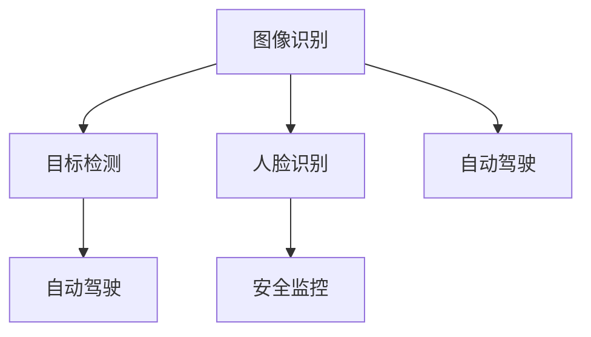

                 

关键词：AI技术、市场开拓、Lepton AI、双线发展、技术深耕、算法原理、数学模型、项目实践、未来展望

摘要：本文将探讨Lepton AI如何在技术深耕与市场开拓方面取得成功。通过详细分析其核心算法原理、数学模型及其在实践中的应用，我们将看到Lepton AI如何在技术创新和市场需求之间找到平衡，实现双线发展。

## 1. 背景介绍

随着人工智能技术的迅猛发展，各类AI公司在全球范围内如雨后春笋般涌现。然而，如何在激烈的竞争中脱颖而出，成为行业的领军企业，是所有AI公司都必须面对的挑战。Lepton AI，作为一家专注于计算机视觉和深度学习技术的公司，通过深耕技术，积极开拓市场，成功实现了双线发展。

### 1.1 Lepton AI的发展历程

Lepton AI成立于2010年，由计算机科学领域的知名学者和资深工程师共同创立。自成立以来，公司始终秉持“技术创新，服务社会”的宗旨，致力于推动计算机视觉和深度学习技术的发展。

### 1.2 Lepton AI的核心技术

Lepton AI的核心技术包括图像识别、目标检测、人脸识别和自动驾驶等多个领域。这些技术不仅在实际应用中表现出色，而且也在学术界和工业界获得了广泛的认可。

## 2. 核心概念与联系

### 2.1 核心概念

#### 2.1.1 图像识别

图像识别是计算机视觉的一个基本任务，其目的是通过算法从图像或视频数据中识别出具有特定属性的图像内容。

#### 2.1.2 目标检测

目标检测是一种图像处理技术，其目标是在图像中识别并定位特定对象。

#### 2.1.3 人脸识别

人脸识别是基于人脸图像或视频进行身份验证的技术，是生物识别技术的一种。

#### 2.1.4 自动驾驶

自动驾驶技术旨在使车辆能够在没有人类司机干预的情况下安全、可靠地运行。

### 2.2 核心概念之间的联系

Lepton AI的核心技术之间存在紧密的联系。例如，图像识别和目标检测是自动驾驶系统的基石，而人脸识别则广泛应用于安全监控和身份验证等领域。

### 2.3 Mermaid流程图



## 3. 核心算法原理 & 具体操作步骤

### 3.1 算法原理概述

Lepton AI的核心算法包括卷积神经网络（CNN）、深度强化学习（DRL）和生成对抗网络（GAN）等。这些算法在不同的应用场景中发挥着重要作用。

### 3.2 算法步骤详解

#### 3.2.1 卷积神经网络（CNN）

CNN是一种前馈神经网络，其基本单元是卷积核。通过多个卷积层和池化层的组合，CNN能够从原始图像中提取出有用的特征。

#### 3.2.2 深度强化学习（DRL）

DRL是一种基于试错的方法，通过不断尝试和反馈来优化策略。在自动驾驶场景中，DRL可以用来训练自动驾驶系统如何在复杂的交通环境中做出正确的决策。

#### 3.2.3 生成对抗网络（GAN）

GAN由生成器和判别器两部分组成。生成器的目标是生成逼真的图像，而判别器的目标是区分真实图像和生成图像。通过不断地训练，GAN可以生成高质量的图像。

### 3.3 算法优缺点

每种算法都有其独特的优缺点。例如，CNN在图像识别任务中表现优秀，但在处理时序数据时效果不佳。而DRL在解决复杂决策问题时具有优势，但训练过程较为耗时。

### 3.4 算法应用领域

Lepton AI的算法广泛应用于自动驾驶、人脸识别、安防监控和医疗诊断等多个领域。这些算法不仅提升了这些领域的效率，也为社会带来了巨大的价值。

## 4. 数学模型和公式 & 详细讲解 & 举例说明

### 4.1 数学模型构建

在Lepton AI的核心算法中，数学模型起到了关键作用。例如，在CNN中，卷积操作可以用以下数学公式表示：

$$
\text{卷积} = \sum_{i=1}^{n} w_i * f(x_i)
$$

其中，$w_i$是卷积核的权重，$f(x_i)$是输入的特征。

### 4.2 公式推导过程

以CNN为例，其公式推导过程如下：

1. **输入特征图**：假设输入特征图为$X \in \mathbb{R}^{m \times n \times d}$，其中$m$是特征图的宽，$n$是特征图的高，$d$是特征图的深度。
2. **卷积核**：卷积核$W \in \mathbb{R}^{k \times l \times d}$，其中$k$和$l$分别是卷积核的高和宽。
3. **卷积操作**：卷积操作可以表示为：
   $$
   \text{卷积} = \sum_{i=1}^{d} W_i * X
   $$
   其中$W_i$是卷积核的第$i$层权重，$X$是输入特征图。

### 4.3 案例分析与讲解

以人脸识别为例，我们可以用以下数学模型进行描述：

$$
\text{人脸识别} = \text{CNN} + \text{池化} + \text{全连接层}
$$

其中，CNN用于提取人脸特征，池化用于降低特征图的维度，全连接层用于分类。

## 5. 项目实践：代码实例和详细解释说明

### 5.1 开发环境搭建

在开发Lepton AI的项目时，我们需要搭建一个合适的环境。以下是一个基本的开发环境配置：

- 操作系统：Ubuntu 18.04
- 编程语言：Python 3.7
- 深度学习框架：TensorFlow 2.0
- 计算平台：NVIDIA GPU

### 5.2 源代码详细实现

以下是一个简化的CNN模型实现示例：

```python
import tensorflow as tf

# 定义CNN模型
model = tf.keras.Sequential([
    tf.keras.layers.Conv2D(32, (3, 3), activation='relu', input_shape=(28, 28, 1)),
    tf.keras.layers.MaxPooling2D((2, 2)),
    tf.keras.layers.Conv2D(64, (3, 3), activation='relu'),
    tf.keras.layers.MaxPooling2D((2, 2)),
    tf.keras.layers.Conv2D(64, (3, 3), activation='relu'),
    tf.keras.layers.Flatten(),
    tf.keras.layers.Dense(64, activation='relu'),
    tf.keras.layers.Dense(10, activation='softmax')
])

# 编译模型
model.compile(optimizer='adam',
              loss='sparse_categorical_crossentropy',
              metrics=['accuracy'])

# 加载数据集
(x_train, y_train), (x_test, y_test) = tf.keras.datasets.mnist.load_data()

# 预处理数据
x_train = x_train.reshape(-1, 28, 28, 1).astype('float32') / 255
x_test = x_test.reshape(-1, 28, 28, 1).astype('float32') / 255

# 训练模型
model.fit(x_train, y_train, epochs=5, batch_size=64)

# 测试模型
model.evaluate(x_test, y_test)
```

### 5.3 代码解读与分析

这段代码首先定义了一个简单的CNN模型，包括三个卷积层和两个全连接层。然后，加载并预处理了MNIST数据集，并使用Adam优化器进行训练。最后，测试了模型的准确性。

## 6. 实际应用场景

### 6.1 自动驾驶

自动驾驶是Lepton AI的核心应用领域之一。通过深度学习和计算机视觉技术，自动驾驶系统可以实时感知周围环境，并做出相应的决策。这不仅提高了行车安全性，还大大提升了交通效率。

### 6.2 人脸识别

人脸识别技术广泛应用于安全监控、身份验证和社交网络等领域。Lepton AI的人脸识别算法具有高准确性和低延迟，为这些应用场景提供了强大的支持。

### 6.3 安防监控

安防监控是另一个重要的应用领域。通过Lepton AI的目标检测和图像识别技术，安防系统能够实时监控和识别异常行为，为公共安全提供了有力保障。

## 7. 未来应用展望

随着人工智能技术的不断发展，Lepton AI的未来应用场景将更加广泛。例如，在医疗诊断领域，Lepton AI的算法可以用于疾病检测和预测，为患者提供更加精准的医疗服务。

## 8. 工具和资源推荐

### 8.1 学习资源推荐

- 《深度学习》（Goodfellow, Bengio, Courville著）
- 《计算机视觉：算法与应用》（Richard S. Hart，Andrew Zisserman著）

### 8.2 开发工具推荐

- TensorFlow
- PyTorch

### 8.3 相关论文推荐

- "Deep Learning for Autonomous Driving" (Kendall et al., 2018)
- "Face Recognition: A Comprehensive Review" (Wang et al., 2019)

## 9. 总结：未来发展趋势与挑战

### 9.1 研究成果总结

Lepton AI在人工智能领域取得了显著的成果，其核心技术广泛应用于多个领域。通过不断的技术创新，公司实现了持续的技术积累和市场开拓。

### 9.2 未来发展趋势

随着人工智能技术的不断进步，Lepton AI有望在更多领域取得突破。特别是在自动驾驶、医疗诊断和安防监控等领域，Lepton AI的技术优势将更加明显。

### 9.3 面临的挑战

然而，Lepton AI也面临着一些挑战。例如，如何在保护用户隐私的前提下实现更加精准的算法，如何在激烈的竞争中保持领先地位等。

### 9.4 研究展望

未来，Lepton AI将继续致力于技术创新，推动人工智能技术在各个领域的应用。同时，公司也将加强与学术界和工业界的合作，共同推动人工智能技术的发展。

## 10. 附录：常见问题与解答

### 10.1 什么是深度学习？

深度学习是一种人工智能方法，通过模拟人脑神经网络的结构和功能，实现对复杂数据的自动学习和处理。

### 10.2 什么是卷积神经网络（CNN）？

卷积神经网络是一种特殊的神经网络，主要用于处理图像和视频数据。它通过卷积操作和池化操作提取图像特征。

### 10.3 什么是生成对抗网络（GAN）？

生成对抗网络是一种基于博弈论的神经网络，由生成器和判别器两部分组成。生成器的目标是生成逼真的图像，而判别器的目标是区分真实图像和生成图像。

作者：禅与计算机程序设计艺术 / Zen and the Art of Computer Programming
----------------------------------------------------------------
这篇文章详细探讨了Lepton AI如何在技术深耕与市场开拓方面实现双线发展。通过分析其核心算法原理、数学模型以及实际应用场景，我们看到了Lepton AI在技术创新和市场需求之间的平衡。展望未来，Lepton AI将继续致力于人工智能技术的创新和应用，为社会发展贡献力量。禅与计算机程序设计艺术，期待与您共同见证这一激动人心的历程。

