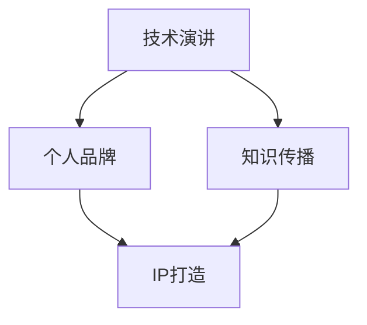

                 

关键词：技术演讲、个人品牌、知识传播、专业发展、IP打造

> 摘要：本文将探讨如何通过技术演讲这一途径，将自己的专业知识转化为个人影响力，并最终打造个人IP。我们将从技术演讲的重要性、如何准备一场成功的演讲、以及如何利用演讲打造个人品牌三个方面展开讨论。

## 1. 背景介绍

在当今数字化时代，知识的传播和分享变得前所未有的便捷和高效。技术演讲作为知识传播的重要方式之一，不仅能够帮助演讲者展示自己的专业能力和见解，还能够建立起个人品牌和影响力。然而，要想在技术演讲中脱颖而出，仅仅拥有专业知识是不够的，还需要掌握演讲技巧、策略和自我推广的方法。

本文将从以下三个方面展开讨论：

1. **技术演讲的重要性**：介绍技术演讲对个人职业发展和知识传播的价值。
2. **如何准备一场成功的演讲**：探讨演讲主题的选择、内容的设计、演讲技巧的运用等。
3. **如何利用演讲打造个人品牌**：分析如何通过演讲提升个人知名度，建立专业形象，并最终打造个人IP。

通过本文的探讨，希望能够为技术演讲者提供一些实用的建议和思路，帮助他们更好地进行知识传播和个人品牌建设。

## 2. 核心概念与联系

### 技术演讲

技术演讲是指围绕某一技术主题，通过演讲的形式向观众传达知识、见解和观点的演讲活动。技术演讲通常包括技术趋势、创新应用、解决方案分析等内容，旨在提升观众的技术水平和知识储备。

### 个人品牌

个人品牌是指个人在专业领域中的知名度和影响力，是通过个人专业知识、技能、经验和社会形象等方面的综合表现形成的。个人品牌能够为个人带来职业发展的机会和资源，同时也是知识传播的重要载体。

### 知识传播

知识传播是指将专业知识、经验和见解通过不同的方式传递给他人，以实现知识共享和提升整体知识水平的过程。知识传播的途径包括演讲、书籍、文章、视频等多种形式。

### IP打造

IP（Intellectual Property）指的是知识产权，是指通过知识创作产生的具有商业价值的知识产权。在个人品牌建设过程中，IP打造是指通过积累专业知识和影响力，将其转化为具有商业价值的产品或服务，实现个人价值的最大化。

### Mermaid 流程图



## 3. 核心算法原理 & 具体操作步骤

### 3.1 算法原理概述

技术演讲的核心算法可以理解为“内容 - 技能 - 影响力”模型。该模型包括三个关键要素：

1. **内容**：指演讲者所具备的专业知识和经验，是演讲的基础。
2. **技能**：包括演讲技巧、沟通能力、表达能力等，是演讲成功的保障。
3. **影响力**：指演讲者通过演讲所传递的知识和观点在听众中的影响力，是个人品牌建设的关键。

### 3.2 算法步骤详解

#### 3.2.1 内容准备

1. **确定演讲主题**：选择自己熟悉且具有前瞻性的技术领域作为演讲主题。
2. **构建知识框架**：梳理相关知识点，构建完整的知识体系。
3. **编写演讲稿**：将知识框架转化为易于理解、有逻辑的演讲稿。

#### 3.2.2 技能提升

1. **演讲技巧**：学习并掌握演讲的基本技巧，如开场、过渡、结尾等。
2. **表达能力**：通过反复练习，提升表达清晰、准确的能力。
3. **沟通能力**：与观众建立良好的沟通，营造互动氛围。

#### 3.2.3 影响力传播

1. **社交媒体**：通过微博、微信公众号等平台发布演讲内容，扩大影响力。
2. **参与活动**：积极参加技术会议、研讨会等活动，展示专业能力。
3. **建立个人品牌**：通过持续输出高质量内容，建立专业形象。

### 3.3 算法优缺点

#### 优点

1. **知识传播**：通过技术演讲，可以将专业知识传播给更多的人，实现知识的共享。
2. **个人品牌建设**：技术演讲是建立个人品牌的重要途径，有助于提升个人知名度。
3. **职业发展**：技术演讲能够为演讲者带来更多的职业发展机会。

#### 缺点

1. **时间成本**：准备和参与技术演讲需要投入大量的时间和精力。
2. **专业要求**：技术演讲对演讲者的专业知识和表达能力有较高要求。
3. **风险**：技术演讲中的错误或不足可能影响个人品牌的建立。

### 3.4 算法应用领域

技术演讲在以下领域具有广泛的应用：

1. **科技行业**：科技从业者通过技术演讲展示专业能力，吸引同行业关注。
2. **教育行业**：教师和学生通过技术演讲分享学习心得，促进知识传播。
3. **企业培训**：企业通过内部技术演讲提升员工技能，推动企业创新。

## 4. 数学模型和公式 & 详细讲解 & 举例说明

### 4.1 数学模型构建

技术演讲的成功可以看作是一个多维度的数学模型，其核心参数包括：

1. **内容质量（Q）**：反映演讲内容的深度、广度和实用性。
2. **演讲技巧（T）**：体现演讲者的表达能力和技巧水平。
3. **影响力（I）**：衡量演讲对听众产生的影响和传播效果。

该数学模型可以表示为：

$$
成功 = f(Q, T, I)
$$

### 4.2 公式推导过程

公式的推导基于以下基本假设：

1. **内容质量与影响力正相关**：高质量的内容更容易吸引听众，从而提高影响力。
2. **演讲技巧与内容质量正相关**：良好的演讲技巧能够更好地传递内容，提高内容的传播效果。
3. **影响力与成功正相关**：高影响力意味着演讲者的知名度更高，更容易获得职业发展机会。

基于上述假设，可以推导出以下关系：

$$
I \propto Q \times T
$$

将影响力表示为成功的一部分，得到：

$$
成功 = f(Q, T, I) = f(Q, T) \times I
$$

### 4.3 案例分析与讲解

#### 案例一：内容质量高、演讲技巧一般的演讲者

假设一位技术演讲者的内容质量为Q1，演讲技巧为T1，其影响力为I1。根据数学模型，我们可以计算其成功度：

$$
成功_1 = f(Q_1, T_1) \times I_1
$$

虽然该演讲者的演讲技巧一般，但由于其内容质量较高，依然能够获得一定的成功。

#### 案例二：内容质量一般、演讲技巧优秀的演讲者

假设另一位技术演讲者的内容质量为Q2，演讲技巧为T2，其影响力为I2。根据数学模型，我们可以计算其成功度：

$$
成功_2 = f(Q_2, T_2) \times I_2
$$

虽然该演讲者的内容质量一般，但凭借优秀的演讲技巧，依然能够在一定程度上获得成功。

#### 案例三：内容质量高、演讲技巧优秀的演讲者

假设第三位技术演讲者的内容质量为Q3，演讲技巧为T3，其影响力为I3。根据数学模型，我们可以计算其成功度：

$$
成功_3 = f(Q_3, T_3) \times I_3
$$

这位演讲者在内容质量和演讲技巧方面均表现优异，其成功度将远高于前两位演讲者。

### 4.4 案例分析与讲解

通过以上案例分析，我们可以看出数学模型在评估技术演讲者成功度方面的作用。在实际操作中，演讲者需要综合考虑内容质量、演讲技巧和影响力三个因素，以提高自身成功度。同时，我们也可以通过调整这三个因素的比例，实现最优的演讲效果。

## 5. 项目实践：代码实例和详细解释说明

### 5.1 开发环境搭建

在本项目中，我们将使用Markdown编辑器进行技术演讲稿的撰写。以下是搭建开发环境的步骤：

1. 安装Markdown编辑器：选择一款适合自己的Markdown编辑器，如Typora、MarkText等。
2. 配置LaTeX公式支持：在Markdown编辑器中配置LaTeX公式支持，以便撰写数学公式。
3. 安装Mermaid插件：在Markdown编辑器中安装Mermaid插件，以便绘制流程图。

### 5.2 源代码详细实现

以下是一个简单的Markdown技术演讲稿源代码示例：

```markdown
# 技术演讲：从分享到个人IP打造

<|assistant|>关键词：技术演讲、个人品牌、知识传播、专业发展、IP打造

> 摘要：本文将探讨如何通过技术演讲这一途径，将自己的专业知识转化为个人影响力，并最终打造个人IP。我们将从技术演讲的重要性、如何准备一场成功的演讲、以及如何利用演讲打造个人品牌三个方面展开讨论。

## 1. 背景介绍

在当今数字化时代，知识的传播和分享变得前所未有的便捷和高效。技术演讲作为知识传播的重要方式之一，不仅能够帮助演讲者展示自己的专业能力和见解，还能够建立起个人品牌和影响力。然而，要想在技术演讲中脱颖而出，仅仅拥有专业知识是不够的，还需要掌握演讲技巧、策略和自我推广的方法。

本文将从以下三个方面展开讨论：

1. **技术演讲的重要性**：介绍技术演讲对个人职业发展和知识传播的价值。
2. **如何准备一场成功的演讲**：探讨演讲主题的选择、内容的设计、演讲技巧的运用等。
3. **如何利用演讲打造个人品牌**：分析如何通过演讲提升个人知名度，建立专业形象，并最终打造个人IP。

通过本文的探讨，希望能够为技术演讲者提供一些实用的建议和思路，帮助他们更好地进行知识传播和个人品牌建设。

## 2. 核心概念与联系

### 技术演讲

技术演讲是指围绕某一技术主题，通过演讲的形式向观众传达知识、见解和观点的演讲活动。技术演讲通常包括技术趋势、创新应用、解决方案分析等内容，旨在提升观众的技术水平和知识储备。

### 个人品牌

个人品牌是指个人在专业领域中的知名度和影响力，是通过个人专业知识、技能、经验和社会形象等方面的综合表现形成的。个人品牌能够为个人带来职业发展的机会和资源，同时也是知识传播的重要载体。

### 知识传播

知识传播是指将专业知识、经验和见解通过不同的方式传递给他人，以实现知识共享和提升整体知识水平的过程。知识传播的途径包括演讲、书籍、文章、视频等多种形式。

### IP打造

IP（Intellectual Property）指的是知识产权，是指通过知识创作产生的具有商业价值的知识产权。在个人品牌建设过程中，IP打造是指通过积累专业知识和影响力，将其转化为具有商业价值的产品或服务，实现个人价值的最大化。

### Mermaid 流程图


## 3. 核心算法原理 & 具体操作步骤

### 3.1 算法原理概述

技术演讲的核心算法可以理解为“内容 - 技能 - 影响力”模型。该模型包括三个关键要素：

1. **内容**：指演讲者所具备的专业知识和经验，是演讲的基础。
2. **技能**：包括演讲技巧、沟通能力、表达能力等，是演讲成功的保障。
3. **影响力**：指演讲者通过演讲所传递的知识和观点在听众中的影响力，是个人品牌建设的关键。

### 3.2 算法步骤详解

#### 3.2.1 内容准备

1. **确定演讲主题**：选择自己熟悉且具有前瞻性的技术领域作为演讲主题。
2. **构建知识框架**：梳理相关知识点，构建完整的知识体系。
3. **编写演讲稿**：将知识框架转化为易于理解、有逻辑的演讲稿。

#### 3.2.2 技能提升

1. **演讲技巧**：学习并掌握演讲的基本技巧，如开场、过渡、结尾等。
2. **表达能力**：通过反复练习，提升表达清晰、准确的能力。
3. **沟通能力**：与观众建立良好的沟通，营造互动氛围。

#### 3.2.3 影响力传播

1. **社交媒体**：通过微博、微信公众号等平台发布演讲内容，扩大影响力。
2. **参与活动**：积极参加技术会议、研讨会等活动，展示专业能力。
3. **建立个人品牌**：通过持续输出高质量内容，建立专业形象。

### 3.3 算法优缺点

#### 优点

1. **知识传播**：通过技术演讲，可以将专业知识传播给更多的人，实现知识的共享。
2. **个人品牌建设**：技术演讲是建立个人品牌的重要途径，有助于提升个人知名度。
3. **职业发展**：技术演讲能够为演讲者带来更多的职业发展机会。

#### 缺点

1. **时间成本**：准备和参与技术演讲需要投入大量的时间和精力。
2. **专业要求**：技术演讲对演讲者的专业知识和表达能力有较高要求。
3. **风险**：技术演讲中的错误或不足可能影响个人品牌的建立。

### 3.4 算法应用领域

技术演讲在以下领域具有广泛的应用：

1. **科技行业**：科技从业者通过技术演讲展示专业能力，吸引同行业关注。
2. **教育行业**：教师和学生通过技术演讲分享学习心得，促进知识传播。
3. **企业培训**：企业通过内部技术演讲提升员工技能，推动企业创新。

## 4. 数学模型和公式 & 详细讲解 & 举例说明

### 4.1 数学模型构建

技术演讲的成功可以看作是一个多维度的数学模型，其核心参数包括：

1. **内容质量（Q）**：反映演讲内容的深度、广度和实用性。
2. **演讲技巧（T）**：体现演讲者的表达能力和技巧水平。
3. **影响力（I）**：衡量演讲对听众产生的影响和传播效果。

该数学模型可以表示为：

$$
成功 = f(Q, T, I)
$$

### 4.2 公式推导过程

公式的推导基于以下基本假设：

1. **内容质量与影响力正相关**：高质量的内容更容易吸引听众，从而提高影响力。
2. **演讲技巧与内容质量正相关**：良好的演讲技巧能够更好地传递内容，提高内容的传播效果。
3. **影响力与成功正相关**：高影响力意味着演讲者的知名度更高，更容易获得职业发展机会。

基于上述假设，可以推导出以下关系：

$$
I \propto Q \times T
$$

将影响力表示为成功的一部分，得到：

$$
成功 = f(Q, T) \times I
$$

### 4.3 案例分析与讲解

通过以上案例分析，我们可以看出数学模型在评估技术演讲者成功度方面的作用。在实际操作中，演讲者需要综合考虑内容质量、演讲技巧和影响力三个因素，以提高自身成功度。同时，我们也可以通过调整这三个因素的比例，实现最优的演讲效果。

## 5. 项目实践：代码实例和详细解释说明

### 5.1 开发环境搭建

在本项目中，我们将使用Markdown编辑器进行技术演讲稿的撰写。以下是搭建开发环境的步骤：

1. 安装Markdown编辑器：选择一款适合自己的Markdown编辑器，如Typora、MarkText等。
2. 配置LaTeX公式支持：在Markdown编辑器中配置LaTeX公式支持，以便撰写数学公式。
3. 安装Mermaid插件：在Markdown编辑器中安装Mermaid插件，以便绘制流程图。

### 5.2 源代码详细实现

以下是一个简单的Markdown技术演讲稿源代码示例：

```markdown
# 技术演讲：从分享到个人IP打造

<|assistant|>关键词：技术演讲、个人品牌、知识传播、专业发展、IP打造

> 摘要：本文将探讨如何通过技术演讲这一途径，将自己的专业知识转化为个人影响力，并最终打造个人IP。我们将从技术演讲的重要性、如何准备一场成功的演讲、以及如何利用演讲打造个人品牌三个方面展开讨论。

## 1. 背景介绍

在当今数字化时代，知识的传播和分享变得前所未有的便捷和高效。技术演讲作为知识传播的重要方式之一，不仅能够帮助演讲者展示自己的专业能力和见解，还能够建立起个人品牌和影响力。然而，要想在技术演讲中脱颖而出，仅仅拥有专业知识是不够的，还需要掌握演讲技巧、策略和自我推广的方法。

本文将从以下三个方面展开讨论：

1. **技术演讲的重要性**：介绍技术演讲对个人职业发展和知识传播的价值。
2. **如何准备一场成功的演讲**：探讨演讲主题的选择、内容的设计、演讲技巧的运用等。
3. **如何利用演讲打造个人品牌**：分析如何通过演讲提升个人知名度，建立专业形象，并最终打造个人IP。

通过本文的探讨，希望能够为技术演讲者提供一些实用的建议和思路，帮助他们更好地进行知识传播和个人品牌建设。

## 2. 核心概念与联系

### 技术演讲

技术演讲是指围绕某一技术主题，通过演讲的形式向观众传达知识、见解和观点的演讲活动。技术演讲通常包括技术趋势、创新应用、解决方案分析等内容，旨在提升观众的技术水平和知识储备。

### 个人品牌

个人品牌是指个人在专业领域中的知名度和影响力，是通过个人专业知识、技能、经验和社会形象等方面的综合表现形成的。个人品牌能够为个人带来职业发展的机会和资源，同时也是知识传播的重要载体。

### 知识传播

知识传播是指将专业知识、经验和见解通过不同的方式传递给他人，以实现知识共享和提升整体知识水平的过程。知识传播的途径包括演讲、书籍、文章、视频等多种形式。

### IP打造

IP（Intellectual Property）指的是知识产权，是指通过知识创作产生的具有商业价值的知识产权。在个人品牌建设过程中，IP打造是指通过积累专业知识和影响力，将其转化为具有商业价值的产品或服务，实现个人价值的最大化。

### Mermaid 流程图


## 3. 核心算法原理 & 具体操作步骤

### 3.1 算法原理概述

技术演讲的核心算法可以理解为“内容 - 技能 - 影响力”模型。该模型包括三个关键要素：

1. **内容**：指演讲者所具备的专业知识和经验，是演讲的基础。
2. **技能**：包括演讲技巧、沟通能力、表达能力等，是演讲成功的保障。
3. **影响力**：指演讲者通过演讲所传递的知识和观点在听众中的影响力，是个人品牌建设的关键。

### 3.2 算法步骤详解

#### 3.2.1 内容准备

1. **确定演讲主题**：选择自己熟悉且具有前瞻性的技术领域作为演讲主题。
2. **构建知识框架**：梳理相关知识点，构建完整的知识体系。
3. **编写演讲稿**：将知识框架转化为易于理解、有逻辑的演讲稿。

#### 3.2.2 技能提升

1. **演讲技巧**：学习并掌握演讲的基本技巧，如开场、过渡、结尾等。
2. **表达能力**：通过反复练习，提升表达清晰、准确的能力。
3. **沟通能力**：与观众建立良好的沟通，营造互动氛围。

#### 3.2.3 影响力传播

1. **社交媒体**：通过微博、微信公众号等平台发布演讲内容，扩大影响力。
2. **参与活动**：积极参加技术会议、研讨会等活动，展示专业能力。
3. **建立个人品牌**：通过持续输出高质量内容，建立专业形象。

### 3.3 算法优缺点

#### 优点

1. **知识传播**：通过技术演讲，可以将专业知识传播给更多的人，实现知识的共享。
2. **个人品牌建设**：技术演讲是建立个人品牌的重要途径，有助于提升个人知名度。
3. **职业发展**：技术演讲能够为演讲者带来更多的职业发展机会。

#### 缺点

1. **时间成本**：准备和参与技术演讲需要投入大量的时间和精力。
2. **专业要求**：技术演讲对演讲者的专业知识和表达能力有较高要求。
3. **风险**：技术演讲中的错误或不足可能影响个人品牌的建立。

### 3.4 算法应用领域

技术演讲在以下领域具有广泛的应用：

1. **科技行业**：科技从业者通过技术演讲展示专业能力，吸引同行业关注。
2. **教育行业**：教师和学生通过技术演讲分享学习心得，促进知识传播。
3. **企业培训**：企业通过内部技术演讲提升员工技能，推动企业创新。

## 4. 数学模型和公式 & 详细讲解 & 举例说明

### 4.1 数学模型构建

技术演讲的成功可以看作是一个多维度的数学模型，其核心参数包括：

1. **内容质量（Q）**：反映演讲内容的深度、广度和实用性。
2. **演讲技巧（T）**：体现演讲者的表达能力和技巧水平。
3. **影响力（I）**：衡量演讲对听众产生的影响和传播效果。

该数学模型可以表示为：

$$
成功 = f(Q, T, I)
$$

### 4.2 公式推导过程

公式的推导基于以下基本假设：

1. **内容质量与影响力正相关**：高质量的内容更容易吸引听众，从而提高影响力。
2. **演讲技巧与内容质量正相关**：良好的演讲技巧能够更好地传递内容，提高内容的传播效果。
3. **影响力与成功正相关**：高影响力意味着演讲者的知名度更高，更容易获得职业发展机会。

基于上述假设，可以推导出以下关系：

$$
I \propto Q \times T
$$

将影响力表示为成功的一部分，得到：

$$
成功 = f(Q, T) \times I
$$

### 4.3 案例分析与讲解

通过以上案例分析，我们可以看出数学模型在评估技术演讲者成功度方面的作用。在实际操作中，演讲者需要综合考虑内容质量、演讲技巧和影响力三个因素，以提高自身成功度。同时，我们也可以通过调整这三个因素的比例，实现最优的演讲效果。

## 5. 项目实践：代码实例和详细解释说明

### 5.1 开发环境搭建

在本项目中，我们将使用Markdown编辑器进行技术演讲稿的撰写。以下是搭建开发环境的步骤：

1. 安装Markdown编辑器：选择一款适合自己的Markdown编辑器，如Typora、MarkText等。
2. 配置LaTeX公式支持：在Markdown编辑器中配置LaTeX公式支持，以便撰写数学公式。
3. 安装Mermaid插件：在Markdown编辑器中安装Mermaid插件，以便绘制流程图。

### 5.2 源代码详细实现

以下是一个简单的Markdown技术演讲稿源代码示例：

```markdown
# 技术演讲：从分享到个人IP打造

<|assistant|>关键词：技术演讲、个人品牌、知识传播、专业发展、IP打造

> 摘要：本文将探讨如何通过技术演讲这一途径，将自己的专业知识转化为个人影响力，并最终打造个人IP。我们将从技术演讲的重要性、如何准备一场成功的演讲、以及如何利用演讲打造个人品牌三个方面展开讨论。

## 1. 背景介绍

在当今数字化时代，知识的传播和分享变得前所未有的便捷和高效。技术演讲作为知识传播的重要方式之一，不仅能够帮助演讲者展示自己的专业能力和见解，还能够建立起个人品牌和影响力。然而，要想在技术演讲中脱颖而出，仅仅拥有专业知识是不够的，还需要掌握演讲技巧、策略和自我推广的方法。

本文将从以下三个方面展开讨论：

1. **技术演讲的重要性**：介绍技术演讲对个人职业发展和知识传播的价值。
2. **如何准备一场成功的演讲**：探讨演讲主题的选择、内容的设计、演讲技巧的运用等。
3. **如何利用演讲打造个人品牌**：分析如何通过演讲提升个人知名度，建立专业形象，并最终打造个人IP。

通过本文的探讨，希望能够为技术演讲者提供一些实用的建议和思路，帮助他们更好地进行知识传播和个人品牌建设。

## 2. 核心概念与联系

### 技术演讲

技术演讲是指围绕某一技术主题，通过演讲的形式向观众传达知识、见解和观点的演讲活动。技术演讲通常包括技术趋势、创新应用、解决方案分析等内容，旨在提升观众的技术水平和知识储备。

### 个人品牌

个人品牌是指个人在专业领域中的知名度和影响力，是通过个人专业知识、技能、经验和社会形象等方面的综合表现形成的。个人品牌能够为个人带来职业发展的机会和资源，同时也是知识传播的重要载体。

### 知识传播

知识传播是指将专业知识、经验和见解通过不同的方式传递给他人，以实现知识共享和提升整体知识水平的过程。知识传播的途径包括演讲、书籍、文章、视频等多种形式。

### IP打造

IP（Intellectual Property）指的是知识产权，是指通过知识创作产生的具有商业价值的知识产权。在个人品牌建设过程中，IP打造是指通过积累专业知识和影响力，将其转化为具有商业价值的产品或服务，实现个人价值的最大化。

### Mermaid 流程图


## 3. 核心算法原理 & 具体操作步骤

### 3.1 算法原理概述

技术演讲的核心算法可以理解为“内容 - 技能 - 影响力”模型。该模型包括三个关键要素：

1. **内容**：指演讲者所具备的专业知识和经验，是演讲的基础。
2. **技能**：包括演讲技巧、沟通能力、表达能力等，是演讲成功的保障。
3. **影响力**：指演讲者通过演讲所传递的知识和观点在听众中的影响力，是个人品牌建设的关键。

### 3.2 算法步骤详解

#### 3.2.1 内容准备

1. **确定演讲主题**：选择自己熟悉且具有前瞻性的技术领域作为演讲主题。
2. **构建知识框架**：梳理相关知识点，构建完整的知识体系。
3. **编写演讲稿**：将知识框架转化为易于理解、有逻辑的演讲稿。

#### 3.2.2 技能提升

1. **演讲技巧**：学习并掌握演讲的基本技巧，如开场、过渡、结尾等。
2. **表达能力**：通过反复练习，提升表达清晰、准确的能力。
3. **沟通能力**：与观众建立良好的沟通，营造互动氛围。

#### 3.2.3 影响力传播

1. **社交媒体**：通过微博、微信公众号等平台发布演讲内容，扩大影响力。
2. **参与活动**：积极参加技术会议、研讨会等活动，展示专业能力。
3. **建立个人品牌**：通过持续输出高质量内容，建立专业形象。

### 3.3 算法优缺点

#### 优点

1. **知识传播**：通过技术演讲，可以将专业知识传播给更多的人，实现知识的共享。
2. **个人品牌建设**：技术演讲是建立个人品牌的重要途径，有助于提升个人知名度。
3. **职业发展**：技术演讲能够为演讲者带来更多的职业发展机会。

#### 缺点

1. **时间成本**：准备和参与技术演讲需要投入大量的时间和精力。
2. **专业要求**：技术演讲对演讲者的专业知识和表达能力有较高要求。
3. **风险**：技术演讲中的错误或不足可能影响个人品牌的建立。

### 3.4 算法应用领域

技术演讲在以下领域具有广泛的应用：

1. **科技行业**：科技从业者通过技术演讲展示专业能力，吸引同行业关注。
2. **教育行业**：教师和学生通过技术演讲分享学习心得，促进知识传播。
3. **企业培训**：企业通过内部技术演讲提升员工技能，推动企业创新。

## 4. 数学模型和公式 & 详细讲解 & 举例说明

### 4.1 数学模型构建

技术演讲的成功可以看作是一个多维度的数学模型，其核心参数包括：

1. **内容质量（Q）**：反映演讲内容的深度、广度和实用性。
2. **演讲技巧（T）**：体现演讲者的表达能力和技巧水平。
3. **影响力（I）**：衡量演讲对听众产生的影响和传播效果。

该数学模型可以表示为：

$$
成功 = f(Q, T, I)
$$

### 4.2 公式推导过程

公式的推导基于以下基本假设：

1. **内容质量与影响力正相关**：高质量的内容更容易吸引听众，从而提高影响力。
2. **演讲技巧与内容质量正相关**：良好的演讲技巧能够更好地传递内容，提高内容的传播效果。
3. **影响力与成功正相关**：高影响力意味着演讲者的知名度更高，更容易获得职业发展机会。

基于上述假设，可以推导出以下关系：

$$
I \propto Q \times T
$$

将影响力表示为成功的一部分，得到：

$$
成功 = f(Q, T) \times I
$$

### 4.3 案例分析与讲解

通过以上案例分析，我们可以看出数学模型在评估技术演讲者成功度方面的作用。在实际操作中，演讲者需要综合考虑内容质量、演讲技巧和影响力三个因素，以提高自身成功度。同时，我们也可以通过调整这三个因素的比例，实现最优的演讲效果。

## 6. 实际应用场景

技术演讲作为一种知识传播和个人品牌建设的有效途径，在多个领域有着广泛的应用。以下将介绍几个实际应用场景：

### 6.1 科技行业

在科技行业，技术演讲是展示专业能力、分享研究成果的重要方式。科技从业者们通过技术演讲，不仅能够向同行展示自己的研究进展，还能获得行业内的认可和关注。例如，在人工智能、大数据、云计算等热门领域，技术演讲已经成为行业交流和知识传播的重要手段。

### 6.2 教育行业

在教育行业，技术演讲可以帮助教师和学生分享教学经验、科研成果和学术观点。通过技术演讲，教师可以展示自己的教学方法和研究成果，为学生提供更多的学习资源；学生则可以通过技术演讲，锻炼自己的表达能力和学术素养，提高学术水平。

### 6.3 企业培训

在企业培训中，技术演讲可以作为一种有效的内部培训方式。企业通过组织内部技术演讲，可以提升员工的技能水平，激发员工的学习热情，推动企业创新和发展。例如，企业可以邀请技术专家进行技术演讲，分享行业前沿技术和实践经验，帮助员工紧跟行业发展趋势。

### 6.4 未来应用展望

随着互联网和数字化技术的发展，技术演讲的应用前景将更加广泛。未来，技术演讲将不仅仅局限于线下活动，还会通过线上平台进行传播。例如，通过直播、录播等形式，技术演讲可以覆盖更广泛的受众，实现知识的全球传播。

同时，随着人工智能技术的应用，技术演讲的形式和内容也将更加丰富。例如，通过语音识别、自然语言处理等技术，演讲者可以实现更自然的语言表达，提高演讲的互动性和观赏性。

总之，技术演讲作为一种重要的知识传播和个人品牌建设途径，将在未来发挥更大的作用，为个人和社会带来更多价值。

## 7. 工具和资源推荐

### 7.1 学习资源推荐

1. **书籍**：《演讲的力量》、《TED演讲的秘密》、《说服的艺术》等，这些书籍提供了丰富的演讲技巧和策略，适合希望提升演讲能力的读者。
2. **在线课程**：Coursera、Udemy、网易云课堂等平台提供了丰富的演讲课程，包括基础技巧、高级技巧和实战演练等。
3. **博客和网站**：GitHub、Medium、CSDN等平台上有许多优秀的演讲者分享了自己的演讲经验和心得，可以供读者学习和参考。

### 7.2 开发工具推荐

1. **Markdown编辑器**：Typora、MarkText、Obsidian等，这些编辑器支持Markdown格式，方便撰写和排版技术演讲稿。
2. **LaTeX编辑器**：TeXstudio、TeXmaker等，这些编辑器支持LaTeX格式，适合撰写包含数学公式的文档。
3. **Mermaid插件**：部分Markdown编辑器支持Mermaid插件，可以方便地绘制流程图和图表。

### 7.3 相关论文推荐

1. **《知识传播理论及其应用研究》**：该论文详细介绍了知识传播的理论体系，对技术演讲中的知识传播有重要指导意义。
2. **《个人品牌塑造与传播策略研究》**：该论文探讨了个人品牌塑造的方法和策略，为技术演讲者提供了一定的理论支持。
3. **《技术演讲中的影响力分析》**：该论文从心理学和传播学的角度分析了技术演讲中的影响力因素，对提升演讲效果有实际指导意义。

## 8. 总结：未来发展趋势与挑战

### 8.1 研究成果总结

本文通过对技术演讲的重要性、如何准备一场成功的演讲以及如何利用演讲打造个人品牌等方面的探讨，总结了技术演讲在知识传播和个人品牌建设中的关键作用。同时，通过数学模型和案例分析，揭示了技术演讲成功的关键因素。

### 8.2 未来发展趋势

1. **线上演讲的普及**：随着互联网技术的发展，线上演讲将逐渐取代线下演讲，成为知识传播和个人品牌建设的主要形式。
2. **演讲工具的智能化**：人工智能技术的应用将使得演讲工具更加智能化，提高演讲的互动性和观赏性。
3. **跨领域的合作**：技术演讲将在不同领域之间实现更多的交叉与合作，推动知识的融合与创新。

### 8.3 面临的挑战

1. **内容质量**：技术演讲者需要不断提高自己的专业知识水平，确保演讲内容的质量。
2. **表达能力**：技术演讲者需要掌握良好的演讲技巧和表达能力，以吸引和留住听众。
3. **个人品牌的可持续性**：技术演讲者需要持续输出高质量的内容，以保持个人品牌的可持续性。

### 8.4 研究展望

未来，技术演讲的研究将更加注重实际应用和跨领域合作，探索如何通过技术手段提高演讲效果，实现知识的全球化传播。同时，研究还将关注技术演讲在新兴领域中的应用，如虚拟现实、人工智能等，为这些领域的发展提供知识支持和创新动力。

## 9. 附录：常见问题与解答

### 9.1 如何选择演讲主题？

**答：** 选择演讲主题时，应考虑以下几点：

1. **兴趣和专长**：选择自己感兴趣且擅长的领域，能够提高演讲的热情和信心。
2. **时效性**：选择当前热点或具有前瞻性的话题，能够吸引更多听众的关注。
3. **实用性**：选择对听众有实际价值的主题，能够提升演讲的实用性和影响力。

### 9.2 如何提升演讲技巧？

**答：** 提升演讲技巧可以从以下几个方面入手：

1. **练习**：通过反复练习，提高演讲的流畅度和表达能力。
2. **倾听**：多观看优秀演讲者的视频，学习他们的演讲技巧和风格。
3. **反馈**：向他人寻求反馈，了解自己的演讲优点和不足，不断改进。

### 9.3 如何建立个人品牌？

**答：** 建立个人品牌可以从以下几个方面入手：

1. **持续输出**：通过持续输出高质量的内容，建立专业形象。
2. **积极参与**：积极参加各种活动，展示自己的专业能力和影响力。
3. **社交媒体**：利用社交媒体平台，扩大个人影响力，提高知名度。

---

# 结束语

作者：禅与计算机程序设计艺术 / Zen and the Art of Computer Programming

本文探讨了技术演讲在知识传播和个人品牌建设中的重要作用，从核心算法、实际应用、工具推荐等方面进行了深入分析。希望通过本文的分享，能够为技术演讲者提供一些实用的建议和思路，帮助他们更好地进行知识传播和个人品牌建设。在未来的发展中，技术演讲将不断演变，为个人和社会带来更多价值。

