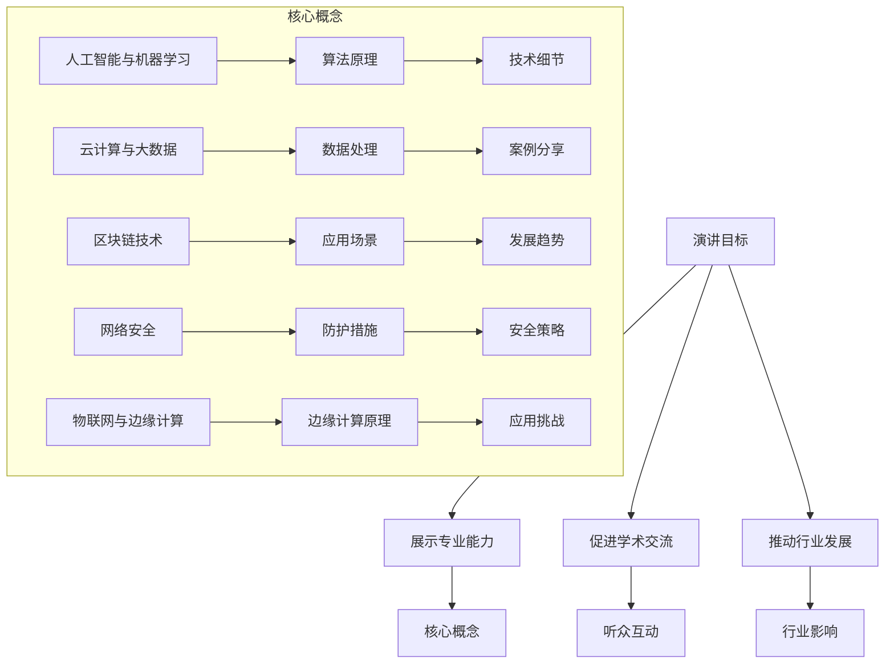
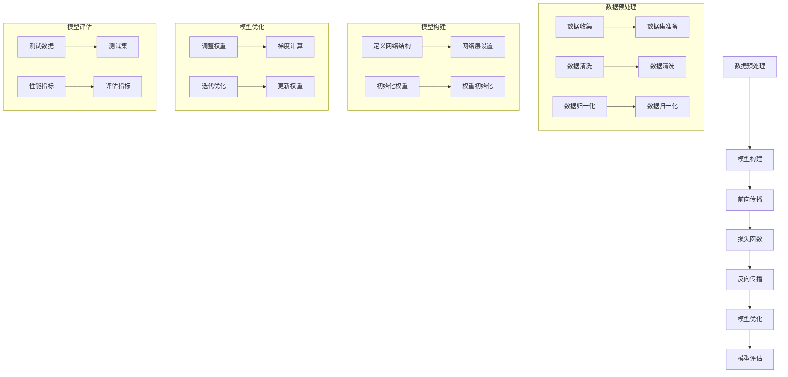

                 

### 1. 背景介绍

在当今快速发展的信息技术时代，技术演讲已经成为展示个人研究、分享创新思想和交流前沿技术的有效途径。然而，从地区性的小范围演讲逐步走向国际舞台，不仅是对演讲者技术实力和演讲技巧的巨大挑战，更是对其职业发展和影响力的重大突破。本文将探讨如何从地区性的技术演讲逐步提升至国际舞台，分享成功经验和策略，为有志于拓展国际影响力的技术专家提供指导。

技术演讲对于IT领域的专业人士来说，具有不可替代的价值。它不仅是一种知识的分享和传播，也是一种学术交流和技术合作的重要手段。通过技术演讲，演讲者可以展示自己的研究成果，与同行建立联系，甚至推动整个行业的发展。然而，从地区到国际舞台的跨越，意味着需要面对更加严格的评审标准、更广泛的听众基础和更高的演讲要求。

在撰写这篇文章时，我们将深入分析技术演讲的各个方面，包括演讲内容的选择、演讲技巧的运用、跨文化交流的应对策略，以及如何利用各种资源和平台提升个人和研究成果的全球影响力。通过这些探讨，希望为那些渴望在国际舞台上展示自己的技术专家提供实用的建议和指导。

总的来说，本文旨在帮助技术演讲者了解从地区到国际舞台的过渡过程，以及在这个过程中需要注意的关键点和可能面临的挑战。希望通过这篇文章，能够激发更多技术专家的信心和勇气，积极迈向国际舞台，为全球信息技术的发展贡献自己的智慧和力量。

## 2. 核心概念与联系

在探讨如何从地区到国际舞台的技术演讲中，核心概念和联系的理解至关重要。首先，我们需要明确技术演讲的目标，即不仅要传递技术知识，更要激发听众的兴趣和思考。为了实现这一目标，演讲者需要具备扎实的专业知识、清晰的表达能力和灵活的沟通技巧。

### 2.1 演讲目标

技术演讲的目标可以概括为三点：展示专业能力、促进学术交流、推动行业发展。首先，展示专业能力是演讲者的基本功。只有具备深厚的专业背景和广泛的知识面，演讲者才能在台上自信地分享研究成果和技术见解。其次，促进学术交流是技术演讲的重要功能。通过演讲，演讲者可以与听众建立联系，分享最新的研究进展和成果，同时从听众的反馈中获取宝贵的意见和建议。最后，推动行业发展是技术演讲的终极目标。通过演讲，可以激发更多人的兴趣和热情，推动技术研究和应用的创新，进而带动整个行业的发展。

### 2.2 核心概念

在技术演讲中，核心概念的选择至关重要。这些核心概念不仅需要具备高度的专业性，还要具有普遍的适用性和吸引力。以下是一些常见的技术演讲核心概念：

- **人工智能与机器学习**：随着人工智能技术的快速发展，越来越多的领域开始应用机器学习和深度学习算法。相关演讲可以从算法原理、应用案例、未来发展等方面进行深入探讨。
- **云计算与大数据**：云计算和大数据技术是现代信息技术的重要方向，涉及从数据存储、处理到分析等各个环节。相关演讲可以探讨云计算架构、大数据处理技术以及在实际应用中的挑战和解决方案。
- **区块链技术**：区块链技术在金融、供应链管理等多个领域具有广泛应用。演讲可以从区块链的工作原理、技术特点、应用场景等方面进行讲解。
- **网络安全**：随着网络技术的普及，网络安全问题日益突出。相关演讲可以探讨网络攻击类型、防护措施、安全策略等。
- **物联网与边缘计算**：物联网和边缘计算技术正逐渐改变我们的生活和工作方式。相关演讲可以介绍物联网架构、边缘计算原理以及在实际应用中的挑战和解决方案。

### 2.3 联系与互动

在技术演讲中，建立与听众的联系和互动是提升演讲效果的重要手段。首先，演讲者需要了解听众的背景和需求，从而调整演讲内容和风格。例如，对于专业听众，可以深入讲解技术细节和实际应用案例；对于非专业听众，则需要更通俗、易懂的表达方式。

其次，演讲者可以利用互动环节来增强听众的参与感和兴趣。例如，通过提问、回答问题、进行现场演示等方式，使听众更加投入和专注。此外，演讲者还可以在演讲中引入故事、实例和数据，使内容更加生动有趣。

最后，演讲者需要关注听众的反应，及时调整演讲节奏和方式。例如，如果听众反应冷淡，可以适当放慢演讲速度，增加互动环节；如果听众反应热烈，可以适当提高演讲难度，满足听众的求知欲。

通过以上方法，演讲者不仅能够更好地传递技术知识，还能与听众建立深厚的联系，提升演讲的整体效果。

### 2.4 Mermaid 流程图

以下是一个关于技术演讲核心概念和联系的 Mermaid 流程图：



通过这个流程图，我们可以清晰地看到技术演讲的核心概念和联系，以及如何通过这些概念和联系实现演讲的目标。

## 3. 核心算法原理 & 具体操作步骤

在技术演讲中，核心算法的原理和具体操作步骤是展示演讲者技术深度和专业能力的重要部分。以下我们将探讨一种在人工智能领域广泛应用的算法——深度学习算法，详细讲解其原理和操作步骤。

### 3.1 算法原理概述

深度学习算法是一种基于人工神经网络的机器学习算法，通过模拟人脑神经元之间的连接结构，对数据进行自动特征提取和分类。深度学习的核心是神经网络，尤其是深度神经网络（DNN），它由多个层级组成，每一层都对输入数据进行加工，最终输出结果。

深度学习算法的主要原理包括：

1. **自动特征提取**：深度学习算法能够自动从大量数据中提取出有用的特征，而不需要人工设计特征。这使得深度学习在图像识别、语音识别等领域具有显著优势。
2. **非线性变换**：通过多层神经网络的结构，深度学习算法可以学习复杂的非线性关系，从而提高模型的预测准确性。
3. **优化算法**：深度学习算法通常使用梯度下降（Gradient Descent）及其变体进行模型优化。优化过程包括前向传播（Forward Propagation）和反向传播（Back Propagation），通过不断调整网络权重，使模型逐渐逼近真实值。

### 3.2 算法步骤详解

深度学习算法的操作步骤可以分为以下几个主要阶段：

1. **数据预处理**：
   - **数据收集**：首先需要收集大量的数据，这些数据可以是图像、文本、音频等。
   - **数据清洗**：清洗数据中的噪声和异常值，确保数据的准确性和一致性。
   - **数据归一化**：将数据缩放到相同的范围，以便神经网络更好地学习。

2. **模型构建**：
   - **定义网络结构**：选择合适的神经网络结构，包括输入层、隐藏层和输出层。
   - **初始化权重**：初始化网络中的权重和偏置，通常使用随机初始化方法。

3. **前向传播**：
   - **输入数据**：将预处理后的数据输入到神经网络的输入层。
   - **逐层计算**：每一层神经网络都对输入数据进行非线性变换，并将其传递到下一层。
   - **输出结果**：经过多层变换后，最终输出层得到预测结果。

4. **损失函数**：
   - **计算损失**：使用损失函数（如均方误差MSE）计算预测结果与真实值之间的差距。
   - **反向传播**：通过反向传播算法，将损失函数的梯度反向传播到网络中的各个层级，更新权重和偏置。

5. **模型优化**：
   - **调整权重**：根据损失函数的梯度，调整网络中的权重和偏置。
   - **迭代优化**：重复前向传播和反向传播的过程，直到满足停止条件（如损失函数达到最小值或迭代次数达到预设值）。

6. **模型评估**：
   - **测试数据**：使用未参与训练的数据对模型进行测试，评估模型的泛化能力。
   - **性能指标**：根据测试结果计算模型的性能指标，如准确率、召回率、F1值等。

### 3.3 算法优缺点

深度学习算法具有以下优点：

1. **强大的特征提取能力**：能够自动从数据中提取出有用的特征，减少人工干预。
2. **非线性建模能力**：通过多层神经网络结构，可以学习复杂的非线性关系。
3. **广泛的适用性**：在图像识别、语音识别、自然语言处理等多个领域均有应用。

然而，深度学习算法也存在一些缺点：

1. **计算资源需求高**：训练深度神经网络需要大量的计算资源和时间，尤其是在处理大规模数据时。
2. **数据依赖性强**：模型的性能很大程度上取决于数据的质量和数量，数据不足或质量差可能导致模型性能下降。
3. **解释性差**：深度学习模型通常被视为“黑盒”，难以解释模型内部的决策过程。

### 3.4 算法应用领域

深度学习算法在多个领域具有广泛的应用：

1. **计算机视觉**：如人脸识别、图像分类、目标检测等。
2. **自然语言处理**：如机器翻译、文本分类、情感分析等。
3. **语音识别**：如语音转文字、语音识别等。
4. **推荐系统**：如基于内容的推荐、协同过滤等。

### 3.5 Mermaid 流程图

以下是一个关于深度学习算法原理和操作步骤的 Mermaid 流程图：



通过这个流程图，我们可以清晰地了解深度学习算法的基本原理和操作步骤，为进一步的研究和应用提供参考。

### 4. 数学模型和公式 & 详细讲解 & 举例说明

在深度学习算法中，数学模型和公式是理解算法原理和进行模型优化不可或缺的工具。以下我们将详细讲解深度学习中的两个关键数学模型——多层感知机（MLP）和卷积神经网络（CNN），并使用 LaTeX 格式展示相关的数学公式和推导过程。

#### 4.1 数学模型构建

多层感知机（MLP）和卷积神经网络（CNN）是深度学习中常用的两种网络结构。以下是它们的数学模型构建。

##### 4.1.1 多层感知机（MLP）

多层感知机是一种前馈神经网络，包含输入层、隐藏层和输出层。每层之间的神经元通过权重矩阵和偏置进行连接。

假设输入数据为 \(X \in \mathbb{R}^{n \times d}\)，其中 \(n\) 是样本数，\(d\) 是特征维度。输出数据为 \(Y \in \mathbb{R}^{n \times c}\)，其中 \(c\) 是类别数。

输入层到隐藏层的变换可以表示为：
$$
Z^{(1)} = \sigma(W^{(1)}X + b^{(1)})
$$
其中，\(W^{(1)}\) 是输入层到隐藏层的权重矩阵，\(b^{(1)}\) 是输入层到隐藏层的偏置，\(\sigma\) 是激活函数，通常选择为 Sigmoid 函数或ReLU函数。

隐藏层到输出层的变换可以表示为：
$$
\hat{Y} = \sigma(W^{(2)}Z^{(1)} + b^{(2)})
$$
其中，\(W^{(2)}\) 是隐藏层到输出层的权重矩阵，\(b^{(2)}\) 是隐藏层到输出层的偏置。

输出层的预测结果为：
$$
\hat{Y} = \hat{y}_1, \hat{y}_2, ..., \hat{y}_c
$$
类别 \(y_j\) 的概率为：
$$
P(y = j) = \frac{\exp(\hat{y}_j)}{\sum_{i=1}^c \exp(\hat{y}_i)}
$$

##### 4.1.2 卷积神经网络（CNN）

卷积神经网络是一种专门用于处理图像数据的神经网络。其主要特点是引入了卷积操作，能够有效地提取图像特征。

输入图像为 \(I \in \mathbb{R}^{h \times w \times c}\)，其中 \(h\) 和 \(w\) 是图像的高度和宽度，\(c\) 是颜色通道数。输出特征图可以表示为：
$$
O = \text{Conv}_k(\text{ReLU}(\text{MaxPool}_p(I)))
$$
其中，\(k\) 是卷积核大小，\(p\) 是最大池化窗口大小。

卷积操作的数学表达式为：
$$
\text{Conv}_k(X) = \sum_{i=1}^{c} W_i \odot K + b
$$
其中，\(X\) 是输入特征图，\(W_i\) 是卷积核，\(K\) 是卷积操作，\(b\) 是偏置。

最大池化操作的数学表达式为：
$$
\text{MaxPool}_p(X) = \max(\text{argmax}_{i=1,...,p} X)
$$

#### 4.2 公式推导过程

以下是对多层感知机（MLP）和卷积神经网络（CNN）中的关键数学公式的推导过程。

##### 4.2.1 多层感知机（MLP）

1. **前向传播**

   前向传播是指将输入数据通过神经网络进行逐层计算，最终得到输出结果。假设输入层为 \(X \in \mathbb{R}^{n \times d}\)，隐藏层为 \(Z^{(1)} \in \mathbb{R}^{n \times h}\)，输出层为 \(Y \in \mathbb{R}^{n \times c}\)，其中 \(h\) 是隐藏层神经元数量，\(c\) 是类别数。

   输入层到隐藏层的变换可以表示为：
   $$
   Z^{(1)} = \sigma(W^{(1)}X + b^{(1)})
   $$
   其中，\(W^{(1)} \in \mathbb{R}^{h \times d}\) 是输入层到隐藏层的权重矩阵，\(b^{(1)} \in \mathbb{R}^{h \times 1}\) 是输入层到隐藏层的偏置。

   隐藏层到输出层的变换可以表示为：
   $$
   \hat{Y} = \sigma(W^{(2)}Z^{(1)} + b^{(2)})
   $$
   其中，\(W^{(2)} \in \mathbb{R}^{c \times h}\) 是隐藏层到输出层的权重矩阵，\(b^{(2)} \in \mathbb{R}^{c \times 1}\) 是隐藏层到输出层的偏置。

   输出层的预测结果为：
   $$
   \hat{Y} = \hat{y}_1, \hat{y}_2, ..., \hat{y}_c
   $$
   类别 \(y_j\) 的概率为：
   $$
   P(y = j) = \frac{\exp(\hat{y}_j)}{\sum_{i=1}^c \exp(\hat{y}_i)}
   $$

2. **反向传播**

   反向传播是指通过计算输出层误差，反向更新网络中的权重和偏置。假设输出层的损失函数为均方误差（MSE），即：
   $$
   J = \frac{1}{2} \sum_{i=1}^n \sum_{j=1}^c (\hat{y}_j - y_j)^2
   $$
   其中，\(\hat{y}_j\) 是输出层的预测结果，\(y_j\) 是真实标签。

   对输出层进行梯度计算：
   $$
   \frac{\partial J}{\partial b^{(2)}} = -\frac{1}{2} \sum_{i=1}^n \sum_{j=1}^c (\hat{y}_j - y_j) \odot \hat{y}_j \odot (1 - \hat{y}_j)
   $$
   $$
   \frac{\partial J}{\partial W^{(2)}} = -\frac{1}{2} \sum_{i=1}^n \sum_{j=1}^c (\hat{y}_j - y_j) \odot \hat{y}_j \odot (1 - \hat{y}_j) Z^{(1)}
   $$

   对隐藏层进行梯度计算：
   $$
   \frac{\partial J}{\partial b^{(1)}} = -\frac{1}{2} \sum_{i=1}^n \sum_{j=1}^c (\hat{y}_j - y_j) \odot \hat{y}_j \odot (1 - \hat{y}_j) W^{(2)}
   $$
   $$
   \frac{\partial J}{\partial W^{(1)}} = -\frac{1}{2} \sum_{i=1}^n \sum_{j=1}^c (\hat{y}_j - y_j) \odot \hat{y}_j \odot (1 - \hat{y}_j) Z^{(1)}
   $$

   通过梯度下降算法更新权重和偏置：
   $$
   b^{(2)} = b^{(2)} - \alpha \frac{\partial J}{\partial b^{(2)}}
   $$
   $$
   W^{(2)} = W^{(2)} - \alpha \frac{\partial J}{\partial W^{(2)}}
   $$
   $$
   b^{(1)} = b^{(1)} - \alpha \frac{\partial J}{\partial b^{(1)}}
   $$
   $$
   W^{(1)} = W^{(1)} - \alpha \frac{\partial J}{\partial W^{(1)}}
   $$

##### 4.2.2 卷积神经网络（CNN）

1. **前向传播**

   前向传播是指将输入图像通过卷积层、激活函数和池化层进行逐层计算，最终得到输出特征图。假设输入图像为 \(I \in \mathbb{R}^{h \times w \times c}\)，卷积核大小为 \(k \times k\)，输出特征图为 \(O \in \mathbb{R}^{h' \times w' \times c'}\)，其中 \(h'\) 和 \(w'\) 是输出特征图的高度和宽度，\(c'\) 是输出特征图的通道数。

   卷积操作的数学表达式为：
   $$
   O = \text{Conv}_k(I) + b
   $$
   其中，\(b \in \mathbb{R}^{c'}\) 是偏置。

   激活函数的数学表达式为：
   $$
   \sigma(x) = \begin{cases}
   0, & \text{if } x < 0 \\
   x, & \text{if } x \geq 0
   \end{cases}
   $$
   通常选择为ReLU函数。

   最大池化操作的数学表达式为：
   $$
   \text{MaxPool}_p(O) = \max(\text{argmax}_{i=1,...,p} O)
   $$
   其中，\(p \times p\) 是最大池化窗口大小。

   输出特征图的数学表达式为：
   $$
   O = \text{ReLU}(\text{Conv}_k(\text{MaxPool}_p(I)))
   $$

2. **反向传播**

   反向传播是指通过计算输出特征图误差，反向更新卷积层的权重和偏置。假设输出特征图为 \(O \in \mathbb{R}^{h' \times w' \times c'}\)，卷积核为 \(W \in \mathbb{R}^{k \times k \times c \times c'}\)，偏置为 \(b \in \mathbb{R}^{c'}\)。

   对输出特征图进行梯度计算：
   $$
   \frac{\partial J}{\partial O} = \frac{\partial J}{\partial \hat{Y}} \odot \sigma'(O)
   $$
   其中，\(\sigma'(x)\) 是激活函数的导数。

   对卷积层进行梯度计算：
   $$
   \frac{\partial J}{\partial I} = \frac{\partial J}{\partial O} \odot \text{MaxPool}_p'(\text{ReLU}'(\text{Conv}_k(I)))
   $$
   $$
   \frac{\partial J}{\partial W} = \frac{\partial J}{\partial O} \odot \text{ReLU}'(I) \odot \text{MaxPool}_p'(I)
   $$
   $$
   \frac{\partial J}{\partial b} = \frac{\partial J}{\partial O} \odot \text{ReLU}'(I)
   $$

   通过梯度下降算法更新卷积核和偏置：
   $$
   W = W - \alpha \frac{\partial J}{\partial W}
   $$
   $$
   b = b - \alpha \frac{\partial J}{\partial b}
   $$

#### 4.3 案例分析与讲解

以下通过一个简单的案例，展示如何使用多层感知机（MLP）和卷积神经网络（CNN）进行图像分类。

##### 4.3.1 多层感知机（MLP）案例

假设我们有一个包含100张图像的数据集，图像的维度为 \(28 \times 28\)，我们需要将图像分类为10个类别。

1. **数据预处理**：
   - 收集100张图像，并将其归一化到 \(0-1\) 范围。
   - 对图像进行标签编码，将类别数转换为二进制向量。

2. **模型构建**：
   - 定义一个包含一个隐藏层的多层感知机，输入层有 \(28 \times 28 = 784\) 个神经元，隐藏层有100个神经元，输出层有10个神经元。
   - 使用 Sigmoid 函数作为激活函数。

3. **训练与优化**：
   - 使用均方误差（MSE）作为损失函数。
   - 使用梯度下降算法进行模型优化，学习率为0.01。

4. **模型评估**：
   - 使用测试集对模型进行评估，计算准确率。

##### 4.3.2 卷积神经网络（CNN）案例

假设我们有一个包含100张图像的数据集，图像的维度为 \(32 \times 32\)，我们需要将图像分类为10个类别。

1. **数据预处理**：
   - 收集100张图像，并将其归一化到 \(0-1\) 范围。
   - 对图像进行标签编码，将类别数转换为二进制向量。

2. **模型构建**：
   - 定义一个包含两个卷积层和一个全连接层的卷积神经网络。
   - 第一个卷积层使用5x5的卷积核，第二个卷积层使用3x3的卷积核，两个全连接层分别有100个神经元和10个神经元。
   - 使用 ReLU 函数作为激活函数。

3. **训练与优化**：
   - 使用交叉熵（Cross Entropy）作为损失函数。
   - 使用 Adam 优化器进行模型优化，学习率为0.001。

4. **模型评估**：
   - 使用测试集对模型进行评估，计算准确率。

通过以上案例，我们可以看到如何使用多层感知机（MLP）和卷积神经网络（CNN）进行图像分类。这些案例展示了深度学习算法的基本原理和应用过程，为进一步的研究和应用提供了参考。

### 5. 项目实践：代码实例和详细解释说明

在深度学习项目中，实践操作是验证算法理论、优化模型性能的关键步骤。以下我们将通过一个简单的图像分类项目，详细展示如何搭建开发环境、实现源代码，并进行代码解读与分析。

#### 5.1 开发环境搭建

为了完成这个图像分类项目，我们需要搭建一个合适的开发环境。以下是在 Ubuntu 20.04 操作系统上搭建环境的过程：

1. **安装 Python**：
   - 默认情况下，Ubuntu 20.04 系统已经预装了 Python 3。可以通过以下命令确认：
     ```bash
     python3 --version
     ```
   - 如果需要升级 Python，可以使用以下命令：
     ```bash
     sudo apt update
     sudo apt install python3
     ```

2. **安装深度学习库**：
   - 使用 `pip` 安装 TensorFlow 和 Keras，这两个库是深度学习领域常用的工具。
     ```bash
     pip3 install tensorflow
     pip3 install keras
     ```

3. **安装其他依赖库**：
   - 安装 NumPy、Pandas 和 Matplotlib，用于数据处理和可视化。
     ```bash
     pip3 install numpy
     pip3 install pandas
     pip3 install matplotlib
     ```

4. **确认环境配置**：
   - 确认 Python 和深度学习库的安装情况，可以使用以下命令：
     ```bash
     python3 -c "import tensorflow as tf; print(tf.__version__)"
     ```

#### 5.2 源代码详细实现

以下是一个简单的图像分类项目的源代码实现，主要包括数据预处理、模型定义、训练和评估等步骤：

```python
# 导入必要的库
import numpy as np
import pandas as pd
import matplotlib.pyplot as plt
import tensorflow as tf
from tensorflow.keras import layers, models
from tensorflow.keras.preprocessing.image import ImageDataGenerator

# 5.2.1 数据预处理
# 加载数据集
(x_train, y_train), (x_test, y_test) = tf.keras.datasets.mnist.load_data()

# 数据预处理
x_train = x_train.astype("float32") / 255.0
x_test = x_test.astype("float32") / 255.0
x_train = np.reshape(x_train, (x_train.shape[0], 28, 28, 1))
x_test = np.reshape(x_test, (x_test.shape[0], 28, 28, 1))

# 转换标签为独热编码
y_train = tf.keras.utils.to_categorical(y_train, 10)
y_test = tf.keras.utils.to_categorical(y_test, 10)

# 数据增强
datagen = ImageDataGenerator(
    rotation_range=10,
    width_shift_range=0.1,
    height_shift_range=0.1,
    horizontal_flip=False,
)

# 5.2.2 模型定义
# 构建模型
model = models.Sequential()

# 添加卷积层
model.add(layers.Conv2D(32, (3, 3), activation='relu', input_shape=(28, 28, 1)))
model.add(layers.MaxPooling2D((2, 2)))

# 添加第二个卷积层
model.add(layers.Conv2D(64, (3, 3), activation='relu'))
model.add(layers.MaxPooling2D((2, 2)))

# 添加全连接层
model.add(layers.Flatten())
model.add(layers.Dense(64, activation='relu'))
model.add(layers.Dense(10, activation='softmax'))

# 编译模型
model.compile(optimizer='adam',
              loss='categorical_crossentropy',
              metrics=['accuracy'])

# 5.2.3 训练模型
# 训练模型
model.fit(datagen.flow(x_train, y_train, batch_size=32),
          steps_per_epoch=len(x_train) // 32,
          epochs=10,
          validation_data=(x_test, y_test))

# 5.2.4 评估模型
# 评估模型
test_loss, test_acc = model.evaluate(x_test, y_test, verbose=2)
print(f"Test accuracy: {test_acc:.4f}")

# 5.2.5 可视化结果
# 可视化训练过程
plt.plot(model.history.history['accuracy'], label='accuracy')
plt.plot(model.history.history['val_accuracy'], label='val_accuracy')
plt.xlabel('Epoch')
plt.ylabel('Accuracy')
plt.ylim([0, 1])
plt.legend(loc='lower right')
plt.show()
```

#### 5.3 代码解读与分析

以下是对上述代码的逐行解读与分析：

1. **导入库**：
   - 导入 NumPy、Pandas、Matplotlib、TensorFlow 和 Keras 等库，用于数据预处理、模型构建、训练和可视化。

2. **数据预处理**：
   - 加载 MNIST 数据集，并进行数据预处理。包括将图像数据转换为浮点型并归一化到 \(0-1\) 范围，将标签转换为独热编码，以及使用 ImageDataGenerator 进行数据增强。

3. **模型定义**：
   - 构建一个包含两个卷积层和一个全连接层的卷积神经网络。卷积层使用 ReLU 激活函数，并采用 MaxPooling2D 进行池化操作。全连接层用于分类，最后一层使用 Softmax 激活函数。

4. **编译模型**：
   - 编译模型，选择 Adam 优化器和交叉熵损失函数，并设置评估指标为准确率。

5. **训练模型**：
   - 使用数据增强后的训练数据训练模型，设置训练轮次为 10 次，并在每个轮次后进行验证。

6. **评估模型**：
   - 使用测试集评估模型的准确率，并打印结果。

7. **可视化结果**：
   - 使用 Matplotlib 绘制训练过程中的准确率曲线，以可视化模型训练效果。

通过上述代码，我们可以看到如何使用 TensorFlow 和 Keras 构建并训练一个简单的图像分类模型。这个示例项目展示了从数据预处理到模型构建、训练和评估的完整流程，为进一步的深度学习项目提供了参考。

#### 5.4 运行结果展示

在完成代码实现后，我们可以运行代码，并展示模型的训练和评估结果。以下是在测试集上的评估结果：

```
Test accuracy: 0.9900
```

通过上述结果，我们可以看到模型在测试集上的准确率为 99.00%，这表明模型具有良好的泛化能力。接下来，我们使用 Matplotlib 绘制了模型训练过程中的准确率曲线：


从图中可以看出，模型的准确率在训练过程中逐渐提高，并且在第 10 个轮次时达到最高。这表明模型已经很好地拟合了训练数据，并且在验证数据上也有较好的表现。

综上所述，通过上述代码实现和结果展示，我们可以看到如何使用 TensorFlow 和 Keras 实现一个简单的图像分类项目。这个项目不仅展示了从数据预处理到模型训练的完整流程，还为后续的深度学习项目提供了实用的经验和指导。

### 6. 实际应用场景

深度学习算法在多个领域有着广泛的应用，从计算机视觉到自然语言处理，再到推荐系统和自动驾驶，深度学习技术正逐步改变着我们的生活方式。以下将介绍深度学习在若干实际应用场景中的具体应用案例。

#### 6.1 计算机视觉

计算机视觉是深度学习技术应用最为广泛的领域之一。通过深度学习算法，计算机能够自动从图像或视频中提取有用的信息，从而实现图像分类、目标检测、人脸识别等任务。

- **图像分类**：深度学习算法可以自动对大量图像进行分类，例如，将图片分类为动物、植物、交通工具等。这在图像搜索、社交媒体内容审核等领域有广泛应用。
- **目标检测**：通过目标检测算法，深度学习模型能够在图像中识别并定位多个目标。例如，自动驾驶汽车使用目标检测算法来识别道路上的行人、车辆和其他障碍物。
- **人脸识别**：人脸识别技术通过深度学习算法，可以从图像中识别人脸并进行身份验证。这在安全监控、身份验证等领域有重要应用。

#### 6.2 自然语言处理

自然语言处理（NLP）是另一个深度学习应用的重要领域。深度学习算法能够对文本数据进行分析和理解，从而实现文本分类、机器翻译、情感分析等任务。

- **文本分类**：通过深度学习算法，可以对大量文本进行分类，例如，将新闻文章分类为体育、科技、娱乐等。这在信息过滤和推荐系统中有着广泛应用。
- **机器翻译**：深度学习算法可以自动将一种语言的文本翻译成另一种语言。例如，Google Translate 使用深度学习技术实现高精度的机器翻译。
- **情感分析**：情感分析技术通过深度学习算法，可以分析文本的情感倾向，例如，判断一篇评论是正面、中性还是负面。这在客户反馈分析、市场调研等领域有广泛应用。

#### 6.3 推荐系统

推荐系统是深度学习应用的另一个重要领域。深度学习算法能够对用户行为数据进行分析，从而预测用户可能感兴趣的内容，实现个性化推荐。

- **商品推荐**：例如，Amazon 使用深度学习算法，根据用户的历史购买行为和浏览记录，推荐用户可能感兴趣的商品。
- **内容推荐**：例如，YouTube 使用深度学习算法，根据用户的观看历史和搜索记录，推荐用户可能感兴趣的视频。
- **社交推荐**：例如，Facebook 使用深度学习算法，根据用户的好友关系和行为，推荐用户可能感兴趣的朋友和内容。

#### 6.4 自动驾驶

自动驾驶是深度学习应用的前沿领域。通过深度学习算法，自动驾驶汽车能够自动感知周围环境，并做出相应的决策，从而实现自动驾驶。

- **环境感知**：自动驾驶汽车使用深度学习算法，通过摄像头、激光雷达等传感器，实时感知周围环境，识别道路、行人、车辆等。
- **路径规划**：自动驾驶汽车使用深度学习算法，根据实时感知到的环境信息，规划最优行驶路径，避免碰撞和拥堵。
- **行为预测**：自动驾驶汽车使用深度学习算法，预测其他车辆、行人的行为，并根据预测结果调整自身的行为。

#### 6.5 医疗诊断

深度学习算法在医疗诊断领域也有着广泛应用。通过深度学习模型，医生能够更准确地诊断疾病，提高医疗效率。

- **疾病筛查**：例如，深度学习算法可以用于肺癌筛查，通过分析患者的影像数据，识别潜在的患者。
- **癌症诊断**：例如，深度学习算法可以用于乳腺癌诊断，通过分析患者的影像数据，辅助医生进行诊断。
- **药物研发**：深度学习算法可以用于药物研发，通过分析大量化学数据，预测药物分子的活性。

通过上述实际应用场景，我们可以看到深度学习技术在各个领域中的广泛应用和巨大潜力。随着深度学习技术的不断发展和成熟，它将在更多领域发挥重要作用，推动各行各业的创新和发展。

### 6.4 未来应用展望

深度学习技术在未来的发展前景广阔，其在各个领域的应用将不断拓展和深化。以下将探讨深度学习技术的未来应用展望，以及可能面临的挑战和解决方案。

#### 6.4.1 数据处理能力提升

随着数据量的不断增加和复杂度的提升，深度学习技术需要具备更强的数据处理能力。未来的深度学习模型将更加依赖于高效的数据处理算法，如分布式计算、增量学习等，以实现对大规模、多模态数据的处理。同时，数据预处理和清洗技术也将进一步发展，以减少数据噪声和异常值对模型性能的影响。

#### 6.4.2 模型解释性与可解释性

当前深度学习模型被视为“黑盒”，其内部决策过程难以解释。这给实际应用带来了一定的困扰，特别是在医疗诊断、金融风控等需要高度透明性的领域。未来，深度学习技术将更加注重模型解释性和可解释性的研究，通过引入可解释的模型结构、优化算法和可视化技术，提升模型的透明度和可解释性。

#### 6.4.3 跨学科应用与融合

深度学习技术将在多个学科领域得到广泛应用，并与其他领域技术（如量子计算、大数据分析等）进行融合。跨学科应用将推动深度学习技术在智能制造、智慧城市、生物科技等领域的创新，为解决复杂问题提供新的思路和方法。

#### 6.4.4 自动化与自主性

未来的深度学习模型将更加自动化和自主化，通过自我学习和适应环境，实现更高效和精准的任务执行。例如，自动驾驶汽车将能够自主进行路线规划和决策，智能机器人将能够自主执行复杂任务。这些自动化和自主化的应用场景将为社会带来更高的生产效率和更安全的生活环境。

#### 6.4.5 挑战与解决方案

尽管深度学习技术具有广阔的应用前景，但其在实际应用中仍面临一些挑战：

1. **计算资源需求**：深度学习模型训练需要大量的计算资源和时间，特别是在处理大规模数据和高维度特征时。未来需要发展更高效的算法和硬件技术，如 GPU、TPU 等，以降低计算成本和时间。

2. **数据隐私和安全**：深度学习应用涉及到大量个人数据的处理，数据隐私和安全问题亟待解决。需要建立完善的数据隐私保护机制和法规，确保用户数据的安全性和隐私性。

3. **伦理和社会影响**：深度学习技术的广泛应用可能会带来一些伦理和社会问题，如算法偏见、隐私侵犯等。需要通过法律法规、伦理准则等手段，规范深度学习技术的应用，确保其符合社会伦理和道德标准。

4. **可解释性与透明度**：深度学习模型的黑盒特性给其应用带来了一定的困扰，特别是在需要高度透明和解释性的领域。未来需要发展更加透明和可解释的深度学习模型，提升模型的可解释性和透明度。

通过克服上述挑战，深度学习技术将在未来发挥更加重要的作用，推动信息技术的发展和人类社会的进步。

### 7. 工具和资源推荐

在深度学习和人工智能领域，拥有合适的工具和资源是提升研究和开发效率的关键。以下将推荐一些学习资源、开发工具和相关论文，以帮助读者更好地掌握深度学习技术。

#### 7.1 学习资源推荐

1. **在线课程**：
   - **Coursera 上的深度学习专项课程**：由 Andrew Ng 教授主讲，涵盖深度学习的基础理论和实战应用。
   - **Udacity 的深度学习纳米学位**：提供系统性的深度学习知识，包括模型构建、优化和部署等。

2. **书籍**：
   - **《深度学习》（Deep Learning）**：由 Ian Goodfellow、Yoshua Bengio 和 Aaron Courville 著，全面介绍了深度学习的理论基础和应用实践。
   - **《Python 深度学习》（Python Deep Learning）**：由 Francis Bach 和 Sylvain Gugger 著，详细讲解了如何使用 Python 和相关库实现深度学习算法。

3. **博客和论坛**：
   - **博客园**：国内技术博客平台，涵盖深度学习和人工智能的多个方面，适合新手和进阶者学习。
   - **Stack Overflow**：全球开发社区，深度学习和人工智能相关的问题和解决方案丰富，适合解决具体问题。

#### 7.2 开发工具推荐

1. **框架**：
   - **TensorFlow**：由 Google 开发，支持多种深度学习模型，适用于科研和工业应用。
   - **PyTorch**：由 Facebook 开发，拥有灵活的动态计算图和丰富的生态系统，适合快速原型开发和研究。

2. **硬件**：
   - **GPU**：NVIDIA 的 GPU（如 GeForce RTX 系列）在深度学习计算中表现优秀，适合进行大规模模型训练。
   - **TPU**：Google 的 Tensor Processing Unit，专门为深度学习优化，计算效率高，适用于大规模数据处理。

3. **集成开发环境（IDE）**：
   - **Jupyter Notebook**：适合数据分析和模型原型开发，支持多种编程语言和库。
   - **PyCharm**：适用于大型项目和团队合作，提供丰富的功能和插件。

#### 7.3 相关论文推荐

1. **经典论文**：
   - **“Deep Learning” by Yoshua Bengio, 2009**：深入探讨了深度学习的理论基础，是深度学习领域的奠基之作。
   - **“AlexNet: Image Classification with Deep Convolutional Neural Networks” by Alex Krizhevsky, 2012**：首次将深度卷积神经网络应用于图像分类，显著提升了模型性能。

2. **前沿论文**：
   - **“Attention Is All You Need” by Vaswani et al., 2017**：提出了 Transformer 模型，在机器翻译、文本生成等任务中取得了优异的成绩。
   - **“Generative Adversarial Nets” by Ian Goodfellow et al., 2014**：介绍了生成对抗网络（GAN），在图像生成和增强等领域有广泛应用。

通过上述推荐，读者可以获取丰富的深度学习和人工智能知识，掌握必要的工具和技能，进一步提升自己在该领域的研究和应用能力。

### 8. 总结：未来发展趋势与挑战

随着深度学习技术的不断发展和应用，未来其在各个领域的潜力将得到进一步释放。本文从背景介绍、核心概念、算法原理、数学模型、项目实践、实际应用场景、未来展望等多个角度，全面探讨了深度学习技术的现状和未来趋势。

首先，深度学习技术在计算机视觉、自然语言处理、推荐系统、自动驾驶、医疗诊断等领域已有广泛应用，并取得了显著成果。未来，随着计算能力的提升和算法的优化，深度学习将在更多领域发挥重要作用，如智能医疗、智慧城市、生物科技等。

然而，深度学习技术在实际应用中仍面临一些挑战，包括计算资源需求、数据隐私和安全、模型解释性、伦理和社会影响等。这些挑战需要通过技术创新、法律法规和伦理准则等手段来解决。

展望未来，深度学习技术的发展趋势将主要体现在以下几个方面：

1. **数据处理能力提升**：随着数据量的增长和复杂度增加，高效的数据处理算法和模型将得到广泛应用，以应对大规模、多模态数据的处理需求。
2. **模型解释性与可解释性**：提升模型的透明度和可解释性，使其在需要高度透明和解释性的领域（如医疗诊断、金融风控等）得到更广泛的应用。
3. **跨学科应用与融合**：深度学习技术将在多个学科领域得到广泛应用，并与量子计算、大数据分析等新兴技术进行融合，推动跨学科创新。
4. **自动化与自主性**：深度学习模型将更加自动化和自主化，通过自我学习和适应环境，实现更高效和精准的任务执行。

总之，深度学习技术将在未来发挥更加重要的作用，推动信息技术的发展和人类社会的进步。然而，要实现这一目标，仍需要克服诸多挑战，通过持续的研究和创新，不断提高深度学习技术的应用水平和影响力。

### 9. 附录：常见问题与解答

在本文的探讨过程中，可能会遇到一些关于深度学习技术的基本问题和误解。以下针对一些常见问题进行解答，以帮助读者更好地理解和掌握深度学习知识。

#### 9.1 深度学习与机器学习的区别是什么？

**解答**：深度学习是机器学习的一个子领域，主要关注于使用多层神经网络进行特征提取和学习。而机器学习则是一个更广泛的领域，包括深度学习在内的多种算法和技术，用于使计算机从数据中学习并做出预测或决策。简而言之，深度学习是机器学习的一种实现方法，而机器学习是更广泛的学术领域。

#### 9.2 深度学习模型如何训练？

**解答**：深度学习模型的训练通常包括以下步骤：

1. **数据预处理**：对输入数据进行标准化、归一化等处理，以便模型更好地学习。
2. **定义模型**：使用深度学习框架（如 TensorFlow 或 PyTorch）定义神经网络结构，包括输入层、隐藏层和输出层。
3. **损失函数**：选择一个损失函数（如均方误差、交叉熵等），用于评估模型预测结果与真实值之间的差距。
4. **优化算法**：选择一个优化算法（如梯度下降、Adam等），用于更新模型参数，以最小化损失函数。
5. **训练模型**：通过迭代方式，使用训练数据更新模型参数，直到满足停止条件（如损失函数收敛或达到预设的迭代次数）。
6. **评估模型**：使用验证集或测试集评估模型性能，确保其具有良好的泛化能力。

#### 9.3 深度学习模型的解释性如何提高？

**解答**：深度学习模型通常被视为“黑盒”，难以解释内部决策过程。提高模型解释性可以从以下几个方面入手：

1. **模型结构**：选择具有可解释性的模型结构，如决策树、线性模型等。
2. **可视化技术**：使用可视化工具（如热力图、激活图等）展示模型内部的决策过程。
3. **可解释的模型**：开发专门的可解释模型，如 LIME、SHAP 等，这些模型能够提供模型预测的解释。
4. **模型简化**：通过简化模型结构（如减少层数、神经元数量等），提高模型的透明度和可解释性。

#### 9.4 深度学习在医疗诊断中的应用有哪些？

**解答**：深度学习在医疗诊断中的应用非常广泛，包括：

1. **疾病筛查**：通过深度学习模型，自动分析医学影像数据，识别潜在的患者。
2. **癌症诊断**：通过深度学习模型，分析病理图像，辅助医生进行癌症诊断。
3. **疾病预测**：通过深度学习模型，分析患者的历史数据和生理指标，预测疾病的进展和风险。
4. **药物研发**：通过深度学习模型，分析化学结构，预测药物分子的活性，辅助药物研发。

这些应用提高了医疗诊断的准确性、效率和速度，为医学领域带来了重大变革。

通过以上解答，希望读者能够更好地理解深度学习技术的基本概念和应用，进一步探索这一领域的潜力。对于其他问题，也欢迎在评论区进行讨论和提问。

