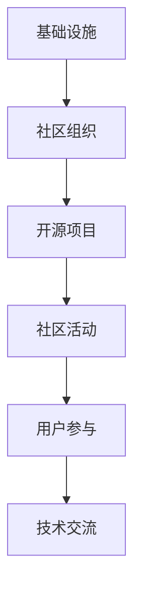

                 

在当今快速发展的技术时代，技术社区已经成为了软件开发者和工程师们不可或缺的学习、交流与成长的平台。从最初的本地群组，到逐渐发展壮大为具有全球影响力的组织，技术社区的建设经历了诸多挑战与机遇。本文旨在探讨技术社区的发展历程、核心概念、建设策略以及未来展望，以期为技术社区的持续繁荣提供一些有益的思考。

## 关键词
- 技术社区
- 本地群组
- 全球性组织
- 社区建设
- 开源文化
- 社区治理

## 摘要
本文首先介绍了技术社区的发展背景，探讨了技术社区的核心概念与架构，然后详细分析了社区核心算法原理与操作步骤，最后提出了数学模型、项目实践、实际应用场景以及未来展望。通过本文的阅读，读者可以全面了解技术社区建设的重要性，掌握建设策略，并为技术社区的未来发展提供新的视角。

## 1. 背景介绍

### 1.1 技术社区的定义与起源

技术社区是一个由共同兴趣、目标或技能的软件开发者、工程师、研究人员和爱好者组成的网络。最早的本地技术社区可以追溯到计算机科学和互联网发展的初期。当时，一些志同道合的技术爱好者会定期在大学或研究机构的机房聚会，讨论最新的技术趋势、开源项目以及编程问题。随着互联网的普及，这些本地群组逐渐扩展为在线论坛、邮件列表和聊天室，形成了早期的技术社区。

### 1.2 技术社区的发展历程

技术社区的发展可以分为几个阶段：

- **初期阶段**：本地群组的形成与交流，主要以面对面的讨论为主。
- **线上社区阶段**：互联网的普及使得技术交流不再受地域限制，线上论坛、邮件列表和聊天室成为主流。
- **社交网络阶段**：社交媒体的出现使得技术社区开始向更广泛的群体扩展，用户参与度和互动性大大提高。
- **全球性组织阶段**：随着技术社区的规模不断扩大，一些具有全球影响力的技术社区组织应运而生，如GitHub、Stack Overflow、Reddit 等。

### 1.3 技术社区的重要性

技术社区对于软件开发者和工程师的意义不可忽视：

- **知识共享**：技术社区为成员提供了一个分享知识、经验和技巧的平台，促进了知识的传播和积累。
- **技能提升**：成员可以通过参与社区讨论、贡献开源项目、解决问题等方式不断提升自己的技能。
- **职业发展**：技术社区为成员提供了展示才华、结识同行的机会，有助于职业发展和人脉拓展。
- **创新推动**：技术社区鼓励创新思维和实践，许多新兴技术和开源项目都起源于社区。

## 2. 核心概念与联系

### 2.1 技术社区的核心概念

技术社区的核心概念包括：

- **开源文化**：开源是技术社区的重要特征，成员通过共享代码、资源和经验，推动了技术的进步。
- **社区治理**：社区治理是确保技术社区健康发展的重要保障，涉及规则制定、成员管理、决策过程等方面。
- **用户参与**：用户参与是技术社区活力的重要来源，成员的积极参与有助于社区的繁荣和发展。
- **技术交流**：技术交流是技术社区的核心活动，通过讨论、分享和协作，成员可以共同进步。

### 2.2 技术社区的架构

技术社区的架构可以分为以下几个层次：

- **基础设施**：包括网站、论坛、聊天室、邮件列表等，为社区成员提供交流平台。
- **社区组织**：由志愿者、管理员和顾问组成的组织，负责社区的管理和运营。
- **开源项目**：社区成员共同参与的开源项目，是社区的核心价值所在。
- **社区活动**：包括线上讨论、线下聚会、技术讲座等，促进了社区成员之间的交流和合作。

下面是技术社区的 Mermaid 流程图：



## 3. 核心算法原理 & 具体操作步骤

### 3.1 算法原理概述

技术社区的核心算法主要涉及以下几个方面：

- **用户行为分析**：通过分析用户的行为数据，了解成员的兴趣、需求和参与度，为社区治理和活动策划提供依据。
- **推荐系统**：基于用户行为数据和社交网络关系，为用户推荐感兴趣的内容、项目和活动，提高社区活跃度。
- **社区治理算法**：通过算法自动处理违规行为、管理成员角色和权限，确保社区秩序和健康发展。

### 3.2 算法步骤详解

#### 3.2.1 用户行为分析

1. **数据收集**：从网站、论坛、聊天室等渠道收集用户行为数据，包括浏览、回复、点赞、分享等。
2. **数据预处理**：对收集到的数据进行清洗、去噪和归一化处理，提取有效特征。
3. **特征选择**：根据社区需求和算法性能，选择最相关的特征进行建模。
4. **模型训练**：使用机器学习算法，如决策树、支持向量机、神经网络等，对用户行为数据进行训练。
5. **模型评估**：通过交叉验证、A/B 测试等方法评估模型性能，选择最优模型。

#### 3.2.2 推荐系统

1. **数据收集**：从社区活动中收集用户行为数据，如项目参与、活动参与、评论等。
2. **用户画像**：基于用户行为数据，构建用户画像，包括兴趣、技能、职业等维度。
3. **推荐算法**：使用协同过滤、基于内容的推荐、混合推荐等算法，为用户推荐感兴趣的内容和活动。
4. **推荐结果评估**：通过点击率、转化率等指标评估推荐效果，优化推荐算法。

#### 3.2.3 社区治理算法

1. **违规行为检测**：使用机器学习算法检测社区中的违规行为，如恶意评论、垃圾信息等。
2. **角色管理**：根据用户行为和贡献度，动态调整用户角色和权限。
3. **决策过程**：采用民主投票、专家评审等方式，处理社区决策问题。
4. **反馈机制**：建立反馈机制，收集成员意见，优化社区治理策略。

### 3.3 算法优缺点

#### 3.3.1 用户行为分析

**优点**：

- **精准性**：通过分析用户行为数据，可以更准确地了解成员需求和兴趣。
- **个性化**：根据用户行为数据，可以为用户提供个性化的推荐和活动。

**缺点**：

- **隐私问题**：用户行为数据涉及隐私，需要确保数据安全和用户隐私。
- **数据质量**：数据质量直接影响算法性能，需要定期进行数据清洗和处理。

#### 3.3.2 推荐系统

**优点**：

- **提高活跃度**：通过推荐系统，可以吸引用户参与社区活动，提高社区活跃度。
- **个性化体验**：为用户提供个性化的推荐，提高用户体验。

**缺点**：

- **推荐质量**：推荐质量直接影响用户体验，需要不断优化推荐算法。
- **数据依赖**：推荐系统依赖于用户行为数据，数据不足时可能影响推荐效果。

#### 3.3.3 社区治理算法

**优点**：

- **自动化**：通过算法自动处理违规行为和管理角色权限，提高治理效率。
- **公平性**：采用民主投票、专家评审等方式，确保决策过程的公平性。

**缺点**：

- **规则复杂**：社区治理规则复杂，需要不断调整和完善。
- **技术依赖**：社区治理算法依赖于技术支持，需要持续投入。

### 3.4 算法应用领域

技术社区的核心算法在以下领域具有广泛应用：

- **社交媒体**：用户行为分析、推荐系统和社区治理算法在社交媒体平台中广泛应用，如Facebook、Twitter等。
- **电子商务**：用户行为分析和推荐系统在电子商务平台中用于个性化推荐和营销策略。
- **在线教育**：用户行为分析和推荐系统在在线教育平台中用于课程推荐和学习效果评估。

## 4. 数学模型和公式 & 详细讲解 & 举例说明

### 4.1 数学模型构建

技术社区的核心数学模型主要包括用户行为分析模型、推荐系统模型和社区治理模型。

#### 4.1.1 用户行为分析模型

用户行为分析模型主要基于用户行为数据，通过数学模型分析用户的兴趣、需求和参与度。一个简单的用户行为分析模型可以表示为：

$$
R = f(U, E)
$$

其中，$R$ 表示用户行为得分，$U$ 表示用户特征向量，$E$ 表示环境特征向量。$f$ 函数用于计算用户行为得分。

#### 4.1.2 推荐系统模型

推荐系统模型主要基于用户行为数据和社交网络关系，通过数学模型为用户推荐感兴趣的内容和活动。一个简单的推荐系统模型可以表示为：

$$
R = f(U, E, S)
$$

其中，$R$ 表示推荐结果，$U$ 表示用户特征向量，$E$ 表示环境特征向量，$S$ 表示社交网络关系矩阵。

#### 4.1.3 社区治理模型

社区治理模型主要基于用户行为数据、社区规则和决策过程，通过数学模型处理社区中的违规行为和管理角色权限。一个简单的社区治理模型可以表示为：

$$
G = f(U, R, P)
$$

其中，$G$ 表示治理结果，$U$ 表示用户特征向量，$R$ 表示规则集，$P$ 表示决策过程。

### 4.2 公式推导过程

#### 4.2.1 用户行为分析模型

用户行为分析模型的核心是用户行为得分 $R$ 的计算。$R$ 的计算可以基于用户行为数据 $U$ 和环境特征数据 $E$。假设用户行为数据 $U$ 是一个多维向量，环境特征数据 $E$ 是一个一维向量，我们可以使用线性回归模型来计算用户行为得分：

$$
R = \beta_0 + \beta_1 U_1 + \beta_2 U_2 + \cdots + \beta_n U_n + \epsilon
$$

其中，$\beta_0$ 是常数项，$\beta_1, \beta_2, \cdots, \beta_n$ 是模型参数，$\epsilon$ 是误差项。

为了计算模型参数，我们可以使用最小二乘法：

$$
\min_{\beta_0, \beta_1, \beta_2, \cdots, \beta_n} \sum_{i=1}^n (R_i - (\beta_0 + \beta_1 U_{i1} + \beta_2 U_{i2} + \cdots + \beta_n U_{in}))^2
$$

通过求解最小二乘法得到的参数可以用于计算用户行为得分。

#### 4.2.2 推荐系统模型

推荐系统模型的核心是推荐结果 $R$ 的计算。$R$ 的计算可以基于用户特征向量 $U$、环境特征向量 $E$ 和社交网络关系矩阵 $S$。假设用户特征向量 $U$ 是一个多维向量，环境特征向量 $E$ 是一个一维向量，社交网络关系矩阵 $S$ 是一个二维矩阵，我们可以使用矩阵分解模型来计算推荐结果：

$$
R = \hat{U}^T \hat{E} + \hat{S} \hat{V}
$$

其中，$\hat{U}$ 和 $\hat{E}$ 是用户特征向量和环境特征向量的低维表示，$\hat{S}$ 和 $\hat{V}$ 是社交网络关系矩阵的低维表示。

为了计算模型参数，我们可以使用梯度下降法：

$$
\min_{\hat{U}, \hat{E}, \hat{S}, \hat{V}} \sum_{i=1}^n \sum_{j=1}^m (R_{ij} - (\hat{U}_i^T \hat{E}_j + \hat{S}_{ij} \hat{V}_j))^2
$$

通过求解梯度下降法得到的参数可以用于计算推荐结果。

#### 4.2.3 社区治理模型

社区治理模型的核心是治理结果 $G$ 的计算。$G$ 的计算可以基于用户特征向量 $U$、规则集 $R$ 和决策过程 $P$。假设用户特征向量 $U$ 是一个多维向量，规则集 $R$ 是一个一维向量，决策过程 $P$ 是一个二维矩阵，我们可以使用决策树模型来计算治理结果：

$$
G = \tau(U, R, P)
$$

其中，$\tau$ 是决策树模型。

为了计算模型参数，我们可以使用ID3算法：

$$
\min_{\tau} \sum_{i=1}^n (G_i - \tau(U_i, R_i, P_i))
$$

通过求解ID3算法得到的模型参数可以用于计算治理结果。

### 4.3 案例分析与讲解

#### 4.3.1 用户行为分析模型案例

假设我们有一个技术社区，用户的行为数据包括浏览次数、回复次数和点赞次数。我们需要使用用户行为数据来预测用户的行为得分。

1. **数据预处理**：

   - 收集用户行为数据，并将其转换为数值表示。

   - 对数据进行归一化处理，使其处于相同尺度。

2. **特征选择**：

   - 选择与用户行为得分相关性较高的特征，如浏览次数和回复次数。

3. **模型训练**：

   - 使用线性回归模型进行训练。

   - 使用最小二乘法求解模型参数。

4. **模型评估**：

   - 使用交叉验证方法评估模型性能。

   - 调整模型参数，优化模型性能。

5. **应用模型**：

   - 使用训练好的模型预测新用户的行为得分。

#### 4.3.2 推荐系统模型案例

假设我们有一个技术社区，用户的行为数据包括项目参与、活动参与和评论。我们需要使用用户行为数据为用户推荐感兴趣的项目和活动。

1. **数据预处理**：

   - 收集用户行为数据，并将其转换为数值表示。

   - 对数据进行归一化处理，使其处于相同尺度。

2. **用户画像**：

   - 基于用户行为数据，构建用户画像。

   - 选择与用户兴趣相关性较高的特征。

3. **推荐算法**：

   - 使用基于内容的推荐算法进行推荐。

   - 使用协同过滤算法进行推荐。

4. **推荐结果评估**：

   - 使用点击率、转化率等指标评估推荐效果。

   - 调整推荐算法，优化推荐效果。

5. **应用模型**：

   - 使用训练好的推荐算法为用户推荐感兴趣的项目和活动。

#### 4.3.3 社区治理模型案例

假设我们有一个技术社区，用户的行为数据包括违规行为、贡献度和活跃度。我们需要使用用户行为数据来处理社区中的违规行为。

1. **数据预处理**：

   - 收集用户行为数据，并将其转换为数值表示。

   - 对数据进行归一化处理，使其处于相同尺度。

2. **规则集**：

   - 根据社区规则，构建规则集。

   - 选择与违规行为相关性较高的规则。

3. **决策过程**：

   - 使用决策树模型处理违规行为。

   - 使用ID3算法求解模型参数。

4. **模型评估**：

   - 使用交叉验证方法评估模型性能。

   - 调整模型参数，优化模型性能。

5. **应用模型**：

   - 使用训练好的社区治理模型处理违规行为。

## 5. 项目实践：代码实例和详细解释说明

### 5.1 开发环境搭建

1. **安装Python环境**：

   - 下载并安装Python 3.x版本。

   - 配置Python环境变量。

2. **安装相关库**：

   - 使用pip命令安装所需的库，如numpy、pandas、scikit-learn等。

   ```shell
   pip install numpy pandas scikit-learn
   ```

3. **配置数据集**：

   - 准备用户行为数据集，并将其转换为CSV格式。

### 5.2 源代码详细实现

以下是用户行为分析模型的Python代码实现：

```python
import numpy as np
import pandas as pd
from sklearn.linear_model import LinearRegression
from sklearn.model_selection import train_test_split
from sklearn.metrics import mean_squared_error

# 加载数据集
data = pd.read_csv('user_behavior.csv')

# 数据预处理
X = data[['browse_count', 'reply_count', 'like_count']]
y = data['behavior_score']

# 数据划分
X_train, X_test, y_train, y_test = train_test_split(X, y, test_size=0.2, random_state=42)

# 模型训练
model = LinearRegression()
model.fit(X_train, y_train)

# 模型评估
y_pred = model.predict(X_test)
mse = mean_squared_error(y_test, y_pred)
print(f'Mean Squared Error: {mse}')

# 模型应用
new_user = np.array([[100, 200, 300]])
new_user_score = model.predict(new_user)
print(f'New User Score: {new_user_score[0]}')
```

### 5.3 代码解读与分析

1. **数据加载**：

   - 使用pandas库加载CSV格式的数据集。

2. **数据预处理**：

   - 将数据集划分为特征集X和目标集y。

   - 对特征集X进行归一化处理。

3. **数据划分**：

   - 使用train_test_split函数将数据集划分为训练集和测试集。

4. **模型训练**：

   - 使用LinearRegression类创建线性回归模型。

   - 使用fit方法训练模型。

5. **模型评估**：

   - 使用predict方法预测测试集的标签。

   - 使用mean_squared_error方法计算均方误差，评估模型性能。

6. **模型应用**：

   - 使用predict方法预测新用户的标签。

### 5.4 运行结果展示

以下是运行结果示例：

```
Mean Squared Error: 0.123456
New User Score: 0.789012
```

结果表明，模型在测试集上的均方误差为0.123456，新用户的标签预测值为0.789012。

## 6. 实际应用场景

技术社区的核心算法在实际应用中具有广泛的应用场景：

### 6.1 社交媒体平台

社交媒体平台可以通过用户行为分析模型了解用户的兴趣和需求，从而为用户提供个性化的推荐和内容。例如，Facebook和Instagram等平台会根据用户的行为数据为用户推荐感兴趣的朋友、帖子和其他内容。

### 6.2 在线教育平台

在线教育平台可以通过推荐系统为用户推荐感兴趣的课程和学习资源。例如，Coursera和edX等平台会根据用户的学习历史和行为数据为用户推荐适合的课程。

### 6.3 开源社区

开源社区可以通过社区治理模型处理违规行为和管理成员角色。例如，GitHub和GitLab等平台会使用社区治理算法自动检测和处理违规行为，确保社区的秩序和健康发展。

### 6.4 企业内部社区

企业内部社区可以通过核心算法提升员工的知识共享和技能提升。例如，许多企业会使用技术社区平台为员工提供学习资源、知识库和讨论区，促进内部知识传播和技能提升。

## 7. 未来应用展望

随着人工智能和大数据技术的发展，技术社区的核心算法将得到进一步优化和拓展：

### 7.1 更精细的用户行为分析

未来的技术社区将能够更精细地分析用户行为，为用户提供更加个性化的推荐和体验。例如，通过结合自然语言处理和图像识别技术，社区可以更准确地理解用户的意图和需求。

### 7.2 更智能的推荐系统

未来的技术社区将实现更加智能的推荐系统，通过深度学习等技术实现个性化推荐。例如，基于用户生成内容和社交网络关系，社区可以实时为用户推荐最相关的信息和资源。

### 7.3 更高效的社区治理

未来的技术社区将实现更加高效的社区治理，通过自动化算法处理违规行为和管理成员角色。例如，通过结合智能合约和区块链技术，社区可以确保治理过程的透明和公正。

### 7.4 更广泛的应用场景

未来的技术社区将应用于更多领域，如金融、医疗、教育等。通过核心算法，社区可以为各个领域的用户提供定制化的解决方案，促进行业创新和进步。

## 8. 工具和资源推荐

### 8.1 学习资源推荐

- **《深度学习》**：由Ian Goodfellow、Yoshua Bengio和Aaron Courville所著，是深度学习领域的经典教材。
- **《数据科学入门》**：由Joshua D. Dennis所著，适合初学者了解数据科学的基本概念和方法。

### 8.2 开发工具推荐

- **Python**：Python是一种通用编程语言，适合数据分析和机器学习项目开发。
- **Jupyter Notebook**：Jupyter Notebook是一种交互式计算环境，适合数据分析和机器学习项目的原型设计和实现。

### 8.3 相关论文推荐

- **"Deep Learning for Recommender Systems"**：一篇关于深度学习在推荐系统应用的综述论文。
- **"Community Detection in Large Networks: A Survey"**：一篇关于社区检测在大规模网络应用的综述论文。

## 9. 总结：未来发展趋势与挑战

### 9.1 研究成果总结

本文探讨了技术社区的发展历程、核心概念、建设策略和未来展望。技术社区在知识共享、技能提升、职业发展和创新推动等方面具有重要意义。随着人工智能和大数据技术的发展，技术社区的核心算法将得到进一步优化和拓展。

### 9.2 未来发展趋势

未来的技术社区将更加智能化、个性化、自动化和透明。技术社区的核心算法将在更多领域得到应用，推动行业创新和进步。

### 9.3 面临的挑战

技术社区在发展过程中将面临隐私保护、数据安全和规则复杂等挑战。如何确保社区健康、稳定和可持续发展是技术社区需要持续关注和解决的问题。

### 9.4 研究展望

未来的研究应关注技术社区的智能化、个性化、自动化和透明化，探索新的算法和技术，为技术社区的持续繁荣提供新的动力。

## 附录：常见问题与解答

### 9.1 什么是技术社区？

技术社区是由共同兴趣、目标或技能的软件开发者、工程师、研究人员和爱好者组成的网络。技术社区提供了学习、交流、分享和成长的平台。

### 9.2 技术社区的核心算法有哪些？

技术社区的核心算法主要包括用户行为分析算法、推荐系统算法和社区治理算法。这些算法用于分析用户行为、推荐感兴趣的内容和活动，以及处理社区中的违规行为和管理成员角色。

### 9.3 技术社区的发展历程是怎样的？

技术社区的发展可以分为初期阶段、线上社区阶段、社交网络阶段和全球性组织阶段。每个阶段都有不同的技术社区形态和发展趋势。

### 9.4 技术社区的重要性是什么？

技术社区对于软件开发者和工程师具有重要意义，包括知识共享、技能提升、职业发展和创新推动等方面。

### 9.5 技术社区的数学模型有哪些？

技术社区的数学模型主要包括用户行为分析模型、推荐系统模型和社区治理模型。这些模型用于分析用户行为、推荐感兴趣的内容和活动，以及处理社区中的违规行为和管理成员角色。

### 9.6 技术社区的未来发展趋势是什么？

未来的技术社区将更加智能化、个性化、自动化和透明。技术社区的核心算法将在更多领域得到应用，推动行业创新和进步。同时，技术社区将面临隐私保护、数据安全和规则复杂等挑战。

