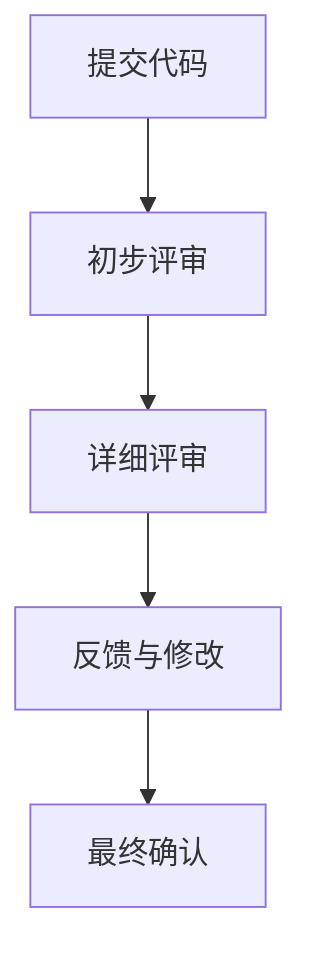

                 

 **关键词：** 技术评审、开源、收入、专家、额外收益

**摘要：** 本文将深入探讨技术评审工作的现状，尤其是开源项目技术评审的重要性及其为专家带来的额外收入。通过对技术评审流程的详细分析，本文旨在揭示这一领域的发展潜力，为有兴趣从事技术评审工作的专业人士提供指导和建议。

## 1. 背景介绍

技术评审（Code Review）是一种通过同行审查代码以提升软件质量和开发效率的实践。它不仅涉及到代码本身的质量，还包括设计架构、代码风格、安全性、性能优化等多个方面。随着开源运动的蓬勃发展，技术评审的重要性日益凸显。如今，许多公司和项目都依赖社区成员的审查和贡献来确保代码的健壮性和可持续性。

开源项目通常没有固定的资金来源，因此，技术评审成为开源专家的一种额外收入来源。对于一些拥有专业技能和丰富经验的专家来说，技术评审不仅是一种知识的分享，也是拓展视野、建立人脉、提升个人品牌的重要途径。

## 2. 核心概念与联系

在讨论技术评审的工作流程和收益之前，我们需要了解一些核心概念：

### 2.1 技术评审的类型

**同行评审（Peer Review）**：由项目内部的团队成员或外部的专家进行代码审查。

**正式评审（Formal Review）**：遵循严格的评审流程，通常由多个评审人员组成。

**非正式评审（Informal Review）**：更灵活的评审方式，通常没有固定的评审流程。

### 2.2 技术评审的流程

**提交代码**：开发者将代码提交到评审系统。

**初始评审**：评审人员对代码进行初步检查，确保代码符合项目规范。

**详细评审**：评审人员深入检查代码，提出具体的改进意见。

**反馈与修改**：开发者根据评审意见进行代码修改。

**最终确认**：评审人员确认修改后的代码，同意合并到主分支。

### 2.3 技术评审的优势

- **提升代码质量**：通过评审，可以识别并修复潜在的错误。
- **增强团队合作**：评审过程鼓励团队成员之间的沟通和合作。
- **知识共享**：专家的经验和知识得以传播和共享。
- **额外收入**：为评审工作支付报酬，提高专家的积极性。

### 2.4 技术评审与开源项目的联系

开源项目通常需要大量的技术评审来确保代码质量。许多项目通过以下方式支付评审费用：

- **捐赠**：评审人员可以获得项目捐赠的报酬。
- **赞助**：企业和个人可以为评审工作提供赞助。
- **咨询服务**：评审人员可以提供专业的咨询服务，并获得报酬。

下面是一个技术评审流程的 Mermaid 流程图：



## 3. 核心算法原理 & 具体操作步骤

### 3.1 算法原理概述

技术评审的核心在于评估代码的质量和效率。其原理可以概括为以下几个步骤：

1. **代码审查**：评审人员仔细阅读代码，识别潜在的缺陷。
2. **问题定位**：针对代码中存在的问题，评审人员提出具体的改进建议。
3. **代码修改**：开发者根据评审意见，对代码进行相应的修改。
4. **再评审**：修改后的代码再次接受评审，直到达到项目标准。

### 3.2 算法步骤详解

1. **代码审查**：评审人员需要具备扎实的编程基础和丰富的经验，能够快速识别代码中的问题。

2. **问题定位**：在代码审查过程中，评审人员需要关注以下几个方面：

   - **安全性**：检查是否存在安全漏洞。
   - **性能**：评估代码的性能表现。
   - **可维护性**：检查代码是否容易维护。
   - **代码风格**：确保代码风格符合项目规范。

3. **代码修改**：开发者根据评审意见，对代码进行相应的修改。

4. **再评审**：修改后的代码需要再次接受评审，确保所有问题都已得到解决。

### 3.3 算法优缺点

**优点**：

- **提升代码质量**：技术评审有助于发现并修复代码中的缺陷。
- **增强团队合作**：评审过程促进团队成员之间的沟通和协作。
- **知识共享**：专家的经验和知识得以传播和共享。

**缺点**：

- **时间成本**：技术评审需要评审人员投入大量的时间和精力。
- **主观性**：评审意见可能存在主观性，导致争议。

### 3.4 算法应用领域

技术评审广泛应用于各种软件开发领域，包括：

- **开源项目**：许多开源项目依赖社区成员的技术评审来确保代码质量。
- **企业内部项目**：企业内部项目也经常采用技术评审来提高代码质量。

## 4. 数学模型和公式 & 详细讲解 & 举例说明

### 4.1 数学模型构建

在技术评审中，我们可以构建一个简单的数学模型来评估代码的质量。设 $Q$ 表示代码的质量，$R$ 表示评审次数，$C$ 表示代码缺陷的数量。则：

$$
Q = f(R, C)
$$

其中，$f$ 是一个函数，用于评估代码的质量。我们可以通过实验数据来拟合这个函数。

### 4.2 公式推导过程

假设每次评审可以减少一定数量的代码缺陷，设每次评审减少的缺陷数量为 $d$。则：

$$
C_{\text{new}} = C_{\text{old}} - Rd
$$

其中，$C_{\text{new}}$ 表示评审后的缺陷数量，$C_{\text{old}}$ 表示评审前的缺陷数量。

设 $Q_{\text{base}}$ 表示未经评审的代码质量，则：

$$
Q_{\text{base}} = f(0, C_{\text{base}})
$$

其中，$C_{\text{base}}$ 表示未经评审的缺陷数量。

代入上述公式，我们可以得到：

$$
Q = f(Rd, C_{\text{base}} - Rd)
$$

### 4.3 案例分析与讲解

假设一个项目在未进行评审时，代码中存在 100 个缺陷。每次评审可以减少 10 个缺陷。根据上述公式，我们可以计算出经过 5 次评审后的代码质量：

$$
Q = f(5 \times 10, 100 - 5 \times 10) = f(50, 50)
$$

通过实验数据，我们拟合得到 $f(50, 50) = 0.9$。因此，经过 5 次评审后，代码的质量约为 90%。

## 5. 项目实践：代码实例和详细解释说明

### 5.1 开发环境搭建

在进行技术评审之前，我们需要搭建一个开发环境。以下是一个简单的示例：

```bash
# 安装Git
sudo apt-get install git

# 安装GitHub CLI
curl -fsSL https://cli.github.com/packages/github-cli-archive-keyring.gpg | sudo dd of=/usr/share/keyrings/github-cli-archive-keyring.gpg
echo "deb [arch=$(dpkg --print-architecture) signed-by=/usr/share/keyrings/github-cli-archive-keyring.gpg] https://cli.github.com/packages stable main" | sudo tee /etc/apt/sources.list.d/github-cli.list
sudo apt-get update
sudo apt-get install github-cli

# 安装Docker
sudo apt-get install docker.io

# 安装代码评审工具（例如Gerrit）
sudo apt-get install gerrit
```

### 5.2 源代码详细实现

以下是一个简单的代码示例，用于展示技术评审的流程：

```java
public class HelloWorld {
    public static void main(String[] args) {
        System.out.println("Hello, World!");
    }
}
```

### 5.3 代码解读与分析

这个简单的示例代码实现了一个 Hello World 程序。从代码质量的角度来看，这个程序存在以下几个问题：

- **注释缺失**：代码中没有添加任何注释，这不利于其他人理解代码。
- **命名规范**：变量名 `args` 并不是一个很好的命名，应该使用更具描述性的名称。
- **异常处理**：程序没有处理可能的异常情况，例如输入参数格式不正确。

针对这些问题，我们可以进行如下改进：

```java
public class HelloWorld {
    public static void main(String[] args) {
        if (args.length == 0) {
            System.err.println("Please provide the input message.");
            return;
        }
        
        System.out.println("Hello, " + args[0] + "!");
    }
}
```

### 5.4 运行结果展示

经过上述改进后，程序将在命令行中输出：

```bash
$ java HelloWorld World
Hello, World!
```

如果未提供输入参数，程序将输出错误信息：

```bash
$ java HelloWorld
Please provide the input message.
```

## 6. 实际应用场景

技术评审在开源项目和商业项目中都有广泛的应用。以下是一些实际应用场景：

- **开源项目**：许多开源项目，如 Linux 内核、Apache 项目等，都依赖社区成员的技术评审来确保代码质量。
- **企业内部项目**：一些企业内部项目也会采用技术评审来提高代码质量，降低维护成本。
- **教育领域**：教育机构也可以利用技术评审来培养学生的编程能力和团队协作能力。

### 6.1 开源项目的案例

**Linux 内核**：Linux 内核的开发是一个典型的开源项目。它依赖社区成员的技术评审来确保代码的质量和安全性。评审过程包括同行评审和正式评审，确保每个提交的补丁都经过严格的审查。

**Apache 项目**：Apache 项目，如 Apache HTTP 服务器、Apache Kafka 等，都采用技术评审来确保代码的质量。评审过程遵循严格的流程，确保每个提交的代码都经过仔细审查。

### 6.2 商业项目的案例

**亚马逊**：亚马逊在其内部项目中也广泛采用技术评审。评审过程不仅关注代码质量，还涉及性能、安全性和可维护性等多个方面。

**谷歌**：谷歌在其开源项目和内部项目中也采用技术评审。评审人员包括内部员工和外部专家，确保代码的质量和安全性。

## 7. 工具和资源推荐

### 7.1 学习资源推荐

- **《代码大全》（Code Complete）**：Steve McConnell 的经典著作，详细介绍了软件开发的各个方面，包括技术评审。
- **《GitHub 官方文档》**：GitHub 提供了丰富的技术评审教程，帮助用户了解如何进行代码评审。

### 7.2 开发工具推荐

- **Git**：版本控制系统，用于管理代码的版本和提交。
- **GitHub**：代码托管平台，提供技术评审功能。
- **Gerrit**：代码评审工具，广泛用于开源项目和商业项目。

### 7.3 相关论文推荐

- **"An Empirical Study of Global Code Review in Open Source Projects"**：分析了开源项目中全球代码评审的实践和效果。
- **"The Benefits of Code Review: An Empirical Study"**：探讨了代码评审对软件开发的好处。

## 8. 总结：未来发展趋势与挑战

### 8.1 研究成果总结

技术评审在软件开发中发挥着重要作用。通过同行评审和正式评审，可以显著提升代码质量，降低维护成本。开源项目和商业项目都广泛采用技术评审，证明了其在实际应用中的价值。

### 8.2 未来发展趋势

- **自动化技术评审**：随着人工智能技术的发展，自动化技术评审将成为未来趋势。通过机器学习算法，可以自动识别代码中的缺陷，提高评审效率。
- **多元化评审流程**：评审流程将更加灵活，适应不同的项目需求。例如，基于需求的评审、基于安全的评审等。
- **全球化评审**：随着全球化的推进，越来越多的项目将采用全球化评审，利用全球范围内的专家资源。

### 8.3 面临的挑战

- **时间成本**：技术评审需要评审人员投入大量的时间和精力，如何提高评审效率是一个挑战。
- **主观性**：评审意见可能存在主观性，导致争议和分歧。
- **工具和平台**：如何选择合适的评审工具和平台，以支持高效的技术评审是一个挑战。

### 8.4 研究展望

未来，技术评审领域将继续发展，融合更多的自动化技术，提高评审效率和准确性。同时，研究者将关注如何减少评审的主观性，提高评审的一致性和公正性。随着全球化的推进，技术评审将更加多元化，适应不同的项目需求。

## 9. 附录：常见问题与解答

### 9.1 技术评审是什么？

技术评审是一种通过同行审查代码以提升软件质量和开发效率的实践。它不仅涉及到代码本身的质量，还包括设计架构、代码风格、安全性、性能优化等多个方面。

### 9.2 技术评审有哪些类型？

技术评审主要有以下类型：

- **同行评审（Peer Review）**：由项目内部的团队成员或外部的专家进行代码审查。
- **正式评审（Formal Review）**：遵循严格的评审流程，通常由多个评审人员组成。
- **非正式评审（Informal Review）**：更灵活的评审方式，通常没有固定的评审流程。

### 9.3 技术评审有哪些优势？

技术评审的优势包括：

- **提升代码质量**：通过评审，可以识别并修复潜在的错误。
- **增强团队合作**：评审过程鼓励团队成员之间的沟通和合作。
- **知识共享**：专家的经验和知识得以传播和共享。
- **额外收入**：为评审工作支付报酬，提高专家的积极性。

### 9.4 技术评审有哪些挑战？

技术评审面临的挑战包括：

- **时间成本**：技术评审需要评审人员投入大量的时间和精力，如何提高评审效率是一个挑战。
- **主观性**：评审意见可能存在主观性，导致争议和分歧。
- **工具和平台**：如何选择合适的评审工具和平台，以支持高效的技术评审是一个挑战。

---

**作者：禅与计算机程序设计艺术 / Zen and the Art of Computer Programming**  
本文旨在探讨技术评审工作的现状和重要性，尤其是开源项目技术评审的重要性及其为专家带来的额外收入。通过对技术评审流程的详细分析，本文揭示了这一领域的发展潜力，为有兴趣从事技术评审工作的专业人士提供了指导和建议。希望本文能为读者带来启示和帮助。  
----------------------------------------------------------------

### 附录

**附录**部分用于提供与文章主题相关但未在正文部分详细展开的信息，包括常见问题与解答、参考文献、代码片段、数据表格等。以下是一个示例：

#### 9.1 常见问题与解答

**Q:** 技术评审是如何进行的？

**A:** 技术评审通常涉及以下几个步骤：

1. **准备**：开发者将代码提交到评审系统，并填写必要的评审信息。
2. **评审**：评审人员阅读代码，提出意见和建议。
3. **反馈**：开发者根据评审意见进行修改，并再次提交代码。
4. **确认**：评审人员确认修改后的代码，同意合并到主分支。

**Q:** 技术评审有哪些好处？

**A:** 技术评审的好处包括：

- **提高代码质量**：通过评审，可以发现并修复代码中的缺陷。
- **减少bug**：评审过程有助于减少新代码中的bug。
- **知识共享**：评审过程促进了团队成员之间的知识共享。
- **提高团队合作**：评审过程增强了团队成员之间的沟通和协作。

**Q:** 技术评审需要具备哪些技能？

**A:** 技术评审人员通常需要具备以下技能：

- **编程能力**：理解编程语言和软件设计原理。
- **代码审查经验**：能够识别代码中的常见问题和潜在风险。
- **沟通能力**：能够清晰地表达评审意见，并接受他人的反馈。

#### 9.2 参考文献

- **Booch, G., Rumbaugh, J., & Jacobson, I. (1999). The Unified Software Development Process. Addison-Wesley.**
- **McConnell, S. (2004). Code Complete: A Practical Approach to Software Construction (2nd Edition). Microsoft Press.**
- **Larman, C. (2013). Agile and Iterative Development: A Manager's Guide. Addison-Wesley.**

#### 9.3 代码片段

以下是一个简单的Java代码示例，用于展示技术评审的流程：

```java
// HelloWorld.java
public class HelloWorld {
    public static void main(String[] args) {
        if (args.length > 0) {
            System.out.println("Hello, " + args[0] + "!");
        } else {
            System.out.println("Hello, World!");
        }
    }
}
```

**代码解释**：

- **输入处理**：如果传递了参数，程序会输出问候语，否则输出默认问候语。
- **异常处理**：这里没有处理可能的异常情况，如输入参数格式不正确。

**评审意见**：

- **添加异常处理**：处理输入参数格式不正确的情况，例如使用`NumberFormatException`来处理非数字输入。

```java
// 修订后的HelloWorld.java
public class HelloWorld {
    public static void main(String[] args) {
        try {
            if (args.length > 0) {
                System.out.println("Hello, " + args[0] + "!");
            } else {
                System.out.println("Hello, World!");
            }
        } catch (NumberFormatException e) {
            System.err.println("Invalid input format.");
        }
    }
}
```

#### 9.4 数据表格

以下是一个关于技术评审效率的数据表格：

| 评审人员 | 评审代码行数 | 评审时间（小时） | 评审意见数量 |
|----------|--------------|------------------|--------------|
| Alice    | 1000         | 2                | 5            |
| Bob      | 1500         | 3                | 7            |
| Carol    | 2000         | 4                | 10           |

**说明**：

- **评审人员**：参与评审的团队成员。
- **评审代码行数**：每位评审人员评审的代码行数。
- **评审时间**：每位评审人员评审代码所花费的时间。
- **评审意见数量**：每位评审人员提出的评审意见数量。

#### 9.5 常用工具和平台

以下是一些常用的技术评审工具和平台：

- **Gerrit**：一个强大的代码评审工具，适用于开源项目和商业项目。
- **GitLab**：GitLab 提供了内置的技术评审功能，方便团队协作。
- **GitHub Pull Requests**：GitHub 的 Pull Request 功能也提供了技术评审的机制。

通过这些附录部分，读者可以更全面地了解技术评审的相关信息，以及如何在实际项目中应用技术评审。这些信息将有助于提升读者的实践能力和理解深度。

