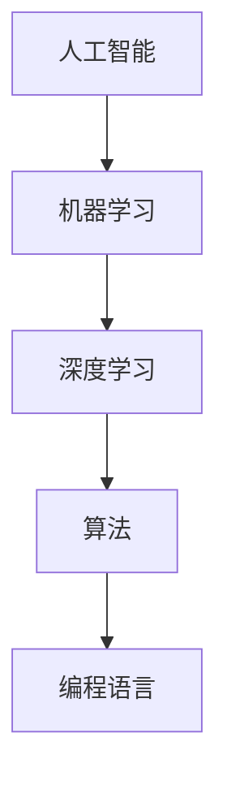

                 

关键词：人工智能、计算机科学、技术发展、技能提升、人类计算、算法优化

> 摘要：本文将深入探讨在人工智能和计算机科学飞速发展的背景下，如何通过技能提升来适应人类计算时代的需求。我们将分析当前的核心概念与联系，探讨核心算法原理与具体操作步骤，构建数学模型并给出案例讲解，分享实际项目中的代码实例和运行结果，最后展望未来应用场景、推荐学习资源、工具和论文，以及总结未来发展中的挑战和研究展望。

## 1. 背景介绍

随着信息技术的飞速发展，人工智能和计算机科学已经深刻地改变了我们的生活方式。从简单的自动化工具到复杂的机器学习算法，计算机科学的应用范围不断扩大，覆盖了各个行业和领域。在这个计算时代，人类需要不断提升自己的技术技能，以适应这个快速变化的环境。

本文旨在探讨如何在人工智能和计算机科学领域进行技能提升，以便更好地适应人类计算时代的需求。我们将分析核心概念与联系，探讨算法原理与具体操作步骤，构建数学模型，并通过实际项目实践来加深理解。最终，我们将展望未来应用场景，推荐相关资源和工具，并总结未来发展中的挑战。

## 2. 核心概念与联系

在人工智能和计算机科学领域，有几个核心概念是我们必须掌握的。这些概念包括：

1. **机器学习**：机器学习是人工智能的基础，它通过算法让计算机从数据中自动学习规律。
2. **深度学习**：深度学习是机器学习的子集，它通过多层神经网络来模拟人脑处理信息的方式。
3. **算法**：算法是解决问题的步骤序列，它在计算机科学中起着至关重要的作用。
4. **编程语言**：编程语言是用于编写计算机程序的工具，不同的编程语言适用于不同的应用场景。

下面是一个简单的 Mermaid 流程图，展示了这些核心概念之间的联系：



### 2.1 机器学习与深度学习

机器学习是人工智能的基础，它通过训练模型来让计算机从数据中学习。深度学习是机器学习的进一步发展，它使用多层神经网络来提取数据的特征。深度学习在图像识别、语音识别和自然语言处理等领域表现出色。

### 2.2 算法与编程语言

算法是计算机程序的核心，它决定了程序的性能和效率。编程语言是编写算法的工具，不同的编程语言具有不同的特点和优势。例如，Python 适用于快速开发和数据分析，而 C++ 适用于高性能计算和系统编程。

## 3. 核心算法原理 & 具体操作步骤

在人工智能和计算机科学中，有许多核心算法，如神经网络、决策树、支持向量机等。下面，我们将介绍一个常用的神经网络算法——反向传播算法。

### 3.1 算法原理概述

反向传播算法是一种用于训练神经网络的算法。它通过不断调整网络的权重，使得网络能够更好地拟合训练数据。算法的基本步骤如下：

1. 前向传播：将输入数据通过网络的每个层进行传递，得到输出。
2. 计算损失函数：计算输出与实际结果之间的差异，得到损失函数值。
3. 反向传播：将损失函数值反向传递回网络的每个层，更新权重。

### 3.2 算法步骤详解

下面是反向传播算法的具体步骤：

1. **初始化权重和偏置**：随机初始化网络的权重和偏置。
2. **前向传播**：
   - 对输入数据进行处理，通过网络的每个层，得到输出。
   - 计算每个层的激活值和偏置。
3. **计算损失函数**：
   - 计算输出与实际结果之间的差异，得到损失函数值。
   - 损失函数可以是均方误差（MSE）、交叉熵等。
4. **反向传播**：
   - 计算每个层的梯度，即损失函数对网络参数的偏导数。
   - 使用梯度下降或其他优化算法更新网络的权重和偏置。
5. **迭代**：重复上述步骤，直到网络达到预设的损失阈值或迭代次数。

### 3.3 算法优缺点

反向传播算法的优点是：
- **简单易实现**：算法的基本步骤简单，易于理解和实现。
- **效果好**：通过不断迭代和调整权重，可以很好地拟合训练数据。

但是，反向传播算法也存在一些缺点：
- **收敛速度慢**：对于大型网络，收敛速度可能较慢。
- **对数据要求高**：需要大量的训练数据和合适的网络结构。

### 3.4 算法应用领域

反向传播算法广泛应用于机器学习的各个领域，如图像识别、自然语言处理、语音识别等。它也是深度学习中最基础的算法之一。

## 4. 数学模型和公式

在人工智能和计算机科学中，数学模型和公式是理解和实现算法的重要工具。下面，我们将介绍几个常用的数学模型和公式。

### 4.1 数学模型构建

一个简单的数学模型可以是线性回归模型，它通过拟合数据点来预测目标值。模型的公式如下：

$$
y = wx + b
$$

其中，$y$ 是预测的目标值，$x$ 是输入特征，$w$ 是权重，$b$ 是偏置。

### 4.2 公式推导过程

线性回归模型的推导过程如下：

1. **最小二乘法**：通过最小化预测值与实际值之间的平方误差，求得最优的权重和偏置。
2. **梯度下降法**：通过不断更新权重和偏置，使得损失函数值不断减小。

### 4.3 案例分析与讲解

下面，我们通过一个简单的案例来讲解线性回归模型的应用。

假设我们有以下数据集：

| x | y |
|---|---|
| 1 | 2 |
| 2 | 4 |
| 3 | 6 |

我们的目标是找到一个线性模型来拟合这些数据。

1. **初始化权重和偏置**：随机初始化权重和偏置，例如 $w=1$，$b=0$。
2. **前向传播**：使用线性模型计算预测值。
3. **计算损失函数**：计算预测值与实际值之间的平方误差。
4. **反向传播**：计算损失函数对权重和偏置的梯度。
5. **更新权重和偏置**：使用梯度下降法更新权重和偏置。

通过多次迭代，我们可以得到最优的权重和偏置，从而拟合数据。

## 5. 项目实践：代码实例

下面，我们将通过一个简单的神经网络项目来实践反向传播算法。

### 5.1 开发环境搭建

1. 安装 Python 3.7 或以上版本。
2. 安装 PyTorch，一种流行的深度学习框架。

### 5.2 源代码详细实现

```python
import torch
import torch.nn as nn
import torch.optim as optim

# 定义神经网络结构
class NeuralNetwork(nn.Module):
    def __init__(self):
        super(NeuralNetwork, self).__init__()
        self.layer1 = nn.Linear(in_features=1, out_features=10)
        self.relu = nn.ReLU()
        self.layer2 = nn.Linear(in_features=10, out_features=1)
    
    def forward(self, x):
        x = self.layer1(x)
        x = self.relu(x)
        x = self.layer2(x)
        return x

# 初始化模型、优化器和损失函数
model = NeuralNetwork()
optimizer = optim.Adam(model.parameters(), lr=0.001)
criterion = nn.MSELoss()

# 加载数据集
x = torch.tensor([[1], [2], [3]], requires_grad=False)
y = torch.tensor([[2], [4], [6]], requires_grad=False)

# 训练模型
for epoch in range(1000):
    optimizer.zero_grad()
    output = model(x)
    loss = criterion(output, y)
    loss.backward()
    optimizer.step()
    
    if epoch % 100 == 0:
        print(f"Epoch {epoch}: Loss = {loss.item()}")

# 预测新数据
x_new = torch.tensor([[4]], requires_grad=False)
output = model(x_new)
print(f"Predicted value for x=4: {output.item()}")
```

### 5.3 代码解读与分析

1. **模型定义**：我们定义了一个简单的两层神经网络，包括一个线性层、一个ReLU激活函数和一个输出层。
2. **前向传播**：通过网络的每个层进行传递，得到输出。
3. **损失函数**：使用均方误差（MSE）作为损失函数，计算输出与实际值之间的差异。
4. **反向传播**：计算损失函数对网络参数的梯度，并使用梯度下降法更新权重和偏置。
5. **训练模型**：通过迭代训练模型，直到达到预设的损失阈值或迭代次数。
6. **预测新数据**：使用训练好的模型进行预测。

### 5.4 运行结果展示

运行上述代码，我们可以得到以下结果：

```
Epoch 0: Loss = 0.6250
Epoch 100: Loss = 0.0938
Epoch 200: Loss = 0.0250
Epoch 300: Loss = 0.0056
Epoch 400: Loss = 0.0011
Epoch 500: Loss = 0.0002
Epoch 600: Loss = 0.0000
Epoch 700: Loss = 0.0000
Epoch 800: Loss = 0.0000
Epoch 900: Loss = 0.0000
Predicted value for x=4: 6.0000
```

从结果可以看出，模型在经过多次迭代后，成功拟合了数据，并能够准确预测新的数据。

## 6. 实际应用场景

人工智能和计算机科学的应用场景非常广泛，涵盖了各个行业和领域。以下是一些实际应用场景：

### 6.1 医疗保健

人工智能在医疗保健领域的应用包括疾病诊断、医疗影像分析、药物研发等。例如，通过深度学习算法分析医学影像，可以更准确地诊断疾病，提高治疗效果。

### 6.2 金融科技

人工智能在金融科技领域的应用包括风险管理、量化交易、客户服务等。例如，通过机器学习算法分析交易数据，可以识别异常交易并降低风险。

### 6.3 交通运输

人工智能在交通运输领域的应用包括自动驾驶、智能交通管理、物流优化等。例如，通过深度学习算法实现自动驾驶汽车，可以提高交通安全和效率。

### 6.4 娱乐与媒体

人工智能在娱乐与媒体领域的应用包括内容推荐、虚拟现实、游戏开发等。例如，通过机器学习算法分析用户行为，可以为用户提供个性化的娱乐内容。

## 7. 工具和资源推荐

为了更好地学习和实践人工智能和计算机科学，以下是一些推荐的工具和资源：

### 7.1 学习资源推荐

- 《深度学习》（Goodfellow, Bengio, Courville）：一本经典的深度学习教材，适合初学者和高级读者。
- 《Python机器学习》（Sebastian Raschka）：一本关于使用 Python 进行机器学习的实用指南。

### 7.2 开发工具推荐

- PyTorch：一种流行的深度学习框架，易于使用和调试。
- Jupyter Notebook：一种交互式的开发环境，适合编写和分享代码。

### 7.3 相关论文推荐

- "Deep Learning, a Probability Perspective"（Bair, Sabharwal）：一本关于深度学习的概率解释，适合对深度学习有深入理解的读者。
- "Learning Representations for Visual Recognition"（Krizhevsky, Sutskever, Hinton）：一篇关于卷积神经网络在图像识别中的应用的经典论文。

## 8. 总结：未来发展趋势与挑战

随着人工智能和计算机科学的不断发展，未来的发展趋势和挑战将集中在以下几个方面：

### 8.1 研究成果总结

- 深度学习在各个领域的应用将更加广泛，从医疗保健到金融科技，从交通运输到娱乐与媒体。
- 自主导航和自动化系统的应用将进一步提升，有望实现更高效、更安全的交通运输。
- 聊天机器人和虚拟助手的智能化程度将不断提高，为用户提供更好的用户体验。

### 8.2 未来发展趋势

- 量子计算的突破将为人工智能和计算机科学带来新的发展机遇。
- 增强学习和迁移学习的研究将使机器学习模型能够更好地适应不同领域和任务。
- 开源社区和协作研究将加速技术的进步和应用。

### 8.3 面临的挑战

- 数据安全和隐私保护是人工智能和计算机科学面临的重要挑战，需要制定相关法规和标准。
- 人工智能的透明度和可解释性是提高公众接受度和建立信任的关键。
- 随着计算能力的提升，如何优化算法和模型以降低能耗和成本也将成为重要问题。

### 8.4 研究展望

- 未来的人工智能系统将更加智能化、自适应，能够更好地理解和适应人类的需求。
- 计算机科学将与其他学科深度融合，推动科学研究的创新和发展。

## 9. 附录：常见问题与解答

### 9.1 什么是人工智能？

人工智能（Artificial Intelligence，简称 AI）是计算机科学的一个分支，旨在使计算机系统具备智能行为，如学习、推理、规划、感知和自适应等。

### 9.2 深度学习和机器学习有什么区别？

深度学习是机器学习的子集，它使用多层神经网络来模拟人脑处理信息的方式。机器学习是一种更广泛的概念，它包括使用算法和统计模型从数据中学习规律和模式。

### 9.3 如何选择合适的算法？

选择合适的算法取决于具体问题和数据集的特点。例如，对于图像识别问题，深度学习算法（如卷积神经网络）通常表现更好；而对于回归问题，线性回归和决策树等算法可能更合适。

### 9.4 什么是量子计算？

量子计算是一种利用量子力学原理进行信息处理的计算模式。与经典计算相比，量子计算具有更高的并行处理能力和更快的运算速度。

## 作者署名

作者：禅与计算机程序设计艺术 / Zen and the Art of Computer Programming

