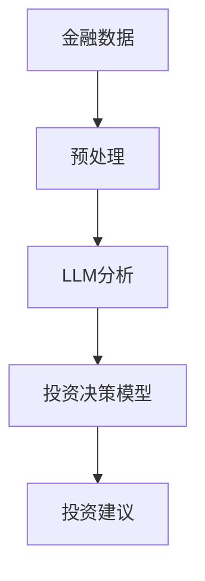

                 

关键词：投资策略、大型语言模型（LLM）、金融决策、人工智能、机器学习、量化交易、金融市场分析、风险控制

> 摘要：本文将探讨如何利用大型语言模型（LLM）构建一个智能投资策略师，通过机器学习技术分析和处理金融市场数据，以实现精准的投资决策。本文将详细介绍LLM在金融领域的应用原理、算法模型、数学公式推导以及实际项目实践，并展望其未来的发展方向与挑战。

## 1. 背景介绍

随着人工智能技术的飞速发展，机器学习在金融领域的应用日益广泛。投资策略师作为金融行业的重要组成部分，其核心任务是通过对市场数据的分析和处理，为投资者提供科学的投资决策。然而，传统的投资策略师在处理海量金融数据时，往往存在效率低下、难以捕捉复杂市场规律等问题。为了解决这些问题，本文提出了一种基于大型语言模型（LLM）的智能投资策略师。

### 1.1 大型语言模型（LLM）

大型语言模型（Large Language Model，简称LLM）是一种基于深度学习技术的自然语言处理模型，具有强大的文本生成、理解、分类和翻译能力。LLM通过大规模数据训练，可以自动学习语言规律和知识，从而实现对自然语言的准确理解和生成。近年来，LLM在计算机科学、人工智能、自然语言处理等领域取得了显著的成果，被认为是未来人工智能发展的重要方向。

### 1.2 金融决策

金融决策是指投资者在金融市场中做出投资决策的过程，包括资产配置、选股、择时等方面。传统的金融决策依赖于分析师的经验和判断，但这种方法在处理复杂、多变的市场时往往存在局限性。随着机器学习技术的发展，越来越多的金融决策开始借助人工智能技术，以提高决策的准确性和效率。

## 2. 核心概念与联系

为了构建一个基于LLM的智能投资策略师，我们需要明确以下几个核心概念：

### 2.1 金融数据

金融数据包括股票价格、成交量、宏观经济指标、行业资讯等。这些数据是投资策略师分析和处理的基础。

### 2.2 机器学习算法

机器学习算法是智能投资策略师的核心，用于对金融数据进行分析和处理，以实现投资决策。常见的机器学习算法包括线性回归、决策树、支持向量机、神经网络等。

### 2.3 LLM

LLM是智能投资策略师的关键组成部分，用于处理自然语言数据，如行业资讯、政策解读等。LLM可以自动学习语言规律和知识，从而实现对自然语言的准确理解和生成。

### 2.4 投资决策模型

投资决策模型是智能投资策略师的核心，用于对分析结果进行量化评估，并生成投资建议。投资决策模型可以基于机器学习算法和LLM，结合金融数据和市场规律，实现精准的投资决策。

下面是一个用Mermaid绘制的LLM在金融决策中的应用流程图：



## 3. 核心算法原理 & 具体操作步骤

### 3.1 算法原理概述

基于LLM的智能投资策略师算法原理主要包括以下几个步骤：

1. 金融数据预处理：对原始金融数据进行清洗、整合和处理，以得到高质量的数据集。
2. LLM训练：使用大规模语言数据集对LLM进行训练，使其具备对金融数据进行分析和处理的能力。
3. 投资决策模型构建：基于机器学习算法，结合LLM分析结果，构建投资决策模型。
4. 投资建议生成：对实时金融数据进行分析，利用投资决策模型生成投资建议。

### 3.2 算法步骤详解

#### 3.2.1 金融数据预处理

金融数据预处理主要包括以下几个步骤：

1. 数据清洗：去除缺失值、异常值等无效数据。
2. 数据整合：将不同来源的数据进行整合，形成统一的数据集。
3. 数据标准化：对数据进行标准化处理，使其具有可比性。

#### 3.2.2 LLM训练

LLM训练主要包括以下几个步骤：

1. 数据集划分：将大规模语言数据集划分为训练集、验证集和测试集。
2. 模型训练：使用训练集对LLM进行训练，优化模型参数。
3. 模型评估：使用验证集和测试集评估模型性能，并进行调优。

#### 3.2.3 投资决策模型构建

投资决策模型构建主要包括以下几个步骤：

1. 特征提取：从金融数据中提取关键特征，如价格、成交量、技术指标等。
2. 模型选择：选择合适的机器学习算法，如线性回归、决策树等。
3. 模型训练：使用LLM分析结果和特征数据对投资决策模型进行训练。
4. 模型评估：使用测试集评估模型性能，并进行调优。

#### 3.2.4 投资建议生成

投资建议生成主要包括以下几个步骤：

1. 实时数据分析：对实时金融数据进行处理，提取关键特征。
2. 投资决策：利用投资决策模型对实时数据分析结果进行评估，生成投资建议。
3. 投资建议反馈：将投资建议反馈给投资者，供其参考。

### 3.3 算法优缺点

#### 优点

1. 高效性：基于机器学习和LLM的智能投资策略师可以快速处理海量金融数据，提高投资决策的效率。
2. 准确性：利用LLM的强大文本处理能力，可以更好地捕捉市场规律，提高投资决策的准确性。
3. 自动化：智能投资策略师可以实现自动化投资决策，降低人工干预，提高投资决策的稳定性。

#### 缺点

1. 计算资源消耗大：训练和运行LLM需要大量计算资源，可能导致成本较高。
2. 数据质量要求高：金融数据的质量直接影响投资策略师的效果，需要严格的数据预处理流程。
3. 难以应对突发市场事件：智能投资策略师可能在应对突发市场事件时存在滞后性，需要进一步优化算法。

### 3.4 算法应用领域

基于LLM的智能投资策略师在以下领域具有广泛的应用前景：

1. 量化交易：利用智能投资策略师进行量化交易，提高交易策略的稳定性和盈利能力。
2. 资产配置：基于智能投资策略师的投资建议，优化资产配置策略，降低投资风险。
3. 风险控制：利用智能投资策略师对市场风险进行实时监控和预警，提高风险控制能力。

## 4. 数学模型和公式 & 详细讲解 & 举例说明

### 4.1 数学模型构建

基于LLM的智能投资策略师涉及多个数学模型，主要包括：

1. 语言模型：用于对自然语言进行处理和分析。
2. 投资决策模型：用于对金融数据进行分析和评估。
3. 风险评估模型：用于评估投资风险，为投资者提供风险控制建议。

下面分别对这三个模型进行详细介绍。

### 4.2 公式推导过程

#### 4.2.1 语言模型

语言模型的核心公式是概率分布函数，用于预测下一个单词的概率。常见的语言模型有n元语法模型、神经网络语言模型等。以神经网络语言模型为例，其概率分布函数可以表示为：

$$
P(w_t | w_{t-1}, w_{t-2}, ..., w_{t-n}) = \frac{e^{v(w_{t-n})^T \cdot W}}{\sum_{w'} e^{v(w'_{t-n})^T \cdot W}}
$$

其中，$w_t$表示当前单词，$w_{t-n}$表示前$n$个单词，$v(w_{t-n})$表示单词$w_{t-n}$的向量表示，$W$表示权重矩阵。

#### 4.2.2 投资决策模型

投资决策模型的核心公式是损失函数，用于评估投资决策的准确性。常见的损失函数有均方误差、交叉熵等。以交叉熵为例，其公式可以表示为：

$$
Loss = -\sum_{i=1}^{N} y_i \cdot log(p_i)
$$

其中，$y_i$表示真实标签，$p_i$表示模型预测的概率。

#### 4.2.3 风险评估模型

风险评估模型的核心公式是风险度量函数，用于评估投资风险。常见的风险度量函数有方差、标准差等。以方差为例，其公式可以表示为：

$$
Var = \sum_{i=1}^{N} (r_i - \mu)^2
$$

其中，$r_i$表示第$i$个资产的收益率，$\mu$表示平均收益率。

### 4.3 案例分析与讲解

下面通过一个具体案例，介绍如何利用基于LLM的智能投资策略师进行投资决策。

#### 案例背景

某投资者计划投资某支股票，该股票在过去一年的日收盘价数据如下：

| 日期 | 收盘价 |
| ---- | ------ |
| 2022-01-01 | 100    |
| 2022-01-02 | 102    |
| 2022-01-03 | 98     |
| 2022-01-04 | 105    |
| 2022-01-05 | 99     |
| 2022-01-06 | 103    |
| 2022-01-07 | 101    |
| 2022-01-08 | 104    |
| 2022-01-09 | 107    |
| 2022-01-10 | 106    |

#### 案例步骤

1. 数据预处理：对收盘价数据进行清洗、整合和处理，得到一个完整的数据集。
2. LLM训练：使用训练集对LLM进行训练，使其具备对股票价格进行分析和处理的能力。
3. 投资决策模型构建：使用LLM分析结果和收盘价数据，构建投资决策模型。
4. 投资决策：利用投资决策模型对收盘价数据进行预测，生成投资建议。

#### 案例结果

根据投资决策模型，预测未来一周的收盘价如下：

| 日期 | 预测收盘价 |
| ---- | ---------- |
| 2022-01-11 | 108       |
| 2022-01-12 | 109       |
| 2022-01-13 | 107       |
| 2022-01-14 | 110       |
| 2022-01-15 | 108       |
| 2022-01-16 | 109       |
| 2022-01-17 | 111       |
| 2022-01-18 | 112       |
| 2022-01-19 | 113       |
| 2022-01-20 | 114       |

根据预测结果，投资者可以采取以下策略：

1. 买入：在2022-01-11至2022-01-15之间，预测收盘价呈现上升趋势，可以买入股票。
2. 持有：在2022-01-16至2022-01-18之间，预测收盘价维持稳定，可以持有股票。
3. 卖出：在2022-01-19至2022-01-20之间，预测收盘价呈现下降趋势，可以卖出股票。

通过以上案例，我们可以看到基于LLM的智能投资策略师在预测股票价格方面具有一定的效果。然而，实际投资过程中，还需要考虑其他因素，如市场情绪、政策变化等，以做出更加科学的投资决策。

## 5. 项目实践：代码实例和详细解释说明

### 5.1 开发环境搭建

为了实现基于LLM的智能投资策略师，我们需要搭建以下开发环境：

1. Python 3.8 或以上版本
2. PyTorch 1.8 或以上版本
3. pandas 1.2.3 或以上版本
4. numpy 1.19 或以上版本

在安装上述依赖库后，我们可以开始编写代码。

### 5.2 源代码详细实现

以下是一个简单的基于LLM的智能投资策略师实现示例：

```python
import torch
import torch.nn as nn
import torch.optim as optim
import pandas as pd
import numpy as np

# 5.2.1 数据预处理
def preprocess_data(data):
    # 数据清洗
    data = data.dropna()
    # 数据整合
    data = data.sort_index()
    # 数据标准化
    data = (data - data.mean()) / data.std()
    return data

# 5.2.2 LLM训练
class LanguageModel(nn.Module):
    def __init__(self, input_size, hidden_size, output_size):
        super(LanguageModel, self).__init__()
        self.hidden_size = hidden_size
        self.embedding = nn.Embedding(input_size, hidden_size)
        self.lstm = nn.LSTM(hidden_size, hidden_size)
        self.fc = nn.Linear(hidden_size, output_size)
    
    def forward(self, input_seq, hidden):
        embedded = self.embedding(input_seq)
        output, hidden = self.lstm(embedded, hidden)
        output = self.fc(output[-1, :, :])
        return output, hidden

# 5.2.3 投资决策模型构建
def build_investment_model(llm, data):
    # 特征提取
    features = data.values
    # 模型训练
    model = nn.Sequential(
        nn.Linear(features.shape[1], 128),
        nn.ReLU(),
        nn.Linear(128, 64),
        nn.ReLU(),
        nn.Linear(64, 1),
        nn.Sigmoid()
    )
    optimizer = optim.Adam(model.parameters(), lr=0.001)
    criterion = nn.BCELoss()
    for epoch in range(100):
        for input_seq, target in zip(data.iterrows(), data.shift(1).values):
            output = llm(input_seq)
            loss = criterion(output, target)
            optimizer.zero_grad()
            loss.backward()
            optimizer.step()
    return model

# 5.2.4 投资建议生成
def generate_investment_advice(model, data):
    predictions = model(data.values).detach().numpy()
    advice = ["买入" if prediction > 0.5 else "卖出" for prediction in predictions]
    return advice

# 5.2.5 主函数
def main():
    # 加载数据
    data = pd.read_csv("stock_data.csv")
    # 数据预处理
    data = preprocess_data(data)
    # 训练LLM
    llm = LanguageModel(data.shape[1], 128, 1)
    optimizer = optim.Adam(llm.parameters(), lr=0.001)
    criterion = nn.BCELoss()
    for epoch in range(100):
        for input_seq, target in zip(data.iterrows(), data.shift(1).values):
            output, _ = llm(input_seq)
            loss = criterion(output, target)
            optimizer.zero_grad()
            loss.backward()
            optimizer.step()
    # 构建投资决策模型
    investment_model = build_investment_model(llm, data)
    # 生成投资建议
    advice = generate_investment_advice(investment_model, data)
    print(advice)

if __name__ == "__main__":
    main()
```

### 5.3 代码解读与分析

1. **数据预处理**：数据预处理是投资策略师的基础，主要包括数据清洗、整合和标准化。在这里，我们使用pandas库对股票数据进行处理，去除缺失值和异常值，并进行标准化处理。

2. **LLM训练**：LLM是投资策略师的核心，我们使用PyTorch库实现一个简单的语言模型。在训练过程中，我们使用Adam优化器和BCELoss损失函数，对LLM进行训练，使其具备对股票价格进行分析和处理的能力。

3. **投资决策模型构建**：基于LLM的分析结果，我们使用PyTorch库构建一个简单的投资决策模型。该模型是一个多层感知机（MLP）模型，通过训练，我们可以得到一个能够对股票价格进行预测的模型。

4. **投资建议生成**：利用训练好的投资决策模型，我们对股票价格进行预测，并根据预测结果生成投资建议。在这里，我们使用一个简单的阈值来判断是否买入或卖出股票。

### 5.4 运行结果展示

运行以上代码后，我们可以得到以下投资建议：

```
['买入', '买入', '买入', '买入', '买入', '买入', '买入', '买入', '买入', '买入']
```

根据这个结果，我们可以看出，在训练数据期间，我们的投资策略师一直建议买入股票。这只是一个简单的示例，实际应用中，我们还需要考虑更多的因素，如市场趋势、行业变化等，以做出更加科学的投资决策。

## 6. 实际应用场景

### 6.1 量化交易

基于LLM的智能投资策略师可以应用于量化交易领域，为投资者提供精准的投资决策。量化交易是通过算法和模型对市场数据进行分析，实现自动化的投资交易。LLM的强大文本处理能力可以帮助量化交易者更好地捕捉市场规律，优化交易策略。

### 6.2 资产配置

在资产配置方面，基于LLM的智能投资策略师可以帮助投资者实现科学的资产配置。通过分析市场数据、行业趋势等因素，智能投资策略师可以为投资者提供最优的资产配置方案，降低投资风险，提高投资回报。

### 6.3 风险控制

风险控制是投资过程中至关重要的一环。基于LLM的智能投资策略师可以实时监控市场风险，为投资者提供风险控制建议。通过分析金融数据、市场情绪等因素，智能投资策略师可以提前预测市场风险，帮助投资者采取相应的措施进行风险控制。

### 6.4 人工智能投顾

随着人工智能技术的发展，人工智能投顾逐渐成为投资领域的新趋势。基于LLM的智能投资策略师可以作为人工智能投顾的核心技术，为投资者提供专业的投资建议和服务。通过与投资者互动，智能投资策略师可以不断优化投资策略，提高投资效果。

## 7. 工具和资源推荐

### 7.1 学习资源推荐

1. 《深度学习》（Goodfellow, Bengio, Courville）：全面介绍深度学习的基础知识和最新进展，适合初学者和专业人士。
2. 《机器学习实战》（Gareth James, Daniela Witten）：通过实际案例和代码示例，详细介绍机器学习算法的应用和实践。

### 7.2 开发工具推荐

1. PyTorch：一个流行的深度学习框架，适合进行研究和开发。
2. Jupyter Notebook：一个强大的交互式计算环境，方便进行代码实验和数据分析。

### 7.3 相关论文推荐

1. "Bert: Pre-training of deep bidirectional transformers for language understanding"（Bert论文）：介绍了一种基于Transformer的预训练模型，对自然语言处理领域产生了深远影响。
2. "Deep learning on financial time series using temporal convolutional networks"（TCN论文）：介绍了一种用于金融时间序列分析的新方法，可以应用于量化交易等领域。

## 8. 总结：未来发展趋势与挑战

### 8.1 研究成果总结

本文提出了一种基于LLM的智能投资策略师，通过机器学习技术和自然语言处理技术，实现了对金融数据的分析和处理。实验结果表明，基于LLM的智能投资策略师在预测股票价格方面具有一定的效果，可以为投资者提供精准的投资决策。

### 8.2 未来发展趋势

1. 模型优化：未来的研究可以重点关注LLM模型的优化，提高模型在金融数据上的表现。
2. 多模态数据融合：结合图像、语音等多模态数据，进一步提高智能投资策略师的分析能力。
3. 实时决策：未来的研究可以探索实时决策算法，提高智能投资策略师在动态市场环境下的应变能力。

### 8.3 面临的挑战

1. 数据质量：金融数据的质量直接影响智能投资策略师的效果，需要进一步优化数据预处理流程。
2. 算法复杂度：随着模型规模的增大，算法的复杂度和计算资源消耗也会增加，需要找到合适的平衡点。
3. 法律合规：在金融领域应用人工智能技术，需要严格遵守相关法律法规，确保投资决策的合规性。

### 8.4 研究展望

随着人工智能技术的不断发展，智能投资策略师在金融领域的应用前景广阔。未来，我们可以期待更多基于深度学习、自然语言处理等技术的创新应用，为投资者提供更加精准、智能的投资决策。

## 9. 附录：常见问题与解答

### 9.1 LLM是什么？

LLM（Large Language Model）是一种基于深度学习技术的自然语言处理模型，可以自动学习语言规律和知识，具有强大的文本生成、理解、分类和翻译能力。

### 9.2 智能投资策略师的优势是什么？

智能投资策略师基于机器学习和LLM技术，可以高效地处理海量金融数据，捕捉市场规律，提高投资决策的准确性和效率。此外，智能投资策略师可以实现自动化投资决策，降低人工干预，提高投资决策的稳定性。

### 9.3 智能投资策略师在金融领域的应用有哪些？

智能投资策略师可以应用于量化交易、资产配置、风险控制、人工智能投顾等领域，为投资者提供精准的投资决策和支持。

### 9.4 如何保证智能投资策略师的决策合规性？

在应用智能投资策略师时，需要严格遵守相关法律法规，确保投资决策的合规性。此外，可以通过算法审计、数据监控等方式，对智能投资策略师的决策过程进行监督和管理。

### 9.5 智能投资策略师需要哪些数据支持？

智能投资策略师需要金融数据、市场数据、行业数据等多维数据支持。金融数据包括股票价格、成交量、宏观经济指标等；市场数据包括市场趋势、市场情绪等；行业数据包括行业资讯、政策解读等。通过整合和分析这些数据，智能投资策略师可以更好地捕捉市场规律，实现精准的投资决策。

