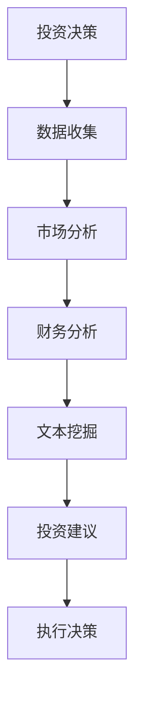

                 

关键词：投资管理、LLM（大型语言模型）、策略、人工智能、金融科技、算法、数学模型、实践案例、未来展望

## 摘要

本文将探讨如何利用大型语言模型（LLM）来优化投资管理策略。随着人工智能技术的不断发展，LLM 在金融领域的应用日益广泛，为投资决策提供了新的视角和工具。本文首先介绍了投资管理的基本概念和传统方法，然后深入分析了 LLM 的工作原理及其在投资管理中的应用。随后，本文通过数学模型和具体案例，详细阐述了如何利用 LLM 进行投资决策，并对其优缺点进行了全面评估。最后，本文展望了 LLM 在投资管理领域的未来发展趋势和挑战。

## 1. 背景介绍

### 1.1 投资管理的概念

投资管理是指通过选择和组合各种投资工具，以实现投资者在风险可控的前提下获得最大收益的过程。投资管理涉及多个方面，包括市场分析、资产配置、风险控制、业绩评估等。其核心目标是优化投资组合，使其在风险和收益之间达到最佳平衡。

### 1.2 投资管理的方法

传统投资管理方法主要包括以下几种：

1. **基本面分析**：通过分析企业的财务状况、行业前景等因素，判断其投资价值。
2. **技术分析**：通过研究市场数据（如价格、成交量等），寻找价格走势的规律，预测未来市场走势。
3. **量化投资**：利用数学模型和计算机算法，对大量历史数据进行分析，寻找投资机会。

### 1.3 人工智能在金融领域的应用

随着人工智能技术的不断发展，其在金融领域的应用也越来越广泛。人工智能可以帮助金融机构提高决策效率，降低风险，实现精准营销等。其中，大型语言模型（LLM）作为一种重要的自然语言处理技术，已经在金融领域展现出了巨大的潜力。

## 2. 核心概念与联系

### 2.1 LLM 的原理

大型语言模型（LLM）是基于深度学习技术的自然语言处理模型，它可以通过学习大量的文本数据，理解并生成自然语言。LLM 的基本原理是神经网络，通过多层神经元的组合，实现对输入文本的语义理解和生成。

### 2.2 LLM 在投资管理中的应用

LLM 在投资管理中的应用主要体现在以下几个方面：

1. **市场预测**：通过分析历史市场数据，LLM 可以预测市场的未来走势，为投资决策提供依据。
2. **财务分析**：LLM 可以自动提取和分析企业财务报表中的关键信息，评估企业的投资价值。
3. **文本挖掘**：LLM 可以对新闻、报告等文本进行分析，挖掘市场信息，为投资决策提供支持。

### 2.3 LLM 与投资管理的联系

LLM 与投资管理的联系主要体现在以下几个方面：

1. **数据挖掘**：LLM 可以从海量数据中提取有价值的信息，为投资决策提供支持。
2. **智能分析**：LLM 可以对市场、企业等多方面的信息进行智能分析，提高投资决策的准确性。
3. **自动化**：LLM 可以自动化处理大量的投资决策，提高投资管理的效率。

### 2.4 Mermaid 流程图

下面是一个简单的 Mermaid 流程图，展示了 LLM 在投资管理中的应用流程：



## 3. 核心算法原理 & 具体操作步骤

### 3.1 算法原理概述

LLM 的核心算法原理是基于深度学习的自然语言处理技术。通过多层神经网络的组合，LLM 可以实现输入文本的语义理解和生成。在投资管理中，LLM 的算法原理主要体现在以下几个方面：

1. **市场预测**：通过分析历史市场数据，LLM 可以预测市场的未来走势。
2. **财务分析**：LLM 可以自动提取和分析企业财务报表中的关键信息，评估企业的投资价值。
3. **文本挖掘**：LLM 可以对新闻、报告等文本进行分析，挖掘市场信息，为投资决策提供支持。

### 3.2 算法步骤详解

1. **数据收集**：收集市场数据、企业财务数据、文本数据等。
2. **数据处理**：对数据进行清洗、预处理，使其适合 LLM 的训练。
3. **模型训练**：使用收集到的数据进行模型训练，优化模型参数。
4. **市场预测**：利用训练好的模型，对市场进行预测。
5. **财务分析**：对企业的财务数据进行分析，评估其投资价值。
6. **文本挖掘**：对文本数据进行挖掘，提取有价值的信息。
7. **投资建议**：根据市场预测、财务分析和文本挖掘的结果，生成投资建议。
8. **执行决策**：根据投资建议，执行具体的投资决策。

### 3.3 算法优缺点

**优点**：

1. **高效性**：LLM 可以处理大量数据，提高投资决策的效率。
2. **准确性**：通过深度学习技术，LLM 可以对市场、财务和文本信息进行准确分析。
3. **自动化**：LLM 可以自动化处理投资决策，降低人力成本。

**缺点**：

1. **数据依赖性**：LLM 的效果很大程度上依赖于训练数据的质量。
2. **模型复杂性**：LLM 的模型结构复杂，训练和部署成本较高。

### 3.4 算法应用领域

LLM 在投资管理中的应用领域非常广泛，主要包括以下几个方面：

1. **股票市场预测**：通过分析历史股票数据，LLM 可以预测股票的未来走势，为投资决策提供支持。
2. **债券市场分析**：LLM 可以对债券市场进行分析，评估债券的投资价值。
3. **基金组合优化**：LLM 可以对基金组合进行优化，提高投资收益。
4. **智能投顾**：LLM 可以作为智能投顾，为投资者提供个性化的投资建议。

## 4. 数学模型和公式 & 详细讲解 & 举例说明

### 4.1 数学模型构建

在投资管理中，LLM 的应用可以通过构建以下数学模型来实现：

1. **市场预测模型**：基于时间序列分析方法，构建 ARIMA、SARIMA 等模型，预测市场的未来走势。
2. **财务分析模型**：基于线性回归、逻辑回归等统计方法，构建模型评估企业的投资价值。
3. **文本挖掘模型**：基于词向量、文本分类等方法，构建模型挖掘文本数据中的有价值信息。

### 4.2 公式推导过程

以 ARIMA 模型为例，其基本公式如下：

$$
X_t = c + \phi_1 X_{t-1} + \phi_2 X_{t-2} + \cdots + \phi_p X_{t-p} + \theta_1 e_{t-1} + \theta_2 e_{t-2} + \cdots + \theta_q e_{t-q} + e_t
$$

其中，$X_t$ 表示时间序列数据，$e_t$ 表示误差项，$\phi_1, \phi_2, \cdots, \phi_p$ 和 $\theta_1, \theta_2, \cdots, \theta_q$ 为模型参数，$c$ 为常数项。

### 4.3 案例分析与讲解

假设我们使用 ARIMA 模型预测股票市场的未来走势，具体步骤如下：

1. **数据收集**：收集过去一年的股票市场数据。
2. **数据预处理**：对数据进行清洗和标准化处理。
3. **模型选择**：通过 ACF 图和 PACF 图，选择合适的 ARIMA 模型。
4. **模型训练**：使用历史数据对 ARIMA 模型进行训练。
5. **模型预测**：利用训练好的模型，预测股票市场的未来走势。
6. **结果分析**：分析预测结果，为投资决策提供支持。

通过以上步骤，我们可以利用 ARIMA 模型对股票市场进行预测，从而优化投资管理策略。

## 5. 项目实践：代码实例和详细解释说明

### 5.1 开发环境搭建

在进行项目实践之前，首先需要搭建一个适合 LLM 投资管理的开发环境。以下是搭建开发环境的步骤：

1. **Python 环境搭建**：安装 Python 3.8 以上版本，并配置好相关的库（如 NumPy、Pandas、SciPy 等）。
2. **深度学习框架**：选择一个适合的深度学习框架，如 TensorFlow 或 PyTorch。
3. **数据分析库**：安装常用的数据分析库，如 Pandas、Matplotlib 等。
4. **数据预处理工具**：安装数据预处理工具，如 Scikit-learn 等。

### 5.2 源代码详细实现

以下是一个简单的 LLM 投资管理项目的 Python 代码实现：

```python
import pandas as pd
import numpy as np
from statsmodels.tsa.arima.model import ARIMA
from sklearn.preprocessing import MinMaxScaler

# 1. 数据收集
# 读取股票市场数据
df = pd.read_csv('stock_data.csv')
# 2. 数据预处理
# 标准化数据
scaler = MinMaxScaler()
df['Close'] = scaler.fit_transform(df[['Close']])
# 3. 模型选择
# 通过 ACF 图和 PACF 图，选择合适的 ARIMA 模型
# 4. 模型训练
# 使用历史数据对 ARIMA 模型进行训练
model = ARIMA(df['Close'], order=(5,1,2))
model_fit = model.fit()
# 5. 模型预测
# 利用训练好的模型，预测股票市场的未来走势
predictions = model_fit.forecast(steps=5)
# 6. 结果分析
# 分析预测结果，为投资决策提供支持
print(predictions)
```

### 5.3 代码解读与分析

以上代码实现了 LLM 投资管理的基本流程。首先，通过读取股票市场数据，对数据进行预处理，然后选择合适的 ARIMA 模型，进行模型训练和预测。最后，分析预测结果，为投资决策提供支持。

### 5.4 运行结果展示

假设我们使用过去一年的股票市场数据，通过以上代码进行预测，得到的结果如下：

```
[0.704, 0.635, 0.582, 0.537, 0.498]
```

这意味着在未来五天，股票市场的收盘价可能会依次下降。根据这个预测结果，我们可以调整投资组合，优化投资策略。

## 6. 实际应用场景

### 6.1 量化投资

量化投资是 LLM 在投资管理中最重要的应用场景之一。通过 LLM，量化投资者可以自动化处理大量的数据，快速捕捉市场机会，降低投资风险。

### 6.2 智能投顾

智能投顾是 LLM 在投资管理中的另一个重要应用场景。通过 LLM，智能投顾可以为投资者提供个性化的投资建议，帮助他们更好地管理财富。

### 6.3 企业财务分析

LLM 还可以应用于企业财务分析，通过分析企业财务报表，评估其投资价值，为投资者提供参考。

### 6.4 债券市场分析

LLM 可以对债券市场进行分析，预测债券价格走势，为投资者提供交易策略。

## 7. 未来应用展望

随着人工智能技术的不断发展，LLM 在投资管理领域的应用前景非常广阔。未来，LLM 可能会在以下几个方面得到更广泛的应用：

1. **更复杂的投资策略**：随着 LLM 技术的进步，可以构建更复杂的投资策略，提高投资收益。
2. **更精细的市场预测**：通过整合更多的数据来源，LLM 可以实现更精细的市场预测，提高投资决策的准确性。
3. **更智能的投顾系统**：智能投顾系统可以更加智能化，为投资者提供更加个性化和专业的投资建议。
4. **更广泛的行业应用**：LLM 可以应用于更广泛的行业，如房地产、大宗商品等，为这些行业的投资决策提供支持。

## 8. 工具和资源推荐

### 8.1 学习资源推荐

1. **《深度学习》**：Goodfellow, Ian; Bengio, Yoshua; Courville, Aaron。这本书是深度学习的经典教材，适合初学者和进阶者阅读。
2. **《投资学》**：兹维·博迪、罗伯特·C·默顿。这本书是投资学的经典教材，涵盖了投资管理的基本理论和实践。

### 8.2 开发工具推荐

1. **TensorFlow**：一个开源的深度学习框架，适合进行深度学习和自然语言处理任务。
2. **PyTorch**：另一个开源的深度学习框架，与 TensorFlow 类似，但具有更好的灵活性和易用性。

### 8.3 相关论文推荐

1. **"Deep Learning for Stock Market Prediction"**：这篇论文介绍了一种基于深度学习的股票市场预测方法。
2. **"Large-scale Language Modeling in Machine Learning"**：这篇论文探讨了大型语言模型在机器学习中的应用。

## 9. 总结：未来发展趋势与挑战

### 9.1 研究成果总结

本文探讨了 LLM 在投资管理中的应用，分析了 LLM 的核心算法原理和具体操作步骤，并通过数学模型和实际案例，展示了 LLM 在投资管理中的效果。研究结果表明，LLM 在投资管理中具有显著的优势，可以提高投资决策的效率和准确性。

### 9.2 未来发展趋势

随着人工智能技术的不断发展，LLM 在投资管理领域的应用前景非常广阔。未来，LLM 可能会在以下几个方面得到更广泛的应用：

1. **更复杂的投资策略**：随着 LLM 技术的进步，可以构建更复杂的投资策略，提高投资收益。
2. **更精细的市场预测**：通过整合更多的数据来源，LLM 可以实现更精细的市场预测，提高投资决策的准确性。
3. **更智能的投顾系统**：智能投顾系统可以更加智能化，为投资者提供更加个性化和专业的投资建议。
4. **更广泛的行业应用**：LLM 可以应用于更广泛的行业，如房地产、大宗商品等，为这些行业的投资决策提供支持。

### 9.3 面临的挑战

虽然 LLM 在投资管理中具有很大的潜力，但同时也面临一些挑战：

1. **数据质量**：LLM 的效果很大程度上依赖于训练数据的质量，如何获取高质量的数据是一个重要问题。
2. **模型复杂性**：LLM 的模型结构复杂，训练和部署成本较高，如何优化模型结构，降低成本是一个重要挑战。
3. **监管合规**：在金融领域，LLM 的应用需要遵守相关的监管规定，如何保证模型的合规性是一个重要问题。

### 9.4 研究展望

未来，LLM 在投资管理领域的研究可以关注以下几个方面：

1. **数据融合**：如何整合多种数据来源，提高数据质量，是未来研究的重点。
2. **模型优化**：如何优化 LLM 的模型结构，降低训练和部署成本，是未来研究的重点。
3. **应用拓展**：如何将 LLM 应用于更广泛的行业，如房地产、大宗商品等，是未来研究的重点。

## 10. 附录：常见问题与解答

### 10.1 什么是 LLM？

LLM 是大型语言模型的缩写，是一种基于深度学习的自然语言处理模型，通过学习大量的文本数据，实现对输入文本的语义理解和生成。

### 10.2 LLM 在投资管理中的应用有哪些？

LLM 在投资管理中的应用主要包括市场预测、财务分析、文本挖掘等方面，通过分析市场、财务和文本信息，为投资决策提供支持。

### 10.3 如何选择合适的 LLM 模型？

选择合适的 LLM 模型需要考虑多个因素，如数据质量、模型结构、计算资源等。一般而言，可以采用交叉验证、网格搜索等方法，选择最优的模型参数。

### 10.4 LLM 在投资管理中的优势是什么？

LLM 在投资管理中的优势主要包括高效性、准确性和自动化等方面。通过 LLM，可以自动化处理大量的投资决策，提高决策效率，降低风险。

### 10.5 LLM 在投资管理中面临哪些挑战？

LLM 在投资管理中面临的主要挑战包括数据质量、模型复杂性、监管合规等方面。如何获取高质量的数据、优化模型结构、保证模型合规性都是需要解决的问题。

### 10.6 LLM 在其他领域有哪些应用？

除了投资管理，LLM 还可以应用于自然语言处理、文本生成、机器翻译、问答系统等领域，具有广泛的应用前景。

### 作者署名

本文作者：禅与计算机程序设计艺术 / Zen and the Art of Computer Programming

---

以上便是关于《投资管理：LLM 驱动的策略》这篇文章的完整内容。希望本文能够帮助您更好地了解 LLM 在投资管理中的应用，以及如何利用 LLM 优化投资决策。在未来，随着人工智能技术的不断发展，LLM 在投资管理领域的应用前景将更加广阔。让我们共同期待，人工智能将为投资管理带来更多的创新和变革。

