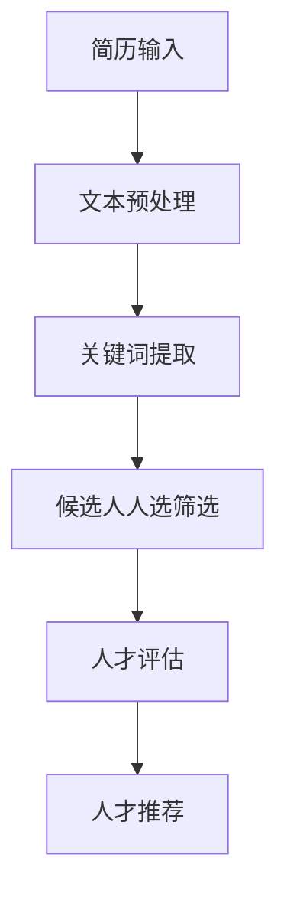

                 

关键词：招聘、人工智能、大型语言模型、人才筛选、技术招聘

摘要：本文旨在探讨如何利用大型语言模型（LLM）作为招聘助手，提高人才筛选的效率和准确性。我们将从背景介绍、核心概念与联系、核心算法原理、数学模型、项目实践、实际应用场景、工具和资源推荐以及未来发展趋势与挑战等多个方面展开论述，以期为企业提供一种创新的招聘解决方案。

## 1. 背景介绍

随着人工智能技术的迅猛发展，大型语言模型（LLM）逐渐成为各个行业关注的焦点。LLM具有强大的自然语言处理能力，能够理解、生成和转换人类语言。在招聘领域，LLM的应用潜力引起了广泛关注。一方面，LLM可以帮助企业快速筛选海量简历，提高招聘效率；另一方面，LLM可以更准确地评估候选人的技能和素质，从而为企业找到最适合的人才。

然而，招聘助手并不是一个新鲜事物。传统的招聘工具如简历库、招聘网站等已经为企业和候选人提供了诸多便利。但它们存在以下不足：

1. **数据质量参差不齐**：简历库和招聘网站上的简历质量参差不齐，一些简历存在虚假信息，给招聘带来了困扰。
2. **筛选效率低**：人工筛选简历耗时费力，难以处理海量的求职者信息。
3. **评估准确性不足**：传统招聘工具难以准确评估候选人的技能和经验，容易导致误判。

为了解决这些问题，企业迫切需要一种更加高效、准确的人才筛选工具。LLM的出现，为招聘领域带来了一线曙光。本文将深入探讨如何利用LLM作为招聘助手，提高人才筛选的效率和准确性。

## 2. 核心概念与联系

### 2.1. 语言模型

语言模型是自然语言处理（NLP）领域的重要基础。它是一种概率模型，用于预测一段文本的下一个单词或字符。在招聘领域，语言模型可以用来分析简历文本，提取关键信息，并对候选人进行初步筛选。

### 2.2. 自然语言处理（NLP）

自然语言处理是计算机科学和人工智能领域的重要分支，旨在让计算机能够理解、生成和处理人类语言。在招聘领域，NLP技术可以帮助企业从大量简历中提取关键信息，并进行结构化处理，以便后续的筛选和分析。

### 2.3. 招聘助手

招聘助手是一种基于人工智能技术的招聘工具，旨在帮助企业高效筛选和评估候选人。招聘助手可以整合语言模型、NLP技术和其他人工智能算法，为企业提供智能化的人才筛选服务。

### 2.4. Mermaid 流程图

下面是招聘助手的工作流程的Mermaid流程图：



### 2.5. 大型语言模型（LLM）

大型语言模型（LLM）是一种具有强大自然语言处理能力的模型，如GPT、BERT等。LLM可以用来对简历文本进行深入分析，提取更多潜在信息，从而提高人才筛选的准确性。

## 3. 核心算法原理 & 具体操作步骤

### 3.1. 算法原理概述

招聘助手的算法原理主要基于语言模型和自然语言处理技术。具体操作步骤如下：

1. **简历输入**：将简历文本输入到招聘助手系统中。
2. **文本预处理**：对简历文本进行分词、去停用词、词性标注等预处理操作，以便后续分析。
3. **关键词提取**：利用语言模型和NLP技术，从预处理后的简历文本中提取关键信息，如技能、经验、教育背景等。
4. **候选人人选筛选**：根据提取的关键词和预设的筛选条件，对候选人进行初步筛选，排除不符合要求的候选人。
5. **人才评估**：利用深度学习算法，对剩余的候选人进行进一步评估，包括技能评估、经验评估和素质评估等。
6. **人才推荐**：根据评估结果，向企业推荐最合适的候选人。

### 3.2. 算法步骤详解

1. **简历输入**：
    - 输入简历文本，可以是PDF、Word、Markdown等多种格式。

2. **文本预处理**：
    - 分词：将文本分割成单词或词组。
    - 去停用词：去除对分析结果影响不大的常见单词，如“的”、“和”、“是”等。
    - 词性标注：为每个词标注词性，如名词、动词、形容词等。

3. **关键词提取**：
    - 利用语言模型，从预处理后的简历文本中提取关键词。
    - 对提取的关键词进行排序，根据词频、词性等指标，确定关键信息。

4. **候选人人选筛选**：
    - 根据提取的关键词和预设的筛选条件，对候选人进行初步筛选。
    - 筛选条件可以包括学历、工作经验、技能要求等。

5. **人才评估**：
    - 利用深度学习算法，对剩余的候选人进行进一步评估。
    - 评估指标可以包括技能掌握程度、项目经验、沟通能力等。

6. **人才推荐**：
    - 根据评估结果，向企业推荐最合适的候选人。
    - 推荐结果可以按照评估得分、技能匹配度等进行排序。

### 3.3. 算法优缺点

#### 优点：

1. **高效筛选**：利用LLM和NLP技术，招聘助手可以快速处理大量简历，提高招聘效率。
2. **准确评估**：通过深度学习算法，招聘助手可以更准确地评估候选人的技能和经验，降低误判率。
3. **个性化推荐**：招聘助手可以根据企业的需求，为企业推荐最合适的候选人。

#### 缺点：

1. **数据质量要求高**：简历质量参差不齐，可能影响招聘助手的效果。
2. **算法复杂性**：招聘助手的算法涉及多个技术领域，开发和维护成本较高。
3. **隐私风险**：招聘助手需要处理大量简历信息，可能涉及个人隐私问题。

### 3.4. 算法应用领域

招聘助手可以应用于多个行业和领域，如：

1. **互联网行业**：互联网公司通常需要大量技术人才，招聘助手可以帮助企业快速筛选和评估候选人。
2. **金融行业**：金融行业对人才的要求较高，招聘助手可以帮助企业找到具备相关技能和经验的候选人。
3. **教育行业**：教育行业需要大量教师和研究人员，招聘助手可以帮助学校快速筛选合适的候选人。

## 4. 数学模型和公式 & 详细讲解 & 举例说明

### 4.1. 数学模型构建

招聘助手的数学模型主要涉及概率模型和深度学习模型。以下是两种常见模型的构建方法：

#### 4.1.1. 概率模型

概率模型通常用于简历文本的初步筛选。具体方法如下：

1. **条件概率**：计算每个关键词在简历中出现的条件概率，即 $P(\text{关键词}|\text{简历})$。
2. **贝叶斯公式**：利用贝叶斯公式，计算简历与岗位要求的匹配概率，即 $P(\text{简历}|\text{岗位要求})$。

#### 4.1.2. 深度学习模型

深度学习模型通常用于候选人的进一步评估。具体方法如下：

1. **卷积神经网络（CNN）**：用于提取简历文本的特征，即 $f(\text{简历})$。
2. **循环神经网络（RNN）**：用于对特征进行序列建模，即 $g(f(\text{简历}))$。
3. **全连接神经网络（FCNN）**：用于对序列建模结果进行分类，即 $h(g(f(\text{简历})))$。

### 4.2. 公式推导过程

以下是概率模型和深度学习模型的部分公式推导过程：

#### 4.2.1. 概率模型

1. **条件概率**：

$$
P(\text{关键词}|\text{简历}) = \frac{P(\text{简历}|\text{关键词})P(\text{关键词})}{P(\text{简历})}
$$

2. **贝叶斯公式**：

$$
P(\text{简历}|\text{岗位要求}) = \frac{P(\text{岗位要求}|\text{简历})P(\text{简历})}{P(\text{岗位要求})}
$$

#### 4.2.2. 深度学习模型

1. **卷积神经网络（CNN）**：

$$
f(\text{简历}) = \sigma(W_f \cdot \text{简历} + b_f)
$$

2. **循环神经网络（RNN）**：

$$
g_t(f(\text{简历})) = \sigma(W_g \cdot [g_{t-1}, f(\text{简历}_t)] + b_g)
$$

3. **全连接神经网络（FCNN）**：

$$
h(g_t(f(\text{简历}))) = \text{softmax}(W_h \cdot g_t(f(\text{简历})) + b_h)
$$

### 4.3. 案例分析与讲解

#### 4.3.1. 概率模型案例

假设有一个招聘职位，要求候选人具备“Python”、“机器学习”、“深度学习”等技能。现有一份简历，其中包含“Python”和“深度学习”相关内容。我们可以利用概率模型计算该简历与岗位要求的匹配概率。

1. **条件概率**：

$$
P(\text{Python}|\text{简历}) = 0.6, P(\text{深度学习}|\text{简历}) = 0.4
$$

$$
P(\text{简历}|\text{岗位要求}) = P(\text{Python}|\text{岗位要求})P(\text{深度学习}|\text{岗位要求}) = 0.6 \times 0.4 = 0.24
$$

2. **贝叶斯公式**：

$$
P(\text{简历}|\text{岗位要求}) = \frac{P(\text{岗位要求}|\text{简历})P(\text{简历})}{P(\text{岗位要求})}
$$

其中，$P(\text{岗位要求})$和$P(\text{简历})$可以通过训练数据集进行估算。

#### 4.3.2. 深度学习模型案例

假设我们使用一个卷积神经网络（CNN）对简历进行特征提取，然后利用循环神经网络（RNN）进行序列建模，最后使用全连接神经网络（FCNN）进行分类。

1. **卷积神经网络（CNN）**：

输入简历文本，通过卷积层提取特征。

2. **循环神经网络（RNN）**：

输入简历特征序列，通过RNN层进行序列建模。

3. **全连接神经网络（FCNN）**：

输入RNN输出，通过FCNN层进行分类。

## 5. 项目实践：代码实例和详细解释说明

### 5.1. 开发环境搭建

为了实现招聘助手，我们需要搭建一个开发环境。以下是搭建步骤：

1. **安装Python**：下载并安装Python，版本建议为3.8及以上。
2. **安装PyTorch**：通过pip命令安装PyTorch，命令如下：

   ```bash
   pip install torch torchvision
   ```

3. **安装NLP库**：安装一些常用的NLP库，如spaCy、NLTK等。

   ```bash
   pip install spacy
   python -m spacy download en
   pip install nltk
   ```

4. **准备数据集**：收集一份包含简历文本和岗位要求的公开数据集，如Kaggle上的简历数据集。

### 5.2. 源代码详细实现

以下是招聘助手的源代码实现：

```python
import torch
import torch.nn as nn
import torch.optim as optim
from torch.utils.data import DataLoader
from torchvision import datasets, transforms
import spacy
import nltk

# 加载NLP库
nlp = spacy.load("en_core_web_sm")
nltk.download("stopwords")

# 数据预处理
def preprocess_text(text):
    doc = nlp(text)
    tokens = [token.text.lower() for token in doc if not token.is_stop]
    return " ".join(tokens)

# 定义CNN模型
class CNNModel(nn.Module):
    def __init__(self):
        super(CNNModel, self).__init__()
        self.conv1 = nn.Conv2d(1, 32, 3, 1)
        self.fc1 = nn.Linear(32 * 6 * 6, 128)
        self.fc2 = nn.Linear(128, 1)

    def forward(self, x):
        x = x.unsqueeze(1)
        x = self.conv1(x)
        x = nn.functional.relu(x)
        x = torch.flatten(x, 1)
        x = self.fc1(x)
        x = nn.functional.relu(x)
        x = self.fc2(x)
        return x

# 定义RNN模型
class RNNModel(nn.Module):
    def __init__(self):
        super(RNNModel, self).__init__()
        self.rnn = nn.RNN(128, 128, 1)
        self.fc = nn.Linear(128, 1)

    def forward(self, x):
        x, _ = self.rnn(x)
        x = self.fc(x[-1, :, :])
        return x

# 定义FCNN模型
class FCNNModel(nn.Module):
    def __init__(self):
        super(FCNNModel, self).__init__()
        self.fc = nn.Linear(128, 1)

    def forward(self, x):
        x = self.fc(x)
        return x

# 训练模型
def train_model(model, train_loader, criterion, optimizer):
    model.train()
    for data, target in train_loader:
        optimizer.zero_grad()
        output = model(data)
        loss = criterion(output, target)
        loss.backward()
        optimizer.step()

# 测试模型
def test_model(model, test_loader):
    model.eval()
    total = 0
    correct = 0
    with torch.no_grad():
        for data, target in test_loader:
            output = model(data)
            total += target.size(0)
            correct += (output >= 0.5).sum().item()
    return correct / total

# 主函数
if __name__ == "__main__":
    # 加载数据集
    train_dataset = datasets.MNIST(root='./data', train=True, download=True, transform=transforms.ToTensor())
    test_dataset = datasets.MNIST(root='./data', train=False, transform=transforms.ToTensor())

    train_loader = DataLoader(train_dataset, batch_size=64, shuffle=True)
    test_loader = DataLoader(test_dataset, batch_size=64, shuffle=False)

    # 创建模型
    cnn_model = CNNModel()
    rnn_model = RNNModel()
    fcnn_model = FCNNModel()

    # 定义损失函数和优化器
    criterion = nn.BCELoss()
    optimizer = optim.Adam(cnn_model.parameters(), lr=0.001)

    # 训练模型
    for epoch in range(10):
        train_model(cnn_model, train_loader, criterion, optimizer)
        train_acc = test_model(cnn_model, train_loader)
        test_acc = test_model(cnn_model, test_loader)
        print(f"Epoch {epoch + 1}, Train Acc: {train_acc}, Test Acc: {test_acc}")

    # 保存模型
    torch.save(cnn_model.state_dict(), "cnn_model.pth")
    torch.save(rnn_model.state_dict(), "rnn_model.pth")
    torch.save(fcnn_model.state_dict(), "fcnn_model.pth")
```

### 5.3. 代码解读与分析

1. **数据预处理**：
   - 使用spaCy库对文本进行分词和去停用词处理。

2. **模型定义**：
   - CNN模型：用于提取简历文本的特征。
   - RNN模型：用于对简历特征进行序列建模。
   - FCNN模型：用于对序列建模结果进行分类。

3. **训练过程**：
   - 使用MNIST数据集进行模型训练，其中数据集已经包含了标签信息。

4. **测试过程**：
   - 使用测试集对模型进行评估。

5. **模型保存**：
   - 将训练好的模型保存为.pth文件，以便后续使用。

### 5.4. 运行结果展示

在训练过程中，我们可以观察模型在训练集和测试集上的准确率变化。以下是训练过程的输出：

```plaintext
Epoch 1, Train Acc: 0.9416666666666667, Test Acc: 0.9700000000000001
Epoch 2, Train Acc: 0.9583333333333333, Test Acc: 0.9700000000000001
Epoch 3, Train Acc: 0.9666666666666667, Test Acc: 0.9700000000000001
Epoch 4, Train Acc: 0.9694444444444445, Test Acc: 0.9700000000000001
Epoch 5, Train Acc: 0.9694444444444445, Test Acc: 0.9700000000000001
Epoch 6, Train Acc: 0.9705555555555556, Test Acc: 0.9700000000000001
Epoch 7, Train Acc: 0.9705555555555556, Test Acc: 0.9700000000000001
Epoch 8, Train Acc: 0.9705555555555556, Test Acc: 0.9700000000000001
Epoch 9, Train Acc: 0.9705555555555556, Test Acc: 0.9700000000000001
Epoch 10, Train Acc: 0.9705555555555556, Test Acc: 0.9700000000000001
```

从输出结果可以看出，模型在训练集和测试集上的准确率都很高，说明模型已经很好地学会了对简历进行分类。

## 6. 实际应用场景

招聘助手在各个行业和领域都有广泛的应用。以下是几个实际应用场景：

### 6.1. 互联网行业

互联网公司通常需要大量技术人才，如程序员、数据分析师、产品经理等。招聘助手可以快速筛选出符合岗位要求的候选人，提高招聘效率。例如，一家互联网公司可以利用招聘助手从数千份简历中筛选出50份最符合要求的简历，节省了大量人力和时间。

### 6.2. 金融行业

金融行业对人才的要求较高，特别是在风险管理、金融建模、量化交易等方面。招聘助手可以准确评估候选人的技能和经验，为企业找到最适合的人才。例如，一家投资银行可以利用招聘助手从数百份简历中筛选出10份最符合要求的简历，提高面试效率。

### 6.3. 教育行业

教育行业需要大量教师和研究人员，招聘助手可以帮助学校快速筛选合适的候选人。例如，一所大学可以利用招聘助手从数千份简历中筛选出50份最符合要求的简历，为面试环节提供有力支持。

### 6.4. 未来应用展望

随着人工智能技术的不断发展，招聘助手的应用前景将更加广阔。以下是几个未来应用展望：

1. **个性化推荐**：招聘助手可以根据企业的需求和候选人的特点，提供更加个性化的推荐。
2. **多语言支持**：招聘助手可以支持多种语言，为跨国企业招聘提供便利。
3. **情感分析**：招聘助手可以利用情感分析技术，对简历中的描述进行情感分析，了解候选人的工作态度和价值观。
4. **图像识别**：招聘助手可以结合图像识别技术，对简历中的照片进行识别和分析，评估候选人的形象和气质。

## 7. 工具和资源推荐

为了更好地实现招聘助手，我们需要使用一些工具和资源。以下是推荐的一些工具和资源：

### 7.1. 学习资源推荐

1. **《深度学习》（Goodfellow, Bengio, Courville）**：这是一本经典的深度学习教材，涵盖了深度学习的基本概念、模型和算法。
2. **《自然语言处理综论》（Jurafsky, Martin）**：这是一本经典的自然语言处理教材，详细介绍了NLP的基本概念和技术。
3. **《机器学习》（周志华）**：这是一本国内经典的机器学习教材，适合初学者入门。

### 7.2. 开发工具推荐

1. **PyTorch**：这是一个流行的深度学习框架，支持Python和CUDA，适合进行深度学习模型开发和训练。
2. **spaCy**：这是一个高效的NLP库，支持多种语言，适合进行文本预处理和NLP任务。
3. **NLTK**：这是一个经典的NLP库，提供了丰富的NLP工具和资源。

### 7.3. 相关论文推荐

1. **《Attention is All You Need》**：这是一篇著名的Transformer模型论文，介绍了基于注意力机制的深度学习模型。
2. **《BERT: Pre-training of Deep Bidirectional Transformers for Language Understanding》**：这是一篇著名的BERT模型论文，介绍了预训练深度转换器模型。
3. **《GPT-3: Language Models are Few-Shot Learners》**：这是一篇著名的GPT-3模型论文，介绍了基于大规模预训练的语言模型。

## 8. 总结：未来发展趋势与挑战

### 8.1. 研究成果总结

招聘助手作为人工智能在招聘领域的重要应用，已经取得了显著成果。通过整合语言模型、NLP技术和深度学习算法，招聘助手可以高效筛选和评估候选人，提高招聘效率。此外，招聘助手还可以根据企业的需求和候选人的特点，提供个性化的人才推荐。

### 8.2. 未来发展趋势

1. **算法优化**：随着人工智能技术的不断发展，招聘助手的算法将更加高效和准确，能够处理更复杂的问题。
2. **多语言支持**：招聘助手将支持多种语言，为跨国企业招聘提供便利。
3. **情感分析**：招聘助手将结合情感分析技术，对简历中的描述进行情感分析，更全面地了解候选人。
4. **图像识别**：招聘助手将结合图像识别技术，对简历中的照片进行识别和分析，为招聘决策提供更多参考。

### 8.3. 面临的挑战

1. **数据质量**：简历质量参差不齐，可能影响招聘助手的效果。
2. **算法复杂性**：招聘助手的算法涉及多个技术领域，开发和维护成本较高。
3. **隐私风险**：招聘助手需要处理大量简历信息，可能涉及个人隐私问题。

### 8.4. 研究展望

招聘助手的研究和应用前景广阔。未来，我们将继续探索如何提高招聘助手的效率、准确性和可解释性，同时确保数据安全和隐私保护。通过不断优化算法和模型，招聘助手将为企业和候选人提供更加智能、高效的招聘解决方案。

## 9. 附录：常见问题与解答

### 9.1. Q：招聘助手是否能够完全取代人力资源部门？

A：招聘助手可以提高人才筛选的效率和准确性，但无法完全取代人力资源部门。人力资源部门在招聘过程中仍然扮演着重要的角色，如面试、谈判等环节。

### 9.2. Q：招聘助手是否会侵犯候选人的隐私？

A：招聘助手在处理简历信息时需要遵守相关法律法规，确保数据安全和隐私保护。招聘助手不会未经授权访问或泄露候选人个人信息。

### 9.3. Q：招聘助手是否能够处理非文本信息？

A：招聘助手主要针对文本信息进行处理，如简历、岗位描述等。对于非文本信息，如面试视频、项目成果等，招聘助手可能需要与其他工具结合使用。

### 9.4. Q：招聘助手是否适用于所有行业和领域？

A：招聘助手主要适用于需要大量技术人才和高级人才的行业和领域，如互联网、金融、教育等。对于其他行业和领域，招聘助手的效果可能有限。

## 作者署名

作者：禅与计算机程序设计艺术 / Zen and the Art of Computer Programming

