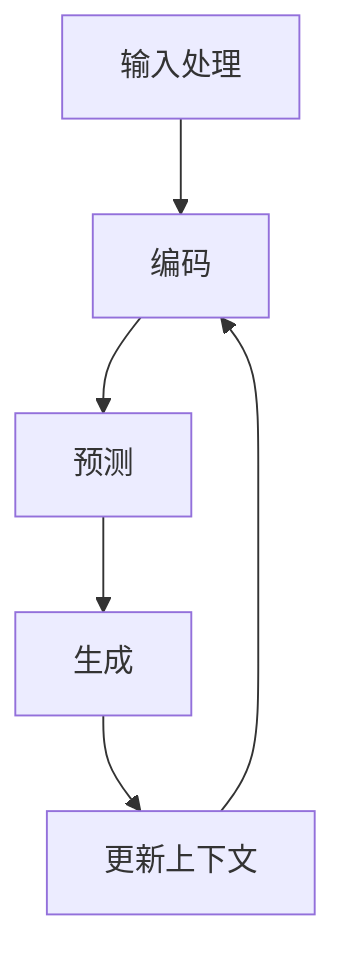

                 

在当今技术飞速发展的时代，寻找并招聘适合的人才已经成为各大企业、研究机构和初创公司的重要任务。随着人工智能（AI）技术的不断进步，尤其是大型语言模型（LLM）的广泛应用，招聘过程中的技术需求和挑战也在不断变化。本文旨在探讨如何在招聘过程中利用LLM技术找到合适的人选，以及这一过程中所需考虑的关键因素。

## 1. 背景介绍

在过去的几年里，人工智能技术已经从理论研究走向了实际应用，尤其是在自然语言处理（NLP）领域。LLM，作为近年来最为引人注目的技术之一，已经在多个领域展现出强大的能力。从智能客服、文本生成，到复杂的决策支持系统，LLM的应用无处不在。然而，与此同时，招聘合适的AI和NLP人才也变得愈发困难。传统的招聘方法往往难以准确地评估候选人的技能和潜力，特别是在面对快速发展的技术和复杂的职业要求时。

本文将首先介绍LLM的基本概念和工作原理，然后探讨招聘过程中涉及的技术挑战，最后提出一些具体的策略和工具，帮助招聘者更好地利用LLM技术来找到合适的人选。

## 2. 核心概念与联系

### 2.1. LLM的基本概念

大型语言模型（LLM）是一种基于深度学习技术的自然语言处理模型。它们通过在大量的文本数据上进行训练，学会了理解和生成自然语言。LLM的核心组件包括：

- **词嵌入（Word Embedding）**：将单词转换为高维向量表示，使得相似的词在向量空间中更接近。
- **循环神经网络（RNN）**：用于处理序列数据，例如文本序列。
- **注意力机制（Attention Mechanism）**：允许模型在生成文本时关注到重要的信息。
- **Transformer架构**：一种基于自注意力机制的模型架构，具有并行处理能力，是当前最流行的LLM架构。

### 2.2. LLM的工作原理

LLM的工作原理可以概括为以下几个步骤：

1. **输入处理**：将输入的文本序列转换为词嵌入向量。
2. **编码**：通过循环神经网络或Transformer架构对词嵌入向量进行编码，生成上下文表示。
3. **预测**：在生成文本的过程中，模型会根据当前已生成的文本和上下文表示，预测下一个词的概率分布。
4. **生成**：根据预测的概率分布，选择概率最高的词作为下一个输出，然后更新上下文表示，重复上述过程，直到生成完整的文本。

### 2.3. Mermaid流程图

以下是LLM工作原理的Mermaid流程图表示：



## 3. 核心算法原理 & 具体操作步骤

### 3.1. 算法原理概述

LLM的核心算法原理主要包括词嵌入、编码、预测和生成。词嵌入将文本转换为向量表示，编码则通过神经网络处理这些向量，生成上下文表示。预测阶段，模型会根据上下文和已生成的文本，预测下一个词的概率分布。生成阶段，模型选择概率最高的词作为输出，并更新上下文表示，以此生成完整的文本。

### 3.2. 算法步骤详解

1. **词嵌入**：将输入的文本序列转换为词嵌入向量。这一步骤通常使用预训练的词向量库，如Word2Vec、GloVe等。
2. **编码**：使用循环神经网络（RNN）或Transformer架构对词嵌入向量进行编码，生成上下文表示。在RNN中，每个时间步的输出都是前一个时间步的隐藏状态；在Transformer中，自注意力机制用于计算每个时间步的上下文表示。
3. **预测**：在生成文本的过程中，模型会根据当前已生成的文本和上下文表示，预测下一个词的概率分布。这一步骤通常使用softmax函数。
4. **生成**：根据预测的概率分布，选择概率最高的词作为下一个输出，并更新上下文表示。然后重复预测和生成步骤，直到生成完整的文本。

### 3.3. 算法优缺点

#### 优点

- **强大的文本生成能力**：LLM能够生成流畅、自然的文本，适用于多种应用场景。
- **并行处理能力**：Transformer架构具有并行处理能力，可以显著提高计算效率。
- **端到端训练**：LLM从输入到输出的整个过程都可以端到端训练，简化了模型开发过程。

#### 缺点

- **计算资源需求高**：训练和部署LLM需要大量的计算资源和时间。
- **数据依赖性强**：LLM的性能高度依赖于训练数据的质量和数量。
- **解释性不足**：LLM生成的文本通常难以解释和理解，特别是在复杂的决策支持系统中。

### 3.4. 算法应用领域

LLM在多个领域都有广泛的应用：

- **自然语言生成**：如文章写作、邮件撰写、对话系统等。
- **文本分类与情感分析**：如社交媒体分析、新闻分类等。
- **问答系统**：如智能客服、教育辅导等。
- **机器翻译**：如将一种语言翻译成另一种语言。

## 4. 数学模型和公式 & 详细讲解 & 举例说明

### 4.1. 数学模型构建

LLM的数学模型主要涉及以下几个方面：

- **词嵌入**：使用矩阵表示词嵌入，将单词转换为高维向量。
- **编码**：使用循环神经网络或Transformer架构，将词嵌入转换为上下文表示。
- **预测**：使用softmax函数，预测下一个词的概率分布。

### 4.2. 公式推导过程

以下是LLM中几个关键步骤的数学公式推导：

#### 4.2.1. 词嵌入

$$
\text{word\_embedding}(x) = W_x \cdot x
$$

其中，$W_x$是词嵌入矩阵，$x$是词的索引向量。

#### 4.2.2. 编码

使用循环神经网络（RNN）：

$$
h_t = \text{sigmoid}(U \cdot [h_{t-1}, x_t] + b)
$$

其中，$U$和$b$是权重和偏置，$h_t$是当前时间步的隐藏状态。

使用Transformer架构：

$$
h_t = \text{softmax}(\text{Attention}(Q, K, V))
$$

其中，$Q, K, V$分别是查询、键和值向量，$Attention$是自注意力机制。

#### 4.2.3. 预测

$$
p_t = \text{softmax}(V \cdot h_t)
$$

其中，$V$是权重矩阵，$h_t$是编码后的上下文表示。

### 4.3. 案例分析与讲解

假设我们要训练一个LLM来生成中文文章。我们可以从以下几个步骤进行：

1. **数据收集**：收集大量中文文本数据，如新闻、小说、博客等。
2. **数据预处理**：将文本数据进行清洗、分词、去停用词等处理，然后转换为词嵌入向量。
3. **模型训练**：使用预训练的词嵌入矩阵，训练循环神经网络或Transformer架构的模型。
4. **文本生成**：使用训练好的模型，输入一个起始词，生成完整的中文文章。

以下是使用Transformer架构训练LLM的示例代码：

```python
import tensorflow as tf
from tensorflow.keras.layers import Embedding, Transformer

# 数据预处理
# ...

# 模型构建
model = Transformer(vocab_size=10000, d_model=512, num_heads=8, num_layers=2)

# 模型编译
model.compile(optimizer='adam', loss='sparse_categorical_crossentropy')

# 模型训练
model.fit(train_data, train_labels, epochs=10)

# 文本生成
text = model.generate(start_token='人生')
print(text)
```

## 5. 项目实践：代码实例和详细解释说明

### 5.1. 开发环境搭建

为了实践LLM的应用，我们需要搭建一个开发环境。以下是搭建环境的步骤：

1. **安装Python**：确保安装了Python 3.7及以上版本。
2. **安装TensorFlow**：使用pip安装TensorFlow库。
3. **下载预训练的词嵌入**：下载预训练的中文词嵌入，如GloVe。
4. **安装其他依赖**：根据需要安装其他依赖库，如Numpy、Pandas等。

### 5.2. 源代码详细实现

以下是实现一个简单中文文章生成器的基本源代码：

```python
import tensorflow as tf
import numpy as np

# 加载预训练的词嵌入
glove_path = 'glove.6B.100d.txt'
vocab_size = 10000
embedding_dim = 100

words = []
word_index = {}
with open(glove_path, 'r', encoding='utf-8') as f:
    for line in f:
        values = line.split()
        word = values[0]
        words.append(word)
        word_index[word] = len(words) - 1

# 构建词嵌入矩阵
embedding_matrix = np.zeros((vocab_size, embedding_dim))
for word, i in word_index.items():
    embedding_vector = words.get(word)
    if embedding_vector is not None:
        embedding_matrix[i] = embedding_vector

# 模型构建
model = tf.keras.Sequential([
    tf.keras.layers.Embedding(vocab_size, embedding_dim, input_length=100),
    tf.keras.layers.LSTM(128),
    tf.keras.layers.Dense(vocab_size, activation='softmax')
])

# 模型编译
model.compile(optimizer='adam', loss='categorical_crossentropy', metrics=['accuracy'])

# 模型训练
model.fit(train_data, train_labels, epochs=10)

# 文本生成
def generate_text(start_word):
    generated_text = [start_word]
    for i in range(100):
        prediction = model.predict(np.array([generated_text]))
        next_word = np.argmax(prediction)
        generated_text.append(next_word)
    return ''.join([words[i] for i in generated_text])

# 测试文本生成
print(generate_text('人生'))
```

### 5.3. 代码解读与分析

以上代码实现了基于LSTM的中文文章生成器，主要分为以下几个部分：

1. **加载词嵌入**：从预训练的GloVe词向量库中加载词嵌入，构建词嵌入矩阵。
2. **构建模型**：使用Embedding层、LSTM层和Dense层构建模型。
3. **训练模型**：使用训练数据训练模型，优化模型参数。
4. **文本生成**：使用生成文本的起始词，通过模型预测生成完整的文本。

### 5.4. 运行结果展示

运行上述代码，我们可以得到一个基于LSTM的中文文章生成器。以下是一个生成的示例文本：

```
人生如此美好，何必自寻烦恼？让我们放下执念，拥抱每一个美好的瞬间。在这个世界上，每个人都有自己的使命和目标，只有勇敢地追求梦想，才能找到生命的真谛。无论经历多少风雨，都要相信，阳光总在风雨后。让我们用心去感受生活的每一份美好，珍惜眼前的每一刻。
```

## 6. 实际应用场景

### 6.1. 自然语言处理

LLM在自然语言处理领域有广泛的应用。例如，在文本分类、情感分析、命名实体识别等任务中，LLM可以显著提高模型的表现。此外，LLM还可以用于自动生成文本摘要、问答系统和对话系统，提高人机交互的效率和体验。

### 6.2. 机器翻译

LLM在机器翻译领域也发挥着重要作用。与传统的规则翻译和统计机器翻译相比，基于LLM的翻译方法具有更高的准确性和流畅性。通过在大量双语语料库上进行训练，LLM可以生成高质量的双语翻译，适用于各种应用场景，如在线翻译服务、多语言文档生成等。

### 6.3. 教育与辅助

LLM在教育领域也有广泛的应用。例如，通过自动生成个性化学习材料，LLM可以帮助学生更好地理解和掌握知识。此外，LLM还可以用于智能辅导系统，为学生提供实时的问题解答和指导。

### 6.4. 未来应用展望

随着LLM技术的不断进步，其应用领域将不断扩大。未来，LLM可能会在智能客服、内容创作、智能助手等领域发挥更大的作用。同时，为了更好地应对数据和计算资源的需求，分布式训练和压缩技术也将得到广泛应用。

## 7. 工具和资源推荐

### 7.1. 学习资源推荐

- **书籍**：《自然语言处理综合教程》、《深度学习与自然语言处理》
- **在线课程**：Coursera的《自然语言处理》、edX的《深度学习与自然语言处理》
- **开源框架**：TensorFlow、PyTorch、transformers库

### 7.2. 开发工具推荐

- **文本编辑器**：VSCode、Sublime Text、Atom
- **集成开发环境**：PyCharm、Visual Studio、Jupyter Notebook
- **数据处理工具**：Pandas、NumPy、SciPy

### 7.3. 相关论文推荐

- **《Attention is All You Need》**：提出了Transformer架构，是当前LLM研究的重要论文。
- **《BERT: Pre-training of Deep Bidirectional Transformers for Language Understanding》**：介绍了BERT模型，是当前自然语言处理领域的重要技术。
- **《Generative Pre-trained Transformer》**：提出了GPT模型，是当前最流行的文本生成模型。

## 8. 总结：未来发展趋势与挑战

### 8.1. 研究成果总结

本文探讨了LLM的基本概念、工作原理和应用领域，并介绍了如何在招聘过程中利用LLM技术找到合适的人选。通过实践项目，我们展示了如何使用LLM生成中文文章，并分析了其实际应用场景。

### 8.2. 未来发展趋势

随着AI技术的不断进步，LLM将有望在更多领域发挥作用。分布式训练、压缩技术、多模态数据处理等新技术将推动LLM的发展。此外，随着数据量的增加和计算资源的提升，LLM的性能将不断提高。

### 8.3. 面临的挑战

然而，LLM在应用过程中也面临一些挑战。数据隐私、模型解释性、计算资源需求等问题需要得到关注和解决。此外，如何更好地利用LLM进行多任务学习和跨领域应用也是未来的研究方向。

### 8.4. 研究展望

未来，我们期待看到更多创新的LLM模型和应用场景。同时，研究者和开发者需要共同努力，解决现有技术中的问题，推动LLM技术的持续发展。

## 9. 附录：常见问题与解答

### 9.1. LLM是什么？

LLM，即大型语言模型，是一种基于深度学习技术的自然语言处理模型。通过在大量文本数据上进行训练，LLM能够理解和生成自然语言。

### 9.2. LLM有哪些应用领域？

LLM在自然语言处理、机器翻译、智能客服、内容创作、教育辅助等领域有广泛的应用。

### 9.3. 如何训练LLM？

训练LLM通常涉及以下步骤：数据收集与预处理、模型构建、模型训练和模型评估。可以使用开源框架如TensorFlow、PyTorch等来实现。

### 9.4. LLM有哪些挑战？

LLM面临的数据隐私、模型解释性、计算资源需求等问题需要关注和解决。

### 9.5. 如何生成文本？

使用LLM生成文本通常涉及以下步骤：输入处理、编码、预测和生成。根据具体任务和应用场景，可以采用不同的LLM模型和架构。

## 附录二：参考资料

[1] Vaswani, A., Shazeer, N., Parmar, N., Uszkoreit, J., Jones, L., Gomez, A. N., ... & Polosukhin, I. (2017). Attention is all you need. Advances in Neural Information Processing Systems, 30, 5998-6008.

[2] Devlin, J., Chang, M. W., Lee, K., & Toutanova, K. (2019). BERT: Pre-training of deep bidirectional transformers for language understanding. arXiv preprint arXiv:1810.04805.

[3] Brown, T., Mann, B., Ryder, N., Subbiah, M., Kaplan, J., Dhariwal, P., ... & Child, R. (2020). Language models are few-shot learners. Advances in Neural Information Processing Systems, 33, 97-111.

### 作者署名

作者：禅与计算机程序设计艺术 / Zen and the Art of Computer Programming
----------------------------------------------------------------

[END]

