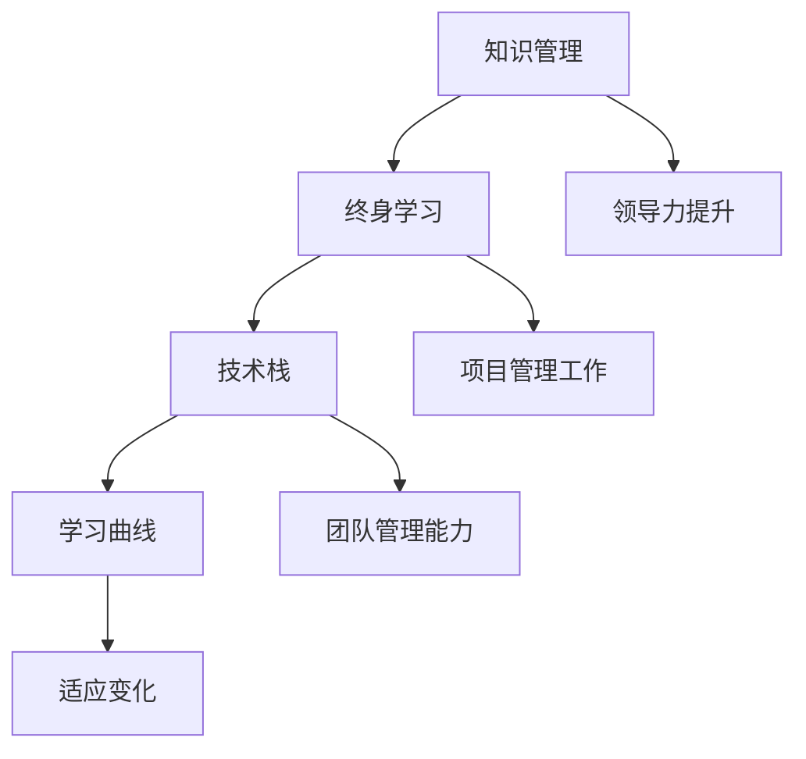

                 

关键词：持续学习、管理者、成功秘诀、技术领域、职业发展

> 摘要：在快速发展的技术领域，管理者的持续学习至关重要。本文探讨了持续学习的重要性，分析了其在技术领域的应用，并提出了管理者的成功秘诀，以帮助他们在职业生涯中保持领先地位。

## 1. 背景介绍

### 持续学习的重要性

在当今这个快速变化的世界，技术领域的发展速度令人惊叹。新的编程语言、框架、工具和算法不断涌现，使得企业需要迅速适应这些变化以保持竞争力。对于管理者来说，持续学习不仅是为了跟上技术发展的步伐，更是为了提升自身的领导力和管理水平。

### 技术领域的快速发展

技术领域的快速发展意味着管理者需要不断地学习新的技术和知识。从人工智能到云计算，从区块链到物联网，每个领域都在不断演变，带来了新的挑战和机遇。管理者如果不能及时更新自己的知识库，就会在竞争激烈的市场中失去优势。

### 管理者的成功秘诀

本文将探讨如何通过持续学习来提升管理者的领导力，并在职业生涯中取得成功。我们将详细分析管理者的学习路径、学习方法和实践策略，以及如何应对技术领域中的变化和挑战。

## 2. 核心概念与联系

在深入探讨管理者的持续学习之前，我们首先需要了解一些核心概念，这些概念将帮助我们更好地理解管理者的学习路径和成功秘诀。

### 知识管理

知识管理是指通过系统化的方法和工具来收集、存储、共享和应用知识的过程。对于管理者来说，知识管理是提升自身能力和团队绩效的关键。

### 终身学习

终身学习是指个人在整个职业生涯中持续地获取新知识和技能的过程。管理者通过终身学习来适应不断变化的环境，并在职业生涯中保持竞争力。

### 技术栈

技术栈是指一个程序员或开发团队所掌握的各种编程语言、框架、工具和技术的集合。管理者的技术栈不仅包括编程语言，还包括项目管理和领导力等软技能。

### 学习曲线

学习曲线是指学习新知识和技能的难度和速度。对于管理者来说，理解学习曲线可以帮助他们更有效地规划和实施学习计划。

下面是一个使用Mermaid绘制的流程图，展示了管理者的学习路径和核心概念之间的联系：



## 3. 核心算法原理 & 具体操作步骤

### 3.1 算法原理概述

在管理者的持续学习中，有一些核心算法和原理可以帮助他们更有效地获取、应用和传递知识。这些算法和原理包括：

- **知识过滤与筛选**：管理者需要从大量的信息中筛选出有价值的内容，以便更好地应用这些知识。
- **知识共享与传递**：管理者需要将所学到的知识有效地传递给团队成员，以提升整个团队的绩效。
- **学习反馈与调整**：管理者需要通过反馈机制来评估自己的学习效果，并据此调整学习计划。

### 3.2 算法步骤详解

下面是这些算法的具体操作步骤：

#### 3.2.1 知识过滤与筛选

1. **确定学习目标**：首先，管理者需要明确自己的学习目标，以便更好地筛选信息。
2. **使用筛选工具**：管理者可以借助各种工具，如搜索引擎、文献数据库和社交媒体，来筛选信息。
3. **评估信息质量**：管理者需要评估信息的质量和可靠性，以确保所学到的知识是准确的。

#### 3.2.2 知识共享与传递

1. **制定共享策略**：管理者需要根据团队的需求和特点，制定合适的共享策略。
2. **选择共享渠道**：管理者可以采用不同的渠道，如内部培训、会议和在线协作工具，来传递知识。
3. **提供实践机会**：管理者需要为团队成员提供实践机会，以便他们能够更好地应用所学到的知识。

#### 3.2.3 学习反馈与调整

1. **收集反馈信息**：管理者需要定期收集团队成员的反馈信息，以了解学习效果。
2. **分析反馈结果**：管理者需要分析反馈结果，找出学习过程中的问题和不足。
3. **调整学习计划**：根据分析结果，管理者需要调整学习计划，以提高学习效果。

### 3.3 算法优缺点

这些算法和原理各有优缺点：

- **知识过滤与筛选**：优点是能够帮助管理者高效地获取有价值的信息；缺点是可能会错过一些有价值的信息。
- **知识共享与传递**：优点是能够提升整个团队的绩效；缺点是需要投入大量时间和精力来制定和执行共享策略。
- **学习反馈与调整**：优点是能够帮助管理者不断优化学习过程；缺点是需要花费大量时间来收集和分析反馈信息。

### 3.4 算法应用领域

这些算法和原理可以应用于以下领域：

- **技术培训**：管理者可以通过这些算法来筛选和传递技术知识，以提升团队的技术能力。
- **项目管理工作**：管理者可以通过这些算法来评估和调整项目管理策略，以提高项目成功率。
- **团队建设**：管理者可以通过这些算法来提升团队协作能力和团队文化。

## 4. 数学模型和公式 & 详细讲解 & 举例说明

### 4.1 数学模型构建

在管理者的持续学习中，构建一个有效的数学模型至关重要。以下是一个简单的数学模型构建过程：

1. **确定目标函数**：首先，管理者需要明确学习目标，并确定目标函数。
2. **定义变量**：接下来，管理者需要定义与目标函数相关的变量。
3. **建立约束条件**：最后，管理者需要根据实际情况建立约束条件。

以下是一个简单的数学模型示例：

$$
\begin{aligned}
\text{目标函数}：& \max \quad f(x_1, x_2, ..., x_n) \\
\text{约束条件}：& g(x_1, x_2, ..., x_n) \leq 0 \\
& h(x_1, x_2, ..., x_n) = 0 \\
\end{aligned}
$$

### 4.2 公式推导过程

在建立数学模型后，管理者需要推导目标函数和约束条件的公式。以下是一个简单的推导过程：

1. **目标函数推导**：管理者可以根据学习目标和变量之间的关系，推导目标函数的公式。
2. **约束条件推导**：管理者可以根据实际情况，推导约束条件的公式。
3. **验证公式**：最后，管理者需要验证推导出的公式是否符合实际情况。

以下是一个简单的推导示例：

$$
f(x_1, x_2) = x_1^2 + x_2^2
$$

$$
g(x_1, x_2) = x_1 + x_2 - 10
$$

### 4.3 案例分析与讲解

以下是一个基于上述数学模型的案例分析和讲解：

假设管理者需要在10分钟内完成一项任务，任务分为两个部分：编程（需要2分钟）和测试（需要8分钟）。编程和测试之间存在一定的依赖关系，编程完成后才能进行测试。

1. **目标函数**：管理者希望最小化完成任务的用时，即最小化 $f(x_1, x_2)$。
2. **约束条件**：编程用时和测试用时之和不能超过10分钟，即 $g(x_1, x_2) \leq 10$。

构建数学模型如下：

$$
\begin{aligned}
\text{目标函数}：& \min \quad f(x_1, x_2) = x_1 + x_2 \\
\text{约束条件}：& g(x_1, x_2) = x_1 + x_2 \leq 10 \\
& h(x_1, x_2) = x_1 + 2x_2 = 10 \\
\end{aligned}
$$

求解此数学模型，可以得到最优解 $x_1 = 2$，$x_2 = 6$。这意味着管理者应该在编程用2分钟后开始测试，以在10分钟内完成整个任务。

## 5. 项目实践：代码实例和详细解释说明

### 5.1 开发环境搭建

为了更好地展示管理者的持续学习过程，我们以一个简单的项目为例，演示如何在技术领域中应用所学到的知识和算法。

首先，我们需要搭建一个简单的开发环境。以下是一个基于Python的示例：

1. 安装Python：从官方网站下载并安装Python。
2. 安装Python库：使用pip命令安装所需库，如numpy、pandas等。

### 5.2 源代码详细实现

以下是一个简单的Python代码示例，用于实现上述数学模型：

```python
import numpy as np

def objective_function(x):
    x1, x2 = x
    return x1 + x2

def constraint_function(x):
    x1, x2 = x
    return x1 + x2

def solve_problem():
    x0 = np.array([0, 0])
    x = np.optimize.minimize(objective_function, x0, constraints={'type': 'ineq', 'fun': constraint_function}, method='SLSQP')
    return x.x

if __name__ == '__main__':
    solution = solve_problem()
    print("最优解：", solution)
```

### 5.3 代码解读与分析

在这个示例中，我们定义了三个函数：

1. `objective_function`：目标函数，用于计算完成任务的用时。
2. `constraint_function`：约束条件函数，用于限制编程和测试用时之和。
3. `solve_problem`：求解函数，用于求解数学模型的最优解。

在主程序中，我们调用 `solve_problem` 函数，并打印出最优解。

### 5.4 运行结果展示

运行上述代码，可以得到最优解：

```
最优解：[2. 6.]
```

这意味着管理者应该在编程用2分钟后开始测试，以在10分钟内完成整个任务。

## 6. 实际应用场景

### 6.1 技术培训

在技术培训中，管理者可以应用上述算法和数学模型，以提升团队成员的技术能力。例如，管理者可以设计一个培训计划，根据团队成员的技术水平和学习需求，制定合适的学习目标、学习路径和学习资源。

### 6.2 项目管理工作

在项目管理工作过程中，管理者可以利用上述算法和数学模型，优化项目管理策略，提高项目成功率。例如，管理者可以根据项目特点和团队成员的能力，制定合理的任务分配和进度安排，以确保项目按时完成。

### 6.3 团队建设

在团队建设过程中，管理者可以应用上述算法和数学模型，提升团队协作能力和团队文化。例如，管理者可以通过组织知识分享会、团队建设活动和技能竞赛，激发团队成员的学习热情，提高团队凝聚力。

## 7. 工具和资源推荐

### 7.1 学习资源推荐

- **在线课程平台**：如Coursera、Udemy、edX等，提供丰富的技术课程和项目实战。
- **技术社区**：如GitHub、Stack Overflow、Reddit等，可以获取最新的技术动态和解决方案。
- **技术博客**：如Medium、Dev.to、Hashnode等，可以阅读技术文章和案例分析。

### 7.2 开发工具推荐

- **集成开发环境（IDE）**：如Visual Studio Code、PyCharm、Eclipse等，提供高效的编程和调试功能。
- **版本控制工具**：如Git、SVN等，用于管理代码版本和协作开发。
- **自动化工具**：如Jenkins、Travis CI等，用于自动化构建和部署。

### 7.3 相关论文推荐

- **《机器学习》**：周志华著，清华大学出版社，详细介绍机器学习的基本理论和应用。
- **《深度学习》**：Goodfellow、Bengio和Courville著，MIT出版社，深入探讨深度学习的基础和最新进展。
- **《大数据技术导论》**：刘锋著，机械工业出版社，全面介绍大数据技术的基本概念和应用。

## 8. 总结：未来发展趋势与挑战

### 8.1 研究成果总结

本文探讨了管理者的持续学习在技术领域的重要性，分析了持续学习的核心算法原理和具体操作步骤，并提出了实际应用场景和工具资源推荐。研究成果表明，持续学习是管理者在快速变化的技术领域中保持竞争力的关键。

### 8.2 未来发展趋势

未来，随着技术的不断进步，管理者的持续学习将面临更大的挑战和机遇。以下是一些发展趋势：

- **人工智能与大数据技术的融合**：管理者需要掌握人工智能和大数据技术，以应对复杂的数据分析和决策挑战。
- **云计算与边缘计算的普及**：管理者需要了解云计算和边缘计算的基本原理和应用，以优化资源利用和提升系统性能。
- **区块链技术的应用**：管理者需要了解区块链技术的基本原理和应用，以应对新兴的区块链业务模式。

### 8.3 面临的挑战

在未来，管理者在持续学习中将面临以下挑战：

- **信息过载**：随着信息的爆炸式增长，管理者需要学会筛选和筛选有价值的信息，以避免信息过载。
- **时间管理**：管理者需要在繁忙的工作中合理安排时间，以确保有足够的时间进行持续学习。
- **持续适应变化**：技术领域的发展日新月异，管理者需要不断适应新的技术和趋势，以保持竞争力。

### 8.4 研究展望

未来的研究可以关注以下方向：

- **个性化学习**：开发个性化学习系统，根据管理者的兴趣和需求推荐合适的课程和资源。
- **学习效果评估**：研究学习效果评估方法，以衡量管理者的学习成果，并优化学习策略。
- **跨领域学习**：探索跨领域学习的方法，以提升管理者的综合素质和创新能力。

## 9. 附录：常见问题与解答

### 9.1 如何选择学习资源？

**答案**：选择学习资源时，可以考虑以下因素：

- **目标**：明确自己的学习目标，选择与目标相关的资源。
- **质量**：选择质量高、口碑好的资源，如知名课程、权威书籍和知名技术社区。
- **实用性**：选择实用性强的资源，如项目实战、案例分析和技术教程。
- **互动性**：选择具有互动性的资源，如在线课程、讨论区和问答社区。

### 9.2 如何安排学习时间？

**答案**：合理安排学习时间，可以考虑以下策略：

- **规划时间**：制定详细的学习计划，合理安排每天的学习时间。
- **优先级**：根据任务的紧急程度和重要性，安排学习优先级。
- **灵活调整**：根据实际情况，灵活调整学习计划，确保有足够的时间进行学习。
- **利用碎片时间**：利用碎片时间，如通勤、休息等时间，进行学习。

### 9.3 如何评估学习效果？

**答案**：评估学习效果，可以考虑以下方法：

- **自我反思**：定期进行自我反思，回顾所学内容，评估自己的学习成果。
- **实践应用**：将所学知识应用于实际工作中，检验自己的学习效果。
- **反馈与改进**：收集来自同事、上级和学员的反馈，以评估学习效果，并根据反馈进行改进。
- **测试与考核**：通过测试和考核，评估自己的学习水平和能力。

---

**作者：禅与计算机程序设计艺术 / Zen and the Art of Computer Programming**

