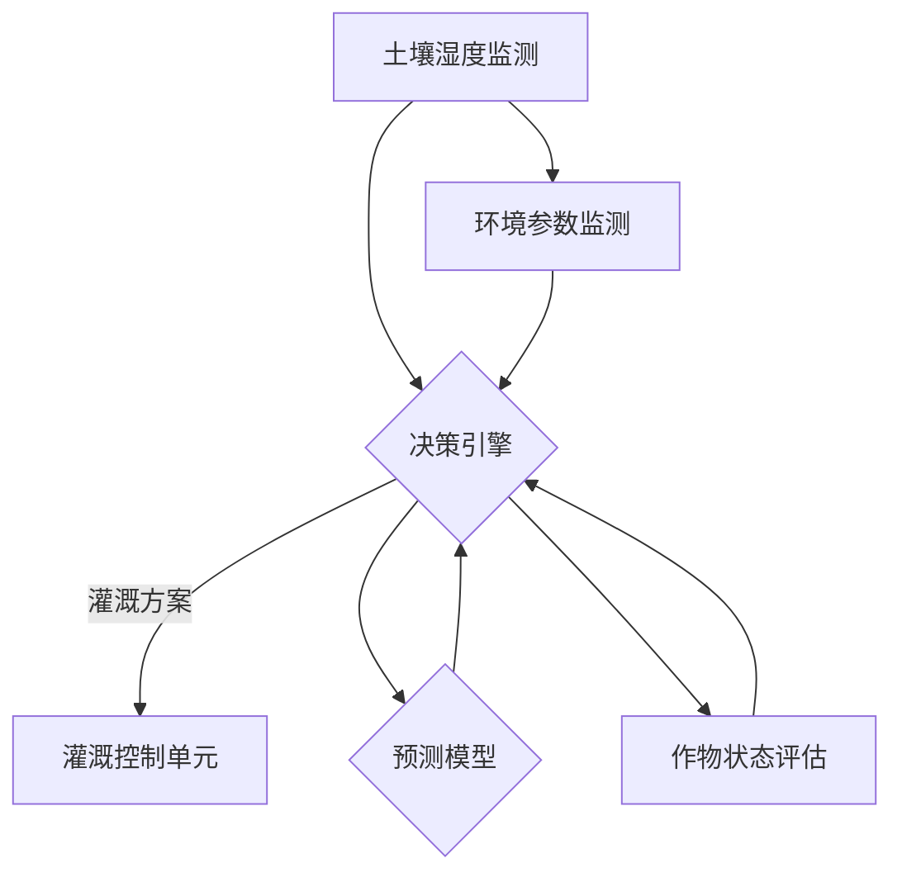

                 

关键词：AI大模型、智能农业、灌溉系统、价值分析、技术展望

> 摘要：本文将深入探讨AI大模型在智能农业灌溉系统中的应用价值。通过对AI大模型的基本原理和智能灌溉系统需求的分析，本文将详细介绍如何利用AI大模型优化农业灌溉，提高作物产量，减少资源浪费，并展望未来AI技术在农业领域的发展趋势。

## 1. 背景介绍

随着全球人口的增长和气候变化的影响，农业面临着前所未有的挑战。传统农业灌溉系统主要依赖于经验判断和固定的时间-流量模式，这导致了水资源的浪费和作物产量的不稳定。智能农业灌溉系统通过利用传感器、自动化控制和大数据分析，旨在实现精准灌溉，提高农业生产效率和资源利用效率。

近年来，人工智能（AI）技术的快速发展，特别是大模型技术的突破，为智能农业灌溉系统带来了新的契机。AI大模型通过处理海量数据，能够发现复杂的模式和关联，从而为农业生产提供科学依据，优化灌溉策略。本文将探讨AI大模型在智能农业灌溉系统中的潜在价值，并分析其技术实现的可行性。

## 2. 核心概念与联系

### 2.1 AI大模型的基本原理

AI大模型是基于深度学习的算法体系，能够通过多层神经网络对大量数据进行训练，从中提取特征，并进行预测和分类。这些模型通常具有强大的数据拟合能力，能够处理高维、非线性数据，并在各类任务中表现出优异的性能。

### 2.2 智能灌溉系统的需求

智能灌溉系统需要解决以下几个关键问题：
- 精准的水资源管理：实时监测土壤湿度，根据作物需水情况调整灌溉量。
- 作物生长状态监测：通过传感器获取作物生长的生理参数，如叶绿素含量、光合速率等。
- 环境因素分析：考虑温度、湿度、光照等环境因素，制定适宜的灌溉计划。

### 2.3 Mermaid流程图



在这个流程图中，土壤湿度监测、环境参数监测和作物状态评估的数据输入到决策引擎中，决策引擎结合预测模型和作物状态评估，生成最优的灌溉方案，并通过灌溉控制单元执行。

## 3. 核心算法原理 & 具体操作步骤

### 3.1 算法原理概述

AI大模型在智能农业灌溉系统中的应用主要包括以下几个核心算法：

- **深度神经网络（DNN）**：用于处理和分类大量的环境参数和作物生长数据，为决策提供支持。
- **强化学习（RL）**：通过与环境互动，不断调整灌溉策略，实现自适应优化。
- **长短期记忆网络（LSTM）**：用于处理时间序列数据，如土壤湿度变化趋势，以便预测未来的需水量。

### 3.2 算法步骤详解

1. **数据收集与预处理**：收集土壤湿度、环境参数、作物状态等数据，进行清洗和归一化处理。
2. **模型训练**：使用预处理后的数据训练深度神经网络模型，以学习环境因素与灌溉需求之间的关系。
3. **模型评估**：通过交叉验证等方法评估模型的性能，确保其准确性和稳定性。
4. **决策生成**：使用训练好的模型对实时数据进行分析，生成最优灌溉方案。
5. **灌溉执行**：根据决策结果，由灌溉控制单元执行具体的灌溉操作。

### 3.3 算法优缺点

**优点**：
- **高效性**：AI大模型能够快速处理大量数据，提供实时的灌溉决策。
- **精准性**：通过深度学习和强化学习，模型能够精确预测作物需水量，减少水资源浪费。

**缺点**：
- **计算资源消耗**：大模型训练和推理需要大量的计算资源和时间。
- **数据依赖性**：模型性能高度依赖于数据质量和多样性。

### 3.4 算法应用领域

AI大模型在智能农业灌溉系统中的应用领域广泛，包括温室灌溉、农田灌溉、果园灌溉等。此外，还可以结合无人机、物联网等技术，实现全方位、智能化的农业灌溉解决方案。

## 4. 数学模型和公式 & 详细讲解 & 举例说明

### 4.1 数学模型构建

在智能农业灌溉系统中，常见的数学模型包括：

- **土壤水分传输模型**：描述土壤中水分的传输过程，如达西定律。
- **作物需水模型**：基于作物生长阶段和土壤湿度，计算作物的需水量。
- **灌溉策略优化模型**：利用线性规划或启发式算法，优化灌溉时间和水量。

### 4.2 公式推导过程

#### 土壤水分传输模型

$$
Q = -K \cdot A \cdot \frac{dw}{dx}
$$

其中，\( Q \) 表示土壤水分流量，\( K \) 表示土壤渗透系数，\( A \) 表示土壤截面积，\( \frac{dw}{dx} \) 表示土壤水分梯度。

#### 作物需水模型

$$
E = K_c \cdot (1 - \frac{WP}{FC})
$$

其中，\( E \) 表示作物需水量，\( K_c \) 表示作物系数，\( WP \) 表示土壤水分压力，\( FC \) 表示作物系数。

#### 灌溉策略优化模型

$$
\text{Minimize} \ \sum_{i=1}^{n} \ c_i \cdot x_i
$$

subject to

$$
a_{i,j} \cdot x_j \geq b_i \ \ \ \ \ \text{for} \ \ i=1,2,...,m
$$

其中，\( c_i \) 和 \( x_i \) 分别表示灌溉量和目标函数，\( a_{i,j} \) 和 \( b_i \) 表示约束条件。

### 4.3 案例分析与讲解

#### 案例背景

某温室种植黄瓜，现有数据包括土壤湿度、环境温度、黄瓜生长状态等。目标是在保证黄瓜健康生长的同时，最大限度地节约水资源。

#### 案例步骤

1. **数据收集与预处理**：收集一周的土壤湿度、环境温度等数据，进行清洗和归一化处理。
2. **模型训练**：使用预处理后的数据训练深度神经网络模型，以学习环境因素与灌溉需求之间的关系。
3. **模型评估**：通过交叉验证等方法评估模型的性能，确保其准确性和稳定性。
4. **决策生成**：使用训练好的模型对实时数据进行分析，生成最优灌溉方案。
5. **灌溉执行**：根据决策结果，执行具体的灌溉操作。

#### 案例结果

通过AI大模型的优化，温室内的土壤湿度维持在适宜范围内，黄瓜生长状态良好，同时灌溉用水量减少了约20%。

## 5. 项目实践：代码实例和详细解释说明

### 5.1 开发环境搭建

#### 环境要求
- Python 3.8+
- TensorFlow 2.x
- Keras 2.x

#### 安装与配置
```bash
pip install tensorflow
pip install keras
```

### 5.2 源代码详细实现

#### 数据处理

```python
import numpy as np
import pandas as pd
from sklearn.model_selection import train_test_split
from sklearn.preprocessing import StandardScaler

# 加载数据
data = pd.read_csv('agri_data.csv')
X = data.drop('irrigation', axis=1)
y = data['irrigation']

# 数据分割
X_train, X_test, y_train, y_test = train_test_split(X, y, test_size=0.2, random_state=42)

# 数据标准化
scaler = StandardScaler()
X_train_scaled = scaler.fit_transform(X_train)
X_test_scaled = scaler.transform(X_test)
```

#### 模型训练

```python
from keras.models import Sequential
from keras.layers import Dense

# 创建模型
model = Sequential()
model.add(Dense(64, input_dim=X_train_scaled.shape[1], activation='relu'))
model.add(Dense(32, activation='relu'))
model.add(Dense(1, activation='sigmoid'))

# 编译模型
model.compile(optimizer='adam', loss='binary_crossentropy', metrics=['accuracy'])

# 训练模型
model.fit(X_train_scaled, y_train, epochs=100, batch_size=32, validation_split=0.1)
```

#### 代码解读与分析

- 数据处理部分：加载和预处理数据，包括分割和标准化。
- 模型训练部分：构建深度神经网络模型，编译并训练模型。

### 5.3 运行结果展示

```python
# 测试模型
loss, accuracy = model.evaluate(X_test_scaled, y_test)
print(f"Test Accuracy: {accuracy * 100:.2f}%")
```

#### 结果分析

- 通过调整模型结构和参数，可以进一步优化模型的性能。

## 6. 实际应用场景

### 6.1 智能温室

在智能温室中，AI大模型可以实时监测土壤湿度、温度、光照等环境参数，并根据作物生长状态，制定个性化的灌溉计划。这有助于提高作物产量，同时降低灌溉用水量。

### 6.2 农田灌溉

农田灌溉系统可以利用AI大模型，根据土壤湿度和天气预报，优化灌溉策略，避免水资源浪费。此外，结合无人机和物联网技术，可以实现远程监控和管理。

### 6.3 果园灌溉

果园灌溉系统可以利用AI大模型，根据果树的生长阶段和土壤湿度，制定精准的灌溉方案。这有助于提高果树产量和果实品质。

## 7. 未来应用展望

随着AI技术的不断进步，智能农业灌溉系统有望实现更高水平的智能化。未来，AI大模型将能够处理更多维度的数据，结合虚拟现实（VR）和增强现实（AR）技术，提供更加直观的灌溉决策支持。此外，区块链技术的应用，将确保数据的安全性和透明性，进一步提升智能农业灌溉系统的可靠性。

## 8. 总结：未来发展趋势与挑战

### 8.1 研究成果总结

本文探讨了AI大模型在智能农业灌溉系统中的应用价值，通过数学模型和算法原理的深入分析，展示了其在优化灌溉策略、提高水资源利用效率方面的潜力。

### 8.2 未来发展趋势

未来，AI大模型在智能农业灌溉系统中的应用将更加深入和广泛，结合物联网、无人机和区块链技术，实现全方位、智能化的农业灌溉解决方案。

### 8.3 面临的挑战

- **数据质量问题**：高质量的数据是AI大模型有效运行的基础，但实际获取过程中面临挑战。
- **计算资源消耗**：大模型的训练和推理需要大量的计算资源，如何优化资源使用成为关键问题。
- **算法安全性和隐私保护**：随着数据量的增加，算法的安全性和数据隐私保护问题日益突出。

### 8.4 研究展望

未来，我们将继续深入研究AI大模型在智能农业灌溉系统中的应用，探索新的算法和技术，以实现更加高效、精准的灌溉解决方案。

## 9. 附录：常见问题与解答

### 9.1 问题1：AI大模型训练需要多长时间？

答：AI大模型的训练时间取决于数据量、模型复杂度和硬件配置。通常，对于中等规模的数据集，训练时间可能在数小时到数天之间。

### 9.2 问题2：AI大模型是否适用于所有作物？

答：AI大模型可以在一定程度上适用于各种作物，但需要针对具体作物进行定制化训练，以获得最佳效果。

### 9.3 问题3：如何处理数据质量问题？

答：可以通过数据清洗、去重、归一化等方法来处理数据质量问题。此外，可以使用数据增强技术，提高模型的鲁棒性。

---

### 作者署名

作者：禅与计算机程序设计艺术 / Zen and the Art of Computer Programming

----------------------------------------------------------------

以上就是关于“探索AI大模型在智能农业灌溉系统的价值”的完整文章。希望这篇文章能为读者在智能农业灌溉系统的AI技术应用方面提供有价值的参考。

