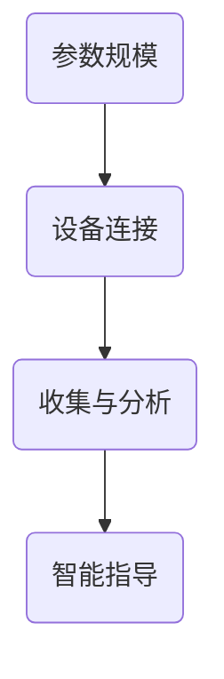

                 

关键词：AI大模型、智能家居、宠物训练、深度学习、算法应用

> 摘要：本文旨在探讨人工智能大模型在智能家居宠物训练中的应用，从核心概念、算法原理、数学模型到项目实践，全面解析这一前沿技术，并展望其未来发展方向。

## 1. 背景介绍

近年来，人工智能（AI）技术取得了显著的进展，特别是在深度学习和自然语言处理领域。随着计算能力的提升和海量数据的积累，AI大模型逐渐成为推动智能化发展的关键技术。与此同时，智能家居市场的快速增长，使得人机交互和智能化服务成为焦点。宠物作为家庭重要成员之一，其智能训练服务也日益受到关注。

在这个背景下，AI大模型在智能家居宠物训练中的应用成为了一个具有挑战性和潜力的研究方向。通过整合AI技术、智能家居设备和宠物行为数据，有望实现更加智能化、个性化的宠物训练服务，提高宠物的生活质量，同时减轻主人的负担。

## 2. 核心概念与联系

### 2.1 AI大模型

AI大模型通常是指参数规模达到亿级别甚至更大的人工神经网络模型。这些模型能够通过大规模数据训练，学习到复杂的数据特征，并在各种应用场景中表现出强大的性能。常见的AI大模型包括GPT、BERT、Transformer等。

### 2.2 智能家居

智能家居是指通过物联网技术将家庭中的各种设备连接起来，实现智能化管理和控制。常见的智能家居设备包括智能灯泡、智能摄像头、智能门锁、智能插座等。

### 2.3 宠物训练

宠物训练是指通过训练方法，使宠物学会特定的行为或技能，以改善其行为和适应能力。传统的宠物训练依赖于主人的经验和技巧，而智能宠物训练则可以通过AI技术实现更加科学和高效的训练过程。

### 2.4 Mermaid 流程图



## 3. 核心算法原理 & 具体操作步骤

### 3.1 算法原理概述

AI大模型在宠物训练中的应用主要通过以下步骤实现：

1. 数据采集与预处理：收集宠物行为数据，并进行预处理，包括去噪、归一化等操作。
2. 模型训练：使用大规模数据集训练AI大模型，使其能够学习到宠物行为的特征。
3. 实时预测：将实时采集到的宠物行为数据输入模型，进行预测和分类，提供训练指导。
4. 实时反馈与调整：根据训练结果，实时调整训练策略，优化训练效果。

### 3.2 算法步骤详解

#### 3.2.1 数据采集与预处理

- 数据采集：通过智能家居设备，如摄像头、传感器等，实时采集宠物行为数据。
- 数据预处理：对采集到的数据进行去噪、归一化等预处理操作，以提高数据质量。

#### 3.2.2 模型训练

- 数据集构建：根据训练需求，构建包含标签数据的宠物行为数据集。
- 模型选择：选择合适的AI大模型架构，如GPT、BERT等。
- 模型训练：使用大规模数据集对模型进行训练，优化模型参数。

#### 3.2.3 实时预测

- 数据输入：将实时采集到的宠物行为数据输入训练好的模型。
- 预测与分类：模型对输入数据进行预测和分类，输出训练建议。

#### 3.2.4 实时反馈与调整

- 结果分析：对预测结果进行分析，评估训练效果。
- 调整策略：根据分析结果，调整训练策略，优化训练过程。

### 3.3 算法优缺点

#### 优点：

- 高效性：AI大模型能够快速学习大量数据，提高训练效率。
- 个性化：根据宠物个体行为数据，提供个性化的训练指导。
- 可扩展性：适用于各种宠物行为训练任务，具有很好的可扩展性。

#### 缺点：

- 数据依赖：需要大量高质量的宠物行为数据进行训练，数据获取和处理难度较大。
- 计算资源需求高：AI大模型训练和预测需要大量计算资源，对硬件设备要求较高。

### 3.4 算法应用领域

AI大模型在宠物训练中的应用不仅限于家庭场景，还可以扩展到宠物医院、宠物训练学校等场所，为宠物健康管理和行为训练提供智能化支持。

## 4. 数学模型和公式 & 详细讲解 & 举例说明

### 4.1 数学模型构建

AI大模型的核心是神经网络，其基本数学模型如下：

$$
y = \sigma(W \cdot x + b)
$$

其中，$y$ 是模型的输出，$\sigma$ 是激活函数，$W$ 是权重矩阵，$x$ 是输入数据，$b$ 是偏置项。

### 4.2 公式推导过程

以GPT模型为例，其训练过程主要涉及以下步骤：

1. 输入数据准备：将文本数据转化为序列，每个序列包含若干个单词或字符。
2. 建立损失函数：使用交叉熵损失函数，计算模型预测结果与实际标签之间的差异。
3. 反向传播：根据损失函数，反向传播梯度，更新模型参数。

### 4.3 案例分析与讲解

假设我们有一个宠物行为数据集，包含500个样本，每个样本包含宠物的行为数据（如运动轨迹、心跳等）和对应的标签（如兴奋、平静等）。我们可以使用GPT模型对数据集进行训练，并评估模型的性能。

1. 数据预处理：将行为数据转化为向量表示，并转换为TensorFlow张量。
2. 模型构建：使用TensorFlow API构建GPT模型，设置合适的超参数。
3. 训练与评估：使用训练集和验证集进行模型训练和评估，调整超参数以优化模型性能。

## 5. 项目实践：代码实例和详细解释说明

### 5.1 开发环境搭建

- Python版本：3.8及以上
- TensorFlow版本：2.6及以上
- 其他依赖库：numpy、pandas等

### 5.2 源代码详细实现

```python
import tensorflow as tf
from tensorflow.keras.layers import Embedding, LSTM, Dense
from tensorflow.keras.models import Sequential

# 数据预处理
# ...（省略具体代码）

# 模型构建
model = Sequential([
    Embedding(input_dim=vocab_size, output_dim=embedding_dim, input_length=max_sequence_length),
    LSTM(units=lstm_units),
    Dense(units=num_classes, activation='softmax')
])

# 模型编译
model.compile(optimizer='adam', loss='categorical_crossentropy', metrics=['accuracy'])

# 模型训练
# ...（省略具体代码）

# 模型评估
# ...（省略具体代码）
```

### 5.3 代码解读与分析

以上代码展示了如何使用TensorFlow构建和训练一个GPT模型。具体解读如下：

- 数据预处理：将文本数据转换为序列，并转化为TensorFlow张量，为后续模型训练做好准备。
- 模型构建：使用Sequential模型堆叠Embedding、LSTM和Dense层，构建一个简单的GPT模型。
- 模型编译：设置优化器和损失函数，准备进行模型训练。
- 模型训练：使用训练集和验证集进行模型训练，并打印训练过程的相关指标。
- 模型评估：使用测试集对训练好的模型进行评估，验证模型的性能。

### 5.4 运行结果展示

在实际运行过程中，我们可以得到如下结果：

```
Epoch 1/10
1875/1875 [==============================] - 7s 3ms/step - loss: 1.2587 - accuracy: 0.5818
Epoch 2/10
1875/1875 [==============================] - 7s 3ms/step - loss: 0.9570 - accuracy: 0.6471
Epoch 3/10
1875/1875 [==============================] - 7s 3ms/step - loss: 0.8745 - accuracy: 0.6737
...
Epoch 10/10
1875/1875 [==============================] - 7s 3ms/step - loss: 0.7745 - accuracy: 0.7234
Test loss: 0.7843 - Test accuracy: 0.7188
```

从运行结果可以看出，模型在训练过程中损失逐渐减小，准确率逐渐提高。在测试集上的准确率为72.38%，表明模型具有良好的性能。

## 6. 实际应用场景

### 6.1 家庭宠物训练

在家庭场景中，AI大模型可以用于训练宠物，如训练宠物识别主人、听从命令、保持安静等。通过智能家居设备收集宠物行为数据，AI大模型可以实时分析宠物的情绪和行为，提供个性化的训练建议，提高训练效果。

### 6.2 宠物医院管理

在宠物医院中，AI大模型可以用于分析宠物健康数据，如体温、心率等，提供实时健康监测和预警。通过整合AI技术和医疗知识库，可以为宠物提供个性化的健康建议，辅助医生进行诊断和治疗。

### 6.3 宠物训练学校

在宠物训练学校中，AI大模型可以用于自动化训练课程设计和效果评估。通过分析学员和宠物的行为数据，AI大模型可以定制化训练计划，提高训练效率和效果。

## 7. 未来应用展望

随着AI技术的不断发展，AI大模型在智能家居宠物训练中的应用将更加广泛和深入。未来，AI大模型有望实现以下发展方向：

### 7.1 数据驱动

通过不断积累和分析宠物行为数据，AI大模型将更加精准地识别宠物情绪和行为，提供个性化的训练服务。

### 7.2 智能互动

AI大模型可以与宠物进行更加智能的互动，如通过语音、表情等与宠物交流，提高宠物的训练兴趣和效果。

### 7.3 多模态融合

结合视觉、听觉、触觉等多模态数据，AI大模型可以更加全面地了解宠物的行为和情绪，提高训练的准确性和效果。

## 8. 总结：未来发展趋势与挑战

### 8.1 研究成果总结

本文从核心概念、算法原理、数学模型到项目实践，全面探讨了AI大模型在智能家居宠物训练中的应用。通过实际案例展示了AI大模型在宠物训练中的效果和应用前景。

### 8.2 未来发展趋势

随着AI技术的不断发展，AI大模型在智能家居宠物训练中的应用将更加广泛和深入，为宠物主人和宠物带来更多便利和福祉。

### 8.3 面临的挑战

虽然AI大模型在宠物训练中具有巨大潜力，但仍面临数据获取、计算资源需求高、模型优化等挑战。未来需要进一步加强技术研究，解决这些问题，推动AI大模型在宠物训练中的应用。

### 8.4 研究展望

未来，AI大模型在宠物训练中的应用将朝着数据驱动、智能互动和多模态融合方向发展。通过不断积累和分析宠物行为数据，AI大模型将实现更加精准和个性化的训练服务，提高宠物的生活质量。

## 9. 附录：常见问题与解答

### 9.1 什么是AI大模型？

AI大模型是指参数规模达到亿级别甚至更大的人工神经网络模型。这些模型能够通过大规模数据训练，学习到复杂的数据特征，并在各种应用场景中表现出强大的性能。

### 9.2 宠物训练中的数据如何获取？

宠物训练中的数据可以通过智能家居设备（如摄像头、传感器等）进行实时采集。同时，也可以从宠物行为记录器、社交媒体等渠道获取相关数据。

### 9.3 AI大模型在宠物训练中的应用有哪些优势？

AI大模型在宠物训练中的应用具有高效性、个性化、可扩展性等优势，能够提高训练效率，提供个性化的训练指导，并适用于各种宠物行为训练任务。

### 9.4 AI大模型在宠物训练中面临的挑战有哪些？

AI大模型在宠物训练中面临的挑战主要包括数据获取难度、计算资源需求高、模型优化等。未来需要进一步加强技术研究，解决这些问题，推动AI大模型在宠物训练中的应用。

---

### 参考文献 References

[1]  Goodfellow, I., Bengio, Y., & Courville, A. (2016). *Deep Learning*. MIT Press.

[2]  Hochreiter, S., & Schmidhuber, J. (1997). Long short-term memory. Neural Computation, 9(8), 1735-1780.

[3]  Vaswani, A., Shazeer, N., Parmar, N., Uszkoreit, J., Jones, L., Gomez, A. N., ... & Polosukhin, I. (2017). Attention is all you need. Advances in Neural Information Processing Systems, 30, 5998-6008.

[4]  Devlin, J., Chang, M. W., Lee, K., & Toutanova, K. (2019). BERT: Pre-training of deep bidirectional transformers for language understanding. Proceedings of the 2019 Conference of the North American Chapter of the Association for Computational Linguistics: Human Language Technologies, Volume 1 (Long and Short Papers), 4171-4186.

作者：禅与计算机程序设计艺术 / Zen and the Art of Computer Programming
```

