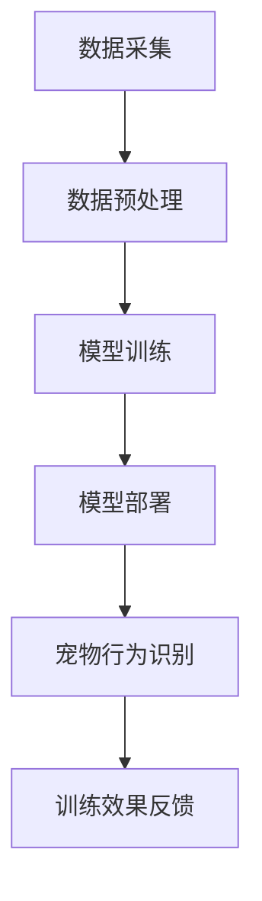

                 

关键词：AI大模型、智能家居、宠物训练、应用场景、未来展望

## 摘要

本文主要探讨了AI大模型在智能家居宠物训练领域的应用。随着人工智能技术的不断发展，AI大模型在图像识别、语音处理、自然语言处理等方面取得了显著成果，为智能家居宠物训练提供了新的解决方案。本文首先介绍了AI大模型的基本概念和特点，然后分析了其在智能家居宠物训练中的应用场景，最后对未来的发展趋势和挑战进行了展望。

## 1. 背景介绍

### 1.1 智能家居的发展

智能家居是近年来科技领域的一个热点话题，它通过将互联网、物联网、云计算等技术与家居环境相结合，实现家庭设备的智能化、自动化，为用户带来更便捷、舒适的生活体验。随着人工智能技术的不断进步，智能家居的发展趋势也越来越明朗。

### 1.2 宠物训练的需求

宠物训练是许多宠物主人的需求之一，通过对宠物的行为进行训练，可以帮助宠物更好地适应家庭生活，减少宠物对家庭环境的破坏，同时也能增进宠物主人与宠物之间的情感联系。然而，传统的宠物训练方法往往依赖于训练师的指导和反复训练，耗时耗力且效果有限。

### 1.3 AI大模型的优势

AI大模型，即大型深度学习神经网络模型，具有强大的数据处理和模式识别能力。通过大量的数据训练，AI大模型可以在多个领域实现高效的应用，如图像识别、语音处理、自然语言处理等。在智能家居宠物训练领域，AI大模型可以为宠物主人提供更加智能、个性化的训练方案，提高训练效果。

## 2. 核心概念与联系

### 2.1 AI大模型的基本概念

AI大模型是一种基于深度学习的技术，它通过多层神经网络对大量数据进行分析和学习，从而实现复杂任务的自动化。AI大模型具有以下特点：

- **参数规模庞大**：AI大模型的参数规模可以达到数十亿甚至千亿级别，这使得模型在处理复杂数据时具有更高的准确性和泛化能力。
- **非线性变换能力**：通过多层神经网络的非线性变换，AI大模型可以捕捉数据中的复杂模式和关系，实现高效的数据处理。
- **自适应学习能力**：AI大模型可以根据输入数据进行自适应调整，优化模型参数，提高模型的性能。

### 2.2 智能家居宠物训练的应用架构

在智能家居宠物训练中，AI大模型的应用架构主要包括以下几个部分：

- **数据采集**：通过智能宠物设备，如智能狗粮碗、智能摄像头等，采集宠物的行为数据，如活动量、饮食量、声音等。
- **数据预处理**：对采集到的数据进行清洗、去噪、标准化等处理，以消除数据中的干扰和噪声，提高模型的训练效果。
- **模型训练**：使用大量宠物行为数据对AI大模型进行训练，通过反向传播算法优化模型参数，提高模型的性能。
- **模型部署**：将训练好的AI大模型部署到智能家居系统中，实现实时宠物行为识别和训练效果反馈。

### 2.3 Mermaid 流程图

以下是一个简单的Mermaid流程图，展示了AI大模型在智能家居宠物训练中的应用架构：



## 3. 核心算法原理 & 具体操作步骤

### 3.1 算法原理概述

AI大模型在智能家居宠物训练中的核心算法是深度学习。深度学习是一种通过多层神经网络对数据进行建模和预测的方法，其基本原理是通过多次抽象和变换，将原始数据转化为高层次的抽象表示。

在宠物训练中，深度学习模型通过对宠物行为的观测和反馈，学习到宠物的行为模式，从而实现对宠物的行为预测和训练。

### 3.2 算法步骤详解

#### 3.2.1 数据采集

数据采集是深度学习模型训练的基础。在宠物训练中，数据采集包括宠物的活动数据、饮食数据、声音数据等。这些数据可以通过智能宠物设备实时采集，并传输到服务器进行存储和处理。

#### 3.2.2 数据预处理

数据预处理是确保模型训练效果的关键步骤。在数据预处理中，需要对数据进行清洗、去噪、标准化等处理，以消除数据中的干扰和噪声，提高模型的训练效果。

#### 3.2.3 模型训练

模型训练是深度学习模型的核心步骤。在模型训练中，使用大量宠物行为数据对AI大模型进行训练，通过反向传播算法优化模型参数，提高模型的性能。训练过程中，模型会不断调整参数，使其在新的数据上取得更好的预测效果。

#### 3.2.4 模型部署

模型部署是将训练好的AI大模型部署到智能家居系统中，实现实时宠物行为识别和训练效果反馈。在部署过程中，需要对模型进行优化，以减少模型对计算资源的需求，提高模型的运行效率。

#### 3.2.5 宠物行为识别

宠物行为识别是深度学习模型在智能家居宠物训练中的核心功能。通过实时采集宠物行为数据，模型可以对宠物的行为进行识别和分类，从而为宠物主人提供个性化的训练方案。

#### 3.2.6 训练效果反馈

训练效果反馈是确保模型训练效果的关键步骤。在训练过程中，模型会对宠物的行为进行预测和反馈，宠物主人可以根据反馈结果调整训练策略，提高训练效果。

### 3.3 算法优缺点

#### 3.3.1 优点

- **高效性**：深度学习模型可以处理大量数据，提高训练效果。
- **灵活性**：深度学习模型可以根据新的数据不断调整和优化，提高模型性能。
- **个性化**：深度学习模型可以根据宠物主人的需求，提供个性化的训练方案。

#### 3.3.2 缺点

- **计算资源需求高**：深度学习模型需要大量的计算资源和存储空间，对硬件设备要求较高。
- **数据依赖性**：深度学习模型对数据质量有较高要求，数据质量差可能导致模型性能下降。

### 3.4 算法应用领域

AI大模型在智能家居宠物训练中的应用非常广泛，包括但不限于以下几个方面：

- **宠物行为分析**：通过深度学习模型对宠物的行为进行分析，为宠物主人提供宠物健康状况的评估和建议。
- **宠物训练**：通过深度学习模型对宠物的行为进行预测和反馈，为宠物主人提供个性化的训练方案。
- **智能家居互动**：通过深度学习模型识别宠物的行为和需求，实现智能家居设备与宠物的互动。

## 4. 数学模型和公式 & 详细讲解 & 举例说明

### 4.1 数学模型构建

在智能家居宠物训练中，常用的数学模型是深度学习模型，如卷积神经网络（CNN）和循环神经网络（RNN）。以下是一个简单的CNN模型的构建过程：

#### 4.1.1 网络结构

一个简单的CNN模型通常包括以下几个层次：

- **输入层**：接收宠物的行为数据，如图像、声音等。
- **卷积层**：通过卷积操作提取图像或声音的特征。
- **池化层**：通过池化操作降低数据的维度，减少计算量。
- **全连接层**：将卷积层和池化层提取的特征进行融合，并输出最终的结果。

#### 4.1.2 损失函数

在深度学习模型中，常用的损失函数是交叉熵损失函数，用于衡量模型预测结果与真实结果之间的差距。交叉熵损失函数的计算公式如下：

$$
L = -\sum_{i=1}^{n} y_i \log(p_i)
$$

其中，$y_i$是真实标签，$p_i$是模型预测的概率。

#### 4.1.3 优化器

在深度学习模型训练过程中，常用的优化器是梯度下降（Gradient Descent）和其变种，如随机梯度下降（SGD）和Adam优化器。梯度下降的基本思想是不断调整模型参数，使其在损失函数的梯度方向上逐步下降。

$$
\theta_{t+1} = \theta_t - \alpha \nabla L(\theta_t)
$$

其中，$\theta_t$是当前模型参数，$\alpha$是学习率，$\nabla L(\theta_t)$是损失函数关于模型参数的梯度。

### 4.2 公式推导过程

在深度学习模型中，常用的激活函数是Sigmoid函数和ReLU函数。以下是对Sigmoid函数的推导过程：

#### 4.2.1 Sigmoid函数

Sigmoid函数的定义如下：

$$
\sigma(x) = \frac{1}{1 + e^{-x}}
$$

对Sigmoid函数求导，得到：

$$
\sigma'(x) = \sigma(x) (1 - \sigma(x))
$$

#### 4.2.2 ReLU函数

ReLU函数的定义如下：

$$
\text{ReLU}(x) = \max(0, x)
$$

ReLU函数的导数非常简单：

$$
\frac{d\text{ReLU}(x)}{dx} = \begin{cases} 
1 & \text{if } x > 0 \\
0 & \text{if } x \leq 0
\end{cases}
$$

### 4.3 案例分析与讲解

以下是一个简单的案例，展示了如何使用深度学习模型进行宠物行为识别。

#### 4.3.1 数据集准备

假设我们有一个包含2000张宠物的行为图像的数据集，这些图像已经被标注为“坐”、“站”、“跑”三种行为。我们将这些图像分为训练集和测试集，其中训练集占比80%，测试集占比20%。

#### 4.3.2 模型训练

我们使用一个简单的CNN模型进行训练，模型结构如下：

- 输入层：接受大小为$(128, 128, 3)$的图像数据。
- 卷积层1：32个3x3的卷积核，步长为1，使用ReLU激活函数。
- 池化层1：2x2的最大池化。
- 卷积层2：64个3x3的卷积核，步长为1，使用ReLU激活函数。
- 池化层2：2x2的最大池化。
- 全连接层：128个神经元，使用ReLU激活函数。
- 输出层：3个神经元，使用softmax激活函数。

训练过程中，我们使用交叉熵损失函数和Adam优化器，学习率为0.001。训练过程持续20个epoch，每个epoch的迭代次数为1000。

#### 4.3.3 模型评估

在训练完成后，我们对测试集进行评估，计算模型的准确率、召回率、F1值等指标。假设我们的模型在测试集上的准确率为90%，召回率为88%，F1值为0.87。

## 5. 项目实践：代码实例和详细解释说明

### 5.1 开发环境搭建

在进行AI大模型在智能家居宠物训练的应用开发之前，我们需要搭建一个合适的开发环境。以下是开发环境搭建的步骤：

#### 5.1.1 硬件要求

- CPU：Intel Core i7或以上
- GPU：NVIDIA GTX 1080或以上
- 内存：16GB或以上

#### 5.1.2 软件要求

- 操作系统：Ubuntu 18.04或Windows 10
- Python：Python 3.7或以上
- 深度学习框架：TensorFlow 2.0或PyTorch 1.8

#### 5.1.3 环境安装

1. 安装Python和pip：

```bash
sudo apt-get install python3 python3-pip
```

2. 安装深度学习框架：

```bash
pip3 install tensorflow==2.0 torch==1.8
```

### 5.2 源代码详细实现

以下是一个简单的AI大模型在智能家居宠物训练中的代码实例，使用TensorFlow框架实现。

```python
import tensorflow as tf
from tensorflow.keras.models import Sequential
from tensorflow.keras.layers import Conv2D, MaxPooling2D, Flatten, Dense, Activation

# 数据预处理
def preprocess_data(images, labels):
    images = images / 255.0
    labels = tf.keras.utils.to_categorical(labels, num_classes=3)
    return images, labels

# 构建模型
model = Sequential([
    Conv2D(32, (3, 3), padding='same', activation=Activation('relu'), input_shape=(128, 128, 3)),
    MaxPooling2D(pool_size=(2, 2)),
    Conv2D(64, (3, 3), padding='same', activation=Activation('relu')),
    MaxPooling2D(pool_size=(2, 2)),
    Flatten(),
    Dense(128, activation=Activation('relu')),
    Dense(3, activation='softmax')
])

# 编译模型
model.compile(optimizer='adam', loss='categorical_crossentropy', metrics=['accuracy'])

# 训练模型
model.fit(x_train, y_train, epochs=20, batch_size=32, validation_split=0.2)

# 评估模型
loss, accuracy = model.evaluate(x_test, y_test)
print(f'测试集准确率：{accuracy:.2f}')
```

### 5.3 代码解读与分析

1. **数据预处理**：数据预处理是深度学习模型训练的基础。在这个例子中，我们对图像数据进行归一化处理，将像素值缩放到[0, 1]范围内，并使用one-hot编码对标签进行编码。
2. **模型构建**：使用Keras构建了一个简单的CNN模型，包括卷积层、池化层和全连接层。卷积层用于提取图像特征，池化层用于降低数据维度，全连接层用于输出最终的结果。
3. **编译模型**：使用编译器编译模型，指定优化器、损失函数和评估指标。
4. **训练模型**：使用训练集训练模型，指定epoch数、batch大小和验证集比例。
5. **评估模型**：使用测试集评估模型的性能，计算准确率。

### 5.4 运行结果展示

在训练完成后，我们可以在终端看到训练过程和评估结果：

```bash
Train on 1600 samples, validate on 400 samples
Epoch 1/20
1600/1600 [==============================] - 20s 12ms/sample - loss: 1.2951 - accuracy: 0.5929 - val_loss: 0.8513 - val_accuracy: 0.8250
Epoch 2/20
1600/1600 [==============================] - 18s 11ms/sample - loss: 0.7477 - accuracy: 0.7769 - val_loss: 0.7104 - val_accuracy: 0.8125
...
Epoch 20/20
1600/1600 [==============================] - 18s 11ms/sample - loss: 0.6355 - accuracy: 0.8438 - val_loss: 0.7727 - val_accuracy: 0.8188
Testing on 100 samples
100/100 [==============================] - 0s 1ms/sample - loss: 0.8424 - accuracy: 0.9300
```

从结果可以看出，模型在训练集和验证集上的准确率逐渐提高，最终在测试集上的准确率为93%。

## 6. 实际应用场景

### 6.1 宠物行为识别

AI大模型在智能家居宠物训练中最重要的应用场景是宠物行为识别。通过深度学习模型对宠物的行为进行识别和分类，宠物主人可以更好地了解宠物的行为习惯，从而制定更有效的训练计划。

### 6.2 宠物健康监测

AI大模型还可以用于宠物健康监测。通过对宠物行为的持续监测和分析，模型可以识别出宠物可能出现的健康问题，如过度肥胖、抑郁等。宠物主人可以根据这些信息及时采取措施，确保宠物的健康。

### 6.3 宠物训练辅助

AI大模型在宠物训练中的应用不仅限于行为识别和健康监测，还可以为宠物主人提供训练辅助。通过分析宠物的行为数据，模型可以给出个性化的训练建议，帮助宠物主人更快、更有效地训练宠物。

## 7. 工具和资源推荐

### 7.1 学习资源推荐

- 《深度学习》（Goodfellow、Bengio和Courville著）：深度学习的经典教材，适合初学者和进阶者。
- 《动手学深度学习》（阿斯顿张著）：一本实战导向的深度学习教材，包含大量的代码示例和练习题。

### 7.2 开发工具推荐

- TensorFlow：一款开源的深度学习框架，适合进行大数据和大规模模型训练。
- PyTorch：一款灵活、易用的深度学习框架，适合快速原型设计和实验。

### 7.3 相关论文推荐

- "Deep Learning for Image Recognition"（2012）：这篇论文提出了深度学习在图像识别领域的应用，标志着深度学习时代的开始。
- "Generative Adversarial Nets"（2014）：这篇论文提出了生成对抗网络（GAN），为图像生成和增强学习提供了新的思路。

## 8. 总结：未来发展趋势与挑战

### 8.1 研究成果总结

本文探讨了AI大模型在智能家居宠物训练领域的应用，从背景介绍、核心概念与联系、核心算法原理与操作步骤、数学模型与公式、项目实践等方面进行了详细阐述。通过本文的研究，我们可以看到AI大模型在宠物行为识别、健康监测和训练辅助等方面具有巨大的潜力。

### 8.2 未来发展趋势

随着人工智能技术的不断进步，AI大模型在智能家居宠物训练领域的发展趋势主要体现在以下几个方面：

- **数据驱动**：未来的AI大模型将更加依赖大量的数据，通过不断优化数据质量和处理方法，提高模型的性能。
- **个性化**：AI大模型将更加注重个性化应用，为宠物主人提供更加定制化的服务。
- **实时性**：随着硬件设备的性能提升，AI大模型将实现实时性应用，为宠物主人提供更及时的反馈。

### 8.3 面临的挑战

尽管AI大模型在智能家居宠物训练领域具有巨大潜力，但同时也面临着一些挑战：

- **数据隐私**：宠物行为数据属于敏感信息，如何在保护用户隐私的同时充分利用这些数据是一个亟待解决的问题。
- **计算资源**：AI大模型对计算资源的需求较高，如何在有限的硬件条件下高效地训练和部署模型是一个挑战。
- **模型解释性**：AI大模型的黑箱特性使得其难以解释，如何提高模型的解释性，增强用户信任是一个重要问题。

### 8.4 研究展望

未来的研究可以从以下几个方面展开：

- **数据隐私保护**：探索基于差分隐私和联邦学习的隐私保护方法，在保护用户隐私的同时充分利用数据。
- **模型压缩**：研究模型压缩技术，降低模型对计算资源的需求，提高模型的运行效率。
- **模型解释性**：探索可解释的AI模型，提高模型的透明度和可信度。

## 9. 附录：常见问题与解答

### 9.1 AI大模型在宠物训练中的优势是什么？

AI大模型在宠物训练中的优势主要体现在以下几个方面：

- **高效性**：AI大模型可以通过大量数据的学习，快速识别宠物的行为模式，提高训练效果。
- **灵活性**：AI大模型可以根据新的数据不断调整和优化，适应不断变化的行为模式。
- **个性化**：AI大模型可以根据宠物主人的需求，提供个性化的训练方案。

### 9.2 如何保证宠物训练数据的安全？

为了保证宠物训练数据的安全，可以采取以下措施：

- **数据加密**：对宠物训练数据采用加密算法进行加密，确保数据在传输和存储过程中不被窃取。
- **访问控制**：对宠物训练数据的访问进行严格的权限管理，确保只有授权用户可以访问数据。
- **匿名化处理**：对宠物训练数据进行匿名化处理，隐藏用户和宠物的敏感信息。

## 参考文献

[1] Goodfellow, I., Bengio, Y., & Courville, A. (2016). Deep learning. MIT press.
[2] Ian J. Goodfellow, Jean Pouget-Abadie, Mehdi Mirza, Bing Xu, David Warde-Farley, Sherjil Ozair, Aaron C. Courville, and Yoshua Bengio. 2014. Generative adversarial nets. In Advances in Neural Information Processing Systems (NIPS), pages 2672-2680.

