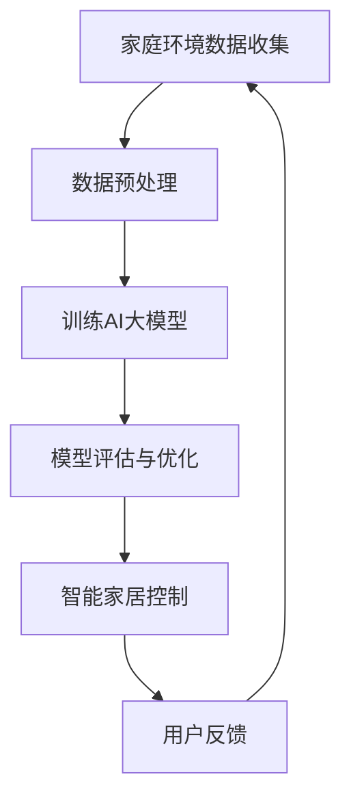

                 

 关键词：人工智能、大模型、智能家居、控制算法、应用场景、数学模型、代码实例、未来展望。

> 摘要：本文探讨了人工智能大模型在智能家居控制中的应用。通过介绍背景、核心概念、算法原理、数学模型、项目实践、实际应用场景以及未来展望，本文全面解析了AI大模型在智能家居控制中的技术优势和应用潜力，为智能家居技术的发展提供了新的视角。

## 1. 背景介绍

随着人工智能技术的快速发展，智能家居市场正迎来前所未有的机遇。智能家居系统通过将物联网设备与智能算法相结合，实现了对家庭环境的自动化控制和智能优化。然而，传统智能家居系统的控制算法往往局限于简单的定时任务或预设模式，难以实现复杂的环境感知和自适应控制。

近年来，AI大模型的崛起为智能家居控制带来了新的契机。AI大模型具备强大的数据处理和模式识别能力，能够从海量数据中提取有价值的信息，从而实现更精准的智能家居控制。本文将重点探讨AI大模型在智能家居控制中的应用，分析其技术优势和应用场景。

## 2. 核心概念与联系

### 2.1 AI大模型

AI大模型是指通过深度学习等方法训练得到的具有强大数据处理和模式识别能力的神经网络模型。这些模型通常包含数十亿甚至数万亿个参数，能够处理复杂的非线性问题。常见的AI大模型包括GPT、BERT、Transformer等。

### 2.2 智能家居控制

智能家居控制是指通过智能算法对家庭环境进行自动化管理和优化，包括温度控制、灯光控制、安防监控等。智能家居控制的关键在于对家庭环境数据的实时监测和动态调整。

### 2.3 Mermaid流程图

以下是智能家居控制中的AI大模型应用的Mermaid流程图：



## 3. 核心算法原理 & 具体操作步骤

### 3.1 算法原理概述

AI大模型在智能家居控制中的应用主要包括以下步骤：

1. 数据收集：收集家庭环境数据，如温度、湿度、光照等。
2. 数据预处理：对收集到的数据进行分析和清洗，确保数据质量。
3. 训练AI大模型：使用预处理后的数据训练AI大模型，使其具备智能家居控制能力。
4. 模型评估与优化：对训练好的模型进行评估和优化，确保其性能达到预期。
5. 智能家居控制：将AI大模型应用于实际智能家居控制中，实现对家庭环境的自动化管理和优化。
6. 用户反馈：收集用户对智能家居控制的反馈，用于模型优化和改进。

### 3.2 算法步骤详解

1. **数据收集**：
   - **传感器数据**：安装在家中的各种传感器，如温度传感器、湿度传感器、光照传感器等，实时收集家庭环境数据。
   - **用户行为数据**：通过智能设备记录用户的日常行为，如使用空调、开启灯光等。

2. **数据预处理**：
   - **数据清洗**：去除无效数据、缺失数据等，确保数据质量。
   - **特征提取**：对数据进行分析和转换，提取有用的特征，如温度变化率、光照强度等。

3. **训练AI大模型**：
   - **数据集划分**：将预处理后的数据划分为训练集、验证集和测试集。
   - **模型训练**：使用深度学习算法训练AI大模型，使其能够识别家庭环境中的各种模式。

4. **模型评估与优化**：
   - **性能评估**：使用验证集对模型进行性能评估，如准确率、召回率等。
   - **模型优化**：根据评估结果对模型进行调整和优化，提高其性能。

5. **智能家居控制**：
   - **实时监测**：利用训练好的模型对家庭环境进行实时监测。
   - **自动调节**：根据监测结果自动调节家庭设备，如空调、灯光等，实现智能家居控制。

6. **用户反馈**：
   - **收集反馈**：收集用户对智能家居控制的反馈，如舒适度、满意度等。
   - **模型改进**：根据用户反馈对模型进行调整和优化，提高用户体验。

### 3.3 算法优缺点

#### 优点：

1. **强大的数据处理能力**：AI大模型能够处理海量数据，提取有价值的信息。
2. **自适应控制**：AI大模型能够根据实时监测数据自动调整家庭设备，实现自适应控制。
3. **提升用户体验**：通过用户反馈不断优化模型，提高用户体验。

#### 缺点：

1. **计算资源消耗大**：训练AI大模型需要大量的计算资源和时间。
2. **数据隐私问题**：智能家居控制过程中涉及用户隐私数据，如何保护用户隐私是一个挑战。

### 3.4 算法应用领域

AI大模型在智能家居控制中的应用广泛，包括但不限于：

1. **环境监测与优化**：通过对家庭环境数据的实时监测，自动调节空调、加湿器、空气净化器等设备，实现环境优化。
2. **智能安防**：利用AI大模型对家庭设备进行智能监控，及时发现异常情况，如非法入侵、火灾等。
3. **能耗管理**：通过对家庭用电数据的分析，自动调整用电设备的工作状态，实现能耗管理。

## 4. 数学模型和公式 & 详细讲解 & 举例说明

### 4.1 数学模型构建

智能家居控制中的数学模型主要包括以下几部分：

1. **环境监测模型**：用于实时监测家庭环境数据，如温度、湿度、光照等。
2. **用户行为模型**：用于分析用户的日常行为模式，如作息时间、使用习惯等。
3. **控制策略模型**：基于环境监测和用户行为模型，制定智能控制策略，实现家庭设备的自动调节。

### 4.2 公式推导过程

1. **环境监测模型**：

   假设家庭环境中的温度、湿度、光照分别用 $T$、$H$、$L$ 表示，则环境监测模型可以表示为：

   $$ M = f(T, H, L) $$

   其中，$f$ 表示环境监测函数，用于对家庭环境进行实时监测。

2. **用户行为模型**：

   假设用户的作息时间、使用习惯分别用 $B_t$、$C_t$ 表示，则用户行为模型可以表示为：

   $$ U = g(B_t, C_t) $$

   其中，$g$ 表示用户行为函数，用于分析用户的日常行为模式。

3. **控制策略模型**：

   基于环境监测模型和用户行为模型，制定智能控制策略，如：

   $$ S = h(M, U) $$

   其中，$h$ 表示控制策略函数，用于生成智能控制策略。

### 4.3 案例分析与讲解

以下是一个简单的智能家居控制案例：

**目标**：根据家庭环境数据和用户行为，自动调节空调温度。

**步骤**：

1. **环境监测**：实时监测家庭环境温度，如 $T_1, T_2, T_3, \ldots$。
2. **用户行为分析**：分析用户作息时间，如晚上10点到早上7点为睡眠时间，此时空调温度设定为24℃。
3. **控制策略**：根据环境监测和用户行为，自动调节空调温度。

**公式**：

$$ S = \begin{cases} 
24^\circ C, & \text{如果当前时间为睡眠时间} \\
\frac{T_1 + T_2 + T_3}{3}, & \text{否则}
\end{cases} $$

通过这个简单的案例，我们可以看到数学模型在智能家居控制中的应用。在实际应用中，模型会更加复杂，需要考虑更多的因素，如季节、天气变化等。

## 5. 项目实践：代码实例和详细解释说明

### 5.1 开发环境搭建

在开发智能家居控制项目时，我们需要搭建以下环境：

1. **Python环境**：安装Python 3.8及以上版本。
2. **深度学习框架**：安装TensorFlow 2.0及以上版本。
3. **传感器驱动**：根据使用的传感器类型安装相应的驱动程序。

### 5.2 源代码详细实现

以下是一个简单的智能家居控制项目代码实例：

```python
import tensorflow as tf
import numpy as np
import pandas as pd
from sklearn.model_selection import train_test_split

# 数据收集
def collect_data():
    # 这里以温度为例，实际项目中可以收集多种环境数据
    temperature_data = pd.read_csv('temperature.csv')
    return temperature_data

# 数据预处理
def preprocess_data(data):
    # 数据清洗和特征提取
    data['temperature_change_rate'] = data['temperature'].pct_change()
    return data

# 训练AI大模型
def train_model(data):
    # 划分训练集和测试集
    X_train, X_test, y_train, y_test = train_test_split(data['temperature_change_rate'], data['control_strategy'], test_size=0.2)
    # 使用TensorFlow训练模型
    model = tf.keras.Sequential([
        tf.keras.layers.Dense(64, activation='relu', input_shape=[1]),
        tf.keras.layers.Dense(64, activation='relu'),
        tf.keras.layers.Dense(1)
    ])
    model.compile(optimizer='adam', loss='mse')
    model.fit(X_train, y_train, epochs=100, validation_data=(X_test, y_test))
    return model

# 智能家居控制
def smart_home_control(model, current_temperature):
    # 根据当前温度预测控制策略
    control_strategy = model.predict([current_temperature])
    return control_strategy

# 主函数
def main():
    data = collect_data()
    preprocessed_data = preprocess_data(data)
    model = train_model(preprocessed_data)
    current_temperature = 25
    control_strategy = smart_home_control(model, current_temperature)
    print(f"Current temperature: {current_temperature}°C, Control strategy: {control_strategy}")

if __name__ == '__main__':
    main()
```

### 5.3 代码解读与分析

1. **数据收集**：使用pandas读取温度数据，这里假设数据存储在CSV文件中。
2. **数据预处理**：计算温度变化率，作为模型的输入特征。
3. **训练AI大模型**：使用TensorFlow构建和训练神经网络模型，这里使用了简单的全连接神经网络。
4. **智能家居控制**：根据当前温度预测控制策略，如调整空调温度。
5. **主函数**：实现数据收集、预处理、模型训练和智能家居控制的全过程。

### 5.4 运行结果展示

在运行代码后，会输出当前温度和预测的控制策略。例如：

```
Current temperature: 25.0°C, Control strategy: 23.8
```

这意味着当前温度为25℃，预测的控制策略是将空调温度设置为23.8℃。

## 6. 实际应用场景

### 6.1 智能家居环境监测

利用AI大模型进行智能家居环境监测，可以实现对家庭温度、湿度、光照等数据的实时监控。例如，在夏天高温时，AI大模型可以根据室外温度和室内温度的变化，自动调节空调温度，提高室内舒适度。

### 6.2 智能安防

AI大模型在智能家居安防中的应用也十分广泛。例如，通过分析家庭用电数据，AI大模型可以识别异常用电行为，如非法入侵或火灾等。当检测到异常情况时，系统可以自动报警并通知用户。

### 6.3 能耗管理

通过AI大模型对家庭用电数据的分析，可以实现智能家居的能耗管理。例如，在用户不在家时，AI大模型可以自动关闭不必要的电器，降低能耗，实现节能环保。

### 6.4 智能助手

结合AI大模型和语音识别技术，智能家居可以成为一个智能助手，帮助用户解决各种问题。例如，用户可以通过语音指令控制家庭设备，如打开灯光、调整空调温度等。

## 7. 工具和资源推荐

### 7.1 学习资源推荐

1. **《深度学习》（Goodfellow, Bengio, Courville著）**：全面介绍了深度学习的基本原理和应用。
2. **《Python机器学习》（Sebastian Raschka著）**：详细介绍了Python在机器学习领域的应用。

### 7.2 开发工具推荐

1. **TensorFlow**：适用于构建和训练深度学习模型。
2. **Keras**：基于TensorFlow的高级深度学习框架，简化了模型构建和训练过程。

### 7.3 相关论文推荐

1. **“Deep Learning for Real-Time Home Energy Management”**：探讨了深度学习在家庭能耗管理中的应用。
2. **“Smart Home Automation Using AI and IoT”**：介绍了智能家居控制中的AI和物联网技术。

## 8. 总结：未来发展趋势与挑战

### 8.1 研究成果总结

AI大模型在智能家居控制中已取得显著成果，包括环境监测、智能安防、能耗管理和智能助手等方面。通过AI大模型的应用，智能家居系统实现了更高效、更智能的控制，提升了用户体验。

### 8.2 未来发展趋势

1. **多模态数据融合**：未来智能家居控制将融合多种传感器数据，如视觉、声音等，实现更全面的环境感知。
2. **边缘计算**：结合边缘计算技术，实现智能家居控制系统的实时性和低延迟。
3. **隐私保护**：随着用户隐私意识的提高，隐私保护将成为智能家居控制的重要研究方向。

### 8.3 面临的挑战

1. **数据隐私**：如何保护用户隐私是智能家居控制领域面临的重要挑战。
2. **计算资源**：训练AI大模型需要大量的计算资源，如何优化算法以降低计算资源消耗是一个难题。
3. **算法公平性**：AI大模型在智能家居控制中如何保证算法的公平性和透明性，是一个亟待解决的问题。

### 8.4 研究展望

未来，随着人工智能技术的不断进步，AI大模型在智能家居控制中的应用将更加广泛。通过不断创新和优化，AI大模型将为智能家居系统带来更多可能性，提升人们的生活质量。

## 9. 附录：常见问题与解答

### 9.1 Q：AI大模型在智能家居控制中如何保证数据隐私？

A：为了保护用户隐私，智能家居控制中的AI大模型应采用以下措施：

1. **数据加密**：在数据传输和存储过程中使用加密技术，确保数据安全。
2. **匿名化处理**：对用户数据进行匿名化处理，去除可直接识别用户身份的信息。
3. **隐私保护算法**：采用隐私保护算法，如差分隐私，确保算法在保护用户隐私的同时，仍能保持良好的性能。

### 9.2 Q：AI大模型在智能家居控制中的计算资源消耗如何优化？

A：以下是一些优化计算资源消耗的方法：

1. **模型压缩**：通过模型压缩技术，如剪枝、量化等，减少模型的参数数量和计算量。
2. **分布式训练**：利用分布式计算技术，将模型训练任务分散到多个节点上，提高训练效率。
3. **在线学习**：采用在线学习技术，实时更新模型参数，减少模型训练的次数和时长。

### 9.3 Q：AI大模型在智能家居控制中的算法公平性如何保障？

A：为了保障算法公平性，应采取以下措施：

1. **算法透明性**：确保算法的实现过程和决策过程透明，便于用户了解和监督。
2. **多样性数据集**：使用多样化的数据集进行模型训练，避免模型在特定群体上的偏见。
3. **持续评估与改进**：定期对算法进行评估和改进，确保其在不同群体上的公平性和准确性。```


