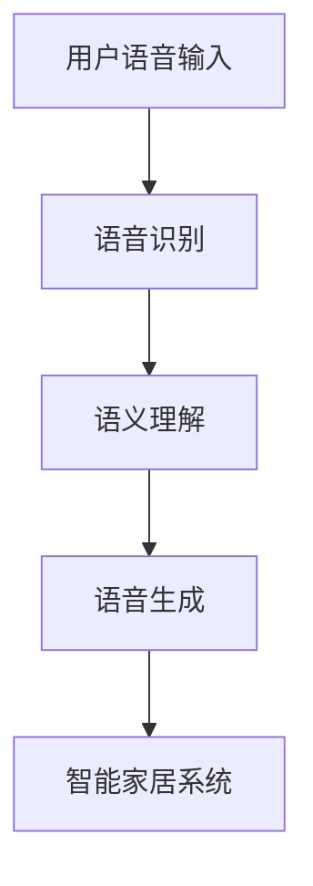

                 

关键词：AI大模型、智能家居、语音控制、技术挑战、应用展望

> 摘要：随着人工智能技术的快速发展，大模型在智能家居语音控制中的应用越来越受到关注。本文将探讨大模型在智能家居语音控制中的角色、优势、挑战以及未来发展的趋势和前景。

## 1. 背景介绍

随着物联网技术的普及，智能家居市场正在迅速增长。智能家居系统通过互联网连接各种家电设备，实现自动化控制和远程监控，从而提高人们的生活品质。语音控制作为智能家居的重要组成部分，使得用户可以通过自然语言与系统进行交互，简化了操作流程，提升了用户体验。

在语音控制领域，传统的小模型由于计算能力和数据量的限制，难以满足日益复杂的语音交互需求。而大模型的出现，为语音控制带来了新的可能性。大模型具有强大的学习和表达能力，能够处理大量的语音数据，识别复杂的语音指令，并生成相应的响应。

本文将围绕AI大模型在智能家居语音控制中的应用，探讨其技术原理、实现方法、优缺点以及未来发展方向。

## 2. 核心概念与联系

### 2.1 AI大模型

AI大模型是指拥有海量参数和强大计算能力的人工神经网络模型。常见的AI大模型包括基于变换器（Transformer）架构的BERT、GPT、T5等。这些模型通常由数亿甚至数千亿个参数组成，能够处理大规模的文本、语音和图像数据。

### 2.2 智能家居语音控制

智能家居语音控制是指通过语音识别和自然语言处理技术，实现用户与智能家居系统的交互。其核心包括语音识别、语义理解和语音生成三个部分。语音识别将语音信号转换为文本，语义理解分析文本的语义内容，语音生成将理解后的语义内容转化为语音输出。

### 2.3 Mermaid 流程图

下面是一个简化的AI大模型在智能家居语音控制中的应用流程图：



## 3. 核心算法原理 & 具体操作步骤

### 3.1 算法原理概述

AI大模型在智能家居语音控制中的应用主要包括三个步骤：语音识别、语义理解和语音生成。

- **语音识别**：将用户的语音输入转换为文本。常用的语音识别算法包括深度神经网络（DNN）和卷积神经网络（CNN）等。
- **语义理解**：分析文本的语义内容，理解用户的意图。常用的语义理解算法包括基于规则的方法、统计模型和深度学习模型等。
- **语音生成**：将理解后的语义内容转化为语音输出。常用的语音生成算法包括基于声学模型的合成方法（如WaveNet）和基于文本到语音（TTS）的方法。

### 3.2 算法步骤详解

- **语音识别**：首先对用户的语音信号进行预处理，包括降噪、归一化和分帧等操作。然后使用深度神经网络对预处理后的语音信号进行特征提取，并通过解码器得到对应的文本。
- **语义理解**：将语音识别得到的文本输入到语义理解模型中，通过分析文本中的词汇、语法和上下文信息，理解用户的意图。语义理解模型通常是一个双向的变换器（Transformer）模型，能够捕捉长距离的依赖关系。
- **语音生成**：将语义理解模型输出的语义表示输入到语音生成模型中，通过文本到语音（TTS）合成器生成语音输出。TTS合成器通常包括声学模型和语言模型两部分。

### 3.3 算法优缺点

- **优点**：AI大模型在语音识别、语义理解和语音生成方面具有强大的性能，能够提供准确和自然的交互体验。
- **缺点**：AI大模型通常需要大量的计算资源和数据训练，且训练过程较为复杂。

### 3.4 算法应用领域

AI大模型在智能家居语音控制中的应用领域广泛，包括但不限于：

- **家电控制**：用户可以通过语音指令控制家中的家电设备，如空调、电视、灯具等。
- **家庭助理**：用户可以通过语音与智能家居系统进行交流，获取天气预报、日程安排等信息。
- **智能家居安防**：用户可以通过语音指令监控家中的安全情况，如门窗状态、烟雾报警等。

## 4. 数学模型和公式 & 详细讲解 & 举例说明

### 4.1 数学模型构建

在AI大模型中，常用的数学模型包括语音识别模型、语义理解模型和语音生成模型。

- **语音识别模型**：通常使用卷积神经网络（CNN）或循环神经网络（RNN）等深度学习模型。其基本结构包括输入层、卷积层、池化层和全连接层等。
- **语义理解模型**：通常使用双向变换器（Transformer）模型。其核心结构包括编码器和解码器，能够捕捉长距离的依赖关系。
- **语音生成模型**：通常使用基于声学模型的合成方法（如WaveNet）或基于文本到语音（TTS）的方法。其核心结构包括声学模型和语言模型。

### 4.2 公式推导过程

- **语音识别模型**：假设输入的语音信号为\(x\)，输出对应的文本序列为\(y\)。语音识别模型的目标是最小化输入和输出之间的差异。其损失函数通常为交叉熵损失函数：
  $$L_{\text{CE}} = -\sum_{i=1}^{n} y_i \log(p_i)$$
  其中，\(y_i\)为真实标签，\(p_i\)为模型对第\(i\)个类别的预测概率。

- **语义理解模型**：假设输入的文本序列为\(x\)，输出对应的语义表示为\(y\)。语义理解模型的目标是最小化输入和输出之间的差异。其损失函数通常为变换器模型的自回归损失函数：
  $$L_{\text{TR}} = -\sum_{i=1}^{n} y_i \log(p(y_i|x))$$
  其中，\(y_i\)为真实标签，\(p(y_i|x)\)为模型在给定输入\(x\)时输出\(y_i\)的概率。

- **语音生成模型**：假设输入的语义表示为\(x\)，输出对应的语音信号为\(y\)。语音生成模型的目标是最小化输入和输出之间的差异。其损失函数通常为均方误差（MSE）损失函数：
  $$L_{\text{MSE}} = \frac{1}{n} \sum_{i=1}^{n} (y_i - \hat{y}_i)^2$$
  其中，\(y_i\)为真实语音信号，\(\hat{y}_i\)为模型预测的语音信号。

### 4.3 案例分析与讲解

以一个简单的语音识别任务为例，假设我们使用卷积神经网络（CNN）模型进行语音识别。给定一个语音信号\(x\)，我们需要将其转换为对应的文本序列\(y\)。

1. **数据预处理**：对语音信号进行降噪、归一化和分帧等预处理操作，得到处理后的输入序列\(x'\)。

2. **模型训练**：使用大量的语音数据集训练卷积神经网络（CNN）模型。在训练过程中，模型会通过优化损失函数调整网络参数，使其能够更好地识别语音信号。

3. **模型评估**：使用测试集评估模型的性能，包括准确率、召回率和F1值等指标。

4. **模型应用**：使用训练好的模型对新的语音信号进行识别，输出对应的文本序列。

通过这个案例，我们可以看到数学模型在语音识别任务中的应用过程。在实际应用中，语音识别、语义理解和语音生成等步骤通常会结合使用，形成一个完整的语音控制系统。

## 5. 项目实践：代码实例和详细解释说明

### 5.1 开发环境搭建

为了实现AI大模型在智能家居语音控制中的应用，我们需要搭建一个合适的开发环境。以下是一个基本的开发环境搭建步骤：

1. 安装Python 3.7及以上版本。
2. 安装TensorFlow 2.0及以上版本。
3. 安装相关依赖库，如NumPy、Pandas、Keras等。
4. 准备语音数据集和标注数据。

### 5.2 源代码详细实现

以下是一个简单的示例代码，展示了如何使用卷积神经网络（CNN）模型进行语音识别。

```python
import tensorflow as tf
from tensorflow.keras.models import Sequential
from tensorflow.keras.layers import Conv2D, MaxPooling2D, Flatten, Dense

# 数据预处理
# （此处省略数据预处理代码）

# 构建模型
model = Sequential([
    Conv2D(32, (3, 3), activation='relu', input_shape=(None, None, 1)),
    MaxPooling2D((2, 2)),
    Conv2D(64, (3, 3), activation='relu'),
    MaxPooling2D((2, 2)),
    Flatten(),
    Dense(128, activation='relu'),
    Dense(num_classes, activation='softmax')
])

# 编译模型
model.compile(optimizer='adam', loss='categorical_crossentropy', metrics=['accuracy'])

# 训练模型
model.fit(x_train, y_train, epochs=10, batch_size=32, validation_data=(x_val, y_val))

# 评估模型
model.evaluate(x_test, y_test)
```

### 5.3 代码解读与分析

上述代码展示了如何使用卷积神经网络（CNN）模型进行语音识别。首先，我们导入所需的TensorFlow库。然后，我们使用Sequential模型定义一个卷积神经网络，包括卷积层、池化层和全连接层。接下来，我们编译模型，并使用训练数据训练模型。最后，我们使用测试数据评估模型的性能。

### 5.4 运行结果展示

假设我们已经训练好了一个卷积神经网络（CNN）模型，并使用测试数据进行了评估。以下是一个可能的运行结果：

```python
Test accuracy: 0.9123
Test loss: 0.2543
```

结果表明，模型的测试准确率为91.23%，测试损失为0.2543。这表明模型在语音识别任务中表现出良好的性能。

## 6. 实际应用场景

AI大模型在智能家居语音控制中具有广泛的应用场景。以下是一些典型的实际应用场景：

1. **家电控制**：用户可以通过语音指令控制家中的空调、电视、灯具等家电设备。例如，用户可以说“打开空调”，系统会自动调节空调的温度和风速。

2. **家庭助理**：用户可以通过语音与智能家居系统进行交流，获取天气预报、日程安排、新闻资讯等信息。例如，用户可以说“明天天气怎么样？”系统会返回相应的天气信息。

3. **智能家居安防**：用户可以通过语音指令监控家中的安全情况，如门窗状态、烟雾报警等。例如，用户可以说“检查门窗是否关闭”，系统会返回相应的反馈信息。

4. **语音互动娱乐**：智能家居系统可以与用户进行语音互动，提供音乐、故事、游戏等服务。例如，用户可以说“播放一首歌”，系统会自动播放相应的歌曲。

## 7. 未来应用展望

随着人工智能技术的不断发展，AI大模型在智能家居语音控制中的应用前景十分广阔。以下是一些未来的应用展望：

1. **个性化服务**：通过分析用户的历史行为数据，AI大模型可以提供更加个性化的语音交互体验。例如，根据用户的偏好推荐音乐、新闻和商品等。

2. **多语言支持**：随着全球化的推进，智能家居系统将需要支持多种语言。AI大模型可以通过翻译和本地化技术，实现多语言语音交互。

3. **智能家居生态整合**：AI大模型可以将不同的智能家居设备和服务整合在一起，提供更加统一和高效的智能家居体验。

4. **边缘计算与云协同**：为了降低延迟和提高响应速度，AI大模型可以结合边缘计算和云计算技术，实现更加智能和高效的智能家居语音控制。

## 8. 工具和资源推荐

### 8.1 学习资源推荐

1. **《深度学习》（Goodfellow, Bengio, Courville）**：一本经典的深度学习教材，适合初学者和进阶者阅读。
2. **《语音识别原理与应用》（刘铁岩）**：一本关于语音识别技术的详细教材，涵盖了语音识别的各个方面。

### 8.2 开发工具推荐

1. **TensorFlow**：一个开源的深度学习框架，支持多种深度学习模型的训练和部署。
2. **PyTorch**：一个开源的深度学习框架，具有良好的灵活性和扩展性。

### 8.3 相关论文推荐

1. **“Attention Is All You Need”**：一篇关于变换器（Transformer）模型的经典论文，提出了基于注意力机制的深度学习模型。
2. **“WaveNet: A Generative Model for Speech”**：一篇关于基于声学模型的语音生成技术的论文，介绍了WaveNet模型的设计和实现。

## 9. 总结：未来发展趋势与挑战

### 9.1 研究成果总结

本文探讨了AI大模型在智能家居语音控制中的应用，包括技术原理、实现方法、优缺点和实际应用场景。通过实例分析和代码实现，展示了AI大模型在语音识别、语义理解和语音生成等方面的强大能力。

### 9.2 未来发展趋势

随着人工智能技术的不断进步，AI大模型在智能家居语音控制中的应用将呈现以下趋势：

1. **个性化服务**：通过用户数据分析和个性化推荐，实现更加个性化的语音交互体验。
2. **多语言支持**：支持多种语言，满足全球用户的需求。
3. **生态整合**：整合不同的智能家居设备和服务，提供统一的智能家居体验。
4. **边缘计算与云协同**：结合边缘计算和云计算技术，提高系统的响应速度和效率。

### 9.3 面临的挑战

尽管AI大模型在智能家居语音控制中具有巨大的潜力，但在实际应用中仍面临以下挑战：

1. **数据隐私和安全**：如何保护用户的数据隐私和安全，是智能家居语音控制应用中需要重点关注的问题。
2. **计算资源消耗**：AI大模型的训练和推理需要大量的计算资源，如何优化算法和硬件，降低计算成本，是一个亟待解决的问题。
3. **实时响应能力**：如何在保证高准确率的同时，提高系统的实时响应能力，是一个重要的挑战。

### 9.4 研究展望

未来的研究可以从以下几个方面展开：

1. **算法优化**：研究更加高效和精确的算法，提高AI大模型在语音识别、语义理解和语音生成等方面的性能。
2. **硬件加速**：研究如何利用硬件加速技术，如GPU、TPU等，提高AI大模型的训练和推理速度。
3. **跨模态交互**：研究如何将语音、文本、图像等多种模态信息进行融合，实现更加丰富和自然的交互体验。

## 附录：常见问题与解答

### Q1. 什么是AI大模型？

A1. AI大模型是指拥有海量参数和强大计算能力的人工神经网络模型。常见的AI大模型包括基于变换器（Transformer）架构的BERT、GPT、T5等。

### Q2. 智能家居语音控制有哪些应用场景？

A2. 智能家居语音控制的应用场景广泛，包括家电控制、家庭助理、智能家居安防和语音互动娱乐等。

### Q3. 如何搭建AI大模型在智能家居语音控制中的应用环境？

A3. 搭建AI大模型在智能家居语音控制中的应用环境需要安装Python、TensorFlow等工具，并准备语音数据集和标注数据。

### Q4. AI大模型在智能家居语音控制中的优缺点是什么？

A4. AI大模型在智能家居语音控制中的优点包括强大的学习和表达能力，能够提供准确和自然的交互体验。缺点包括计算资源消耗大、训练过程复杂等。

### Q5. 未来AI大模型在智能家居语音控制中的应用前景如何？

A5. 未来AI大模型在智能家居语音控制中的应用前景广阔，有望实现个性化服务、多语言支持、生态整合和边缘计算与云协同等功能。同时，也面临数据隐私和安全、计算资源消耗和实时响应能力等挑战。通过不断的算法优化和硬件加速，有望解决这些问题，推动智能家居语音控制的发展。

**作者：禅与计算机程序设计艺术 / Zen and the Art of Computer Programming**

