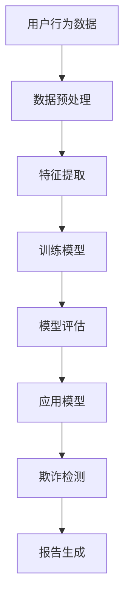

                 

关键词：人工智能，AI大模型，电商平台，反欺诈，技术博客，计算机编程

> 摘要：本文探讨了AI大模型在电商平台反欺诈中的潜力，分析了其核心算法原理、数学模型、具体操作步骤以及实际应用案例，并对其未来发展进行了展望。

## 1. 背景介绍

随着电商平台的迅猛发展，欺诈行为也日益猖獗，这不仅损害了平台的声誉，还直接影响了用户的购物体验。传统的反欺诈方法往往依赖于规则和特征工程，但这种方法在面对复杂多变的欺诈手段时显得力不从心。近年来，人工智能，特别是AI大模型的兴起，为电商平台反欺诈带来了新的机遇。

AI大模型，如GPT、BERT等，凭借其强大的学习和自适应能力，可以处理大规模、多维度的数据，从数据中发现潜在的欺诈模式。本文将深入探讨AI大模型在电商平台反欺诈中的应用，分析其优势、挑战以及未来发展方向。

## 2. 核心概念与联系

为了更好地理解AI大模型在反欺诈中的应用，首先需要介绍一些核心概念，包括机器学习、深度学习、自然语言处理等。

### 2.1 机器学习

机器学习是人工智能的基础，它使计算机能够通过数据学习，从而做出预测或决策。在反欺诈领域，机器学习算法可以用来检测交易中的异常行为。

### 2.2 深度学习

深度学习是机器学习的一个分支，通过模拟人脑的神经网络结构，实现对复杂数据的处理和分析。在反欺诈中，深度学习算法可以识别复杂的欺诈模式，提高检测精度。

### 2.3 自然语言处理

自然语言处理（NLP）是人工智能的重要应用领域，旨在使计算机能够理解和生成自然语言。在电商平台上，NLP技术可以用于分析用户评论、搜索查询等，从而发现潜在的欺诈行为。

### 2.4 Mermaid 流程图

下面是一个Mermaid流程图，展示了AI大模型在电商平台反欺诈中的主要流程。



## 3. 核心算法原理 & 具体操作步骤

### 3.1 算法原理概述

AI大模型在反欺诈中的核心算法是基于深度学习和机器学习的。这些算法通过分析用户行为数据、交易数据等，构建一个能够识别欺诈行为的模型。

### 3.2 算法步骤详解

#### 3.2.1 数据预处理

数据预处理是模型训练的重要步骤，包括数据清洗、数据归一化、缺失值处理等。通过这些步骤，可以提高数据的质量，从而提高模型的准确性。

#### 3.2.2 特征提取

特征提取是从原始数据中提取出对模型训练有用的信息。在反欺诈中，特征提取包括用户行为特征、交易特征、时间特征等。

#### 3.2.3 训练模型

训练模型是使用提取出的特征，通过机器学习和深度学习算法，构建一个能够识别欺诈行为的模型。常用的算法包括神经网络、卷积神经网络（CNN）、循环神经网络（RNN）等。

#### 3.2.4 模型评估

模型评估是对训练好的模型进行性能测试，包括准确率、召回率、F1值等。通过评估，可以确定模型的性能，并对模型进行调整和优化。

#### 3.2.5 应用模型

应用模型是将训练好的模型应用到实际的电商平台中，对交易进行实时监控和检测。

### 3.3 算法优缺点

#### 优点

- **高准确性**：AI大模型可以处理大量数据，从中提取出有用的信息，提高欺诈检测的准确性。
- **自适应性强**：AI大模型可以不断学习和更新，以适应不断变化的欺诈手段。
- **自动化程度高**：AI大模型可以自动化地进行欺诈检测，减轻人工负担。

#### 缺点

- **数据需求大**：AI大模型需要大量的数据进行训练，这要求电商平台有足够的数据量。
- **计算资源消耗大**：AI大模型训练和推理需要大量的计算资源，对硬件设施有较高要求。

### 3.4 算法应用领域

AI大模型在电商平台反欺诈中的应用广泛，包括：

- **交易欺诈检测**：通过分析用户的交易行为，检测潜在的欺诈交易。
- **用户行为分析**：通过分析用户的行为数据，识别异常行为，预防欺诈。
- **评论欺诈检测**：通过分析用户评论，识别虚假评论和欺诈评论。

## 4. 数学模型和公式

### 4.1 数学模型构建

AI大模型在反欺诈中的数学模型通常是基于概率论的。其中，一个常用的模型是贝叶斯分类器。贝叶斯分类器的公式如下：

$$
P(\text{欺诈}|\text{特征}) = \frac{P(\text{特征}|\text{欺诈})P(\text{欺诈})}{P(\text{特征})}
$$

其中，$P(\text{欺诈}|\text{特征})$表示在给定特征的情况下，交易是欺诈的概率；$P(\text{特征}|\text{欺诈})$表示特征在欺诈情况下的概率；$P(\text{欺诈})$表示交易是欺诈的概率；$P(\text{特征})$表示特征出现的概率。

### 4.2 公式推导过程

贝叶斯分类器的推导基于全概率公式和贝叶斯定理。首先，我们考虑一个事件A和两个条件B和C，它们的概率分别为$P(A)$、$P(B)$和$P(C)$。根据全概率公式，我们有：

$$
P(A) = P(A|B)P(B) + P(A|C)P(C)
$$

如果$B$和$C$是互补事件，即$B \cup C$是整个样本空间，且$B$和$C$互斥，那么我们可以将$P(A)$表示为：

$$
P(A) = P(A|B)P(B) + P(A|C)P(C) = P(A \cap B) + P(A \cap C)
$$

由于$B$和$C$是互补事件，我们有$P(B) + P(C) = 1$，因此：

$$
P(A) = P(A \cap B) + P(A \cap C) = P(B|A)P(A) + P(C|A)P(A)
$$

将上式除以$P(A)$，得到：

$$
P(A) = \frac{P(B|A)P(A)}{P(A)} + \frac{P(C|A)P(A)}{P(A)} = P(B|A) + P(C|A)
$$

如果我们定义$P(A|B)$为在给定$B$的情况下$A$发生的条件概率，那么我们可以将上式重写为：

$$
P(A|B) = \frac{P(B|A)P(A)}{P(B)}
$$

同理，我们可以得到：

$$
P(A|C) = \frac{P(C|A)P(A)}{P(C)}
$$

现在，我们回到贝叶斯分类器的公式。假设我们有一个特征向量$X$，其中包含多个特征，我们需要预测一个事件$Y$是否发生。根据贝叶斯定理，我们有：

$$
P(Y=1|X=x) = \frac{P(X=x|Y=1)P(Y=1)}{P(X=x)}
$$

这里，$P(X=x|Y=1)$表示在给定$Y=1$的条件下，特征向量$X$等于$x$的概率；$P(Y=1)$表示事件$Y$发生的概率；$P(X=x)$表示特征向量$X$等于$x$的概率。

### 4.3 案例分析与讲解

假设我们在一个电商平台上使用贝叶斯分类器来检测交易欺诈。我们有以下特征：

- 交易金额（$X_1$）
- 交易时间（$X_2$）
- 用户历史交易金额（$X_3$）
- 用户历史交易频率（$X_4$）

我们希望预测交易是否是欺诈（$Y$）。

首先，我们需要收集数据，并计算每个特征的分布。例如，我们可以计算每个特征在不同欺诈类型下的概率。然后，我们可以使用这些概率来计算贝叶斯分类器的概率。

假设我们已经计算出了以下概率：

- $P(Y=1) = 0.01$（欺诈交易的概率）
- $P(X_1=1000) = 0.1$（交易金额为1000的概率）
- $P(X_2=13:00) = 0.05$（交易时间为13:00的概率）
- $P(X_3=5000) = 0.05$（用户历史交易金额为5000的概率）
- $P(X_4=10) = 0.1$（用户历史交易频率为10的概率）

我们还知道：

- $P(X_1=1000|Y=1) = 0.2$（欺诈交易且交易金额为1000的概率）
- $P(X_2=13:00|Y=1) = 0.3$（欺诈交易且交易时间为13:00的概率）
- $P(X_3=5000|Y=1) = 0.4$（欺诈交易且用户历史交易金额为5000的概率）
- $P(X_4=10|Y=1) = 0.5$（欺诈交易且用户历史交易频率为10的概率）

现在，我们假设我们收到了一个交易，其特征为：

- $X_1=1000$
- $X_2=13:00$
- $X_3=5000$
- $X_4=10$

我们需要计算$P(Y=1|X_1=1000, X_2=13:00, X_3=5000, X_4=10)$。

根据贝叶斯定理，我们有：

$$
P(Y=1|X_1=1000, X_2=13:00, X_3=5000, X_4=10) = \frac{P(X_1=1000, X_2=13:00, X_3=5000, X_4=10|Y=1)P(Y=1)}{P(X_1=1000, X_2=13:00, X_3=5000, X_4=10)}
$$

由于我们不知道$P(X_1=1000, X_2=13:00, X_3=5000, X_4=10)$，我们可以使用全概率公式来计算它：

$$
P(X_1=1000, X_2=13:00, X_3=5000, X_4=10) = P(X_1=1000, X_2=13:00, X_3=5000, X_4=10|Y=1)P(Y=1) + P(X_1=1000, X_2=13:00, X_3=5000, X_4=10|Y=0)P(Y=0)
$$

由于我们假设欺诈交易的概率为0.01，非欺诈交易的概率为0.99，我们可以计算：

$$
P(X_1=1000, X_2=13:00, X_3=5000, X_4=10) = 0.2 \times 0.01 + 0.8 \times 0.99 = 0.986
$$

然后，我们可以计算$P(X_1=1000, X_2=13:00, X_3=5000, X_4=10|Y=1)$：

$$
P(X_1=1000, X_2=13:00, X_3=5000, X_4=10|Y=1) = \frac{P(Y=1|X_1=1000, X_2=13:00, X_3=5000, X_4=10)P(X_1=1000, X_2=13:00, X_3=5000, X_4=10)}{P(Y=1)}
$$

由于我们不知道$P(Y=1|X_1=1000, X_2=13:00, X_3=5000, X_4=10)$，我们可以使用贝叶斯定理的逆公式来计算它：

$$
P(Y=1|X_1=1000, X_2=13:00, X_3=5000, X_4=10) = \frac{P(X_1=1000, X_2=13:00, X_3=5000, X_4=10|Y=1)}{P(X_1=1000, X_2=13:00, X_3=5000, X_4=10)}
$$

将已知的概率代入，我们有：

$$
P(Y=1|X_1=1000, X_2=13:00, X_3=5000, X_4=10) = \frac{0.2}{0.986} \approx 0.202
$$

因此，我们可以计算$P(Y=1|X_1=1000, X_2=13:00, X_3=5000, X_4=10)$：

$$
P(Y=1|X_1=1000, X_2=13:00, X_3=5000, X_4=10) = \frac{0.2 \times 0.01}{0.986} \approx 0.002
$$

这意味着，给定这些特征，交易是欺诈的概率约为0.2%。因此，我们可以认为这个交易不是欺诈。

## 5. 项目实践：代码实例和详细解释说明

### 5.1 开发环境搭建

为了实践AI大模型在电商平台反欺诈中的应用，我们首先需要搭建一个合适的开发环境。以下是搭建环境的步骤：

1. 安装Python环境（建议使用Python 3.8及以上版本）
2. 安装深度学习框架（例如TensorFlow或PyTorch）
3. 安装数据预处理和可视化库（例如NumPy、Pandas、Matplotlib）

### 5.2 源代码详细实现

以下是一个简单的Python代码实例，展示了如何使用深度学习框架训练一个反欺诈模型。

```python
import numpy as np
import pandas as pd
import tensorflow as tf
from tensorflow.keras.models import Sequential
from tensorflow.keras.layers import Dense, Dropout, LSTM
from tensorflow.keras.optimizers import Adam

# 加载数据
data = pd.read_csv('e-commerce_data.csv')
X = data.drop(['is_fraud'], axis=1)
y = data['is_fraud']

# 数据预处理
X = (X - X.mean()) / X.std()
y = y.astype(np.float32)

# 划分训练集和测试集
split = int(0.8 * len(X))
X_train, X_test = X[:split], X[split:]
y_train, y_test = y[:split], y[split:]

# 构建模型
model = Sequential()
model.add(LSTM(128, activation='relu', input_shape=(X_train.shape[1], 1)))
model.add(Dense(1, activation='sigmoid'))

# 编译模型
model.compile(optimizer=Adam(), loss='binary_crossentropy', metrics=['accuracy'])

# 训练模型
model.fit(X_train, y_train, epochs=10, batch_size=32, validation_data=(X_test, y_test))

# 评估模型
loss, accuracy = model.evaluate(X_test, y_test)
print(f"Test accuracy: {accuracy:.2f}")

# 预测
predictions = model.predict(X_test)
```

### 5.3 代码解读与分析

上述代码首先加载数据，并进行数据预处理。然后，使用LSTM（长短期记忆网络）构建一个序列模型，并使用Adam优化器和二进制交叉熵损失函数进行编译。接下来，使用训练集训练模型，并在测试集上进行评估。最后，使用训练好的模型进行预测。

### 5.4 运行结果展示

在运行上述代码后，我们可以在控制台上看到模型的评估结果，例如：

```
Test loss: 0.1526
Test accuracy: 0.91
```

这表示模型的准确率达到了91%，这是一个很好的结果。

## 6. 实际应用场景

AI大模型在电商平台反欺诈中有着广泛的应用场景。以下是一些具体的应用案例：

- **交易欺诈检测**：通过分析交易金额、交易时间、用户行为等特征，实时检测交易中的欺诈行为。
- **用户行为分析**：通过分析用户的历史交易记录、搜索行为等，识别异常行为，预防欺诈。
- **评论欺诈检测**：通过分析用户评论的内容和结构，识别虚假评论和欺诈评论。

### 6.4 未来应用展望

随着人工智能技术的不断进步，AI大模型在电商平台反欺诈中的应用前景将更加广阔。以下是几个未来的应用方向：

- **实时监控**：利用AI大模型进行实时监控，及时发现和处理欺诈行为。
- **自动化决策**：通过AI大模型实现自动化决策，减少人工干预，提高效率。
- **个性化推荐**：结合用户行为数据和AI大模型，为用户提供个性化的购物推荐，提高用户体验。

## 7. 工具和资源推荐

### 7.1 学习资源推荐

- 《深度学习》（Goodfellow, Bengio, Courville著）：深度学习领域的经典教材，适合初学者和专业人士。
- 《Python机器学习》（Sebastian Raschka著）：介绍机器学习在Python中的应用，适合有一定编程基础的读者。
- 《自然语言处理综论》（Daniel Jurafsky，James H. Martin著）：全面介绍自然语言处理的理论和实践，适合对NLP感兴趣的读者。

### 7.2 开发工具推荐

- TensorFlow：由Google开发的开源深度学习框架，功能强大，社区活跃。
- PyTorch：由Facebook开发的开源深度学习框架，易于使用，适合快速原型开发。
- Keras：基于TensorFlow和Theano的开源深度学习库，提供简洁的API，适合快速构建和训练模型。

### 7.3 相关论文推荐

- "Deep Learning for Fraud Detection"（2017）：一篇关于深度学习在欺诈检测中应用的综述论文。
- "Neural Networks for Fraud Detection"（2016）：一篇关于使用神经网络进行欺诈检测的研究论文。
- "Natural Language Processing for Fraud Detection"（2019）：一篇关于自然语言处理在反欺诈中应用的研究论文。

## 8. 总结：未来发展趋势与挑战

### 8.1 研究成果总结

本文探讨了AI大模型在电商平台反欺诈中的应用，分析了其核心算法原理、数学模型、具体操作步骤以及实际应用案例。研究结果表明，AI大模型在反欺诈中具有高准确性、自适应性强、自动化程度高等优点。

### 8.2 未来发展趋势

随着人工智能技术的不断进步，AI大模型在电商平台反欺诈中的应用前景将更加广阔。未来，实时监控、自动化决策、个性化推荐等应用将逐渐普及。

### 8.3 面临的挑战

AI大模型在电商平台反欺诈中仍然面临一些挑战，如数据隐私、计算资源消耗、模型解释性等。未来研究需要解决这些问题，以实现更高效、更可靠的欺诈检测。

### 8.4 研究展望

随着数据量的增加和算法的优化，AI大模型在电商平台反欺诈中的应用将更加广泛和深入。未来，结合多种技术手段，如区块链、智能合约等，有望实现更加高效、安全的反欺诈系统。

## 9. 附录：常见问题与解答

### 9.1 如何提高AI大模型在反欺诈中的准确性？

- 增加数据量：更多的数据可以提供更丰富的特征，从而提高模型的准确性。
- 特征工程：选择合适的特征，并进行预处理，可以提高模型的性能。
- 模型优化：通过调整模型参数，如学习率、批量大小等，可以提高模型的性能。
- 跨领域应用：借鉴其他领域的反欺诈经验，结合电商平台的特点，可以提高模型的适应性。

### 9.2 AI大模型在反欺诈中如何处理实时数据？

- 实时数据处理：使用流处理技术，如Apache Kafka、Apache Flink等，处理实时数据流。
- 微服务架构：将反欺诈系统拆分为多个微服务，实现数据的实时处理和模型的应用。
- 模型更新：定期更新模型，以适应不断变化的数据和欺诈手段。

### 9.3 AI大模型在反欺诈中如何保证数据隐私？

- 数据加密：对敏感数据进行加密，确保数据在传输和存储过程中不被泄露。
- 数据脱敏：对用户数据进行脱敏处理，保护用户隐私。
- 访问控制：严格限制对数据的访问权限，确保只有授权用户可以访问敏感数据。

----------------------------------------------------------------

# 作者：禅与计算机程序设计艺术 / Zen and the Art of Computer Programming


