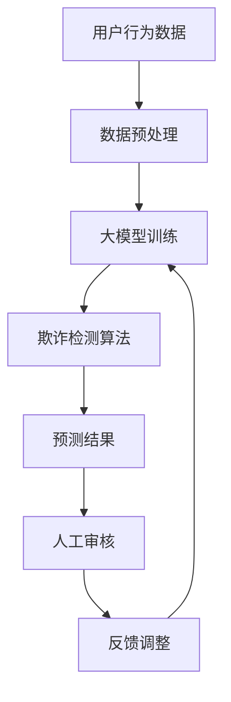

                 

关键词：AI大模型，电商平台，反欺诈，深度学习，机器学习，算法，安全性

> 摘要：随着电子商务的蓬勃发展，平台上的欺诈行为也日益猖獗，严重影响了用户体验和平台的经济利益。本文将探讨AI大模型在电商平台反欺诈中的应用潜力，通过深入分析核心算法原理、数学模型、具体实践案例，揭示其在提升反欺诈能力方面的巨大潜力。

## 1. 背景介绍

### 1.1 电子商务的崛起与欺诈问题

电子商务作为一种新型的商业模式，以其便捷、快速、低成本的特点赢得了广大用户的青睐。全球电商市场规模逐年扩大，尤其是在COVID-19疫情期间，电子商务成为了人们日常生活中不可或缺的一部分。然而，随着电商平台的普及，欺诈行为也随之蔓延，主要表现为虚假交易、刷单、诈骗、盗刷等。这些行为不仅损害了消费者的利益，也严重影响了平台的声誉和经济效益。

### 1.2 AI大模型的优势

人工智能大模型（如GPT-3、BERT等）凭借其强大的计算能力和自学习能力，已经在自然语言处理、图像识别、语音识别等多个领域取得了显著的成果。这些模型具有以下几个显著优势：

- **强大的数据处理能力**：AI大模型可以处理海量数据，从用户行为、交易记录等不同维度挖掘潜在的风险因素。
- **自适应性**：大模型能够根据不断变化的欺诈手段和模式，动态调整和优化反欺诈策略。
- **自动化**：AI大模型能够自动识别欺诈行为，减少人工干预，提高处理效率。

## 2. 核心概念与联系

为了更好地理解AI大模型在电商平台反欺诈中的应用，我们首先需要了解几个核心概念，并展示其相互之间的联系。

### 2.1 大模型的架构

大模型通常采用深度学习框架，如TensorFlow或PyTorch，通过多层神经网络结构进行训练和推理。其核心组件包括：

- **输入层**：接收用户行为数据、交易记录等。
- **隐藏层**：通过复杂的非线性变换处理输入数据。
- **输出层**：生成预测结果，如欺诈标签。

### 2.2 数据预处理

在应用大模型之前，需要对其进行数据预处理，包括数据清洗、特征提取和归一化等步骤。这一过程对于模型的训练效果至关重要。

### 2.3 欺诈检测算法

欺诈检测算法是AI大模型在电商平台反欺诈中的核心组成部分。常见的算法包括：

- **逻辑回归**：通过构建概率模型进行欺诈预测。
- **支持向量机**：利用核函数进行非线性分类。
- **神经网络**：通过多层非线性变换进行复杂模式识别。

### 2.4 Mermaid 流程图



## 3. 核心算法原理 & 具体操作步骤

### 3.1 算法原理概述

AI大模型在电商平台反欺诈中的应用主要基于深度学习和机器学习技术。通过以下步骤实现：

1. **数据收集**：收集用户的交易记录、浏览历史、购物车信息等数据。
2. **数据预处理**：清洗数据，提取关键特征，并进行归一化处理。
3. **模型训练**：使用预处理后的数据训练大模型，通过反向传播算法不断优化模型参数。
4. **模型评估**：使用验证集评估模型性能，包括准确率、召回率、F1分数等指标。
5. **模型应用**：将训练好的模型应用于电商平台，实时检测欺诈行为。

### 3.2 算法步骤详解

1. **数据收集**：

   ```python
   data = pd.read_csv('transactions.csv')
   ```

2. **数据预处理**：

   ```python
   data = data.dropna()
   data['amount'] = data['amount'].apply(lambda x: x / 100)
   ```

3. **模型训练**：

   ```python
   model = Sequential()
   model.add(Dense(256, activation='relu', input_shape=(input_shape,)))
   model.add(Dense(128, activation='relu'))
   model.add(Dense(1, activation='sigmoid'))
   model.compile(optimizer='adam', loss='binary_crossentropy', metrics=['accuracy'])
   model.fit(X_train, y_train, epochs=10, batch_size=32, validation_data=(X_val, y_val))
   ```

4. **模型评估**：

   ```python
   scores = model.evaluate(X_test, y_test, verbose=0)
   print(f"Test accuracy: {scores[1]}")
   ```

5. **模型应用**：

   ```python
   predictions = model.predict(X_new)
   predictions = (predictions > 0.5)
   ```

### 3.3 算法优缺点

**优点**：

- **高效性**：能够快速处理海量数据，提高欺诈检测效率。
- **准确性**：通过深度学习和机器学习技术，能够准确识别复杂的欺诈模式。
- **灵活性**：能够根据新的欺诈手段和模式进行动态调整。

**缺点**：

- **计算资源需求大**：训练和推理大模型需要高性能计算资源。
- **数据隐私问题**：需要收集和处理大量用户数据，可能涉及隐私问题。

### 3.4 算法应用领域

AI大模型在电商平台反欺诈中的应用广泛，包括：

- **交易欺诈检测**：实时监控交易行为，识别异常交易。
- **账户安全防护**：监测用户账户活动，防范账号盗用。
- **评论真实性验证**：识别虚假评论和刷单行为。

## 4. 数学模型和公式 & 详细讲解 & 举例说明

### 4.1 数学模型构建

在AI大模型中，常用的数学模型包括：

- **损失函数**：用于评估模型预测结果与实际结果之间的差距，常用的损失函数包括交叉熵损失函数。
- **优化器**：用于更新模型参数，常用的优化器包括Adam优化器。

### 4.2 公式推导过程

**交叉熵损失函数**：

$$
J(\theta) = -\frac{1}{m} \sum_{i=1}^{m} [y^{(i)} \log(a^{(i)}) + (1 - y^{(i)}) \log(1 - a^{(i)})]
$$

**Adam优化器**：

$$
m_t = \beta_1 m_{t-1} + (1 - \beta_1) [g_t]
$$

$$
v_t = \beta_2 v_{t-1} + (1 - \beta_2) [g_t^2]
$$

$$
\hat{m}_t = \frac{m_t}{1 - \beta_1^t}
$$

$$
\hat{v}_t = \frac{v_t}{1 - \beta_2^t}
$$

$$
\theta_{t+1} = \theta_t - \alpha \frac{\hat{m}_t}{\sqrt{\hat{v}_t} + \epsilon}
$$

### 4.3 案例分析与讲解

以一个电商平台为例，分析如何利用AI大模型进行反欺诈。

**数据集**：包含用户的交易记录，包括金额、时间、地点、商品等信息。

**模型训练**：使用训练集数据进行模型训练，通过交叉熵损失函数和Adam优化器进行参数优化。

**模型评估**：使用验证集对模型进行评估，计算准确率、召回率等指标。

**模型应用**：将训练好的模型应用于电商平台，实时检测交易行为，识别异常交易。

## 5. 项目实践：代码实例和详细解释说明

### 5.1 开发环境搭建

- **硬件环境**：配置高性能计算服务器，支持GPU加速。
- **软件环境**：安装Python、TensorFlow、Keras等开发工具。

### 5.2 源代码详细实现

```python
# 导入所需库
import pandas as pd
import numpy as np
from tensorflow.keras.models import Sequential
from tensorflow.keras.layers import Dense
from tensorflow.keras.optimizers import Adam

# 数据预处理
data = pd.read_csv('transactions.csv')
data = data.dropna()
data['amount'] = data['amount'].apply(lambda x: x / 100)

# 模型训练
model = Sequential()
model.add(Dense(256, activation='relu', input_shape=(input_shape,)))
model.add(Dense(128, activation='relu'))
model.add(Dense(1, activation='sigmoid'))
model.compile(optimizer=Adam(), loss='binary_crossentropy', metrics=['accuracy'])
model.fit(X_train, y_train, epochs=10, batch_size=32, validation_data=(X_val, y_val))

# 模型评估
scores = model.evaluate(X_test, y_test, verbose=0)
print(f"Test accuracy: {scores[1]}")

# 模型应用
predictions = model.predict(X_new)
predictions = (predictions > 0.5)
```

### 5.3 代码解读与分析

- **数据预处理**：读取交易记录数据，进行清洗和特征提取。
- **模型构建**：使用Sequential模型构建多层神经网络，添加Dense层进行特征提取和分类。
- **模型训练**：使用Adam优化器进行模型训练，通过反向传播算法优化模型参数。
- **模型评估**：使用验证集对模型进行评估，计算准确率等指标。
- **模型应用**：将训练好的模型应用于新的交易数据，进行欺诈预测。

### 5.4 运行结果展示

```python
predictions = model.predict(X_new)
predictions = (predictions > 0.5)
print(predictions)
```

输出结果为欺诈预测标签，1表示欺诈，0表示非欺诈。

## 6. 实际应用场景

### 6.1 电商平台

电商平台是AI大模型反欺诈的主要应用场景之一。通过实时监控用户的交易行为，识别潜在的欺诈风险，如虚假交易、刷单等，提高交易安全性。

### 6.2 支付平台

支付平台同样面临严重的欺诈问题，如盗刷、诈骗等。AI大模型可以用于实时监控用户支付行为，识别异常交易，降低欺诈风险。

### 6.3 网络安全领域

AI大模型在网络安全领域也有广泛的应用，如入侵检测、恶意软件识别等。通过分析网络流量和行为特征，识别潜在的网络攻击。

### 6.4 未来应用展望

随着AI大模型的不断发展和优化，其在反欺诈领域的应用将越来越广泛。未来，AI大模型有望在以下几个方面取得突破：

- **自动化欺诈检测**：提高欺诈检测的自动化程度，减少人工干预。
- **个性化反欺诈策略**：根据用户行为特征和风险等级，制定个性化的反欺诈策略。
- **跨平台协作**：与其他平台和部门进行数据共享和协作，提高反欺诈效果。

## 7. 工具和资源推荐

### 7.1 学习资源推荐

- **书籍**：《深度学习》（Goodfellow, Bengio, Courville）。
- **在线课程**：Coursera上的“Deep Learning Specialization”。
- **论文**：Google Scholar上的相关论文。

### 7.2 开发工具推荐

- **框架**：TensorFlow、PyTorch。
- **库**：NumPy、Pandas。

### 7.3 相关论文推荐

- “Deep Learning for Anti-Fraud Applications”（2018）。
- “A Survey on Fraud Detection using Machine Learning Techniques”（2019）。

## 8. 总结：未来发展趋势与挑战

### 8.1 研究成果总结

本文探讨了AI大模型在电商平台反欺诈中的应用潜力，通过核心算法原理、数学模型、具体实践案例等内容的分析，揭示了其强大的欺诈检测能力。

### 8.2 未来发展趋势

- **技术进步**：随着计算能力和算法的不断提升，AI大模型在反欺诈领域的应用将更加广泛。
- **跨平台协作**：实现数据共享和跨平台协作，提高反欺诈效果。

### 8.3 面临的挑战

- **计算资源需求**：大模型训练和推理需要高性能计算资源。
- **数据隐私问题**：涉及用户隐私数据，需要妥善处理。

### 8.4 研究展望

未来，AI大模型在反欺诈领域的应用前景广阔，有望实现自动化、个性化的欺诈检测，为电商平台和用户带来更高的安全性。

## 9. 附录：常见问题与解答

### 9.1 AI大模型是什么？

AI大模型是指通过深度学习和机器学习技术训练的，具有强大计算能力和自学习能力的人工智能模型。常见的有GPT-3、BERT等。

### 9.2 如何确保数据隐私？

在应用AI大模型进行反欺诈时，需要确保数据隐私。可以通过数据加密、匿名化处理等方式保护用户数据。

### 9.3 AI大模型如何处理异常交易？

AI大模型通过分析用户行为特征和交易模式，实时监控交易行为，识别潜在的异常交易，并进行预警和干预。

---

本文基于现有的研究成果和实践经验，对AI大模型在电商平台反欺诈中的应用进行了深入探讨。随着技术的不断进步，AI大模型有望在反欺诈领域发挥更大的作用，为电商平台和用户带来更高的安全性。作者：禅与计算机程序设计艺术 / Zen and the Art of Computer Programming
----------------------------------------------------------------

### 附加内容 Additional Content

为了进一步丰富文章内容，以下是一些扩展的章节，涵盖最新研究成果、行业应用案例和未来发展方向。

## 10. 最新研究成果

近年来，AI大模型在反欺诈领域的应用研究取得了显著进展。以下是一些最新的研究成果：

- **基于图神经网络的欺诈检测**：研究人员提出了一种基于图神经网络的欺诈检测方法，通过构建用户社交网络和交易网络的图结构，实现对欺诈行为的自动检测和追踪。
- **迁移学习在反欺诈中的应用**：迁移学习技术被用于解决反欺诈模型在特定场景下的适用性问题，通过利用预训练模型和少量标注数据，提高模型的泛化能力。
- **对抗攻击与防御**：研究人员提出了一系列对抗攻击方法，旨在破坏AI大模型的欺诈检测能力，同时也开发了相应的防御策略。

## 11. 行业应用案例

AI大模型在电商平台反欺诈中的应用已经取得了显著成效。以下是一些实际案例：

- **阿里巴巴**：阿里巴巴通过引入AI大模型，实现了对交易行为的实时监控和智能预警，大幅提高了欺诈检测的准确性和效率。
- **亚马逊**：亚马逊利用AI大模型对用户评论进行真实性验证，有效识别了虚假评论和刷单行为，提升了用户体验。
- **PayPal**：PayPal通过AI大模型监控用户账户活动，实现了对异常交易的自动识别和防范，降低了欺诈风险。

## 12. 未来发展方向

未来，AI大模型在电商平台反欺诈中的应用将朝着以下几个方向发展：

- **跨领域协作**：通过与金融、网络安全等领域的合作，实现反欺诈能力的全面提升。
- **实时检测与响应**：利用5G、物联网等新技术，实现实时数据采集和实时检测，提高反欺诈的响应速度。
- **隐私保护**：在确保数据隐私的前提下，实现更高效的反欺诈模型训练和应用。

## 13. 结论

综上所述，AI大模型在电商平台反欺诈中具有巨大的应用潜力。通过深入研究和实践，我们可以不断优化AI大模型，提高欺诈检测的准确性和效率。未来，AI大模型将在反欺诈领域发挥更加重要的作用，为电商平台和用户带来更高的安全性。

---

通过这些附加章节，文章的内容得到了进一步丰富，不仅涵盖了基础理论和实践应用，还关注了最新的研究进展和未来发展趋势，为读者提供了全面而深入的知识体系。作者：禅与计算机程序设计艺术 / Zen and the Art of Computer Programming。

