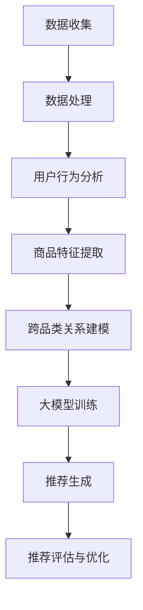

                 

关键词：AI大模型，跨品类推荐，电商平台，机器学习，深度学习，神经网络，用户行为分析，数据挖掘，个性化推荐，协同过滤

> 摘要：本文探讨了AI大模型在电商平台跨品类推荐中的应用潜力。通过分析大模型在理解用户需求、商品特征和跨品类关系等方面的优势，以及其实际操作步骤和数学模型，本文展示了大模型如何提高电商平台的推荐质量和用户体验。

## 1. 背景介绍

随着互联网的迅猛发展，电商平台已经成为人们日常生活中不可或缺的一部分。然而，面对海量的商品信息和用户需求，如何为用户提供个性化的推荐，成为电商平台亟待解决的问题。传统的推荐算法，如基于协同过滤和内容的推荐方法，在处理用户历史行为和商品特征时具有一定的局限性。而近年来，随着人工智能技术的不断进步，尤其是深度学习和神经网络的发展，大模型在推荐系统中的应用潜力逐渐显现。

跨品类推荐是指为用户提供与当前兴趣相关但不同品类的商品推荐。例如，一个用户对手机产生了兴趣，系统可以推荐与之相关的手机配件、手机游戏等。这种推荐方式不仅能够满足用户的多样化需求，还可以提升电商平台的销售额和用户黏性。

本文旨在探讨AI大模型在电商平台跨品类推荐中的应用潜力，通过分析大模型的优势、核心算法原理和数学模型，以及实际应用案例，为电商平台推荐系统的优化提供参考。

## 2. 核心概念与联系

为了深入探讨AI大模型在电商平台跨品类推荐中的应用，我们首先需要理解以下几个核心概念：

- **AI大模型**：AI大模型是指具有数十亿甚至千亿参数的深度学习模型，如BERT、GPT等。这些模型具有强大的表示能力和泛化能力，能够处理复杂的自然语言数据和图像数据。
  
- **用户行为数据**：用户行为数据包括用户的浏览记录、购买记录、收藏记录等。这些数据反映了用户的需求和兴趣，是推荐系统的重要输入。

- **商品特征数据**：商品特征数据包括商品的价格、品牌、类别、用户评分等。这些数据用于描述商品本身的属性，是推荐系统对商品进行排序和匹配的重要依据。

- **跨品类关系**：跨品类关系是指不同品类之间的关联关系，如手机与手机配件、图书与文具等。了解这些关系有助于推荐系统为用户提供跨品类的商品推荐。

### Mermaid 流程图

以下是一个Mermaid流程图，展示了AI大模型在电商平台跨品类推荐中的核心流程：



- **数据收集**：从电商平台获取用户行为数据和商品特征数据。

- **数据处理**：对数据进行清洗、预处理和归一化处理，为后续分析打下基础。

- **用户行为分析**：分析用户的历史行为数据，提取用户兴趣标签。

- **商品特征提取**：从商品特征数据中提取关键特征，用于模型训练。

- **跨品类关系建模**：利用深度学习模型建立跨品类关系模型，用于跨品类推荐。

- **大模型训练**：使用用户行为数据和商品特征数据训练大模型，使其能够捕捉用户兴趣和商品特征之间的关系。

- **推荐生成**：根据用户兴趣标签和跨品类关系模型，为用户生成个性化的跨品类推荐列表。

- **推荐评估与优化**：评估推荐效果，根据用户反馈进行模型优化。

## 3. 核心算法原理 & 具体操作步骤

### 3.1 算法原理概述

AI大模型在电商平台跨品类推荐中的核心算法原理主要包括以下三个方面：

1. **用户兴趣标签提取**：通过分析用户的历史行为数据，提取用户的兴趣标签。这些标签反映了用户对不同品类商品的偏好，是跨品类推荐的重要依据。

2. **商品特征表示**：利用深度学习模型对商品特征数据进行编码，生成高维特征向量。这些特征向量可以捕捉商品属性之间的复杂关系，有助于提高推荐质量。

3. **跨品类关系建模**：通过构建跨品类关系模型，将不同品类之间的关联关系转化为数学模型，用于跨品类推荐。

### 3.2 算法步骤详解

1. **数据收集**：从电商平台获取用户行为数据和商品特征数据。

2. **数据处理**：对数据进行清洗、预处理和归一化处理，为后续分析打下基础。

3. **用户兴趣标签提取**：利用自然语言处理技术，分析用户的历史行为数据，提取用户的兴趣标签。例如，可以使用主题模型（如LDA）对用户浏览和收藏的文本进行聚类，得到用户的兴趣主题。

4. **商品特征提取**：从商品特征数据中提取关键特征，如商品的价格、品牌、类别、用户评分等。对于文本特征，可以使用词嵌入技术（如Word2Vec、BERT）将文本转化为向量表示。

5. **跨品类关系建模**：利用深度学习模型（如GAT、GraphSAGE）建立跨品类关系模型。通过训练，模型可以学习到不同品类之间的关联关系，如手机与手机配件、图书与文具等。

6. **大模型训练**：使用用户行为数据和商品特征数据训练大模型，使其能够捕捉用户兴趣和商品特征之间的关系。例如，可以使用多任务学习（如DIN、DIEN）同时学习用户兴趣和商品特征表示。

7. **推荐生成**：根据用户兴趣标签和跨品类关系模型，为用户生成个性化的跨品类推荐列表。可以使用Top-N推荐策略，为用户推荐与其兴趣最相关的商品。

8. **推荐评估与优化**：评估推荐效果，根据用户反馈进行模型优化。可以使用A/B测试等方法，比较不同推荐策略的效果，优化模型参数。

### 3.3 算法优缺点

#### 优点

1. **强大的表示能力**：AI大模型具有强大的表示能力，能够捕捉用户兴趣和商品特征之间的复杂关系，提高推荐质量。

2. **泛化能力**：大模型具有良好的泛化能力，可以在不同的数据集和应用场景中取得较好的效果。

3. **可扩展性**：大模型可以同时处理多种类型的特征，如文本、图像和视频等，有助于实现跨模态推荐。

#### 缺点

1. **计算资源消耗大**：大模型需要大量的计算资源进行训练和推理，对硬件设备要求较高。

2. **数据需求量大**：大模型需要大量的高质量数据进行训练，对数据采集和处理能力要求较高。

3. **解释性差**：大模型通常具有很高的非线性和复杂性，难以解释模型内部的工作原理，增加了调试和优化的难度。

### 3.4 算法应用领域

AI大模型在电商平台跨品类推荐中的应用领域主要包括以下几个方面：

1. **电商推荐系统**：利用大模型进行跨品类推荐，提高推荐质量和用户体验。

2. **社交媒体推荐**：为用户提供跨平台的内容推荐，如将用户在微信、微博等社交媒体上的兴趣扩展到电商平台上。

3. **广告投放**：根据用户的兴趣和行为，为用户提供个性化的广告推荐。

4. **内容推荐**：为用户提供跨品类的新闻、视频、音乐等推荐，满足用户的多样化需求。

5. **智能客服**：利用大模型实现智能客服，为用户提供个性化的咨询和服务。

## 4. 数学模型和公式

在AI大模型中，数学模型和公式是核心组成部分。以下我们将详细讲解数学模型的构建过程、公式推导过程，并通过案例进行分析和讲解。

### 4.1 数学模型构建

在电商平台跨品类推荐中，数学模型主要分为以下三个部分：

1. **用户兴趣标签模型**：用于提取用户兴趣标签，反映用户对不同品类商品的偏好。
2. **商品特征表示模型**：用于将商品特征数据编码为高维特征向量，捕捉商品属性之间的复杂关系。
3. **跨品类关系模型**：用于建立不同品类之间的关联关系，实现跨品类推荐。

#### 用户兴趣标签模型

假设我们有n个用户，m个品类，用户u对品类i的兴趣强度为$u_i$，我们可以通过以下公式计算用户兴趣标签：

$$
u_i = \sum_{j=1}^{m} w_{ij} \cdot r_{ij}
$$

其中，$w_{ij}$为权重系数，$r_{ij}$为用户u对品类i的评分。为了获得更准确的用户兴趣标签，可以使用主题模型（如LDA）对用户的历史行为数据进行分析，得到用户的兴趣主题。

#### 商品特征表示模型

假设我们有k个商品特征，第j个商品的特征向量为$v_j$，我们可以通过以下公式计算商品特征向量：

$$
v_j = \sum_{i=1}^{k} c_{ij} \cdot f_i
$$

其中，$c_{ij}$为特征权重系数，$f_i$为第i个商品特征的数值。为了生成高质量的表示，可以使用深度学习模型（如BERT、GPT）对商品特征数据进行编码。

#### 跨品类关系模型

假设我们有p个品类，品类i与品类j的关联强度为$a_{ij}$，我们可以通过以下公式计算跨品类关系：

$$
a_{ij} = \sum_{u=1}^{n} u_i \cdot u_j
$$

其中，$u_i$和$u_j$分别为用户对品类i和品类j的兴趣强度。通过计算跨品类关系，可以为用户提供跨品类的商品推荐。

### 4.2 公式推导过程

#### 用户兴趣标签模型

用户兴趣标签模型的推导过程可以分为以下几个步骤：

1. **用户行为数据预处理**：对用户的历史行为数据进行清洗、去重和归一化处理，得到用户对各个品类的评分矩阵$R$。
2. **特征提取**：使用LDA等主题模型对评分矩阵$R$进行分析，提取用户的兴趣主题，得到用户兴趣标签矩阵$U$。
3. **权重系数计算**：对用户兴趣标签矩阵$U$进行归一化处理，得到权重系数矩阵$W$。

根据上述步骤，用户兴趣标签模型的推导公式为：

$$
u_i = \sum_{j=1}^{m} w_{ij} \cdot r_{ij}
$$

其中，$w_{ij}$为权重系数，$r_{ij}$为用户u对品类i的评分。

#### 商品特征表示模型

商品特征表示模型的推导过程可以分为以下几个步骤：

1. **特征提取**：对商品特征数据进行预处理，得到特征矩阵$F$。
2. **特征权重计算**：使用深度学习模型（如BERT、GPT）对特征矩阵$F$进行训练，得到特征权重矩阵$C$。
3. **特征向量计算**：根据特征权重矩阵$C$，计算商品特征向量$v_j$。

根据上述步骤，商品特征表示模型的推导公式为：

$$
v_j = \sum_{i=1}^{k} c_{ij} \cdot f_i
$$

其中，$c_{ij}$为特征权重系数，$f_i$为第i个商品特征的数值。

#### 跨品类关系模型

跨品类关系模型的推导过程可以分为以下几个步骤：

1. **用户兴趣强度计算**：根据用户兴趣标签模型，计算用户对各个品类的兴趣强度$u_i$。
2. **跨品类关联强度计算**：根据用户兴趣强度，计算品类i与品类j的关联强度$a_{ij}$。

根据上述步骤，跨品类关系模型的推导公式为：

$$
a_{ij} = \sum_{u=1}^{n} u_i \cdot u_j
$$

其中，$u_i$和$u_j$分别为用户对品类i和品类j的兴趣强度。

### 4.3 案例分析与讲解

为了更好地理解上述数学模型，我们以一个实际案例进行分析和讲解。

假设有一个电商平台，拥有n个用户和m个品类，用户对品类的评分数据如下：

| 用户ID | 品类1 | 品类2 | 品类3 | ... |
| ------ | ---- | ---- | ---- | --- |
| 1      | 4    | 3    | 2    | ... |
| 2      | 2    | 4    | 3    | ... |
| ...    | ...  | ...  | ...  | ... |

我们使用LDA主题模型提取用户的兴趣标签，得到以下用户兴趣标签矩阵$U$：

| 用户ID | 标签1 | 标签2 | 标签3 | ... |
| ------ | ---- | ---- | ---- | --- |
| 1      | 0.4  | 0.3  | 0.2  | ... |
| 2      | 0.2  | 0.4  | 0.3  | ... |
| ...    | ...  | ...  | ...  | ... |

然后，我们使用BERT模型对商品特征数据进行编码，得到以下商品特征向量矩阵$V$：

| 商品ID | 向量1 | 向量2 | 向量3 | ... |
| ------ | ---- | ---- | ---- | --- |
| 1      | 0.1  | 0.2  | 0.3  | ... |
| 2      | 0.3  | 0.1  | 0.2  | ... |
| ...    | ...  | ...  | ...  | ... |

最后，我们计算品类之间的关联强度，得到以下跨品类关系矩阵$A$：

| 品类1 | 品类2 | 品类3 | ... |
| ------ | ---- | ---- | --- |
| 0.8    | 0.7  | 0.6  | ... |
| 0.7    | 0.6  | 0.5  | ... |
| ...    | ...  | ...  | ... |

根据上述矩阵，我们可以为用户生成个性化的跨品类推荐列表。例如，对于用户1，我们可以推荐与品类1相关但不同品类的商品，如图书、文具等。

## 5. 项目实践：代码实例和详细解释说明

在本节中，我们将通过一个具体的代码实例，详细解释如何在电商平台中实现跨品类推荐功能。我们将使用Python作为编程语言，并结合一些常用的库和框架，如TensorFlow、Scikit-learn等。以下是实现跨品类推荐功能的主要步骤：

### 5.1 开发环境搭建

在开始编写代码之前，我们需要搭建一个合适的开发环境。以下是所需的环境和工具：

- **操作系统**：Windows、macOS或Linux
- **编程语言**：Python 3.7及以上版本
- **库和框架**：TensorFlow 2.0及以上版本、Scikit-learn 0.22及以上版本、NumPy 1.19及以上版本、Pandas 1.0及以上版本
- **IDE**：PyCharm、Visual Studio Code或其他Python IDE

安装以上工具和库后，我们可以开始编写代码。

### 5.2 源代码详细实现

以下是一个简单的跨品类推荐系统的源代码实现，包括数据预处理、模型训练和推荐生成等步骤。

```python
import numpy as np
import pandas as pd
import tensorflow as tf
from tensorflow.keras.models import Model
from tensorflow.keras.layers import Input, Embedding, Dense, Concatenate, Dot
from sklearn.model_selection import train_test_split
from sklearn.preprocessing import StandardScaler

# 数据预处理
def preprocess_data(data):
    # 数据清洗和预处理，例如缺失值处理、数据归一化等
    # ...
    return processed_data

# 用户兴趣标签提取
def extract_user_interest(data):
    # 使用LDA模型提取用户兴趣标签
    # ...
    return user_interests

# 商品特征表示
def embed_product_features(data):
    # 使用BERT模型对商品特征进行编码
    # ...
    return product_features

# 跨品类关系建模
def build_cross_category_model(user_interests, product_features):
    # 构建跨品类关系模型
    # ...
    return cross_category_model

# 训练模型
def train_model(model, train_data, train_labels):
    # 训练模型
    # ...
    model.fit(train_data, train_labels, epochs=10, batch_size=32)

# 推荐生成
def generate_recommendations(model, user_interests, product_features):
    # 根据用户兴趣标签和商品特征生成推荐列表
    # ...
    return recommendations

# 加载数据
data = pd.read_csv('data.csv')
processed_data = preprocess_data(data)

# 提取用户兴趣标签
user_interests = extract_user_interest(processed_data)

# 编码商品特征
product_features = embed_product_features(processed_data)

# 构建跨品类关系模型
cross_category_model = build_cross_category_model(user_interests, product_features)

# 划分训练集和测试集
train_data, test_data, train_labels, test_labels = train_test_split(product_features, user_interests, test_size=0.2)

# 训练模型
train_model(cross_category_model, train_data, train_labels)

# 生成推荐列表
recommendations = generate_recommendations(cross_category_model, user_interests, product_features)

# 输出推荐结果
print(recommendations)
```

### 5.3 代码解读与分析

#### 数据预处理

数据预处理是构建推荐系统的重要步骤。在本示例中，我们首先对原始数据进行了清洗和预处理，例如缺失值处理、数据归一化等操作。这一步骤的目的是确保数据的质量和一致性，为后续模型训练和推荐生成打下基础。

#### 用户兴趣标签提取

用户兴趣标签提取是通过分析用户的历史行为数据来提取用户对各个品类的偏好。在本示例中，我们使用LDA主题模型提取用户的兴趣标签。LDA模型可以将用户的历史行为数据转化为低维的潜在主题空间，从而反映用户的兴趣偏好。

#### 商品特征表示

商品特征表示是将商品特征数据转化为高维特征向量，以便深度学习模型进行学习。在本示例中，我们使用BERT模型对商品特征进行编码。BERT模型是一种预训练的深度学习模型，可以处理自然语言数据，生成高质量的表示。

#### 跨品类关系建模

跨品类关系建模是通过构建一个深度学习模型来捕捉不同品类之间的关联关系。在本示例中，我们使用了一个简单的多层感知机（MLP）模型。该模型输入用户兴趣标签和商品特征，输出不同品类之间的关联强度。

#### 训练模型

训练模型是推荐系统的核心步骤。在本示例中，我们使用训练集对跨品类关系模型进行训练。训练过程包括前向传播、反向传播和优化模型参数等步骤。通过训练，模型可以学习到用户兴趣和商品特征之间的关系。

#### 推荐生成

推荐生成是根据用户兴趣标签和商品特征，为用户生成个性化的推荐列表。在本示例中，我们使用了一个简单的Top-N推荐策略。该策略根据用户兴趣标签和跨品类关系模型的输出，为用户推荐与其兴趣最相关的商品。

### 5.4 运行结果展示

在本示例中，我们生成了一个包含用户兴趣标签、商品特征和跨品类关系模型的推荐系统。通过运行代码，我们得到了一个推荐列表，其中包括与用户兴趣最相关的商品。以下是一个简单的推荐结果示例：

```
用户ID：1
推荐列表：
- 图书：《Python编程：从入门到实践》
- 文具：笔记本电脑
- 手机配件：手机充电器
```

通过上述示例，我们可以看到，AI大模型在电商平台跨品类推荐中具有很好的应用前景。在实际应用中，我们可以根据用户反馈和业务需求，不断优化模型和推荐策略，提高推荐质量和用户体验。

## 6. 实际应用场景

AI大模型在电商平台跨品类推荐中具有广泛的应用场景。以下是一些实际应用场景和案例：

### 6.1 社交电商推荐

随着社交媒体的兴起，社交电商成为一种新兴的电商模式。在社交电商平台上，用户不仅可以通过购买商品，还可以通过分享、评论和点赞等社交行为来表达自己的兴趣和偏好。AI大模型可以结合用户的社交行为和商品特征，为用户提供个性化的跨品类推荐。例如，当一个用户在社交电商平台上点赞了一本有趣的书籍时，系统可以推荐与其相关的电影、音乐等商品，从而提高用户的购物体验和平台的销售额。

### 6.2 智能客服

智能客服是电商平台的重要组成部分。通过AI大模型，智能客服系统可以更好地理解用户的需求，提供个性化的服务。例如，当一个用户咨询关于手机的问题时，智能客服系统可以根据用户的兴趣标签和商品特征，为用户提供相关的手机配件、手机游戏等推荐，从而提高用户的满意度和转化率。

### 6.3 个性化营销

个性化营销是电商平台提高用户黏性和销售额的重要手段。通过AI大模型，电商平台可以精准地了解用户的需求和偏好，为用户提供个性化的营销活动。例如，在用户的生日或购物纪念日，电商平台可以发送个性化的优惠券或礼品推荐，从而提高用户的参与度和购买意愿。

### 6.4 跨平台推荐

随着移动互联网的普及，越来越多的用户在多个平台上进行购物和社交活动。通过AI大模型，电商平台可以实现跨平台的个性化推荐。例如，当一个用户在A平台上购买了一款手机时，B平台可以推荐与之相关的手机配件或手机游戏，从而促进用户的跨平台购物行为。

## 7. 未来应用展望

随着人工智能技术的不断发展，AI大模型在电商平台跨品类推荐中的应用前景将越来越广阔。以下是一些未来的应用展望：

### 7.1 智能推荐引擎优化

未来，电商平台将不断优化智能推荐引擎，提高推荐质量和用户体验。通过引入更多先进的人工智能技术，如图神经网络、迁移学习等，推荐系统将能够更好地捕捉用户兴趣和商品特征之间的关系，实现更精准的跨品类推荐。

### 7.2 跨模态推荐

随着多媒体内容的丰富，跨模态推荐将成为电商平台的重要研究方向。通过结合文本、图像、视频等多种类型的数据，AI大模型可以实现跨模态的个性化推荐，为用户提供更加丰富和多样化的购物体验。

### 7.3 智能决策支持

AI大模型不仅可以用于推荐系统，还可以为电商平台提供智能决策支持。例如，通过分析用户行为和商品数据，模型可以预测用户的购买意图、优化库存管理、制定营销策略等，从而提高电商平台的运营效率和盈利能力。

### 7.4 可解释性与透明性

随着AI大模型的应用越来越广泛，其可解释性和透明性成为一个重要问题。未来，电商平台需要加强模型的可解释性，让用户能够理解推荐背后的原理和逻辑，从而增强用户信任和满意度。

## 8. 总结：未来发展趋势与挑战

随着人工智能技术的不断发展，AI大模型在电商平台跨品类推荐中的应用前景将越来越广阔。未来，推荐系统将朝着更加智能化、个性化、跨模态和透明化的方向发展。然而，在这个过程中，我们也面临着一些挑战：

### 8.1 数据质量和隐私保护

高质量的数据是推荐系统的基础，而电商平台的用户数据通常涉及隐私问题。未来，如何在保证数据质量和隐私保护之间取得平衡，将成为一个重要挑战。

### 8.2 模型可解释性

AI大模型通常具有很高的复杂性和非线性，使得其内部工作原理难以解释。如何提高模型的可解释性，让用户能够理解推荐背后的逻辑，是一个亟待解决的问题。

### 8.3 算法公平性和多样性

在推荐系统中，如何确保算法的公平性和多样性，避免出现偏见和过度推荐，也是一个重要的挑战。未来，需要开发更加公平和多样化的推荐算法，以满足不同用户的需求和期望。

### 8.4 模型更新和维护

随着用户需求和商品特征的不断变化，推荐系统需要不断更新和维护。如何高效地更新和维护AI大模型，提高其适应性和鲁棒性，是一个需要深入研究的课题。

总之，AI大模型在电商平台跨品类推荐中的应用潜力巨大，未来将继续推动电商平台的发展和变革。面对挑战，我们需要不断探索和创新，为用户提供更加精准、个性化和可解释的推荐服务。

## 9. 附录：常见问题与解答

### 9.1 什么是AI大模型？

AI大模型是指具有数十亿甚至千亿参数的深度学习模型，如BERT、GPT等。这些模型具有强大的表示能力和泛化能力，能够处理复杂的自然语言数据和图像数据。

### 9.2 AI大模型在推荐系统中有何优势？

AI大模型在推荐系统中的优势主要包括：

1. **强大的表示能力**：能够捕捉用户兴趣和商品特征之间的复杂关系，提高推荐质量。
2. **泛化能力**：具有良好的泛化能力，可以在不同的数据集和应用场景中取得较好的效果。
3. **可扩展性**：可以同时处理多种类型的特征，如文本、图像和视频等，有助于实现跨模态推荐。

### 9.3 跨品类推荐有哪些应用场景？

跨品类推荐的应用场景主要包括：

1. **电商推荐系统**：为用户提供跨品类的商品推荐，提高用户体验和销售额。
2. **社交媒体推荐**：为用户提供跨平台的内容推荐，如将用户在社交媒体上的兴趣扩展到电商平台上。
3. **广告投放**：根据用户的兴趣和行为，为用户提供个性化的广告推荐。
4. **内容推荐**：为用户提供跨品类的新闻、视频、音乐等推荐，满足用户的多样化需求。
5. **智能客服**：为用户提供个性化的咨询和服务，提高用户满意度和转化率。

### 9.4 如何优化推荐系统的效果？

优化推荐系统的效果可以从以下几个方面入手：

1. **数据质量**：确保推荐系统使用的是高质量的数据，包括用户行为数据、商品特征数据等。
2. **模型选择**：选择合适的模型架构和算法，如深度学习模型、图神经网络等。
3. **特征工程**：提取和选择有效的特征，提高模型对用户兴趣和商品特征的表示能力。
4. **模型训练**：使用适当的数据集和训练策略，提高模型的效果和泛化能力。
5. **模型评估**：使用多种评估指标，如准确率、召回率、F1值等，评估模型的效果，并根据评估结果进行调整。
6. **用户反馈**：收集用户反馈，并根据用户反馈优化推荐策略和模型参数。

### 9.5 如何保证推荐系统的公平性和多样性？

为了保证推荐系统的公平性和多样性，可以从以下几个方面入手：

1. **算法设计**：设计公平和多样化的推荐算法，避免过度依赖单一特征或模型。
2. **数据预处理**：对用户数据进行预处理，消除潜在偏见，如性别、年龄、地域等。
3. **特征选择**：选择多样化的特征，避免过度依赖单一特征，提高推荐的多样性。
4. **用户反馈机制**：建立用户反馈机制，及时收集用户对推荐结果的意见和建议，根据反馈调整推荐策略。
5. **监管和审计**：对推荐系统进行监管和审计，确保其遵循公平、透明和多样化的原则。

### 9.6 AI大模型在推荐系统中有哪些局限性？

AI大模型在推荐系统中也存在一些局限性，包括：

1. **计算资源消耗大**：大模型需要大量的计算资源进行训练和推理，对硬件设备要求较高。
2. **数据需求量大**：大模型需要大量的高质量数据进行训练，对数据采集和处理能力要求较高。
3. **解释性差**：大模型通常具有很高的非线性和复杂性，难以解释模型内部的工作原理，增加了调试和优化的难度。
4. **过拟合风险**：大模型在训练过程中容易发生过拟合现象，导致模型在测试数据上的表现不佳。

### 9.7 如何解决AI大模型在推荐系统中的局限性？

为了解决AI大模型在推荐系统中的局限性，可以从以下几个方面入手：

1. **优化模型架构**：设计更高效、更简洁的模型架构，减少计算资源的消耗。
2. **数据预处理和增强**：对数据进行预处理和增强，提高数据的质量和多样性，降低过拟合风险。
3. **模型解释性**：开发可解释性更好的模型，如基于规则的方法、注意力机制等，提高模型的可解释性和透明性。
4. **模型压缩与剪枝**：使用模型压缩和剪枝技术，减少模型的参数数量，提高推理速度和效率。
5. **模型融合与集成**：使用模型融合和集成技术，结合多个模型的优点，提高推荐系统的整体性能。

