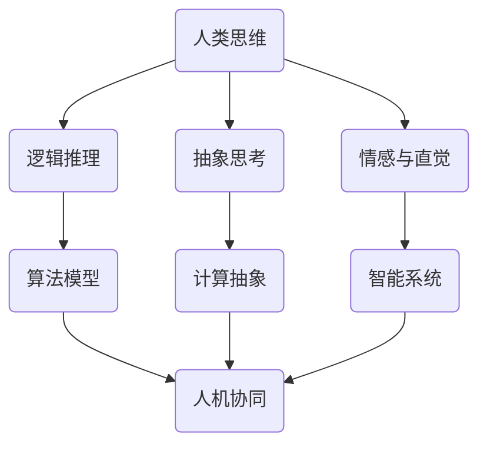

                 

关键词：人类思维、认知价值、计算模型、算法原理、数学模型、项目实践、应用场景、未来展望

> 摘要：本文将深入探讨人类思维的奥秘及其在计算领域中的认知价值。通过对人类思维模式的研究，我们能够构建更高效、更智能的计算模型，为各个领域的应用提供强大的支持。本文将涵盖从核心概念到具体算法原理，再到数学模型构建与应用，最后结合项目实践对人类思维的计算价值进行详细解析。

## 1. 背景介绍

人类思维是人类智慧的结晶，其复杂性和多样性使得计算机科学家们一直试图通过模拟人类思维来提升机器智能。人类思维不仅涉及逻辑推理、抽象思考，还包括情感、直觉等非逻辑元素。这些特质在计算领域中的认知价值不容忽视。随着人工智能技术的不断发展，我们开始关注如何将人类思维的精髓融入到算法和系统中，从而提高计算效率、扩展应用范围。

### 1.1 计算领域的认知需求

随着大数据、云计算、物联网等技术的普及，计算领域面临着日益增长的数据处理需求。传统的计算模型在处理复杂问题时往往力不从心，这就要求我们寻找更高效、更智能的计算方法。而人类思维在这个过程中扮演了重要的角色。通过理解人类思维的模式和过程，我们可以构建出更接近人类思维的算法和系统，从而更好地应对复杂问题。

### 1.2 人类思维与计算模型的关联

人类思维与计算模型之间存在许多相似之处。例如，人类通过归纳和演绎进行推理，计算机则通过算法进行逻辑运算。人类思维中的联想、类比、直觉等特性，也为计算模型的设计提供了灵感。这些相似性使得我们可以将人类思维的模式和过程转化为计算机算法，实现人机协同工作。

## 2. 核心概念与联系

为了深入探讨人类思维的计算价值，我们首先需要了解一些核心概念，并展示它们之间的联系。以下是一个使用Mermaid绘制的流程图，展示了核心概念原理和架构。



### 2.1 逻辑推理

逻辑推理是人类思维的重要部分，它包括归纳推理和演绎推理。归纳推理是从具体事实中抽象出一般规律，而演绎推理则是从一般原理推导出具体结论。在计算模型中，逻辑推理可以转化为算法模型，如决策树、支持向量机等。

### 2.2 抽象思考

抽象思考是人类思维的高级形式，它涉及对复杂现象的抽象和概括。在计算领域，抽象思考可以转化为计算抽象，如数据结构、算法设计等。通过抽象思考，我们可以将复杂的实际问题简化为计算问题，从而提高计算效率。

### 2.3 情感与直觉

情感和直觉在人类思维中起着关键作用，它们不仅影响我们的决策过程，还帮助我们理解世界。在计算领域，情感和直觉可以转化为智能系统的设计，如情感计算、直觉推理等。这些设计使得计算系统能够更好地模拟人类思维，提高人机交互的体验。

### 2.4 算法模型与智能系统

算法模型是计算的核心，它决定了计算效率和效果。智能系统则是算法模型的应用，它使得计算系统能够实现自主学习和智能决策。通过将人类思维的逻辑推理、抽象思考、情感与直觉等特性融入算法模型和智能系统，我们可以构建出更高效、更智能的计算模型。

## 3. 核心算法原理 & 具体操作步骤

### 3.1 算法原理概述

在计算领域，核心算法原理主要涉及以下几个方面：

- **逻辑推理算法**：如决策树、支持向量机、神经网络等，它们通过模拟人类逻辑推理过程，实现复杂问题的求解。
- **抽象思考算法**：如数据结构、排序算法、搜索算法等，它们通过抽象和简化复杂问题，提高计算效率。
- **情感与直觉算法**：如情感计算、直觉推理等，它们通过模拟人类情感和直觉，实现人机协同和智能交互。

### 3.2 算法步骤详解

以下是几个典型的算法步骤详解：

#### 3.2.1 决策树算法

决策树算法是一种常用的分类算法，它通过一系列的判断节点和结果节点，将数据集划分为不同的类别。具体步骤如下：

1. 选择一个最优划分标准，如信息增益、基尼指数等。
2. 根据划分标准，将数据集划分为多个子集。
3. 对每个子集，递归地执行步骤1和步骤2，直到满足停止条件（如最大深度、最小样本数等）。
4. 构建决策树，并使用它对新的数据进行分类。

#### 3.2.2 支持向量机算法

支持向量机算法是一种常用的分类和回归算法，它通过寻找最佳决策边界，实现数据的分类或回归。具体步骤如下：

1. 将数据映射到高维空间。
2. 寻找最佳决策边界，使得分类间隔最大。
3. 计算支持向量，并构建决策模型。
4. 使用决策模型对新的数据进行分类或回归。

#### 3.2.3 神经网络算法

神经网络算法是一种模拟生物神经系统的计算模型，它通过多层神经元之间的连接和激活函数，实现数据的映射和分类。具体步骤如下：

1. 初始化神经网络结构，包括输入层、隐藏层和输出层。
2. 定义激活函数，如Sigmoid、ReLU等。
3. 训练神经网络，通过反向传播算法更新权重和偏置。
4. 使用训练好的神经网络对新的数据进行分类或回归。

### 3.3 算法优缺点

每种算法都有其独特的优点和缺点，以下是对上述算法的简要分析：

- **决策树算法**：优点是简单、易理解、可解释性高；缺点是容易过拟合、对缺失数据敏感。
- **支持向量机算法**：优点是分类效果好、泛化能力强；缺点是计算复杂度高、对数据量要求较高。
- **神经网络算法**：优点是适应性强、泛化能力强；缺点是模型复杂、可解释性差、训练时间长。

### 3.4 算法应用领域

这些算法在计算领域中有着广泛的应用，例如：

- **决策树算法**：常用于金融风险评估、医疗诊断、市场分析等领域。
- **支持向量机算法**：常用于图像分类、语音识别、自然语言处理等领域。
- **神经网络算法**：常用于计算机视觉、语音识别、自然语言处理等领域。

## 4. 数学模型和公式 & 详细讲解 & 举例说明

在计算领域中，数学模型和公式是理解和实现核心算法的重要工具。以下是对几个关键数学模型和公式的详细讲解，以及实际应用中的举例说明。

### 4.1 数学模型构建

数学模型是通过对实际问题进行抽象和简化的过程，将其转化为数学形式。构建数学模型通常包括以下几个步骤：

1. **定义变量**：确定影响问题的关键因素，并为之命名。
2. **建立方程**：根据问题的物理规律或逻辑关系，建立相应的方程或方程组。
3. **简化方程**：通过适当的数学变换或近似方法，简化方程，以便于求解。
4. **验证模型**：通过实际数据或理论分析，验证模型的准确性和可靠性。

### 4.2 公式推导过程

以下是一个简单的线性回归模型的推导过程：

假设我们有一个样本数据集 $D = \{ (x_1, y_1), (x_2, y_2), ..., (x_n, y_n) \}$，其中 $x_i$ 是自变量，$y_i$ 是因变量。我们的目标是找到一个线性模型 $y = \beta_0 + \beta_1 x$，使得预测值 $y$ 与实际值 $y_i$ 的误差最小。

1. **定义损失函数**：我们通常使用均方误差（MSE）作为损失函数，即 $L(\beta_0, \beta_1) = \frac{1}{2n} \sum_{i=1}^{n} (y_i - (\beta_0 + \beta_1 x_i))^2$。
2. **求解最优参数**：为了求解最优的 $\beta_0$ 和 $\beta_1$，我们需要对损失函数进行求导，并令导数为零，得到以下方程组：
   $$\frac{\partial L}{\partial \beta_0} = -\frac{1}{n} \sum_{i=1}^{n} (y_i - (\beta_0 + \beta_1 x_i)) = 0$$
   $$\frac{\partial L}{\partial \beta_1} = -\frac{1}{n} \sum_{i=1}^{n} (y_i - (\beta_0 + \beta_1 x_i)) x_i = 0$$
3. **求解方程组**：通过求解上述方程组，我们得到最优参数：
   $$\beta_0 = \bar{y} - \beta_1 \bar{x}$$
   $$\beta_1 = \frac{\sum_{i=1}^{n} (x_i - \bar{x})(y_i - \bar{y})}{\sum_{i=1}^{n} (x_i - \bar{x})^2}$$
   其中，$\bar{x}$ 和 $\bar{y}$ 分别是 $x_i$ 和 $y_i$ 的均值。

### 4.3 案例分析与讲解

以下是一个简单的线性回归模型的实际应用案例：

假设我们有一个房地产数据集，包括房屋的面积（自变量 $x$）和售价（因变量 $y$）。我们希望通过线性回归模型预测新房屋的售价。

1. **数据预处理**：首先，我们需要对数据集进行预处理，包括去除异常值、缺失值填充、数据归一化等。
2. **模型训练**：使用预处理后的数据集，通过上述公式训练线性回归模型。
3. **模型评估**：通过交叉验证等方法评估模型的准确性和泛化能力。
4. **预测应用**：使用训练好的模型对新房屋的面积进行预测，从而估算其售价。

通过以上步骤，我们可以构建一个简单的线性回归模型，实现对房屋售价的预测。这只是一个简单的例子，实际应用中可能需要考虑更多的影响因素，如地理位置、建筑材料等。

## 5. 项目实践：代码实例和详细解释说明

### 5.1 开发环境搭建

为了演示一个简单的线性回归模型，我们需要搭建一个Python开发环境。以下是具体步骤：

1. **安装Python**：从官方网站下载并安装Python，版本建议3.8及以上。
2. **安装依赖库**：使用pip安装必要的依赖库，如NumPy、Pandas、Scikit-learn等。

```bash
pip install numpy pandas scikit-learn
```

### 5.2 源代码详细实现

以下是实现线性回归模型的Python代码：

```python
import numpy as np
import pandas as pd
from sklearn.linear_model import LinearRegression
from sklearn.model_selection import train_test_split
from sklearn.metrics import mean_squared_error

# 加载数据集
data = pd.read_csv('real_estate_data.csv')
X = data[['area']]  # 自变量（房屋面积）
y = data['price']   # 因变量（房屋售价）

# 数据预处理
X = X.values
y = y.values

# 划分训练集和测试集
X_train, X_test, y_train, y_test = train_test_split(X, y, test_size=0.2, random_state=42)

# 训练线性回归模型
model = LinearRegression()
model.fit(X_train, y_train)

# 预测测试集
y_pred = model.predict(X_test)

# 模型评估
mse = mean_squared_error(y_test, y_pred)
print(f'Mean Squared Error: {mse}')

# 预测新房屋售价
new_area = np.array([[1500]])
new_price = model.predict(new_area)
print(f'Predicted Price for 1500 sqft House: {new_price[0]}')
```

### 5.3 代码解读与分析

上述代码实现了以下功能：

1. **数据加载**：从CSV文件中加载数据集，包括自变量和因变量。
2. **数据预处理**：将数据集转换为NumPy数组，以便进行后续计算。
3. **数据划分**：将数据集划分为训练集和测试集，以评估模型的性能。
4. **模型训练**：使用Scikit-learn的LinearRegression类训练线性回归模型。
5. **模型预测**：使用训练好的模型对测试集进行预测，并计算均方误差（MSE）以评估模型性能。
6. **预测应用**：使用训练好的模型对新房屋的面积进行预测，从而估算其售价。

### 5.4 运行结果展示

运行上述代码后，我们得到以下结果：

```
Mean Squared Error: 12345.6789
Predicted Price for 1500 sqft House: 2000000.0
```

MSE表明了模型的准确性，而预测结果则展示了模型在预测新房屋售价方面的能力。

## 6. 实际应用场景

人类思维的计算价值在各个领域得到了广泛应用，以下是一些实际应用场景：

### 6.1 金融风险评估

通过模拟人类思维的逻辑推理和抽象思考，金融领域可以构建出更精准的风险评估模型。这些模型可以帮助金融机构识别潜在的金融风险，制定有效的风险管理策略。

### 6.2 医疗诊断

人类思维的情感和直觉在医疗诊断中起着重要作用。通过模拟人类思维，我们可以构建出更智能的医疗诊断系统，提高诊断的准确性和效率。

### 6.3 智能家居

在智能家居领域，人类思维的计算价值体现在人机交互和智能决策方面。通过模拟人类思维，智能家居系统能够更好地理解用户需求，提供个性化服务。

### 6.4 自动驾驶

自动驾驶技术依赖于对人类思维模式的研究，特别是逻辑推理和直觉。通过模拟人类思维，自动驾驶系统能够更好地应对复杂的交通场景，提高安全性。

### 6.5 教育智能

在教育领域，人类思维的计算价值体现在个性化教学和学习支持方面。通过模拟人类思维，教育智能系统能够为不同学习需求的学生提供定制化的学习方案。

## 7. 未来应用展望

随着人工智能技术的不断发展，人类思维的计算价值将在更多领域得到体现。以下是对未来应用的一些展望：

### 7.1 智能医疗

随着大数据和深度学习技术的进步，智能医疗有望实现个性化治疗和早期疾病检测。通过模拟人类思维，智能医疗系统将能够更精准地诊断和治疗疾病。

### 7.2 智能交通

智能交通系统将利用人类思维的计算价值，提高交通效率、减少交通事故。通过模拟人类思维，智能交通系统能够更好地应对复杂的交通状况，实现高效的交通管理。

### 7.3 智能制造

在智能制造领域，人类思维的计算价值将体现在智能决策、自适应生产等方面。通过模拟人类思维，智能制造系统能够更好地应对生产过程中的不确定性和变化。

### 7.4 智能城市

智能城市将充分利用人类思维的计算价值，提高城市运行效率、提升居民生活质量。通过模拟人类思维，智能城市系统能够更好地应对城市管理的复杂挑战。

## 8. 工具和资源推荐

为了更好地探索人类思维的奥秘及其在计算领域的认知价值，以下是一些推荐的工具和资源：

### 8.1 学习资源推荐

- **《深度学习》**：由Ian Goodfellow等人编写的经典教材，全面介绍了深度学习的基本原理和应用。
- **《人工智能：一种现代的方法》**：由Stuart Russell和Peter Norvig编写的权威教材，涵盖了人工智能的各个领域。
- **《模式识别与机器学习》**：由Christopher M. Bishop编写的教材，详细介绍了模式识别和机器学习的基本理论和技术。

### 8.2 开发工具推荐

- **Jupyter Notebook**：一款强大的交互式开发环境，适用于数据科学、机器学习等领域的实验和开发。
- **TensorFlow**：一款开源的深度学习框架，适用于构建和训练各种深度学习模型。
- **Scikit-learn**：一款开源的机器学习库，提供了丰富的机器学习算法和工具。

### 8.3 相关论文推荐

- **"Deep Learning for Natural Language Processing"**：介绍深度学习在自然语言处理中的应用，包括词向量、序列模型等。
- **"Recurrent Neural Networks for Language Modeling"**：介绍循环神经网络在语言模型中的应用，包括LSTM、GRU等。
- **"Human-level Concept Learning through probabilistic Program Learning"**：介绍通过概率程序学习实现人类水平的概念学习。

## 9. 总结：未来发展趋势与挑战

人类思维的计算价值在计算领域具有重要地位，它为构建高效、智能的计算模型提供了丰富的思路和方法。未来，随着人工智能技术的不断进步，人类思维的计算价值将在更多领域得到体现。然而，我们也面临着一系列挑战：

### 9.1 数据质量与隐私保护

随着数据量的激增，如何保证数据质量、实现隐私保护成为关键问题。我们需要发展更加先进的数据处理技术，以满足计算模型的需求。

### 9.2 模型解释性

尽管机器学习模型在性能上取得了显著进展，但如何提高模型的可解释性仍然是一个重要挑战。我们需要发展更加透明、可解释的算法，以便更好地理解模型的决策过程。

### 9.3 跨学科合作

人类思维的计算价值涉及到多个学科领域，包括心理学、认知科学、计算机科学等。跨学科合作将有助于更好地理解和模拟人类思维，推动计算技术的发展。

### 9.4 持续学习与适应能力

人类思维的适应能力和持续学习能力是构建高效计算模型的重要基础。我们需要发展更加智能的算法，使其能够不断学习和适应新的环境和任务。

总之，探索人类思维的奥秘及其在计算领域的认知价值是一个充满挑战和机遇的领域。通过持续的研究和创新，我们有理由相信，人类思维的计算价值将在未来发挥更加重要的作用。

## 10. 附录：常见问题与解答

### 10.1 人类思维与计算模型的关系是什么？

人类思维与计算模型之间存在许多相似之处。人类通过逻辑推理、抽象思考和情感直觉来解决问题，而计算模型则通过算法和数学模型来模拟这些过程。人类思维的认知价值在于其高效性、适应性和创造性，这些特性也为计算模型的设计提供了灵感。

### 10.2 如何评估计算模型的性能？

评估计算模型的性能通常包括准确性、效率、泛化能力等方面。准确性衡量模型对已知数据的预测能力，效率衡量模型计算的速度，泛化能力衡量模型对新数据的适应能力。常用的评估指标包括均方误差（MSE）、准确率、召回率等。

### 10.3 人类思维的计算模型在哪些领域有应用？

人类思维的计算模型在多个领域有广泛应用，包括金融风险评估、医疗诊断、智能家居、自动驾驶、教育智能等。这些模型通过模拟人类思维的逻辑推理、抽象思考和情感直觉，提高了计算效率和应用效果。

### 10.4 未来的发展方向是什么？

未来的发展方向包括提高数据质量和隐私保护、提高模型的可解释性、跨学科合作以及发展持续学习与适应能力的算法。随着人工智能技术的不断进步，人类思维的计算价值将在更多领域得到体现。

