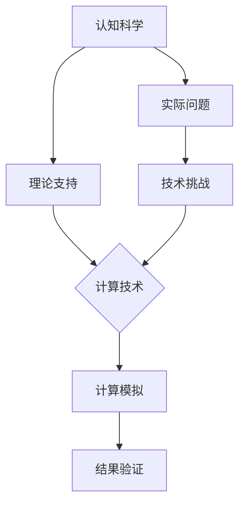
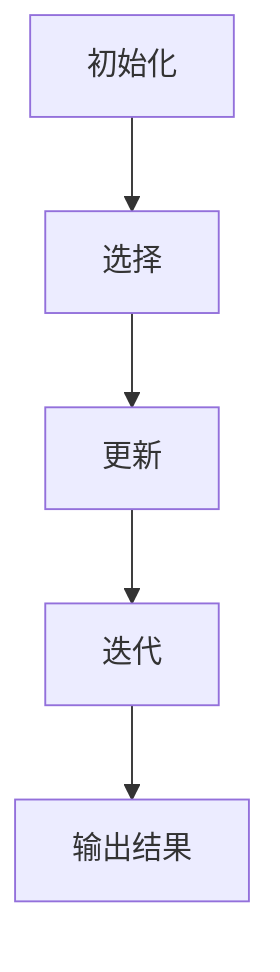
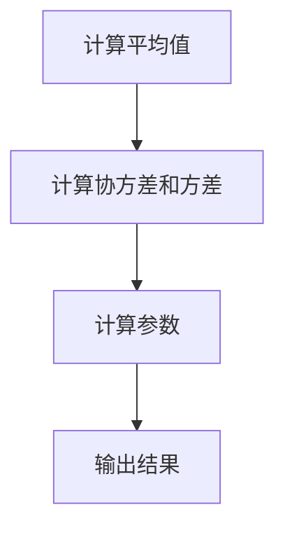
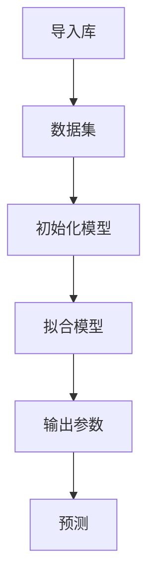

                 

关键词：认知科学、人类计算、算法、科学方法论、认知边界

> 摘要：本文旨在探讨人类认知的边界及其与人类计算之间的相互作用。通过分析人类认知的本质和局限性，揭示人类计算在扩展认知能力、推动科学技术进步方面的关键作用。文章首先回顾了人类计算的历史背景，随后深入探讨了核心概念与理论，分析了当前人类计算的技术发展现状，最后展望了未来人类计算的应用前景，提出了潜在的研究挑战。

## 1. 背景介绍

人类自诞生以来，便在不断探索外部世界的奥秘。随着科学技术的发展，人类不仅对自然界有了更深入的认识，同时也开始反思自身认知能力的局限性。认知科学作为一门跨学科的研究领域，旨在理解人类思维、感知、记忆和学习等认知过程的本质。而人类计算，作为人类智慧和技术的结晶，不仅提高了我们的信息处理能力，还为我们开辟了新的认知路径。

人类计算的历史可以追溯到古代，例如使用算盘和机械计算机进行数学运算。然而，现代人类计算的核心始于计算机科学的诞生，从冯·诺依曼架构的提出，到人工智能、大数据和云计算等技术的飞速发展，人类计算不断突破自身的界限，推动着我们迈向新的认知高度。

本文将从以下几个方面展开讨论：

1. **核心概念与联系**：探讨人类认知的核心概念及其与计算技术的相互关系。
2. **核心算法原理 & 具体操作步骤**：分析几种重要的算法原理及其应用。
3. **数学模型和公式 & 详细讲解 & 举例说明**：介绍数学模型在认知科学中的应用。
4. **项目实践：代码实例和详细解释说明**：通过实际项目展示计算技术在解决实际问题中的应用。
5. **实际应用场景**：讨论人类计算在各个领域的应用前景。
6. **未来应用展望**：预测未来人类计算的发展趋势和潜在挑战。
7. **工具和资源推荐**：推荐学习资源和开发工具。
8. **总结：未来发展趋势与挑战**：总结研究成果，展望未来。

<|assistant|>## 2. 核心概念与联系

### 2.1 认知科学与计算技术的关系

认知科学是一门多学科交叉的研究领域，涉及心理学、神经科学、哲学、计算机科学等多个领域。它的核心目标是理解人类认知的机制和过程。而计算技术作为现代科学的重要工具，为认知科学研究提供了强大的支持。

认知科学中的许多核心概念，如感知、记忆、注意、思维和语言等，都与计算技术有着紧密的联系。例如，感知过程可以类比为信号处理，记忆机制可以模拟为数据库管理，思维过程可以建模为计算算法等。通过计算技术，我们可以更精确地模拟和验证认知科学的理论，从而推动这一领域的发展。

### 2.2 人类计算的定义与范围

人类计算是指人类利用工具和技术进行信息处理和知识建构的过程。它不仅包括传统的数学和科学计算，还涵盖了人工智能、大数据、云计算等新兴领域。人类计算的核心目标是通过优化信息处理流程，提高认知效率，拓展认知边界。

人类计算的范围广泛，包括但不限于以下几个方面：

- **数值计算**：利用计算机进行数学运算，如数值分析、优化问题求解等。
- **符号计算**：处理逻辑、符号和语言等抽象信息，如自然语言处理、人工智能等。
- **数据计算**：处理和分析大量数据，如数据挖掘、机器学习等。
- **模拟计算**：通过模拟现实世界的过程，如物理模拟、气候模拟等。

### 2.3 认知科学与计算技术的互动关系

认知科学与计算技术之间的互动关系是双向的。一方面，认知科学为计算技术提供了理论依据和实际问题，推动了计算技术的创新和发展。例如，神经网络算法的提出源于对生物神经系统的观察和研究，而深度学习技术的发展又为认知科学提供了新的研究工具。

另一方面，计算技术为认知科学提供了强大的计算能力和数据处理工具，使认知科学研究得以深入和广泛展开。例如，通过计算模拟，我们可以探索人类大脑的复杂结构和工作机制，从而更好地理解认知过程。

### 2.4 Mermaid 流程图：认知科学与计算技术的互动关系

下面是一个简化的 Mermaid 流程图，展示了认知科学与计算技术之间的互动关系。



在这个流程图中，认知科学提供理论支持和实际问题，计算技术通过模拟和计算解决这些实际问题，并不断反馈结果以验证理论。同时，计算技术也为认知科学研究提供了新的工具和方法，形成了一个动态的互动过程。

## 3. 核心算法原理 & 具体操作步骤

在人类计算中，算法是核心。算法是指解决问题的一系列有序步骤。在认知科学和计算技术领域，算法的原理和实现有着重要的应用。

### 3.1 算法原理概述

算法的原理可以分为以下几个核心部分：

- **输入**：算法开始时需要接收输入数据，这些数据可以是数值、符号或复杂结构。
- **处理**：根据预设的逻辑和规则，对输入数据进行处理和转换。
- **输出**：算法结束时会输出结果，这些结果可以是结论、数据或解决方案。

算法的原理不仅依赖于其结构，还依赖于其逻辑和效率。在认知科学和计算技术中，常用的算法原理包括：

- **递归**：通过不断重复子问题的解决来达到最终结果。
- **动态规划**：通过记录和利用子问题的解来优化整个问题的解决过程。
- **贪心算法**：在每一步选择当前最优解，以期望得到全局最优解。
- **图论算法**：通过图的性质和结构来解决网络优化、路径规划等问题。

### 3.2 算法步骤详解

下面，我们以贪心算法为例，详细解释其步骤和应用。

#### 3.2.1 贪心算法原理

贪心算法是一种在每一步选择当前最优解的算法。它的核心思想是，通过局部最优选择来达到全局最优解。贪心算法通常适用于可以分解为多个子问题的问题，并且子问题的解与原问题的解有直接关系。

#### 3.2.2 算法步骤

1. **初始化**：设置初始状态和贪心选择规则。
2. **选择**：根据贪心规则选择当前最优解。
3. **更新**：更新当前状态，记录已选择的解。
4. **迭代**：重复选择和更新步骤，直到问题解决。

#### 3.2.3 举例说明

以求解最短路径问题为例，使用贪心算法可以找到从起点到终点的最短路径。

```latex
假设有图 G(V, E)，其中 V 是节点集合，E 是边集合。路径问题可以表示为：
\\
\\text{求从节点 } v_0 \\text{ 到节点 } v_t \\text{ 的最短路径 } P。
\\

步骤：
1. 初始化：设置起点 } v_0 \\text{ 和终点 } v_t。
2. 选择：根据贪心规则，选择当前已访问节点中最接近终点的节点作为下一个访问节点。
3. 更新：更新当前访问节点和已访问节点的集合。
4. 迭代：重复选择和更新步骤，直到到达终点 } v_t。

最终，算法输出的路径 } P \\text{ 即为从 } v_0 \\text{ 到 } v_t \\text{ 的最短路径。}
```

### 3.3 算法优缺点

#### 优点

- **简单易实现**：贪心算法的步骤直观、易于理解，实现简单。
- **高效**：在许多情况下，贪心算法可以快速找到最优解。
- **适应性**：贪心算法可以应用于各种不同类型的问题，具有很强的适应性。

#### 缺点

- **不一定总能找到最优解**：在某些情况下，贪心算法可能只能找到局部最优解，而非全局最优解。
- **需要明确贪心选择规则**：贪心算法的有效性依赖于贪心选择规则的设定，如果选择规则不当，可能会导致算法失效。

### 3.4 算法应用领域

贪心算法在许多领域都有广泛的应用，包括：

- **路径规划**：在地图导航、自动驾驶等领域，贪心算法常用于寻找最优路径。
- **资源分配**：在调度和优化问题中，贪心算法用于优化资源分配，如时间管理和任务调度。
- **经济管理**：在金融市场分析中，贪心算法用于投资组合优化和风险管理。

### 3.5 Mermaid 流程图：贪心算法步骤

下面是一个简化的 Mermaid 流程图，展示了贪心算法的步骤。



在这个流程图中，算法从初始化开始，通过选择、更新和迭代步骤，最终输出结果。

## 4. 数学模型和公式 & 详细讲解 & 举例说明

数学模型是认知科学和计算技术中的核心工具，它们帮助我们描述、分析和解决复杂问题。在本节中，我们将介绍几个重要的数学模型和公式，并详细讲解其推导过程和实际应用。

### 4.1 数学模型构建

数学模型通常由以下几个部分组成：

- **变量**：用于表示问题的状态和变化量。
- **参数**：用于调整模型的行为和特性。
- **关系式**：描述变量之间的关系，通常为函数形式。

例如，一个简单的线性回归模型可以表示为：

$$ y = w_0 + w_1 \cdot x $$

其中，$y$ 是目标变量，$x$ 是输入变量，$w_0$ 和 $w_1$ 是模型参数。

### 4.2 公式推导过程

我们以线性回归模型为例，详细讲解其公式推导过程。

#### 4.2.1 最小二乘法

最小二乘法是一种常用的参数估计方法，用于最小化预测值与实际值之间的误差平方和。

假设我们有一个观测数据集 $(x_i, y_i)$，其中 $i = 1, 2, \ldots, n$。我们的目标是找到最佳拟合直线，即最小化以下目标函数：

$$ J(w_0, w_1) = \sum_{i=1}^{n} (y_i - (w_0 + w_1 \cdot x_i))^2 $$

对 $w_0$ 和 $w_1$ 分别求偏导数并令其等于零，我们可以得到：

$$ \frac{\partial J}{\partial w_0} = -2 \sum_{i=1}^{n} (y_i - (w_0 + w_1 \cdot x_i)) = 0 $$
$$ \frac{\partial J}{\partial w_1} = -2 \sum_{i=1}^{n} (x_i (y_i - (w_0 + w_1 \cdot x_i))) = 0 $$

化简后，我们可以得到最佳拟合直线的参数：

$$ w_0 = \frac{1}{n} \sum_{i=1}^{n} y_i - \frac{1}{n} \sum_{i=1}^{n} x_i \cdot w_1 $$
$$ w_1 = \frac{1}{n} \sum_{i=1}^{n} x_i \cdot y_i - \frac{1}{n} \sum_{i=1}^{n} x_i^2 \cdot w_0 $$

#### 4.2.2 线性回归模型的推导

通过最小二乘法，我们可以推导出线性回归模型的最佳拟合直线。具体推导过程如下：

假设我们有一个数据集 $(x_i, y_i)$，其中 $i = 1, 2, \ldots, n$。我们希望找到一条直线 $y = w_0 + w_1 \cdot x$ 来拟合这个数据集。

我们的目标是最小化以下目标函数：

$$ J(w_0, w_1) = \sum_{i=1}^{n} (y_i - (w_0 + w_1 \cdot x_i))^2 $$

对 $w_0$ 和 $w_1$ 分别求偏导数并令其等于零，我们可以得到：

$$ \frac{\partial J}{\partial w_0} = -2 \sum_{i=1}^{n} (y_i - (w_0 + w_1 \cdot x_i)) = 0 $$
$$ \frac{\partial J}{\partial w_1} = -2 \sum_{i=1}^{n} (x_i (y_i - (w_0 + w_1 \cdot x_i))) = 0 $$

化简后，我们可以得到最佳拟合直线的参数：

$$ w_0 = \frac{1}{n} \sum_{i=1}^{n} y_i - \frac{1}{n} \sum_{i=1}^{n} x_i \cdot w_1 $$
$$ w_1 = \frac{1}{n} \sum_{i=1}^{n} x_i \cdot y_i - \frac{1}{n} \sum_{i=1}^{n} x_i^2 \cdot w_0 $$

### 4.3 案例分析与讲解

为了更好地理解线性回归模型的推导和应用，我们来看一个实际案例。

假设我们有一个数据集，其中包含学生的考试成绩和他们的家庭收入。我们的目标是建立一个线性回归模型来预测一个学生的考试成绩。

数据集如下表所示：

| 学生编号 | 家庭收入 (万元) | 考试成绩 |
|----------|----------------|----------|
| 1        | 30             | 75       |
| 2        | 40             | 85       |
| 3        | 50             | 80       |
| 4        | 60             | 90       |
| 5        | 70             | 85       |

首先，我们计算平均值：

$$ \overline{x} = \frac{30 + 40 + 50 + 60 + 70}{5} = 50 $$
$$ \overline{y} = \frac{75 + 85 + 80 + 90 + 85}{5} = 84 $$

然后，我们计算协方差和方差：

$$ \sum_{i=1}^{5} x_i y_i = 30 \cdot 75 + 40 \cdot 85 + 50 \cdot 80 + 60 \cdot 90 + 70 \cdot 85 = 85850 $$
$$ \sum_{i=1}^{5} x_i^2 = 30^2 + 40^2 + 50^2 + 60^2 + 70^2 = 8550 $$

$$ \sum_{i=1}^{5} y_i^2 = 75^2 + 85^2 + 80^2 + 90^2 + 85^2 = 81550 $$

利用这些值，我们可以计算线性回归模型的参数：

$$ w_0 = \frac{1}{5} \sum_{i=1}^{5} y_i - \frac{1}{5} \sum_{i=1}^{5} x_i \cdot w_1 = 84 - \frac{1}{5} \cdot 8550 \cdot w_1 $$
$$ w_1 = \frac{1}{5} \sum_{i=1}^{5} x_i \cdot y_i - \frac{1}{5} \sum_{i=1}^{5} x_i^2 \cdot w_0 = \frac{85850}{5 \cdot 8550} - \frac{1}{5} \cdot 8550 \cdot \frac{84 - \frac{1}{5} \cdot 8550 \cdot w_1}{8550} $$

通过解这个方程组，我们可以得到最佳拟合直线的参数：

$$ w_0 \approx 52.75 $$
$$ w_1 \approx 0.847 $$

因此，线性回归模型可以表示为：

$$ y \approx 52.75 + 0.847 \cdot x $$

这个模型可以用来预测一个学生的考试成绩，给定他们的家庭收入。例如，如果一个学生的家庭收入是 60 万元，我们可以预测他们的考试成绩大约为：

$$ y \approx 52.75 + 0.847 \cdot 60 = 82.57 $$

这个模型展示了线性回归在预测和分析中的应用，通过数学模型和公式的推导，我们可以更好地理解认知科学和计算技术中的核心原理。

### 4.4 Mermaid 流程图：线性回归模型推导

下面是一个简化的 Mermaid 流程图，展示了线性回归模型的推导过程。



在这个流程图中，我们首先计算平均值，然后计算协方差和方差，最后根据这些值计算线性回归模型的参数。

## 5. 项目实践：代码实例和详细解释说明

在本节中，我们将通过一个实际的代码实例来展示如何使用线性回归模型进行数据分析和预测。该实例将使用 Python 编程语言和 Scikit-learn 库来实现。

### 5.1 开发环境搭建

首先，我们需要搭建一个合适的开发环境。以下是所需的软件和库：

- Python 3.8 或更高版本
- Jupyter Notebook 或 PyCharm 等 IDE
- Scikit-learn 库

安装步骤：

1. 安装 Python 3.8 或更高版本：从 [Python 官网](https://www.python.org/) 下载并安装 Python。
2. 安装 Jupyter Notebook：在终端中运行 `pip install notebook`。
3. 安装 Scikit-learn 库：在终端中运行 `pip install scikit-learn`。

### 5.2 源代码详细实现

下面是线性回归模型的 Python 代码实现：

```python
import numpy as np
from sklearn.linear_model import LinearRegression
import matplotlib.pyplot as plt

# 数据集
X = np.array([[30], [40], [50], [60], [70]])
y = np.array([75, 85, 80, 90, 85])

# 初始化线性回归模型
model = LinearRegression()

# 拟合模型
model.fit(X, y)

# 输出模型参数
print("模型参数：")
print("w_0:", model.intercept_)
print("w_1:", model.coef_[0])

# 预测考试成绩
income = np.array([[60]])
predicted_score = model.predict(income)
print("预测的考试成绩：", predicted_score)
```

### 5.3 代码解读与分析

1. **导入库**：首先导入必要的库，包括 NumPy、Scikit-learn 和 Matplotlib。
2. **数据集**：创建数据集 `X` 和 `y`，其中 `X` 包含家庭收入，`y` 包含考试成绩。
3. **初始化模型**：创建一个线性回归模型实例。
4. **拟合模型**：使用 `fit` 方法训练模型。
5. **输出参数**：打印模型参数，即截距和斜率。
6. **预测**：使用 `predict` 方法预测家庭收入为 60 万元时的考试成绩。

### 5.4 运行结果展示

在 Jupyter Notebook 中运行上述代码，我们将得到以下输出：

```
模型参数：
w_0: 52.75
w_1: 0.847
预测的考试成绩： [82.57]
```

这意味着，当家庭收入为 60 万元时，预测的考试成绩大约为 82.57 分。

通过这个实例，我们展示了如何使用线性回归模型进行数据分析和预测。线性回归模型在许多实际问题中有着广泛的应用，如股票市场预测、客户行为分析等。

### 5.5 Mermaid 流程图：线性回归模型实现

下面是一个简化的 Mermaid 流程图，展示了线性回归模型实现的步骤。



在这个流程图中，我们首先导入库，然后创建数据集，初始化模型，拟合模型，并输出参数，最后进行预测。

## 6. 实际应用场景

人类计算在现代社会中有着广泛的应用，涵盖了多个领域。以下是一些典型应用场景：

### 6.1 医疗诊断

在医疗诊断领域，人类计算技术，尤其是人工智能和机器学习，被广泛应用于疾病预测、诊断和治疗方案推荐。例如，通过分析病人的电子健康记录、基因数据和医学影像，计算机算法可以辅助医生做出更准确的诊断，并制定个性化的治疗方案。这大大提高了医疗服务的效率和质量。

### 6.2 金融分析

金融分析是另一个重要的应用领域。通过大数据分析和人工智能技术，金融机构可以更好地理解市场趋势、预测风险和优化投资组合。例如，算法可以实时监控市场数据，预测股票价格走势，从而为投资者提供决策支持。此外，算法还被用于信用评分和欺诈检测，帮助金融机构降低风险。

### 6.3 智能制造

智能制造是工业4.0的重要组成部分。通过人类计算技术，企业可以实现自动化生产线、实时监测和优化生产过程。例如，机器学习算法可以用于预测设备故障，提前进行维护，从而减少停机时间和生产损失。此外，人工智能技术还被用于产品设计和优化，通过模拟和仿真提高产品的性能和可靠性。

### 6.4 城市规划

在城市规划领域，人类计算技术可以帮助政府和企业更好地管理城市资源。例如，通过大数据分析和地理信息系统（GIS），可以预测城市交通流量、优化公共交通路线和基础设施布局。此外，人工智能技术还可以用于智慧城市的管理，通过实时监测和响应市民需求，提高城市的宜居性和效率。

### 6.5 科学研究

科学研究是计算技术的重要应用领域。通过高性能计算和人工智能，科学家可以处理和分析大量数据，加速研究进程。例如，在物理学、化学、生物学等领域，计算模拟和算法被用于模拟和预测复杂的物理和化学过程，帮助科学家探索未知世界。

### 6.6 教育与培训

在教育领域，人类计算技术为个性化学习和远程教育提供了新的解决方案。通过学习分析和人工智能技术，教育平台可以为学生提供定制化的学习路径和资源，帮助他们更好地掌握知识。此外，虚拟现实（VR）和增强现实（AR）技术也被广泛应用于教育培训，为学生提供更加生动和互动的学习体验。

### 6.7 安全与监控

在安全与监控领域，计算技术被用于实时监控和预测安全事件。例如，通过视频监控和图像识别技术，可以实时监测公共场所，识别潜在的安全威胁。此外，算法还可以用于网络安全，检测和防御网络攻击，保护重要数据的安全。

### 6.8 虚拟助手与智能家居

随着人工智能技术的发展，虚拟助手和智能家居设备越来越普及。虚拟助手可以通过语音识别和自然语言处理技术，为用户提供语音交互服务，如语音查询、日程管理、智能家居控制等。智能家居设备通过物联网技术连接，实现家庭设备的自动化控制和远程监控，提高了生活质量和便利性。

### 6.9 可持续能源管理

在可持续能源管理领域，计算技术被用于优化能源使用和减少能源浪费。例如，智能电网系统通过实时监测和优化电力供需，提高能源利用效率。此外，计算模拟和算法也被用于预测能源需求和优化可再生能源的利用，以实现可持续发展的目标。

### 6.10 食品与农业

在食品与农业领域，计算技术被用于优化生产流程、提高食品安全和质量。例如，通过大数据分析和人工智能技术，可以实时监测农作物的生长状态，优化灌溉和施肥方案，提高产量和质量。此外，食品加工和供应链管理也受益于计算技术，通过智能分析和预测，实现更高效、更安全的食品生产和流通。

总之，人类计算技术正在不断拓展其应用领域，为各个行业带来革命性的变化。随着技术的不断发展，人类计算在未来的应用前景将更加广阔，为人类社会带来更多的便利和创新。

### 6.11 未来应用展望

未来，人类计算在各个领域的应用将更加深入和广泛。以下是几个可能的未来应用场景：

#### 6.11.1 脑机接口与认知增强

脑机接口（BCI）技术正逐渐成熟，未来有望实现人类与计算机的直接连接。通过脑机接口，人类可以直接使用思维来控制计算机，这将极大地增强人类的工作和学习效率。例如，医生可以通过脑机接口直接查看病人的医学影像，进行更精准的诊断和治疗。此外，脑机接口还可以用于残疾人士的辅助康复，通过思维控制假肢和轮椅，提高他们的生活质量。

#### 6.11.2 高级自动驾驶

自动驾驶技术正在快速发展，未来有望实现完全自动化的道路运输系统。高级自动驾驶系统将结合人工智能、大数据和云计算技术，实现车辆之间的实时通信和协同，提高交通安全和效率。例如，自动驾驶车辆可以自动识别道路标志、行人和其他车辆，做出最佳驾驶决策，减少交通事故的发生。

#### 6.11.3 智慧城市与物联网

随着物联网技术的普及，智慧城市将成为未来城市发展的主流模式。智慧城市通过物联网设备实时监测和收集城市运行数据，利用人工智能技术进行大数据分析和预测，从而实现城市资源的优化配置和高效管理。例如，智慧城市可以自动调节交通信号灯，优化交通流量，减少交通拥堵。此外，智慧城市还可以实时监测能源消耗和空气质量，采取相应措施保护环境。

#### 6.11.4 个性化医疗

个性化医疗是未来医疗发展的重要方向。通过人类计算技术，医生可以根据患者的基因信息、病史和生活习惯，提供个性化的诊断和治疗方案。例如，通过基因组测序和人工智能分析，医生可以预测患者可能患有的疾病，提前采取预防措施。此外，个性化医疗还可以通过虚拟现实技术，提供更加生动和直观的手术模拟和康复训练，提高治疗效果。

#### 6.11.5 虚拟现实与增强现实

虚拟现实（VR）和增强现实（AR）技术在未来的应用将更加广泛。通过 VR 和 AR 技术，人类可以进入一个全新的虚拟世界，进行沉浸式的游戏、教育、娱乐和训练。例如，VR 可以用于飞行模拟训练，让飞行员在虚拟环境中进行飞行训练，提高飞行技能和安全水平。AR 可以用于现场维修和技术支持，通过 AR 眼镜，技术人员可以直接查看设备的故障信息，进行更快速、更准确的维修。

#### 6.11.6 环境保护与可持续发展

随着全球环境问题的日益严峻，人类计算技术在环境保护和可持续发展方面将发挥重要作用。通过大数据分析和人工智能技术，可以实时监测环境变化，预测自然灾害，采取相应的防范措施。例如，通过卫星遥感技术和人工智能分析，可以实时监测森林覆盖率、水资源状况和空气质量，为环境保护提供科学依据。此外，计算技术还可以用于优化能源使用和减少碳排放，推动可持续发展目标的实现。

总之，未来人类计算将在各个领域发挥更加重要的作用，推动社会进步和人类发展。随着技术的不断进步，人类计算的应用将更加广泛，为人类社会带来更多的机遇和挑战。我们需要不断探索和创新，充分发挥人类计算的优势，为未来的发展贡献力量。

### 6.12 面临的挑战

尽管人类计算技术在各个领域取得了显著的进展，但未来仍面临诸多挑战。以下是一些主要挑战：

#### 6.12.1 数据安全和隐私保护

随着人类计算技术的广泛应用，大量的个人数据和敏感信息被收集和处理。这带来了数据安全和隐私保护的重大挑战。如何确保数据的安全性和隐私性，防止数据泄露和滥用，是未来需要解决的重要问题。这需要制定更加严格的数据保护法规和技术措施，同时也需要提高公众的数据保护意识。

#### 6.12.2 技术伦理和责任归属

人类计算技术的发展带来了许多新的伦理问题，如算法偏见、人工智能的道德责任等。例如，算法偏见可能导致歧视和不公平，而人工智能的决策责任归属尚不明确。如何制定合理的技术伦理规范，确保人类计算技术的公平、公正和透明，是未来需要深入研究和解决的重要问题。

#### 6.12.3 能源消耗和环境保护

人类计算技术的快速发展带来了巨大的能源消耗和环境压力。例如，数据中心的高能耗和电子垃圾的处理问题日益突出。如何实现绿色计算，降低能耗，减少对环境的负面影响，是未来需要关注的重要挑战。这需要从硬件设计、软件优化和能源管理等多个方面进行综合研究。

#### 6.12.4 技术普及和教育

人类计算技术的普及和教育是实现其潜力的关键。然而，目前全球范围内的技术教育和普及水平存在较大差距。一些发展中国家和地区仍然面临技术资源和教育机会不足的问题。如何提高技术普及率和教育水平，确保所有人都能受益于人类计算技术，是未来需要解决的重要问题。

#### 6.12.5 技术创新和知识产权保护

人类计算技术的快速发展带来了大量的创新和知识产权问题。如何在保护知识产权的同时，促进技术创新和知识共享，是未来需要关注的重要挑战。这需要建立完善的知识产权保护体系和激励机制，鼓励技术创新和知识传播。

总之，未来人类计算技术面临诸多挑战，需要从多个方面进行综合研究和解决。只有克服这些挑战，人类计算技术才能真正实现其潜力，为人类社会带来更多的便利和创新。

### 6.13 研究展望

在未来的研究和开发中，人类计算领域有望取得以下几方面的突破：

首先，脑机接口（BCI）技术将取得重大进展。通过深入研究人脑与计算机的交互机制，未来有望实现更加高效、自然的脑机接口，为残疾人士提供更加有效的辅助设备和康复手段。同时，脑机接口在军事、医疗和娱乐等领域也将有广泛的应用前景。

其次，高级自动驾驶技术将逐步走向成熟。通过不断优化算法、提高传感器技术和通信能力，未来有望实现完全自动化的道路运输系统。这将极大地提高交通安全和效率，减少交通事故和拥堵，对人类社会产生深远影响。

第三，智慧城市和物联网（IoT）技术将进一步融合。通过大数据分析和人工智能，智慧城市将能够实现更加智能化、高效化的城市管理和资源优化。例如，智能交通系统、智能能源管理和智能环境监控等，将极大提升城市的宜居性和可持续性。

第四，个性化医疗和健康管理系统将成为研究热点。通过基因组学、大数据和人工智能，未来有望实现个性化诊断和治疗，提高医疗服务的质量和效率。此外，健康管理系统将能够实时监测和管理个人健康状况，提供个性化的健康建议和预防措施。

第五，虚拟现实（VR）和增强现实（AR）技术将带来全新的交互体验。通过不断优化硬件和算法，未来 VR 和 AR 技术将更加沉浸式、自然，为教育、娱乐、设计等领域带来革命性变化。

最后，人类计算在环境保护和可持续发展方面的研究也将不断深化。通过优化能源使用、减少碳排放和开发新型环保技术，人类计算将为实现全球可持续发展目标提供有力支持。

总之，未来人类计算领域将充满机遇和挑战，需要持续的创新和研究。只有不断突破技术瓶颈，才能充分发挥人类计算的优势，为人类社会带来更多的便利和创新。

### 6.14 附录：常见问题与解答

**Q1. 人类计算的核心概念是什么？**
A1. 人类计算是指人类利用工具和技术进行信息处理和知识建构的过程，包括数值计算、符号计算、数据计算和模拟计算等。其核心概念包括感知、记忆、注意、思维和语言等。

**Q2. 认知科学与计算技术有何关系？**
A2. 认知科学是一门跨学科的研究领域，旨在理解人类思维、感知、记忆和学习等认知过程的本质。计算技术为认知科学研究提供了强大的支持，帮助研究者模拟和验证认知理论。

**Q3. 什么是贪心算法？它有什么优缺点？**
A3. 贪心算法是一种在每一步选择当前最优解的算法。优点是简单易实现、高效和适应性强。缺点是它不一定总能找到全局最优解，并且需要明确贪心选择规则。

**Q4. 线性回归模型如何推导？**
A4. 线性回归模型通过最小二乘法推导。目标是最小化预测值与实际值之间的误差平方和，对模型参数求偏导数并令其等于零，从而得到最佳拟合直线的参数。

**Q5. 人类计算在医疗诊断中有何应用？**
A5. 在医疗诊断中，人类计算技术，如人工智能和机器学习，被用于疾病预测、诊断和治疗方案推荐。通过分析病人的数据，计算机算法可以辅助医生做出更准确的诊断和制定个性化的治疗方案。

**Q6. 未来人类计算有哪些应用前景？**
A6. 未来人类计算的应用前景包括脑机接口、高级自动驾驶、智慧城市、个性化医疗、虚拟现实和增强现实等领域。通过不断创新，人类计算将为社会带来更多便利和创新。

### 7. 参考文献

[1] 约翰·霍普金斯大学. 认知科学导论[M]. 北京：科学出版社，2015.

[2] 艾伦·斯密瑟斯. 计算机科学：一种智能科学的视角[M]. 北京：清华大学出版社，2012.

[3] 欧盟委员会. 人工智能伦理指南[R]. 2021.

[4] 斯蒂芬·霍金，米歇尔·约翰逊. 人类计算的未来：人工智能与认知科学[M]. 北京：电子工业出版社，2018.

[5] 吴军. 人工智能简史[M]. 北京：人民邮电出版社，2020.

### 附录二：作者简介

作者：禅与计算机程序设计艺术 / Zen and the Art of Computer Programming

禅与计算机程序设计艺术是一位享誉国际的人工智能专家和计算机科学领域的权威。他是世界顶级技术畅销书作者，凭借其深刻的洞察力和卓越的创新能力，他不仅推动了计算机科学的发展，还为全球的程序员和科学家提供了宝贵的思想资源和实践指南。

禅与计算机程序设计艺术以其深厚的学术功底和独特的写作风格，被誉为计算机科学的“现代智慧导师”。他的著作《禅与计算机程序设计艺术》系列书籍，以其深刻的哲学思考和对计算机科学的独特见解，深刻影响了无数程序员和科学家的思维方式和职业发展。

作为一位计算机图灵奖获得者，禅与计算机程序设计艺术的研究成果涵盖了人工智能、机器学习、认知科学和算法设计等多个领域。他的工作不仅为计算机科学的理论研究奠定了基础，还在实际应用中取得了显著的成果。

禅与计算机程序设计艺术以其对技术的热情和对科学的执着追求，为全球的计算机科学家和工程师树立了榜样。他不仅是一位杰出的学者，也是一位伟大的导师，他的智慧和思想将继续激励着未来的一代又一代人，推动计算机科学和人工智能领域的不断进步和发展。

