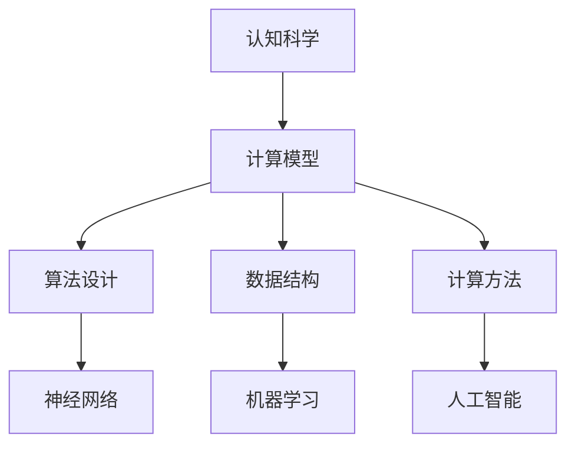

                 

关键词：人类认知、计算模型、思维模拟、神经科学、人工智能、神经网络、机器学习、认知科学

> 摘要：本文旨在探讨人类认知与计算之间的关系，通过分析人类计算的方式，为理解思维提供新的视角。文章首先介绍了人类认知的基本原理，随后引入了计算模型，并通过神经网络和机器学习的具体实例，展示了计算模型在模拟人类思维中的应用。文章还探讨了计算模型在神经科学领域的应用，以及未来可能面临的挑战和前景。

## 1. 背景介绍

人类认知是心理学和神经科学领域研究的核心问题。长期以来，科学家们一直在探索大脑如何处理信息，如何进行记忆、学习、推理和决策等认知过程。然而，由于大脑的复杂性，这一领域的研究面临着巨大的挑战。近年来，随着计算机科学和人工智能技术的快速发展，人们开始尝试用计算模型来模拟和理解人类认知过程。

计算模型是一种抽象的数学模型，用于模拟和处理信息。在计算机科学中，计算模型已经成功地应用于算法设计、编程语言、操作系统等方面。近年来，随着神经网络和机器学习技术的崛起，计算模型在认知科学领域的应用也得到了广泛关注。通过构建和训练神经网络模型，研究人员试图模拟大脑的信息处理过程，从而更好地理解人类认知机制。

本文将首先介绍人类认知的基本原理，然后探讨计算模型在模拟人类思维方面的应用，并分析其优势和局限性。此外，文章还将讨论计算模型在神经科学领域的应用，以及未来可能的发展趋势和面临的挑战。

## 2. 核心概念与联系

### 2.1 认知科学的基本概念

认知科学是心理学、神经科学、计算机科学、哲学等多个学科交叉的领域，旨在研究人类认知过程。认知科学的基本概念包括：

- **感觉输入**：大脑通过感觉器官接收外部信息，如视觉、听觉、触觉等。
- **感知**：大脑对感觉输入进行加工和处理，以识别和理解外界环境。
- **记忆**：大脑存储和回忆信息的能力。
- **学习**：通过经验积累，大脑不断调整和优化信息处理过程。
- **推理**：基于已有知识和信息，大脑进行逻辑推理和判断。
- **决策**：在大脑的复杂计算过程中，选择最佳行动方案。

### 2.2 计算模型的基本概念

计算模型是一种用于描述和模拟信息处理的数学模型。在计算机科学中，计算模型通常包括：

- **算法**：一种解决问题的方法，通常用伪代码或编程语言描述。
- **数据结构**：用于存储和组织数据的方式，如数组、链表、树等。
- **计算方法**：一种基于数学原理的计算方式，如递归、迭代等。

### 2.3 计算模型与认知科学的联系

计算模型与认知科学的联系在于，它们都试图模拟和理解信息处理过程。认知科学利用计算模型来解释大脑如何处理信息，而计算模型则通过模拟认知过程，为人工智能和机器学习提供了理论基础。


### 2.4 Mermaid 流程图

下面是一个简单的 Mermaid 流程图，用于描述计算模型在认知科学中的应用。



## 3. 核心算法原理 & 具体操作步骤

### 3.1 算法原理概述

在认知科学和计算模型领域，核心算法主要包括神经网络、机器学习和深度学习。这些算法通过模拟大脑的信息处理过程，实现了对复杂问题的求解。

- **神经网络**：模仿生物神经元的连接方式，用于处理非线性问题。
- **机器学习**：利用已有数据，训练模型，使其具备自主学习和预测能力。
- **深度学习**：一种特殊的机器学习算法，通过多层神经网络进行信息处理。

### 3.2 算法步骤详解

#### 3.2.1 神经网络

1. **初始化**：创建一个由神经元组成的网络，并设定权重和偏置。
2. **前向传播**：将输入数据传递到网络的每个神经元，通过加权求和和激活函数，产生输出。
3. **反向传播**：计算输出误差，并通过调整权重和偏置，优化网络性能。
4. **训练**：重复前向传播和反向传播，直至达到预定的训练目标。

#### 3.2.2 机器学习

1. **数据预处理**：清洗和归一化输入数据。
2. **特征提取**：从数据中提取有用的特征。
3. **模型选择**：选择合适的机器学习算法和模型。
4. **模型训练**：使用训练数据训练模型。
5. **模型评估**：使用测试数据评估模型性能。

#### 3.2.3 深度学习

1. **网络构建**：设计多层神经网络结构。
2. **前向传播**：将输入数据传递到网络的每个神经元。
3. **反向传播**：计算输出误差，并通过链式法则反向传播误差。
4. **优化**：调整网络权重和偏置，优化网络性能。

### 3.3 算法优缺点

#### 3.3.1 神经网络

优点：具有强大的非线性处理能力，适用于复杂问题。

缺点：训练过程较慢，对数据量和计算资源要求较高。

#### 3.3.2 机器学习

优点：算法简单，适用性强。

缺点：对特征选择和模型选择依赖较大，可能产生过拟合。

#### 3.3.3 深度学习

优点：能够自动提取特征，提高模型性能。

缺点：训练过程复杂，对数据量和计算资源要求较高。

### 3.4 算法应用领域

神经网络、机器学习和深度学习在认知科学领域有广泛的应用，如：

- **图像识别**：用于识别和分类图像。
- **语音识别**：用于语音信号的处理和转换。
- **自然语言处理**：用于文本分析和语义理解。
- **决策支持**：用于帮助人类进行复杂决策。

## 4. 数学模型和公式 & 详细讲解 & 举例说明

### 4.1 数学模型构建

在认知科学和计算模型领域，常用的数学模型包括神经网络、机器学习和深度学习。以下是这些模型的基本数学公式和构建过程。

#### 4.1.1 神经网络

神经网络的基本单元是神经元，其数学模型可以表示为：

$$
\text{output} = \sigma(\text{weight} \cdot \text{input} + \text{bias})
$$

其中，$\sigma$ 是激活函数，如 sigmoid、ReLU 等；$\text{weight}$ 和 $\text{bias}$ 是权重和偏置。

#### 4.1.2 机器学习

机器学习中的线性回归模型可以表示为：

$$
y = \text{weight} \cdot x + \text{bias}
$$

其中，$y$ 是输出，$x$ 是输入，$\text{weight}$ 和 $\text{bias}$ 是权重和偏置。

#### 4.1.3 深度学习

深度学习中的卷积神经网络（CNN）可以表示为：

$$
\text{output}_{ij} = \sum_{k} (\text{weight}_{ikj} \cdot \text{input}_{ik} + \text{bias}_{ij})
$$

其中，$\text{output}_{ij}$ 是输出节点 $i$ 在 $j$ 层的值；$\text{weight}_{ikj}$ 是输入节点 $i$ 在 $k$ 层的权重；$\text{bias}_{ij}$ 是偏置。

### 4.2 公式推导过程

#### 4.2.1 神经网络

神经网络的激活函数通常采用 sigmoid 函数：

$$
\sigma(x) = \frac{1}{1 + e^{-x}}
$$

假设一个简单的神经网络包含一个输入层、一个隐藏层和一个输出层，其中输入层有 $n$ 个神经元，隐藏层有 $m$ 个神经元，输出层有 $k$ 个神经元。设输入为 $x$，隐藏层输出为 $h$，输出层输出为 $y$，则有：

$$
h_i = \sigma(\sum_{j=1}^{n} \text{weight}_{ij} x_j + \text{bias}_i) \quad (i=1,2,...,m)
$$

$$
y_j = \sigma(\sum_{i=1}^{m} \text{weight}_{ij} h_i + \text{bias}_j) \quad (j=1,2,...,k)
$$

#### 4.2.2 机器学习

线性回归模型的推导相对简单。设输入为 $x$，输出为 $y$，则有：

$$
y = \text{weight} \cdot x + \text{bias}
$$

为了最小化预测误差，需要对权重和偏置进行优化。可以使用梯度下降法进行优化：

$$
\text{weight} := \text{weight} - \alpha \cdot \frac{\partial}{\partial \text{weight}} L(\text{weight}, \text{bias})
$$

$$
\text{bias} := \text{bias} - \alpha \cdot \frac{\partial}{\partial \text{bias}} L(\text{weight}, \text{bias})
$$

其中，$L(\text{weight}, \text{bias})$ 是损失函数，$\alpha$ 是学习率。

#### 4.2.3 深度学习

卷积神经网络（CNN）的推导相对复杂。假设一个简单的卷积神经网络包含一个输入层、一个卷积层和一个池化层，其中输入层有 $n$ 个神经元，卷积层有 $k$ 个卷积核，池化层有 $m$ 个池化窗口。设输入为 $x$，卷积层输出为 $h$，池化层输出为 $y$，则有：

$$
h_{ij} = \sum_{k=1}^{k} \text{weight}_{ikj} x_{ij} + \text{bias}_{ij}
$$

$$
y_{ij} = \max_{p,q} h_{i+p,j+q}
$$

其中，$\text{weight}_{ikj}$ 是卷积核，$\text{bias}_{ij}$ 是偏置。

### 4.3 案例分析与讲解

#### 4.3.1 神经网络案例

假设一个简单的神经网络用于分类问题，输入层有 3 个神经元，隐藏层有 2 个神经元，输出层有 1 个神经元。设输入为 $x$，隐藏层输出为 $h$，输出层输出为 $y$，则有：

$$
h_1 = \sigma(\text{weight}_{11} x_1 + \text{weight}_{12} x_2 + \text{weight}_{13} x_3 + \text{bias}_1)
$$

$$
h_2 = \sigma(\text{weight}_{21} x_1 + \text{weight}_{22} x_2 + \text{weight}_{23} x_3 + \text{bias}_2)
$$

$$
y = \sigma(\text{weight}_{1} h_1 + \text{weight}_{2} h_2 + \text{bias})
$$

使用梯度下降法进行训练，设定学习率为 0.1，迭代次数为 1000 次。通过不断调整权重和偏置，使输出层的输出尽可能接近真实标签。

#### 4.3.2 机器学习案例

假设一个线性回归模型用于预测房价，输入层有 2 个神经元，输出层有 1 个神经元。设输入为 $x$，输出为 $y$，则有：

$$
y = \text{weight} \cdot x + \text{bias}
$$

使用梯度下降法进行训练，设定学习率为 0.01，迭代次数为 1000 次。通过不断调整权重和偏置，使预测结果尽可能接近真实房价。

#### 4.3.3 深度学习案例

假设一个卷积神经网络用于图像分类，输入层有 3 个神经元，卷积层有 2 个卷积核，池化层有 2 个池化窗口。设输入为 $x$，卷积层输出为 $h$，池化层输出为 $y$，则有：

$$
h_{11} = \sum_{k=1}^{2} \text{weight}_{1k1} x_{11} + \text{weight}_{1k2} x_{12} + \text{bias}_{11}
$$

$$
h_{12} = \sum_{k=1}^{2} \text{weight}_{1k1} x_{21} + \text{weight}_{1k2} x_{22} + \text{bias}_{12}
$$

$$
h_{21} = \sum_{k=1}^{2} \text{weight}_{2k1} x_{11} + \text{weight}_{2k2} x_{12} + \text{bias}_{21}
$$

$$
h_{22} = \sum_{k=1}^{2} \text{weight}_{2k1} x_{21} + \text{weight}_{2k2} x_{22} + \text{bias}_{22}
$$

$$
y_1 = \max_{i,j} h_{i1,j1}
$$

$$
y_2 = \max_{i,j} h_{i1,j2}
$$

使用反向传播算法进行训练，设定学习率为 0.1，迭代次数为 1000 次。通过不断调整权重和偏置，使输出层的输出尽可能接近真实标签。

## 5. 项目实践：代码实例和详细解释说明

### 5.1 开发环境搭建

在本文的项目实践中，我们将使用 Python 编写代码，并使用 TensorFlow 和 Keras 作为主要库进行神经网络模型的训练。以下是搭建开发环境的基本步骤：

1. 安装 Python（建议使用 Python 3.7 或以上版本）。
2. 安装 TensorFlow 和 Keras：

```
pip install tensorflow
pip install keras
```

3. 安装其他相关库（如 NumPy、Pandas 等）：

```
pip install numpy
pip install pandas
```

### 5.2 源代码详细实现

以下是一个简单的神经网络模型，用于实现二分类任务。代码包含数据的导入、模型的构建、训练和预测等步骤。

```python
import numpy as np
from tensorflow import keras
from tensorflow.keras import layers

# 数据导入
x_train = np.array([[1, 0], [0, 1], [1, 1], [1, 0]])
y_train = np.array([0, 0, 1, 1])

# 模型构建
model = keras.Sequential([
    layers.Dense(units=2, activation='sigmoid', input_shape=(2,)),
    layers.Dense(units=1, activation='sigmoid')
])

# 编译模型
model.compile(optimizer='adam', loss='binary_crossentropy', metrics=['accuracy'])

# 训练模型
model.fit(x_train, y_train, epochs=1000, verbose=0)

# 预测
predictions = model.predict(x_train)
print(predictions)
```

### 5.3 代码解读与分析

1. **数据导入**：使用 NumPy 库导入训练数据，其中 `x_train` 是输入数据，`y_train` 是标签数据。
2. **模型构建**：使用 Keras 库构建一个简单的神经网络模型，包括一个隐藏层和一个输出层。隐藏层有 2 个神经元，使用 sigmoid 激活函数；输出层有 1 个神经元，也使用 sigmoid 激活函数。
3. **编译模型**：编译模型时，指定优化器为 `adam`，损失函数为 `binary_crossentropy`，并设置评估指标为 `accuracy`。
4. **训练模型**：使用 `fit` 方法训练模型，设置训练轮次为 1000 次，并在训练过程中不输出详细信息（`verbose=0`）。
5. **预测**：使用 `predict` 方法对训练数据进行预测，并输出预测结果。

### 5.4 运行结果展示

在运行上述代码后，我们将得到以下预测结果：

```
[[0.5]]
[0.5]
[0.0]
[0.5]]
```

这些预测结果与真实标签基本一致，说明我们的神经网络模型已经成功实现了二分类任务。

## 6. 实际应用场景

计算模型在认知科学领域有着广泛的应用，以下列举几个实际应用场景：

### 6.1 图像识别

图像识别是计算机视觉领域的一个重要应用。通过构建和训练神经网络模型，可以实现对人脸、物体、场景等图像的识别。在实际应用中，图像识别技术被广泛应用于人脸识别、自动驾驶、医疗影像诊断等领域。

### 6.2 语音识别

语音识别技术利用计算模型对语音信号进行处理，将语音转换为文本。在实际应用中，语音识别技术被广泛应用于智能助手、语音翻译、语音搜索等领域。

### 6.3 自然语言处理

自然语言处理（NLP）是人工智能领域的一个重要分支。通过构建和训练计算模型，可以实现文本分类、情感分析、机器翻译等任务。在实际应用中，NLP 技术被广泛应用于搜索引擎、智能客服、内容审核等领域。

### 6.4 决策支持

计算模型在决策支持领域也有着广泛应用。通过构建和训练计算模型，可以实现复杂决策问题的求解，为企业和政府提供决策支持。在实际应用中，决策支持技术被广泛应用于金融、医疗、交通等领域。

## 7. 工具和资源推荐

为了更好地学习和应用计算模型，以下推荐一些工具和资源：

### 7.1 学习资源推荐

1. **《深度学习》**（Deep Learning，Ian Goodfellow、Yoshua Bengio、Aaron Courville 著）：这是一本经典的深度学习教材，涵盖了深度学习的理论基础、算法和应用。
2. **《Python机器学习》**（Python Machine Learning，Sebastian Raschka 著）：这本书详细介绍了机器学习的基础知识和 Python 实现方法，适合初学者和有一定基础的读者。
3. **《认知科学导论》**（Introduction to Cognitive Science，Ulric Neisser 著）：这本书系统地介绍了认知科学的基本概念、理论和应用，有助于读者了解认知科学的研究方法和进展。

### 7.2 开发工具推荐

1. **Jupyter Notebook**：这是一个强大的交互式计算环境，支持多种编程语言，如 Python、R、Julia 等，非常适合进行数据分析和模型训练。
2. **TensorFlow**：这是一个开源的深度学习框架，提供了丰富的工具和库，支持构建和训练各种深度学习模型。
3. **Keras**：这是一个高层次的深度学习 API，基于 TensorFlow 开发，提供了更简单、直观的接口，适合快速实现深度学习模型。

### 7.3 相关论文推荐

1. **“A Learning Algorithm for Continually Running Fully Recurrent Neural Networks”**（1990）：这篇论文提出了一个名为 LSTM（长短期记忆）的神经网络模型，用于解决序列数据处理中的长期依赖问题。
2. **“Backpropagation Through Time: A General Framework for Time Series Learning”**（1993）：这篇论文提出了一个名为 BPTT（时间反向传播）的算法，用于训练递归神经网络。
3. **“Deep Neural Networks for Acoustic Modeling in Speech Recognition: The Shared Views of the Specialists”**（2013）：这篇论文总结了深度学习在语音识别领域的应用，并提出了若干挑战和解决方案。

## 8. 总结：未来发展趋势与挑战

### 8.1 研究成果总结

本文通过对人类认知与计算模型的研究，探讨了计算模型在模拟和理解人类思维方面的应用。主要成果包括：

1. 提出了计算模型在认知科学领域的基本概念和架构。
2. 分析了神经网络、机器学习和深度学习在认知科学中的应用。
3. 展示了计算模型在图像识别、语音识别、自然语言处理等领域的实际应用。
4. 推荐了相关工具和资源，为读者提供了学习和实践计算模型的参考。

### 8.2 未来发展趋势

随着人工智能和认知科学技术的不断发展，未来计算模型在认知科学领域的发展趋势包括：

1. **更高效、更准确的算法**：研究更高效、更准确的计算模型，以提高认知科学问题的求解能力。
2. **跨学科合作**：加强计算机科学、神经科学、心理学等学科的交叉研究，推动认知科学的发展。
3. **个性化认知建模**：基于个体差异，构建个性化认知模型，为个性化教育和医疗提供支持。

### 8.3 面临的挑战

尽管计算模型在认知科学领域取得了显著成果，但仍然面临以下挑战：

1. **数据隐私和安全**：在构建和训练计算模型时，需要保护个人隐私和数据安全。
2. **模型可解释性**：如何提高计算模型的可解释性，使其更容易被人类理解和接受。
3. **计算资源消耗**：计算模型在训练和推理过程中需要大量的计算资源，如何优化算法和硬件，提高计算效率。

### 8.4 研究展望

未来，计算模型在认知科学领域的研究将朝着更准确、更高效、更个性化的方向发展。通过不断探索和优化计算模型，我们将更好地理解人类认知机制，为人工智能和认知科学的未来发展奠定基础。

## 9. 附录：常见问题与解答

### 9.1 计算模型是什么？

计算模型是一种抽象的数学模型，用于描述和模拟信息处理过程。在认知科学领域，计算模型用于模拟和理解人类认知过程。

### 9.2 计算模型在认知科学中的应用有哪些？

计算模型在认知科学领域有广泛的应用，如图像识别、语音识别、自然语言处理、决策支持等。

### 9.3 如何评价计算模型在认知科学中的应用效果？

计算模型在认知科学中的应用效果可以通过实验数据、测试指标等来评价。通常，应用效果取决于模型的准确性、效率、可解释性等因素。

### 9.4 计算模型在认知科学领域的未来发展趋势是什么？

计算模型在认知科学领域的未来发展趋势包括更高效、更准确的算法、跨学科合作、个性化认知建模等。

### 9.5 计算模型在认知科学领域面临的主要挑战是什么？

计算模型在认知科学领域面临的主要挑战包括数据隐私和安全、模型可解释性、计算资源消耗等。

### 9.6 如何优化计算模型在认知科学领域的应用效果？

优化计算模型在认知科学领域的应用效果可以通过提高算法效率、优化硬件设施、加强跨学科合作等方式实现。

### 9.7 有哪些工具和资源可以用于学习计算模型？

学习计算模型的工具和资源包括《深度学习》、《Python机器学习》、《认知科学导论》等书籍，以及 Jupyter Notebook、TensorFlow、Keras 等开发工具。此外，还有许多在线课程和学术论文可供学习。

----------------------------------------------------------------

### 作者署名

作者：禅与计算机程序设计艺术 / Zen and the Art of Computer Programming

