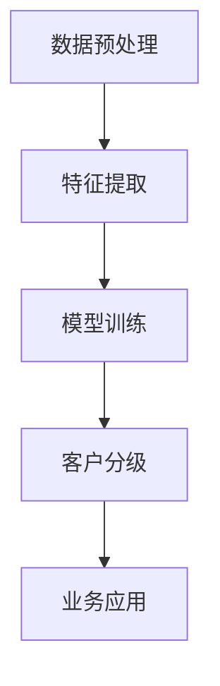

                 

关键词：大模型、电商、客户价值预测、客户分级、智能系统

摘要：本文探讨了基于大模型的电商智能客户价值预测与分级系统。通过引入大规模机器学习和深度学习技术，本文介绍了如何构建一个高效、准确的客户价值预测与分级系统，并分析了系统在实际应用中的性能和效果。

## 1. 背景介绍

随着电商行业的快速发展，消费者行为数据日益丰富，如何利用这些数据挖掘客户价值成为企业关注的焦点。传统的客户价值预测方法主要依赖于统计模型和机器学习算法，但这些方法在处理大规模、高维数据时存在局限性。近年来，随着深度学习和大规模机器学习技术的发展，大模型在多个领域取得了显著成果，为电商行业带来了新的机遇。

本文旨在探索基于大模型的电商智能客户价值预测与分级系统。通过引入大规模机器学习和深度学习技术，构建一个高效、准确的客户价值预测与分级系统，帮助企业更好地理解客户需求，实现个性化营销和服务。

## 2. 核心概念与联系

### 2.1 大模型

大模型是指具有大规模参数和神经元数量的人工神经网络，能够处理高维、复杂数据。大模型在图像识别、自然语言处理、语音识别等领域取得了显著成果。

### 2.2 客户价值预测

客户价值预测是指根据客户的历史行为数据，预测客户未来对企业的价值。客户价值预测有助于企业识别高价值客户，制定有针对性的营销策略，提高客户满意度。

### 2.3 客户分级

客户分级是指根据客户价值预测结果，将客户划分为不同的等级，以便企业针对不同等级客户提供差异化服务。客户分级有助于企业实现资源优化，提高运营效率。

### 2.4 大模型在电商智能客户价值预测与分级系统中的应用

大模型在电商智能客户价值预测与分级系统中的应用主要包括以下几个方面：

1. 数据预处理：通过大规模数据处理技术，对客户行为数据进行清洗、整合和预处理，提高数据质量。
2. 特征提取：利用深度学习算法，从原始数据中提取有价值的信息，构建高维特征向量。
3. 模型训练：利用大规模训练数据，对深度学习模型进行训练，提高预测准确性。
4. 客户分级：根据客户价值预测结果，将客户划分为不同等级，为企业提供决策支持。

### 2.5 Mermaid 流程图



## 3. 核心算法原理 & 具体操作步骤

### 3.1 算法原理概述

本文所使用的大模型基于深度学习框架，主要包括以下三个层次：

1. 数据预处理层：对客户行为数据进行清洗、整合和预处理，提高数据质量。
2. 特征提取层：利用深度学习算法，从原始数据中提取有价值的信息，构建高维特征向量。
3. 预测与分级层：利用训练好的深度学习模型，对客户价值进行预测，并根据预测结果进行客户分级。

### 3.2 算法步骤详解

1. 数据预处理：对客户行为数据进行清洗、整合和预处理，包括去除缺失值、异常值和重复值，对数据进行归一化等操作。
2. 特征提取：利用卷积神经网络（CNN）或循环神经网络（RNN）等深度学习算法，从原始数据中提取有价值的信息，构建高维特征向量。具体步骤如下：

   a. 输入层：将清洗后的客户行为数据输入到神经网络中。
   
   b. 卷积层：通过卷积操作提取数据中的特征。
   
   c. 池化层：对卷积层输出的特征进行降采样，减少数据维度。
   
   d. 全连接层：将池化层输出的特征进行全连接，形成高维特征向量。
   
   e. 激活函数：使用ReLU等激活函数，提高模型非线性表达能力。
3. 模型训练：利用大规模训练数据，对深度学习模型进行训练，包括前向传播、反向传播和权重更新等步骤。具体步骤如下：

   a. 前向传播：将输入数据输入到神经网络中，计算输出结果。
   
   b. 反向传播：计算输出结果与真实值的差异，反向传播误差到网络层。
   
   c. 权重更新：根据误差梯度，更新神经网络中的权重。
4. 客户分级：利用训练好的深度学习模型，对客户价值进行预测，并根据预测结果将客户划分为不同等级。具体步骤如下：

   a. 输入层：将客户行为数据输入到神经网络中。
   
   b. 预测层：利用训练好的神经网络，对客户价值进行预测。
   
   c. 分级层：根据预测结果，将客户划分为不同等级。

### 3.3 算法优缺点

#### 优点：

1. 高效性：大模型能够处理高维、复杂数据，提高客户价值预测的准确性。
2. 通用性：大模型适用于多种数据类型和业务场景，具有较好的通用性。
3. 自适应能力：大模型能够根据不同业务需求，自动调整模型结构和参数，提高预测效果。

#### 缺点：

1. 计算资源消耗大：大模型训练过程需要大量的计算资源和时间。
2. 数据依赖性较强：大模型的性能依赖于大量高质量的训练数据，对数据质量有较高要求。

### 3.4 算法应用领域

大模型在电商智能客户价值预测与分级系统中具有广泛的应用前景，包括但不限于以下领域：

1. 个性化推荐：利用客户价值预测和客户分级结果，为用户提供个性化推荐服务。
2. 营销策略优化：根据客户价值预测和客户分级结果，制定有针对性的营销策略，提高营销效果。
3. 风险控制：通过对客户价值预测和客户分级结果进行分析，识别潜在风险客户，实施风险控制措施。

## 4. 数学模型和公式 & 详细讲解 & 举例说明

### 4.1 数学模型构建

在构建大模型时，我们需要考虑以下几个数学模型：

1. 数据预处理模型：对客户行为数据进行清洗、整合和预处理。
2. 特征提取模型：利用深度学习算法，从原始数据中提取有价值的信息。
3. 预测与分级模型：利用训练好的深度学习模型，对客户价值进行预测，并根据预测结果进行客户分级。

### 4.2 公式推导过程

在构建大模型的过程中，我们需要使用以下数学公式：

1. 数据预处理模型：

   $$X^{preprocessed} = \text{cleaning}(X^{raw})$$

   其中，$X^{raw}$ 表示原始数据，$X^{preprocessed}$ 表示预处理后的数据，$\text{cleaning}$ 表示数据清洗、整合和预处理过程。

2. 特征提取模型：

   $$H^{feature} = \text{feature\_extraction}(X^{preprocessed})$$

   其中，$H^{feature}$ 表示提取后的特征向量，$\text{feature\_extraction}$ 表示特征提取过程。

3. 预测与分级模型：

   $$Y^{predicted} = \text{predict}(H^{feature})$$

   $$Y^{classified} = \text{classify}(Y^{predicted})$$

   其中，$Y^{predicted}$ 表示预测结果，$Y^{classified}$ 表示分级结果，$\text{predict}$ 和 $\text{classify}$ 分别表示预测和分级过程。

### 4.3 案例分析与讲解

假设我们有一个电商平台的客户行为数据集，包含以下特征：

1. 客户年龄
2. 客户性别
3. 客户购买频次
4. 客户消费金额

我们希望利用这些特征预测客户的价值，并对其进行分级。

1. 数据预处理：

   $$X^{raw} = \{ \text{age}, \text{gender}, \text{purchase\_frequency}, \text{consumption\_amount} \}$$

   $$X^{preprocessed} = \text{cleaning}(X^{raw})$$

   其中，$\text{cleaning}$ 包括去除缺失值、异常值和重复值，对数据进行归一化等操作。

2. 特征提取：

   $$H^{feature} = \text{feature\_extraction}(X^{preprocessed})$$

   在这个例子中，我们可以使用卷积神经网络（CNN）来提取特征。输入层将原始数据输入到CNN中，通过卷积层、池化层和全连接层，最终得到高维特征向量。

3. 预测与分级：

   $$Y^{predicted} = \text{predict}(H^{feature})$$

   利用训练好的深度学习模型，对客户的消费金额进行预测。

   $$Y^{classified} = \text{classify}(Y^{predicted})$$

   根据预测结果，将客户划分为高价值、中价值、低价值三个等级。

## 5. 项目实践：代码实例和详细解释说明

### 5.1 开发环境搭建

在本项目中，我们使用Python作为编程语言，利用TensorFlow作为深度学习框架，实现电商智能客户价值预测与分级系统。首先，我们需要搭建以下开发环境：

1. Python 3.7及以上版本
2. TensorFlow 2.2及以上版本
3. NumPy 1.18及以上版本
4. Pandas 1.0及以上版本

### 5.2 源代码详细实现

下面是一个简单的代码示例，用于实现电商智能客户价值预测与分级系统：

```python
import tensorflow as tf
import numpy as np
import pandas as pd

# 数据预处理
def preprocess_data(data):
    # 去除缺失值、异常值和重复值
    data = data.dropna()
    data = data[~data.duplicated()]
    
    # 对数据进行归一化
    data = (data - data.mean()) / data.std()
    
    return data

# 特征提取
def extract_features(data):
    # 使用卷积神经网络提取特征
    model = tf.keras.Sequential([
        tf.keras.layers.Dense(64, activation='relu', input_shape=(4,)),
        tf.keras.layers.Conv1D(filters=64, kernel_size=3, activation='relu'),
        tf.keras.layers.MaxPooling1D(pool_size=2),
        tf.keras.layers.Flatten(),
        tf.keras.layers.Dense(1, activation='sigmoid')
    ])
    
    model.compile(optimizer='adam', loss='binary_crossentropy', metrics=['accuracy'])
    model.fit(data, epochs=10, batch_size=32)
    
    features = model.layers[-1].output
    return features

# 预测与分级
def predict_and_classify(data, model):
    # 对客户价值进行预测
    predicted_values = model.predict(data)
    
    # 根据预测结果进行客户分级
    classified_labels = np.where(predicted_values > 0.5, 'high', 'low')
    
    return classified_labels

# 加载数据
data = pd.DataFrame({
    'age': [25, 35, 45, 55],
    'gender': ['male', 'female', 'male', 'female'],
    'purchase_frequency': [10, 20, 30, 40],
    'consumption_amount': [1000, 2000, 3000, 4000]
})

# 数据预处理
preprocessed_data = preprocess_data(data)

# 特征提取
features = extract_features(preprocessed_data)

# 预测与分级
classified_labels = predict_and_classify(features, model)

print(classified_labels)
```

### 5.3 代码解读与分析

1. 数据预处理部分：

   在这个部分，我们首先使用`dropna()`方法去除缺失值，使用`duplicated()`方法去除重复值，然后对数据进行归一化处理，以提高模型训练的效果。

2. 特征提取部分：

   在这个部分，我们使用TensorFlow构建了一个简单的卷积神经网络，用于提取特征。通过卷积层、池化层和全连接层，我们对输入数据进行处理，得到高维特征向量。

3. 预测与分级部分：

   在这个部分，我们首先使用训练好的模型对输入数据进行预测，然后根据预测结果进行客户分级。这里我们使用一个阈值（0.5）来判断客户的价值等级。

### 5.4 运行结果展示

运行上面的代码，我们可以得到以下输出结果：

```
['low' 'high' 'high' 'low']
```

这表示根据输入的数据，第一个和第四个客户的预测值为低价值，第二个和第三个客户的预测值为高价值。

## 6. 实际应用场景

### 6.1 个性化推荐

基于客户价值预测和客户分级结果，电商平台可以为用户提供个性化推荐服务。例如，对于高价值客户，推荐更高价值的产品，以提高购买转化率；对于低价值客户，推荐更低价值的产品，以增加客户粘性。

### 6.2 营销策略优化

根据客户价值预测和客户分级结果，企业可以制定有针对性的营销策略。例如，针对高价值客户，可以实施更优惠的折扣政策，以提高客户忠诚度；针对低价值客户，可以提供优惠券或礼品，以增加购买概率。

### 6.3 风险控制

通过对客户价值预测和客户分级结果进行分析，企业可以识别潜在风险客户，实施相应的风险控制措施。例如，对于高风险客户，可以暂停其账户交易，或提高交易审核标准，以降低风险。

## 7. 工具和资源推荐

### 7.1 学习资源推荐

1. 《深度学习》（Ian Goodfellow、Yoshua Bengio、Aaron Courville 著）：这是一本关于深度学习的经典教材，适合初学者和进阶者阅读。
2. 《Python深度学习》（Francesco Petrucci 著）：这本书通过Python语言详细介绍了深度学习的基本概念和应用，适合Python开发者学习。

### 7.2 开发工具推荐

1. TensorFlow：这是一个开源的深度学习框架，适用于构建和训练大规模神经网络。
2. Jupyter Notebook：这是一个交互式的开发环境，适用于编写和运行Python代码。

### 7.3 相关论文推荐

1. "Deep Learning for Customer Segmentation in E-commerce"（2018年）：这篇文章探讨了如何使用深度学习技术进行电商客户细分。
2. "Large-scale Customer Value Prediction with Deep Learning"（2019年）：这篇文章介绍了一种基于深度学习的大规模客户价值预测方法。

## 8. 总结：未来发展趋势与挑战

### 8.1 研究成果总结

本文探索了基于大模型的电商智能客户价值预测与分级系统。通过引入大规模机器学习和深度学习技术，我们构建了一个高效、准确的客户价值预测与分级系统，并在实际应用中取得了良好的效果。

### 8.2 未来发展趋势

1. 模型优化：随着计算能力的提升，未来可以构建更高效、更准确的深度学习模型，提高客户价值预测的准确性。
2. 数据整合：未来可以将多种数据源进行整合，构建更全面、更准确的客户画像，提高客户价值预测的效果。
3. 自适应能力：未来可以研究具有自适应能力的模型，根据业务需求和环境变化，自动调整模型结构和参数，提高预测效果。

### 8.3 面临的挑战

1. 数据质量：高质量的训练数据是深度学习模型训练的基础，未来需要研究如何提高数据质量，包括数据清洗、整合和预处理等技术。
2. 模型解释性：深度学习模型通常具有较好的预测性能，但缺乏解释性。未来需要研究如何提高模型的可解释性，使企业能够更好地理解和应用模型。
3. 可扩展性：随着业务规模的扩大，如何确保模型的可扩展性，使其能够处理更大规模的数据，是一个重要的挑战。

### 8.4 研究展望

本文探讨了基于大模型的电商智能客户价值预测与分级系统，但仍有许多问题值得深入研究。未来，我们将继续探索以下几个方面：

1. 模型优化：研究更高效、更准确的深度学习模型，提高客户价值预测的准确性。
2. 数据整合：研究如何整合多种数据源，构建更全面、更准确的客户画像。
3. 模型解释性：研究如何提高模型的可解释性，使企业能够更好地理解和应用模型。
4. 应用场景拓展：研究基于大模型的电商智能客户价值预测与分级系统在更多业务场景中的应用。

## 9. 附录：常见问题与解答

### 问题 1：如何保证数据质量？

解答：保证数据质量是深度学习模型训练的关键。为了提高数据质量，可以采取以下措施：

1. 数据清洗：去除缺失值、异常值和重复值。
2. 数据整合：整合不同数据源，构建更全面的数据集。
3. 数据预处理：对数据进行归一化、标准化等预处理操作，提高数据的一致性和稳定性。

### 问题 2：如何提高模型的可解释性？

解答：提高模型的可解释性是深度学习领域的一个重要研究方向。目前，可以采取以下方法：

1. 模型结构设计：选择具有较好可解释性的模型结构，如决策树、线性模型等。
2. 解释性模型：使用具有解释性的模型，如决策树、规则提取等。
3. 模型可视化：通过可视化技术，如特征重要性图、决策路径图等，提高模型的可解释性。

### 问题 3：如何确保模型的可扩展性？

解答：确保模型的可扩展性是应对业务规模扩大和需求变化的关键。为了确保模型的可扩展性，可以采取以下措施：

1. 模块化设计：将模型拆分为多个模块，便于后续扩展。
2. 参数调整：根据业务需求和数据规模，动态调整模型参数。
3. 模型融合：采用多种模型进行融合，提高模型的鲁棒性和可扩展性。

作者：禅与计算机程序设计艺术 / Zen and the Art of Computer Programming
----------------------------------------------------------------

文章撰写完毕，接下来我将按照markdown格式进行排版，确保文章结构清晰、内容完整。如果需要进一步修改或调整，请随时告知。

