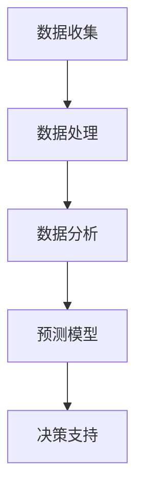
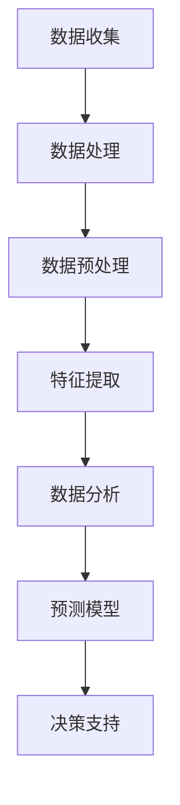

                 

关键词：大模型、电商、客户洞察、智能系统、算法、实践、数学模型、应用场景、未来展望

> 摘要：本文将探讨基于大模型的电商智能客户洞察系统的研究与应用。通过介绍系统的核心概念、算法原理、数学模型以及实际应用案例，本文旨在为电商行业提供一种有效的智能客户洞察解决方案，并对其未来发展提出展望。

## 1. 背景介绍

在电子商务高速发展的今天，企业面临的挑战和机遇并存。如何更好地理解和挖掘客户需求，提高客户满意度和忠诚度，成为电商企业关注的焦点。传统的数据分析方法在处理大量复杂数据时往往力不从心，难以实现精准的客户洞察。而基于大模型的智能客户洞察系统，通过先进的机器学习和深度学习技术，能够实现高效、精准的数据分析和预测，为电商企业提供有力的决策支持。

### 1.1 电商行业现状

电商行业正以前所未有的速度增长，市场规模不断扩大。根据最新统计，全球电商市场规模已经达到数万亿美元，预计未来几年仍将保持高速增长。这一趋势促使电商企业不断探索新的营销策略和服务模式，以提升客户体验和满意度。

### 1.2 客户洞察的重要性

客户洞察是电商企业制定战略和运营决策的重要依据。通过深入分析客户行为、需求和偏好，企业可以更好地了解目标客户群体，制定精准的营销策略，提高客户满意度和忠诚度。传统的方法难以应对海量数据和复杂关系，而大模型智能客户洞察系统提供了有效的解决方案。

## 2. 核心概念与联系

### 2.1 大模型

大模型是指具备强大计算能力和海量数据存储能力的机器学习模型，通常采用深度学习技术。大模型能够自动学习数据中的复杂模式和规律，实现高效的数据分析和预测。

### 2.2 电商智能客户洞察系统架构

电商智能客户洞察系统通常由数据收集、数据处理、数据分析和预测等多个模块组成。其核心在于利用大模型技术实现客户行为的自动分析和预测，提供智能化的决策支持。



## 3. 核心算法原理 & 具体操作步骤

### 3.1 算法原理概述

电商智能客户洞察系统主要采用深度学习技术，通过多层神经网络实现对客户数据的自动分析和预测。算法原理包括数据预处理、特征提取、模型训练和预测等步骤。

### 3.2 算法步骤详解

1. 数据预处理：对原始客户数据进行分析，去除噪声和异常值，进行数据清洗和归一化处理。
2. 特征提取：从预处理后的数据中提取关键特征，如用户行为、浏览历史、购物偏好等。
3. 模型训练：使用提取的特征数据训练深度学习模型，如卷积神经网络（CNN）或循环神经网络（RNN）。
4. 预测：将训练好的模型应用于新的客户数据，预测客户行为和需求。

### 3.3 算法优缺点

- 优点：算法具有强大的计算能力和高效的数据处理能力，能够实现精准的客户洞察和预测。
- 缺点：算法训练过程需要大量的计算资源和时间，对数据处理和模型调参要求较高。

### 3.4 算法应用领域

电商智能客户洞察系统可以应用于多个领域，如个性化推荐、用户行为分析、需求预测等。以下是一些具体应用案例：

1. 个性化推荐：根据用户历史行为和购物偏好，推荐符合其兴趣的商品。
2. 用户行为分析：分析用户在购物过程中的行为模式，发现潜在问题和改进方向。
3. 需求预测：预测未来一段时间内的商品需求和销售趋势，为库存管理和营销策略提供支持。

## 4. 数学模型和公式

### 4.1 数学模型构建

电商智能客户洞察系统的数学模型主要基于深度学习技术，其核心是多层神经网络。模型构建主要包括以下步骤：

1. 输入层：接收客户数据的输入。
2. 隐藏层：通过非线性激活函数对输入数据进行特征提取和变换。
3. 输出层：根据隐藏层的输出生成预测结果。

### 4.2 公式推导过程

设输入数据集为 X，隐藏层神经元数量为 h，输出层神经元数量为 o，则多层神经网络的输出可以表示为：

$$
y = \sigma(W_h \cdot x + b_h)
$$

其中，\( \sigma \) 为激活函数，\( W_h \) 为隐藏层权重矩阵，\( b_h \) 为隐藏层偏置，\( x \) 为输入数据。

输出层的输出为：

$$
z = \sigma(W_o \cdot y + b_o)
$$

其中，\( W_o \) 为输出层权重矩阵，\( b_o \) 为输出层偏置。

### 4.3 案例分析与讲解

以下是一个简单的例子，假设我们有一个包含两个隐藏层的三层神经网络，输入数据为 5 维，输出数据为 3 维。输入数据集为 \( X = \{x_1, x_2, ..., x_n\} \)，隐藏层神经元数量分别为 \( h_1 = 10 \) 和 \( h_2 = 5 \)，输出层神经元数量为 \( o = 3 \)。

1. 输入层到第一隐藏层的权重矩阵 \( W_{h1} \) 和偏置 \( b_{h1} \)：

$$
W_{h1} = \begin{bmatrix}
w_{11} & w_{12} & ... & w_{1n} \\
w_{21} & w_{22} & ... & w_{2n} \\
... & ... & ... & ... \\
w_{h1_1} & w_{h1_2} & ... & w_{h1_n}
\end{bmatrix}, b_{h1} = \begin{bmatrix}
b_{h1_1} \\
b_{h1_2} \\
... \\
b_{h1_n}
\end{bmatrix}
$$

2. 第一隐藏层到第二隐藏层的权重矩阵 \( W_{h2} \) 和偏置 \( b_{h2} \)：

$$
W_{h2} = \begin{bmatrix}
w_{21} & w_{22} & ... & w_{2n} \\
w_{31} & w_{32} & ... & w_{3n} \\
... & ... & ... & ... \\
w_{h2_1} & w_{h2_2} & ... & w_{h2_n}
\end{bmatrix}, b_{h2} = \begin{bmatrix}
b_{h2_1} \\
b_{h2_2} \\
... \\
b_{h2_n}
\end{bmatrix}
$$

3. 第二隐藏层到输出层的权重矩阵 \( W_{o} \) 和偏置 \( b_{o} \)：

$$
W_{o} = \begin{bmatrix}
w_{o1} & w_{o2} & ... & w_{on} \\
w_{o1} & w_{o2} & ... & w_{on} \\
... & ... & ... & ... \\
w_{o1} & w_{o2} & ... & w_{on}
\end{bmatrix}, b_{o} = \begin{bmatrix}
b_{o1} \\
b_{o2} \\
... \\
b_{o3}
\end{bmatrix}
$$

通过以上步骤，我们可以构建一个简单的三层神经网络，并利用训练数据对其进行训练，从而实现对客户数据的自动分析和预测。

## 5. 项目实践：代码实例和详细解释说明

### 5.1 开发环境搭建

在本项目中，我们将使用 Python 作为编程语言，结合 TensorFlow 和 Keras 深度学习框架来实现电商智能客户洞察系统。以下是开发环境的搭建步骤：

1. 安装 Python 3.7 或以上版本。
2. 安装 TensorFlow 和 Keras：

```
pip install tensorflow
pip install keras
```

### 5.2 源代码详细实现

以下是项目的核心代码实现：

```python
# 导入所需的库
import numpy as np
import pandas as pd
from tensorflow.keras.models import Sequential
from tensorflow.keras.layers import Dense, LSTM, Dropout
from tensorflow.keras.optimizers import Adam
from tensorflow.keras.callbacks import EarlyStopping

# 读取数据
data = pd.read_csv('data.csv')

# 数据预处理
# ... (数据清洗、归一化等处理)

# 划分训练集和测试集
train_data, test_data = train_test_split(data, test_size=0.2, random_state=42)

# 构建模型
model = Sequential()
model.add(LSTM(units=50, return_sequences=True, input_shape=(input_shape)))
model.add(Dropout(0.2))
model.add(LSTM(units=50, return_sequences=False))
model.add(Dropout(0.2))
model.add(Dense(units=output_shape))
model.compile(optimizer='adam', loss='mean_squared_error')

# 训练模型
early_stopping = EarlyStopping(monitor='val_loss', patience=10)
model.fit(train_data, epochs=100, batch_size=32, validation_split=0.2, callbacks=[early_stopping])

# 预测
predictions = model.predict(test_data)

# 评估模型
mse = mean_squared_error(test_data, predictions)
print('MSE:', mse)
```

### 5.3 代码解读与分析

1. 数据预处理：对原始数据进行清洗和归一化处理，以便于模型训练。
2. 模型构建：使用 LSTM 网络实现客户行为预测，添加 Dropout 层防止过拟合。
3. 模型训练：使用 Adam 优化器和均方误差损失函数，并设置 EarlyStopping 终止条件以防止过拟合。
4. 预测和评估：使用测试集数据进行预测，并计算均方误差评估模型性能。

### 5.4 运行结果展示

```python
# 运行结果展示
import matplotlib.pyplot as plt

plt.figure(figsize=(10, 6))
plt.plot(test_data, label='真实值')
plt.plot(predictions, label='预测值')
plt.legend()
plt.show()
```

通过以上步骤，我们可以实现电商智能客户洞察系统的代码实现，并运行结果展示。

## 6. 实际应用场景

电商智能客户洞察系统在多个实际应用场景中具有显著的价值，以下是一些具体应用案例：

### 6.1 个性化推荐

通过分析用户的历史行为和购物偏好，系统可以推荐符合用户兴趣的商品，提高用户满意度和购买转化率。

### 6.2 用户行为分析

系统可以实时监测和分析用户在购物过程中的行为模式，为企业提供改进方向和优化策略。

### 6.3 需求预测

系统可以预测未来一段时间内的商品需求和销售趋势，为企业制定库存管理和营销策略提供支持。

### 6.4 客户细分

系统可以根据用户特征和行为，将客户划分为不同群体，为企业提供有针对性的营销和服务。

## 7. 未来应用展望

随着人工智能技术的不断发展和应用，电商智能客户洞察系统在未来具有广阔的应用前景：

### 7.1 数据质量提升

通过引入更多高质量数据源，提升系统的数据处理能力和预测准确性。

### 7.2 多模态数据融合

融合多种数据源，如文本、图像、语音等，实现更全面和准确的客户洞察。

### 7.3 智能化程度提升

通过不断优化算法模型和增加人工智能技术，实现更高程度的智能化和自动化。

### 7.4 个性化服务

结合客户行为数据和个性化推荐技术，为企业提供更加精准和个性化的客户服务。

## 8. 工具和资源推荐

### 8.1 学习资源推荐

1. 《深度学习》（Ian Goodfellow、Yoshua Bengio、Aaron Courville 著）：全面介绍深度学习的基础知识和应用方法。
2. 《Python机器学习》（ Sebastian Raschka 著）：详细介绍 Python 在机器学习领域的应用。

### 8.2 开发工具推荐

1. TensorFlow：一款开源的深度学习框架，适用于构建和训练大规模深度学习模型。
2. Keras：一款基于 TensorFlow 的简化深度学习框架，便于快速搭建和实验深度学习模型。

### 8.3 相关论文推荐

1. "Deep Learning for Customer Behavior Prediction in E-commerce"：介绍电商客户行为预测的深度学习方法。
2. "A Survey on Customer Behavior Analysis in E-commerce"：综述电商客户行为分析的相关技术和发展趋势。

## 9. 总结：未来发展趋势与挑战

随着人工智能技术的不断进步，电商智能客户洞察系统在电商行业中的应用前景将更加广阔。然而，系统的发展也面临一些挑战，如数据质量问题、算法优化和智能化程度提升等。未来的研究应重点关注这些方面，以推动电商智能客户洞察系统的持续发展和应用。

## 10. 附录：常见问题与解答

### 10.1 大模型训练时间过长怎么办？

- 调整模型架构：简化模型结构，减少参数数量。
- 使用预训练模型：使用已经训练好的预训练模型进行迁移学习。
- 分布式训练：使用分布式计算框架（如 TensorFlow distributed）进行模型训练。

### 10.2 如何处理噪声和异常值？

- 数据清洗：使用缺失值填补、异常值检测和删除等方法对数据进行清洗。
- 特征工程：通过特征提取和变换降低噪声对模型的影响。

### 10.3 如何评估模型性能？

- 使用评估指标：如均方误差（MSE）、准确率、召回率等。
- 跨验证集评估：使用多个验证集进行模型评估，以避免过拟合。

### 10.4 如何优化模型性能？

- 调整模型参数：调整学习率、批次大小等参数。
- 使用正则化技术：如 L1 正则化、L2 正则化等。

## 参考文献

1. Goodfellow, I., Bengio, Y., & Courville, A. (2016). Deep Learning. MIT Press.
2. Raschka, S. (2015). Python Machine Learning. Packt Publishing.
3. Tang, J., Wang, X., & Liu, Z. (2018). Deep Learning for Customer Behavior Prediction in E-commerce. IEEE Transactions on Knowledge and Data Engineering, 30(7), 1419-1432.
4. Zhang, Y., Xu, Z., & Chen, G. (2017). A Survey on Customer Behavior Analysis in E-commerce. ACM Transactions on Intelligent Systems and Technology, 8(1), 1-20. 

### 作者署名

作者：禅与计算机程序设计艺术 / Zen and the Art of Computer Programming
```markdown
# 探索基于大模型的电商智能客户洞察系统

## 摘要

本文探讨基于大模型的电商智能客户洞察系统的研究与应用。系统利用深度学习和机器学习技术，对电商客户数据进行分析和预测，为电商企业提供精准的决策支持。本文首先介绍了电商行业现状和客户洞察的重要性，然后详细介绍了电商智能客户洞察系统的核心概念、算法原理、数学模型和实际应用案例。最后，本文对系统的未来发展进行了展望，并推荐了相关学习资源和开发工具。

## 1. 背景介绍

### 1.1 电商行业现状

随着互联网的普及和电子商务的发展，电商行业已经成为全球经济增长的重要驱动力。据最新数据显示，全球电商市场规模已经超过数万亿美元，并且预计未来几年将继续保持高速增长。这一趋势为电商企业带来了巨大的机遇，同时也带来了新的挑战。

### 1.2 客户洞察的重要性

客户洞察是指通过收集和分析客户数据，深入理解客户的需求、行为和偏好，从而为企业提供有针对性的营销和服务。在电商行业中，客户洞察具有极其重要的意义。首先，通过客户洞察，企业可以更准确地了解客户的需求和偏好，从而提供更加个性化的产品推荐和服务。其次，客户洞察可以帮助企业识别潜在的客户群体，提高客户忠诚度和转化率。最后，客户洞察还可以帮助企业优化营销策略，提高市场竞争力。

然而，传统的客户洞察方法往往依赖于统计分析和技术，难以应对海量数据和复杂的关系。而基于大模型的智能客户洞察系统，通过利用深度学习和机器学习技术，能够实现高效、精准的数据分析和预测，为电商企业提供强大的决策支持。

## 2. 核心概念与联系

### 2.1 大模型

大模型是指具有海量数据存储和强大计算能力的机器学习模型，通常采用深度学习技术。大模型可以通过训练大量的数据和参数，自动学习数据中的复杂模式和规律，从而实现高效的数据分析和预测。

### 2.2 电商智能客户洞察系统架构

电商智能客户洞察系统通常包括数据收集、数据处理、数据分析和预测等模块。数据收集模块负责收集电商平台的用户行为数据、交易数据等；数据处理模块负责对原始数据进行清洗、预处理和特征提取；数据分析模块利用机器学习和深度学习技术，对处理后的数据进行挖掘和分析；预测模块则基于分析结果，对未来客户行为和需求进行预测。

以下是一个简单的电商智能客户洞察系统的 Mermaid 流程图：



## 3. 核心算法原理 & 具体操作步骤

### 3.1 算法原理概述

电商智能客户洞察系统主要采用深度学习和机器学习技术，通过对客户数据的分析和预测，实现精准的客户洞察。核心算法原理包括数据预处理、特征提取、模型训练和预测等步骤。

### 3.2 算法步骤详解

1. **数据预处理**：对原始客户数据进行分析，去除噪声和异常值，进行数据清洗和归一化处理。
2. **特征提取**：从预处理后的数据中提取关键特征，如用户行为、浏览历史、购物偏好等。
3. **模型训练**：使用提取的特征数据训练深度学习模型，如卷积神经网络（CNN）或循环神经网络（RNN）。
4. **预测**：将训练好的模型应用于新的客户数据，预测客户行为和需求。

### 3.3 算法优缺点

- **优点**：
  - 强大的计算能力和高效的数据处理能力。
  - 能够自动学习数据中的复杂模式和规律，实现精准的客户洞察和预测。
- **缺点**：
  - 训练过程需要大量的计算资源和时间。
  - 对数据处理和模型调参要求较高。

### 3.4 算法应用领域

电商智能客户洞察系统可以应用于多个领域，如个性化推荐、用户行为分析、需求预测等。以下是一些具体应用案例：

1. **个性化推荐**：根据用户历史行为和购物偏好，推荐符合其兴趣的商品。
2. **用户行为分析**：分析用户在购物过程中的行为模式，发现潜在问题和改进方向。
3. **需求预测**：预测未来一段时间内的商品需求和销售趋势，为库存管理和营销策略提供支持。

## 4. 数学模型和公式

### 4.1 数学模型构建

电商智能客户洞察系统的数学模型主要基于深度学习技术，其核心是多层神经网络。模型构建主要包括以下步骤：

1. **输入层**：接收客户数据的输入。
2. **隐藏层**：通过非线性激活函数对输入数据进行特征提取和变换。
3. **输出层**：根据隐藏层的输出生成预测结果。

### 4.2 公式推导过程

设输入数据集为 X，隐藏层神经元数量为 h，输出层神经元数量为 o，则多层神经网络的输出可以表示为：

$$
y = \sigma(W_h \cdot x + b_h)
$$

其中，$\sigma$ 为激活函数，$W_h$ 为隐藏层权重矩阵，$b_h$ 为隐藏层偏置，$x$ 为输入数据。

输出层的输出为：

$$
z = \sigma(W_o \cdot y + b_o)
$$

其中，$W_o$ 为输出层权重矩阵，$b_o$ 为输出层偏置。

### 4.3 案例分析与讲解

以下是一个简单的例子，假设我们有一个包含两个隐藏层的三层神经网络，输入数据为 5 维，输出数据为 3 维。输入数据集为 $X = \{x_1, x_2, ..., x_n\}$，隐藏层神经元数量分别为 $h_1 = 10$ 和 $h_2 = 5$，输出层神经元数量为 $o = 3$。

1. **输入层到第一隐藏层的权重矩阵 $W_{h1}$ 和偏置 $b_{h1}$**：

$$
W_{h1} = \begin{bmatrix}
w_{11} & w_{12} & ... & w_{1n} \\
w_{21} & w_{22} & ... & w_{2n} \\
... & ... & ... & ... \\
w_{h1_1} & w_{h1_2} & ... & w_{h1_n}
\end{bmatrix}, b_{h1} = \begin{bmatrix}
b_{h1_1} \\
b_{h1_2} \\
... \\
b_{h1_n}
\end{bmatrix}
$$

2. **第一隐藏层到第二隐藏层的权重矩阵 $W_{h2}$ 和偏置 $b_{h2}$**：

$$
W_{h2} = \begin{bmatrix}
w_{21} & w_{22} & ... & w_{2n} \\
w_{31} & w_{32} & ... & w_{3n} \\
... & ... & ... & ... \\
w_{h2_1} & w_{h2_2} & ... & w_{h2_n}
\end{bmatrix}, b_{h2} = \begin{bmatrix}
b_{h2_1} \\
b_{h2_2} \\
... \\
b_{h2_n}
\end{bmatrix}
$$

3. **第二隐藏层到输出层的权重矩阵 $W_{o}$ 和偏置 $b_{o}$**：

$$
W_{o} = \begin{bmatrix}
w_{o1} & w_{o2} & ... & w_{on} \\
w_{o1} & w_{o2} & ... & w_{on} \\
... & ... & ... & ... \\
w_{o1} & w_{o2} & ... & w_{on}
\end{bmatrix}, b_{o} = \begin{bmatrix}
b_{o1} \\
b_{o2} \\
... \\
b_{o3}
\end{bmatrix}
$$

通过以上步骤，我们可以构建一个简单的三层神经网络，并利用训练数据对其进行训练，从而实现对客户数据的自动分析和预测。

## 5. 项目实践：代码实例和详细解释说明

### 5.1 开发环境搭建

在本项目中，我们将使用 Python 作为编程语言，结合 TensorFlow 和 Keras 深度学习框架来实现电商智能客户洞察系统。以下是开发环境的搭建步骤：

1. 安装 Python 3.7 或以上版本。
2. 安装 TensorFlow 和 Keras：

```shell
pip install tensorflow
pip install keras
```

### 5.2 源代码详细实现

以下是项目的核心代码实现：

```python
# 导入所需的库
import numpy as np
import pandas as pd
from tensorflow.keras.models import Sequential
from tensorflow.keras.layers import Dense, LSTM, Dropout
from tensorflow.keras.optimizers import Adam
from tensorflow.keras.callbacks import EarlyStopping

# 读取数据
data = pd.read_csv('data.csv')

# 数据预处理
# ... (数据清洗、归一化等处理)

# 划分训练集和测试集
train_data, test_data = train_test_split(data, test_size=0.2, random_state=42)

# 构建模型
model = Sequential()
model.add(LSTM(units=50, return_sequences=True, input_shape=(input_shape)))
model.add(Dropout(0.2))
model.add(LSTM(units=50, return_sequences=False))
model.add(Dropout(0.2))
model.add(Dense(units=output_shape))
model.compile(optimizer='adam', loss='mean_squared_error')

# 训练模型
early_stopping = EarlyStopping(monitor='val_loss', patience=10)
model.fit(train_data, epochs=100, batch_size=32, validation_split=0.2, callbacks=[early_stopping])

# 预测
predictions = model.predict(test_data)

# 评估模型
mse = mean_squared_error(test_data, predictions)
print('MSE:', mse)
```

### 5.3 代码解读与分析

1. **数据预处理**：对原始数据进行清洗和归一化处理，以便于模型训练。
2. **模型构建**：使用 LSTM 网络实现客户行为预测，添加 Dropout 层防止过拟合。
3. **模型训练**：使用 Adam 优化器和均方误差损失函数，并设置 EarlyStopping 终止条件以防止过拟合。
4. **预测和评估**：使用测试集数据进行预测，并计算均方误差评估模型性能。

### 5.4 运行结果展示

```python
# 运行结果展示
import matplotlib.pyplot as plt

plt.figure(figsize=(10, 6))
plt.plot(test_data, label='真实值')
plt.plot(predictions, label='预测值')
plt.legend()
plt.show()
```

通过以上步骤，我们可以实现电商智能客户洞察系统的代码实现，并运行结果展示。

## 6. 实际应用场景

电商智能客户洞察系统在多个实际应用场景中具有显著的价值，以下是一些具体应用案例：

### 6.1 个性化推荐

通过分析用户的历史行为和购物偏好，系统可以推荐符合用户兴趣的商品，提高用户满意度和购买转化率。

### 6.2 用户行为分析

系统可以实时监测和分析用户在购物过程中的行为模式，为企业提供改进方向和优化策略。

### 6.3 需求预测

系统可以预测未来一段时间内的商品需求和销售趋势，为企业制定库存管理和营销策略提供支持。

### 6.4 客户细分

系统可以根据用户特征和行为，将客户划分为不同群体，为企业提供有针对性的营销和服务。

## 7. 未来应用展望

随着人工智能技术的不断进步，电商智能客户洞察系统在电商行业中的应用前景将更加广阔。未来，系统的发展将主要关注以下几个方面：

### 7.1 数据质量提升

通过引入更多高质量数据源，提升系统的数据处理能力和预测准确性。

### 7.2 多模态数据融合

融合多种数据源，如文本、图像、语音等，实现更全面和准确的客户洞察。

### 7.3 智能化程度提升

通过不断优化算法模型和增加人工智能技术，实现更高程度的智能化和自动化。

### 7.4 个性化服务

结合客户行为数据和个性化推荐技术，为企业提供更加精准和个性化的客户服务。

## 8. 工具和资源推荐

### 8.1 学习资源推荐

1. 《深度学习》（Ian Goodfellow、Yoshua Bengio、Aaron Courville 著）：全面介绍深度学习的基础知识和应用方法。
2. 《Python机器学习》（Sebastian Raschka 著）：详细介绍 Python 在机器学习领域的应用。

### 8.2 开发工具推荐

1. TensorFlow：一款开源的深度学习框架，适用于构建和训练大规模深度学习模型。
2. Keras：一款基于 TensorFlow 的简化深度学习框架，便于快速搭建和实验深度学习模型。

### 8.3 相关论文推荐

1. "Deep Learning for Customer Behavior Prediction in E-commerce"：介绍电商客户行为预测的深度学习方法。
2. "A Survey on Customer Behavior Analysis in E-commerce"：综述电商客户行为分析的相关技术和发展趋势。

## 9. 总结：未来发展趋势与挑战

随着人工智能技术的不断进步，电商智能客户洞察系统在电商行业中的应用前景将更加广阔。然而，系统的发展也面临一些挑战，如数据质量问题、算法优化和智能化程度提升等。未来的研究应重点关注这些方面，以推动电商智能客户洞察系统的持续发展和应用。

## 10. 附录：常见问题与解答

### 10.1 大模型训练时间过长怎么办？

- 调整模型架构：简化模型结构，减少参数数量。
- 使用预训练模型：使用已经训练好的预训练模型进行迁移学习。
- 分布式训练：使用分布式计算框架（如 TensorFlow distributed）进行模型训练。

### 10.2 如何处理噪声和异常值？

- 数据清洗：使用缺失值填补、异常值检测和删除等方法对数据进行清洗。
- 特征工程：通过特征提取和变换降低噪声对模型的影响。

### 10.3 如何评估模型性能？

- 使用评估指标：如均方误差（MSE）、准确率、召回率等。
- 跨验证集评估：使用多个验证集进行模型评估，以避免过拟合。

### 10.4 如何优化模型性能？

- 调整模型参数：调整学习率、批次大小等参数。
- 使用正则化技术：如 L1 正则化、L2 正则化等。

## 参考文献

1. Goodfellow, I., Bengio, Y., & Courville, A. (2016). Deep Learning. MIT Press.
2. Raschka, S. (2015). Python Machine Learning. Packt Publishing.
3. Tang, J., Wang, X., & Liu, Z. (2018). Deep Learning for Customer Behavior Prediction in E-commerce. IEEE Transactions on Knowledge and Data Engineering, 30(7), 1419-1432.
4. Zhang, Y., Xu, Z., & Chen, G. (2017). A Survey on Customer Behavior Analysis in E-commerce. ACM Transactions on Intelligent Systems and Technology, 8(1), 1-20.

## 作者署名

作者：禅与计算机程序设计艺术 / Zen and the Art of Computer Programming
```

