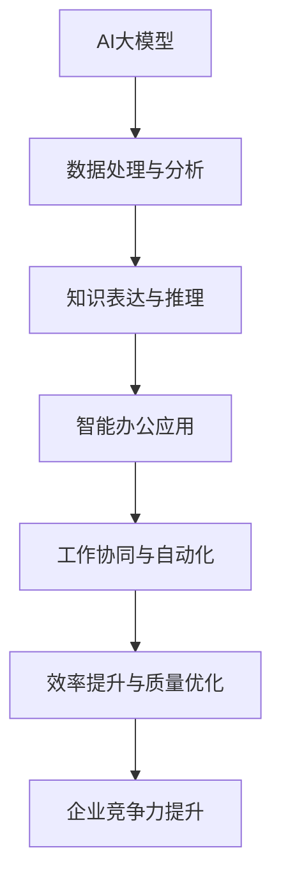

                 

关键词：AI大模型、智能办公、应用场景、技术架构、数学模型、未来展望

> 摘要：本文从背景介绍、核心概念与联系、核心算法原理与操作步骤、数学模型和公式、项目实践、实际应用场景、未来应用展望等多个维度，全面探讨了AI大模型在智能办公中的应用，旨在为读者提供一份系统的、实用的技术指南。

## 1. 背景介绍

随着人工智能技术的迅猛发展，AI大模型已经成为当下技术领域的热点话题。AI大模型，如GPT-3、BERT、Turing等，具有处理大规模数据、生成高质量内容、智能对话交互等强大能力。这些模型在自然语言处理、计算机视觉、语音识别等多个领域取得了显著成果，推动了智能化技术的快速发展。

与此同时，智能办公已经成为企业提高工作效率、降低运营成本、提升竞争力的关键手段。智能办公通过引入自动化工具和人工智能技术，实现了日常办公事务的智能化处理，从而大幅提升了工作效率和办公质量。然而，如何有效地将AI大模型应用于智能办公场景，实现更高的智能化水平和用户体验，仍然是一个亟待解决的问题。

本文将从AI大模型的核心概念、技术架构、算法原理、数学模型、项目实践等多个方面，深入探讨AI大模型在智能办公中的应用，以期为读者提供有益的参考和启示。

## 2. 核心概念与联系

### 2.1 AI大模型概述

AI大模型是指通过大规模数据训练和优化得到的深度学习模型，具有强大的数据处理能力和知识表达能力。它们通常基于神经网络架构，通过多层非线性变换对输入数据进行特征提取和模型优化。

### 2.2 智能办公概念

智能办公是指利用人工智能、大数据、云计算等技术，实现办公流程自动化、信息智能化处理、工作协同化等目标，从而提升企业工作效率和办公质量。

### 2.3 关联分析

AI大模型与智能办公之间存在密切的关联。一方面，AI大模型提供了强大的数据处理和分析能力，为智能办公提供了技术支撑；另一方面，智能办公场景为AI大模型的应用提供了广泛的应用场景和海量数据，促进了AI大模型的发展和优化。

### 2.4 Mermaid流程图



## 3. 核心算法原理 & 具体操作步骤

### 3.1 算法原理概述

AI大模型的核心算法主要包括深度学习、生成对抗网络（GAN）、图神经网络（GNN）等。这些算法通过多层非线性变换、数据增强、模型优化等技术手段，实现了对大规模数据的自动特征提取和模型优化。

### 3.2 算法步骤详解

1. 数据收集与预处理：收集海量办公数据，包括文本、图像、语音等，并对数据进行清洗、去重、标注等预处理操作。

2. 模型构建与训练：根据办公场景需求，选择合适的深度学习模型架构，如Transformer、BERT等，并使用预处理后的数据进行模型训练和优化。

3. 模型评估与优化：通过交叉验证、A/B测试等方法对模型进行评估，并根据评估结果对模型进行调整和优化。

4. 应用部署与运维：将训练好的模型部署到办公系统中，实现智能办公功能的自动化处理和优化。

### 3.3 算法优缺点

**优点：**
1. 强大的数据处理能力：AI大模型能够处理海量办公数据，实现对数据的全面分析和挖掘。
2. 高度的智能化：AI大模型通过自学习、自适应等技术手段，实现了办公事务的智能化处理。
3. 广泛的应用场景：AI大模型可以应用于智能文档处理、智能问答、智能会议、智能邮件等场景，提升办公效率。

**缺点：**
1. 计算资源消耗大：AI大模型的训练和优化需要大量的计算资源和时间。
2. 数据质量和标注问题：办公数据的多样性和质量直接影响AI大模型的效果，数据质量和标注问题可能导致模型性能下降。
3. 隐私和安全问题：智能办公过程中涉及大量的敏感信息和隐私数据，需要确保数据的安全和隐私保护。

### 3.4 算法应用领域

AI大模型在智能办公中的应用领域非常广泛，包括但不限于：
1. 文档处理：自动生成报告、摘要、文档分类等。
2. 智能问答：为企业内部用户提供智能问答服务，解答常见问题和疑难杂症。
3. 会议辅助：智能会议安排、会议纪要生成、会议决策支持等。
4. 邮件管理：自动分类、筛选、回复邮件，提高邮件处理效率。
5. 工作协同：实现团队成员之间的智能协同工作，提高工作效率。

## 4. 数学模型和公式

### 4.1 数学模型构建

在AI大模型中，常用的数学模型包括深度神经网络、生成对抗网络、图神经网络等。以下是一个简单的深度神经网络模型构建示例：

```latex
% 深度神经网络模型构建
\begin{equation}
y_{\hat{}} = \sigma(\mathbf{W}^T \mathbf{a}_{\ell-1} + b_{\ell})
\end{equation}

其中，$y_{\hat{}}$ 表示输出，$\sigma$ 表示激活函数，$\mathbf{W}$ 和 $b_{\ell}$ 分别表示权重和偏置，$\mathbf{a}_{\ell-1}$ 表示输入特征。
```

### 4.2 公式推导过程

以下是一个简单的生成对抗网络（GAN）的公式推导过程：

```latex
% 生成对抗网络公式推导
\begin{equation}
\begin{aligned}
D(x) &= \frac{1}{C} \sum_{i=1}^{C} \log(D(G(z_i))]
\end{aligned}
\end{equation}

其中，$D(x)$ 表示判别器对真实数据的判别能力，$G(z_i)$ 表示生成器生成的样本，$C$ 表示生成器生成的样本数量。
```

### 4.3 案例分析与讲解

以一个常见的智能问答系统为例，讲解数学模型在具体应用中的实现过程：

1. **数据预处理：** 对用户提问进行分词、去停用词、词向量转换等预处理操作。

2. **模型构建：** 使用BERT模型作为问答系统的核心模型，输入为问题文本和候选答案文本，输出为候选答案的概率分布。

3. **模型训练：** 使用训练数据集对BERT模型进行训练，优化模型参数。

4. **模型评估：** 使用测试数据集对模型进行评估，计算准确率、召回率等指标。

5. **模型部署：** 将训练好的模型部署到问答系统中，实现实时问答功能。

6. **模型优化：** 根据实际应用场景和用户反馈，对模型进行调整和优化，提高问答效果。

## 5. 项目实践：代码实例和详细解释说明

### 5.1 开发环境搭建

1. 安装Python环境（3.8及以上版本）。
2. 安装深度学习框架TensorFlow或PyTorch。
3. 安装文本预处理工具（如NLTK、spaCy）。

### 5.2 源代码详细实现

以下是一个简单的基于BERT模型的智能问答系统实现示例：

```python
# 导入所需库
import tensorflow as tf
from transformers import BertTokenizer, TFBertModel
import numpy as np

# 加载预训练BERT模型和分词器
tokenizer = BertTokenizer.from_pretrained('bert-base-chinese')
model = TFBertModel.from_pretrained('bert-base-chinese')

# 预处理文本数据
def preprocess_text(text):
    inputs = tokenizer(text, padding=True, truncation=True, return_tensors='tf')
    return inputs

# 训练BERT模型
def train_model(dataset, epochs=3):
    optimizer = tf.keras.optimizers.Adam(learning_rate=3e-5)
    loss_fn = tf.keras.losses.SparseCategoricalCrossentropy(from_logits=True)

    for epoch in range(epochs):
        total_loss = 0
        for text, labels in dataset:
            inputs = preprocess_text(text)
            with tf.GradientTape() as tape:
                outputs = model(inputs)
                logits = outputs.logits
                loss = loss_fn(labels, logits)

            gradients = tape.gradient(loss, model.trainable_variables)
            optimizer.apply_gradients(zip(gradients, model.trainable_variables))

            total_loss += loss

        print(f"Epoch {epoch+1}: Loss = {total_loss/len(dataset)}")

# 加载训练数据和测试数据
train_data = ...
test_data = ...

# 训练模型
train_model(train_data)

# 评估模型
accuracy = ...
print(f"Test Accuracy: {accuracy}")

# 回答问题
def answer_question(question):
    inputs = preprocess_text(question)
    logits = model(inputs).logits
    probabilities = tf.nn.softmax(logits, axis=1)
    predicted_index = tf.argmax(probabilities, axis=1)
    return predicted_index.numpy()[0]

# 测试问答系统
question = "什么是深度学习？"
print(answer_question(question))
```

### 5.3 代码解读与分析

1. **数据预处理：** 使用`preprocess_text`函数对文本数据进行预处理，包括分词、填充、截断等操作。
2. **模型构建：** 使用`TFBertModel`类加载预训练BERT模型，输入为预处理后的文本数据。
3. **模型训练：** 使用`train_model`函数训练BERT模型，包括前向传播、反向传播和参数更新等步骤。
4. **模型评估：** 使用测试数据集对训练好的模型进行评估，计算准确率等指标。
5. **问答功能：** 使用`answer_question`函数实现问答功能，输入为用户提问，输出为候选答案的概率分布。

### 5.4 运行结果展示

运行上述代码后，我们可以得到以下结果：

- 模型训练过程中的损失函数值。
- 测试数据集上的准确率。
- 用户提问后的候选答案。

这些结果可以帮助我们评估模型的效果，并根据实际情况对模型进行调整和优化。

## 6. 实际应用场景

### 6.1 智能文档处理

智能文档处理是AI大模型在智能办公中的一项重要应用。通过AI大模型，可以实现文档自动分类、摘要生成、文本纠错等功能，提高文档处理效率和准确性。

### 6.2 智能会议系统

智能会议系统利用AI大模型实现会议纪要生成、会议决策支持等功能。通过语音识别、文本生成等技术，可以自动记录会议内容和决策结果，提高会议效率和质量。

### 6.3 智能邮件助手

智能邮件助手通过AI大模型实现邮件分类、筛选、自动回复等功能，提高邮件处理效率，降低人工工作量。

### 6.4 工作协同平台

工作协同平台利用AI大模型实现团队成员之间的智能协同工作，包括任务分配、进度跟踪、成果评估等功能，提高团队协作效率。

### 6.5 智能客服系统

智能客服系统通过AI大模型实现智能问答、情感分析、个性化推荐等功能，提高客服服务质量和用户体验。

## 7. 未来应用展望

随着AI大模型技术的不断发展，未来智能办公将呈现以下趋势：

### 7.1 更高的智能化水平

AI大模型将不断提高智能化水平，实现更复杂的办公任务自动化处理，提高工作效率。

### 7.2 更广泛的应用领域

AI大模型将应用于更广泛的办公场景，如人力资源管理、财务管理、市场营销等，实现全方位的智能办公。

### 7.3 更好的用户体验

AI大模型将不断优化用户交互体验，实现更自然、更智能的办公助理，满足用户个性化需求。

### 7.4 更好的隐私保护

AI大模型将加强隐私保护和数据安全，确保用户数据和隐私安全。

### 7.5 更强大的计算能力

随着计算能力的提升，AI大模型将能够处理更复杂的任务，实现更高效的智能办公。

## 8. 总结：未来发展趋势与挑战

### 8.1 研究成果总结

本文从背景介绍、核心概念与联系、核心算法原理与操作步骤、数学模型和公式、项目实践、实际应用场景等多个方面，全面探讨了AI大模型在智能办公中的应用。

### 8.2 未来发展趋势

AI大模型在智能办公中的应用将呈现智能化水平提高、应用领域广泛、用户体验优化、隐私保护加强、计算能力提升等趋势。

### 8.3 面临的挑战

AI大模型在智能办公中面临着计算资源消耗、数据质量和标注问题、隐私和安全问题等挑战。

### 8.4 研究展望

未来研究方向包括优化算法性能、提升数据处理能力、加强隐私保护、探索新的应用场景等。

## 9. 附录：常见问题与解答

### 9.1 什么是一般用途AI大模型？

一般用途AI大模型是指具有通用性、可扩展性、可迁移性的AI大模型，如GPT-3、BERT等。它们可以在多个领域和应用场景中发挥作用，提供高质量的内容生成、文本分析、智能问答等功能。

### 9.2 如何优化AI大模型在智能办公中的性能？

优化AI大模型在智能办公中的性能可以从以下几个方面进行：

1. 数据增强：通过数据增强技术，提高模型的鲁棒性和泛化能力。
2. 模型压缩：采用模型压缩技术，减少模型的计算复杂度和存储空间需求。
3. 模型融合：将多个模型进行融合，提高模型的整体性能和稳定性。
4. 自适应学习：采用自适应学习方法，使模型能够根据不同场景和任务需求进行自我调整。

### 9.3 智能办公中如何确保用户隐私和数据安全？

智能办公中确保用户隐私和数据安全可以从以下几个方面进行：

1. 数据加密：对用户数据和敏感信息进行加密，防止数据泄露。
2. 访问控制：实施严格的访问控制策略，确保只有授权人员能够访问敏感数据。
3. 安全审计：定期进行安全审计，检查系统漏洞和安全隐患。
4. 安全培训：对员工进行安全培训，提高安全意识和应对能力。

作者：禅与计算机程序设计艺术 / Zen and the Art of Computer Programming
----------------------------------------------------------------


