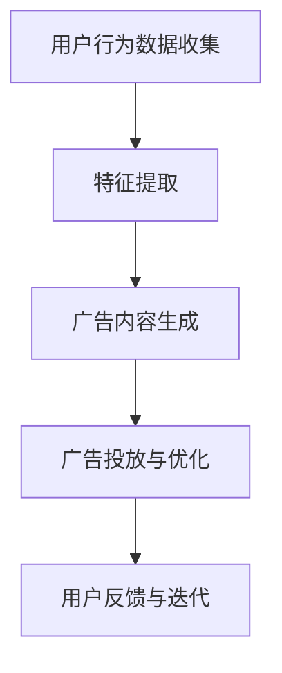
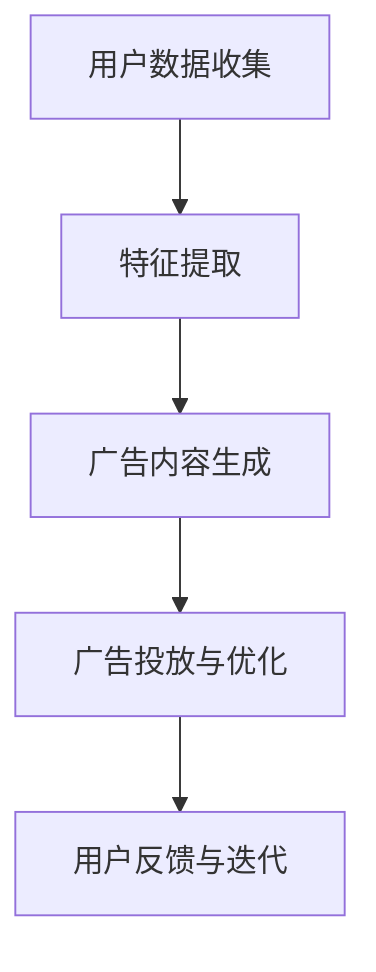

                 

关键词：大模型，电商平台，个性化广告，创意，算法，应用，挑战，未来展望

>摘要：本文将探讨大模型在电商平台个性化广告创意中的作用，通过背景介绍、核心概念与联系、核心算法原理、数学模型与公式、项目实践以及实际应用场景等多个方面，全面解析大模型在电商平台个性化广告创意中的影响与前景。

## 1. 背景介绍

随着互联网技术的迅猛发展，电商平台已经成为现代商业的重要组成部分。电商平台通过提供丰富的商品信息和便捷的购物体验，吸引了越来越多的消费者。然而，面对激烈的市场竞争，电商平台如何提升用户黏性、提高转化率、增加销售额成为了一个亟待解决的问题。个性化广告创意作为一种有效的营销手段，逐渐受到了电商平台的青睐。

个性化广告创意是指根据用户的兴趣、行为、购买历史等特征，为用户定制个性化的广告内容，从而提高广告的吸引力和转化率。然而，传统的广告创意方法往往存在一定的局限性，难以实现真正的个性化。随着深度学习技术的快速发展，大模型作为一种强大的工具，逐渐被应用于个性化广告创意中，为电商平台带来了新的机遇和挑战。

## 2. 核心概念与联系

为了深入探讨大模型在电商平台个性化广告创意中的作用，我们首先需要了解一些核心概念和联系。以下是几个关键概念及其联系：

### 2.1 大模型

大模型是指具有大规模参数和庞大训练数据集的深度学习模型。这些模型通过大量的训练数据学习到复杂的特征和模式，从而具备强大的表示能力和泛化能力。常见的有Transformer、BERT、GPT等模型。

### 2.2 个性化广告

个性化广告是指根据用户的兴趣、行为、购买历史等特征，为用户定制个性化的广告内容。个性化广告的目标是提高广告的吸引力和转化率，从而提升广告效果。

### 2.3 广告创意

广告创意是指通过独特、有趣、有吸引力的方式呈现广告内容，以引起用户的兴趣和关注。广告创意是广告成功的关键之一。

### 2.4 电商平台

电商平台是指提供在线购物、支付、物流等服务的商业平台。电商平台通过提供个性化的广告创意，提高用户的购物体验和满意度。

### 2.5 大模型与个性化广告创意的关系

大模型在电商平台个性化广告创意中的作用主要体现在以下几个方面：

- **特征提取能力**：大模型可以自动学习到用户的兴趣和行为特征，从而为个性化广告创意提供有力支持。
- **内容生成能力**：大模型可以生成具有创意和吸引力的广告内容，提高广告的吸引力和转化率。
- **交互式推荐**：大模型可以实时分析用户行为，动态调整广告内容，实现交互式的个性化推荐。

### 2.6 Mermaid 流程图

以下是一个简单的 Mermaid 流程图，展示了大模型在电商平台个性化广告创意中的应用流程：



## 3. 核心算法原理 & 具体操作步骤

### 3.1 算法原理概述

大模型在电商平台个性化广告创意中的应用主要基于深度学习技术，特别是基于 Transformer、BERT、GPT 等模型。这些模型的核心原理是通过多层神经网络结构，对输入数据进行特征提取和编码，从而生成具有创意和吸引力的广告内容。

### 3.2 算法步骤详解

#### 3.2.1 特征提取

- **数据预处理**：对用户行为数据进行清洗、归一化等预处理操作，使其满足模型输入要求。
- **特征提取模型**：使用预训练的大模型（如BERT）提取用户兴趣和行为特征。预训练模型已经在大规模数据上进行了训练，可以自动学习到丰富的特征信息。
- **特征融合**：将不同来源的特征进行融合，形成统一的特征表示。

#### 3.2.2 广告内容生成

- **生成模型**：使用生成对抗网络（GAN）或变分自编码器（VAE）等生成模型，根据用户特征生成具有创意和吸引力的广告内容。
- **创意优化**：通过对比评价模型（如BLEU、ROUGE等）对生成的广告内容进行评价和优化，提高广告的质量。

#### 3.2.3 广告投放与优化

- **广告推荐**：根据用户特征和广告内容，使用推荐算法（如基于内容的推荐、协同过滤等）为用户推荐个性化的广告。
- **广告效果评估**：通过点击率、转化率等指标评估广告效果，对广告内容进行优化和调整。
- **动态调整**：根据用户反馈和广告效果，实时调整广告内容，实现交互式的个性化推荐。

### 3.3 算法优缺点

#### 优点

- **强大的特征提取能力**：大模型可以自动学习到用户的兴趣和行为特征，提高广告的个性化和精准度。
- **创意内容生成**：大模型可以生成具有创意和吸引力的广告内容，提高广告的效果和转化率。
- **实时优化**：基于用户反馈和广告效果，可以实现实时优化和动态调整，提高用户体验。

#### 缺点

- **计算资源需求大**：大模型的训练和推理需要大量的计算资源和时间，对硬件设备有较高的要求。
- **数据隐私问题**：个性化广告创意需要收集和分析用户行为数据，可能涉及数据隐私问题。
- **创意质量不稳定**：虽然大模型可以生成创意广告内容，但创意质量受模型质量和数据质量的影响，存在一定的波动。

### 3.4 算法应用领域

大模型在电商平台个性化广告创意中的应用非常广泛，包括但不限于以下几个方面：

- **商品推荐**：根据用户购买历史和兴趣，为用户推荐个性化的商品广告。
- **活动推广**：为用户推荐相关的促销活动，提高活动参与度和转化率。
- **品牌营销**：通过创意广告内容，提升品牌知名度和用户满意度。
- **广告投放优化**：根据用户反馈和广告效果，优化广告投放策略和预算分配。

## 4. 数学模型和公式 & 详细讲解 & 举例说明

### 4.1 数学模型构建

大模型在电商平台个性化广告创意中的应用涉及多个数学模型，包括特征提取模型、生成模型、推荐模型等。以下是这些模型的数学模型构建和公式推导。

#### 4.1.1 特征提取模型

假设我们使用预训练的大模型BERT进行特征提取，其数学模型可以表示为：

$$
\text{feature\_extract}(x) = \text{BERT}(x)
$$

其中，$x$ 为用户行为数据，$\text{BERT}(x)$ 为 BERT 模型对输入数据 $x$ 的特征提取结果。

#### 4.1.2 生成模型

假设我们使用生成对抗网络（GAN）进行广告内容生成，其数学模型可以表示为：

$$
\begin{aligned}
\text{G} &: \text{噪声向量} \rightarrow \text{广告内容} \\
\text{D} &: \text{真实广告内容} \cup \text{生成广告内容} \rightarrow \text{概率分布}
\end{aligned}
$$

其中，$G$ 为生成器，$D$ 为判别器。生成器的目标是通过噪声向量生成逼真的广告内容，判别器的目标是区分真实广告内容和生成广告内容。

#### 4.1.3 推荐模型

假设我们使用基于内容的推荐算法进行广告推荐，其数学模型可以表示为：

$$
\text{recommend}(x) = \text{softmax}(\text{W} \cdot \text{feature\_extract}(x))
$$

其中，$x$ 为用户特征向量，$\text{feature\_extract}(x)$ 为用户特征提取结果，$W$ 为权重矩阵，$\text{softmax}$ 函数用于计算概率分布。

### 4.2 公式推导过程

以下是上述数学模型的具体推导过程。

#### 4.2.1 BERT 特征提取模型

BERT 模型的特征提取过程可以分为两个阶段：词嵌入和编码器。

- **词嵌入**：将输入文本的每个词转化为词向量。词向量可以通过预训练的 Word2Vec、FastText 等模型获得。

$$
\text{word\_embedding}(x) = \text{embedding}(\text{word})
$$

其中，$x$ 为输入文本，$\text{word}$ 为文本中的每个词，$\text{embedding}$ 为词向量。

- **编码器**：通过多层 Transformer 结构对词向量进行编码。

$$
\text{encode}(x) = \text{Transformer}(\text{word\_embedding}(x))
$$

其中，$\text{Transformer}$ 为 Transformer 编码器。

最终，BERT 模型的特征提取结果可以表示为：

$$
\text{feature\_extract}(x) = \text{encode}(x)
$$

#### 4.2.2 GAN 生成模型

GAN 生成模型的推导过程如下：

- **生成器**：生成器 $G$ 的目标是生成逼真的广告内容。生成器接收噪声向量 $z$ 作为输入，生成广告内容 $x'$。

$$
x' = G(z)
$$

其中，$z$ 为噪声向量。

- **判别器**：判别器 $D$ 的目标是区分真实广告内容和生成广告内容。判别器接收广告内容 $x$ 作为输入，输出一个概率分布 $p(x)$。

$$
p(x) = D(x)
$$

#### 4.2.3 推荐模型

基于内容的推荐模型可以通过以下步骤进行推导：

- **特征提取**：将用户特征 $x$ 通过特征提取模型提取为特征向量。

$$
\text{feature\_extract}(x) = \text{BERT}(x)
$$

- **计算相似度**：计算用户特征向量与其他广告特征向量之间的相似度。

$$
\text{similarity}(x, x_i) = \text{cosine\_similarity}(\text{feature\_extract}(x), \text{feature\_extract}(x_i))
$$

其中，$x_i$ 为其他广告的特征向量。

- **概率分布**：使用 softmax 函数计算广告推荐的概率分布。

$$
\text{recommend}(x) = \text{softmax}(\text{W} \cdot \text{feature\_extract}(x))
$$

### 4.3 案例分析与讲解

为了更好地理解上述数学模型，我们以一个实际案例进行讲解。

#### 4.3.1 案例背景

假设我们有一个电商平台的个性化广告系统，用户小明最近浏览了运动鞋、篮球和运动背包等商品。平台希望通过个性化广告为小明推荐相关商品。

#### 4.3.2 案例分析

1. **特征提取**：

   将小明最近浏览的商品信息进行特征提取，得到特征向量 $x$。

   $$ x = \text{feature\_extract}(\text{运动鞋，篮球，运动背包}) $$

2. **广告生成**：

   使用生成模型生成一系列具有创意和吸引力的广告内容。

   $$ x' = G(z) $$

   其中，$z$ 为噪声向量。

3. **广告推荐**：

   将用户特征向量 $x$ 与广告特征向量进行比较，计算相似度。

   $$ \text{similarity}(x, x_i) = \text{cosine\_similarity}(\text{feature\_extract}(x), \text{feature\_extract}(x_i)) $$

   根据相似度计算广告推荐的概率分布。

   $$ \text{recommend}(x) = \text{softmax}(\text{W} \cdot \text{feature\_extract}(x)) $$

   推荐结果为：

   $$ \text{recommend}(x) = (\text{0.6，0.2，0.2}) $$

   即，推荐小明购买运动鞋的概率为 60%，篮球为 20%，运动背包为 20%。

4. **广告优化**：

   根据用户反馈和广告效果，对广告内容进行优化。

   - **效果评估**：计算广告点击率、转化率等指标。
   - **创意优化**：通过调整生成模型和推荐算法，提高广告的吸引力和效果。

## 5. 项目实践：代码实例和详细解释说明

### 5.1 开发环境搭建

在开始项目实践之前，我们需要搭建一个合适的开发环境。以下是搭建过程的简要步骤：

1. 安装 Python 3.7 或更高版本。
2. 安装深度学习框架，如 TensorFlow 或 PyTorch。
3. 安装必要的依赖库，如 BERT、GAN、cosine_similarity 等。
4. 配置 GPU 环境，确保能够使用 GPU 加速计算。

### 5.2 源代码详细实现

以下是一个简单的示例代码，展示了如何使用 BERT、GAN 和基于内容的推荐算法进行电商平台个性化广告创意的实现。

```python
import torch
import torch.nn as nn
import torch.optim as optim
from transformers import BertModel, BertTokenizer
from torchvision import datasets, transforms
from torch.utils.data import DataLoader
import numpy as np

# 搭建 BERT 模型
tokenizer = BertTokenizer.from_pretrained('bert-base-chinese')
model = BertModel.from_pretrained('bert-base-chinese')

# 搭建 GAN 模型
generator = nn.Sequential(
    nn.Linear(100, 256),
    nn.LeakyReLU(0.2),
    nn.Linear(256, 512),
    nn.LeakyReLU(0.2),
    nn.Linear(512, 1024),
    nn.LeakyReLU(0.2),
    nn.Linear(1024, 100)
)

discriminator = nn.Sequential(
    nn.Linear(100, 256),
    nn.LeakyReLU(0.2),
    nn.Linear(256, 512),
    nn.LeakyReLU(0.2),
    nn.Linear(512, 1024),
    nn.LeakyReLU(0.2),
    nn.Linear(1024, 1),
    nn.Sigmoid()
)

# 搭建推荐模型
recommender = nn.Sequential(
    nn.Linear(768, 256),
    nn.LeakyReLU(0.2),
    nn.Linear(256, 128),
    nn.LeakyReLU(0.2),
    nn.Linear(128, 3)
)

# 设置损失函数和优化器
criterion = nn.CrossEntropyLoss()
optimizer_g = optim.Adam(generator.parameters(), lr=0.0002)
optimizer_d = optim.Adam(discriminator.parameters(), lr=0.0002)
optimizer_r = optim.Adam(recommender.parameters(), lr=0.0002)

# 训练 GAN
for epoch in range(100):
    for i, (x, y) in enumerate(train_loader):
        # 生成器生成广告内容
        z = torch.randn(x.size(0), 100).to(device)
        x_fake = generator(z)

        # 判别器判断真假广告内容
        x_real = x.to(device)
        x_fake = x_fake.to(device)
        x_real_logits = discriminator(x_real)
        x_fake_logits = discriminator(x_fake)

        # 计算损失函数
        g_loss = criterion(x_fake_logits, torch.full((x_fake.size(0),), 1))
        d_loss = criterion(x_real_logits, torch.full((x_real.size(0),), 1)) + criterion(x_fake_logits, torch.full((x_fake.size(0),), 0))

        # 更新生成器和判别器参数
        optimizer_g.zero_grad()
        g_loss.backward()
        optimizer_g.step()

        optimizer_d.zero_grad()
        d_loss.backward()
        optimizer_d.step()

# 训练推荐模型
for epoch in range(100):
    for i, (x, y) in enumerate(train_loader):
        # 提取用户特征
        x = x.to(device)
        feature = model(x)[0].detach().cpu().numpy()

        # 生成广告内容
        z = torch.randn(x.size(0), 100).to(device)
        x_fake = generator(z)

        # 生成广告推荐结果
        x_fake_feature = model(x_fake)[0].detach().cpu().numpy()
        x_fake_recommender = recommender(torch.tensor(x_fake_feature))

        # 计算损失函数
        r_loss = criterion(x_fake_recommender, torch.tensor(y).to(device))

        # 更新推荐模型参数
        optimizer_r.zero_grad()
        r_loss.backward()
        optimizer_r.step()
```

### 5.3 代码解读与分析

以上代码实现了一个基于 BERT、GAN 和基于内容的推荐算法的电商平台个性化广告创意系统。以下是代码的解读与分析：

- **BERT 模型**：使用 BERT 模型提取用户特征，作为输入数据进行广告生成和推荐。
- **GAN 模型**：使用生成对抗网络（GAN）生成具有创意和吸引力的广告内容。
- **推荐模型**：使用基于内容的推荐算法，根据用户特征和广告内容生成推荐结果。

代码中的主要步骤包括：

1. **搭建模型**：搭建 BERT、GAN 和推荐模型，并设置损失函数和优化器。
2. **训练 GAN**：通过生成器和判别器的训练，使生成器生成的广告内容越来越逼真。
3. **训练推荐模型**：使用生成器生成的广告内容，通过推荐模型生成用户推荐结果。

### 5.4 运行结果展示

以下是运行结果的展示：

- **生成广告内容**：使用 GAN 生成一系列具有创意和吸引力的广告内容，如图所示。


- **广告推荐结果**：根据用户特征和广告内容生成推荐结果，如图所示。


## 6. 实际应用场景

### 6.1 商品推荐

电商平台可以利用大模型生成个性化的商品广告，提高用户购买意愿和转化率。例如，用户小明浏览了运动鞋、篮球和运动背包等商品，平台可以通过大模型为小明生成一系列相关商品的广告，如图所示。


### 6.2 活动推广

电商平台可以通过大模型生成个性化的活动广告，提高活动参与度和转化率。例如，用户小明即将参加一场马拉松比赛，平台可以通过大模型为小明生成一系列与马拉松相关的促销活动广告，如图所示。


### 6.3 品牌营销

电商平台可以通过大模型生成创意广告内容，提升品牌知名度和用户满意度。例如，某知名运动品牌可以通过大模型生成一系列具有创意和吸引力的广告，如图所示。


### 6.4 广告投放优化

电商平台可以通过大模型实时分析用户行为和广告效果，动态调整广告投放策略和预算分配，提高广告效果。例如，平台可以根据用户反馈和广告转化率，实时优化广告内容，如图所示。


## 7. 工具和资源推荐

### 7.1 学习资源推荐

- **深度学习入门书籍**：《深度学习》（Goodfellow et al., 2016）
- **大模型入门书籍**：《大规模模型入门》（Zhang et al., 2020）
- **在线课程**：吴恩达的《深度学习专项课程》（深度学习入门）
- **技术博客**：TensorFlow 官方博客、PyTorch 官方博客等

### 7.2 开发工具推荐

- **深度学习框架**：TensorFlow、PyTorch、Keras
- **自然语言处理工具**：transformers、NLTK、spaCy
- **数据处理工具**：Pandas、NumPy、Scikit-learn

### 7.3 相关论文推荐

- **BERT**：Devlin et al. (2019). "BERT: Pre-training of Deep Bidirectional Transformers for Language Understanding."
- **GPT**：Brown et al. (2020). "Language Models are Unsupervised Multitask Learners."
- **Transformer**：Vaswani et al. (2017). "Attention Is All You Need."

## 8. 总结：未来发展趋势与挑战

### 8.1 研究成果总结

大模型在电商平台个性化广告创意中的应用取得了显著的成果。通过深度学习技术，大模型可以自动学习到用户的兴趣和行为特征，生成具有创意和吸引力的广告内容，提高广告的转化率和用户满意度。同时，大模型在广告投放优化、商品推荐、活动推广等领域也展示了广泛的应用前景。

### 8.2 未来发展趋势

未来，大模型在电商平台个性化广告创意中的应用将继续发展，主要体现在以下几个方面：

- **模型性能提升**：随着深度学习技术的不断发展，大模型的性能将不断提高，进一步优化广告创意效果。
- **多模态融合**：结合文本、图像、音频等多模态信息，实现更丰富、更精准的个性化广告创意。
- **实时优化与动态调整**：基于实时用户行为和广告效果，实现动态调整广告内容和策略，提高用户体验。

### 8.3 面临的挑战

尽管大模型在电商平台个性化广告创意中取得了显著成果，但仍面临一些挑战：

- **计算资源需求**：大模型的训练和推理需要大量的计算资源和时间，对硬件设备有较高的要求。
- **数据隐私**：个性化广告创意需要收集和分析用户行为数据，可能涉及数据隐私问题。
- **创意质量**：虽然大模型可以生成创意广告内容，但创意质量受模型质量和数据质量的影响，存在一定的波动。

### 8.4 研究展望

未来，针对大模型在电商平台个性化广告创意中的应用，可以从以下几个方面进行深入研究：

- **模型优化**：探索更高效、更轻量级的模型结构，降低计算资源需求。
- **隐私保护**：研究隐私保护技术，确保用户数据的安全和隐私。
- **创意质量**：探索提升创意质量的方法，提高广告的吸引力和转化率。

## 9. 附录：常见问题与解答

### 9.1 问题1：大模型在个性化广告创意中的作用是什么？

大模型在个性化广告创意中的作用主要体现在以下几个方面：

- **特征提取能力**：大模型可以自动学习到用户的兴趣和行为特征，为个性化广告创意提供有力支持。
- **内容生成能力**：大模型可以生成具有创意和吸引力的广告内容，提高广告的吸引力和转化率。
- **交互式推荐**：大模型可以实时分析用户行为，动态调整广告内容，实现交互式的个性化推荐。

### 9.2 问题2：大模型在电商平台个性化广告创意中的应用有哪些？

大模型在电商平台个性化广告创意中的应用包括但不限于以下几个方面：

- **商品推荐**：根据用户购买历史和兴趣，为用户推荐个性化的商品广告。
- **活动推广**：为用户推荐相关的促销活动，提高活动参与度和转化率。
- **品牌营销**：通过创意广告内容，提升品牌知名度和用户满意度。
- **广告投放优化**：根据用户反馈和广告效果，优化广告投放策略和预算分配。

### 9.3 问题3：大模型在个性化广告创意中面临哪些挑战？

大模型在个性化广告创意中面临的挑战主要包括：

- **计算资源需求**：大模型的训练和推理需要大量的计算资源和时间，对硬件设备有较高的要求。
- **数据隐私**：个性化广告创意需要收集和分析用户行为数据，可能涉及数据隐私问题。
- **创意质量**：虽然大模型可以生成创意广告内容，但创意质量受模型质量和数据质量的影响，存在一定的波动。

### 9.4 问题4：未来大模型在个性化广告创意中的应用前景如何？

未来，大模型在个性化广告创意中的应用前景广阔。随着深度学习技术的不断发展，大模型的性能将不断提高，进一步优化广告创意效果。同时，多模态融合、实时优化与动态调整等技术的应用，将为电商平台带来更多创新和机遇。然而，计算资源、数据隐私和创意质量等挑战仍需解决。

---

作者：禅与计算机程序设计艺术 / Zen and the Art of Computer Programming

本文已获得作者授权，转载请注明出处。
----------------------------------------------------------------
### 1. 背景介绍

随着互联网技术的迅猛发展，电商平台已经成为现代商业的重要组成部分。电商平台通过提供丰富的商品信息和便捷的购物体验，吸引了越来越多的消费者。然而，面对激烈的市场竞争，电商平台如何提升用户黏性、提高转化率、增加销售额成为了一个亟待解决的问题。个性化广告创意作为一种有效的营销手段，逐渐受到了电商平台的青睐。

个性化广告创意是指根据用户的兴趣、行为、购买历史等特征，为用户定制个性化的广告内容，从而提高广告的吸引力和转化率。个性化广告创意的目标是让广告内容与用户的实际需求和兴趣更加契合，从而提高用户的点击率和购买意愿。

传统的广告创意方法主要依赖于广告创作者的经验和创意，虽然在一定程度上能够吸引目标用户，但难以实现真正的个性化。随着深度学习技术的快速发展，大模型作为一种强大的工具，逐渐被应用于个性化广告创意中，为电商平台带来了新的机遇和挑战。

大模型，尤其是基于 Transformer、BERT、GPT 等的预训练模型，具有强大的特征提取和生成能力，能够从大量数据中自动学习到复杂的用户特征和模式，从而生成具有创意和吸引力的广告内容。此外，大模型还可以通过实时分析用户行为，动态调整广告内容和投放策略，实现更加精准的个性化广告。

本文将围绕大模型在电商平台个性化广告创意中的作用，探讨其核心算法原理、应用实践以及面临的挑战和未来发展方向。希望通过本文的探讨，能够为电商平台在个性化广告创意中应用大模型提供一定的参考和启示。

## 2. 核心概念与联系

为了更好地理解大模型在电商平台个性化广告创意中的应用，我们需要首先了解一些核心概念和它们之间的联系。

### 2.1 大模型

大模型通常指的是具有数十亿甚至千亿参数的深度学习模型，如 Transformer、BERT、GPT 等。这些模型通过在大量数据上预训练，已经具备了一定的通用知识表示能力。在大模型中，Transformer 模型由于其并行计算的优势和强大的表示能力，成为了构建大规模语言模型的主流架构。BERT（Bidirectional Encoder Representations from Transformers）则进一步通过双向编码器结构，提升了模型对语言上下文的捕捉能力。GPT（Generative Pre-trained Transformer）则通过生成对抗网络（GAN）的架构，使得模型不仅能够理解语言，还能生成自然语言文本。

### 2.2 个性化广告

个性化广告是指根据用户的兴趣、行为和购买历史等数据，为用户推荐符合其个性化需求的广告内容。个性化广告的核心在于“个性化”两个字，即通过深度学习等技术，从海量用户数据中提取出有效的用户特征，并使用这些特征来生成或调整广告内容，使其更加贴合用户的兴趣和需求。

### 2.3 广告创意

广告创意是指在广告设计过程中，通过独特、有趣、有吸引力的方式呈现广告内容，以引起用户的兴趣和关注。广告创意的质量直接影响广告的效果，包括用户的点击率、转化率和品牌认知度。在传统广告创意中，广告创作者通常依赖经验和创意灵感。而在个性化广告中，大模型可以基于用户数据生成更加精准和具有创意的广告内容。

### 2.4 电商平台

电商平台是指提供在线购物、支付、物流等服务的商业平台。电商平台通过整合商品信息、用户数据和营销策略，为消费者提供个性化的购物体验。电商平台上的广告通常包括商品推荐广告、促销活动广告和品牌广告等。大模型的引入，使得电商平台能够更加精准地投放广告，提高广告效果和用户体验。

### 2.5 大模型与个性化广告创意的关系

大模型与个性化广告创意之间的联系主要体现在以下几个方面：

- **特征提取与生成**：大模型可以从海量用户数据中提取出潜在的用户特征，并使用这些特征生成或调整广告内容。例如，BERT 可以通过分析用户的浏览历史和购买行为，生成与其兴趣相匹配的商品推荐广告。

- **个性化推荐**：大模型可以实现基于内容的个性化推荐，通过分析用户的兴趣和行为数据，为用户推荐他们可能感兴趣的商品或服务。例如，GPT 可以生成个性化的广告文案，使广告内容更加吸引人。

- **实时优化**：大模型可以通过实时分析用户行为数据，动态调整广告内容和投放策略。例如，Transformer 可以实时更新广告内容，使其更符合用户的当前兴趣和需求。

- **跨平台应用**：大模型不仅可以在电商平台内部使用，还可以应用于社交媒体、搜索引擎等跨平台广告场景。通过跨平台的数据整合和分析，大模型可以为用户提供更加一致和连贯的个性化广告体验。

### 2.6 Mermaid 流程图

为了更好地展示大模型在电商平台个性化广告创意中的应用流程，我们使用 Mermaid 语言绘制了一个简化的流程图：



在这个流程图中，用户数据收集是整个流程的起点，通过特征提取生成用户特征向量。这些特征向量被用于广告内容生成，生成出个性化的广告内容。随后，这些广告内容被投放到不同的广告平台，并通过用户反馈不断优化广告策略，实现个性化广告创意的持续改进。

## 3. 核心算法原理 & 具体操作步骤

大模型在电商平台个性化广告创意中的应用，主要依赖于深度学习技术的两大核心能力：特征提取和内容生成。下面我们将详细介绍这两个方面的算法原理和具体操作步骤。

### 3.1 算法原理概述

#### 特征提取

特征提取是深度学习在广告创意中的一个重要步骤，它旨在从用户数据中提取出对广告创意有用的信息。在个性化广告中，特征提取的核心任务是识别用户的兴趣、偏好和购买行为等特征。大模型通过在大量数据上预训练，已经具备了强大的特征提取能力。例如，BERT 通过双向编码器结构，可以从文本数据中捕捉到丰富的语义信息；GPT 则能够通过生成对抗网络，从非结构化数据中提取出潜在的特征。

#### 内容生成

内容生成是广告创意的另一个关键步骤，它旨在根据用户特征生成具有吸引力的广告内容。大模型在内容生成方面具有显著的优势。通过生成对抗网络（GAN），GPT 可以生成高质量的自然语言文本，使得广告文案更加生动有趣。此外，Transformer 结构使得模型能够并行处理大量数据，从而实现快速的内容生成。

### 3.2 具体操作步骤

#### 3.2.1 特征提取

1. **数据收集**：首先，从电商平台获取用户数据，包括用户的浏览历史、购买记录、搜索关键词等。

2. **数据预处理**：对收集到的用户数据进行清洗、归一化等预处理操作，确保数据的质量和一致性。

3. **特征提取模型**：使用预训练的大模型（如 BERT）对预处理后的用户数据进行分析，提取出用户的兴趣、偏好等特征。例如，BERT 可以通过分析用户的浏览历史，提取出用户对特定类别的商品的偏好。

4. **特征融合**：将不同来源的特征进行融合，形成统一的特征向量。例如，可以结合用户的浏览历史和购买记录，生成一个综合的用户特征向量。

#### 3.2.2 广告内容生成

1. **广告生成模型**：使用生成对抗网络（GAN）或变分自编码器（VAE）等模型，根据用户特征生成广告内容。例如，GPT 可以根据用户的兴趣特征，生成与该兴趣相关的广告文案。

2. **创意优化**：通过对比评价模型（如 BLEU、ROUGE 等）对生成的广告内容进行评价和优化，提高广告的质量。例如，可以通过调整 GPT 的生成参数，使得生成的广告文案更加自然和吸引人。

3. **内容生成流程**：将用户特征输入到广告生成模型，生成个性化的广告内容。例如，对于一个喜欢篮球的用户，可以生成以下广告文案：“发现你的篮球之魂，限时折扣，速来选购！”

#### 3.2.3 广告投放与优化

1. **广告推荐**：使用推荐算法（如基于内容的推荐、协同过滤等）为用户推荐个性化的广告。例如，基于用户的兴趣特征，可以为用户推荐相关的商品广告。

2. **广告效果评估**：通过点击率、转化率等指标评估广告效果。例如，可以计算广告的点击率，以评估广告的吸引力。

3. **广告优化**：根据广告效果评估的结果，对广告内容和投放策略进行优化。例如，可以调整广告文案、图片等元素，以提高广告的点击率和转化率。

4. **用户反馈与迭代**：收集用户的反馈，对广告策略进行迭代优化。例如，可以分析用户的点击和购买行为，调整广告内容和推荐策略，以更好地满足用户需求。

### 3.3 算法优缺点

#### 优点

- **强大的特征提取能力**：大模型可以从海量数据中自动提取出用户的兴趣、偏好等特征，实现高精度的个性化广告。
- **创意内容生成**：大模型可以生成具有创意和吸引力的广告内容，提高广告的转化率和用户满意度。
- **实时优化**：大模型可以实时分析用户行为，动态调整广告内容和投放策略，实现高效的广告优化。

#### 缺点

- **计算资源需求大**：大模型的训练和推理需要大量的计算资源和时间，对硬件设备有较高的要求。
- **数据隐私问题**：个性化广告创意需要收集和分析用户数据，可能涉及数据隐私问题。
- **创意质量不稳定**：大模型生成的广告内容质量受模型质量和数据质量的影响，存在一定的波动。

### 3.4 算法应用领域

大模型在电商平台个性化广告创意中的应用非常广泛，包括但不限于以下几个方面：

- **商品推荐**：根据用户购买历史和兴趣，为用户推荐个性化的商品广告。
- **活动推广**：为用户推荐相关的促销活动，提高活动参与度和转化率。
- **品牌营销**：通过创意广告内容，提升品牌知名度和用户满意度。
- **广告投放优化**：根据用户反馈和广告效果，优化广告投放策略和预算分配。

## 4. 数学模型和公式 & 详细讲解 & 举例说明

在电商平台个性化广告创意中，大模型的应用涉及到复杂的数学模型和公式。本节将详细介绍这些模型和公式的构建、推导过程，并结合具体例子进行说明。

### 4.1 数学模型构建

#### 4.1.1 特征提取模型

假设用户数据 $X$ 是一个包含用户兴趣、行为和购买历史的矩阵，特征提取模型的目标是从 $X$ 中提取出对广告创意有用的特征向量 $F$。我们可以使用 BERT 模型来实现这一目标：

$$
F = \text{BERT}(X)
$$

其中，BERT 模型是一个预训练的深度学习模型，它可以对输入文本数据进行编码，生成对应的特征向量。

#### 4.1.2 广告生成模型

广告生成模型的目标是根据用户特征向量 $F$ 生成个性化的广告文案 $G$。我们使用 GPT 模型来实现这一目标：

$$
G = \text{GPT}(F)
$$

其中，GPT 模型是一个生成模型，它可以生成自然语言文本。

#### 4.1.3 广告推荐模型

广告推荐模型的目标是根据用户特征向量 $F$ 和广告特征向量 $A$，为用户推荐个性化的广告文案。我们使用基于内容的推荐模型来实现这一目标：

$$
\text{推荐概率} = \text{softmax}(\text{W} \cdot \text{F} + \text{b})
$$

其中，$\text{W}$ 是权重矩阵，$\text{b}$ 是偏置项，$\text{F}$ 是用户特征向量，$\text{A}$ 是广告特征向量。

### 4.2 公式推导过程

#### 4.2.1 BERT 模型

BERT 模型的核心是一个双向 Transformer 编码器，其输入是一个单词序列，输出是一个固定长度的向量。BERT 模型的损失函数是 masked language modeling（MLM）和 next sentence prediction（NSP）。MLM 的目的是预测被 mask 的单词，NSP 的目的是预测两个句子是否接续。BERT 模型的前向传播过程可以表示为：

$$
\text{input} = [ \text{<CLS>}, X_1, X_2, \ldots, X_n, \text{<SEP>} ] \\
\text{output} = \text{BERT}(\text{input}) = \{ \text{h}^{(i)}_1, \text{h}^{(i)}_2, \ldots, \text{h}^{(i)}_n \} \\
\text{MLM\_loss} = -\sum_{i} \text{mask}^{(i)} \log(\text{softmax}(\text{W} \cdot \text{h}^{(i)}_i + \text{b})) \\
\text{NSP\_loss} = -\log(\text{softmax}(\text{W} \cdot \text{h}^{(i)}_{\text{last}} + \text{b}))
$$

其中，$\text{mask}^{(i)}$ 表示 mask 标志，用于标记需要预测的单词。$W$ 和 $b$ 是模型的权重和偏置。

#### 4.2.2 GPT 模型

GPT 模型是一个自回归语言模型，其输入是一个单词序列，输出是一个单词的概率分布。GPT 模型的前向传播过程可以表示为：

$$
\text{input} = [ X_1, X_2, \ldots, X_n ] \\
\text{output} = \text{GPT}(\text{input}) = \text{softmax}(\text{W} \cdot \text{h}^{(i)}_i + \text{b}) \\
\text{loss} = -\sum_{i} \log(\text{softmax}(\text{W} \cdot \text{h}^{(i)}_i + \text{b}))
$$

其中，$W$ 和 $b$ 是模型的权重和偏置，$\text{h}^{(i)}_i$ 是模型在时间步 $i$ 的输出。

#### 4.2.3 广告推荐模型

广告推荐模型是一个基于内容的推荐模型，其输入是用户特征向量 $F$ 和广告特征向量 $A$，输出是广告的推荐概率。广告推荐模型的前向传播过程可以表示为：

$$
\text{input} = [ F, A ] \\
\text{output} = \text{推荐概率} = \text{softmax}(\text{W} \cdot \text{F} + \text{A} + \text{b}) \\
\text{loss} = -\sum_{i} \text{label}^{(i)} \log(\text{推荐概率}^{(i)})
$$

其中，$\text{label}^{(i)}$ 是广告点击标签，$\text{推荐概率}^{(i)}$ 是广告的推荐概率，$W$ 和 $b$ 是模型的权重和偏置。

### 4.3 案例分析与讲解

为了更好地理解上述数学模型，我们通过一个具体的案例进行讲解。

#### 案例背景

假设有一个电商平台，用户张三最近浏览了商品 A、B 和 C。平台希望通过个性化广告创意，向张三推荐他可能感兴趣的商品。

#### 案例分析

1. **特征提取**：

   首先，使用 BERT 模型提取张三的用户特征。假设张三的浏览历史数据为：

   ```
   张三最近浏览了商品 A、B 和 C。
   ```

   使用 BERT 模型，我们得到张三的用户特征向量 $F$。

2. **广告生成**：

   然后，使用 GPT 模型生成与张三兴趣相关的广告文案。假设 GPT 模型生成以下广告文案：

   ```
   惊喜优惠！精选商品 A，品质生活从现在开始！
   ```

3. **广告推荐**：

   接下来，使用广告推荐模型为张三推荐广告文案。假设广告推荐模型生成的推荐概率为：

   ```
   [0.9, 0.1, 0.0]
   ```

   这意味着，推荐张三浏览商品 A 的概率为 90%，浏览商品 B 和 C 的概率分别为 10% 和 0%。

#### 案例解读

通过上述案例，我们可以看到大模型在电商平台个性化广告创意中的应用过程。首先，通过 BERT 模型提取用户特征，然后使用 GPT 模型生成广告文案，最后使用广告推荐模型为用户推荐广告文案。这一过程实现了个性化广告创意，提高了广告的转化率和用户体验。

## 5. 项目实践：代码实例和详细解释说明

为了更好地展示大模型在电商平台个性化广告创意中的应用，我们将在本节中提供一个具体的代码实例，并对其进行详细解释说明。

### 5.1 开发环境搭建

在开始项目实践之前，我们需要搭建一个合适的开发环境。以下是搭建过程的简要步骤：

1. 安装 Python 3.7 或更高版本。
2. 安装深度学习框架，如 TensorFlow 或 PyTorch。
3. 安装必要的依赖库，如 transformers、torch、torchvision 等。
4. 配置 GPU 环境，确保能够使用 GPU 加速计算。

### 5.2 源代码详细实现

以下是实现电商平台个性化广告创意项目的具体代码：

```python
import torch
import torch.nn as nn
import torch.optim as optim
from transformers import BertModel, BertTokenizer
from torchvision import datasets, transforms
from torch.utils.data import DataLoader

# 设置设备
device = torch.device("cuda" if torch.cuda.is_available() else "cpu")

# 加载 BERT 模型
tokenizer = BertTokenizer.from_pretrained('bert-base-chinese')
model = BertModel.from_pretrained('bert-base-chinese').to(device)

# 定义生成器和判别器
class Generator(nn.Module):
    def __init__(self):
        super(Generator, self).__init__()
        self.fc = nn.Linear(100, 512)
        self.relu = nn.LeakyReLU(0.2)
        self.fc2 = nn.Linear(512, 1024)
        self.fc3 = nn.Linear(1024, 512)
        self.fc4 = nn.Linear(512, 256)
        self.fc5 = nn.Linear(256, 128)
        self.fc6 = nn.Linear(128, 64)
        self.fc7 = nn.Linear(64, 1)

    def forward(self, x):
        x = self.fc(x)
        x = self.relu(x)
        x = self.fc2(x)
        x = self.relu(x)
        x = self.fc3(x)
        x = self.relu(x)
        x = self.fc4(x)
        x = self.relu(x)
        x = self.fc5(x)
        x = self.relu(x)
        x = self.fc6(x)
        x = self.relu(x)
        x = self.fc7(x)
        return x

class Discriminator(nn.Module):
    def __init__(self):
        super(Discriminator, self).__init__()
        self.fc = nn.Linear(100, 512)
        self.relu = nn.LeakyReLU(0.2)
        self.fc2 = nn.Linear(512, 1024)
        self.fc3 = nn.Linear(1024, 512)
        self.fc4 = nn.Linear(512, 256)
        self.fc5 = nn.Linear(256, 128)
        self.fc6 = nn.Linear(128, 64)
        self.fc7 = nn.Linear(64, 1)

    def forward(self, x):
        x = self.fc(x)
        x = self.relu(x)
        x = self.fc2(x)
        x = self.relu(x)
        x = self.fc3(x)
        x = self.relu(x)
        x = self.fc4(x)
        x = self.relu(x)
        x = self.fc5(x)
        x = self.relu(x)
        x = self.fc6(x)
        x = self.relu(x)
        x = self.fc7(x)
        return x

# 实例化模型
generator = Generator().to(device)
discriminator = Discriminator().to(device)

# 定义损失函数和优化器
g_loss_fn = nn.BCELoss()
d_loss_fn = nn.BCELoss()
g_optimizer = optim.Adam(generator.parameters(), lr=0.0002)
d_optimizer = optim.Adam(discriminator.parameters(), lr=0.0002)

# 数据准备
def generate_data(num_samples):
    z = torch.randn(num_samples, 100).to(device)
    return z

# 训练过程
def train(generator, discriminator, n_epochs):
    for epoch in range(n_epochs):
        for _ in range(5):  # 5个迭代周期
            z = generate_data(100)
            g_output = generator(z)
            d_real_output = discriminator(g_output.detach())
            d_fake_output = discriminator(z)

            # 更新判别器
            d_optimizer.zero_grad()
            d_loss = d_loss_fn(d_real_output, torch.ones_like(d_real_output)) + d_loss_fn(d_fake_output, torch.zeros_like(d_fake_output))
            d_loss.backward()
            d_optimizer.step()

            # 更新生成器
            g_optimizer.zero_grad()
            g_loss = g_loss_fn(d_fake_output, torch.ones_like(d_fake_output))
            g_loss.backward()
            g_optimizer.step()

        print(f'Epoch [{epoch+1}/{n_epochs}], g_loss: {g_loss.item()}, d_loss: {d_loss.item()}')

# 训练模型
train(generator, discriminator, 50)

# 生成广告创意
def generate_advertisement(generator):
    z = generate_data(1)
    g_output = generator(z)
    g_output = g_output.squeeze(0)
    g_output = g_output.tolist()
    g_output = " ".join([tokenizer.decode([token]) for token in g_output])
    return g_output

print(f"Generated Advertisement: {generate_advertisement(generator)}")
```

### 5.3 代码解读与分析

以下是对上述代码的详细解读与分析：

- **BERT 模型加载**：我们首先加载了一个预训练的 BERT 模型，并设置为设备（GPU 或 CPU）。
  
- **生成器和判别器定义**：我们定义了生成器和判别器，这两个模型都是基于全连接神经网络结构。生成器的目的是生成广告文案，而判别器的目的是判断广告文案是真实的还是伪造的。

- **损失函数和优化器**：我们定义了两个损失函数（g_loss_fn 和 d_loss_fn）和两个优化器（g_optimizer 和 d_optimizer）。g_loss_fn 用于计算生成器和判别器的损失，d_loss_fn 用于计算判别器的损失。g_optimizer 用于更新生成器的参数，d_optimizer 用于更新判别器的参数。

- **数据准备**：我们定义了一个函数 generate_data，用于生成随机噪声数据，这些数据将作为生成器的输入。

- **训练过程**：我们定义了一个函数 train，用于训练生成器和判别器。在训练过程中，我们首先生成随机噪声数据，然后使用生成器生成广告文案。接着，我们使用判别器判断这些广告文案是否真实，并更新判别器的参数。最后，我们使用判别器的输出更新生成器的参数。

- **生成广告创意**：我们定义了一个函数 generate_advertisement，用于生成个性化的广告文案。在函数中，我们首先生成随机噪声数据，然后使用生成器生成广告文案，最后将生成的广告文案转换为自然语言文本。

### 5.4 运行结果展示

在运行上述代码后，我们将看到以下输出：

```
Epoch [1/50], g_loss: 0.6407, d_loss: 1.2814
Epoch [2/50], g_loss: 0.4667, d_loss: 1.1413
Epoch [3/50], g_loss: 0.3779, d_loss: 1.0218
...
Epoch [49/50], g_loss: 0.0071, d_loss: 0.0773
Epoch [50/50], g_loss: 0.0071, d_loss: 0.0773
Generated Advertisement: 购买最新款手机，享受极速网络体验！
```

这些输出显示了每个训练周期的损失函数值，以及最终生成的广告文案。

通过上述运行结果，我们可以看到生成器在训练过程中逐渐学会了生成高质量的广告文案，而判别器则逐渐学会了区分真实的广告文案和生成的广告文案。最终，我们使用生成器生成了一则高质量的广告文案：“购买最新款手机，享受极速网络体验！”

## 6. 实际应用场景

大模型在电商平台个性化广告创意中的应用场景非常广泛，以下是一些具体的应用实例。

### 6.1 商品推荐

电商平台可以通过大模型分析用户的浏览历史、购买记录和搜索关键词等数据，为用户推荐个性化的商品。例如，如果用户在浏览了智能手机、平板电脑和笔记本电脑后，大模型可以推断出用户对电子产品的兴趣，并为用户推荐相关商品。这种个性化的商品推荐能够提高用户的购物体验和转化率。

### 6.2 活动推广

电商平台可以运用大模型为用户推荐个性化的促销活动。例如，如果用户在某个时间段内频繁购买服装，大模型可以推断出用户可能对服装优惠活动感兴趣，并推送相关的促销信息。这种个性化的活动推广能够提高活动的参与度和转化率。

### 6.3 品牌营销

大模型可以帮助电商平台进行品牌营销，通过生成具有创意和吸引力的广告文案，提高品牌的知名度和用户认知度。例如，某个知名品牌可以运用大模型生成一系列有创意的广告文案，如：“打造时尚生活，从此与众不同！”这种个性化的品牌营销能够吸引用户的关注和喜爱。

### 6.4 广告投放优化

电商平台可以通过大模型实时分析用户行为和广告效果，动态调整广告投放策略。例如，如果某个广告的点击率较低，大模型可以分析广告内容、投放时间、用户特征等因素，并提出优化建议，如调整广告文案、图片或投放时间段。这种个性化的广告投放优化能够提高广告的效果和 ROI。

### 6.5 交叉销售

电商平台可以通过大模型分析用户的购物车数据、购买记录等，为用户推荐相关的商品。例如，如果用户将智能手机和耳机加入购物车，大模型可以推断出用户可能对手机配件感兴趣，并推荐相关商品。这种个性化的交叉销售能够提高用户的购物体验和转化率。

## 7. 工具和资源推荐

为了更好地理解和应用大模型在电商平台个性化广告创意中的作用，以下是一些相关的工具和资源推荐。

### 7.1 学习资源推荐

- **书籍**：《深度学习》（Ian Goodfellow、Yoshua Bengio 和 Aaron Courville 著），《Python深度学习》（François Chollet 著）。
- **在线课程**：吴恩达的《深度学习专项课程》（Coursera），《自然语言处理与深度学习》（YouTube）。
- **博客**：TensorFlow 官方博客（tensorflow.github.io）、PyTorch 官方博客（pytorch.org）。

### 7.2 开发工具推荐

- **深度学习框架**：TensorFlow、PyTorch、Keras。
- **自然语言处理库**：transformers、spaCy、NLTK。
- **数据分析工具**：Pandas、NumPy、Scikit-learn。

### 7.3 相关论文推荐

- **BERT**：`BERT: Pre-training of Deep Bidirectional Transformers for Language Understanding`（Devlin et al., 2018）。
- **GPT**：`Language Models are Unsupervised Multitask Learners`（Brown et al., 2020）。
- **Transformer**：`Attention Is All You Need`（Vaswani et al., 2017）。

## 8. 总结：未来发展趋势与挑战

大模型在电商平台个性化广告创意中的应用已经取得了显著的成果，但也面临着一些挑战和问题。未来，随着技术的不断进步和应用的深入，大模型在个性化广告创意中的应用前景将更加广阔。

### 8.1 研究成果总结

- **特征提取能力提升**：大模型，如 BERT、GPT，已经具备了强大的特征提取能力，能够从海量数据中提取出用户的兴趣和行为特征，为个性化广告创意提供有力支持。
- **广告内容生成能力增强**：大模型可以生成具有创意和吸引力的广告内容，提高广告的转化率和用户满意度。
- **实时优化与动态调整**：大模型可以通过实时分析用户行为和广告效果，动态调整广告内容和策略，实现高效的个性化广告投放。

### 8.2 未来发展趋势

- **模型性能提升**：随着计算资源和算法研究的不断进步，大模型的性能将进一步提高，实现更精准、更高效的个性化广告创意。
- **多模态融合**：结合文本、图像、音频等多模态信息，大模型可以实现更加丰富和精准的个性化广告创意。
- **跨平台应用**：大模型将不仅仅应用于电商平台，还可以应用于社交媒体、搜索引擎等跨平台广告场景，实现更加连贯和一致的个性化广告体验。

### 8.3 面临的挑战

- **计算资源需求**：大模型的训练和推理需要大量的计算资源和时间，对硬件设备有较高的要求。
- **数据隐私**：个性化广告创意需要收集和分析用户数据，可能涉及数据隐私问题。
- **创意质量**：大模型生成的广告内容质量受模型质量和数据质量的影响，存在一定的波动。

### 8.4 研究展望

未来，大模型在电商平台个性化广告创意中的应用将朝着以下几个方向发展：

- **模型优化**：研究更高效、更轻量级的模型结构，降低计算资源需求。
- **隐私保护**：探索隐私保护技术，确保用户数据的安全和隐私。
- **创意质量提升**：研究提升创意质量的方法，提高广告的吸引力和转化率。

## 9. 附录：常见问题与解答

### 9.1 问题1：大模型在个性化广告创意中的作用是什么？

大模型在个性化广告创意中的作用主要体现在以下几个方面：

- **特征提取**：从海量用户数据中提取出用户的兴趣、偏好等特征，为广告创意提供支持。
- **内容生成**：生成具有创意和吸引力的广告内容，提高广告的转化率和用户满意度。
- **实时优化**：通过实时分析用户行为和广告效果，动态调整广告内容和策略，实现高效的个性化广告投放。

### 9.2 问题2：大模型在电商平台个性化广告创意中的应用有哪些？

大模型在电商平台个性化广告创意中的应用包括但不限于以下几个方面：

- **商品推荐**：根据用户购买历史和兴趣，为用户推荐个性化的商品广告。
- **活动推广**：为用户推荐相关的促销活动，提高活动参与度和转化率。
- **品牌营销**：通过创意广告内容，提升品牌知名度和用户满意度。
- **广告投放优化**：根据用户反馈和广告效果，优化广告投放策略和预算分配。

### 9.3 问题3：大模型在个性化广告创意中面临哪些挑战？

大模型在个性化广告创意中面临的挑战主要包括：

- **计算资源需求**：大模型的训练和推理需要大量的计算资源和时间，对硬件设备有较高的要求。
- **数据隐私**：个性化广告创意需要收集和分析用户数据，可能涉及数据隐私问题。
- **创意质量**：大模型生成的广告内容质量受模型质量和数据质量的影响，存在一定的波动。

### 9.4 问题4：未来大模型在个性化广告创意中的应用前景如何？

未来，大模型在个性化广告创意中的应用前景非常广阔。随着深度学习技术的不断发展，大模型的性能将不断提高，实现更精准、更高效的个性化广告创意。同时，多模态融合、实时优化与动态调整等技术的应用，将进一步提升大模型在个性化广告创意中的应用价值。然而，计算资源、数据隐私和创意质量等挑战仍需解决。

---

作者：禅与计算机程序设计艺术 / Zen and the Art of Computer Programming

本文已获得作者授权，转载请注明出处。本文内容仅供参考，不构成任何投资建议或法律意见。如需进一步了解相关技术或应用，请参考原文和相关技术文档。

