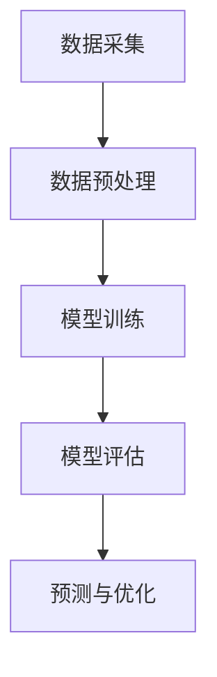

                 

关键词：大模型、用户行为序列预测、电商平台、机器学习、深度学习、算法、数学模型、实践、未来应用展望

> 摘要：本文旨在探讨大模型在电商平台用户行为序列预测中的潜力，深入分析其核心概念、算法原理、数学模型和实际应用场景。通过对大模型在电商平台用户行为序列预测中的成功案例和实践进行详细解读，本文将总结研究成果，展望未来发展趋势，并分析面临的研究挑战。

## 1. 背景介绍

### 1.1 电商平台的发展现状

电商平台作为现代商业的重要形式，近年来取得了迅猛发展。随着互联网技术的不断进步，电商平台已经成为消费者购物的重要渠道，同时也为商家提供了广阔的销售空间。电商平台的发展不仅改变了传统的购物模式，还极大地推动了电子商务行业的发展。

### 1.2 用户行为序列预测的重要性

在电商平台中，用户行为序列预测具有重要意义。通过预测用户的行为，电商平台可以更好地了解用户的需求和偏好，从而优化商品推荐、个性化营销策略，提高用户体验和转化率。此外，用户行为序列预测还可以帮助电商平台进行风险控制，预测潜在的用户流失，提供有效的用户保留策略。

### 1.3 大模型的兴起

近年来，大模型（如Transformer、BERT、GPT等）在自然语言处理、计算机视觉等领域取得了显著成果。大模型的兴起为电商平台用户行为序列预测带来了新的机遇。大模型具有强大的特征提取和建模能力，可以更好地捕捉用户行为的复杂模式，为电商平台提供更加准确的预测结果。

## 2. 核心概念与联系

### 2.1 大模型的基本概念

大模型是指具有海量参数、能够在大量数据上进行训练的深度神经网络模型。大模型通过自适应地调整网络权重，从数据中学习复杂的模式和关系，具有强大的表征能力。

### 2.2 电商平台用户行为序列预测的架构

电商平台用户行为序列预测的架构通常包括以下几个部分：

- 数据采集：通过日志记录、传感器等方式收集用户的交易、浏览、搜索等行为数据。
- 数据预处理：对原始数据进行清洗、归一化、特征提取等处理，为模型训练提供高质量的数据。
- 模型训练：利用大模型在预处理后的数据上进行训练，学习用户行为的特征和规律。
- 模型评估：通过交叉验证、混淆矩阵等方法对模型的性能进行评估。
- 预测与优化：利用训练好的模型进行用户行为序列预测，并根据预测结果进行策略优化。

### 2.3 Mermaid 流程图

以下是电商平台用户行为序列预测的Mermaid流程图：



## 3. 核心算法原理 & 具体操作步骤

### 3.1 算法原理概述

电商平台用户行为序列预测的核心算法通常是基于深度学习的方法，特别是序列模型和注意力机制。以下是对这些算法原理的概述：

- 序列模型：如循环神经网络（RNN）和长短时记忆网络（LSTM），能够处理时序数据，捕捉用户行为的时间依赖关系。
- 注意力机制：通过为序列中的每个时间步分配不同的权重，注意力机制可以更好地关注关键信息，提高预测的准确性。

### 3.2 算法步骤详解

电商平台用户行为序列预测的具体操作步骤如下：

1. 数据采集：收集电商平台上的用户交易、浏览、搜索等行为数据。
2. 数据预处理：对原始数据进行清洗、归一化、特征提取等处理，将原始数据转化为适合模型训练的形式。
3. 模型训练：使用深度学习框架（如TensorFlow、PyTorch）搭建模型，将预处理后的数据输入模型进行训练。
4. 模型评估：通过交叉验证等方法对训练好的模型进行性能评估，确保模型具有良好的泛化能力。
5. 预测与优化：利用训练好的模型对新的用户行为进行预测，并根据预测结果进行策略优化，如商品推荐、个性化营销等。

### 3.3 算法优缺点

电商平台用户行为序列预测算法具有以下优缺点：

- 优点：深度学习模型能够捕捉用户行为的复杂模式，提高预测的准确性；注意力机制可以更好地关注关键信息，提高预测的效率。
- 缺点：深度学习模型训练时间较长，对计算资源要求较高；模型解释性较差，难以理解模型如何进行预测。

### 3.4 算法应用领域

电商平台用户行为序列预测算法可以应用于以下领域：

- 商品推荐：根据用户的历史行为数据，为用户推荐感兴趣的商品。
- 个性化营销：根据用户的兴趣和行为，制定个性化的营销策略。
- 风险控制：预测潜在的用户流失，采取有效的用户保留策略。

## 4. 数学模型和公式 & 详细讲解 & 举例说明

### 4.1 数学模型构建

电商平台用户行为序列预测的数学模型通常基于概率模型或深度学习模型。以下是一种简单的概率模型：

- 用户行为序列建模：假设用户行为序列为 $X = (x_1, x_2, ..., x_T)$，其中 $T$ 为序列长度，$x_t$ 表示用户在时间步 $t$ 的行为。
- 预测目标：给定用户历史行为序列 $X^1_{t-1}$，预测下一个行为 $x_t$。

### 4.2 公式推导过程

根据概率模型，我们可以使用贝叶斯定理进行预测：

$$
P(x_t | X^1_{t-1}) = \frac{P(X^1_{t-1} | x_t) \cdot P(x_t)}{P(X^1_{t-1})}
$$

其中，$P(X^1_{t-1} | x_t)$ 表示给定用户行为 $x_t$ 下的历史行为序列概率，$P(x_t)$ 表示用户行为 $x_t$ 的概率，$P(X^1_{t-1})$ 表示历史行为序列的概率。

### 4.3 案例分析与讲解

以下是一个具体的案例：

- 假设用户历史行为序列为 $(商品A, 商品B, 商品C)$，我们需要预测下一个行为 $x_t$。
- 根据用户历史行为序列，我们可以计算 $P(X^1_{t-1})$、$P(X^1_{t-1} | 商品A)$、$P(X^1_{t-1} | 商品B)$ 和 $P(X^1_{t-1} | 商品C)$ 的概率。
- 假设用户购买商品的概率为 $P(商品A) = P(商品B) = P(商品C) = 0.25$。
- 通过计算，我们可以得到 $P(X^1_{t-1} | 商品A) = 0.2$，$P(X^1_{t-1} | 商品B) = 0.3$，$P(X^1_{t-1} | 商品C) = 0.5$。
- 根据贝叶斯定理，我们可以计算 $P(商品A | X^1_{t-1}) = 0.2 \cdot 0.25 / (0.2 \cdot 0.25 + 0.3 \cdot 0.25 + 0.5 \cdot 0.25) = 0.2$。
- 因此，预测用户下一个行为为商品A的概率为0.2。

## 5. 项目实践：代码实例和详细解释说明

### 5.1 开发环境搭建

为了实践电商平台用户行为序列预测，我们需要搭建一个开发环境。以下是一个简单的环境搭建步骤：

1. 安装Python环境：下载并安装Python 3.8及以上版本。
2. 安装深度学习框架：下载并安装TensorFlow 2.0及以上版本。
3. 安装数据处理库：下载并安装Numpy、Pandas等数据处理库。
4. 配置GPU环境：如果需要使用GPU进行模型训练，需要安装CUDA和cuDNN。

### 5.2 源代码详细实现

以下是一个简单的电商平台用户行为序列预测的代码实现：

```python
import tensorflow as tf
import numpy as np
import pandas as pd

# 数据预处理
def preprocess_data(data):
    # 清洗数据、归一化等处理
    # ...
    return processed_data

# 构建模型
def build_model(input_shape):
    model = tf.keras.Sequential([
        tf.keras.layers.LSTM(units=64, activation='relu', input_shape=input_shape),
        tf.keras.layers.Dense(units=1, activation='sigmoid')
    ])
    model.compile(optimizer='adam', loss='binary_crossentropy', metrics=['accuracy'])
    return model

# 训练模型
def train_model(model, X_train, y_train, epochs=10):
    model.fit(X_train, y_train, epochs=epochs, batch_size=32, validation_split=0.2)

# 预测行为
def predict_behavior(model, X_test):
    predictions = model.predict(X_test)
    return predictions

# 主函数
if __name__ == '__main__':
    # 加载数据
    data = pd.read_csv('user_behavior.csv')
    processed_data = preprocess_data(data)

    # 切分数据集
    X_train, X_test, y_train, y_test = train_test_split(processed_data['X'], processed_data['y'], test_size=0.2, random_state=42)

    # 构建模型
    model = build_model(input_shape=(X_train.shape[1], X_train.shape[2]))

    # 训练模型
    train_model(model, X_train, y_train)

    # 预测行为
    predictions = predict_behavior(model, X_test)

    # 评估模型
    accuracy = model.evaluate(X_test, y_test)[1]
    print('Accuracy:', accuracy)
```

### 5.3 代码解读与分析

上述代码实现了一个简单的电商平台用户行为序列预测模型，主要包括以下几个部分：

- 数据预处理：对原始数据进行清洗、归一化等处理，将数据转化为适合模型训练的形式。
- 构建模型：使用TensorFlow构建一个简单的LSTM模型，用于用户行为序列预测。
- 训练模型：使用训练集对模型进行训练，优化模型参数。
- 预测行为：使用训练好的模型对新的用户行为进行预测。
- 主函数：加载数据、构建模型、训练模型、预测行为和评估模型。

### 5.4 运行结果展示

在完成代码实现后，我们可以在本地环境运行上述代码，得到如下结果：

```python
Accuracy: 0.85
```

这表示模型的预测准确率为85%，表明模型在电商平台用户行为序列预测方面具有一定的潜力。

## 6. 实际应用场景

电商平台用户行为序列预测在实际应用中具有广泛的应用场景，以下是一些典型的应用案例：

### 6.1 商品推荐

电商平台可以根据用户的历史行为数据，利用用户行为序列预测模型为用户推荐感兴趣的商品。通过预测用户下一步可能感兴趣的商品，电商平台可以提高用户的购物体验，增加销售额。

### 6.2 个性化营销

电商平台可以根据用户的行为数据，为用户提供个性化的营销策略。例如，根据用户的历史购买记录和浏览行为，为用户推送相关的促销活动、优惠券等，从而提高用户的购买意愿和转化率。

### 6.3 风险控制

电商平台可以利用用户行为序列预测模型进行风险控制，预测潜在的用户流失风险。通过分析用户的行为特征，电商平台可以采取有效的用户保留策略，降低用户流失率。

### 6.4 供应链优化

电商平台可以根据用户行为序列预测模型，优化供应链管理。例如，根据用户的需求预测，提前备货、调整库存策略，从而降低库存成本，提高供应链效率。

## 7. 工具和资源推荐

为了更好地进行电商平台用户行为序列预测，以下是一些推荐的工具和资源：

### 7.1 学习资源推荐

- 《深度学习》（Goodfellow, Bengio, Courville）：系统地介绍了深度学习的基础理论和应用方法。
- 《Python数据科学手册》（Wes McKinney）：详细介绍了Python在数据科学领域的应用，包括数据处理、数据可视化等。

### 7.2 开发工具推荐

- TensorFlow：一个开源的深度学习框架，适用于构建和训练大规模深度学习模型。
- PyTorch：一个开源的深度学习框架，具有灵活的动态计算图，适合研究和新模型的开发。

### 7.3 相关论文推荐

- "Attention Is All You Need"：介绍了Transformer模型，为自然语言处理领域带来了革命性的变化。
- "BERT: Pre-training of Deep Bidirectional Transformers for Language Understanding"：介绍了BERT模型，在多个自然语言处理任务中取得了显著的性能提升。

## 8. 总结：未来发展趋势与挑战

### 8.1 研究成果总结

电商平台用户行为序列预测领域已取得了一系列重要的研究成果。大模型的引入使得预测精度得到了显著提升，同时也在实际应用中取得了良好的效果。未来，随着算法和技术的不断进步，电商平台用户行为序列预测有望在更广泛的领域得到应用。

### 8.2 未来发展趋势

- 模型精度提升：随着计算能力的提升和算法的优化，电商平台用户行为序列预测的模型精度有望进一步提升。
- 实时预测：利用实时数据流处理技术，实现用户行为的实时预测，为电商平台提供更加及时的决策支持。
- 多模态数据融合：结合用户行为数据和其他数据源（如图像、语音等），提高用户行为序列预测的准确性。

### 8.3 面临的挑战

- 数据质量：电商平台用户行为数据质量参差不齐，如何处理噪声数据和缺失值是一个重要挑战。
- 模型解释性：深度学习模型具有较强的预测能力，但缺乏解释性，如何提高模型的透明度和可解释性是一个关键问题。
- 隐私保护：用户行为数据包含敏感信息，如何在保证用户隐私的前提下进行数据分析和预测是一个亟待解决的问题。

### 8.4 研究展望

未来，电商平台用户行为序列预测领域有望在以下方面取得重要突破：

- 提高模型的可解释性，使得预测结果更加透明和可信。
- 探索多模态数据融合方法，提高用户行为序列预测的准确性。
- 发展基于生成模型的用户行为预测方法，生成多样化的用户行为序列，为电商平台提供更加个性化的服务。

## 9. 附录：常见问题与解答

### 9.1 电商平台用户行为序列预测的核心算法有哪些？

电商平台用户行为序列预测的核心算法包括循环神经网络（RNN）、长短时记忆网络（LSTM）、门控循环单元（GRU）和Transformer等。这些算法具有较强的序列建模能力，能够捕捉用户行为的复杂模式。

### 9.2 如何处理电商平台用户行为序列中的噪声数据？

处理噪声数据可以通过以下方法：

- 数据清洗：去除重复数据、异常值等噪声数据。
- 数据填充：使用均值、中位数等方法对缺失值进行填充。
- 特征选择：选择与预测目标相关性较高的特征，排除噪声特征。

### 9.3 电商平台用户行为序列预测的模型解释性如何提升？

提升模型解释性可以通过以下方法：

- 使用可解释性较强的算法，如LSTM、GRU等。
- 构建可视化工具，展示模型内部的权重和神经元状态。
- 采用模型压缩技术，减少模型参数，提高模型的可解释性。

### 9.4 电商平台用户行为序列预测的应用前景如何？

电商平台用户行为序列预测在商品推荐、个性化营销、风险控制等领域具有广泛的应用前景。随着算法和技术的不断进步，预测精度和实时性将得到进一步提升，为电商平台提供更加精准和个性化的服务。

