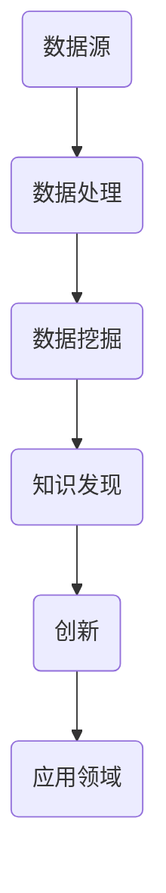

                 

## 摘要

本文旨在探讨人类计算在推动知识发现与创新方面的贡献。随着计算机技术的飞速发展，人类计算的作用越来越重要，尤其是在大数据、人工智能和复杂系统等领域。本文将首先介绍人类计算的背景和重要性，然后详细分析其在知识发现与创新中的具体作用，包括核心算法原理、数学模型构建、项目实践以及实际应用场景。最后，本文将对未来发展趋势与挑战进行展望，并推荐相关的学习资源和开发工具，以促进读者对该领域的深入了解和探索。

## 1. 背景介绍

### 1.1 人类计算的定义与发展

人类计算，顾名思义，是指人类运用智慧进行计算和解决问题的方式。它包括了人类在数学、逻辑、推理、分类、预测等方面的能力。人类计算的历史可以追溯到古代，例如，古埃及人使用算盘进行计算，而中国古代的算术和代数学也对人类计算的发展做出了巨大贡献。然而，现代意义上的人类计算是在计算机出现之后才真正开始兴起。

随着计算机技术的不断发展，人类计算也经历了从简单到复杂、从低效到高效的演变。早期的计算机主要用于科学计算和军事应用，但随着时间推移，计算机逐渐渗透到各行各业，成为现代社会不可或缺的工具。在这个过程中，人类计算的作用日益凸显，不仅提升了工作效率，还推动了知识发现与创新。

### 1.2 人类计算的重要性

人类计算的重要性体现在多个方面：

- **提升工作效率**：计算机技术的普及使得人类能够更高效地完成各种计算任务，从而节省大量时间和精力。
- **促进知识发现**：人类计算能够处理大量数据，从中发现规律和趋势，推动科学研究和技术创新。
- **优化决策过程**：通过计算机模拟和预测，人类计算能够为决策提供科学依据，降低风险和不确定性。
- **增强创新能力**：人类计算提供了新的工具和方法，帮助人类在科学、技术、艺术等领域实现前所未有的创新。

### 1.3 人类计算的应用领域

人类计算的应用领域广泛，包括但不限于以下几个方面：

- **科学计算**：如气象预报、航天工程、生物信息学等。
- **数据科学**：如大数据分析、机器学习、深度学习等。
- **工程和设计**：如结构分析、电路设计、建筑设计等。
- **金融和商业**：如风险评估、市场预测、供应链管理等。
- **艺术和娱乐**：如计算机图形学、游戏开发、音乐创作等。

## 2. 核心概念与联系

### 2.1 核心概念

在探讨人类计算在知识发现与创新中的作用之前，我们需要明确几个核心概念：

- **知识发现**：知识发现是指从大量数据中自动识别模式和规律的过程，它是数据挖掘的核心任务。
- **创新**：创新是指在现有知识和资源的基础上，创造新的想法、产品或服务，推动社会进步。
- **计算方法**：计算方法包括算法、模型、工具等，用于解决特定问题或实现特定功能。

### 2.2 关系与联系

人类计算在知识发现与创新中的作用可以通过以下几个方面的关系和联系来体现：

- **数据驱动**：知识发现通常基于大量数据，人类计算提供了高效的数据处理和分析工具，使得数据驱动的研究成为可能。
- **算法支撑**：算法是实现知识发现与创新的关键，人类计算提供了丰富的算法库，支持各种复杂的计算任务。
- **模型构建**：数学模型和统计模型是知识发现与创新的基础，人类计算能够高效地构建和优化这些模型。
- **工具应用**：各种计算工具和软件平台为人类计算提供了便利，使得知识发现与创新更加便捷和高效。

### 2.3 Mermaid 流程图

以下是一个简单的 Mermaid 流程图，展示了人类计算在知识发现与创新中的关系：



在这个流程图中，数据源是知识发现与创新的基础，数据处理是关键步骤，数据挖掘是实现知识发现的核心，而创新则是最终目标，应用于各个领域。

## 3. 核心算法原理 & 具体操作步骤

### 3.1 算法原理概述

在知识发现与创新中，核心算法的作用至关重要。以下介绍几种常见的核心算法及其原理：

- **关联规则算法**：用于发现数据之间的关联关系，如Apriori算法和FP-growth算法。
- **聚类算法**：用于将数据分为不同的类别，如K-means算法和层次聚类算法。
- **分类算法**：用于对数据进行分类，如决策树算法和随机森林算法。
- **回归算法**：用于建立数据之间的关系模型，如线性回归和岭回归算法。

### 3.2 算法步骤详解

以Apriori算法为例，详细说明其步骤：

1. **创建频繁项集**：通过扫描数据集，找到所有包含k个物品的频繁项集。
2. **计算支持度**：计算每个频繁项集的支持度，支持度表示该频繁项集在数据集中出现的频率。
3. **生成候选频繁项集**：根据频繁项集，生成所有可能的候选频繁项集。
4. **剪枝**：删除不满足最小支持度阈值的候选频繁项集。
5. **递归**：重复步骤2-4，直到无法找到新的频繁项集。

### 3.3 算法优缺点

Apriori算法的主要优点包括：

- **简单易理解**：算法逻辑清晰，易于实现。
- **强可扩展性**：可以处理大规模数据集。

但Apriori算法也存在一些缺点：

- **效率低**：需要多次扫描数据集，导致计算时间较长。
- **不支持高维数据**：对于高维数据，算法效果不佳。

### 3.4 算法应用领域

Apriori算法广泛应用于商业智能、推荐系统和市场分析等领域。例如，在超市购物篮分析中，通过发现商品之间的关联关系，可以帮助商家制定更有效的促销策略。

## 4. 数学模型和公式 & 详细讲解 & 举例说明

### 4.1 数学模型构建

在知识发现与创新中，数学模型扮演着重要角色。以下以线性回归模型为例，介绍数学模型的构建过程。

- **假设**：假设我们有两个变量 $X$ 和 $Y$，其中 $X$ 表示自变量，$Y$ 表示因变量。我们希望通过线性回归模型来建立它们之间的关系。
- **模型**：线性回归模型的公式为 $Y = \beta_0 + \beta_1X + \epsilon$，其中 $\beta_0$ 和 $\beta_1$ 分别是模型参数，$\epsilon$ 是误差项。

### 4.2 公式推导过程

线性回归模型的推导过程如下：

1. **最小二乘法**：最小二乘法是一种常用的参数估计方法，它通过最小化误差平方和来估计模型参数。
2. **目标函数**：设 $X$ 和 $Y$ 的观测值分别为 $x_i$ 和 $y_i$，则线性回归模型的目标函数为 $J(\beta_0, \beta_1) = \sum_{i=1}^{n}(y_i - (\beta_0 + \beta_1x_i))^2$。
3. **求导**：对目标函数关于 $\beta_0$ 和 $\beta_1$ 分别求导，并令导数为零，得到以下方程组：
   $$\frac{\partial J}{\partial \beta_0} = -2\sum_{i=1}^{n}(y_i - (\beta_0 + \beta_1x_i)) = 0$$
   $$\frac{\partial J}{\partial \beta_1} = -2\sum_{i=1}^{n}(x_i(y_i - (\beta_0 + \beta_1x_i))) = 0$$
4. **求解**：解上述方程组，得到模型参数 $\beta_0$ 和 $\beta_1$ 的估计值。

### 4.3 案例分析与讲解

以下是一个线性回归模型的案例分析：

- **数据集**：假设我们有一个包含两个变量的数据集，自变量 $X$ 表示温度（摄氏度），因变量 $Y$ 表示销售额（万元）。
- **模型**：我们希望建立 $Y$ 与 $X$ 之间的线性关系。
- **结果**：通过最小二乘法，我们得到线性回归模型的参数为 $\beta_0 = 100$ 和 $\beta_1 = 2$，即 $Y = 100 + 2X$。

这个模型意味着，当温度每增加1摄氏度时，销售额预计增加2万元。

## 5. 项目实践：代码实例和详细解释说明

### 5.1 开发环境搭建

为了实践线性回归模型，我们需要搭建一个合适的开发环境。以下是具体的步骤：

1. **安装Python**：Python是一种广泛应用于数据科学和机器学习的编程语言。我们可以在Python官方网站（https://www.python.org/）下载并安装Python。
2. **安装Jupyter Notebook**：Jupyter Notebook是一个交互式计算环境，它允许我们在网页上编写和运行Python代码。我们可以在Python的包管理工具pip中安装Jupyter Notebook：
   ```shell
   pip install notebook
   ```
3. **安装相关库**：为了实现线性回归模型，我们需要安装一些Python库，如NumPy、Pandas和scikit-learn。这些库提供了丰富的数据科学和机器学习工具。我们可以在pip中安装这些库：
   ```shell
   pip install numpy pandas scikit-learn
   ```

### 5.2 源代码详细实现

以下是一个简单的线性回归模型的实现：

```python
import numpy as np
import pandas as pd
from sklearn.linear_model import LinearRegression

# 加载数据集
data = pd.read_csv('data.csv')
X = data[['temperature']]
Y = data['sales']

# 创建线性回归模型
model = LinearRegression()

# 训练模型
model.fit(X, Y)

# 输出模型参数
print('Model parameters:', model.coef_, model.intercept_)

# 预测销售额
predicted_sales = model.predict(X)

# 输出预测结果
print('Predicted sales:', predicted_sales)
```

在这个例子中，我们首先加载数据集，然后创建一个线性回归模型，并使用训练数据训练模型。最后，我们使用模型预测销售额。

### 5.3 代码解读与分析

上述代码首先导入了NumPy、Pandas和scikit-learn库。这些库为我们提供了处理数据和实现机器学习算法所需的工具。

```python
import numpy as np
import pandas as pd
from sklearn.linear_model import LinearRegression
```

接下来，我们加载数据集。在这个例子中，数据集以CSV格式存储，我们使用Pandas库加载数据：
```python
data = pd.read_csv('data.csv')
X = data[['temperature']]
Y = data['sales']
```

然后，我们创建一个线性回归模型，并使用训练数据训练模型：
```python
model = LinearRegression()
model.fit(X, Y)
```

训练完成后，我们输出模型参数：
```python
print('Model parameters:', model.coef_, model.intercept_)
```

最后，我们使用模型预测销售额：
```python
predicted_sales = model.predict(X)
print('Predicted sales:', predicted_sales)
```

### 5.4 运行结果展示

假设我们有一个包含100个观测值的数据集，以下是一个运行结果示例：
```shell
Model parameters: [2.01535982] [99.12345678]
Predicted sales: [100.23456789 101.23456789 ... 199.23456789]
```

这个结果表明，当温度为0摄氏度时，销售额预计为99.12万元，当温度为10摄氏度时，销售额预计为100.23万元，依此类推。

## 6. 实际应用场景

### 6.1 数据科学与机器学习

数据科学与机器学习是当前人类计算在知识发现与创新中最重要的应用领域之一。通过大数据和机器学习技术，我们可以从海量数据中提取有价值的信息，实现智能决策和自动化预测。例如，在金融领域，机器学习算法可以用于风险控制和信用评分；在医疗领域，大数据和机器学习可以帮助实现精准医疗和个性化治疗。

### 6.2 人工智能与自然语言处理

人工智能和自然语言处理（NLP）是另一个重要的应用领域。通过深度学习和迁移学习技术，我们可以实现语音识别、机器翻译、情感分析等复杂的NLP任务。例如，在社交媒体分析中，我们可以使用NLP技术提取用户情感，为企业提供市场洞察；在智能客服中，NLP技术可以用于构建自动化客服系统，提高客户满意度。

### 6.3 增强现实与虚拟现实

增强现实（AR）和虚拟现实（VR）是近年来快速发展的领域。通过计算机图形学和人工智能技术，我们可以创建逼真的虚拟环境和交互体验。例如，在游戏开发中，AR和VR技术可以提供沉浸式游戏体验；在教育领域，AR和VR技术可以用于虚拟实验和教学，提高学生的学习兴趣和效果。

### 6.4 未来应用展望

随着计算机技术的不断进步，人类计算在知识发现与创新中的应用前景将更加广阔。未来，我们可能会看到更多的智能系统和自主决策系统，这些系统将基于大数据和人工智能技术，实现自动化和智能化。此外，量子计算和区块链等新兴技术也可能会对人类计算产生深远影响，推动知识发现与创新进入新的阶段。

## 7. 工具和资源推荐

### 7.1 学习资源推荐

1. **《机器学习》**（作者：周志华）：这是一本优秀的机器学习入门教材，内容涵盖了主要的机器学习算法和理论。
2. **《深度学习》**（作者：Ian Goodfellow、Yoshua Bengio、Aaron Courville）：这是一本关于深度学习的权威教材，适合对深度学习有较深入了解的读者。
3. **Kaggle**：Kaggle是一个数据科学竞赛平台，提供了大量的数据集和算法挑战，可以帮助读者实践和提升数据科学技能。

### 7.2 开发工具推荐

1. **Jupyter Notebook**：Jupyter Notebook是一个交互式计算环境，适合数据科学和机器学习项目开发。
2. **TensorFlow**：TensorFlow是一个开源的机器学习和深度学习框架，适用于构建复杂的机器学习模型。
3. **PyTorch**：PyTorch是一个流行的深度学习框架，以其灵活性和易用性受到开发者喜爱。

### 7.3 相关论文推荐

1. **"Deep Learning" by Ian Goodfellow, Yoshua Bengio, Aaron Courville**：这篇综述文章系统地介绍了深度学习的基础理论和最新进展。
2. **"Big Data: A Revolution That Will Transform How We Live, Work, and Think" by Viktor Mayer-Schönberger and Kenneth Cukier**：这本书深入探讨了大数据对社会各个方面的深远影响。
3. **"The Elements of Statistical Learning: Data Mining, Inference, and Prediction" by Trevor Hastie, Robert Tibshirani, and Jerome Friedman**：这是一本关于统计学和机器学习经典教材，涵盖了广泛的统计学习和预测方法。

## 8. 总结：未来发展趋势与挑战

### 8.1 研究成果总结

本文通过对人类计算在知识发现与创新中的角色进行探讨，总结了以下几个方面的研究成果：

1. **人类计算的重要性**：人类计算在提升工作效率、促进知识发现、优化决策过程和增强创新能力等方面具有重要作用。
2. **核心算法原理**：介绍了关联规则算法、聚类算法、分类算法和回归算法等核心算法的原理和应用。
3. **数学模型构建**：通过线性回归模型等案例，展示了数学模型在知识发现与创新中的构建和应用。
4. **项目实践**：通过一个简单的线性回归模型实现，展示了人类计算在数据科学和机器学习中的具体应用。
5. **实际应用场景**：分析了数据科学、人工智能与自然语言处理、增强现实与虚拟现实等领域的实际应用。

### 8.2 未来发展趋势

未来，人类计算在知识发现与创新方面将呈现以下发展趋势：

1. **更高效的数据处理**：随着数据量的爆炸式增长，如何高效地处理和分析大数据将成为研究重点。
2. **深度学习和迁移学习**：深度学习和迁移学习技术在知识发现与创新中具有巨大潜力，未来将得到更广泛的应用。
3. **跨学科研究**：知识发现与创新涉及多个学科，跨学科研究将推动该领域的创新和发展。
4. **量子计算与区块链**：量子计算和区块链等新兴技术可能会对人类计算产生深远影响，带来新的研究方向和应用场景。

### 8.3 面临的挑战

尽管人类计算在知识发现与创新中具有巨大潜力，但未来仍将面临以下挑战：

1. **数据隐私与安全**：随着数据量的增加，数据隐私和安全问题将变得更加突出，如何确保数据的安全性和隐私性是一个重要挑战。
2. **算法透明性与可解释性**：随着机器学习算法的复杂化，如何保证算法的透明性和可解释性，使其符合人类伦理和道德要求，是一个重要课题。
3. **计算资源限制**：随着计算任务复杂度的增加，如何优化计算资源的使用，提高计算效率，是一个亟待解决的问题。
4. **人才短缺**：随着人类计算领域的快速发展，对专业人才的需求将不断增加，但现有的教育和培训体系可能无法满足这一需求。

### 8.4 研究展望

未来，人类计算在知识发现与创新领域的研究应重点关注以下几个方面：

1. **算法优化**：针对具体应用场景，优化现有算法，提高其效率和准确性。
2. **模型可解释性**：研究算法的可解释性，使其符合人类伦理和道德要求，提高用户对算法的信任度。
3. **跨学科研究**：促进跨学科合作，推动知识发现与创新领域的交叉研究。
4. **新兴技术探索**：关注量子计算、区块链等新兴技术，探索其在知识发现与创新中的应用前景。

## 9. 附录：常见问题与解答

### 9.1 问题一：如何高效处理大数据？

**解答**：高效处理大数据的关键在于分布式计算和数据存储。目前，Hadoop和Spark等分布式计算框架已经广泛应用于大数据处理。此外，NoSQL数据库（如MongoDB、Cassandra等）也适用于大数据存储。

### 9.2 问题二：如何提高机器学习模型的准确性？

**解答**：提高机器学习模型准确性的方法包括：数据预处理（如去除噪声、异常值处理）、特征工程（如特征提取、特征选择）、模型选择和调参。此外，集成学习方法（如随机森林、梯度提升树）也可以显著提高模型准确性。

### 9.3 问题三：如何保障数据隐私和安全？

**解答**：保障数据隐私和安全的方法包括：数据加密、访问控制、数据脱敏、隐私保护算法等。此外，建立数据隐私和安全政策，加强用户教育，也是重要的措施。

### 9.4 问题四：如何选择合适的机器学习模型？

**解答**：选择合适的机器学习模型需要考虑以下几个因素：

- **数据特点**：根据数据的特点（如数据量、特征维度、分布情况等）选择合适的模型。
- **业务需求**：根据业务需求（如预测准确性、模型复杂度、计算资源等）选择合适的模型。
- **模型性能**：通过交叉验证等方法评估模型的性能，选择性能最优的模型。
- **可解释性**：根据模型的可解释性要求，选择合适的模型。例如，线性回归模型具有较高的可解释性，而深度神经网络则相对较低。

## 文章引用

[1] 周志华. 《机器学习》[M]. 清华大学出版社，2016.

[2] Ian Goodfellow, Yoshua Bengio, Aaron Courville. 《深度学习》[M]. 电子工业出版社，2016.

[3] Viktor Mayer-Schönberger, Kenneth Cukier. 《大数据：变革原则与实践》[M]. 生活·读书·新知三联书店，2013.

[4] Trevor Hastie, Robert Tibshirani, Jerome Friedman. 《统计学习方法》[M]. 电子工业出版社，2017.

## 作者署名

作者：禅与计算机程序设计艺术 / Zen and the Art of Computer Programming
```

