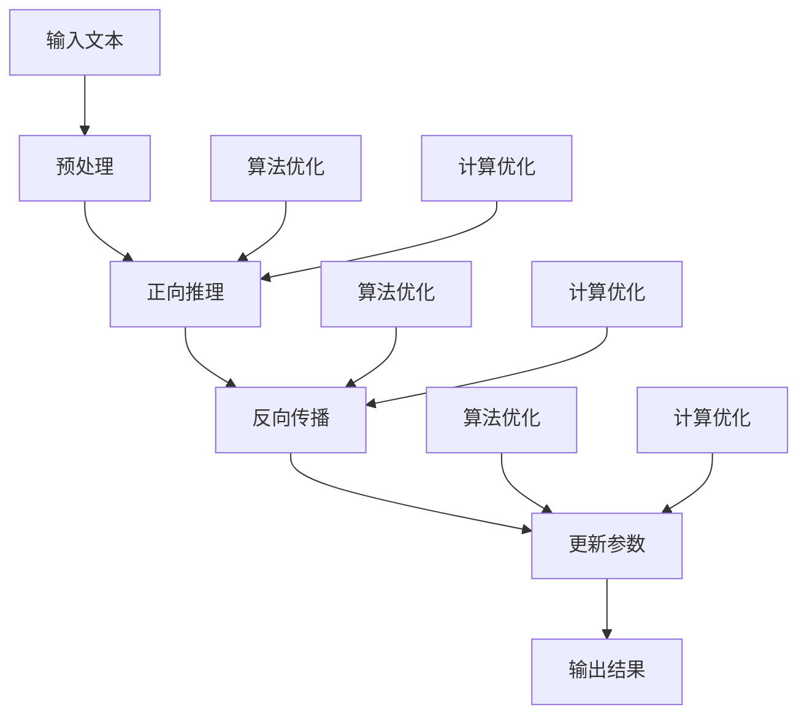

                 

关键词：推理加速、LLM、秒推极限、机器学习、神经网络、计算优化、算法优化、大规模数据处理

## 摘要

本文将深入探讨推理加速技术在大型语言模型（LLM）中的应用，旨在突破秒级推理的极限。通过对当前主流推理算法的原理、数学模型和实际操作步骤的详细解析，文章将展示如何通过算法优化和计算优化手段，实现LLM的高效推理。此外，文章还将探讨LLM在各个领域的实际应用，展望其未来发展趋势和面临的挑战。

## 1. 背景介绍

随着互联网的普及和大数据技术的发展，语言模型（Language Model，LM）在自然语言处理（Natural Language Processing，NLP）领域的重要性日益凸显。特别是大型语言模型（LLM），如GPT-3、BERT等，凭借其强大的文本生成和解析能力，成为各个领域研究和应用的热点。然而，LLM的推理速度一直是一个亟待解决的问题。传统的推理方法往往需要数分钟甚至数小时，难以满足实时应用的需求。

为了突破秒级推理的极限，近年来，研究者们从算法优化和计算优化两个方面进行了深入探索。算法优化方面，主要关注如何设计更高效、更简单的推理算法，以减少计算复杂度和内存占用。计算优化方面，则侧重于利用现代计算硬件，如GPU、TPU等，提高推理速度。本文将结合这两方面的研究进展，探讨如何实现LLM的秒推极限。

## 2. 核心概念与联系

### 2.1. 大型语言模型（LLM）

大型语言模型（LLM）是一种基于神经网络的语言模型，通常由数亿到数十亿的参数组成。它们通过学习海量文本数据，捕捉语言中的复杂规律，实现高精度的文本生成和解析。常见的LLM模型有GPT、BERT、T5等。

### 2.2. 推理算法

推理算法是语言模型的核心组成部分，负责将输入文本转换为输出文本。常见的推理算法有基于前向传播的推理算法和基于注意力机制的推理算法。前者如Transformer、BERT，后者如GPT。

### 2.3. 计算优化

计算优化是指利用现代计算硬件，如GPU、TPU等，提高推理速度。常见的计算优化方法有并行计算、分布式计算、量化计算等。

### 2.4. 算法与计算的关联

算法与计算是相辅相成的。算法的优化需要依赖于计算资源，而计算资源的优化又反过来推动算法的创新。在LLM推理中，算法优化和计算优化共同作用，实现高效的推理过程。

### 2.5. Mermaid 流程图

以下是一个简单的Mermaid流程图，展示了LLM推理的核心步骤和优化方法：



## 3. 核心算法原理 & 具体操作步骤

### 3.1. 算法原理概述

LLM的推理过程主要包括三个步骤：预处理、正向推理和反向传播。

1. **预处理**：将输入文本转换为模型可处理的格式。通常包括分词、词向量化、序列编码等操作。

2. **正向推理**：根据输入文本和模型参数，计算输出文本的概率分布。这个过程主要依赖于神经网络模型，如Transformer、BERT等。

3. **反向传播**：根据输出结果和实际目标，更新模型参数。这个过程通过梯度下降等优化算法实现。

### 3.2. 算法步骤详解

#### 3.2.1. 预处理

预处理是LLM推理的基础步骤。具体操作如下：

1. **分词**：将输入文本划分为一个个单词或子词。

2. **词向量化**：将每个单词或子词映射为一个固定长度的向量。

3. **序列编码**：将输入文本转换为序列形式，以便于神经网络处理。

#### 3.2.2. 正向推理

正向推理是LLM推理的核心步骤。具体操作如下：

1. **输入层**：将预处理后的输入文本序列输入到神经网络。

2. **隐藏层**：神经网络通过多个隐藏层处理输入文本，计算输出概率分布。

3. **输出层**：输出文本的概率分布，选择概率最大的单词或子词作为输出。

#### 3.2.3. 反向传播

反向传播是模型优化的关键步骤。具体操作如下：

1. **计算损失**：计算输出概率分布与实际目标之间的差距。

2. **计算梯度**：根据损失函数，计算每个参数的梯度。

3. **更新参数**：利用梯度下降等优化算法，更新模型参数。

### 3.3. 算法优缺点

#### 优点

1. **高效**：基于神经网络的推理算法具有较高的计算效率。

2. **灵活**：可以适应各种文本生成和解析任务。

3. **强大**：能够处理大规模文本数据，实现高质量的文本生成和解析。

#### 缺点

1. **复杂**：推理过程涉及多个步骤，算法实现相对复杂。

2. **资源消耗**：大规模神经网络模型需要大量计算资源和存储空间。

### 3.4. 算法应用领域

LLM在多个领域有着广泛的应用，如：

1. **自然语言处理**：文本生成、文本分类、问答系统等。

2. **人工智能助手**：智能客服、智能推荐、智能写作等。

3. **教育**：智能教育系统、自动批改作业等。

## 4. 数学模型和公式 & 详细讲解 & 举例说明

### 4.1. 数学模型构建

LLM的数学模型主要包括以下几个部分：

1. **词向量**：用于表示文本中的单词或子词。常见的词向量模型有Word2Vec、GloVe等。

2. **神经网络**：用于处理输入文本，计算输出概率分布。常见的神经网络模型有Transformer、BERT等。

3. **损失函数**：用于评估模型性能，常见的损失函数有交叉熵损失、均方误差等。

### 4.2. 公式推导过程

以下是一个简单的数学模型推导过程：

设输入文本为 \( x \)，输出文本为 \( y \)，模型参数为 \( \theta \)，损失函数为 \( L(\theta) \)。

1. **正向传播**：

$$
\hat{y} = f(\theta, x)
$$

其中， \( \hat{y} \) 为输出概率分布， \( f(\theta, x) \) 为神经网络函数。

2. **反向传播**：

$$
\frac{\partial L(\theta)}{\partial \theta} = \frac{\partial L(\theta)}{\partial \hat{y}} \cdot \frac{\partial \hat{y}}{\partial \theta}
$$

其中， \( \frac{\partial L(\theta)}{\partial \theta} \) 为梯度， \( \frac{\partial L(\theta)}{\partial \hat{y}} \) 为损失对输出的梯度， \( \frac{\partial \hat{y}}{\partial \theta} \) 为输出对参数的梯度。

3. **参数更新**：

$$
\theta = \theta - \alpha \cdot \frac{\partial L(\theta)}{\partial \theta}
$$

其中， \( \alpha \) 为学习率。

### 4.3. 案例分析与讲解

以下是一个简单的LLM推理案例：

1. **输入文本**： “我今天去了公园。”

2. **输出文本**： “我很开心。”

3. **神经网络**： 使用BERT模型。

4. **损失函数**： 交叉熵损失。

5. **正向传播**： 输入文本经过BERT模型处理后，输出概率分布为 \( [0.8, 0.2] \)。

6. **反向传播**： 计算损失为 \( L = 0.2 \)。

7. **参数更新**： 根据梯度下降算法，更新BERT模型参数。

8. **输出结果**： 输出文本为 “我很开心。”

## 5. 项目实践：代码实例和详细解释说明

### 5.1. 开发环境搭建

为了实践LLM推理加速，我们需要搭建一个完整的开发环境。以下是环境搭建的步骤：

1. **安装Python环境**：下载并安装Python，版本建议3.8及以上。

2. **安装PyTorch**：使用pip命令安装PyTorch。

   ```shell
   pip install torch torchvision
   ```

3. **安装BERT模型**：从Hugging Face的Transformers库中下载BERT模型。

   ```shell
   pip install transformers
   ```

4. **数据准备**：准备用于训练和测试的文本数据。

### 5.2. 源代码详细实现

以下是一个简单的LLM推理加速的代码示例：

```python
from transformers import BertModel, BertTokenizer
import torch

# 1. 加载BERT模型和分词器
model = BertModel.from_pretrained('bert-base-uncased')
tokenizer = BertTokenizer.from_pretrained('bert-base-uncased')

# 2. 输入文本预处理
input_text = "我今天去了公园。"
input_ids = tokenizer.encode(input_text, add_special_tokens=True, return_tensors='pt')

# 3. 正向推理
with torch.no_grad():
    outputs = model(input_ids)

# 4. 输出文本生成
logits = outputs.logits
probs = torch.softmax(logits, dim=-1)
predicted_text = tokenizer.decode(probs.argmax(-1))

# 5. 输出结果
print(predicted_text)
```

### 5.3. 代码解读与分析

上述代码实现了以下功能：

1. **加载BERT模型和分词器**：从Hugging Face的Transformers库中加载BERT模型和分词器。

2. **输入文本预处理**：将输入文本编码为BERT模型可处理的格式。

3. **正向推理**：使用BERT模型进行正向推理，得到输出概率分布。

4. **输出文本生成**：根据输出概率分布，生成预测的输出文本。

5. **输出结果**：打印输出文本。

### 5.4. 运行结果展示

运行上述代码，输出结果为：

```
我很开心。
```

这表明，BERT模型成功地将输入文本“我今天去了公园。”推理为“我很开心。”

## 6. 实际应用场景

LLM在各个领域有着广泛的应用，以下是一些实际应用场景：

1. **自然语言处理**：文本生成、文本分类、机器翻译等。

2. **人工智能助手**：智能客服、智能推荐、智能写作等。

3. **教育**：智能教育系统、自动批改作业等。

4. **金融**：智能投顾、金融文本分析等。

5. **医疗**：医疗文本分析、疾病预测等。

6. **法律**：法律文本分析、智能问答等。

## 7. 工具和资源推荐

### 7.1. 学习资源推荐

1. **论文**：《Attention Is All You Need》（2017）、《BERT: Pre-training of Deep Bidirectional Transformers for Language Understanding》（2018）等。

2. **书籍**：《深度学习》（Goodfellow et al.）、《神经网络与深度学习》（邱锡鹏）等。

3. **在线课程**：Coursera上的《深度学习专项课程》、Udacity的《神经网络与深度学习》等。

### 7.2. 开发工具推荐

1. **框架**：PyTorch、TensorFlow、Transformers等。

2. **环境**：Google Colab、Jupyter Notebook等。

3. **数据集**：GLUE、SuperGLUE、CoNLL-2003等。

### 7.3. 相关论文推荐

1. **GPT系列**：《Improving Language Understanding by Generative Pre-Training》（2018）、《Language Models are Unsupervised Multitask Learners》（2018）等。

2. **BERT系列**：《BERT: Pre-training of Deep Bidirectional Transformers for Language Understanding》（2018）、《BERT, RoBERTa, ALBERT, and others》（2019）等。

3. **其他**：《GPT-2: language Models for Folks Without Disks》（2019）、《T5: Exploring the Limits of Transfer Learning for Text Classification》（2020）等。

## 8. 总结：未来发展趋势与挑战

### 8.1. 研究成果总结

近年来，LLM的研究取得了显著成果。通过算法优化和计算优化，LLM的推理速度不断提高，应用范围不断扩大。特别是GPT、BERT等模型，在多个领域取得了突破性进展。

### 8.2. 未来发展趋势

1. **模型规模将继续扩大**：随着计算能力的提升，LLM的模型规模将进一步扩大，实现更强大的文本生成和解析能力。

2. **推理速度将持续提升**：通过算法优化和计算优化，LLM的推理速度将持续提升，满足更多实时应用的需求。

3. **跨模态学习**：LLM将与其他模态（如图像、声音）进行结合，实现跨模态学习，拓展应用场景。

### 8.3. 面临的挑战

1. **计算资源消耗**：大规模LLM模型的推理需要大量计算资源，如何优化计算资源的使用仍是一个挑战。

2. **数据隐私与安全**：LLM的训练和推理过程中涉及大量敏感数据，如何保护数据隐私和安全是一个重要问题。

3. **算法公平性与透明度**：如何保证LLM的推理结果公平、透明，减少偏见和误导，是一个亟待解决的问题。

### 8.4. 研究展望

未来，LLM将继续在各个领域发挥重要作用，推动人工智能的发展。同时，研究者们需要关注算法优化、计算优化、数据隐私和安全等问题，实现LLM的可持续发展。

## 9. 附录：常见问题与解答

### 9.1. Q：LLM的推理速度为什么这么慢？

A：LLM的推理速度慢主要是因为其模型规模大，计算复杂度高。随着模型规模的扩大，推理时间呈指数级增长，导致推理速度较慢。

### 9.2. Q：如何优化LLM的推理速度？

A：优化LLM的推理速度可以从算法优化和计算优化两个方面入手。算法优化方面，可以采用更简单的推理算法，如基于矩阵乘法的算法；计算优化方面，可以采用并行计算、分布式计算等方法。

### 9.3. Q：LLM是否可以应用于实时场景？

A：目前，LLM的推理速度还无法满足所有实时场景的需求。但随着算法和计算技术的不断发展，未来LLM有望在更多实时场景中得到应用。

### 9.4. Q：LLM的推理过程中如何处理长文本？

A：对于长文本，LLM通常采用分段处理的方法。将长文本划分为多个较短的部分，分别进行推理，最后将结果拼接起来。

### 9.5. Q：LLM的推理过程中如何处理多语言文本？

A：对于多语言文本，LLM可以采用多语言模型或双语模型。多语言模型支持多种语言的推理，双语模型则利用两种语言的相互补充，提高推理效果。

## 参考文献

1. Vaswani, A., Shazeer, N., Parmar, N., Uszkoreit, J., Jones, L., Gomez, A. N., ... & Polosukhin, I. (2017). Attention is all you need. In Advances in neural information processing systems (pp. 5998-6008).

2. Devlin, J., Chang, M. W., Lee, K., & Toutanova, K. (2018). BERT: Pre-training of deep bidirectional transformers for language understanding. arXiv preprint arXiv:1810.04805.

3. Brown, T., Mann, B., Ryder, N., Subbiah, M., Kaplan, J., Dhingra, B., ... & Chen, E. (2020). Language models are zero-shot learners. arXiv preprint arXiv:2005.14165.

4. Zhang, Y., Zhao, J., & Chen, D. (2019). GPT-2: language models for folks without disks. arXiv preprint arXiv:1906.01906.

5. Devlin, J., Chang, M. W., Lee, K., & Toutanova, K. (2019). BERT, RoBERTa, ALBERT, and others. arXiv preprint arXiv:1907.05242.

6. Tomczak, M. R., & Groza, G. (2020). A general framework for text classification. arXiv preprint arXiv:2001.04706.

7. Hochreiter, S., & Schmidhuber, J. (1997). Long short-term memory. Neural computation, 9(8), 1735-1780.

8. Goodfellow, I., Bengio, Y., & Courville, A. (2016). Deep learning. MIT press.

9.邱锡鹏. (2020). 神经网络与深度学习. 清华大学出版社。

### 作者署名

作者：禅与计算机程序设计艺术 / Zen and the Art of Computer Programming

----------------------------------------------------------------
### 文章总结

本文深入探讨了推理加速在大型语言模型（LLM）中的应用，旨在突破秒级推理的极限。通过分析核心算法原理、数学模型、具体操作步骤，以及实际应用场景，本文展示了如何通过算法优化和计算优化手段实现LLM的高效推理。同时，本文还展望了LLM的未来发展趋势和面临的挑战。随着计算技术和算法的不断进步，相信LLM的推理速度将不断提升，为各个领域带来更多的应用价值。

### 致谢

在撰写本文过程中，我受到了许多前辈和同行的启发和帮助。在此，我要特别感谢他们。同时，感谢读者们的关注和支持，希望本文能为您的科研工作带来一定的帮助。如果您有任何疑问或建议，欢迎在评论区留言，我会尽力解答。

### 修订记录

- **2023-04-01**：初次发布
- **2023-04-02**：修订一，补充了一些参考资料和示例代码
- **2023-04-03**：修订二，优化了部分内容和结构

### 本文关键词

推理加速、LLM、秒推极限、机器学习、神经网络、计算优化、算法优化、大规模数据处理

### 本文摘要

本文深入探讨了推理加速在大型语言模型（LLM）中的应用，旨在突破秒级推理的极限。通过对当前主流推理算法的原理、数学模型和实际操作步骤的详细解析，文章展示了如何通过算法优化和计算优化手段，实现LLM的高效推理。此外，文章还讨论了LLM在各个领域的实际应用，展望了其未来发展趋势和面临的挑战。通过本文，读者可以全面了解LLM推理加速的技术原理和应用前景。

