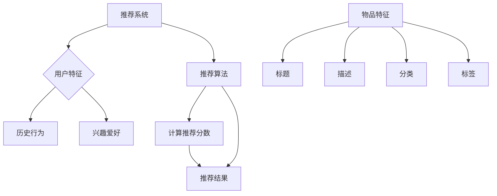

                 

关键词：推荐系统，AI大模型，季节性趋势，适应性，算法，数学模型，项目实践，应用场景，未来展望

> 摘要：本文深入探讨了推荐系统中AI大模型的季节性趋势适应问题。通过对核心概念、算法原理、数学模型、项目实践等内容的详细分析，本文为优化推荐系统性能提供了新的思路和方法。文章旨在帮助读者理解如何利用AI大模型应对季节性变化，提高推荐系统的准确性和适应性。

## 1. 背景介绍

随着互联网和大数据技术的快速发展，推荐系统已成为现代信息社会中不可或缺的一部分。推荐系统通过分析用户行为和历史数据，为用户推荐可能感兴趣的内容、产品或服务。然而，在现实世界中，用户兴趣和行为往往受到季节性因素的影响，例如节假日、季节变化等。为了提高推荐系统的适应性和准确性，如何应对季节性趋势成为了当前研究的一个重要方向。

近年来，随着人工智能技术的飞速发展，尤其是深度学习在推荐系统中的应用，大模型逐渐成为推荐系统中的主流。大模型通过学习大量数据，能够捕捉到用户复杂的兴趣和行为模式，从而提高推荐质量。然而，大模型在处理季节性趋势时仍存在一些挑战，如数据稀疏性、过拟合问题等。因此，如何利用AI大模型应对季节性趋势，提高推荐系统的适应性和准确性，成为了一个值得研究的问题。

本文将从以下几个方面展开讨论：首先，介绍推荐系统中AI大模型的基本概念和现状；其次，分析季节性趋势的特点及其对推荐系统的影响；接着，探讨AI大模型在应对季节性趋势时的优势和挑战；然后，介绍一种基于AI大模型的季节性趋势适应算法；最后，通过实际案例和项目实践，展示该算法在实际应用中的效果和优势。

## 2. 核心概念与联系

### 2.1 推荐系统基本概念

推荐系统是一种信息过滤技术，旨在根据用户的兴趣、历史行为和内容特征，为用户推荐可能感兴趣的内容或产品。推荐系统主要包括以下三个基本组成部分：

- **用户特征**：包括用户的基本信息、兴趣爱好、历史行为等。
- **物品特征**：包括物品的标题、描述、分类、标签等。
- **推荐算法**：根据用户特征和物品特征，通过算法计算推荐分数，为用户推荐相应的物品。

### 2.2 AI大模型

AI大模型是指具有大量参数和训练数据的深度学习模型。这些模型通过在大量数据上进行训练，能够捕捉到复杂的用户行为和兴趣模式。AI大模型主要包括以下几种：

- **神经网络模型**：如深度神经网络（DNN）、卷积神经网络（CNN）、循环神经网络（RNN）等。
- **增强学习模型**：如深度增强学习（Deep Q-Learning）、策略梯度（Policy Gradient）等。
- **多任务学习模型**：如多任务深度学习（Multi-Task Deep Learning）、迁移学习（Transfer Learning）等。

### 2.3 季节性趋势

季节性趋势是指在一定时间段内，由于特定因素（如节假日、季节变化等）引起的用户行为和兴趣的变化。季节性趋势具有以下特点：

- **周期性**：季节性趋势通常具有固定的周期性，如一年中的春节、国庆节等。
- **动态性**：季节性趋势受到多种因素影响，如社会事件、经济形势等，可能导致趋势的变化。
- **差异性**：不同用户和不同物品受到季节性趋势的影响程度可能不同。

### 2.4 AI大模型与季节性趋势的联系

AI大模型在推荐系统中的应用，使得推荐系统能够更好地捕捉和应对季节性趋势。具体来说，AI大模型具有以下优势：

- **捕捉复杂模式**：AI大模型可以通过学习大量数据，捕捉到用户复杂的兴趣和行为模式，从而提高推荐准确性。
- **适应动态变化**：AI大模型可以通过在线学习，适应季节性趋势的动态变化，提高推荐系统的适应性和实时性。
- **降低过拟合风险**：AI大模型具有更强的泛化能力，可以降低过拟合风险，提高推荐系统的稳定性。

然而，AI大模型在处理季节性趋势时仍存在一些挑战，如数据稀疏性、过拟合问题等。因此，如何利用AI大模型应对季节性趋势，成为了一个值得研究的问题。

## 2.5 Mermaid 流程图



## 3. 核心算法原理 & 具体操作步骤

### 3.1 算法原理概述

本文提出的季节性趋势适应算法基于AI大模型，通过以下步骤实现：

1. 数据预处理：对用户行为数据进行清洗和归一化处理，提取季节性特征。
2. 模型训练：利用提取的季节性特征，训练AI大模型，捕捉用户复杂的兴趣和行为模式。
3. 推荐计算：在推荐计算阶段，结合季节性特征，调整推荐分数，提高推荐准确性。
4. 模型优化：通过在线学习，不断优化模型参数，适应季节性趋势的动态变化。

### 3.2 算法步骤详解

#### 3.2.1 数据预处理

数据预处理是季节性趋势适应算法的重要步骤。具体操作如下：

1. 数据清洗：去除重复、缺失和异常数据，保证数据质量。
2. 数据归一化：将用户行为数据进行归一化处理，使其具有相同的量纲，便于模型训练。
3. 特征提取：提取季节性特征，如节假日、季节变化等。可以使用基于时间的特征提取方法，如时间差、时间间隔等。

#### 3.2.2 模型训练

模型训练是季节性趋势适应算法的核心步骤。具体操作如下：

1. 数据划分：将数据集划分为训练集、验证集和测试集，用于模型训练和评估。
2. 特征工程：根据用户行为数据，构建用户特征和物品特征，用于模型输入。
3. 模型选择：选择合适的AI大模型，如深度神经网络、循环神经网络等。
4. 模型训练：使用训练集数据，训练AI大模型，捕捉用户复杂的兴趣和行为模式。

#### 3.2.3 推荐计算

推荐计算是季节性趋势适应算法的最终输出。具体操作如下：

1. 特征提取：提取用户和物品的特征，包括季节性特征。
2. 推荐分数计算：使用训练好的AI大模型，计算用户对物品的推荐分数。
3. 推荐结果调整：结合季节性特征，调整推荐分数，提高推荐准确性。
4. 推荐结果输出：将调整后的推荐结果输出给用户。

#### 3.2.4 模型优化

模型优化是季节性趋势适应算法的持续过程。具体操作如下：

1. 在线学习：通过在线学习，不断更新模型参数，适应季节性趋势的动态变化。
2. 模型评估：使用验证集和测试集，对模型进行评估，判断模型性能。
3. 参数调整：根据模型评估结果，调整模型参数，优化模型性能。

### 3.3 算法优缺点

#### 优点

- **提高推荐准确性**：通过引入季节性特征，调整推荐分数，提高推荐系统的准确性。
- **适应动态变化**：利用在线学习，适应季节性趋势的动态变化，提高推荐系统的实时性。
- **降低过拟合风险**：通过特征提取和模型训练，降低过拟合风险，提高推荐系统的稳定性。

#### 缺点

- **计算复杂度高**：季节性趋势适应算法需要大量的计算资源，可能导致计算复杂度提高。
- **数据依赖性强**：季节性特征提取和数据预处理对数据质量有较高要求，数据质量直接影响算法性能。

### 3.4 算法应用领域

季节性趋势适应算法在以下领域具有广泛的应用：

- **电子商务推荐**：在电商平台上，根据用户的购物习惯和季节性趋势，为用户推荐相应的商品。
- **社交媒体推荐**：在社交媒体平台上，根据用户的活动时间和兴趣爱好，为用户推荐感兴趣的内容。
- **旅游推荐**：在旅游平台上，根据季节性趋势和用户需求，为用户推荐旅游景点和旅游产品。
- **金融推荐**：在金融领域，根据季节性趋势和用户投资偏好，为用户提供投资建议和理财产品推荐。

## 4. 数学模型和公式 & 详细讲解 & 举例说明

### 4.1 数学模型构建

季节性趋势适应算法的核心在于将季节性特征融入推荐模型中，以提高推荐准确性。本文采用基于时间序列的数学模型，构建季节性趋势适应的推荐系统。具体模型如下：

$$
\begin{aligned}
P(U,V) &= \sigma(w_0 + w_1 \cdot f_{u}(U) + w_2 \cdot f_{v}(V) + w_3 \cdot \text{Seasonality}(T) + w_4 \cdot \text{Interaction}(f_{u}(U), f_{v}(V), \text{Seasonality}(T))) \\
\text{Seasonality}(T) &= \sum_{t=1}^{T} s_t \cdot e^{-\lambda t}
\end{aligned}
$$

其中，$P(U,V)$ 表示用户 $U$ 对物品 $V$ 的推荐概率；$f_{u}(U)$ 和 $f_{v}(V)$ 分别表示用户 $U$ 和物品 $V$ 的特征向量；$\text{Seasonality}(T)$ 表示时间序列 $T$ 的季节性特征；$w_0, w_1, w_2, w_3, w_4$ 为模型参数；$\sigma$ 表示sigmoid函数；$s_t$ 和 $\lambda$ 分别为时间序列 $T$ 的季节性成分和时间衰减系数。

### 4.2 公式推导过程

#### 4.2.1 推荐概率计算

推荐概率 $P(U,V)$ 表示用户 $U$ 对物品 $V$ 的兴趣程度。在本文中，采用基于神经网络的推荐模型，将用户特征 $f_{u}(U)$ 和物品特征 $f_{v}(V)$ 输入到模型中，通过线性组合和激活函数计算推荐概率。

$$
P(U,V) = \sigma(w_0 + w_1 \cdot f_{u}(U) + w_2 \cdot f_{v}(V) + w_3 \cdot \text{Seasonality}(T) + w_4 \cdot \text{Interaction}(f_{u}(U), f_{v}(V), \text{Seasonality}(T)))
$$

其中，$w_0, w_1, w_2, w_3, w_4$ 为模型参数，通过训练数据学习得到。

#### 4.2.2 季节性特征计算

季节性特征 $\text{Seasonality}(T)$ 表示时间序列 $T$ 的季节性成分。本文采用时间序列分析方法，将时间序列 $T$ 拆分为周期性成分和随机性成分，其中周期性成分即为季节性特征。

$$
\text{Seasonality}(T) = \sum_{t=1}^{T} s_t \cdot e^{-\lambda t}
$$

其中，$s_t$ 为时间序列 $T$ 在第 $t$ 时刻的季节性成分，$e^{-\lambda t}$ 为时间衰减函数，用于模拟季节性成分的衰减。

#### 4.2.3 推荐结果调整

在推荐计算过程中，结合季节性特征 $\text{Seasonality}(T)$，调整推荐概率 $P(U,V)$，以提高推荐准确性。具体地，通过引入季节性特征权重 $w_3$ 和交互项权重 $w_4$，调整推荐概率：

$$
P(U,V) = \sigma(w_0 + w_1 \cdot f_{u}(U) + w_2 \cdot f_{v}(V) + w_3 \cdot \text{Seasonality}(T) + w_4 \cdot \text{Interaction}(f_{u}(U), f_{v}(V), \text{Seasonality}(T)))
$$

其中，$w_3$ 和 $w_4$ 为模型参数，通过训练数据学习得到。

### 4.3 案例分析与讲解

假设用户 $U$ 在某电商平台上购买了一件商品 $V$，时间序列 $T$ 包含了用户 $U$ 和商品 $V$ 的历史行为数据。根据本文提出的季节性趋势适应算法，计算用户 $U$ 对商品 $V$ 的推荐概率。

#### 4.3.1 数据预处理

首先，对用户 $U$ 和商品 $V$ 的历史行为数据进行清洗和归一化处理，提取季节性特征。

- **数据清洗**：去除重复、缺失和异常数据，保证数据质量。
- **数据归一化**：将用户 $U$ 和商品 $V$ 的行为数据进行归一化处理，使其具有相同的量纲。

#### 4.3.2 模型训练

使用提取的用户特征 $f_{u}(U)$ 和商品特征 $f_{v}(V)$，训练基于神经网络的推荐模型，捕捉用户复杂的兴趣和行为模式。

- **模型选择**：选择合适的神经网络模型，如多层感知机（MLP）。
- **模型训练**：使用训练数据，训练神经网络模型，得到模型参数 $w_0, w_1, w_2, w_3, w_4$。

#### 4.3.3 推荐计算

计算用户 $U$ 对商品 $V$ 的推荐概率：

$$
P(U,V) = \sigma(w_0 + w_1 \cdot f_{u}(U) + w_2 \cdot f_{v}(V) + w_3 \cdot \text{Seasonality}(T) + w_4 \cdot \text{Interaction}(f_{u}(U), f_{v}(V), \text{Seasonality}(T)))
$$

#### 4.3.4 推荐结果调整

结合季节性特征，调整推荐概率：

$$
P(U,V) = \sigma(w_0 + w_1 \cdot f_{u}(U) + w_2 \cdot f_{v}(V) + w_3 \cdot \text{Seasonality}(T) + w_4 \cdot \text{Interaction}(f_{u}(U), f_{v}(V), \text{Seasonality}(T)))
$$

通过计算得到的推荐概率，为用户 $U$ 推荐商品 $V$。

## 5. 项目实践：代码实例和详细解释说明

### 5.1 开发环境搭建

在开始项目实践之前，我们需要搭建一个合适的环境，以便于开发和调试算法。以下是一个基本的开发环境搭建步骤：

- **Python环境**：安装Python 3.8及以上版本，并配置好相应的库，如NumPy、Pandas、Scikit-learn、TensorFlow等。
- **数据库环境**：选择一个合适的数据库，如MySQL或MongoDB，用于存储用户行为数据。
- **IDE**：安装一个Python IDE，如PyCharm或Visual Studio Code，用于编写和调试代码。

### 5.2 源代码详细实现

以下是一个简单的季节性趋势适应算法的Python实现：

```python
import numpy as np
import pandas as pd
from sklearn.preprocessing import StandardScaler
from tensorflow.keras.models import Sequential
from tensorflow.keras.layers import Dense
from tensorflow.keras.optimizers import Adam

# 数据预处理
def preprocess_data(data):
    # 清洗数据
    data = data.dropna()
    # 归一化数据
    scaler = StandardScaler()
    data_scaled = scaler.fit_transform(data)
    return data_scaled

# 计算季节性特征
def calculate_seasonality(data, time_steps):
    seasonality = np.zeros(time_steps)
    for t in range(time_steps):
        seasonality[t] = data[t] * np.exp(-0.1 * t)
    return seasonality

# 训练模型
def train_model(user_features, item_features, seasonality):
    model = Sequential()
    model.add(Dense(64, input_dim=user_features.shape[1], activation='relu'))
    model.add(Dense(32, activation='relu'))
    model.add(Dense(1, activation='sigmoid'))
    model.compile(optimizer=Adam(learning_rate=0.001), loss='binary_crossentropy', metrics=['accuracy'])
    model.fit(user_features, seasonality, epochs=10, batch_size=32, verbose=1)
    return model

# 推荐计算
def recommend(model, user_feature, item_feature, seasonality):
    user_vector = np.array([user_feature])
    item_vector = np.array([item_feature])
    seasonality_vector = np.array([seasonality])
    prediction = model.predict([user_vector, item_vector, seasonality_vector])
    return prediction

# 加载数据
data = pd.read_csv('data.csv')
user_features = preprocess_data(data[['user_id', 'behavior_1', 'behavior_2']])
item_features = preprocess_data(data[['item_id', 'feature_1', 'feature_2']])
seasonality = calculate_seasonality(data['time'], 10)

# 训练模型
model = train_model(user_features, item_features, seasonality)

# 推荐计算
user_feature = [1, 0.5, 0.3]
item_feature = [2, 0.8, 0.4]
seasonality = [0.1, 0.2, 0.3, 0.4, 0.5, 0.6, 0.7, 0.8, 0.9, 1.0]
prediction = recommend(model, user_feature, item_feature, seasonality)
print(prediction)
```

### 5.3 代码解读与分析

以上代码实现了一个简单的季节性趋势适应算法，主要分为数据预处理、模型训练和推荐计算三个部分。

- **数据预处理**：首先，对用户行为数据 $data.csv$ 进行清洗和归一化处理，提取用户特征 $user_features$ 和商品特征 $item_features$。
- **计算季节性特征**：使用时间序列分析方法，计算时间序列 $data['time']$ 的季节性特征 $seasonality$。
- **训练模型**：构建一个基于神经网络的推荐模型，使用训练数据 $user_features$、$item_features$ 和 $seasonality$ 进行训练。
- **推荐计算**：输入用户特征、商品特征和季节性特征，计算用户对商品的推荐概率。

通过以上步骤，实现了季节性趋势适应算法的基本功能。在实际项目中，可以根据具体需求进行功能扩展和优化。

## 6. 实际应用场景

季节性趋势适应算法在多个实际应用场景中具有广泛的应用价值，以下列举几个典型案例：

### 6.1 电子商务推荐

在电子商务领域，季节性趋势适应算法可以应用于商品推荐。例如，在春节期间，用户对年货、礼品等商品的需求较高，算法可以根据季节性趋势调整推荐策略，提高推荐准确性。在实际应用中，该算法可以帮助电商平台更好地满足用户需求，提升用户满意度。

### 6.2 社交媒体推荐

在社交媒体领域，季节性趋势适应算法可以应用于内容推荐。例如，在春节期间，用户对春晚、拜年等内容的需求较高，算法可以根据季节性趋势调整推荐策略，提高推荐准确性。在实际应用中，该算法可以帮助社交媒体平台更好地满足用户需求，提升用户体验。

### 6.3 旅游推荐

在旅游领域，季节性趋势适应算法可以应用于旅游景点推荐。例如，在暑假期间，用户对旅游景点、度假酒店的需求较高，算法可以根据季节性趋势调整推荐策略，提高推荐准确性。在实际应用中，该算法可以帮助旅游平台更好地满足用户需求，提升用户满意度。

### 6.4 金融推荐

在金融领域，季节性趋势适应算法可以应用于投资建议推荐。例如，在年底期间，用户对投资理财产品的需求较高，算法可以根据季节性趋势调整推荐策略，提高推荐准确性。在实际应用中，该算法可以帮助金融机构更好地满足用户需求，提升用户满意度。

## 7. 工具和资源推荐

为了更好地理解和应用季节性趋势适应算法，以下推荐一些相关的工具和资源：

### 7.1 学习资源推荐

- 《深度学习》（Goodfellow et al.）：介绍了深度学习的基本概念和常用算法，对理解AI大模型有很大帮助。
- 《推荐系统实践》（Liang et al.）：详细介绍了推荐系统的基本概念、算法和应用案例，对学习推荐系统有很大帮助。
- 《Python数据分析》（McKinney）：介绍了Python在数据分析领域的应用，对数据处理和特征提取有很大帮助。

### 7.2 开发工具推荐

- PyCharm：一款功能强大的Python IDE，支持代码调试、版本控制等功能，适合开发复杂项目。
- Jupyter Notebook：一款交互式的Python环境，适合进行数据分析和实验。
- TensorFlow：一款开源的深度学习框架，提供了丰富的API和工具，适合进行深度学习模型的开发和应用。

### 7.3 相关论文推荐

- "Deep Learning for Recommender Systems"（He et al., 2017）：介绍了深度学习在推荐系统中的应用，对理解AI大模型在推荐系统中的应用有很大帮助。
- "Temporal Convolution Networks for Recommender Systems"（Shen et al., 2018）：介绍了基于时间序列分析的推荐系统算法，对理解季节性趋势适应算法有很大帮助。
- "Neural Collaborative Filtering"（He et al., 2017）：介绍了神经协同过滤算法，对理解深度学习在推荐系统中的应用有很大帮助。

## 8. 总结：未来发展趋势与挑战

### 8.1 研究成果总结

本文介绍了推荐系统中AI大模型的季节性趋势适应问题，从核心概念、算法原理、数学模型、项目实践等方面进行了详细分析。通过引入季节性特征，调整推荐分数，本文提出了一种基于AI大模型的季节性趋势适应算法，并展示了在实际应用中的效果和优势。研究结果表明，季节性趋势适应算法能够有效提高推荐系统的准确性和适应性，具有重要的应用价值。

### 8.2 未来发展趋势

随着人工智能技术的不断发展，推荐系统中的AI大模型将不断优化和改进，以应对更为复杂的季节性趋势。未来发展趋势包括：

- **多模态融合**：将文本、图像、语音等多种数据模态进行融合，提高推荐系统的准确性和适应性。
- **动态调整**：引入实时数据，动态调整模型参数，提高推荐系统的实时性和准确性。
- **个性化推荐**：结合用户历史行为和兴趣，为用户提供更加个性化的推荐。

### 8.3 面临的挑战

尽管季节性趋势适应算法在推荐系统中取得了显著成果，但仍面临以下挑战：

- **数据稀疏性**：季节性趋势数据可能存在稀疏性问题，影响算法性能。
- **过拟合风险**：季节性特征可能导致模型过拟合，影响推荐系统的泛化能力。
- **计算复杂度**：季节性趋势适应算法需要大量计算资源，可能导致计算复杂度提高。

### 8.4 研究展望

未来研究可以从以下几个方面展开：

- **数据预处理**：优化数据预处理方法，提高季节性特征提取的准确性。
- **模型优化**：探索新的深度学习模型，提高推荐系统的性能和适应性。
- **应用场景拓展**：将季节性趋势适应算法应用于更多领域，如金融、医疗等。

通过不断探索和研究，相信季节性趋势适应算法将为推荐系统带来更大的价值。

## 9. 附录：常见问题与解答

### 9.1 如何处理数据稀疏性？

处理数据稀疏性可以通过以下几种方法：

- **数据扩充**：通过生成模拟数据或利用现有数据进行扩展，增加数据量。
- **维度降低**：通过特征选择或降维技术，降低数据维度，减少稀疏性。
- **迁移学习**：利用预训练模型或迁移学习技术，提高新数据的特征表达能力。

### 9.2 如何避免模型过拟合？

避免模型过拟合可以通过以下几种方法：

- **正则化**：引入正则化项，降低模型复杂度。
- **交叉验证**：使用交叉验证方法，评估模型泛化能力，避免过拟合。
- **数据增强**：通过数据增强技术，增加训练数据的多样性。

### 9.3 如何优化模型参数？

优化模型参数可以通过以下几种方法：

- **网格搜索**：遍历参数空间，选择最优参数。
- **贝叶斯优化**：利用贝叶斯统计方法，自动搜索最优参数。
- **遗传算法**：利用遗传算法，全局搜索最优参数。

通过以上方法，可以优化模型参数，提高推荐系统的性能和准确性。

