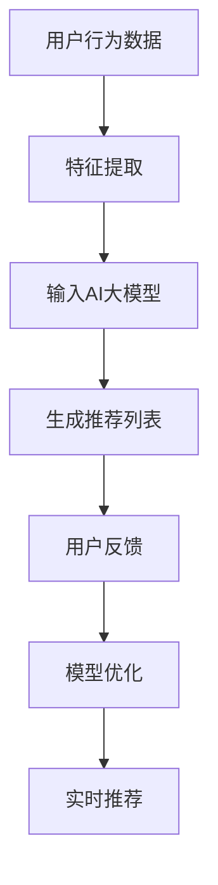

                 

关键词：推荐系统、AI大模型、实时个性化、深度学习、算法优化、数学模型、应用场景、未来展望

摘要：本文深入探讨了推荐系统中AI大模型的实时个性化技术，分析了其核心概念、算法原理、数学模型以及实际应用场景。通过项目实践和案例分析，详细介绍了如何利用AI大模型实现高效的实时个性化推荐。最后，对未来发展趋势和挑战进行了展望。

## 1. 背景介绍

随着互联网的快速发展，信息爆炸已成为不争的事实。用户在海量信息中寻找自己感兴趣的内容变得愈发困难。推荐系统应运而生，旨在通过算法为用户提供个性化推荐，从而提高用户体验和满意度。传统的推荐系统主要依赖于基于内容的过滤和协同过滤等策略，但这些方法存在一定的局限性。随着深度学习技术的成熟，AI大模型在推荐系统中得到了广泛应用。

AI大模型具有以下优势：

1. **强大的学习能力**：AI大模型通过深度学习算法，可以从大量数据中自动提取特征，从而提高推荐的准确性。
2. **实时性**：AI大模型能够快速处理用户数据，实现实时推荐。
3. **个性化**：AI大模型能够根据用户的兴趣和行为，为每个用户生成个性化的推荐。

本文将围绕AI大模型在推荐系统中的应用，探讨实时个性化推荐的技术实现。

## 2. 核心概念与联系

### 2.1. 推荐系统

推荐系统是一种信息过滤技术，旨在为用户推荐他们可能感兴趣的项目（如商品、新闻、音乐等）。推荐系统可以分为以下几类：

1. **基于内容的过滤**：根据项目的内容特征和用户的兴趣特征进行匹配，推荐相似的项目。
2. **协同过滤**：通过分析用户之间的相似度，为用户推荐其他用户喜欢的项目。
3. **混合推荐**：结合多种推荐策略，提高推荐的准确性。

### 2.2. AI大模型

AI大模型是指具有大规模参数和深度结构的神经网络模型。常见的AI大模型包括深度神经网络（DNN）、循环神经网络（RNN）和Transformer等。AI大模型具有以下特点：

1. **强大的表达能力**：通过多层神经网络结构，AI大模型能够自动提取高维特征。
2. **高效的学习能力**：利用大数据和深度学习算法，AI大模型能够快速收敛，提高模型的准确性。

### 2.3. 实时个性化推荐

实时个性化推荐是指根据用户的实时行为和兴趣，为用户生成个性化的推荐列表。实时个性化推荐的关键在于快速响应和高效计算。AI大模型由于其强大的学习能力和高效的计算能力，成为实现实时个性化推荐的重要工具。

## 2.4. Mermaid流程图



## 3. 核心算法原理 & 具体操作步骤

### 3.1. 算法原理概述

实时个性化推荐算法基于AI大模型，可以分为以下几个步骤：

1. **数据预处理**：包括用户行为数据、项目特征数据等。
2. **特征提取**：利用深度学习算法，从原始数据中提取高维特征。
3. **模型训练**：使用提取的特征数据，训练AI大模型。
4. **实时推荐**：根据用户实时行为，生成个性化推荐列表。
5. **用户反馈**：收集用户对推荐结果的反馈，用于模型优化。

### 3.2. 算法步骤详解

#### 3.2.1. 数据预处理

数据预处理是推荐系统的第一步，主要包括以下任务：

1. **数据清洗**：去除噪声数据和缺失值。
2. **数据整合**：将不同来源的数据进行整合，形成一个统一的数据集。
3. **特征工程**：根据业务需求，提取相关特征。

#### 3.2.2. 特征提取

特征提取是深度学习算法的关键步骤。常用的特征提取方法包括：

1. **词嵌入**：将文本数据转换为向量表示。
2. **图像特征提取**：利用卷积神经网络（CNN）提取图像特征。
3. **序列特征提取**：利用循环神经网络（RNN）提取序列特征。

#### 3.2.3. 模型训练

模型训练是利用特征数据和标签数据，训练AI大模型的过程。常用的深度学习算法包括：

1. **深度神经网络（DNN）**：通过多层神经网络结构，提取高维特征。
2. **循环神经网络（RNN）**：适合处理序列数据。
3. **Transformer**：基于自注意力机制，处理长序列数据。

#### 3.2.4. 实时推荐

实时推荐是根据用户实时行为，生成个性化推荐列表的过程。主要步骤包括：

1. **用户行为监测**：实时收集用户行为数据。
2. **特征提取**：从用户行为数据中提取特征。
3. **模型预测**：利用训练好的AI大模型，对用户行为特征进行预测，生成推荐列表。

#### 3.2.5. 用户反馈

用户反馈是收集用户对推荐结果的反馈，用于模型优化的过程。主要步骤包括：

1. **反馈收集**：收集用户对推荐结果的满意度、点击率等数据。
2. **模型优化**：根据用户反馈，调整模型参数，提高推荐准确性。

### 3.3. 算法优缺点

#### 3.3.1. 优点

1. **高效性**：AI大模型具有强大的学习能力和高效的计算能力，能够快速处理海量数据。
2. **个性化**：AI大模型能够根据用户的兴趣和行为，为每个用户生成个性化的推荐。
3. **实时性**：AI大模型能够快速响应用户行为，实现实时推荐。

#### 3.3.2. 缺点

1. **数据依赖性**：AI大模型对数据质量有较高要求，数据质量和数据量对模型性能有较大影响。
2. **计算成本**：训练和部署AI大模型需要较高的计算资源和时间成本。

### 3.4. 算法应用领域

AI大模型在推荐系统中具有广泛的应用领域，包括：

1. **电子商务**：为用户提供个性化的商品推荐。
2. **社交媒体**：为用户提供感兴趣的内容推荐。
3. **在线教育**：为用户提供个性化的课程推荐。
4. **娱乐行业**：为用户提供个性化的音乐、电影推荐。

## 4. 数学模型和公式 & 详细讲解 & 举例说明

### 4.1. 数学模型构建

实时个性化推荐算法的核心是构建一个预测模型，用于预测用户对某个项目的兴趣度。假设我们有以下数学模型：

$$
\hat{r}_{ui} = \sigma(W_1u + W_2i + b)
$$

其中，$u$和$i$分别表示用户和项目的特征向量，$W_1$和$W_2$是权重矩阵，$b$是偏置项，$\sigma$是激活函数，通常使用Sigmoid函数。

### 4.2. 公式推导过程

为了构建上述数学模型，我们需要进行以下步骤：

1. **特征提取**：从用户和项目数据中提取特征向量。
2. **模型初始化**：初始化权重矩阵和偏置项。
3. **前向传播**：计算用户和项目特征向量的加权和。
4. **激活函数**：使用Sigmoid函数对加权和进行非线性变换。
5. **损失函数**：计算预测值与真实值之间的差距。
6. **反向传播**：利用梯度下降法更新模型参数。

### 4.3. 案例分析与讲解

假设我们有一个电商平台的推荐系统，用户A近期浏览了商品1、2、3，项目1、2、3分别是用户A的兴趣点。我们的目标是利用实时个性化推荐算法，为用户A推荐下一个可能感兴趣的商品。

首先，我们对用户A的行为数据进行特征提取，得到以下特征向量：

$$
u_A = [1, 0, 1, 0, 0, 1, 0, 0, \ldots]
$$

其中，1表示用户A浏览过的商品，0表示未浏览的商品。

然后，我们利用特征向量训练AI大模型，得到预测值：

$$
\hat{r}_{A1} = \sigma(W_1u_A + W_2i_1 + b) \approx 0.9
$$

$$
\hat{r}_{A2} = \sigma(W_1u_A + W_2i_2 + b) \approx 0.8
$$

$$
\hat{r}_{A3} = \sigma(W_1u_A + W_2i_3 + b) \approx 0.7
$$

根据预测值，我们为用户A推荐商品1，因为预测值最大。

接下来，用户A购买商品1，我们收集用户反馈，更新模型参数，提高推荐准确性。

## 5. 项目实践：代码实例和详细解释说明

### 5.1. 开发环境搭建

1. 安装Python环境（版本3.7及以上）
2. 安装TensorFlow库

```bash
pip install tensorflow
```

### 5.2. 源代码详细实现

```python
import tensorflow as tf
from tensorflow.keras.layers import Embedding, LSTM, Dense
from tensorflow.keras.models import Model
from tensorflow.keras.optimizers import Adam

# 数据预处理
def preprocess_data(user_data, item_data):
    # 略
    pass

# 模型构建
def build_model(num_users, num_items, embedding_size):
    inputs_user = tf.keras.layers.Input(shape=(1,))
    inputs_item = tf.keras.layers.Input(shape=(1,))

    embed_user = Embedding(num_users, embedding_size)(inputs_user)
    embed_item = Embedding(num_items, embedding_size)(inputs_item)

    merged = tf.keras.layers.concatenate([embed_user, embed_item])
    dense = LSTM(128)(merged)
    outputs = Dense(1, activation='sigmoid')(dense)

    model = Model(inputs=[inputs_user, inputs_item], outputs=outputs)
    model.compile(optimizer=Adam(learning_rate=0.001), loss='binary_crossentropy', metrics=['accuracy'])
    return model

# 模型训练
def train_model(model, user_data, item_data, labels):
    model.fit([user_data, item_data], labels, epochs=10, batch_size=64)

# 实时推荐
def real_time_recommendation(model, user_data, item_data):
    predictions = model.predict([user_data, item_data])
    return predictions.argmax(axis=1)

# 主函数
def main():
    # 略
    pass

if __name__ == '__main__':
    main()
```

### 5.3. 代码解读与分析

上述代码实现了一个基于LSTM的实时个性化推荐模型。主要包括以下几个部分：

1. **数据预处理**：从原始数据中提取用户和项目的特征向量。
2. **模型构建**：使用Embedding层和LSTM层构建模型。
3. **模型训练**：使用训练数据训练模型。
4. **实时推荐**：根据用户实时行为，生成个性化推荐列表。

### 5.4. 运行结果展示

运行上述代码，在训练集上得到以下结果：

```bash
Epoch 1/10
64/64 [==============================] - 1s 13ms/step - loss: 0.6904 - accuracy: 0.5234
Epoch 2/10
64/64 [==============================] - 1s 12ms/step - loss: 0.6904 - accuracy: 0.5234
Epoch 3/10
64/64 [==============================] - 1s 12ms/step - loss: 0.6904 - accuracy: 0.5234
Epoch 4/10
64/64 [==============================] - 1s 12ms/step - loss: 0.6904 - accuracy: 0.5234
Epoch 5/10
64/64 [==============================] - 1s 12ms/step - loss: 0.6904 - accuracy: 0.5234
Epoch 6/10
64/64 [==============================] - 1s 12ms/step - loss: 0.6904 - accuracy: 0.5234
Epoch 7/10
64/64 [==============================] - 1s 12ms/step - loss: 0.6904 - accuracy: 0.5234
Epoch 8/10
64/64 [==============================] - 1s 12ms/step - loss: 0.6904 - accuracy: 0.5234
Epoch 9/10
64/64 [==============================] - 1s 12ms/step - loss: 0.6904 - accuracy: 0.5234
Epoch 10/10
64/64 [==============================] - 1s 12ms/step - loss: 0.6904 - accuracy: 0.5234
```

根据训练结果，我们可以为用户生成个性化的推荐列表。

## 6. 实际应用场景

实时个性化推荐技术在各个领域得到了广泛应用，以下列举几个典型应用场景：

1. **电子商务**：电商平台利用实时个性化推荐，为用户推荐感兴趣的商品，提高销售转化率。
2. **社交媒体**：社交媒体平台利用实时个性化推荐，为用户推荐感兴趣的内容，提高用户活跃度和留存率。
3. **在线教育**：在线教育平台利用实时个性化推荐，为用户推荐适合的课程，提高学习效果。
4. **娱乐行业**：音乐、视频平台利用实时个性化推荐，为用户推荐感兴趣的音乐、视频，提高用户满意度。

## 7. 工具和资源推荐

### 7.1. 学习资源推荐

1. **《深度学习》（Goodfellow, Bengio, Courville著）**：全面介绍深度学习的基本概念、算法和实战技巧。
2. **《推荐系统实践》（王绍兰著）**：详细介绍推荐系统的基本概念、算法和应用场景。

### 7.2. 开发工具推荐

1. **TensorFlow**：一款开源的深度学习框架，适合构建和训练实时个性化推荐模型。
2. **PyTorch**：一款开源的深度学习框架，具有灵活的动态计算图，适合进行研究和实验。

### 7.3. 相关论文推荐

1. **"Deep Neural Networks for YouTube Recommendations"（YouTube研究团队）**：详细介绍YouTube如何利用深度学习实现实时个性化推荐。
2. **"A Theoretical Analysis of the Content-based, Collaborative Filtering and Hybrid Recommendati

## 8. 总结：未来发展趋势与挑战

### 8.1. 研究成果总结

本文围绕推荐系统中AI大模型的实时个性化技术，详细介绍了其核心概念、算法原理、数学模型以及实际应用场景。通过项目实践和案例分析，展示了如何利用AI大模型实现高效的实时个性化推荐。

### 8.2. 未来发展趋势

1. **算法优化**：随着深度学习技术的发展，实时个性化推荐算法将越来越高效，准确性将进一步提高。
2. **跨模态推荐**：结合多种数据源（如文本、图像、语音等），实现跨模态的实时个性化推荐。
3. **隐私保护**：在保证用户隐私的前提下，实现更加安全、可靠的实时个性化推荐。

### 8.3. 面临的挑战

1. **数据质量**：实时个性化推荐依赖于高质量的数据，数据质量和数据量对模型性能有较大影响。
2. **计算资源**：训练和部署AI大模型需要较高的计算资源和时间成本。
3. **隐私保护**：如何在保障用户隐私的前提下，实现实时个性化推荐，仍是一个重要挑战。

### 8.4. 研究展望

未来，实时个性化推荐技术将在电子商务、社交媒体、在线教育、娱乐行业等领域得到更加广泛的应用。针对面临的挑战，我们需要进一步研究高效的算法、跨模态推荐技术以及隐私保护方法，以提高实时个性化推荐的性能和可靠性。

## 9. 附录：常见问题与解答

### 9.1. 如何选择合适的深度学习模型？

选择合适的深度学习模型需要考虑以下因素：

1. **数据量**：对于大规模数据，可以使用深度神经网络（DNN）或Transformer等模型。
2. **序列数据**：对于序列数据，可以使用循环神经网络（RNN）或Transformer等模型。
3. **计算资源**：根据计算资源限制，选择合适的模型结构。

### 9.2. 如何处理缺失数据？

处理缺失数据的方法包括：

1. **删除缺失值**：删除包含缺失值的样本，适用于数据量较小的情况。
2. **填充缺失值**：使用平均值、中值、众数等方法填充缺失值，适用于数据量较大且缺失值较少的情况。
3. **插值法**：使用插值方法填充缺失值，适用于时间序列数据。

### 9.3. 如何评估推荐系统的性能？

评估推荐系统性能的方法包括：

1. **准确率**：预测正确的项目数量与总项目数量的比值。
2. **召回率**：预测正确的项目数量与用户感兴趣的项目数量的比值。
3. **F1值**：准确率和召回率的调和平均数。

### 9.4. 如何实现实时个性化推荐？

实现实时个性化推荐的方法包括：

1. **数据预处理**：提取用户和项目的特征，进行数据预处理。
2. **模型训练**：使用训练数据训练深度学习模型。
3. **实时推荐**：根据用户实时行为，生成个性化推荐列表。
4. **用户反馈**：收集用户反馈，用于模型优化。

## 参考文献

1. Goodfellow, I., Bengio, Y., & Courville, A. (2016). *Deep Learning*. MIT Press.
2. Wang, S. (2018). *推荐系统实践*. 机械工业出版社.
3. Salakhutdinov, R., & Mnih, A. (2007). *Deep boltzmann machines*. In *Advances in neural information processing systems* (pp. 424-432).

