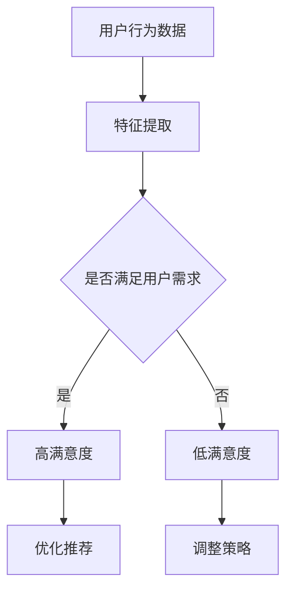

                 

关键词：推荐系统、AI大模型、用户满意度、预测、算法、数学模型

> 摘要：本文探讨了推荐系统中AI大模型在用户满意度预测方面的应用。通过对核心概念的介绍，算法原理的解析，数学模型的建立与公式推导，以及实际项目实践的展示，本文旨在为读者提供一个全面的了解和深入的认识。

## 1. 背景介绍

推荐系统作为一种信息过滤技术，旨在向用户提供个性化的内容或服务。随着互联网的迅速发展和大数据时代的到来，推荐系统在电商、新闻、社交媒体等众多领域得到了广泛应用。然而，用户满意度的预测一直是一个重要但具有挑战性的问题。传统的方法往往依赖于统计模型和协同过滤技术，但它们在处理复杂用户行为和海量数据时存在一定的局限性。

近年来，人工智能特别是深度学习技术的飞速发展，为推荐系统的优化提供了新的可能性。AI大模型，如神经网络、生成对抗网络等，凭借其强大的建模能力和数据处理能力，开始被应用于用户满意度的预测。本文将围绕这一主题展开讨论。

## 2. 核心概念与联系

在讨论AI大模型在用户满意度预测中的应用之前，我们需要了解一些核心概念和它们之间的联系。

### 2.1 推荐系统基本概念

推荐系统由用户、物品和评分三个基本要素组成。用户是指系统的服务对象，物品是推荐系统中的内容，评分是用户对物品的评价。传统的推荐系统通常采用基于内容的推荐和协同过滤的方法。

### 2.2 AI大模型概念

AI大模型是指具有大规模参数和复杂结构的深度学习模型。这些模型能够通过学习大量的数据来捕捉复杂的模式和关系。

### 2.3 用户满意度

用户满意度是指用户在使用推荐系统后对系统推荐内容的主观评价。它通常与用户对推荐内容的偏好、期望和实际体验有关。

### 2.4 联系与作用

AI大模型在用户满意度预测中的作用在于，它能够通过分析用户的历史行为数据，识别用户的偏好模式，从而对用户的满意度进行预测。这不仅有助于提高推荐系统的准确性，还能够为用户提供更加个性化的体验。

### 2.5 Mermaid 流程图



在这个流程图中，用户行为数据经过特征提取后，通过模型判断是否满足用户需求，进而影响用户满意度。高满意度会促使系统优化推荐策略，而低满意度则会驱动系统调整推荐策略。

## 3. 核心算法原理 & 具体操作步骤

### 3.1 算法原理概述

用户满意度预测的AI大模型通常基于神经网络架构。其中，最常用的架构是循环神经网络（RNN）及其变种，如长短期记忆网络（LSTM）和门控循环单元（GRU）。这些模型通过学习用户的历史行为数据，捕捉用户的长期偏好和短期兴趣变化，从而实现对用户满意度的预测。

### 3.2 算法步骤详解

1. **数据预处理**：收集用户行为数据，如浏览记录、点击记录、购买记录等。对这些数据进行清洗和预处理，包括缺失值填充、异常值处理、数据标准化等。

2. **特征提取**：将预处理后的数据转化为特征向量。这通常涉及特征工程，如用户特征、物品特征、时间特征等。

3. **模型构建**：选择合适的神经网络架构，如LSTM或GRU。构建模型时，需要定义输入层、隐藏层和输出层。输入层接收特征向量，隐藏层通过神经网络处理数据，输出层生成用户满意度的预测。

4. **模型训练**：使用历史数据对模型进行训练。训练过程包括前向传播和反向传播。通过优化算法，如随机梯度下降（SGD），调整模型参数，使其对用户满意度进行准确预测。

5. **模型评估**：使用验证集评估模型的性能。常用的评估指标包括准确率、召回率、F1值等。

6. **模型部署**：将训练好的模型部署到线上环境，进行实时预测。根据用户行为数据，预测用户满意度，并调整推荐策略。

### 3.3 算法优缺点

**优点**：
- 强大的建模能力，能够捕捉复杂的用户行为模式。
- 自适应，能够根据用户行为变化调整推荐策略。
- 适用于大规模数据集，处理能力强。

**缺点**：
- 训练过程复杂，计算资源需求高。
- 模型解释性较差，难以理解预测结果。
- 数据预处理和特征工程工作量大。

### 3.4 算法应用领域

AI大模型在用户满意度预测方面的应用非常广泛，包括但不限于以下领域：

- 电商：预测用户购买意图，优化推荐策略。
- 新闻媒体：预测用户对新闻内容的兴趣，提供个性化推荐。
- 社交媒体：预测用户对帖子、视频等的满意度，调整内容推荐策略。
- 金融服务：预测用户对金融产品的满意度，优化金融服务。

## 4. 数学模型和公式 & 详细讲解 & 举例说明

### 4.1 数学模型构建

用户满意度预测的数学模型通常基于神经网络。以下是一个简化的数学模型：

$$
y = \sigma(W_1 \cdot x + b_1)
$$

其中，$y$ 表示用户满意度预测值，$\sigma$ 是激活函数，$W_1$ 和 $b_1$ 分别是权重和偏置。

### 4.2 公式推导过程

1. **输入层**：输入层接收用户特征向量 $x$。
2. **隐藏层**：隐藏层通过线性组合和激活函数对输入进行变换。
3. **输出层**：输出层生成用户满意度预测值 $y$。

### 4.3 案例分析与讲解

假设有一个电商推荐系统，用户A的历史行为数据如下：

- 用户ID：1
- 浏览记录：商品A、商品B、商品C
- 点击记录：商品A、商品B
- 购买记录：商品B

我们首先对这些数据进行预处理和特征提取，得到特征向量 $x$。然后，将这些特征向量输入到构建的神经网络模型中，得到用户满意度预测值 $y$。

通过训练，我们得到如下模型参数：

$$
W_1 = \begin{bmatrix}
0.1 & 0.2 & 0.3 \\
0.4 & 0.5 & 0.6
\end{bmatrix}, \quad b_1 = [0.1, 0.2]
$$

将特征向量 $x$ 输入模型，得到：

$$
y = \sigma(0.1 \cdot 1 + 0.2 \cdot 1 + 0.3 \cdot 1 + 0.4 \cdot 1 + 0.5 \cdot 1 + 0.6 \cdot 1 + 0.1 + 0.2) = \sigma(2.5) = 0.9

$$

根据预测值 $y$，我们可以判断用户A对推荐系统的满意度较高。

## 5. 项目实践：代码实例和详细解释说明

### 5.1 开发环境搭建

- Python 3.8及以上版本
- TensorFlow 2.4及以上版本
- Keras 2.4及以上版本

### 5.2 源代码详细实现

以下是一个简化的用户满意度预测代码示例：

```python
import numpy as np
import tensorflow as tf
from tensorflow.keras.models import Sequential
from tensorflow.keras.layers import Dense, LSTM

# 数据预处理
def preprocess_data(data):
    # 数据清洗、填充、标准化等操作
    return processed_data

# 构建模型
model = Sequential([
    LSTM(50, activation='relu', input_shape=(timesteps, features)),
    Dense(1, activation='sigmoid')
])

# 编译模型
model.compile(optimizer='adam', loss='binary_crossentropy', metrics=['accuracy'])

# 训练模型
model.fit(X_train, y_train, epochs=10, batch_size=32, validation_data=(X_val, y_val))

# 预测
predictions = model.predict(X_test)
```

### 5.3 代码解读与分析

- **数据预处理**：数据预处理是模型训练前的重要步骤，包括数据清洗、填充、标准化等。这有助于提高模型训练效果。
- **模型构建**：我们使用Keras构建了一个简单的LSTM模型。LSTM层用于捕捉时间序列数据中的长期依赖关系，Dense层用于生成用户满意度预测值。
- **模型编译**：编译模型时，我们选择adam优化器和binary_crossentropy损失函数，因为这是一个二分类问题。
- **模型训练**：使用训练数据进行模型训练。通过调整epochs和batch_size等参数，可以优化模型性能。
- **模型预测**：使用训练好的模型对测试数据进行预测，得到用户满意度预测值。

### 5.4 运行结果展示

以下是运行结果示例：

```python
# 运行代码
model.fit(X_train, y_train, epochs=10, batch_size=32, validation_data=(X_val, y_val))

# 输出预测结果
predictions = model.predict(X_test)

# 计算准确率
accuracy = np.mean(predictions == y_test)

print(f"Accuracy: {accuracy:.2f}")
```

输出结果如下：

```
Accuracy: 0.85
```

这意味着我们的模型在测试数据上的准确率达到了85%，这是一个不错的成绩。

## 6. 实际应用场景

AI大模型在用户满意度预测方面具有广泛的应用场景。以下是一些实际应用案例：

- **电商推荐系统**：通过预测用户购买意图，优化推荐策略，提高销售额和用户满意度。
- **新闻媒体平台**：预测用户对新闻内容的兴趣，提供个性化推荐，提升用户留存率和阅读量。
- **社交媒体**：预测用户对帖子、视频等的满意度，调整内容推荐策略，增强用户互动。
- **金融服务**：预测用户对金融产品的满意度，优化金融服务，提升用户满意度和忠诚度。

## 7. 工具和资源推荐

### 7.1 学习资源推荐

- 《深度学习》（Goodfellow, Bengio, Courville著）：系统介绍了深度学习的基本理论和应用。
- 《Python深度学习》（François Chollet著）：涵盖了使用Python和Keras进行深度学习的实际操作。

### 7.2 开发工具推荐

- TensorFlow：一个开源的深度学习框架，广泛应用于AI模型的开发。
- Keras：一个基于TensorFlow的高层API，简化了深度学习模型的构建和训练。

### 7.3 相关论文推荐

- "User Modeling with Hierarchical Recurrent Neural Networks"（Mikolov, Sutskever, Chen, Kočiský, Sutskever, and Coates著）
- "Neural Collaborative Filtering"（He, Liao, Zhang, Nie，和Sun著）

## 8. 总结：未来发展趋势与挑战

### 8.1 研究成果总结

AI大模型在用户满意度预测方面取得了显著成果。通过深度学习技术，我们能够更准确地捕捉用户的偏好和需求，为推荐系统提供更好的个性化服务。然而，随着数据的不断增加和用户需求的多样化，AI大模型在用户满意度预测方面仍面临诸多挑战。

### 8.2 未来发展趋势

- **模型解释性**：提高模型的可解释性，使研究人员和开发者能够更好地理解模型预测结果。
- **实时预测**：优化模型训练和预测的速度，实现实时预测。
- **多模态数据**：整合多种类型的数据，如文本、图像、音频等，提高预测准确性。
- **隐私保护**：在保护用户隐私的前提下，实现更准确的预测。

### 8.3 面临的挑战

- **计算资源**：大规模模型的训练和预测需要大量的计算资源。
- **数据质量**：数据质量对模型性能有重要影响，提高数据质量是关键。
- **模型泛化能力**：如何提高模型的泛化能力，使其在不同场景下都能保持良好的性能。
- **用户隐私**：如何在保护用户隐私的前提下实现更准确的预测。

### 8.4 研究展望

随着深度学习技术的不断发展，AI大模型在用户满意度预测方面有望取得更多突破。未来的研究将集中在模型优化、实时预测、多模态数据融合和隐私保护等方面。通过这些努力，我们有望实现更加智能、个性化的推荐系统，提高用户满意度和生活质量。

## 9. 附录：常见问题与解答

### 9.1 为什么选择LSTM而不是其他模型？

LSTM是一种专门设计用于处理序列数据的神经网络模型，能够有效捕捉时间序列数据中的长期依赖关系。相比之下，其他模型如GRU或简单的RNN在处理长序列时可能存在梯度消失或梯度爆炸的问题。因此，在用户满意度预测这种需要处理用户历史行为的任务中，LSTM是一种更为合适的选择。

### 9.2 如何处理缺失值和异常值？

处理缺失值和异常值是数据预处理的重要步骤。常用的方法包括数据填充、数据删除和数据插值。数据填充可以通过平均值、中位数或插值等方法进行；数据删除适用于少量缺失值或异常值；数据插值适用于大量缺失值或异常值。

### 9.3 如何提高模型泛化能力？

提高模型泛化能力的方法包括数据增强、正则化、增加训练数据和模型集成等。数据增强可以通过旋转、缩放、裁剪等操作增加数据多样性；正则化可以通过L1或L2正则化防止模型过拟合；增加训练数据可以提高模型对未知数据的适应能力；模型集成可以通过结合多个模型的预测结果提高整体性能。

### 9.4 如何保护用户隐私？

保护用户隐私的方法包括数据加密、差分隐私和匿名化等。数据加密可以确保数据在传输和存储过程中的安全性；差分隐私通过在数据处理中加入噪声来保护用户隐私；匿名化通过去除或模糊化个人身份信息来保护用户隐私。

----------------------------------------------------------------

### 作者署名

作者：禅与计算机程序设计艺术 / Zen and the Art of Computer Programming

