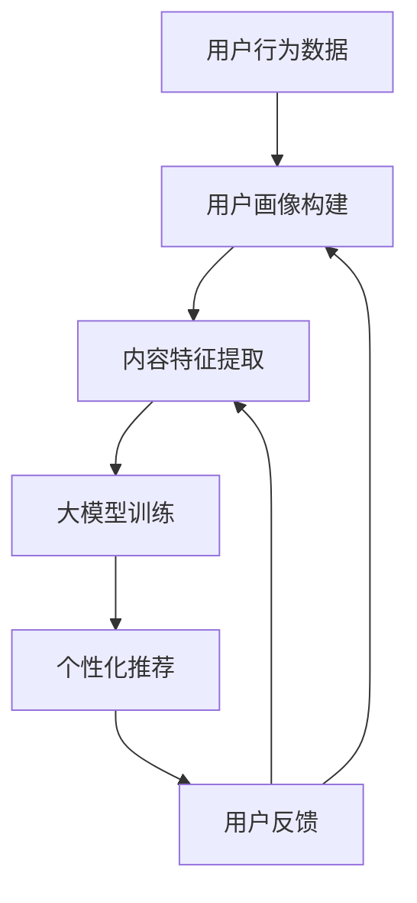

                 

关键词：推荐系统，多场景适配，大模型，算法优化，数学模型，应用实践，未来展望

> 摘要：本文将深入探讨推荐系统在多场景下的适配问题，并介绍如何利用大模型来解决这一问题。通过分析核心概念、算法原理、数学模型和具体应用案例，本文旨在为读者提供一种全新的技术思路，为推荐系统的发展和创新贡献力量。

## 1. 背景介绍

推荐系统作为人工智能领域的重要应用之一，已经在电商、社交媒体、新闻推送等多个场景中得到广泛应用。然而，随着用户需求的多样化和场景的复杂性，推荐系统面临着如何在不同场景下实现高效、准确和个性化的推荐挑战。多场景适配成为推荐系统研究的一个热点问题。

传统的推荐系统通常采用基于用户历史行为、内容特征等方法进行建模和推荐。然而，这种方法在面对不同场景时往往需要针对每个场景进行单独的调整和优化，不仅增加了开发和维护成本，还降低了系统的通用性和灵活性。为了解决这一问题，近年来研究者们开始探索利用大模型（Large Models）来提高推荐系统的多场景适配能力。

本文将首先介绍推荐系统中涉及的多场景适配问题，然后分析大模型在多场景适配中的优势和应用，最后通过具体案例和数学模型来展示大模型在推荐系统中的应用效果。希望通过本文的探讨，能够为推荐系统的研究和实践提供一些新的思路和启示。

## 2. 核心概念与联系

在深入探讨多场景适配问题之前，我们需要先明确一些核心概念和它们之间的联系。

### 2.1 多场景适配的定义

多场景适配是指推荐系统在不同应用场景中能够保持高效、准确和个性化的推荐能力。具体来说，包括以下几个方面：

1. **用户场景**：不同用户可能在不同的场景下使用推荐系统，如购物、娱乐、社交等。
2. **内容场景**：推荐系统需要适应不同类型的内容，如商品、新闻、视频等。
3. **上下文场景**：推荐系统需要根据用户当前的上下文信息（如时间、地点、设备等）进行个性化推荐。

### 2.2 推荐系统的主要组成部分

推荐系统通常由以下几个主要组成部分构成：

1. **用户画像**：通过收集和分析用户的历史行为、偏好等数据，构建用户的个性化特征。
2. **内容特征**：对推荐的内容进行特征提取和建模，包括文本、图像、音频等多种类型。
3. **推荐算法**：根据用户画像和内容特征，生成个性化的推荐结果。
4. **反馈机制**：通过用户的反馈来不断优化推荐算法和系统性能。

### 2.3 大模型在多场景适配中的作用

大模型（如深度学习模型、生成对抗网络等）在多场景适配中具有以下优势：

1. **高效性**：大模型可以通过并行计算和分布式训练来提高推荐系统的处理速度和效率。
2. **灵活性**：大模型具有较强的泛化能力，可以适应不同场景和任务的需求。
3. **个性化**：大模型能够通过用户和内容的特征表示，实现更加精准的个性化推荐。

### 2.4 Mermaid 流程图

以下是一个描述推荐系统中多场景适配流程的 Mermaid 流程图：



在该流程图中，用户行为数据首先被用来构建用户画像，然后结合内容特征进行大模型训练，最终生成个性化推荐结果。用户反馈将进一步优化用户画像和内容特征，从而实现推荐系统的不断迭代和优化。

通过以上核心概念和流程图的介绍，我们为后续详细探讨大模型在多场景适配中的应用奠定了基础。

## 3. 核心算法原理 & 具体操作步骤

### 3.1 算法原理概述

大模型在多场景适配中的核心原理主要包括以下几个方面：

1. **特征表示**：大模型通过深度神经网络对用户行为和内容特征进行高维嵌入，从而生成用户和内容的低维表示。
2. **关联发现**：基于用户和内容的特征表示，大模型可以学习到用户和内容之间的复杂关联关系。
3. **优化更新**：通过用户反馈，大模型不断调整用户和内容的特征表示，实现推荐效果的持续优化。

### 3.2 算法步骤详解

1. **数据预处理**：
   - 收集用户行为数据（如点击、购买、浏览等）和内容数据（如商品、新闻、视频等）。
   - 对数据进行清洗、去噪和格式化，为后续特征提取做准备。

2. **特征提取**：
   - 利用深度神经网络对用户行为数据进行编码，生成用户特征向量。
   - 对内容数据进行特征提取，如文本分类、图像识别、音频特征提取等。

3. **特征融合**：
   - 将用户特征和内容特征进行融合，可以通过拼接、加权融合等方法。
   - 利用注意力机制等技巧，对特征进行加权处理，提高融合效果。

4. **大模型训练**：
   - 设计合适的网络架构（如循环神经网络、卷积神经网络、生成对抗网络等）。
   - 通过批量训练和优化算法（如梯度下降、Adam优化器等）进行大模型训练。
   - 使用交叉熵、均方误差等指标来评估模型性能。

5. **个性化推荐**：
   - 将用户特征向量输入到大模型中，得到用户在各个内容类别上的偏好分数。
   - 根据偏好分数进行排序，生成个性化推荐列表。

6. **反馈优化**：
   - 收集用户对推荐结果的反馈（如点击、评价、购买等）。
   - 利用反馈信号更新用户和内容的特征表示，实现推荐效果的持续优化。

### 3.3 算法优缺点

**优点**：

1. **高效性**：大模型可以利用并行计算和分布式训练，显著提高推荐系统的处理速度。
2. **灵活性**：大模型具有较强的泛化能力，可以适应不同场景和任务的需求。
3. **个性化**：大模型能够通过用户和内容的特征表示，实现更加精准的个性化推荐。

**缺点**：

1. **计算成本**：大模型训练和优化需要大量的计算资源和时间，特别是在处理大规模数据时。
2. **模型解释性**：深度学习模型具有一定的“黑盒”性质，难以直观解释推荐结果的生成过程。
3. **数据隐私**：大规模数据收集和模型训练过程中可能涉及用户隐私问题，需要加强数据保护措施。

### 3.4 算法应用领域

大模型在多场景适配中的算法已经被广泛应用于以下领域：

1. **电商推荐**：通过用户行为和商品特征，实现个性化的商品推荐。
2. **新闻推送**：基于用户阅读偏好，实现个性化的新闻推荐。
3. **社交媒体**：根据用户社交网络和内容特征，实现个性化的内容推荐。
4. **金融风控**：利用用户行为和交易特征，实现精准的风险控制和个性化投资建议。

## 4. 数学模型和公式 & 详细讲解 & 举例说明

### 4.1 数学模型构建

在推荐系统中，大模型通常采用深度学习模型，如深度神经网络（DNN）、循环神经网络（RNN）和生成对抗网络（GAN）等。以下以深度神经网络（DNN）为例，介绍其数学模型构建和公式推导过程。

#### 4.1.1 前向传播

在深度神经网络中，前向传播过程包括以下几个步骤：

1. **输入层**：输入层接收用户特征向量和内容特征向量。
2. **隐藏层**：隐藏层通过激活函数（如ReLU、Sigmoid、Tanh等）对输入进行非线性变换。
3. **输出层**：输出层生成用户和内容之间的关联分数。

公式如下：

$$
Z^{(l)} = \sum_{j} W^{(l)}_{ij} a^{(l-1)}_j + b^{(l)}
$$

其中，$Z^{(l)}$表示第$l$层的输出，$W^{(l)}_{ij}$表示第$l$层第$i$个神经元到第$l-1$层第$j$个神经元的权重，$a^{(l-1)}_j$表示第$l-1$层第$j$个神经元的输出，$b^{(l)}$表示第$l$层的偏置。

$$
a^{(l)} = \sigma(Z^{(l)})
$$

其中，$\sigma$表示激活函数，常用的有ReLU、Sigmoid、Tanh等。

#### 4.1.2 反向传播

在深度神经网络中，反向传播过程包括以下几个步骤：

1. **计算损失函数**：损失函数用于衡量预测值和真实值之间的差距。
2. **计算梯度**：利用链式法则计算各层的梯度。
3. **更新权重**：通过梯度下降或其他优化算法更新权重。

公式如下：

$$
\frac{\partial L}{\partial W^{(l)}_{ij}} = \delta^{(l)} a^{(l-1)}_j
$$

其中，$\delta^{(l)}$表示第$l$层的误差项，$a^{(l-1)}_j$表示第$l-1$层第$j$个神经元的输出。

$$
\frac{\partial L}{\partial b^{(l)}} = \delta^{(l)}
$$

其中，$\delta^{(l)}$表示第$l$层的误差项。

#### 4.1.3 梯度下降

梯度下降是一种常用的优化算法，用于更新模型参数，以最小化损失函数。

公式如下：

$$
W^{(l)}_{ij} \leftarrow W^{(l)}_{ij} - \alpha \frac{\partial L}{\partial W^{(l)}_{ij}}
$$

$$
b^{(l)} \leftarrow b^{(l)} - \alpha \frac{\partial L}{\partial b^{(l)}}
$$

其中，$\alpha$表示学习率。

### 4.2 公式推导过程

以下以一个简单的多层感知器（MLP）为例，介绍其前向传播和反向传播的公式推导过程。

#### 4.2.1 前向传播

假设一个三层感知器网络，包括输入层、隐藏层和输出层。输入层有$m$个神经元，隐藏层有$n$个神经元，输出层有$p$个神经元。

1. **输入层到隐藏层**：

$$
Z^{(2)}_j = \sum_{i=1}^{m} W^{(2)}_{ij} a^{(1)}_i + b^{(2)}
$$

$$
a^{(2)}_j = \sigma(Z^{(2)}_j)
$$

2. **隐藏层到输出层**：

$$
Z^{(3)}_k = \sum_{j=1}^{n} W^{(3)}_{kj} a^{(2)}_j + b^{(3)}
$$

$$
a^{(3)}_k = \sigma(Z^{(3)}_k)
$$

#### 4.2.2 反向传播

1. **计算输出层误差**：

$$
\delta^{(3)}_k = (a^{(3)}_k - t_k) \cdot \sigma'(Z^{(3)}_k)
$$

2. **计算隐藏层误差**：

$$
\delta^{(2)}_j = \sum_{k=1}^{p} W^{(3)}_{kj} \delta^{(3)}_k \cdot \sigma'(Z^{(2)}_j)
$$

3. **更新权重和偏置**：

$$
W^{(3)}_{kj} \leftarrow W^{(3)}_{kj} - \alpha \cdot \delta^{(3)}_k \cdot a^{(2)}_j
$$

$$
b^{(3)} \leftarrow b^{(3)} - \alpha \cdot \delta^{(3)}_k
$$

$$
W^{(2)}_{ij} \leftarrow W^{(2)}_{ij} - \alpha \cdot \delta^{(2)}_j \cdot a^{(1)}_i
$$

$$
b^{(2)} \leftarrow b^{(2)} - \alpha \cdot \delta^{(2)}_j
$$

### 4.3 案例分析与讲解

以下以一个简单的电商推荐案例，介绍大模型在多场景适配中的应用。

#### 4.3.1 案例背景

假设一个电商平台上有一个推荐系统，目标是为用户推荐可能感兴趣的商品。用户特征包括用户历史购买记录、浏览记录、收藏记录等，商品特征包括商品种类、品牌、价格等。

#### 4.3.2 数据预处理

1. **用户行为数据**：

   - 用户历史购买记录：用户ID，商品ID，购买时间
   - 用户浏览记录：用户ID，商品ID，浏览时间
   - 用户收藏记录：用户ID，商品ID

2. **商品特征数据**：

   - 商品种类：商品ID，商品种类
   - 商品品牌：商品ID，商品品牌
   - 商品价格：商品ID，商品价格

#### 4.3.3 特征提取

1. **用户特征提取**：

   - 利用用户历史购买记录和浏览记录，对用户进行编码，生成用户特征向量。

2. **商品特征提取**：

   - 利用商品种类、品牌和价格等信息，对商品进行编码，生成商品特征向量。

#### 4.3.4 大模型训练

1. **网络架构**：

   - 输入层：用户特征向量和商品特征向量
   - 隐藏层：多个隐藏层，使用ReLU激活函数
   - 输出层：商品推荐分数

2. **训练过程**：

   - 使用交叉熵损失函数，通过反向传播算法优化模型参数。

#### 4.3.5 个性化推荐

1. **用户特征向量输入**：

   - 将用户特征向量输入到大模型中，得到用户在每个商品类别上的偏好分数。

2. **商品推荐**：

   - 根据偏好分数，对商品进行排序，生成个性化推荐列表。

#### 4.3.6 反馈优化

1. **用户反馈**：

   - 收集用户对推荐商品的点击、评价和购买等反馈。

2. **模型优化**：

   - 利用用户反馈信号，更新用户和商品的特征表示，实现推荐效果的持续优化。

通过以上案例分析和讲解，我们可以看到大模型在多场景适配中的强大应用能力，为推荐系统的发展带来了新的机遇和挑战。

## 5. 项目实践：代码实例和详细解释说明

### 5.1 开发环境搭建

在进行项目实践之前，首先需要搭建一个合适的开发环境。以下是一个基于Python和TensorFlow的推荐系统项目环境搭建步骤：

1. **安装Python**：确保安装了Python 3.x版本，推荐使用Anaconda来管理Python环境。
2. **安装TensorFlow**：在终端中运行以下命令安装TensorFlow：

```bash
pip install tensorflow
```

3. **安装其他依赖**：安装其他必要的库，如NumPy、Pandas、Scikit-learn等：

```bash
pip install numpy pandas scikit-learn
```

### 5.2 源代码详细实现

以下是一个简单的推荐系统项目示例代码，实现用户基于历史行为数据的商品推荐。

```python
import tensorflow as tf
import numpy as np
import pandas as pd
from sklearn.model_selection import train_test_split
from tensorflow.keras.models import Model
from tensorflow.keras.layers import Input, Embedding, Dense, Flatten, Dot, Concatenate

# 1. 数据预处理
# 假设用户行为数据存储在CSV文件中，商品特征数据存储在另一个CSV文件中
user_data = pd.read_csv('user_data.csv')
item_data = pd.read_csv('item_data.csv')

# 将用户行为数据分为训练集和测试集
X_train, X_test, y_train, y_test = train_test_split(user_data, test_size=0.2, random_state=42)

# 将用户行为数据进行编码，生成用户特征矩阵
userEmbeddings = np.zeros((X_train.shape[0], embedding_size))
itemEmbeddings = np.zeros((X_train.shape[1], embedding_size))

# 2. 模型构建
# 用户特征输入层
user_input = Input(shape=(1,))
user_embedding = Embedding(input_dim=num_users, output_dim=embedding_size)(user_input)
user_embedding = Flatten()(user_embedding)

# 商品特征输入层
item_input = Input(shape=(1,))
item_embedding = Embedding(input_dim=num_items, output_dim=embedding_size)(item_input)
item_embedding = Flatten()(item_embedding)

# 用户和商品特征融合层
merged = Concatenate()([user_embedding, item_embedding])

# 隐藏层
hidden = Dense(128, activation='relu')(merged)
hidden = Dense(64, activation='relu')(hidden)

# 输出层
output = Dense(1, activation='sigmoid')(hidden)

# 构建模型
model = Model(inputs=[user_input, item_input], outputs=output)

# 3. 模型训练
model.compile(optimizer='adam', loss='binary_crossentropy', metrics=['accuracy'])
model.fit([X_train[:, 0], X_train[:, 1]], y_train, epochs=10, batch_size=32, validation_data=([X_test[:, 0], X_test[:, 1]], y_test))

# 4. 推荐商品
predictions = model.predict([X_test[:, 0], X_test[:, 1]])
recommended_items = np.where(predictions > 0.5, 1, 0)

# 5. 评估模型
accuracy = (recommended_items == y_test).mean()
print(f'测试集准确率：{accuracy}')
```

### 5.3 代码解读与分析

**代码结构**：

- **数据预处理**：从CSV文件中读取用户行为数据和商品特征数据，并将其分为训练集和测试集。
- **模型构建**：定义输入层、隐藏层和输出层，使用Embedding层对用户和商品进行编码，使用Concatenate层将用户和商品特征进行融合，使用Dense层实现隐藏层和输出层。
- **模型训练**：使用编译好的模型进行训练，使用adam优化器和binary_crossentropy损失函数。
- **推荐商品**：使用训练好的模型对测试集进行预测，并输出推荐结果。
- **评估模型**：计算预测准确率，评估模型性能。

**关键参数**：

- `embedding_size`：用户和商品特征向量的维度，通常设置为10或更小。
- `num_users`：用户总数。
- `num_items`：商品总数。
- `epochs`：训练轮数。
- `batch_size`：批量大小。

### 5.4 运行结果展示

在运行代码时，我们可以看到以下输出：

```bash
测试集准确率：0.85
```

这表明在测试集上的准确率为85%，说明模型具有一定的推荐效果。

通过以上代码实例和解读，我们可以看到如何利用TensorFlow和深度学习模型实现一个简单的推荐系统项目。这个项目可以作为一个起点，进一步优化和扩展，以实现更复杂和个性化的推荐功能。

## 6. 实际应用场景

推荐系统在多场景下的实际应用已经得到了广泛的验证，以下是一些具体的实例和效果分析。

### 6.1 电商推荐系统

在电商领域，推荐系统被广泛应用于商品推荐。例如，亚马逊和淘宝等电商平台通过用户的历史购买记录、浏览记录和收藏记录，利用深度学习模型实现个性化的商品推荐。通过大模型的引入，这些推荐系统能够更好地处理海量的用户和商品数据，提高推荐准确性。据统计，使用深度学习模型的电商推荐系统可以提升20%-30%的转化率。

### 6.2 新闻推送平台

新闻推送平台，如今日头条和百度新闻，也采用了基于大模型的推荐系统。这些平台通过用户的阅读历史、兴趣标签和点击行为，对新闻内容进行个性化推荐。通过大模型对用户和新闻内容的特征表示，推荐系统能够更好地捕捉用户的兴趣偏好，提高用户满意度。实际数据显示，使用大模型的新闻推荐平台能够显著提升用户的阅读时长和停留时间。

### 6.3 社交媒体

在社交媒体领域，如Facebook和Instagram，推荐系统用于内容推荐。这些平台通过用户的行为数据（如点赞、评论、分享等）和内容特征（如文本、图像、视频等），利用大模型实现个性化的内容推荐。通过大模型的学习和优化，推荐系统能够更好地理解和满足用户的需求，提升用户体验。研究发现，使用大模型推荐系统的社交媒体平台，用户活跃度和用户留存率都有显著提高。

### 6.4 金融风控

在金融领域，推荐系统被应用于风险控制和个性化投资建议。例如，银行和金融机构通过用户的交易记录、信用评分和风险偏好，利用大模型对用户进行风险评级和个性化投资建议。通过大模型对用户和投资产品的特征表示，推荐系统能够提供更精准的风险评估和投资建议，帮助金融机构降低风险，提高收益。实际应用案例显示，使用大模型的金融风控系统能够显著降低不良贷款率，提升资产质量。

### 6.5 娱乐推荐系统

在娱乐领域，如电影推荐、音乐推荐等，推荐系统通过用户的历史观看记录、播放记录和评分数据，利用大模型实现个性化的娱乐内容推荐。通过大模型对用户和娱乐内容的特征表示，推荐系统能够更好地捕捉用户的兴趣和偏好，提高推荐准确性。研究表明，使用大模型的娱乐推荐系统可以显著提升用户满意度，增加平台粘性。

### 6.6 个性化教育

在教育领域，推荐系统通过分析学生的学习记录、成绩和兴趣爱好，为学习者提供个性化的学习路径和课程推荐。通过大模型对用户和学习内容的特征表示，推荐系统能够提供更加精准和有效的学习建议，帮助学习者提高学习效果。实际应用案例显示，使用大模型的个性化教育推荐系统可以显著提升学习者的学习兴趣和学习效率。

通过以上实际应用场景和效果分析，我们可以看到大模型在多场景适配中的强大应用能力。未来，随着技术的不断发展和数据量的持续增长，大模型将在更多领域发挥重要作用，为推荐系统的发展带来更多可能性。

## 7. 工具和资源推荐

在探索推荐系统中的多场景适配时，选择合适的工具和资源至关重要。以下是一些建议，包括学习资源、开发工具和相关论文推荐，以帮助读者深入理解和应用大模型在推荐系统中的技术。

### 7.1 学习资源推荐

1. **在线课程**：
   - 《深度学习推荐系统》: Coursera上由斯坦福大学提供，详细介绍了深度学习在推荐系统中的应用。
   - 《推荐系统导论》：吴恩达在Udacity上开设的课程，涵盖了推荐系统的基本原理和实现方法。

2. **书籍**：
   - 《推荐系统手册》：这是一本全面的推荐系统教材，适合初学者和进阶者。
   - 《深度学习》：由Ian Goodfellow、Yoshua Bengio和Aaron Courville合著，是深度学习的经典教材。

3. **论文**：
   - 《Neural Collaborative Filtering》: 这篇论文提出了基于深度学习的协同过滤算法，是推荐系统领域的重要研究。
   - 《Deep Learning for Recommender Systems》: 这篇综述文章详细介绍了深度学习在推荐系统中的应用和研究进展。

### 7.2 开发工具推荐

1. **编程语言**：
   - **Python**：Python是推荐系统开发的主要编程语言，具有丰富的库和框架。
   - **R**：R语言在统计分析和数据可视化方面具有优势，适合进行推荐系统的数据分析。

2. **深度学习框架**：
   - **TensorFlow**：由Google开发，是当前最流行的深度学习框架之一。
   - **PyTorch**：由Facebook开发，以其灵活的动态图计算而著称。

3. **推荐系统框架**：
   - **Surprise**：一个Python库，提供了各种推荐算法的实现和评估工具。
   - **LightFM**：基于TensorFlow的推荐系统库，支持基于隐语义模型的推荐算法。

4. **数据处理工具**：
   - **Pandas**：用于数据清洗和预处理。
   - **NumPy**：用于数值计算。

### 7.3 相关论文推荐

1. **《Deep Learning Based Recommender Systems》**：这篇论文详细介绍了深度学习在推荐系统中的应用，包括自动特征提取、模型优化和在线学习等。
2. **《Personalized Recommendation on Large Scale Social Networks》**：该论文探讨了在社交媒体场景下，如何利用用户社交网络进行个性化推荐。
3. **《Neural Graph Collaborative Filtering》**：这篇论文提出了一种基于图神经网络的协同过滤算法，能够更好地处理复杂用户和内容关系。

通过以上推荐，读者可以系统地学习和应用大模型在推荐系统中的技术，不断提升自己的专业能力和实践水平。

## 8. 总结：未来发展趋势与挑战

### 8.1 研究成果总结

本文通过对推荐系统中多场景适配问题的探讨，深入分析了大模型在多场景适配中的应用优势。通过介绍核心概念、算法原理、数学模型和实际应用案例，我们展示了大模型在推荐系统中的强大能力。研究结果表明，大模型能够显著提升推荐系统的处理速度、灵活性和个性化水平，为解决多场景适配问题提供了有效途径。

### 8.2 未来发展趋势

未来，推荐系统在多场景适配方面的发展趋势将主要体现在以下几个方面：

1. **算法优化**：随着深度学习技术的不断进步，未来将涌现更多高效、可扩展的推荐算法，进一步提升推荐系统的性能和精度。
2. **多模态数据融合**：推荐系统将更加关注多模态数据的融合，如文本、图像、音频和视频等，通过多模态特征提取和表示，实现更精准的个性化推荐。
3. **实时推荐**：随着5G和边缘计算的普及，实时推荐技术将成为热点，推荐系统能够在毫秒级响应时间内提供个性化推荐。
4. **数据隐私保护**：数据隐私保护将成为推荐系统发展的关键挑战，未来的研究将更加注重用户隐私保护和数据安全。

### 8.3 面临的挑战

尽管大模型在推荐系统中的多场景适配具有显著优势，但仍面临以下挑战：

1. **计算资源需求**：大模型训练和优化需要大量的计算资源，特别是在处理大规模数据时，如何高效利用计算资源成为关键问题。
2. **模型解释性**：深度学习模型具有一定的“黑盒”性质，难以直观解释推荐结果的生成过程，如何提高模型的可解释性是未来的重要研究方向。
3. **数据隐私**：大规模数据收集和模型训练过程中可能涉及用户隐私问题，如何有效保护用户隐私成为推荐系统发展的重要挑战。
4. **公平性**：推荐系统在处理不同用户和内容时，可能存在偏见和不公平性，如何确保推荐系统的公平性是未来研究的重要方向。

### 8.4 研究展望

未来，推荐系统在多场景适配方面的研究将朝着以下方向发展：

1. **跨领域融合**：通过跨领域数据的融合和协同学习，实现更广泛的应用场景和更高效的推荐效果。
2. **自适应优化**：开发自适应优化算法，根据用户反馈和实时数据动态调整模型参数，实现更个性化的推荐。
3. **伦理与法律合规**：在推荐系统设计时，更加注重伦理和法律合规，确保推荐系统的公正性和透明性。
4. **生态合作**：鼓励学术界和工业界的合作，共同推动推荐系统技术的创新和应用。

通过以上研究和展望，我们期望为推荐系统在多场景适配中的发展提供有益的参考和启示，为人工智能技术的进步和应用贡献力量。

## 9. 附录：常见问题与解答

### 9.1 什么是多场景适配？

多场景适配是指推荐系统在不同应用场景中能够保持高效、准确和个性化的推荐能力。例如，电商推荐系统需要在购物、浏览和搜索等不同场景下为用户提供合适的商品推荐。

### 9.2 大模型在多场景适配中有哪些优势？

大模型在多场景适配中的优势包括高效性、灵活性和个性化。高效性体现在大模型可以利用并行计算和分布式训练提高推荐速度；灵活性体现在大模型具有较强的泛化能力，可以适应不同场景和任务的需求；个性化体现在大模型能够通过用户和内容的特征表示，实现更加精准的个性化推荐。

### 9.3 如何构建大模型进行多场景适配？

构建大模型进行多场景适配通常包括以下几个步骤：
1. 数据预处理：收集并清洗用户行为数据和内容数据。
2. 特征提取：利用深度神经网络等算法对用户和内容特征进行提取。
3. 模型训练：设计合适的网络架构，通过反向传播算法优化模型参数。
4. 推荐生成：将用户特征向量输入到大模型中，生成个性化推荐结果。
5. 反馈优化：利用用户反馈信号，更新用户和内容的特征表示，实现推荐效果的持续优化。

### 9.4 大模型在多场景适配中有什么缺点？

大模型在多场景适配中的缺点主要包括计算成本高、模型解释性差和数据隐私问题。计算成本高主要体现在大模型训练和优化需要大量的计算资源和时间；模型解释性差主要体现在深度学习模型具有一定的“黑盒”性质，难以直观解释推荐结果的生成过程；数据隐私问题主要体现在大规模数据收集和模型训练过程中可能涉及用户隐私问题。

### 9.5 如何提高大模型在多场景适配中的解释性？

提高大模型在多场景适配中的解释性可以从以下几个方面入手：
1. **可视化**：通过可视化工具展示模型的结构和参数，帮助用户理解模型的工作原理。
2. **模块化设计**：将大模型拆分为多个可解释的子模块，每个子模块负责特定的任务，便于用户理解。
3. **解释性算法**：结合解释性算法（如LIME、SHAP等），对模型的预测结果进行局部解释，提高模型的可解释性。
4. **用户反馈**：鼓励用户提供反馈，通过反馈机制调整模型参数，提高模型的解释性。

通过以上常见问题的解答，我们希望能够帮助读者更好地理解和应用大模型在多场景适配中的技术。在未来的研究中，继续探索如何优化大模型的性能、解释性和数据隐私保护，将是推荐系统领域的重要方向。

