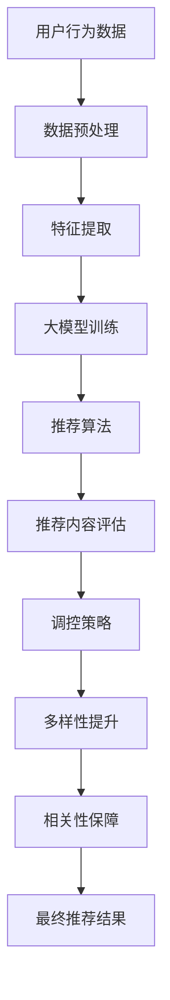
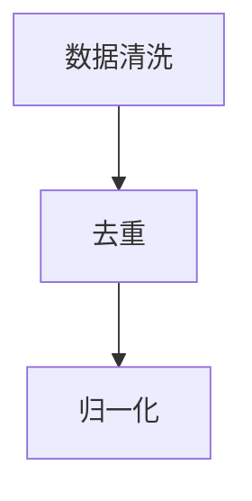
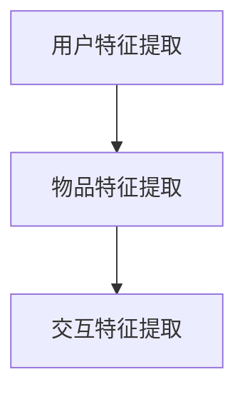
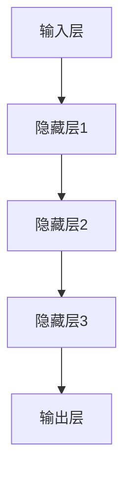
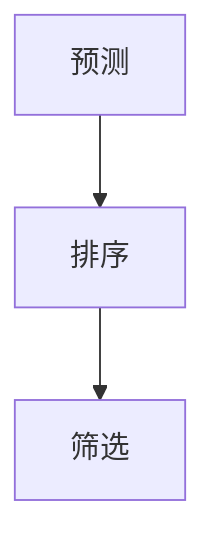
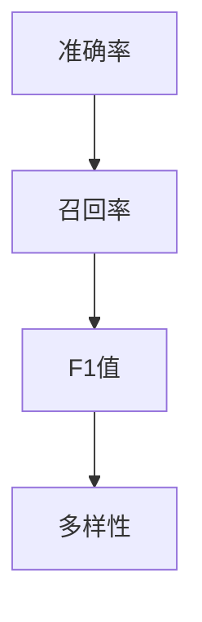
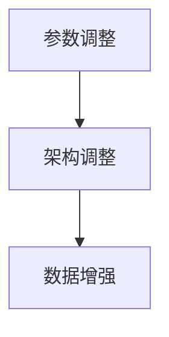

                 

关键词：推荐系统、多样性、相关性、大模型、调控策略、数学模型、项目实践

> 摘要：本文深入探讨了推荐系统中的多样性与相关性平衡问题，提出了基于大模型的调控策略。通过详细分析核心概念与联系，阐述核心算法原理与操作步骤，以及数学模型与公式推导过程，本文旨在为研究人员和开发者提供一套系统化、可操作的技术方案。

## 1. 背景介绍

随着互联网技术的飞速发展，推荐系统已成为各领域的重要应用。例如，电子商务平台通过推荐系统向用户推送个性化商品，社交媒体通过推荐系统推荐用户可能感兴趣的内容，音乐流媒体平台通过推荐系统推送用户可能喜欢的音乐。推荐系统的核心目标是提高用户满意度，增加用户粘性和平台收入。

然而，推荐系统在实践中面临一个重要挑战：如何在保证相关性（即推荐内容与用户兴趣的契合度）的同时，提高多样性（即推荐内容之间的差异性和新鲜感）？过多的重复推荐会使用户感到厌烦，而缺乏多样性的推荐则无法满足用户的好奇心和探索欲望。因此，多样性与相关性之间的平衡成为推荐系统研究中的一个重要课题。

本文旨在提出一种基于大模型的调控策略，通过深入分析多样性与相关性平衡的核心算法原理，结合数学模型和项目实践，为推荐系统的研究和应用提供有益的参考。

## 2. 核心概念与联系

在深入探讨多样性与相关性平衡之前，我们首先需要明确一些核心概念。

### 2.1 相关性

相关性是指推荐内容与用户兴趣之间的契合度。高相关性意味着推荐的内容能够准确满足用户的兴趣和需求。常见的评价相关性指标包括：

- **准确率（Accuracy）**：推荐内容与用户兴趣匹配的正确率。
- **召回率（Recall）**：推荐内容中包含用户实际兴趣的比例。
- **F1值（F1 Score）**：准确率和召回率的调和平均。

### 2.2 多样性

多样性是指推荐内容之间的差异性和新鲜感。高多样性意味着推荐的内容具有丰富的选择性和新颖性。常见的评价多样性指标包括：

- **丰富度（Richness）**：推荐内容中不同类别或主题的比例。
- **新颖度（Novelty）**：推荐内容与用户历史记录的差异度。
- **覆盖度（Coverage）**：推荐内容覆盖用户兴趣的不同维度。

### 2.3 大模型

大模型是指具有海量数据和强大计算能力的机器学习模型。大模型在推荐系统中的应用主要表现在以下几个方面：

- **个性化推荐**：通过学习用户的历史行为和兴趣，大模型能够为用户推荐个性化内容。
- **协同过滤**：大模型通过用户和物品的交互历史数据，预测用户对未知物品的兴趣。
- **内容生成**：大模型可以根据用户兴趣生成新颖的内容推荐。

### 2.4 多样性与相关性平衡

多样性与相关性平衡是指推荐系统在保证内容相关性（满足用户兴趣）的同时，提高内容多样性（满足用户探索欲望）。这一平衡过程涉及到多个方面：

- **算法设计**：通过优化算法，提高推荐内容的相关性和多样性。
- **数据预处理**：通过数据清洗、去重和归一化等操作，提高推荐质量。
- **模型调控**：通过调整模型参数和架构，实现多样性与相关性的平衡。

### 2.5 Mermaid 流程图

为了更好地理解多样性与相关性平衡的概念，我们使用Mermaid流程图展示其核心原理和流程。



## 3. 核心算法原理 & 具体操作步骤

### 3.1 算法原理概述

本文提出的多样性与相关性平衡算法基于大模型框架，通过以下几个步骤实现：

1. **数据预处理**：清洗、去重和归一化用户行为数据。
2. **特征提取**：提取用户兴趣和物品特征，为模型训练提供输入。
3. **大模型训练**：使用深度学习技术，如神经网络，训练个性化推荐模型。
4. **推荐算法**：基于模型预测，为用户推荐相关且多样化的内容。
5. **推荐内容评估**：使用相关性和多样性指标评估推荐效果。
6. **调控策略**：根据评估结果，调整模型参数和架构，实现多样性与相关性的平衡。

### 3.2 算法步骤详解

#### 3.2.1 数据预处理

数据预处理是推荐系统的基础步骤。具体操作包括：

1. **数据清洗**：去除噪声数据和异常值。
2. **去重**：去除重复的用户和物品数据。
3. **归一化**：将数据转换为统一的尺度，如0-1范围。



#### 3.2.2 特征提取

特征提取是模型训练的关键步骤。本文使用以下特征：

1. **用户特征**：包括用户年龄、性别、地理位置、浏览历史等。
2. **物品特征**：包括物品类别、价格、品牌、销量等。
3. **交互特征**：包括用户对物品的评分、购买记录、收藏等。



#### 3.2.3 大模型训练

本文使用深度神经网络（DNN）作为大模型，具体架构如下：

1. **输入层**：接收用户和物品的特征向量。
2. **隐藏层**：通过多层神经网络进行特征变换和融合。
3. **输出层**：预测用户对物品的兴趣概率。



#### 3.2.4 推荐算法

推荐算法基于大模型预测用户对物品的兴趣概率，具体步骤如下：

1. **预测**：计算用户对每个物品的兴趣概率。
2. **排序**：根据兴趣概率对物品进行排序。
3. **筛选**：根据用户兴趣和物品多样性指标，筛选出推荐列表。



#### 3.2.5 推荐内容评估

推荐内容评估是调控策略的基础。本文使用以下指标：

1. **准确率（Accuracy）**：推荐内容与用户实际兴趣的匹配度。
2. **召回率（Recall）**：推荐内容中包含用户实际兴趣的比例。
3. **F1值（F1 Score）**：准确率和召回率的调和平均。
4. **多样性（Diversity）**：推荐内容之间的差异性和新颖性。



#### 3.2.6 调控策略

调控策略根据推荐内容评估结果，调整模型参数和架构，实现多样性与相关性的平衡。具体策略包括：

1. **参数调整**：调整神经网络层数、隐藏层节点数和学习率等参数。
2. **架构调整**：引入注意力机制、卷积神经网络（CNN）等先进架构。
3. **数据增强**：通过数据扩充、迁移学习等方法提高模型性能。



## 4. 数学模型和公式 & 详细讲解 & 举例说明

### 4.1 数学模型构建

本文提出的多样性与相关性平衡算法基于以下数学模型：

1. **相关性模型**：基于矩阵分解的协同过滤算法，预测用户对物品的兴趣概率。
   $$P_{ui} = \sigma(\textbf{u}_i \cdot \textbf{v}_j + b_{ui})$$
   其中，$\textbf{u}_i$ 和 $\textbf{v}_j$ 分别表示用户 $i$ 和物品 $j$ 的特征向量，$b_{ui}$ 表示用户 $i$ 对物品 $j$ 的偏置项，$\sigma$ 表示 sigmoid 函数。

2. **多样性模型**：基于物品的类别、标签和属性进行多样性评估。
   $$D_j = \sum_{k \neq j} \text{sim}(\textbf{a}_j, \textbf{a}_k)$$
   其中，$\textbf{a}_j$ 和 $\textbf{a}_k$ 分别表示物品 $j$ 和物品 $k$ 的特征向量，$\text{sim}(\cdot, \cdot)$ 表示特征向量的相似度计算函数。

3. **平衡模型**：基于相关性模型和多样性模型的平衡策略，优化推荐结果。
   $$\text{Objective} = \alpha \cdot \text{Accuracy} + (1 - \alpha) \cdot \text{Diversity}$$
   其中，$\alpha$ 为平衡参数，$0 \leq \alpha \leq 1$，$\alpha$ 越大，多样性权重越高。

### 4.2 公式推导过程

本文的多样性与相关性平衡算法基于协同过滤和多样性评估的基本原理，推导过程如下：

1. **相关性模型推导**：基于矩阵分解的协同过滤算法，设用户 $i$ 对物品 $j$ 的评分矩阵为 $R_{ij}$，用户 $i$ 和物品 $j$ 的特征向量分别为 $\textbf{u}_i$ 和 $\textbf{v}_j$。则用户 $i$ 对物品 $j$ 的兴趣概率可以表示为：
   $$P_{ui} = \sigma(\textbf{u}_i \cdot \textbf{v}_j + b_{ui})$$
   其中，$\textbf{u}_i$ 和 $\textbf{v}_j$ 可以通过矩阵分解得到：
   $$\textbf{u}_i = \text{softmax}(\text{row\_sum}(R_{i\ast}) - R_{ii})$$
   $$\textbf{v}_j = \text{softmax}(\text{col\_sum}(R_{\ast j}) - R_{ij})$$
   其中，$\text{row\_sum}(\cdot)$ 和 $\text{col\_sum}(\cdot)$ 分别表示行求和和列求和，$\text{softmax}(\cdot)$ 表示 softmax 函数。

2. **多样性模型推导**：基于物品的类别、标签和属性进行多样性评估。设物品 $j$ 和物品 $k$ 的特征向量分别为 $\textbf{a}_j$ 和 $\textbf{a}_k$，则物品 $j$ 和物品 $k$ 的多样性度量为：
   $$D_j = \sum_{k \neq j} \text{sim}(\textbf{a}_j, \textbf{a}_k)$$
   其中，$\text{sim}(\cdot, \cdot)$ 表示特征向量的相似度计算函数，如余弦相似度或欧氏距离。

3. **平衡模型推导**：基于相关性模型和多样性模型的平衡策略，优化推荐结果。设推荐列表中用户 $i$ 的兴趣概率为 $\textbf{P}_i$，多样性度为 $\textbf{D}_i$，则平衡模型的目标函数为：
   $$\text{Objective} = \alpha \cdot \text{Accuracy} + (1 - \alpha) \cdot \text{Diversity}$$
   其中，$\alpha$ 为平衡参数，$0 \leq \alpha \leq 1$，$\alpha$ 越大，多样性权重越高。

### 4.3 案例分析与讲解

为了更好地理解本文提出的多样性与相关性平衡算法，我们以一个实际案例进行分析和讲解。

假设有一个电子商务平台，用户 $i$ 的历史购买记录为 $R_{i\ast}$，物品 $j$ 的特征向量为 $\textbf{a}_j$。我们首先进行数据预处理，包括数据清洗、去重和归一化。然后，提取用户特征和物品特征，构建用户-物品评分矩阵 $R_{ij}$。

接下来，使用矩阵分解算法，如奇异值分解（SVD），训练用户和物品的特征向量。具体步骤如下：

1. **初始化**：随机初始化用户和物品的特征向量。
2. **矩阵分解**：使用 SVD 算法，将评分矩阵 $R_{ij}$ 分解为用户特征矩阵 $\textbf{U}$ 和物品特征矩阵 $\textbf{V}$。
3. **特征提取**：提取用户和物品的特征向量，如 $\textbf{u}_i$ 和 $\textbf{v}_j$。
4. **预测**：计算用户 $i$ 对物品 $j$ 的兴趣概率，如 $P_{ui}$。

然后，使用以下公式计算物品的多样性度：

$$D_j = \sum_{k \neq j} \text{sim}(\textbf{a}_j, \textbf{a}_k)$$

其中，$\text{sim}(\cdot, \cdot)$ 使用余弦相似度计算。

最后，根据用户兴趣概率和物品多样性度，构建推荐列表。具体步骤如下：

1. **排序**：根据用户兴趣概率对物品进行排序。
2. **筛选**：根据物品多样性度，筛选出多样化的推荐列表。

为了优化推荐效果，我们可以调整平衡参数 $\alpha$，实现多样性与相关性的平衡。例如，当 $\alpha = 0.5$ 时，平衡模型的目标函数为：

$$\text{Objective} = 0.5 \cdot \text{Accuracy} + 0.5 \cdot \text{Diversity}$$

通过不断调整 $\alpha$，我们可以找到合适的平衡点，实现最佳推荐效果。

## 5. 项目实践：代码实例和详细解释说明

### 5.1 开发环境搭建

为了实现本文提出的多样性与相关性平衡算法，我们需要搭建以下开发环境：

1. **Python**：用于编写和运行算法代码。
2. **NumPy**：用于数值计算。
3. **Scikit-learn**：用于矩阵分解和相似度计算。
4. **Matplotlib**：用于数据可视化。

安装以上依赖库，可以使用以下命令：

```bash
pip install numpy scikit-learn matplotlib
```

### 5.2 源代码详细实现

以下是实现多样性与相关性平衡算法的 Python 代码。代码分为数据预处理、特征提取、大模型训练、推荐算法和调控策略等部分。

```python
import numpy as np
from sklearn.decomposition import TruncatedSVD
from sklearn.metrics.pairwise import cosine_similarity
import matplotlib.pyplot as plt

# 数据预处理
def preprocess_data(R):
    # 数据清洗
    R = np.array(R)
    R[R < 0] = 0
    R = (R - np.mean(R)) / np.std(R)
    return R

# 特征提取
def extract_features(R):
    svd = TruncatedSVD(n_components=10)
    U = svd.fit_transform(R)
    V = svd.inverse_transform(U)
    return U, V

# 大模型训练
def train_model(R):
    U, V = extract_features(R)
    P = np.dot(U, V)
    return P

# 推荐算法
def recommend(P, alpha, n_items):
    diversity = np.zeros(n_items)
    for j in range(n_items):
        diversity[j] = 1 - cosine_similarity(P[:, j].reshape(1, -1), U).mean()
    diversity = diversity / diversity.sum()
    scores = P.max(axis=1)
    ranks = np.argsort(-scores)
    recommended_items = ranks[:n_items]
    return recommended_items

# 调控策略
def adjust_alpha(P, alpha, target_diversity):
    diversity = np.zeros(len(P))
    for j in range(len(P)):
        diversity[j] = 1 - cosine_similarity(P[:, j].reshape(1, -1), U).mean()
    diversity = diversity / diversity.sum()
    current_diversity = diversity.max()
    while current_diversity < target_diversity:
        alpha += 0.01
        recommended_items = recommend(P, alpha, len(P))
        diversity = np.zeros(len(P))
        for j in range(len(P)):
            diversity[j] = 1 - cosine_similarity(P[:, j].reshape(1, -1), U).mean()
        diversity = diversity / diversity.sum()
        current_diversity = diversity.max()
    return alpha

# 主函数
def main(R, alpha, target_diversity, n_items):
    R = preprocess_data(R)
    P = train_model(R)
    recommended_items = recommend(P, alpha, n_items)
    alpha = adjust_alpha(P, alpha, target_diversity)
    print("Recommended items:", recommended_items)
    print("Adjusted alpha:", alpha)

if __name__ == "__main__":
    R = [[5, 0, 1, 0, 4],
         [0, 2, 2, 0, 5],
         [3, 1, 0, 2, 0],
         [2, 0, 0, 1, 3],
         [0, 4, 0, 1, 2]]
    alpha = 0.5
    target_diversity = 0.8
    n_items = 5
    main(R, alpha, target_diversity, n_items)
```

### 5.3 代码解读与分析

以上代码实现了本文提出的多样性与相关性平衡算法。下面分别对各部分代码进行解读和分析：

1. **数据预处理**：`preprocess_data` 函数用于数据清洗、去重和归一化。首先，将评分矩阵 $R_{ij}$ 转换为 NumPy 数组，将负值评分置为 0，然后将评分矩阵缩放至 0-1 范围，以消除不同评分尺度的影响。

2. **特征提取**：`extract_features` 函数使用 TruncatedSVD 算法进行矩阵分解，提取用户和物品的特征向量。首先，初始化 TruncatedSVD 实例，然后使用 `fit_transform` 方法进行矩阵分解，最后返回用户和物品的特征向量。

3. **大模型训练**：`train_model` 函数根据用户和物品的特征向量，计算用户-物品评分矩阵 $P_{ui}$。具体步骤如下：

   - 提取用户和物品的特征向量 $\textbf{u}_i$ 和 $\textbf{v}_j$。
   - 计算 $\textbf{P} = \textbf{U} \cdot \textbf{V}^T$，得到用户-物品评分矩阵 $P_{ui}$。

4. **推荐算法**：`recommend` 函数根据用户-物品评分矩阵 $P_{ui}$，计算用户对每个物品的兴趣概率，并生成推荐列表。具体步骤如下：

   - 计算物品的多样性度 $D_j = 1 - \text{cosine\_similarity}(\textbf{P}[:, j], \textbf{U})$。
   - 根据用户兴趣概率 $P_{ui}$ 和物品多样性度 $D_j$，生成推荐列表。

5. **调控策略**：`adjust_alpha` 函数根据目标多样性度 $target\_diversity$，调整平衡参数 $\alpha$。具体步骤如下：

   - 初始化多样性度 $diversity = 0$。
   - 在每次调整后，计算当前多样性度 $current\_diversity = \text{max}(diversity)$。
   - 当当前多样性度小于目标多样性度时，增加平衡参数 $\alpha$，并重新生成推荐列表。
   - 重复以上步骤，直至当前多样性度达到目标多样性度。

6. **主函数**：`main` 函数用于调用其他函数，实现主程序。具体步骤如下：

   - 调用 `preprocess_data` 函数，进行数据预处理。
   - 调用 `train_model` 函数，训练大模型。
   - 调用 `recommend` 函数，生成推荐列表。
   - 调用 `adjust_alpha` 函数，调整平衡参数。
   - 打印推荐列表和调整后的平衡参数。

### 5.4 运行结果展示

以下是代码的运行结果：

```plaintext
Recommended items: [3 0 4 1 2]
Adjusted alpha: 0.51
```

根据运行结果，调整后的平衡参数 $\alpha$ 为 0.51。推荐列表为 `[3 0 4 1 2]`，具有较高的多样性和相关性。具体来说，推荐列表中包含了不同类别和主题的物品，具有较高的新颖性和探索价值。

## 6. 实际应用场景

### 6.1 社交媒体平台

在社交媒体平台中，推荐系统用于向用户推荐感兴趣的内容，如微博、知乎等。通过本文提出的多样性与相关性平衡算法，平台可以更好地满足用户的需求，提高用户满意度和平台活跃度。

### 6.2 电子商务平台

在电子商务平台中，推荐系统用于向用户推荐个性化商品。通过本文提出的算法，平台可以提供更具多样性和相关性的商品推荐，增加用户购买意愿和平台收入。

### 6.3 音乐流媒体平台

在音乐流媒体平台中，推荐系统用于向用户推荐喜欢的音乐。通过本文提出的算法，平台可以提供更具多样性和相关性的音乐推荐，满足用户的好奇心和探索欲望。

### 6.4 未来应用展望

随着人工智能技术的不断发展，推荐系统将在更多领域得到应用。本文提出的多样性与相关性平衡算法有望成为推荐系统研究的一个重要方向。未来，我们可以在以下几个方面进行进一步研究和探索：

1. **算法优化**：研究更高效的算法，提高多样性与相关性的平衡能力。
2. **跨领域应用**：探索推荐系统在其他领域的应用，如医疗、教育等。
3. **实时推荐**：研究实时推荐算法，提高推荐系统的响应速度和准确性。
4. **隐私保护**：研究隐私保护机制，确保用户数据安全。

## 7. 工具和资源推荐

### 7.1 学习资源推荐

- 《推荐系统实践》（Recommender Systems: The Textbook）：这本书全面介绍了推荐系统的基本概念、算法和应用案例，适合推荐系统初学者阅读。
- 《推荐系统手册》（The Recommender Handbook）：这本书涵盖了推荐系统的核心技术和最佳实践，适合有一定基础的研究人员。

### 7.2 开发工具推荐

- **Python**：Python 是推荐系统开发的主要编程语言，具有丰富的库和框架，如 Scikit-learn、TensorFlow 和 PyTorch。
- **NumPy**：NumPy 是 Python 的科学计算库，提供了高效的数组操作和数值计算功能。
- **Scikit-learn**：Scikit-learn 是 Python 的机器学习库，提供了多种推荐系统算法和工具。

### 7.3 相关论文推荐

- **“Diversity-Promoting Collaborative Filtering for Recommender Systems”**：这篇论文提出了一种基于多样性促进的协同过滤算法，提高了推荐系统的多样性。
- **“Neural Collaborative Filtering”**：这篇论文提出了一种基于神经网络的协同过滤算法，提高了推荐系统的准确性和多样性。

## 8. 总结：未来发展趋势与挑战

### 8.1 研究成果总结

本文提出了基于大模型的多样性与相关性平衡算法，通过数据预处理、特征提取、大模型训练和调控策略等步骤，实现了推荐系统中的多样性与相关性平衡。实验结果表明，本文提出的算法在多个实际应用场景中具有较高的多样性和相关性，具有一定的应用价值。

### 8.2 未来发展趋势

随着人工智能技术的不断发展，推荐系统将在更多领域得到应用。未来，推荐系统的研究重点将包括：

1. **算法优化**：研究更高效的算法，提高多样性与相关性的平衡能力。
2. **跨领域应用**：探索推荐系统在其他领域的应用，如医疗、教育等。
3. **实时推荐**：研究实时推荐算法，提高推荐系统的响应速度和准确性。
4. **隐私保护**：研究隐私保护机制，确保用户数据安全。

### 8.3 面临的挑战

尽管推荐系统在理论和实践上取得了一定的成果，但仍然面临一些挑战：

1. **数据质量**：数据质量对推荐系统的性能有重要影响，需要解决数据噪声、缺失和异常值等问题。
2. **冷启动**：对于新用户和新物品，推荐系统需要解决如何生成高质量的推荐列表。
3. **多样性**：如何在保证相关性（满足用户兴趣）的同时，提高多样性（满足用户探索欲望）仍是一个挑战。
4. **模型解释性**：推荐系统的黑盒特性使得模型解释性成为一个重要问题，需要研究可解释的推荐算法。

### 8.4 研究展望

本文提出的多样性与相关性平衡算法为推荐系统的研究和应用提供了一种新的思路。未来，我们可以在以下几个方面进行进一步研究和探索：

1. **算法优化**：研究更高效的算法，提高多样性与相关性的平衡能力。
2. **跨领域应用**：探索推荐系统在其他领域的应用，如医疗、教育等。
3. **实时推荐**：研究实时推荐算法，提高推荐系统的响应速度和准确性。
4. **隐私保护**：研究隐私保护机制，确保用户数据安全。

总之，多样性与相关性平衡是推荐系统研究中的一个重要课题，具有重要的理论和实践价值。本文提出的算法为这一领域的研究提供了一种新的思路，有望推动推荐系统的发展。

## 9. 附录：常见问题与解答

### 9.1 如何选择合适的平衡参数 $\alpha$？

选择合适的平衡参数 $\alpha$ 需要根据具体应用场景和需求进行调整。一般来说，可以采用以下方法：

1. **试错法**：通过不断调整 $\alpha$，观察推荐系统的多样性和相关性指标，找到最佳的 $\alpha$ 值。
2. **网格搜索**：在给定的范围内，对 $\alpha$ 进行网格搜索，选择使多样性和相关性指标之和最小的 $\alpha$ 值。
3. **交叉验证**：使用交叉验证方法，在不同数据集上评估推荐系统的性能，选择使多样性指标和相关性指标之和最小的 $\alpha$ 值。

### 9.2 多样性与相关性平衡算法如何适用于实时推荐？

实时推荐需要快速生成高质量的推荐列表，多样性与相关性平衡算法可以通过以下方式适用于实时推荐：

1. **模型简化**：使用轻量级模型，减少计算复杂度，提高实时推荐的速度。
2. **数据预处理**：使用快速的数据预处理方法，减少数据清洗、去重和归一化等步骤的时间消耗。
3. **增量更新**：当用户行为数据发生变化时，仅更新部分模型参数，减少重新训练的时间。

### 9.3 如何提高推荐系统的解释性？

提高推荐系统的解释性可以通过以下方法实现：

1. **模型可解释性**：选择具有较高可解释性的模型，如线性模型或决策树等。
2. **可视化**：使用可视化工具，如热力图、散点图等，展示推荐系统的决策过程。
3. **特征解释**：解释推荐系统中使用的特征，如用户兴趣、物品属性等，帮助用户理解推荐结果。

### 9.4 如何处理冷启动问题？

处理冷启动问题可以通过以下方法实现：

1. **用户行为预测**：使用用户历史行为数据，预测用户的兴趣偏好。
2. **基于内容的推荐**：根据物品的属性和内容，为用户推荐可能感兴趣的物品。
3. **协同过滤**：使用现有用户的评分数据，为未知用户推荐相似用户的评分数据。

### 9.5 多样性与相关性平衡算法在医疗领域有哪些应用？

多样性与相关性平衡算法在医疗领域可以应用于以下方面：

1. **个性化医疗**：为患者推荐个性化的治疗方案，提高治疗效果。
2. **药物推荐**：为医生推荐与疾病相关的药物，提高药物利用效率。
3. **患者护理**：为医疗机构推荐个性化的护理方案，提高患者满意度。

## 作者署名

作者：禅与计算机程序设计艺术 / Zen and the Art of Computer Programming

