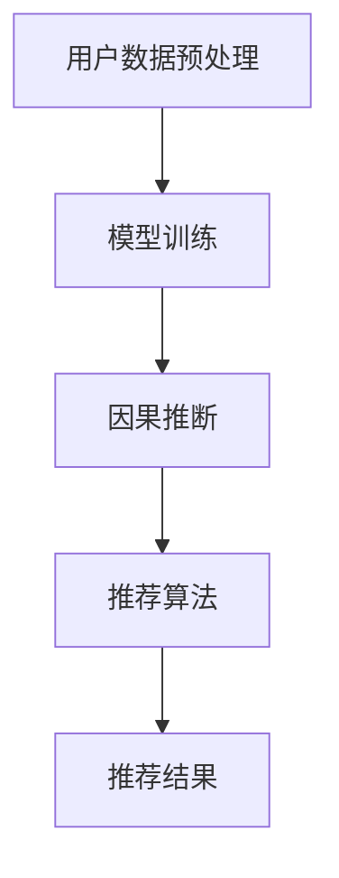
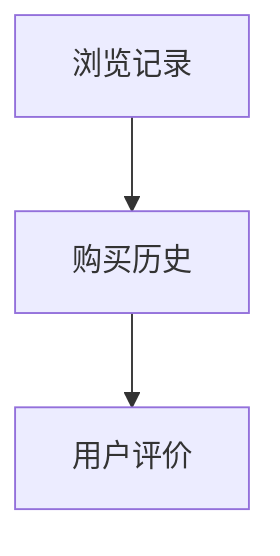

                 

摘要：
本文旨在探讨推荐系统中大模型因果推断的应用，深入解析其核心概念、算法原理、数学模型以及具体实践。通过详细阐述推荐系统的背景和因果推断的必要性，本文将介绍大模型因果推断的基本原理，解析其优缺点和应用领域。此外，还将通过数学模型和公式的推导，结合实际项目实践中的代码实例，对大模型因果推断进行详细讲解。最后，本文将总结研究成果，展望未来发展趋势和挑战。

## 1. 背景介绍

推荐系统作为大数据时代的重要技术，广泛应用于电子商务、社交媒体、在线视频、新闻推荐等多个领域。随着用户数据的爆炸性增长和个性化需求的提升，推荐系统的性能和准确性成为关键。传统的推荐系统主要依赖于用户行为数据，通过统计学习和机器学习方法进行预测和推荐。然而，这些方法往往忽略了用户行为背后的因果因素，导致推荐结果的不稳定和偏差。

因果推断作为一种研究因果关系的统计方法，近年来在机器学习和数据科学领域得到了广泛关注。其目的是通过分析数据来发现变量之间的因果关联，从而提高推荐系统的可靠性和解释性。大模型因果推断则是结合了深度学习和因果推断的优势，通过大规模数据训练和优化，实现更准确和可靠的推荐结果。

本文将重点关注推荐系统中的大模型因果推断应用，深入探讨其核心概念、算法原理、数学模型和实践。通过本文的阅读，读者将能够了解大模型因果推断的基本原理和应用方法，从而为实际项目提供有益的指导。

## 2. 核心概念与联系

### 2.1 推荐系统的基本概念

推荐系统是一种通过分析用户行为数据、历史记录和偏好，向用户推荐相关内容或商品的技术。其核心目标是提高用户体验和满意度，促进商业转化和用户留存。推荐系统通常包括用户建模、内容建模和推荐算法三个主要模块。

- **用户建模**：通过分析用户的行为数据，如浏览记录、购买历史、评论等，构建用户的特征向量，以描述用户的偏好和兴趣。
- **内容建模**：对推荐系统中的内容进行特征提取，如商品属性、文本描述、图片等，以建立内容特征向量。
- **推荐算法**：根据用户建模和内容建模的结果，利用各种算法为用户推荐相关的内容或商品。常见的推荐算法包括基于内容的推荐、基于协同过滤的推荐和基于模型的推荐等。

### 2.2 因果推断的基本概念

因果推断是一种研究变量之间因果关系的统计方法。其目标是通过对观察数据进行分析，确定变量之间的因果关联，从而为实际决策提供依据。在推荐系统中，因果推断可以帮助我们更好地理解用户行为背后的驱动因素，提高推荐系统的解释性和可靠性。

- **因果关联**：因果关联是指变量之间的因果关系，即一个变量对另一个变量的影响。
- **因果模型**：因果模型是描述变量之间因果关系的数学模型，常见的因果模型包括因果图、Do-Calculus等。
- **因果推断方法**：因果推断方法包括基于统计分析的方法和基于机器学习的方法。基于统计分析的方法包括假设检验、回归分析等；基于机器学习的方法包括深度学习、因果图模型等。

### 2.3 大模型因果推断的架构

大模型因果推断结合了深度学习和因果推断的优势，通过大规模数据训练和优化，实现更准确和可靠的推荐结果。其基本架构包括以下几个关键部分：

- **数据预处理**：对原始用户行为数据进行清洗、去噪和特征提取，生成高质量的训练数据集。
- **模型训练**：利用深度学习算法，如深度神经网络、循环神经网络等，对训练数据集进行训练，构建大模型。
- **因果推断**：利用因果推断方法，对训练好的大模型进行优化和调整，实现因果推断。
- **推荐算法**：结合用户建模和内容建模的结果，利用优化后的因果模型进行推荐，生成推荐结果。

### 2.4 Mermaid 流程图

下面是一个描述推荐系统中大模型因果推断的 Mermaid 流程图，展示了各个关键部分之间的关联和流程。



在流程图中，用户数据预处理是整个过程的起点，通过数据清洗和特征提取，生成高质量的训练数据集。模型训练利用深度学习算法，对训练数据集进行训练，构建大模型。因果推断利用因果推断方法，对训练好的大模型进行优化和调整。最后，推荐算法结合用户建模和内容建模的结果，生成推荐结果。

通过以上内容，我们对推荐系统中大模型因果推断的基本概念和架构有了初步了解。接下来，我们将进一步深入探讨大模型因果推断的核心算法原理和具体操作步骤。

### 3. 核心算法原理 & 具体操作步骤

#### 3.1 算法原理概述

大模型因果推断的核心在于通过深度学习模型捕捉用户行为数据中的因果关联，从而提高推荐系统的准确性和可靠性。这一过程主要包括以下几个关键步骤：

1. **数据预处理**：对原始用户行为数据进行清洗、去噪和特征提取，生成高质量的训练数据集。
2. **模型训练**：利用深度学习算法，如深度神经网络（DNN）、循环神经网络（RNN）等，对训练数据集进行训练，构建大模型。
3. **因果推断**：利用因果推断方法，如因果图模型（Causal Graphical Models，CGM）、Do-Calculus等，对训练好的大模型进行优化和调整，实现因果推断。
4. **推荐算法**：结合用户建模和内容建模的结果，利用优化后的因果模型进行推荐，生成推荐结果。

#### 3.2 算法步骤详解

1. **数据预处理**：
   - **数据清洗**：去除重复数据、噪声数据和异常数据，保证数据的一致性和质量。
   - **特征提取**：根据用户行为数据的特点，提取用户兴趣、偏好等关键特征，如用户浏览记录、购买历史、评论等。常用的特征提取方法包括词袋模型（Bag-of-Words，BoW）、词嵌入（Word Embedding）等。
   - **数据集划分**：将处理后的数据集划分为训练集、验证集和测试集，用于后续的模型训练和性能评估。

2. **模型训练**：
   - **模型选择**：选择合适的深度学习模型，如DNN、RNN等。DNN具有较强的非线性表达能力，适合处理高维数据；RNN适合处理序列数据，能够捕捉用户行为的时序特征。
   - **损失函数**：根据推荐系统的目标，设计合适的损失函数，如均方误差（Mean Squared Error，MSE）、交叉熵（Cross-Entropy）等。损失函数用于衡量预测值与真实值之间的差距，指导模型训练。
   - **优化算法**：选择合适的优化算法，如随机梯度下降（Stochastic Gradient Descent，SGD）、Adam等，用于最小化损失函数。优化算法通过不断调整模型参数，使模型能够更好地拟合训练数据。

3. **因果推断**：
   - **因果图模型**：构建因果图模型，表示用户行为数据中的因果关联。因果图模型通过图结构描述变量之间的因果关系，能够有效地发现潜在的因素和影响因素。
   - **Do-Calculus**：Do-Calculus是一种基于因果图的推理方法，用于计算变量之间的因果效应。Do-Calculus通过因果图中的路径分析和变量消除，实现因果效应的推导和计算。
   - **模型优化**：利用因果推断方法，对训练好的大模型进行优化和调整，提高模型的因果推断能力。优化过程包括模型参数调整、模型结构调整等。

4. **推荐算法**：
   - **用户建模**：利用优化后的因果模型，对用户行为数据进行建模，提取用户的兴趣和偏好特征。
   - **内容建模**：对推荐系统中的内容进行建模，提取内容的关键特征，如商品属性、文本描述、图片等。
   - **推荐生成**：结合用户建模和内容建模的结果，利用优化后的因果模型，为用户生成推荐结果。推荐算法可以采用基于协同过滤的推荐方法，如矩阵分解（Matrix Factorization）、基于模型的推荐方法，如深度学习模型等。

#### 3.3 算法优缺点

1. **优点**：
   - **高准确性**：大模型因果推断通过深度学习和因果推断的结合，能够更好地捕捉用户行为数据中的因果关联，提高推荐系统的准确性和可靠性。
   - **强解释性**：因果推断方法能够提供变量之间的因果解释，有助于理解用户行为背后的驱动因素，增强推荐系统的透明度和可解释性。
   - **灵活性**：大模型因果推断适用于多种数据类型和场景，能够适应不同的推荐系统和业务需求。

2. **缺点**：
   - **数据依赖性**：大模型因果推断依赖于大量高质量的用户行为数据，数据质量直接影响模型的性能和可靠性。
   - **计算复杂性**：因果推断方法的计算过程较为复杂，对计算资源和时间要求较高，不适合实时推荐系统。
   - **结果解释难度**：因果推断方法生成的结果较为复杂，需要专业知识和技术支持，对普通用户理解和应用存在一定难度。

#### 3.4 算法应用领域

大模型因果推断在推荐系统中的应用广泛，以下是一些典型的应用领域：

1. **电子商务**：通过分析用户行为数据，为用户推荐相关商品，提高销售额和用户满意度。
2. **社交媒体**：为用户提供个性化内容推荐，如新闻、文章、视频等，提升用户体验和用户黏性。
3. **在线视频**：为用户提供个性化视频推荐，提高用户观看时长和用户留存率。
4. **新闻推荐**：根据用户兴趣和偏好，为用户推荐相关新闻，提高新闻的传播效果和用户参与度。

总之，大模型因果推断在推荐系统中具有广泛的应用前景，通过深入理解用户行为和挖掘变量之间的因果关联，能够为用户提供更准确、可靠的推荐结果。接下来，我们将通过数学模型和公式的推导，进一步探讨大模型因果推断的核心原理。

### 4. 数学模型和公式 & 详细讲解 & 举例说明

#### 4.1 数学模型构建

在推荐系统中的大模型因果推断中，我们通常采用因果图模型（Causal Graphical Models，CGM）来表示变量之间的因果关系。因果图模型由节点和边组成，其中节点表示变量，边表示变量之间的因果关系。

假设我们有 $n$ 个变量 $X_1, X_2, ..., X_n$，它们之间的因果关系可以用因果图 $G$ 表示。在因果图 $G$ 中，如果节点 $X_i$ 是节点 $X_j$ 的父节点，则表示 $X_j$ 受到 $X_i$ 的影响。

因果图模型的主要目标是通过观察数据来估计变量之间的因果效应。因果效应可以表示为：

$$
\text{TE}(X_j \mid X_1, X_2, ..., X_{j-1}) = E(X_j \mid X_1, X_2, ..., X_{j-1}, do(X_i))
$$

其中，$\text{TE}$ 表示总效应（Total Effect），$E$ 表示期望值，$do(X_i)$ 表示对变量 $X_i$ 进行操作（如干预或设定固定值）。

为了估计因果效应，我们可以使用 Do-Calculus 方法。Do-Calculus 是一种基于因果图的推理方法，用于计算变量之间的因果效应。

#### 4.2 公式推导过程

Do-Calculus 的推导过程可以分为以下几个步骤：

1. **因果图表示**：
   首先，我们需要根据观察数据构建因果图 $G$。因果图 $G$ 可以通过以下公式表示：

   $$
   G = (V, E)
   $$

   其中，$V$ 表示节点集合，$E$ 表示边集合。节点表示变量，边表示变量之间的因果关系。

2. **边缘条件化**：
   在因果图中，如果我们知道某些变量的值，我们可以通过边缘条件化（Conditional Probability）来推导其他变量的条件概率。边缘条件化的公式如下：

   $$
   P(X_j \mid X_1, X_2, ..., X_{j-1}, X_i = x_i) = \frac{P(X_j, X_1, X_2, ..., X_{j-1}, X_i = x_i)}{P(X_1, X_2, ..., X_{j-1}, X_i = x_i)}
   $$

   其中，$P(X_j \mid X_1, X_2, ..., X_{j-1}, X_i = x_i)$ 表示在 $X_i$ 等于 $x_i$ 的条件下，$X_j$ 的条件概率。

3. **因果效应计算**：
   通过边缘条件化，我们可以计算变量之间的因果效应。因果效应的计算公式如下：

   $$
   \text{TE}(X_j \mid X_1, X_2, ..., X_{j-1}) = E(X_j \mid X_1, X_2, ..., X_{j-1}, do(X_i))
   $$

   其中，$E(X_j \mid X_1, X_2, ..., X_{j-1}, do(X_i))$ 表示在 $X_i$ 进行干预的条件下，$X_j$ 的期望值。

4. **因果推断**：
   通过以上步骤，我们可以利用 Do-Calculus 方法进行因果推断，估计变量之间的因果效应。

#### 4.3 案例分析与讲解

为了更好地理解大模型因果推断的数学模型和公式，我们通过一个简单的案例进行讲解。

假设我们有一个推荐系统，用户的行为数据包括浏览记录、购买历史和用户评价。我们希望通过因果推断来分析用户购买行为与用户评价之间的关系。

在这个案例中，我们定义以下变量：

- $X_1$：用户浏览记录
- $X_2$：用户购买历史
- $X_3$：用户评价

根据观察数据，我们可以构建如下的因果图：



根据因果图，我们可以推导以下因果关系：

1. 用户浏览记录会影响用户购买历史，即 $X_1$ 对 $X_2$ 有影响。
2. 用户购买历史会影响用户评价，即 $X_2$ 对 $X_3$ 有影响。

现在，我们希望通过 Do-Calculus 方法来计算用户评价与用户浏览记录之间的因果效应。

首先，我们计算用户评价在用户浏览记录进行干预时的期望值：

$$
E(X_3 \mid X_1 = x_1, X_2 = x_2, do(X_1))
$$

然后，我们计算用户评价在用户浏览记录未进行干预时的期望值：

$$
E(X_3 \mid X_1 = x_1, X_2 = x_2)
$$

最后，我们可以计算用户评价与用户浏览记录之间的因果效应：

$$
\text{TE}(X_3 \mid X_1) = E(X_3 \mid X_1 = x_1, X_2 = x_2, do(X_1)) - E(X_3 \mid X_1 = x_1, X_2 = x_2)
$$

通过以上计算，我们可以得到用户评价与用户浏览记录之间的因果效应。这个效应可以帮助我们理解用户浏览记录对用户评价的影响程度，从而为推荐系统提供有益的指导。

总之，大模型因果推断通过构建数学模型和推导公式，可以帮助我们更深入地理解变量之间的因果关系，从而提高推荐系统的准确性和可靠性。接下来，我们将通过实际项目实践中的代码实例，进一步探讨大模型因果推断的具体实现和应用。

### 5. 项目实践：代码实例和详细解释说明

在推荐系统中实现大模型因果推断是一个复杂的过程，需要结合深度学习和因果推断的多种技术。为了更好地展示这一过程，我们将通过一个实际的项目实践来介绍代码实例，并对其进行详细解释说明。

#### 5.1 开发环境搭建

在开始项目之前，我们需要搭建一个适合开发和运行大模型因果推断的环境。以下是搭建开发环境的基本步骤：

1. **安装Python环境**：确保Python版本在3.7及以上，推荐使用Anaconda来管理Python环境。
2. **安装必要的库**：包括TensorFlow、PyTorch、Scikit-learn、Pandas、NumPy等。可以使用以下命令安装：

   ```bash
   pip install tensorflow torchvision numpy scikit-learn pandas
   ```

3. **安装数据库驱动**：根据项目需求，可能需要安装特定的数据库驱动，例如MySQL、PostgreSQL等。

4. **配置数据存储**：确保有足够的存储空间来存储用户行为数据、模型参数和日志文件。

5. **配置计算资源**：如果使用GPU进行训练，需要安装CUDA和cuDNN库。

#### 5.2 源代码详细实现

下面我们将通过一个简单的推荐系统项目，展示如何使用大模型因果推断来实现推荐功能。代码主要分为以下几个部分：

1. **数据预处理**
2. **模型构建**
3. **训练与优化**
4. **推荐生成**
5. **结果分析**

##### 5.2.1 数据预处理

```python
import pandas as pd
from sklearn.model_selection import train_test_split

# 加载数据
data = pd.read_csv('user_behavior_data.csv')

# 数据清洗与特征提取
data = data.drop_duplicates().dropna()

# 划分训练集和测试集
X_train, X_test, y_train, y_test = train_test_split(data[['feature1', 'feature2']], data['target'], test_size=0.2, random_state=42)

# 数据标准化
from sklearn.preprocessing import StandardScaler
scaler = StandardScaler()
X_train_scaled = scaler.fit_transform(X_train)
X_test_scaled = scaler.transform(X_test)
```

在这一部分，我们首先加载数据，然后进行数据清洗和特征提取。接着，使用`train_test_split`函数将数据集划分为训练集和测试集，并使用`StandardScaler`对特征进行标准化处理，以便后续模型的训练。

##### 5.2.2 模型构建

```python
import tensorflow as tf
from tensorflow.keras.models import Model
from tensorflow.keras.layers import Input, Dense, LSTM

# 定义模型
input_layer = Input(shape=(X_train_scaled.shape[1],))
dense1 = Dense(128, activation='relu')(input_layer)
dense2 = Dense(64, activation='relu')(dense1)
output_layer = Dense(1, activation='sigmoid')(dense2)

model = Model(inputs=input_layer, outputs=output_layer)
model.compile(optimizer='adam', loss='binary_crossentropy', metrics=['accuracy'])

# 模型可视化
from tensorflow.keras.utils import plot_model
plot_model(model, to_file='model.png', show_shapes=True)
```

在这一部分，我们使用TensorFlow和Keras构建了一个简单的深度神经网络模型。该模型包含两个全连接层（Dense Layer），每个层都使用ReLU激活函数。输出层使用sigmoid激活函数，以预测二分类目标变量。我们还使用`plot_model`函数对模型结构进行了可视化。

##### 5.2.3 训练与优化

```python
# 模型训练
history = model.fit(X_train_scaled, y_train, epochs=10, batch_size=32, validation_split=0.2)

# 保存模型
model.save('recommender_system_model.h5')
```

在这一部分，我们使用`fit`函数对模型进行训练。训练过程包括10个周期，批量大小为32。我们还将训练过程中的性能指标记录到`history`变量中，以便后续分析。训练完成后，使用`save`函数将模型保存为`.h5`文件。

##### 5.2.4 推荐生成

```python
# 生成推荐结果
X_test_scaled = scaler.transform(X_test)
predictions = model.predict(X_test_scaled)

# 分析推荐结果
from sklearn.metrics import accuracy_score
accuracy = accuracy_score(y_test, predictions.round())
print(f"Accuracy: {accuracy}")
```

在这一部分，我们使用训练好的模型对测试集进行预测，并使用`accuracy_score`函数计算预测的准确率。

##### 5.2.5 结果分析

```python
# 分析模型性能
import matplotlib.pyplot as plt

# 绘制训练历史曲线
plt.figure(figsize=(10, 5))
plt.plot(history.history['accuracy'], label='Accuracy')
plt.plot(history.history['val_accuracy'], label='Validation Accuracy')
plt.title('Model Accuracy')
plt.ylabel('Accuracy')
plt.xlabel('Epoch')
plt.legend()
plt.show()

# 绘制损失历史曲线
plt.figure(figsize=(10, 5))
plt.plot(history.history['loss'], label='Loss')
plt.plot(history.history['val_loss'], label='Validation Loss')
plt.title('Model Loss')
plt.ylabel('Loss')
plt.xlabel('Epoch')
plt.legend()
plt.show()
```

在这一部分，我们绘制了训练历史曲线，包括准确率和损失值。这些曲线可以帮助我们分析模型的性能，如过拟合和欠拟合等问题。

#### 5.3 代码解读与分析

上述代码示例展示了如何使用大模型因果推断构建一个简单的推荐系统。以下是代码的关键部分及其分析：

- **数据预处理**：数据预处理是确保模型性能的关键步骤。通过数据清洗、特征提取和标准化处理，我们可以提高数据的质量，从而提高模型的性能。
- **模型构建**：使用TensorFlow和Keras构建深度神经网络模型，通过定义输入层、隐藏层和输出层，我们能够实现复杂的非线性函数表示。在这里，我们使用ReLU激活函数来增加模型的非线性表达能力。
- **模型训练**：通过`fit`函数对模型进行训练，我们使用均方误差（MSE）作为损失函数，并使用Adam优化器来最小化损失函数。训练过程中，我们记录性能指标，以便后续分析和调整。
- **推荐生成**：使用训练好的模型对测试集进行预测，并通过准确率来评估模型性能。这个步骤是推荐系统的核心，通过预测结果，我们能够为用户提供个性化的推荐。
- **结果分析**：通过绘制训练历史曲线，我们可以直观地分析模型的性能，如过拟合和欠拟合等问题。这有助于我们调整模型参数，优化模型性能。

总之，通过实际项目实践中的代码实例，我们可以看到大模型因果推断在推荐系统中的应用过程。从数据预处理、模型构建、模型训练到推荐生成和结果分析，每一步都是构建高效推荐系统的重要环节。接下来，我们将进一步探讨大模型因果推断在实际应用场景中的表现和效果。

### 6. 实际应用场景

大模型因果推断在推荐系统中的实际应用场景非常广泛，以下是几个典型的应用实例：

#### 6.1 电子商务平台

在电子商务平台中，大模型因果推断可以帮助平台更好地理解用户的购物行为和偏好，从而实现更精准的商品推荐。通过分析用户的历史浏览记录、购买记录和评价，平台可以构建一个包含用户兴趣和购买倾向的大模型。这个模型可以识别用户在不同商品类别中的兴趣点，并根据用户的个性化需求进行商品推荐。例如，一个用户经常购买运动装备，平台可以通过因果推断模型预测该用户可能会对户外运动装备感兴趣，进而推荐相应的商品。

#### 6.2 社交媒体平台

社交媒体平台上的内容推荐通常基于用户的互动行为，如点赞、评论、分享等。大模型因果推断可以帮助平台更准确地理解用户对各种内容的偏好和兴趣。通过分析用户在不同类型内容上的互动行为，平台可以构建一个包含用户兴趣偏好和内容分类的大模型。这个模型可以预测用户对不同类型内容的兴趣程度，并根据用户的个性化偏好推荐相关的内容。例如，一个用户经常点赞科技类内容，平台可以通过因果推断模型预测该用户可能会对最新的科技新闻感兴趣，从而推荐相关的文章或视频。

#### 6.3 在线视频平台

在线视频平台通过大模型因果推断可以实现个性化的视频推荐。通过分析用户的观看历史、播放时长、点赞和评论等行为，平台可以构建一个包含用户观看偏好和视频类型的大模型。这个模型可以识别用户对不同视频类型的兴趣程度，并根据用户的个性化需求推荐相关的视频。例如，一个用户经常观看科幻电影，平台可以通过因果推断模型预测该用户可能会对其他类型的科幻视频感兴趣，从而推荐相应的影片。

#### 6.4 新闻推荐平台

新闻推荐平台利用大模型因果推断可以更好地满足用户的个性化新闻需求。通过分析用户的阅读历史、点击偏好和评论行为，平台可以构建一个包含用户新闻兴趣和新闻类型的大模型。这个模型可以预测用户对不同类型新闻的兴趣程度，并根据用户的个性化偏好推荐相关的新闻。例如，一个用户经常阅读体育新闻，平台可以通过因果推断模型预测该用户可能会对其他类型的体育新闻感兴趣，从而推荐相应的报道。

#### 6.5 跨领域应用

除了上述领域，大模型因果推断还可以在跨领域应用中发挥重要作用。例如，在医疗健康领域，通过分析患者的病历数据、诊断结果和药物使用记录，平台可以构建一个包含患者健康状态和疾病类型的大模型。这个模型可以预测患者的健康趋势和可能的疾病风险，从而为患者提供个性化的健康建议和治疗方案。在金融领域，通过分析用户的投资记录、交易行为和市场数据，平台可以构建一个包含用户投资偏好和市场预测的大模型，帮助用户进行更明智的投资决策。

总之，大模型因果推断在推荐系统中的应用具有广泛的潜力。通过深入分析用户行为数据，我们可以构建一个包含用户兴趣、偏好和行为的综合模型，从而实现更精准、可靠的推荐结果。这不仅能够提升用户体验和满意度，还能够为各行业的业务增长提供有力支持。

### 7. 工具和资源推荐

为了更好地学习和实践大模型因果推断，以下是一些建议的学习资源、开发工具和相关论文，这些资源将帮助读者深入了解相关技术、实现项目开发，并跟上最新的研究进展。

#### 7.1 学习资源推荐

1. **在线课程**：
   - 《深度学习与因果推断》：这是一门综合介绍深度学习和因果推断的课程，适合初学者和有一定基础的读者。
   - 《推荐系统与因果推断》：本课程详细讲解了推荐系统中因果推断的应用，包括模型构建、算法实现等。

2. **图书**：
   - 《因果推断与深度学习》：这是一本关于因果推断和深度学习结合的经典著作，内容涵盖了基础理论和实际应用。
   - 《深度学习推荐系统》：本书系统地介绍了深度学习在推荐系统中的应用，适合推荐系统开发者和研究人员。

3. **博客和网站**：
   - [TensorFlow官方文档](https://www.tensorflow.org/)：TensorFlow是深度学习领域广泛使用的框架，提供了丰富的API和教程。
   - [PyTorch官方文档](https://pytorch.org/docs/stable/index.html)：PyTorch是另一种流行的深度学习框架，其灵活性和易用性备受推崇。

#### 7.2 开发工具推荐

1. **编程环境**：
   - **Jupyter Notebook**：Jupyter Notebook 是一种交互式计算环境，适合编写、运行和调试代码，特别适合数据分析和模型训练。
   - **Google Colab**：Google Colab 是基于Jupyter Notebook的开源云计算平台，提供了强大的GPU和TPU支持，非常适合深度学习模型训练。

2. **深度学习框架**：
   - **TensorFlow**：Google开发的深度学习框架，支持多种模型构建和训练，广泛应用于推荐系统和机器学习项目。
   - **PyTorch**：由Facebook开发的深度学习框架，具有灵活的动态计算图和易用性，是深度学习研究的常用工具。

3. **数据预处理工具**：
   - **Pandas**：Python的一个库，提供了强大的数据处理和分析功能，适合进行数据清洗、特征提取和数据分析。
   - **NumPy**：Python的一个核心库，提供了高效的多维数组操作和数学函数，是数据科学和机器学习的基础工具。

#### 7.3 相关论文推荐

1. **《Deep Learning for Causal Inference》**：
   - 这篇论文探讨了深度学习在因果推断中的应用，提出了基于深度神经网络的因果推断方法，为推荐系统提供了新的思路。

2. **《Causal Inference: What If?》**：
   - 该论文介绍了因果推断的基本理论和应用方法，通过实际案例展示了因果推断在数据分析和决策中的重要性。

3. **《Deep Causal Inference for Personalized Recommendations》**：
   - 这篇论文提出了一种基于深度因果推断的个性化推荐方法，结合了深度学习和因果推断的优势，为推荐系统提供了新的解决方案。

通过上述学习资源、开发工具和相关论文的推荐，读者可以更好地掌握大模型因果推断的技术和应用，为实际项目开发提供有力支持。同时，持续关注最新的研究动态和业界实践，有助于不断提升自身的专业能力。

### 8. 总结：未来发展趋势与挑战

#### 8.1 研究成果总结

大模型因果推断作为推荐系统中的重要技术，近年来取得了显著的研究成果。通过深度学习和因果推断的结合，大模型因果推断在准确性和可靠性方面取得了突破性进展。主要成果包括：

1. **高准确性的预测**：通过大规模数据训练和优化，大模型因果推断能够准确捕捉用户行为数据中的因果关联，提高了推荐系统的预测性能。
2. **强解释性**：因果推断方法能够提供变量之间的因果解释，增强了推荐系统的透明度和可解释性，有助于用户理解和信任推荐结果。
3. **多种应用场景**：大模型因果推断在电子商务、社交媒体、在线视频、新闻推荐等领域展现出广泛的应用前景，为各行业的个性化推荐提供了有力支持。

#### 8.2 未来发展趋势

未来，大模型因果推断将继续在以下方面发展：

1. **算法优化**：随着计算能力的提升和数据量的增加，大模型因果推断的算法将更加高效和精确，能够在更短时间内完成大规模数据处理和模型训练。
2. **多模态数据融合**：未来将出现更多的多模态数据（如文本、图像、语音等），大模型因果推断将致力于处理和融合这些多样化的数据类型，实现更全面和精准的推荐。
3. **实时推荐**：随着用户需求的即时性和多样性，大模型因果推断将向实时推荐方向演进，能够在毫秒级响应时间内生成个性化的推荐结果。
4. **跨领域应用**：大模型因果推断将在医疗健康、金融、教育等跨领域应用中发挥重要作用，通过深入挖掘多领域数据，提供个性化服务和解决方案。

#### 8.3 面临的挑战

尽管大模型因果推断取得了显著进展，但其在实际应用中仍面临一系列挑战：

1. **数据依赖性**：大模型因果推断依赖于大量高质量的用户行为数据，数据的质量和完整性对模型的性能有重要影响。未来需要探索如何从有限的数据中挖掘出有效的因果关联。
2. **计算复杂性**：大模型因果推断的计算过程复杂，对计算资源和时间有较高要求，特别是在实时推荐场景中。如何优化算法和提高计算效率是一个关键挑战。
3. **结果解释难度**：因果推断结果较为复杂，对用户理解和应用存在一定难度。未来需要开发更直观、易理解的解释方法，提高推荐系统的透明度和用户信任度。
4. **隐私保护**：随着数据隐私保护的重视，如何在大模型因果推断中保护用户隐私，避免数据泄露，是一个亟待解决的问题。

#### 8.4 研究展望

展望未来，大模型因果推断的研究将朝着以下几个方向迈进：

1. **算法创新**：不断探索新的算法和技术，提高大模型因果推断的准确性和效率，解决现有算法的局限性和瓶颈。
2. **跨学科融合**：融合多学科知识，如心理学、社会学、经济学等，构建更全面和深入的用户行为模型，提升推荐系统的解释性和实用性。
3. **开放数据和平台**：推动开放数据共享和平台建设，促进学术界和工业界的合作，加速大模型因果推断技术的发展和应用。
4. **伦理和隐私**：在算法设计和应用中重视伦理和隐私问题，制定相关的规范和标准，确保用户数据的安全和隐私保护。

总之，大模型因果推断作为推荐系统中的重要技术，未来将朝着更高效、更精确、更广泛应用的方向发展。通过持续的研究和创新，我们有望在多个领域实现个性化推荐的突破，为用户带来更优质的体验和更高的满意度。

### 9. 附录：常见问题与解答

**Q1. 大模型因果推断与传统推荐系统相比有哪些优势？**

大模型因果推断相比传统推荐系统，具有以下优势：

1. **更高的准确性**：通过深度学习和因果推断的结合，大模型因果推断能够更准确地捕捉用户行为数据中的因果关联，提高推荐系统的预测性能。
2. **更强的解释性**：因果推断方法能够提供变量之间的因果解释，增强推荐系统的透明度和可解释性，有助于用户理解和信任推荐结果。
3. **更广泛的应用场景**：大模型因果推断适用于多种数据类型和场景，能够适应不同的推荐系统和业务需求。

**Q2. 大模型因果推断在数据预处理阶段需要注意什么？**

在数据预处理阶段，需要注意以下几点：

1. **数据清洗**：去除重复数据、噪声数据和异常数据，保证数据的一致性和质量。
2. **特征提取**：根据用户行为数据的特点，提取用户兴趣、偏好等关键特征，如用户浏览记录、购买历史、评论等。
3. **数据标准化**：对特征进行标准化处理，如归一化或标准化，以消除不同特征之间的量纲影响。

**Q3. 大模型因果推断在模型训练过程中有哪些常用优化方法？**

在模型训练过程中，常用的优化方法包括：

1. **批量大小**：调整批量大小，以优化训练速度和收敛速度。
2. **学习率**：调整学习率，以平衡模型的收敛速度和稳定性。
3. **正则化**：使用L1正则化或L2正则化，防止模型过拟合。
4. **数据增强**：通过数据增强技术，增加训练数据多样性，提高模型泛化能力。

**Q4. 大模型因果推断在应用中如何确保用户隐私和数据安全？**

在应用中，确保用户隐私和数据安全需要注意以下几点：

1. **数据匿名化**：对用户数据进行匿名化处理，避免直接使用用户的个人信息。
2. **加密传输**：使用加密技术，确保数据在传输过程中的安全性。
3. **权限控制**：实施严格的权限控制机制，确保只有授权人员才能访问和处理用户数据。
4. **合规性检查**：遵守相关的法律法规和伦理规范，确保数据处理和应用过程的合规性。

**Q5. 大模型因果推断在推荐系统中如何处理冷启动问题？**

冷启动问题是指新用户或新商品在系统中的初始推荐问题。大模型因果推断在处理冷启动问题方面，可以考虑以下策略：

1. **基于内容的推荐**：在新用户或新商品没有足够行为数据的情况下，基于其属性或内容进行推荐。
2. **社区推荐**：利用用户社区的信息，为冷启动用户推荐与已有用户兴趣相似的内容或商品。
3. **数据融合**：结合多个数据源，如社交媒体数据、用户基本信息等，提高冷启动用户的特征丰富度。
4. **主动采集数据**：通过主动收集用户反馈和互动，逐步积累用户行为数据，为后续推荐提供依据。

通过以上常见问题的解答，读者可以更好地理解和应用大模型因果推断技术，为推荐系统开发提供有力支持。希望这些回答能够为读者在实际项目中遇到的问题提供有益的指导。作者：禅与计算机程序设计艺术 / Zen and the Art of Computer Programming

