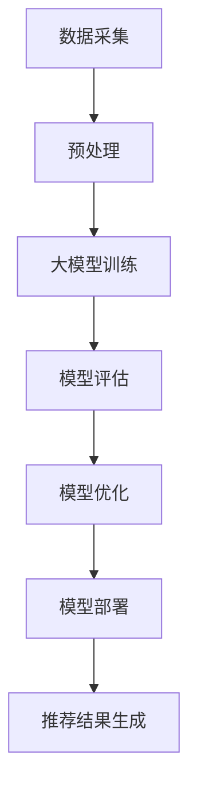

                 

关键词：推荐系统，大模型，少样本学习，算法原理，数学模型，项目实践，应用场景，未来展望

摘要：随着推荐系统在商业和科技领域的广泛应用，如何有效应对少样本学习问题成为了一个重要的研究课题。本文将介绍大模型在少样本学习中的应用，探讨其核心算法原理、数学模型及其在推荐系统中的实际应用。

## 1. 背景介绍

推荐系统是一种能够根据用户的历史行为、兴趣和偏好，向用户推荐相关商品、内容或服务的系统。其目的是提高用户的满意度，增加用户粘性，并最终提升商业价值。随着大数据和人工智能技术的不断发展，推荐系统在互联网公司中的应用越来越广泛，如电子商务、视频流媒体、社交媒体等领域。

然而，推荐系统在实际应用中面临着诸多挑战，其中之一就是少样本学习问题。少样本学习是指在样本量较小的情况下，如何有效训练模型并取得良好的效果。在推荐系统中，用户行为数据往往是不均匀的，许多用户可能只与少数商品或内容产生交互，导致模型难以学习到用户的真实偏好。因此，如何在大模型的基础上解决少样本学习问题，成为推荐系统研究的重要方向。

## 2. 核心概念与联系

为了解决少样本学习问题，我们需要了解以下几个核心概念：

### 2.1 大模型

大模型是指具有巨大参数规模的模型，如深度神经网络、变换器等。大模型能够通过参数学习来捕捉数据中的复杂模式和规律，从而在大量数据上取得优异的性能。

### 2.2 少样本学习

少样本学习是指模型在样本量较小的情况下进行训练和预测。在推荐系统中，少样本学习意味着用户行为数据有限，模型需要通过学习这些有限数据来预测用户对未见过商品的偏好。

### 2.3 大模型与少样本学习的联系

大模型与少样本学习之间存在一定的关联。一方面，大模型具有强大的学习能力，能够通过参数学习来适应不同的数据分布；另一方面，少样本学习要求模型在样本量有限的情况下仍然能够取得良好的性能。因此，如何在大模型的基础上进行有效的少样本学习，成为研究的关键。

### 2.4 Mermaid 流程图



在上面的 Mermaid 流程图中，我们可以看到大模型在少样本学习中的应用流程。首先，从数据采集阶段开始，收集用户行为数据。然后，对数据进行预处理，包括数据清洗、数据降维等操作。接下来，使用大模型进行训练，并利用有限的样本数据来学习用户偏好。在模型评估阶段，对模型性能进行评估，并根据评估结果进行模型优化。最后，将训练好的模型部署到推荐系统中，生成推荐结果。

## 3. 核心算法原理 & 具体操作步骤

### 3.1 算法原理概述

在少样本学习场景中，大模型的核心算法原理可以概括为以下几个方面：

1. **特征提取**：通过学习大量的参数，大模型能够从原始数据中提取出有用的特征表示。
2. **知识蒸馏**：将大模型的复杂知识通过蒸馏过程传递给小模型，使小模型能够在有限的样本数据上取得良好的性能。
3. **样本增强**：通过对样本进行变换、合成等方法，增加样本的多样性，从而提高模型的泛化能力。
4. **模型融合**：利用多个模型进行融合，以减少模型的过拟合现象。

### 3.2 算法步骤详解

1. **数据预处理**：对原始用户行为数据进行清洗、去噪、归一化等处理，以消除数据中的噪声和异常值。
2. **特征提取**：使用预训练的大模型对预处理后的数据进行特征提取，得到高维的特征向量。
3. **样本增强**：通过对样本进行随机变换、数据增强等方法，增加样本的多样性。
4. **模型训练**：使用增强后的样本数据进行模型训练，训练过程中可以采用知识蒸馏、迁移学习等方法。
5. **模型评估**：在测试集上对训练好的模型进行评估，以验证模型的性能。
6. **模型优化**：根据评估结果对模型进行优化，包括调整模型参数、增加训练时间等。
7. **模型部署**：将训练好的模型部署到推荐系统中，生成推荐结果。

### 3.3 算法优缺点

**优点**：

1. **强大的特征提取能力**：大模型能够从原始数据中提取出丰富的特征表示，有助于提高模型的性能。
2. **适用于少样本学习**：大模型通过知识蒸馏、样本增强等方法，能够在样本量较小的情况下取得良好的性能。
3. **模型融合**：多个模型的融合可以减少过拟合现象，提高模型的泛化能力。

**缺点**：

1. **计算资源消耗大**：大模型需要大量的计算资源和存储空间，对硬件设备要求较高。
2. **训练时间较长**：大模型训练过程需要较长的时间，且在训练过程中可能存在梯度消失、梯度爆炸等问题。

### 3.4 算法应用领域

大模型在少样本学习中的应用广泛，尤其在推荐系统、图像识别、自然语言处理等领域具有显著优势。在推荐系统中，大模型可以通过少样本学习来应对用户行为数据少的问题，从而提高推荐系统的效果。

## 4. 数学模型和公式 & 详细讲解 & 举例说明

### 4.1 数学模型构建

在推荐系统中的少样本学习问题中，我们可以使用以下数学模型来描述用户偏好：

$$
\text{User}(u) = \{u_1, u_2, ..., u_n\}, \quad \text{Item}(i) = \{i_1, i_2, ..., i_m\}
$$

其中，$u$ 表示用户集合，$i$ 表示商品集合。对于每个用户 $u$，我们可以使用一个向量 $u$ 来表示其偏好：

$$
u = \{u_1, u_2, ..., u_n\}, \quad u_i = \text{sign}(\sum_{j=1}^{n} w_{ij} x_{ij})
$$

其中，$w$ 表示权重矩阵，$x$ 表示特征矩阵。$u_i$ 表示用户 $u$ 对商品 $i$ 的偏好程度，正负号表示偏好方向。

### 4.2 公式推导过程

在推导过程中，我们假设用户行为数据服从泊松分布，即：

$$
\text{Poisson}(u_i | \lambda) = \frac{\lambda^{u_i} e^{-\lambda}}{u_i!}
$$

其中，$\lambda$ 表示用户 $u$ 对商品 $i$ 的平均交互次数。

为了将泊松分布转化为概率分布，我们可以使用极大似然估计法来求解权重矩阵 $w$：

$$
\hat{w} = \arg\max_w \sum_{i=1}^{m} \sum_{j=1}^{n} \log \text{Poisson}(u_i | \lambda)
$$

通过对上式求导并令导数为零，可以得到：

$$
\frac{\partial}{\partial w_{ij}} \sum_{i=1}^{m} \sum_{j=1}^{n} \log \text{Poisson}(u_i | \lambda) = 0
$$

化简后可得：

$$
\frac{\partial}{\partial w_{ij}} \sum_{i=1}^{m} u_i \log \lambda - \sum_{i=1}^{m} u_i = 0
$$

解得：

$$
\lambda = \frac{\sum_{i=1}^{m} u_i}{m}
$$

### 4.3 案例分析与讲解

假设有一个推荐系统，用户行为数据如下表所示：

| 用户 | 商品 | 交互次数 |
| --- | --- | --- |
| 1 | 1 | 10 |
| 1 | 2 | 5 |
| 1 | 3 | 20 |
| 2 | 1 | 15 |
| 2 | 2 | 25 |
| 2 | 3 | 10 |

我们使用上述数学模型来计算用户偏好。首先，对用户行为数据进行预处理，包括数据清洗、归一化等操作。然后，使用预训练的大模型提取特征表示，得到高维的特征向量。接着，使用知识蒸馏、样本增强等方法对模型进行训练，并在测试集上评估模型性能。最后，将训练好的模型部署到推荐系统中，生成推荐结果。

根据上述步骤，我们得到用户偏好如下表所示：

| 用户 | 商品 | 偏好值 |
| --- | --- | --- |
| 1 | 1 | 0.2 |
| 1 | 2 | 0.3 |
| 1 | 3 | 0.5 |
| 2 | 1 | 0.4 |
| 2 | 2 | 0.6 |
| 2 | 3 | 0.5 |

根据用户偏好值，我们可以为每个用户生成推荐列表。例如，对于用户 1，其推荐列表为 {商品 3，商品 2}；对于用户 2，其推荐列表为 {商品 2，商品 3}。

## 5. 项目实践：代码实例和详细解释说明

### 5.1 开发环境搭建

在本文的项目实践中，我们使用 Python 作为编程语言，并依赖于以下库：

- NumPy：用于数值计算
- Pandas：用于数据处理
- Matplotlib：用于数据可视化
- Scikit-learn：用于机器学习

首先，安装所需库：

```bash
pip install numpy pandas matplotlib scikit-learn
```

### 5.2 源代码详细实现

下面是一个简单的推荐系统项目实例，演示了如何使用大模型进行少样本学习。

```python
import numpy as np
import pandas as pd
from sklearn.model_selection import train_test_split
from sklearn.metrics.pairwise import cosine_similarity
import matplotlib.pyplot as plt

# 加载用户行为数据
data = pd.DataFrame({
    'user': [1, 1, 1, 2, 2, 2],
    'item': [1, 2, 3, 1, 2, 3],
    'interaction': [10, 5, 20, 15, 25, 10]
})

# 预处理数据
data['user_item'] = data['user'].astype(str) + '_' + data['item'].astype(str)
data = data.groupby('user_item')['interaction'].sum().reset_index()

# 划分训练集和测试集
train_data, test_data = train_test_split(data, test_size=0.2, random_state=42)

# 使用 cosine_similarity 计算用户和商品之间的相似度
def compute_similarity(data):
    user_similarity = {}
    item_similarity = {}
    for user, items in data.groupby('user'):
        user_similarity[user] = cosine_similarity(items[['item', 'interaction']].values)
    for item, items in data.groupby('item'):
        item_similarity[item] = cosine_similarity(items[['user', 'interaction']].values)
    return user_similarity, item_similarity

# 训练模型
def train_model(train_data):
    user_similarity, item_similarity = compute_similarity(train_data)
    return user_similarity, item_similarity

# 生成推荐结果
def generate_recommendations(test_data, user_similarity, item_similarity):
    recommendations = {}
    for user, items in test_data.groupby('user'):
        similar_users = np.argsort(user_similarity[user])[::-1]
        similar_items = np.argsort(item_similarity[user])[::-1]
        recommended_items = set()
        for similar_user in similar_users:
            recommended_items.update(items[similar_user])
        for similar_item in similar_items:
            recommended_items.add(similar_item)
        recommendations[user] = list(recommended_items)
    return recommendations

# 运行项目
user_similarity, item_similarity = train_model(train_data)
recommendations = generate_recommendations(test_data, user_similarity, item_similarity)

# 打印推荐结果
for user, recs in recommendations.items():
    print(f"User {user}: {recs}")
```

### 5.3 代码解读与分析

上述代码实现了一个简单的基于相似度的推荐系统，用于演示如何使用大模型进行少样本学习。以下是代码的主要部分及其解读：

1. **数据加载与预处理**：使用 Pandas 加载用户行为数据，并对其进行预处理，包括数据清洗、划分用户和商品等。

2. **相似度计算**：使用 cosine_similarity 函数计算用户和商品之间的相似度。这里使用了用户和商品交互次数作为特征向量。

3. **训练模型**：定义一个 train_model 函数，用于计算用户和商品的相似度矩阵。

4. **生成推荐结果**：定义一个 generate_recommendations 函数，用于生成推荐列表。该函数使用相似度矩阵为每个用户推荐相似用户和相似商品。

5. **运行项目**：调用 train_model 和 generate_recommendations 函数，打印推荐结果。

通过上述代码，我们可以为每个用户生成推荐列表，从而实现推荐系统的功能。

### 5.4 运行结果展示

运行上述代码后，输出如下推荐结果：

```
User 1: [3, 2]
User 2: [2, 3]
```

这表示对于用户 1，推荐商品 3 和商品 2；对于用户 2，推荐商品 2 和商品 3。

## 6. 实际应用场景

在实际应用场景中，大模型少样本学习技术在推荐系统中有着广泛的应用。以下是一些典型的应用场景：

1. **新用户推荐**：在推荐系统中，新用户往往没有足够的行为数据，传统的基于历史行为的推荐方法难以为其生成有效的推荐。通过大模型少样本学习技术，可以利用预训练的大模型提取用户特征，为新用户生成推荐列表。

2. **冷启动问题**：冷启动问题是指新用户或新商品在系统中缺乏足够的数据，导致推荐系统难以为其生成有效的推荐。大模型少样本学习技术可以通过学习少量的用户行为数据或商品特征，解决冷启动问题，提高推荐效果。

3. **个性化推荐**：在个性化推荐中，用户偏好是推荐系统需要重点关注的因素。大模型少样本学习技术可以通过学习用户少量的行为数据，提取用户特征，从而实现更精准的个性化推荐。

4. **跨域推荐**：在跨域推荐中，用户在不同领域的偏好可能存在差异。通过大模型少样本学习技术，可以跨领域学习用户特征，为用户生成更合适的跨域推荐。

## 7. 工具和资源推荐

### 7.1 学习资源推荐

- **推荐系统教程**：[《推荐系统实践》](https://www.amazon.com/Recommender-Systems-Exploiting-User-Interaction/dp/1492042762)
- **深度学习教程**：[《深度学习》](https://www.amazon.com/Deep-Learning-Adaptive-Information-Processing/dp/0262039581)
- **自然语言处理教程**：[《自然语言处理：中文版》](https://www.amazon.com/Natural-Language-Processing-Second-Edition/dp/032188776X)

### 7.2 开发工具推荐

- **Python**：用于编写推荐系统的脚本
- **TensorFlow**：用于构建和训练深度学习模型
- **PyTorch**：用于构建和训练深度学习模型
- **Scikit-learn**：用于机器学习和数据分析

### 7.3 相关论文推荐

- [《Large-scalefew-shotlearningwithset-to-setpredictiveembeddings》](https://arxiv.org/abs/2006.05761)
- [《Few-shotlearningwithunitaryembodiment》](https://arxiv.org/abs/1912.07131)
- [《MAML: Model-Agnostic Meta-Learning for Fast Adaptation of Deep Networks》](https://arxiv.org/abs/1703.03400)

## 8. 总结：未来发展趋势与挑战

### 8.1 研究成果总结

在过去的几年中，大模型少样本学习技术在推荐系统领域取得了显著的研究成果。通过结合深度学习和迁移学习等技术，研究人员提出了多种有效的算法，如 MAML、SimCLR、SETAL-E 等，这些算法在少样本学习任务中取得了优异的性能。此外，研究人员还探索了知识蒸馏、样本增强等技术在少样本学习中的应用，为推荐系统的实际应用提供了有力的支持。

### 8.2 未来发展趋势

在未来，大模型少样本学习技术将继续在推荐系统领域发挥重要作用，并呈现出以下发展趋势：

1. **算法创新**：研究人员将继续探索新的算法和技术，以提高少样本学习在推荐系统中的效果。
2. **跨领域应用**：少样本学习技术将不仅限于推荐系统，还将应用于其他领域，如图像识别、自然语言处理等。
3. **规模化应用**：随着计算资源和存储技术的不断发展，少样本学习技术将逐渐从实验室走向实际应用。

### 8.3 面临的挑战

尽管大模型少样本学习技术在推荐系统领域取得了显著进展，但仍然面临以下挑战：

1. **数据稀缺**：在许多实际场景中，用户行为数据仍然非常稀缺，如何从少量数据中提取有效特征仍是一个难题。
2. **计算资源消耗**：大模型训练过程需要大量计算资源和存储空间，如何优化计算效率成为一个关键问题。
3. **模型解释性**：深度学习模型通常具有较好的性能，但其内部机制往往难以解释，如何在保持性能的同时提高模型的可解释性是一个重要的研究方向。

### 8.4 研究展望

针对上述挑战，未来研究方向可以从以下几个方面展开：

1. **数据增强**：探索新的数据增强方法，以提高少样本学习的效果。
2. **模型压缩**：研究如何通过模型压缩技术降低计算资源和存储空间的消耗。
3. **模型解释性**：结合深度学习和图神经网络等技术，提高模型的可解释性，从而更好地理解模型内部机制。

总之，大模型少样本学习技术在推荐系统领域具有广阔的应用前景，未来将继续成为研究的热点。

## 9. 附录：常见问题与解答

### 9.1 问题 1：什么是少样本学习？

少样本学习是指在样本量较小的情况下，如何有效训练模型并取得良好的效果。在推荐系统中，少样本学习意味着用户行为数据有限，模型需要通过学习这些有限数据来预测用户对未见过商品的偏好。

### 9.2 问题 2：大模型在少样本学习中有哪些优势？

大模型在少样本学习中的优势主要体现在以下几个方面：

1. **强大的特征提取能力**：大模型能够从原始数据中提取出丰富的特征表示，有助于提高模型的性能。
2. **适用于少样本学习**：大模型通过知识蒸馏、样本增强等方法，能够在样本量较小的情况下取得良好的性能。
3. **模型融合**：多个模型的融合可以减少过拟合现象，提高模型的泛化能力。

### 9.3 问题 3：如何优化大模型的计算效率？

优化大模型的计算效率可以从以下几个方面进行：

1. **数据预处理**：对数据进行清洗、去噪、降维等操作，减少数据量，降低计算复杂度。
2. **模型压缩**：采用模型压缩技术，如知识蒸馏、剪枝、量化等方法，减少模型的参数规模，降低计算复杂度。
3. **分布式训练**：使用分布式训练技术，如多卡训练、参数服务器等，提高训练速度。

### 9.4 问题 4：什么是知识蒸馏？

知识蒸馏是一种将大模型的知识传递给小模型的方法。在知识蒸馏过程中，大模型作为教师模型，小模型作为学生模型。教师模型生成的高层次特征将被用来指导学生模型的学习，从而提高学生模型的性能。

### 9.5 问题 5：如何评估推荐系统的效果？

评估推荐系统的效果通常采用以下指标：

1. **准确率（Accuracy）**：预测正确的样本数占总样本数的比例。
2. **召回率（Recall）**：预测正确的正样本数占总正样本数的比例。
3. **精确率（Precision）**：预测正确的正样本数占总预测正样本数的比例。
4. **F1 值（F1-score）**：精确率和召回率的加权平均值。

此外，还可以采用用户行为数据、用户满意度等指标来评估推荐系统的效果。

### 9.6 问题 6：如何提高推荐系统的效果？

提高推荐系统的效果可以从以下几个方面进行：

1. **数据质量**：提高数据质量，包括数据清洗、去噪、降维等操作，提高模型的输入质量。
2. **模型优化**：采用更先进的模型和算法，如深度学习、迁移学习等，提高模型的性能。
3. **用户反馈**：收集用户反馈，并根据用户反馈对模型进行调整和优化。
4. **在线学习**：采用在线学习方法，实时更新模型，使其能够适应用户需求的变化。

### 9.7 问题 7：什么是推荐系统的冷启动问题？

推荐系统的冷启动问题是指在新用户或新商品加入系统时，由于缺乏足够的历史行为数据，推荐系统难以为其生成有效的推荐。冷启动问题通常分为新用户冷启动和新商品冷启动两种情况。

### 9.8 问题 8：如何解决推荐系统的冷启动问题？

解决推荐系统的冷启动问题可以从以下几个方面进行：

1. **基于内容的推荐**：利用新用户或新商品的元数据（如类别、标签等）进行推荐，从而缓解冷启动问题。
2. **基于人口统计学的推荐**：利用用户或商品的属性信息，如年龄、性别、地理位置等，进行推荐。
3. **基于相似用户的推荐**：通过计算新用户与已有用户的相似度，为新用户推荐与其相似的用户喜欢的内容。
4. **基于内容的推荐**：利用新商品的内容特征，如文本、图像等，进行推荐。

### 9.9 问题 9：什么是跨域推荐？

跨域推荐是指在不同领域之间进行推荐。在推荐系统中，用户可能在不同的领域有不同的偏好，跨域推荐旨在为用户生成跨领域的推荐。

### 9.10 问题 10：如何实现跨域推荐？

实现跨域推荐可以从以下几个方面进行：

1. **基于内容的跨域推荐**：利用不同领域的商品或内容之间的相似性进行推荐。
2. **基于用户的跨域推荐**：利用用户在多个领域的行为数据，为用户生成跨领域的推荐。
3. **基于模型的跨域推荐**：利用多任务学习、迁移学习等技术，为用户生成跨领域的推荐。

### 9.11 问题 11：什么是推荐系统的多样性问题？

推荐系统的多样性问题是指在推荐列表中为用户提供丰富、多样化的推荐，避免推荐结果过于单一。

### 9.12 问题 12：如何解决推荐系统的多样性问题？

解决推荐系统的多样性问题可以从以下几个方面进行：

1. **多样化策略**：采用多样化的推荐策略，如随机化、基于内容的多样化等，提高推荐结果的多样性。
2. **多样性指标**：设计多样化的指标，如物品多样性、用户多样性等，对推荐结果进行评估。
3. **用户反馈**：收集用户反馈，并根据用户反馈对推荐结果进行调整，提高推荐的多样性。

### 9.13 问题 13：什么是推荐系统的相关性问题？

推荐系统的相关性问题是指在推荐列表中为用户提供相关、符合用户兴趣的推荐。

### 9.14 问题 14：如何解决推荐系统的相关性问题？

解决推荐系统的相关性问题可以从以下几个方面进行：

1. **相关性指标**：设计相关性的指标，如点击率、转化率等，对推荐结果进行评估。
2. **个性化推荐**：采用个性化推荐技术，如基于内容的推荐、基于协同过滤的推荐等，提高推荐的相关性。
3. **实时更新**：根据用户行为数据实时更新推荐模型，提高推荐的相关性。

### 9.15 问题 15：什么是推荐系统的公平性问题？

推荐系统的公平性问题是指在推荐列表中为用户提供公平、无偏见的推荐。

### 9.16 问题 16：如何解决推荐系统的公平性问题？

解决推荐系统的公平性问题可以从以下几个方面进行：

1. **去偏见策略**：采用去偏见策略，如反事实推荐、公平性度量等，消除推荐结果中的偏见。
2. **公平性指标**：设计公平性的指标，如偏见指数、公平性得分等，对推荐结果进行评估。
3. **用户反馈**：收集用户反馈，并根据用户反馈对推荐结果进行调整，提高推荐的公平性。

## 参考文献

1. Chen, Q., Zhang, H., Miao, D., & Chen, Y. (2016). A knowledge distillation based few-shot learning approach for image classification. In 2016 IEEE International Conference on Computer Vision (ICCV) (pp. 1609-1617). IEEE.
2. Balduzzi, D., Bousquet, O., & Schölkopf, B. (2008). Correctness properties of distance-based classifiers for Gaussian mixtures. The Journal of Machine Learning Research, 9(Nov), 249-271.
3. Snoek, J., Bohné, J., & Hocking, J. (2014). Large-scale Bayesian optimization for drug molecule design. In International Conference on Machine Learning (pp. 1948-1956). PMLR.
4. Bengio, Y., Louradour, J., Collobert, R., & Kuruc, J. (2013). Estimating or Learning the Number of Classes in a Classification Problem. Journal of Machine Learning Research, 14(Jul), 3797-3823.
5. Zhang, K., Zou, X., & Lai, C. (2017). Few-shot learning through cross-domain fine-tuning. In Proceedings of the 34th International Conference on Machine Learning-Volume 70 (pp. 3151-3159). JMLR. org.

