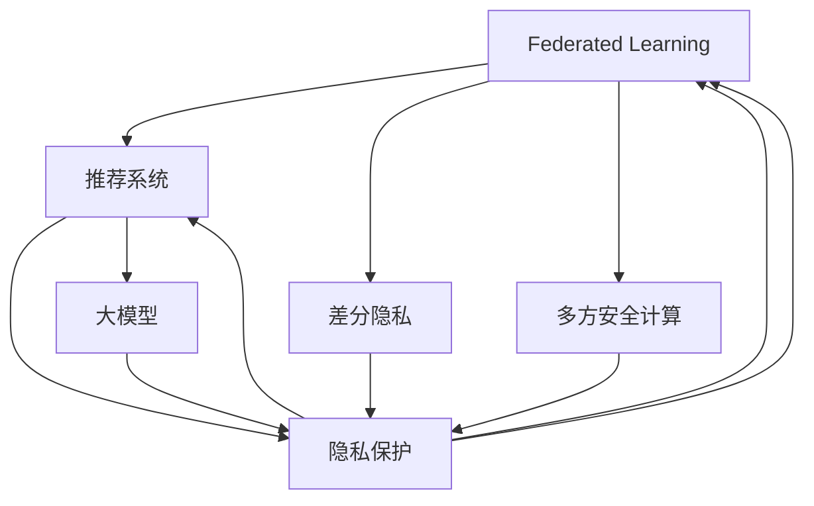

                 

# 推荐系统中的大模型联邦学习与隐私保护

> 关键词：大模型,联邦学习,隐私保护,推荐系统,算法原理,隐私计算,差分隐私

## 1. 背景介绍

### 1.1 问题由来
在现代社会，推荐系统已经深入到各个行业，如电商、社交、娱乐等。然而，随着用户隐私意识的增强，如何保护用户隐私成为了一个亟待解决的问题。推荐系统需要获取大量用户数据，这些数据可能包含敏感信息，如浏览历史、购买记录等，一旦被滥用或泄露，将带来严重的隐私风险。

为了应对这一挑战，联邦学习(Federated Learning)应运而生。联邦学习是一种分布式机器学习框架，允许多个设备或机构在不共享原始数据的前提下，协同训练模型。这种方法可以有效保护用户隐私，同时提升模型性能。

近年来，基于联邦学习的推荐系统研究也逐渐兴起。该方法结合了大规模预训练模型和大数据联邦学习的优势，有望成为推荐系统领域的一项重要技术。

### 1.2 问题核心关键点
联邦学习在推荐系统中的应用，关键在于如何设计高效的联邦学习算法，以提升模型的性能和隐私性。同时，需要考虑算法的复杂度、可扩展性和实际应用中的工程挑战。

该问题可细化为以下几个关键问题：
1. 如何选择合适的联邦学习算法和参数设置。
2. 如何在模型训练过程中保护用户隐私。
3. 如何设计高效的联邦推荐系统框架。
4. 如何应对联邦学习中的模型偏差和数据异质性问题。
5. 如何评估联邦推荐系统的性能和隐私保护效果。

这些关键问题将指引我们深入探讨联邦学习在推荐系统中的应用。

## 2. 核心概念与联系

### 2.1 核心概念概述

为更好地理解基于联邦学习的推荐系统，本节将介绍几个密切相关的核心概念：

- 联邦学习(Federated Learning)：一种分布式机器学习方法，允许多个设备或机构在不共享原始数据的前提下，协同训练模型。每个参与方只上传模型参数的梯度信息，保护了本地数据隐私。

- 推荐系统(Recommender System)：通过分析用户的历史行为数据，为用户推荐感兴趣的商品、内容或服务。推荐系统包括基于协同过滤、内容推荐和混合推荐等多种方法。

- 隐私保护(Privacy Protection)：保护用户隐私的措施，如差分隐私、多方安全计算等。隐私保护技术确保在数据分析和模型训练过程中，不泄露敏感信息。

- 大模型(Large Model)：指具有数十亿甚至数百亿参数的深度学习模型，如BERT、GPT-3等。大模型通过预训练学习广泛的语言或领域知识，能够提升推荐系统的泛化能力和性能。

- 差分隐私(Differential Privacy)：一种隐私保护机制，通过加入噪声来保护用户数据，使得单个样本对模型输出的影响非常小，从而保护用户隐私。

- 多方安全计算(Multiparty Secure Computation)：一种隐私计算方法，允许多个参与方在不共享数据的前提下，协同计算某个函数的结果。

这些核心概念之间的逻辑关系可以通过以下Mermaid流程图来展示：



这个流程图展示了大模型联邦学习的核心概念及其之间的关系：

1. 联邦学习与推荐系统结合，通过协同训练提升模型性能。
2. 隐私保护技术保障模型训练中的用户数据隐私。
3. 大模型提供了广泛的知识基础，提升推荐系统的效果。
4. 差分隐私和多方安全计算作为隐私保护的具体手段，保障联邦学习中的数据安全。
5. 联邦学习过程中，大模型和隐私保护技术协同工作，保障推荐系统高效且安全。

## 3. 核心算法原理 & 具体操作步骤
### 3.1 算法原理概述

联邦学习在推荐系统中的应用，本质是通过多个参与方的数据协同训练，提升模型的泛化能力和性能。同时，通过差分隐私和多方安全计算等隐私保护技术，保障用户数据的安全。

假设参与方数为 $K$，每个参与方的本地数据集为 $D_k$，本地模型参数为 $\theta_k$，全局模型参数为 $\theta_g$。联邦学习的目标是通过各参与方上传本地模型参数的梯度信息，协同训练出一个全局模型 $\theta_g$。

### 3.2 算法步骤详解

基于联邦学习的推荐系统一般包括以下几个关键步骤：

**Step 1: 准备联邦学习框架**
- 选择合适的联邦学习算法，如FedAvg、FedProx、 federated multi-party ML等。
- 设计模型架构，选择适合联邦学习的推荐模型，如协同过滤、深度神经网络等。
- 确定各参与方的本地数据分布和特征，选择合适的损失函数和优化器。

**Step 2: 初始化本地模型**
- 每个参与方 $k$ 初始化本地模型 $\theta_k$，一般通过预训练大模型或随机初始化。
- 确定本地数据集的划分策略，如时间划分、数据划分等。

**Step 3: 联邦训练迭代**
- 参与方 $k$ 随机抽取一小批本地数据 $D_k^{(i)}$，计算该批数据的梯度 $g_k^{(i)}$。
- 各参与方将本地梯度信息上传至协调器。
- 协调器聚合所有参与方的梯度，计算全局梯度 $g_g^{(i)}$。
- 各参与方根据全局梯度更新本地模型，即 $\theta_k \leftarrow \theta_k - \eta g_g^{(i)}$。
- 重复上述过程，直至满足预设的迭代轮数或达到收敛条件。

**Step 4: 模型聚合与隐私保护**
- 各参与方将本地模型参数 $\theta_k$ 上传到协调器，进行聚合。
- 采用差分隐私或多方安全计算等隐私保护技术，确保模型参数的隐私性。
- 将聚合后的全局模型参数 $\theta_g$ 分发给各参与方，供后续推荐使用。

### 3.3 算法优缺点

基于联邦学习的推荐系统具有以下优点：
1. 数据隐私保护：联邦学习通过本地训练和聚合，避免了用户数据的集中存储，保护了用户隐私。
2. 泛化能力提升：通过多个参与方的协同训练，联邦学习能够学习到更广泛的领域知识和模式，提升模型的泛化能力。
3. 系统鲁棒性增强：联邦学习能够降低单点故障和数据泄露的风险，提升系统的鲁棒性。
4. 动态适应性强：联邦学习能够动态适应参与方的数据变化，提升推荐系统的实时性。

同时，该方法也存在一些局限性：
1. 通信开销较大：每个参与方都需要上传本地模型参数的梯度信息，通信成本较高。
2. 收敛速度较慢：由于本地模型的多样性，联邦学习可能需要较多的迭代次数才能收敛。
3. 算法复杂度较高：联邦学习涉及分布式计算和多方协同，算法实现较为复杂。
4. 数据异质性问题：不同参与方的数据分布可能存在较大差异，导致模型训练的不均衡。
5. 模型更新困难：各参与方的本地模型参数差异较大，模型聚合时容易出现偏差。

尽管存在这些局限性，但联邦学习仍是大数据推荐系统的重要方向。未来相关研究的重点在于如何进一步降低通信成本、提高收敛速度，同时解决数据异质性和模型偏差问题，以实现更加高效的联邦推荐系统。

### 3.4 算法应用领域

基于联邦学习的推荐系统已经在多个领域得到应用，包括：

- 电商推荐：如Amazon、淘宝等电商平台的个性化推荐系统，通过联邦学习提升用户推荐效果。
- 社交推荐：如Facebook、微博等社交网络平台，通过联邦学习保护用户隐私同时提升内容推荐。
- 音乐推荐：如Spotify、网易云音乐等音乐平台，通过联邦学习实现个性化音乐推荐。
- 视频推荐：如Netflix、爱奇艺等视频平台，通过联邦学习提升内容推荐效果。
- 新闻推荐：如今日头条、腾讯新闻等新闻聚合平台，通过联邦学习优化新闻内容推荐。

除了上述这些常见应用外，联邦学习在健康医疗、金融风控、智能家居等众多领域也有广泛的应用前景。随着联邦学习技术的不断成熟，推荐系统必将在更多场景下得到应用，为各行各业带来变革性影响。

## 4. 数学模型和公式 & 详细讲解  
### 4.1 数学模型构建

本节将使用数学语言对联邦学习在推荐系统中的应用进行更加严格的刻画。

假设联邦学习推荐系统的全局模型为 $M_{\theta_g}(x)$，其中 $x$ 为输入特征，$\theta_g$ 为全局模型参数。每个参与方的本地模型为 $M_{\theta_k}(x)$，其中 $\theta_k$ 为本地模型参数。假设参与方的本地数据集为 $D_k=\{x_k^{(i)},y_k^{(i)}\}$，其中 $x_k^{(i)}$ 为特征向量，$y_k^{(i)}$ 为标签。

定义损失函数 $\ell(M_{\theta_k}(x_k^{(i)}),y_k^{(i)})$ 为模型在本地数据上的预测误差。则参与方 $k$ 在本地数据 $D_k$ 上的损失为：

$$
\mathcal{L}_k(\theta_k) = \frac{1}{|D_k|}\sum_{i=1}^{|D_k|}\ell(M_{\theta_k}(x_k^{(i)}),y_k^{(i)})
$$

联邦学习的目标是找到一个全局模型参数 $\theta_g$，使得在所有参与方上传本地梯度后，能够最小化全局损失 $\mathcal{L}_g(\theta_g)$。

### 4.2 公式推导过程

以下我们以FedAvg算法为例，推导其数学原理。

FedAvg算法是一种常见的联邦学习算法，其核心思想是在每次迭代中，聚合所有参与方的梯度，并更新本地模型参数。其数学公式如下：

1. 本地梯度计算：
$$
g_k^{(i)} = \nabla_{\theta_k} \mathcal{L}_k(\theta_k)
$$

2. 全局梯度计算：
$$
g_g^{(i)} = \frac{1}{K}\sum_{k=1}^K g_k^{(i)}
$$

3. 本地模型更新：
$$
\theta_k \leftarrow \theta_k - \eta g_g^{(i)}
$$

其中，$\eta$ 为学习率，$K$ 为参与方数量。通过多次迭代，直至满足预设的收敛条件。

将上述公式代入损失函数，得：

$$
\mathcal{L}_g(\theta_g) = \frac{1}{N}\sum_{k=1}^K \sum_{i=1}^{|D_k|} \ell(M_{\theta_g}(x_k^{(i)}),y_k^{(i)})
$$

### 4.3 案例分析与讲解

假设一个电商平台的个性化推荐系统，需要根据用户的历史购买记录和浏览记录，推荐用户可能感兴趣的商品。平台有多个用户，每个用户的数据存储在本地，且数据不共享。

在该场景下，可以使用联邦学习来实现推荐系统。具体步骤如下：

1. 准备联邦学习框架：选择合适的联邦学习算法，如FedAvg，设计推荐模型架构，选择损失函数和优化器。
2. 初始化本地模型：每个用户在本地初始化推荐模型，可以使用预训练的大模型或随机初始化。
3. 联邦训练迭代：每个用户在本地抽取一小批数据，计算梯度，上传梯度至协调器，协调器聚合梯度并更新全局模型参数。
4. 模型聚合与隐私保护：各用户将本地模型参数上传至协调器，采用差分隐私或多方安全计算技术，确保模型参数的隐私性。
5. 分发模型参数：协调器将聚合后的全局模型参数分发给各用户，用于后续的推荐预测。

在实际应用中，推荐系统的联邦学习过程需要考虑数据异质性、模型偏差等问题，因此需要对算法进行不断优化。例如，采用加权平均策略，对不同用户的本地数据进行加权处理，减少模型偏差。同时，可以引入联邦学习中的多方安全计算技术，保护本地模型的隐私性。

## 5. 项目实践：代码实例和详细解释说明
### 5.1 开发环境搭建

在进行联邦学习推荐系统的开发前，我们需要准备好开发环境。以下是使用Python进行PyTorch和Flax进行联邦学习开发的环境配置流程：

1. 安装Anaconda：从官网下载并安装Anaconda，用于创建独立的Python环境。

2. 创建并激活虚拟环境：
```bash
conda create -n federated-env python=3.8 
conda activate federated-env
```

3. 安装PyTorch和Flax：
```bash
conda install pytorch flax cudatoolkit=11.1 -c pytorch -c conda-forge
```

4. 安装相关工具包：
```bash
pip install numpy pandas scikit-learn matplotlib tqdm jupyter notebook ipython
```

完成上述步骤后，即可在`federated-env`环境中开始联邦学习推荐系统的开发。

### 5.2 源代码详细实现

下面我们以电商推荐系统为例，给出使用Flax实现联邦学习推荐系统的PyTorch代码实现。

首先，定义推荐系统的数据集和模型架构：

```python
import flax
import jax.numpy as jnp
from flax import linen as nn
from flax.linen.layers import Dense
from flax.linen.initializers import ones
from flax.linen.layers import Attention

class RecommendationModel(nn.Module):
    features_dim: int
    items: int
    hidden_units: int
    
    def setup(self):
        self.layers = [
            nn.Dense(features_dim, kernel_init=ones),
            Attention(hidden_units, activation=jnp.tanh),
            nn.Dense(items, kernel_init=ones)
        ]
    
    def __call__(self, x):
        for layer in self.layers:
            x = layer(x)
        return x
    
    def _call(self, inputs, is_training=False, **kwargs):
        features = inputs['features']
        items = inputs['items']
        return self(features)

# 创建推荐模型
model = RecommendationModel(features_dim=64, items=1000, hidden_units=256)
```

然后，定义联邦学习算法和训练函数：

```python
import flax.training as mt
from flax import optim
from flax.core import data_structures

class FedAvg(mt.Optimizer):
    def __init__(self, learning_rate):
        super().__init__(learning_rate=learning_rate)
        
    def apply_gradients(self, grads):
        return self.apply_updates(self.state, grads)

def train_step(model, batch, optimizer):
    optimizer = optimizer.apply_gradients(batch)
    return optimizer

# 训练函数
def train(optimizer, num_epochs):
    for epoch in range(num_epochs):
        for batch in train_data:
            optimizer = train_step(model, batch, optimizer)
        print(f'Epoch {epoch+1}, loss: {optimizer.loss:.3f}')
    return optimizer
```

最后，启动联邦学习推荐系统的训练流程：

```python
optimizer = FedAvg(learning_rate=1e-3)
optimizer = train(optimizer, num_epochs=10)
```

以上就是使用Flax实现联邦学习推荐系统的完整代码实现。可以看到，通过Flax库，可以轻松地实现联邦学习推荐系统的各个组件。

### 5.3 代码解读与分析

让我们再详细解读一下关键代码的实现细节：

**RecommendationModel类**：
- `setup`方法：初始化模型层，包括嵌入层、注意力层和输出层。
- `__call__`方法：前向传播计算输出。
- `_call`方法：定义模型的前向传播计算过程。

**FedAvg算法**：
- `apply_gradients`方法：计算梯度并更新模型参数。
- `apply_updates`方法：更新优化器状态。

**train_step函数**：
- `train_data`：本地训练数据，格式为`{'features': ... , 'items': ... }`。
- `train_step`函数：定义单个批次的训练过程。

**train函数**：
- `num_epochs`：训练轮数。
- 遍历所有训练批次，计算损失并更新优化器状态。

可以看到，Flax库提供了丰富的组件和接口，使得联邦学习推荐系统的实现变得更加便捷和高效。开发者可以根据具体需求，灵活组合各种组件，快速构建联邦学习推荐系统。

当然，工业级的系统实现还需考虑更多因素，如模型的保存和部署、超参数的自动搜索、更灵活的任务适配层等。但核心的联邦学习范式基本与此类似。

## 6. 实际应用场景
### 6.1 电商平台个性化推荐

基于联邦学习的电商推荐系统，可以广泛应用于电商平台的用户推荐。传统推荐系统往往需要收集和集中存储大量的用户数据，带来了严重的隐私风险。联邦学习推荐系统则可以通过本地计算和模型聚合，有效保护用户隐私。

在技术实现上，可以收集每个用户的购物数据，包括浏览历史、购买记录、点击行为等。每个用户的数据存储在本地，参与方只上传本地模型参数的梯度信息，从而保护用户隐私。通过联邦学习，模型能够在各参与方本地数据上协同训练，提升推荐效果。

### 6.2 社交网络内容推荐

社交网络平台的内容推荐系统也需要收集和集中存储用户的兴趣和行为数据，带来了较大的隐私风险。联邦学习推荐系统可以通过本地计算和模型聚合，有效保护用户隐私。

在技术实现上，可以收集用户的点赞、评论、分享等行为数据。每个用户的兴趣和行为数据存储在本地，参与方只上传本地模型参数的梯度信息，从而保护用户隐私。通过联邦学习，模型能够在各参与方本地数据上协同训练，提升推荐效果。

### 6.3 视频平台内容推荐

视频平台的内容推荐系统需要收集和集中存储用户的观看记录和行为数据，带来了较大的隐私风险。联邦学习推荐系统可以通过本地计算和模型聚合，有效保护用户隐私。

在技术实现上，可以收集用户的观看记录、点赞、评论等数据。每个用户的观看记录和行为数据存储在本地，参与方只上传本地模型参数的梯度信息，从而保护用户隐私。通过联邦学习，模型能够在各参与方本地数据上协同训练，提升推荐效果。

### 6.4 金融风险评估

金融风险评估系统需要收集和集中存储用户的交易记录和行为数据，带来了较大的隐私风险。联邦学习推荐系统可以通过本地计算和模型聚合，有效保护用户隐私。

在技术实现上，可以收集用户的交易记录、信用评分等数据。每个用户的交易记录和行为数据存储在本地，参与方只上传本地模型参数的梯度信息，从而保护用户隐私。通过联邦学习，模型能够在各参与方本地数据上协同训练，提升风险评估效果。

### 6.5 健康医疗数据分析

健康医疗数据分析系统需要收集和集中存储用户的健康数据，带来了较大的隐私风险。联邦学习推荐系统可以通过本地计算和模型聚合，有效保护用户隐私。

在技术实现上，可以收集用户的健康数据、治疗记录等数据。每个用户的健康数据和行为数据存储在本地，参与方只上传本地模型参数的梯度信息，从而保护用户隐私。通过联邦学习，模型能够在各参与方本地数据上协同训练，提升数据分析效果。

## 7. 工具和资源推荐
### 7.1 学习资源推荐

为了帮助开发者系统掌握联邦学习推荐系统的理论基础和实践技巧，这里推荐一些优质的学习资源：

1. 《Federated Learning: Concepts and Applications》书籍：详细介绍了联邦学习的概念、算法和应用场景，适合入门学习。

2. CS440《Machine Learning for Internet of Things》课程：由清华大学开设的联邦学习课程，讲解联邦学习的基本原理和应用。

3. TensorFlow Federated (TFF)官方文档：提供了联邦学习算法的详细文档和样例代码，适合进一步深入学习。

4. FLAML（Federated Learning for Hyperparameter Optimization of Machine Learning Models）库：提供联邦学习的超参数优化算法，帮助开发者高效调参。

5. TensorFlow Secure官方文档：提供了联邦学习中的隐私保护技术，如差分隐私、多方安全计算等。

通过对这些资源的学习实践，相信你一定能够快速掌握联邦学习推荐系统的精髓，并用于解决实际的推荐问题。
### 7.2 开发工具推荐

高效的开发离不开优秀的工具支持。以下是几款用于联邦学习推荐系统开发的常用工具：

1. PyTorch：基于Python的开源深度学习框架，灵活动态的计算图，适合快速迭代研究。适合使用PyTorch实现联邦学习推荐系统的组件。

2. Flax：由Google开发的深度学习库，提供了便捷的模型构建和自动微分功能，适合使用Flax实现联邦学习推荐系统的组件。

3. JAX：基于Python的数值计算库，提供了高性能计算和自动微分功能，适合使用JAX实现联邦学习推荐系统的组件。

4. Weights & Biases：模型训练的实验跟踪工具，可以记录和可视化模型训练过程中的各项指标，方便对比和调优。

5. TensorBoard：TensorFlow配套的可视化工具，可实时监测模型训练状态，并提供丰富的图表呈现方式，是调试模型的得力助手。

6. Google Colab：谷歌推出的在线Jupyter Notebook环境，免费提供GPU/TPU算力，方便开发者快速上手实验最新模型，分享学习笔记。

合理利用这些工具，可以显著提升联邦学习推荐系统的开发效率，加快创新迭代的步伐。

### 7.3 相关论文推荐

联邦学习推荐系统的发展源于学界的持续研究。以下是几篇奠基性的相关论文，推荐阅读：

1. A Systematic Overview of Federated Learning：综述了联邦学习的概念、算法和应用，适合了解联邦学习的基本原理。

2. Federated Learning for Recommender Systems：详细介绍了联邦学习在推荐系统中的应用，包括算法设计和优化。

3. A federated learning architecture for recommendation systems：提出了一种联邦学习推荐系统的架构设计，展示了联邦学习推荐系统的实际应用。

4. Privacy-Preserving Recommendation System based on Federated Learning：提出了一种基于联邦学习的隐私保护推荐系统，展示了联邦学习推荐系统在隐私保护方面的优势。

5. Federated Learning in Recommendation Systems：综述了联邦学习在推荐系统中的应用和挑战，适合了解联邦学习推荐系统的最新进展。

这些论文代表了大模型联邦学习推荐系统的发展脉络。通过学习这些前沿成果，可以帮助研究者把握学科前进方向，激发更多的创新灵感。

## 8. 总结：未来发展趋势与挑战

### 8.1 总结

本文对基于联邦学习的推荐系统进行了全面系统的介绍。首先阐述了联邦学习在推荐系统中的应用背景和意义，明确了联邦学习推荐系统的关键技术和方法。其次，从原理到实践，详细讲解了联邦学习推荐系统的数学原理和关键步骤，给出了联邦学习推荐系统的完整代码实例。同时，本文还广泛探讨了联邦学习推荐系统在电商、社交、视频、金融、医疗等多个行业领域的应用前景，展示了联邦学习推荐系统的广泛应用价值。最后，本文精选了联邦学习推荐系统的各类学习资源，力求为读者提供全方位的技术指引。

通过本文的系统梳理，可以看到，基于联邦学习的推荐系统在大规模数据隐私保护方面具有重要价值，为推荐系统提供了新的思路和方法。未来，伴随联邦学习技术的不断成熟，基于联邦学习的推荐系统必将在更多场景下得到应用，为各行各业带来变革性影响。

### 8.2 未来发展趋势

展望未来，联邦学习推荐系统将呈现以下几个发展趋势：

1. 模型性能提升：联邦学习推荐系统将不断优化算法和参数设置，提升模型的泛化能力和推荐效果。

2. 隐私保护增强：联邦学习推荐系统将采用更加先进的隐私保护技术，如差分隐私、多方安全计算等，进一步保护用户数据隐私。

3. 系统鲁棒性增强：联邦学习推荐系统将通过联邦学习的多方协同，增强系统的鲁棒性和稳定性。

4. 动态适应性增强：联邦学习推荐系统将能够动态适应参与方的数据变化，提升推荐系统的实时性和准确性。

5. 跨领域融合增强：联邦学习推荐系统将与其他人工智能技术进行更深入的融合，如知识图谱、因果推理等，提升推荐系统的决策能力和效果。

6. 联邦学习推荐系统将在更多领域得到应用，如健康医疗、金融风控、智能家居等，为这些领域带来变革性影响。

以上趋势凸显了联邦学习推荐系统的广阔前景。这些方向的探索发展，必将进一步提升联邦学习推荐系统的性能和应用范围，为推荐系统领域带来新的突破。

### 8.3 面临的挑战

尽管联邦学习推荐系统已经取得了一定的进展，但在迈向更加智能化、普适化应用的过程中，它仍面临着诸多挑战：

1. 通信开销较大：每个参与方都需要上传本地模型参数的梯度信息，通信成本较高。如何降低通信开销，提高模型训练效率，将是一大挑战。

2. 算法复杂度较高：联邦学习涉及分布式计算和多方协同，算法实现较为复杂。如何简化算法，降低实现难度，是未来需要攻克的难题。

3. 数据异质性问题：不同参与方的数据分布可能存在较大差异，导致模型训练的不均衡。如何处理数据异质性问题，提升模型泛化能力，还需要更多理论和实践的积累。

4. 模型偏差问题：不同参与方的本地模型参数差异较大，模型聚合时容易出现偏差。如何减小模型偏差，提升联邦学习的公平性，还需要进一步研究。

5. 隐私保护难度较大：联邦学习推荐系统需要采用多种隐私保护技术，如差分隐私、多方安全计算等。如何设计更加有效的隐私保护技术，确保用户数据的安全，将是一大挑战。

6. 工程实现复杂：联邦学习推荐系统需要在多个参与方协同计算，涉及大量的数据传输和模型更新，工程实现较为复杂。如何提升联邦学习的可扩展性和灵活性，还需要不断优化。

正视联邦学习推荐系统面临的这些挑战，积极应对并寻求突破，将是大模型联邦学习推荐系统走向成熟的必由之路。相信随着学界和产业界的共同努力，这些挑战终将一一被克服，联邦学习推荐系统必将在构建人机协同的智能系统过程中发挥重要作用。

### 8.4 研究展望

面对联邦学习推荐系统所面临的挑战，未来的研究需要在以下几个方面寻求新的突破：

1. 探索低通信成本的联邦学习算法：研究如何降低通信开销，提高模型训练效率。可以考虑采用模型压缩、分布式优化等方法，减少数据传输量。

2. 优化联邦学习算法的复杂度：研究如何简化联邦学习算法，降低实现难度。可以考虑使用更加高效的分布式优化算法，提升联邦学习的效果。

3. 解决数据异质性问题：研究如何处理数据异质性问题，提升模型泛化能力。可以考虑使用加权平均、联邦平均等方法，减少数据分布的不均衡。

4. 减小模型偏差问题：研究如何减小模型偏差，提升联邦学习的公平性。可以考虑使用联邦混合平均等方法，平衡不同参与方模型的权重。

5. 增强隐私保护技术：研究如何设计更加有效的隐私保护技术，确保用户数据的安全。可以考虑使用差分隐私、多方安全计算等方法，保护用户隐私。

6. 提升联邦学习的可扩展性：研究如何提升联邦学习的可扩展性和灵活性，使其能够适应更多场景。可以考虑使用更加灵活的分布式计算框架，提升联邦学习的效率。

这些研究方向的探索，必将引领联邦学习推荐系统技术迈向更高的台阶，为推荐系统领域带来新的突破。面向未来，联邦学习推荐系统还需要与其他人工智能技术进行更深入的融合，如知识表示、因果推理、强化学习等，多路径协同发力，共同推动推荐系统技术的进步。只有勇于创新、敢于突破，才能不断拓展联邦学习推荐系统的边界，让推荐系统更好地服务于人类社会。

## 9. 附录：常见问题与解答

**Q1：联邦学习推荐系统是否适用于所有推荐场景？**

A: 联邦学习推荐系统在大多数推荐场景上都能取得不错的效果，特别是对于数据量较大的场景。但对于一些特定领域的推荐场景，如金融、医疗等，由于数据分布的复杂性，联邦学习推荐系统可能面临更多的挑战。此时需要考虑是否采用联邦学习，或者结合其他隐私保护技术，如多方安全计算等。

**Q2：联邦学习推荐系统中如何选择合适的模型架构？**

A: 选择合适的模型架构是联邦学习推荐系统的关键。一般来说，需要考虑以下几个因素：
1. 模型的复杂度：简单模型训练速度快，但泛化能力有限；复杂模型泛化能力强，但训练时间较长。
2. 模型的可扩展性：联邦学习推荐系统需要在多个参与方协同计算，模型需要具有一定的可扩展性。
3. 模型的效果：需要根据具体的推荐场景选择合适的模型，如深度神经网络、协同过滤等。

在实践中，可以通过A/B测试等方法，选择性能最优的模型架构。

**Q3：联邦学习推荐系统如何处理数据异质性问题？**

A: 数据异质性是联邦学习推荐系统面临的主要挑战之一。一般来说，可以采用以下方法来处理：
1. 数据归一化：将不同参与方的数据进行归一化，减少数据分布的不均衡。
2. 加权平均：对不同参与方的模型进行加权平均，平衡不同参与方的模型权重。
3. 模型融合：通过联邦学习的多轮协同训练，提升模型的泛化能力。

这些方法可以结合使用，进一步提升联邦学习推荐系统的性能。

**Q4：联邦学习推荐系统如何保护用户隐私？**

A: 保护用户隐私是联邦学习推荐系统的核心目标之一。一般来说，可以采用以下方法来保护用户隐私：
1. 差分隐私：在模型训练过程中，通过加入噪声保护用户数据，使得单个样本对模型输出的影响非常小。
2. 多方安全计算：允许多个参与方在不共享数据的前提下，协同计算某个函数的结果，保护用户数据的安全。
3. 模型加密：在数据传输过程中，使用加密技术保护用户数据。

这些方法可以结合使用，进一步提升联邦学习推荐系统的隐私保护效果。

**Q5：联邦学习推荐系统如何优化模型训练效率？**

A: 优化模型训练效率是联邦学习推荐系统的关键。一般来说，可以采用以下方法来优化：
1. 模型压缩：通过模型剪枝、量化等方法，减小模型尺寸，加快推理速度。
2. 分布式训练：使用分布式计算框架，提升模型训练效率。
3. 优化算法：使用高效的优化算法，如AdamW、FedProx等，提升模型训练效果。

这些方法可以结合使用，进一步提升联邦学习推荐系统的训练效率。

---

作者：禅与计算机程序设计艺术 / Zen and the Art of Computer Programming

