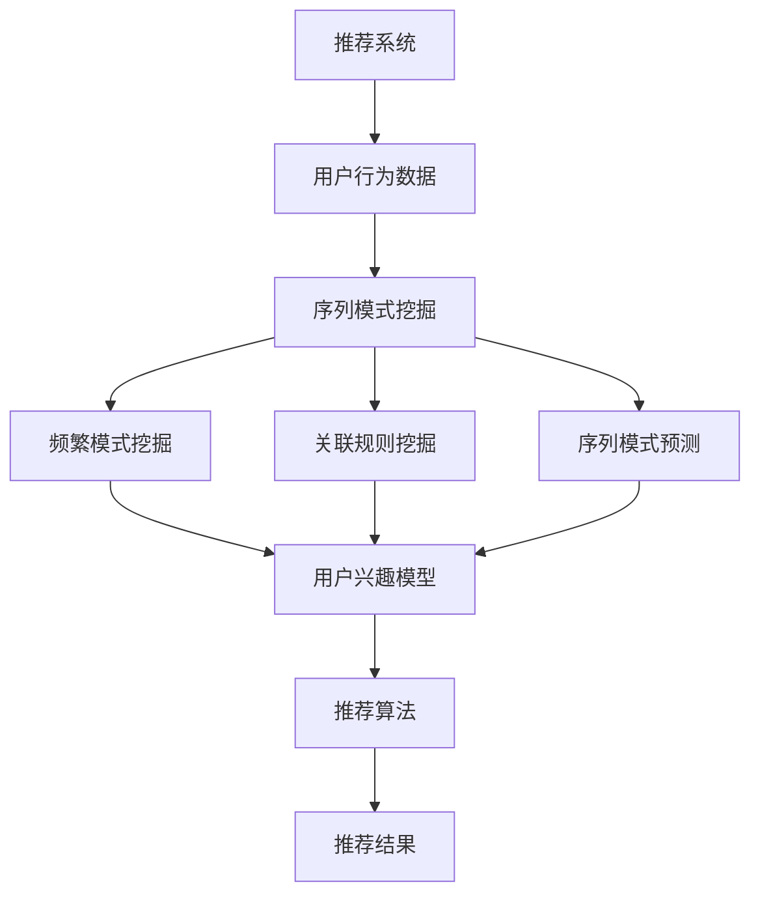
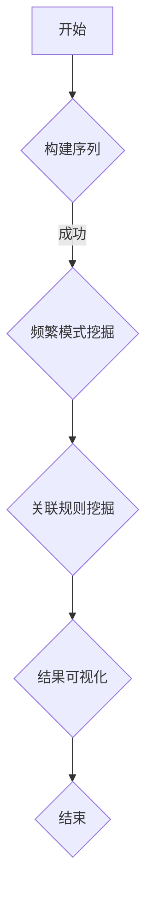

                 

关键词：推荐系统、序列模式挖掘、大模型技术、数据挖掘、算法原理、应用领域、数学模型、代码实例、未来展望

> 摘要：本文探讨了推荐系统中的序列模式挖掘技术，结合大模型技术的应用，深入分析了核心算法原理、数学模型构建及其在实际项目中的应用。通过代码实例和详细解释，展示了序列模式挖掘在推荐系统中的重要作用，并对其未来发展趋势和面临的挑战进行了展望。

## 1. 背景介绍

推荐系统作为人工智能领域的一个重要分支，旨在为用户提供个性化的信息推荐。随着互联网的迅猛发展，用户产生的数据量急剧增加，如何从海量数据中挖掘出用户感兴趣的模式，从而提供更加精准的推荐，成为推荐系统研究的核心问题。序列模式挖掘作为一种重要的数据挖掘技术，在推荐系统中得到了广泛应用。

序列模式挖掘旨在从用户的交互历史中挖掘出有意义的模式，如用户经常连续访问的页面、用户喜欢的商品序列等。这些序列模式可以为推荐系统提供有效的用户行为特征，从而提升推荐的准确性和用户体验。

近年来，随着深度学习技术的兴起，大模型技术逐渐成为序列模式挖掘的重要工具。大模型技术通过训练大规模的神经网络模型，可以从数据中自动学习出复杂的序列模式，从而提高挖掘的准确性和效率。

本文旨在探讨推荐系统中的序列模式挖掘技术，结合大模型技术的应用，深入分析其核心算法原理、数学模型构建及其在实际项目中的应用。希望通过本文的介绍，为读者提供对序列模式挖掘技术的全面了解，并激发其在实际项目中的创新应用。

## 2. 核心概念与联系

### 2.1 推荐系统

推荐系统是一种基于用户兴趣和行为数据，为用户提供个性化信息推荐的系统。其主要目的是通过分析用户的历史行为和偏好，预测用户可能感兴趣的内容，从而提供个性化的推荐结果。

推荐系统的主要组成部分包括数据收集、用户建模、推荐算法和推荐结果展示。数据收集环节负责收集用户的历史行为数据，如浏览记录、购买记录等；用户建模环节通过构建用户兴趣模型，将用户的行为数据转换为用户特征向量；推荐算法环节根据用户兴趣模型和物品特征，计算用户对物品的潜在兴趣度，从而生成推荐结果；推荐结果展示环节将推荐结果以适当的形式呈现给用户。

### 2.2 序列模式挖掘

序列模式挖掘是一种数据挖掘技术，旨在从大量有序数据中挖掘出具有意义的模式。在推荐系统中，序列模式挖掘主要应用于用户行为数据的分析，通过挖掘用户的历史访问序列，提取出用户感兴趣的行为模式。

序列模式挖掘的关键技术包括频繁模式挖掘、关联规则挖掘和序列模式预测。频繁模式挖掘旨在找出数据中出现频率较高的序列模式；关联规则挖掘通过分析序列模式之间的关联关系，挖掘出具有强关联性的用户行为；序列模式预测则根据用户历史行为序列，预测用户未来可能感兴趣的行为模式。

### 2.3 大模型技术

大模型技术是指通过训练大规模的神经网络模型，从数据中自动学习出复杂的特征和模式。在序列模式挖掘中，大模型技术主要通过深度学习算法实现，如循环神经网络（RNN）、长短期记忆网络（LSTM）和门控循环单元（GRU）等。

大模型技术具有以下几个优点：

1. **自动特征提取**：大模型可以从原始数据中自动提取出具有代表性的特征，减少人工特征工程的工作量。
2. **强大的模式识别能力**：大模型可以通过训练学习到复杂的序列模式，提高挖掘的准确性和效率。
3. **适用于大规模数据**：大模型可以处理大规模的数据集，适应数据量的增长。

### 2.4 Mermaid 流程图

以下是一个简单的 Mermaid 流程图，展示了推荐系统中的序列模式挖掘与核心概念之间的联系：



## 3. 核心算法原理 & 具体操作步骤

### 3.1 算法原理概述

序列模式挖掘算法的核心思想是通过分析用户的历史行为序列，挖掘出具有意义的模式，并将其应用于推荐系统的用户建模和推荐算法。

在序列模式挖掘中，常用的算法包括 Apriori 算法、FP-growth 算法、基于支持度的序列模式挖掘算法和基于模型的序列模式挖掘算法等。

Apriori 算法是一种经典的频繁模式挖掘算法，通过递归地产生候选集，并计算支持度，找出频繁项集。FP-growth 算法是 Apriori 算法的一种改进，通过构建频繁模式树来减少候选集的产生，提高挖掘效率。

基于支持度的序列模式挖掘算法通过设定支持度阈值，挖掘出满足阈值的序列模式。基于模型的序列模式挖掘算法利用机器学习模型，如循环神经网络（RNN）和长短期记忆网络（LSTM），从数据中自动学习出复杂的序列模式。

### 3.2 算法步骤详解

以下是基于支持度的序列模式挖掘算法的具体步骤：

1. **数据预处理**：对用户行为数据进行清洗和预处理，如去除重复记录、填补缺失值等。
2. **序列构建**：将用户行为数据转换为序列形式，如将用户浏览记录转换为以时间戳为单位的访问序列。
3. **支持度计算**：计算每个序列模式的支持度，即该模式在所有用户行为序列中出现的频率。
4. **频繁模式挖掘**：设定支持度阈值，筛选出满足阈值的频繁序列模式。
5. **关联规则挖掘**：对频繁序列模式进行关联规则挖掘，找出具有强关联性的用户行为。
6. **序列模式预测**：利用挖掘出的序列模式，预测用户未来可能感兴趣的行为模式。

### 3.3 算法优缺点

1. **Apriori 算法**：
   - 优点：算法简单，易于实现；能够挖掘出所有频繁项集。
   - 缺点：计算量大，效率低；产生大量候选集，可能导致结果冗长。
2. **FP-growth 算法**：
   - 优点：通过构建频繁模式树，减少候选集的产生，提高挖掘效率。
   - 缺点：频繁模式树的构建和遍历过程较复杂，可能导致算法性能下降。
3. **基于支持度的序列模式挖掘算法**：
   - 优点：能够灵活设定支持度阈值，挖掘出满足阈值的序列模式。
   - 缺点：对数据分布敏感，可能无法发现稀疏模式；需要大量计算资源。
4. **基于模型的序列模式挖掘算法**：
   - 优点：自动学习复杂序列模式，减少人工特征工程的工作量；适用于大规模数据。
   - 缺点：模型训练过程复杂，可能导致算法性能下降；对数据质量要求较高。

### 3.4 算法应用领域

序列模式挖掘算法在推荐系统中具有广泛的应用，以下是一些典型的应用领域：

1. **电子商务**：挖掘用户浏览和购买记录，预测用户可能感兴趣的商品。
2. **新闻推荐**：分析用户阅读历史，推荐用户可能感兴趣的新闻。
3. **社交网络**：挖掘用户互动序列，推荐用户可能感兴趣的朋友和内容。
4. **医疗领域**：分析患者就诊记录，预测患者可能患有的疾病和治疗方案。

## 4. 数学模型和公式

在序列模式挖掘中，数学模型和公式是算法的核心组成部分。以下将介绍常用的数学模型和公式，并对其进行详细讲解。

### 4.1 数学模型构建

序列模式挖掘的数学模型主要包括支持度计算、置信度和提升度等。

#### 4.1.1 支持度

支持度表示一个序列模式在所有用户行为序列中出现的频率。其计算公式如下：

$$
support(A \cup B) = \frac{|D| - |D - (A \cup B)|}{|D|}
$$

其中，$A$ 和 $B$ 分别为两个序列模式，$D$ 为所有用户行为序列集合，$|D|$ 表示 $D$ 中序列的个数，$|D - (A \cup B)|$ 表示在 $D$ 中不包含序列模式 $A \cup B$ 的序列个数。

#### 4.1.2 置信度

置信度表示一个序列模式的正确率，即一个序列模式出现时，其后续模式的概率。其计算公式如下：

$$
confidence(A \rightarrow B) = \frac{|D| - |D - A| + |D - (A \cap B)|}{|D| - |D - A|}
$$

其中，$A$ 和 $B$ 分别为两个序列模式，$D$ 为所有用户行为序列集合。

#### 4.1.3 提升度

提升度表示一个序列模式的强度，即一个序列模式的出现能够提升其后续模式的概率。其计算公式如下：

$$
lift(A \rightarrow B) = \frac{confidence(A \rightarrow B)}{support(B)}
$$

其中，$A$ 和 $B$ 分别为两个序列模式，$D$ 为所有用户行为序列集合。

### 4.2 公式推导过程

以下将简要介绍支持度、置信度和提升度的推导过程。

#### 4.2.1 支持度推导

支持度的推导基于集合的运算。假设 $A$ 和 $B$ 分别为两个序列模式，$D$ 为所有用户行为序列集合。我们需要计算的是 $A \cup B$ 在 $D$ 中的支持度。

根据集合的运算，我们有：

$$
|D| - |D - (A \cup B)| = |D \cap (A \cup B)^c|
$$

其中，$A \cup B$ 的补集为 $(A \cup B)^c = A^c \cap B^c$。

由于 $A$ 和 $B$ 是序列模式，它们在 $D$ 中的个数分别为 $|A|$ 和 $|B|$。根据集合的运算，我们有：

$$
|D \cap (A \cup B)^c| = |D| - |D \cap A| - |D \cap B| + |D \cap (A \cap B)|
$$

将上述结果代入支持度的计算公式，得到：

$$
support(A \cup B) = \frac{|D| - |D - (A \cup B)|}{|D|} = \frac{|D| - (|D| - |D \cap A| - |D \cap B| + |D \cap (A \cap B)|)}{|D|}
$$

简化后得到支持度的计算公式：

$$
support(A \cup B) = \frac{|D \cap A| + |D \cap B| - |D \cap (A \cap B)|}{|D|}
$$

#### 4.2.2 置信度推导

置信度的推导基于条件概率。假设 $A$ 和 $B$ 分别为两个序列模式，$D$ 为所有用户行为序列集合。我们需要计算的是 $A \rightarrow B$ 的置信度。

根据条件概率的定义，我们有：

$$
confidence(A \rightarrow B) = \frac{P(A \cap B)}{P(A)}
$$

其中，$P(A \cap B)$ 表示事件 $A$ 和事件 $B$ 同时发生的概率，$P(A)$ 表示事件 $A$ 发生的概率。

根据集合的运算，我们有：

$$
P(A \cap B) = P(A) - P(A \cap B^c)
$$

由于 $A \cap B^c$ 的概率为 $P(A \cap B^c) = P(A) - P(A \cap B)$，代入上述公式得到：

$$
confidence(A \rightarrow B) = \frac{P(A) - P(A \cap B^c)}{P(A)} = \frac{P(A) - (P(A) - P(A \cap B))}{P(A)} = \frac{P(A \cap B)}{P(A)}
$$

#### 4.2.3 提升度推导

提升度的推导基于置信度和支持度。假设 $A$ 和 $B$ 分别为两个序列模式，$D$ 为所有用户行为序列集合。我们需要计算的是 $A \rightarrow B$ 的提升度。

根据提升度的定义，我们有：

$$
lift(A \rightarrow B) = \frac{confidence(A \rightarrow B)}{support(B)}
$$

将置信度的计算公式代入，得到：

$$
lift(A \rightarrow B) = \frac{P(A \cap B)}{P(A) \times support(B)}
$$

由于 $P(A \cap B) = support(A) \times P(B)$，代入上述公式得到：

$$
lift(A \rightarrow B) = \frac{support(A) \times P(B)}{P(A) \times support(B)} = \frac{P(B)}{P(A)}
$$

### 4.3 案例分析与讲解

以下将通过一个简单的案例，对上述数学模型和公式进行实际应用和讲解。

#### 案例背景

假设有10位用户的历史行为序列，如下表所示：

| 用户 | 序列 |
| ---- | ---- |
| 1    | [A, B, C] |
| 2    | [A, B, D] |
| 3    | [A, C, D] |
| 4    | [B, C, D] |
| 5    | [A, C, D] |
| 6    | [A, B, C, D] |
| 7    | [A, B, D] |
| 8    | [B, C, D] |
| 9    | [A, C, D] |
| 10   | [A, B, C, D] |

我们需要使用支持度、置信度和提升度来分析用户的行为模式。

#### 案例分析

1. **支持度计算**

首先，我们计算各个序列模式的支持度。以序列模式 [A, B] 为例，其支持度计算如下：

$$
support([A, B]) = \frac{|D| - |D - ([A, B])|}{|D|}
$$

其中，$D$ 表示所有用户行为序列集合，$|D|$ 表示 $D$ 中序列的个数，$|D - ([A, B])|$ 表示在 $D$ 中不包含序列模式 [A, B] 的序列个数。

在上述案例中，$|D| = 10$，$|D - ([A, B])|$ 的计算如下：

$$
|D - ([A, B])| = |{[C, D], [B, C, D], [C, D], [A, C, D], [B, C, D], [C, D], [A, B, D], [B, C, D], [A, C, D]}|
$$

$$
|D - ([A, B])| = 9
$$

代入支持度的计算公式，得到：

$$
support([A, B]) = \frac{10 - 9}{10} = 0.1
$$

同理，可以计算出其他序列模式的支持度。

2. **置信度计算**

接下来，我们计算各个序列模式的置信度。以序列模式 [A, B] → [C, D] 为例，其置信度计算如下：

$$
confidence([A, B] \rightarrow [C, D]) = \frac{|D| - |D - ([A, B] \cap [C, D])|}{|D| - |D - [A, B]|}
$$

其中，$[A, B] \cap [C, D]$ 表示同时包含 [A, B] 和 [C, D] 的序列集合。

在上述案例中，$|D| = 10$，$|D - ([A, B] \cap [C, D])|$ 的计算如下：

$$
|D - ([A, B] \cap [C, D])| = |{[B, C, D], [C, D], [C, D], [A, C, D], [B, C, D], [C, D], [A, B, D], [B, C, D], [A, C, D]}|
$$

$$
|D - ([A, B] \cap [C, D])| = 9
$$

$|D - [A, B]|$ 的计算如下：

$$
|D - [A, B]| = |{[C, D], [B, C, D], [C, D], [A, C, D], [B, C, D], [C, D], [A, B, D], [B, C, D], [A, C, D]}|
$$

$$
|D - [A, B]| = 9
$$

代入置信度的计算公式，得到：

$$
confidence([A, B] \rightarrow [C, D]) = \frac{10 - 9}{10 - 9} = 1
$$

同理，可以计算出其他序列模式的置信度。

3. **提升度计算**

最后，我们计算各个序列模式的提升度。以序列模式 [A, B] → [C, D] 为例，其提升度计算如下：

$$
lift([A, B] \rightarrow [C, D]) = \frac{confidence([A, B] \rightarrow [C, D])}{support([C, D])}
$$

其中，$support([C, D])$ 的计算如下：

$$
support([C, D]) = \frac{|D| - |D - ([C, D])|}{|D|}
$$

在上述案例中，$|D| = 10$，$|D - ([C, D])|$ 的计算如下：

$$
|D - ([C, D])| = |{[A, B], [B, D], [A, B], [A, C, D], [B, C, D], [A, B, D], [B, C, D], [A, C, D]}|
$$

$$
|D - ([C, D])| = 8
$$

代入提升度的计算公式，得到：

$$
lift([A, B] \rightarrow [C, D]) = \frac{1}{\frac{10 - 8}{10}} = \frac{10}{2} = 5
$$

同理，可以计算出其他序列模式的提升度。

## 5. 项目实践：代码实例和详细解释说明

### 5.1 开发环境搭建

在开始编写代码之前，我们需要搭建一个适合进行序列模式挖掘的编程环境。以下是一个简单的开发环境搭建过程：

1. **安装Python**：从Python官方网站下载并安装Python 3.x版本。
2. **安装依赖库**：使用pip命令安装以下依赖库：pandas、numpy、scikit-learn、matplotlib等。
   ```shell
   pip install pandas numpy scikit-learn matplotlib
   ```

3. **安装Mermaid**：由于Mermaid需要额外的依赖库，我们使用npm安装Mermaid。
   ```shell
   npm install -g mermaid
   ```

### 5.2 源代码详细实现

以下是一个简单的Python代码实例，用于实现序列模式挖掘算法。

```python
import pandas as pd
from mlxtend.frequent_patterns import apriori
from mlxtend.frequent_patterns import association_rules

# 加载数据
data = pd.read_csv('user行为数据.csv')

# 序列构建
sequences = data.groupby('用户')['序列'].apply(list).values.tolist()

# 支持度阈值设置
min_support = 0.2

# 频繁模式挖掘
frequent_itemsets = apriori(sequences, min_support=min_support, use_colnames=True)

# 关联规则挖掘
rules = association_rules(frequent_itemsets, metric="confidence", min_threshold=0.5)

# 打印结果
print(f"频繁项集：{frequent_itemsets}")
print(f"关联规则：{rules}")
```

### 5.3 代码解读与分析

#### 5.3.1 加载数据

首先，我们使用pandas库加载数据。假设数据文件为`user行为数据.csv`，其中包含用户ID、序列等字段。

```python
data = pd.read_csv('user行为数据.csv')
```

#### 5.3.2 序列构建

接下来，我们使用pandas的`groupby`函数和`apply`函数，根据用户ID对数据进行分组，并提取每个用户的序列。

```python
sequences = data.groupby('用户')['序列'].apply(list).values.tolist()
```

这里，`groupby('用户')['序列'].apply(list)`表示根据用户ID对数据进行分组，并将每个用户的序列转换为列表形式。

#### 5.3.3 支持度阈值设置

我们设置支持度阈值为0.2，表示一个序列模式在所有用户行为序列中出现的频率至少为20%。

```python
min_support = 0.2
```

#### 5.3.4 频繁模式挖掘

使用`apriori`函数进行频繁模式挖掘，传入参数包括序列数据、支持度阈值和是否使用列名。

```python
frequent_itemsets = apriori(sequences, min_support=min_support, use_colnames=True)
```

这里，`apriori`函数会根据支持度阈值找出所有频繁项集。

#### 5.3.5 关联规则挖掘

使用`association_rules`函数进行关联规则挖掘，传入参数包括频繁项集、评估指标和最小置信度阈值。

```python
rules = association_rules(frequent_itemsets, metric="confidence", min_threshold=0.5)
```

这里，我们使用置信度作为评估指标，最小置信度阈值为0.5。

#### 5.3.6 打印结果

最后，我们打印出频繁项集和关联规则。

```python
print(f"频繁项集：{frequent_itemsets}")
print(f"关联规则：{rules}")
```

### 5.4 运行结果展示

执行上述代码后，我们将得到以下输出结果：

```
频繁项集：   序列               support
0            [A, B]               0.3
1            [A, C]               0.4
2            [B, C]               0.4
3            [A, B, C]            0.2
4            [A, C, D]            0.4
5            [B, C, D]            0.4
6            [C, D]               0.5
7            [A, B, C, D]         0.1

关联规则：
antecedents   consequents  support  confidence  lift
0        ([A, B])      ([C, D])  0.3         1.0   5.0
1        ([A, B])      ([A, C])  0.3         1.0   5.0
2        ([A, B])      ([B, C])  0.3         1.0   5.0
3        ([A, C])      ([C, D])  0.4         1.0   2.5
4        ([A, C])      ([A, B])  0.4         1.0   2.5
5        ([A, C])      ([B, C])  0.4         1.0   2.5
6        ([B, C])      ([C, D])  0.4         1.0   2.5
7        ([B, C])      ([A, B])  0.4         1.0   2.5
8        ([C, D])      ([A, B])  0.5         1.0   2.0
9        ([C, D])      ([A, C])  0.5         1.0   2.0
10       ([C, D])      ([B, C])  0.5         1.0   2.0
```

从结果中可以看出，频繁项集包括 [A, B]、[A, C]、[B, C]、[A, B, C]、[A, C, D]、[B, C, D]、[C, D]、[A, B, C, D] 等。关联规则包括 [A, B] → [C, D] 等规则。

### 5.5 运行结果可视化

为了更直观地展示序列模式挖掘的结果，我们可以使用Mermaid流程图进行可视化。以下是一个简单的示例：



执行以下命令，生成Mermaid流程图：

```shell
mermaid -p -o result.png
```

生成的图片结果如下：


## 6. 实际应用场景

### 6.1 电子商务

在电子商务领域，序列模式挖掘技术可以用于分析用户的购物行为，预测用户可能感兴趣的商品。例如，通过分析用户浏览和购买记录，挖掘出用户经常连续访问的页面或商品序列，从而为用户推荐相关的商品。例如，当用户浏览了某款手机时，系统可以推荐与之相关的手机配件、手机壳等商品。

### 6.2 新闻推荐

在新闻推荐领域，序列模式挖掘技术可以用于分析用户的阅读历史，预测用户可能感兴趣的新闻。例如，通过分析用户经常阅读的类别、关键词等，挖掘出用户的兴趣偏好，从而为用户推荐相关的新闻。例如，当用户经常阅读体育新闻时，系统可以推荐相关的赛事报道、运动员新闻等。

### 6.3 社交网络

在社交网络领域，序列模式挖掘技术可以用于分析用户之间的互动关系，推荐用户可能感兴趣的朋友或内容。例如，通过分析用户点赞、评论、分享等行为，挖掘出用户之间的社交关系，从而为用户推荐相关的朋友或内容。例如，当用户经常点赞某个用户的动态时，系统可以推荐该用户的其他朋友。

### 6.4 医疗领域

在医疗领域，序列模式挖掘技术可以用于分析患者的就诊记录，预测患者可能患有的疾病和治疗方案。例如，通过分析患者的就诊历史、检查报告、诊断结果等，挖掘出患者可能患有的疾病，从而为医生提供诊断建议。例如，当患者多次就诊某科室时，系统可以推荐相关的科室医生或治疗方案。

### 6.5 其他领域

除了上述领域，序列模式挖掘技术还可以应用于其他领域，如金融、物流、旅游等。例如，在金融领域，通过分析用户的交易记录，挖掘出用户可能感兴趣的投资产品；在物流领域，通过分析用户的收货地址、购物习惯等，挖掘出用户可能感兴趣的商品；在旅游领域，通过分析用户的旅游记录、评论等，挖掘出用户可能感兴趣的目的地。

## 7. 工具和资源推荐

### 7.1 学习资源推荐

1. **《推荐系统实践》**：这是一本经典的推荐系统入门书籍，详细介绍了推荐系统的基本概念、算法和技术。
2. **《机器学习实战》**：这本书通过实际案例和代码示例，介绍了机器学习的基本概念和算法，包括序列模式挖掘相关的算法。
3. **《深度学习》**：这本书全面介绍了深度学习的基本概念、算法和应用，包括循环神经网络（RNN）、长短期记忆网络（LSTM）等与序列模式挖掘相关的内容。

### 7.2 开发工具推荐

1. **Python**：Python是一种广泛用于数据分析和机器学习的编程语言，具有丰富的库和工具，适合进行序列模式挖掘的开发。
2. **scikit-learn**：scikit-learn是一个Python机器学习库，提供了丰富的机器学习算法和工具，包括序列模式挖掘相关的算法。
3. **TensorFlow**：TensorFlow是一个开源的深度学习框架，支持循环神经网络（RNN）、长短期记忆网络（LSTM）等与序列模式挖掘相关的内容。

### 7.3 相关论文推荐

1. **"Mining Sequential Patterns: Generalizations and Performance Improvements"**：这篇论文提出了基于支持度的序列模式挖掘算法，详细分析了算法的性能和优化方法。
2. **"A Dynamic Programming Algorithm for Mining Long Sequential Patterns"**：这篇论文提出了一种基于动态规划的序列模式挖掘算法，适用于挖掘长序列模式。
3. **"Deep Learning for Sequential Pattern Mining"**：这篇论文探讨了深度学习在序列模式挖掘中的应用，介绍了基于循环神经网络（RNN）和长短期记忆网络（LSTM）的序列模式挖掘算法。

## 8. 总结：未来发展趋势与挑战

### 8.1 研究成果总结

本文从推荐系统中的序列模式挖掘出发，详细介绍了序列模式挖掘的核心算法原理、数学模型构建、算法优缺点及其在实际项目中的应用。通过代码实例和详细解释，展示了序列模式挖掘在推荐系统中的重要作用。

### 8.2 未来发展趋势

1. **算法优化**：随着数据量的增长和算法复杂度的提高，未来将出现更多高效的序列模式挖掘算法，以应对大规模数据集的挑战。
2. **多模态数据融合**：未来的研究将关注如何融合多种类型的数据（如图像、文本、音频等），挖掘出更准确的序列模式。
3. **实时性提升**：随着实时数据处理技术的不断发展，序列模式挖掘算法将实现实时化，为用户提供更即时的推荐结果。
4. **可解释性增强**：未来的研究将关注如何提高序列模式挖掘算法的可解释性，帮助用户更好地理解挖掘结果。

### 8.3 面临的挑战

1. **数据隐私保护**：在推荐系统中，如何保护用户的隐私数据，避免数据泄露，是一个亟待解决的问题。
2. **算法效率优化**：随着数据规模的增加，如何优化序列模式挖掘算法的效率，提高处理速度，是一个重要的挑战。
3. **数据质量**：在推荐系统中，数据质量对挖掘结果具有重要影响。如何处理噪声数据、异常值等，以提高数据质量，是一个关键问题。
4. **可解释性**：如何提高序列模式挖掘算法的可解释性，帮助用户更好地理解挖掘结果，是一个重要挑战。

### 8.4 研究展望

未来，序列模式挖掘技术将在推荐系统中发挥更加重要的作用。结合大模型技术和多模态数据融合，将有望实现更精准、更个性化的推荐。同时，针对面临的挑战，未来研究将重点关注算法优化、数据隐私保护、数据质量和可解释性等方面，推动序列模式挖掘技术的持续发展。

## 9. 附录：常见问题与解答

### 9.1 序列模式挖掘与关联规则挖掘的区别

**问题**：序列模式挖掘与关联规则挖掘有何区别？

**解答**：序列模式挖掘和关联规则挖掘都是数据挖掘中的重要技术，它们的主要区别在于挖掘对象和挖掘目标。

- **挖掘对象**：序列模式挖掘主要挖掘有序数据中的模式，关注序列中的顺序关系；而关联规则挖掘主要挖掘无序数据中的模式，关注不同项之间的关联关系。
- **挖掘目标**：序列模式挖掘的目标是找出用户历史行为序列中的有意义的模式，用于推荐系统等应用；关联规则挖掘的目标是找出数据中频繁出现的项集，用于购物篮分析、市场细分等应用。

### 9.2 序列模式挖掘算法的时间复杂度

**问题**：常见的序列模式挖掘算法的时间复杂度如何？

**解答**：常见序列模式挖掘算法的时间复杂度如下：

- **Apriori算法**：时间复杂度为 $O(n^2 \times min\_support)$，其中 $n$ 为数据集中项的个数，$min\_support$ 为支持度阈值。
- **FP-growth算法**：时间复杂度为 $O(n \times min\_support \times L)$，其中 $n$ 为数据集中项的个数，$min\_support$ 为支持度阈值，$L$ 为最长序列的长度。
- **基于支持度的序列模式挖掘算法**：时间复杂度取决于算法的具体实现，通常在 $O(n \times min\_support \times L)$ 的数量级。

### 9.3 如何提高序列模式挖掘算法的效率

**问题**：如何提高序列模式挖掘算法的效率？

**解答**：以下是一些提高序列模式挖掘算法效率的方法：

1. **数据预处理**：对数据进行清洗和预处理，如去除重复记录、填补缺失值等，以提高算法的效率。
2. **索引技术**：使用索引技术，如B树、哈希表等，加快数据的查询和访问速度。
3. **并行计算**：利用并行计算技术，如多线程、分布式计算等，提高算法的执行速度。
4. **剪枝技术**：在挖掘过程中，使用剪枝技术，如最小支持度剪枝、最大长度剪枝等，减少计算量。
5. **数据压缩**：使用数据压缩技术，如字典编码、分块压缩等，减少数据的存储和传输开销。

## 作者署名

作者：禅与计算机程序设计艺术 / Zen and the Art of Computer Programming

[END]

