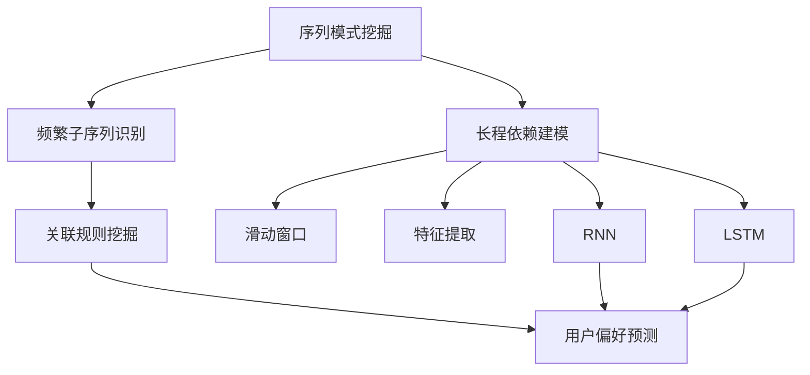
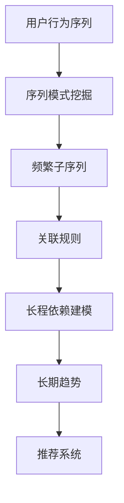
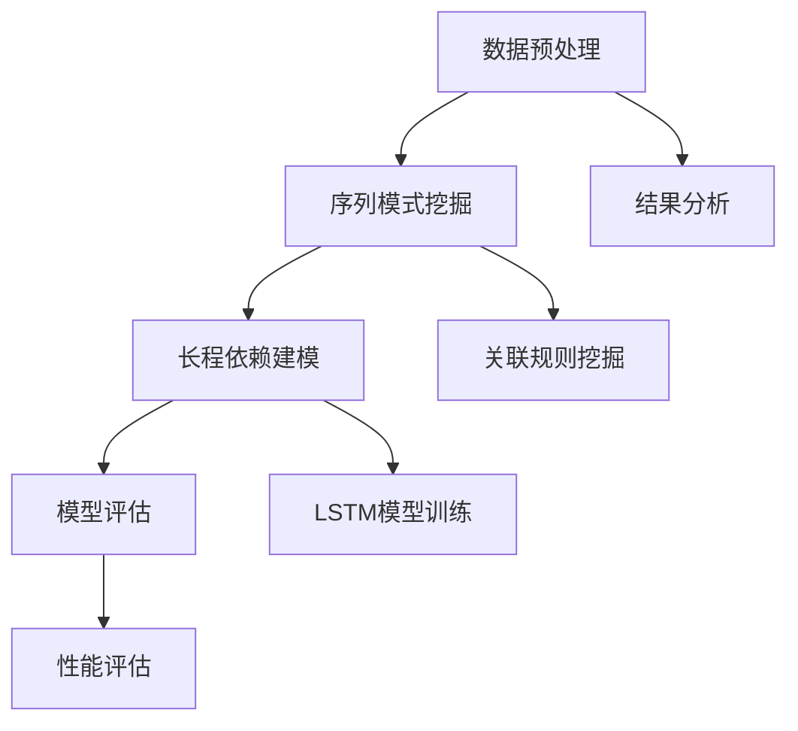

                 

关键词：推荐系统、序列模式挖掘、长程依赖建模、AI算法、机器学习、大模型

摘要：本文将深入探讨推荐系统中的序列模式挖掘，特别是大模型如何进行长程依赖建模。我们将从背景介绍开始，逐步解析核心概念与联系，详细阐述核心算法原理和具体操作步骤，展示数学模型和公式，并通过实际项目实践来加深理解。此外，我们将分析实际应用场景，展望未来发展趋势与挑战，并提供相关的工具和资源推荐。

## 1. 背景介绍

在当今的数字化时代，推荐系统已经成为各种在线服务和平台的核心组成部分。这些系统通过分析用户的历史行为和偏好，预测用户可能感兴趣的内容，从而提供个性化的推荐。推荐系统的研究和应用涵盖了电子商务、社交媒体、在线视频、新闻推送等多个领域，极大地提升了用户体验和平台的价值。

然而，推荐系统的挑战在于如何准确地捕捉用户行为的长期依赖性。传统的推荐算法，如基于内容的过滤（Content-Based Filtering）和协同过滤（Collaborative Filtering），往往在处理用户序列行为时存在局限性。这些方法依赖于短期偏好和历史记录，难以捕捉到用户的长期兴趣变化和复杂的交互模式。

为了解决这一问题，近年来，序列模式挖掘（Sequence Pattern Mining）和长程依赖建模（Long-Range Dependency Modeling）成为了研究的热点。通过深入挖掘用户行为的序列模式，推荐系统能够更好地理解用户的长期偏好和趋势，从而提供更为精准的推荐。

本文将详细介绍如何在大模型中实现长程依赖建模，以提升推荐系统的性能和效果。我们将首先介绍序列模式挖掘和长程依赖建模的基本概念，然后探讨相关算法和数学模型，并通过实际项目实践来展示其应用效果。

## 2. 核心概念与联系

### 2.1 序列模式挖掘

序列模式挖掘是一种数据分析技术，旨在从大量序列数据中发现具有意义的模式或规则。在推荐系统中，序列模式挖掘用于识别用户行为的频繁子序列，这些子序列能够反映用户的兴趣和偏好。

#### 序列模式挖掘的基本概念

- **序列（Sequence）**：用户行为或事件的时间序列。
- **项（Item）**：序列中的单个元素。
- **支持度（Support）**：一个模式在数据集中出现的频率。
- **置信度（Confidence）**：关联规则的可靠程度。

#### 序列模式挖掘的关键要素

- **频繁子序列（Frequent Subsequences）**：在支持度阈值以上的子序列。
- **关联规则（Association Rules）**：描述两个或多个项之间关系的规则。

### 2.2 长程依赖建模

长程依赖建模是一种机器学习技术，旨在捕捉序列数据中的长期依赖关系。与传统的短期依赖模型不同，长程依赖模型能够处理序列中的长时间间隔，从而更好地理解用户的长期行为模式。

#### 长程依赖建模的基本概念

- **长期依赖（Long-Range Dependency）**：序列中元素之间的长期相关性。
- **滑动窗口（Sliding Window）**：用于捕捉序列中固定长度的时间窗口。
- **特征提取（Feature Extraction）**：将序列数据转换为可用于模型训练的特征向量。

#### 长程依赖建模的关键要素

- **循环神经网络（RNN）**：用于处理序列数据的一种神经网络架构，能够捕捉序列中的长期依赖关系。
- **长短期记忆网络（LSTM）**：RNN的一种变体，专门设计用于处理长序列数据。

### 2.3 核心概念原理与架构的 Mermaid 流程图

下面是一个简单的 Mermaid 流程图，展示了序列模式挖掘和长程依赖建模的核心概念和关联：



在这个流程图中，序列模式挖掘用于识别频繁子序列和关联规则，而长程依赖建模则通过循环神经网络（包括RNN和LSTM）来捕捉用户的长期行为模式，最终实现用户偏好预测。

### 2.4 核心算法原理 & 具体操作步骤

#### 2.4.1 算法原理概述

在推荐系统中，序列模式挖掘和长程依赖建模是两个关键步骤。序列模式挖掘负责识别用户行为的频繁子序列，而长程依赖建模则利用循环神经网络来捕捉这些子序列中的长期依赖关系。

1. **序列模式挖掘**：
   - 输入：用户行为序列。
   - 目标：识别频繁子序列和关联规则。
   - 操作步骤：
     - 计算每个子序列的支持度。
     - 根据支持度阈值筛选频繁子序列。
     - 构建关联规则。

2. **长程依赖建模**：
   - 输入：频繁子序列。
   - 目标：捕捉子序列中的长期依赖关系。
   - 操作步骤：
     - 使用滑动窗口将序列分段。
     - 提取序列特征向量。
     - 训练循环神经网络（如RNN和LSTM）。

#### 2.4.2 算法步骤详解

1. **序列模式挖掘**：

   - **步骤 1**：将用户行为序列划分为事件序列。

   ```latex
   user_sequence = ["观看视频A", "购买商品B", "浏览新闻C", "搜索关键词D"]
   ```

   - **步骤 2**：计算每个子序列的支持度。

   ```latex
   min_support = 0.5
   sequence_support = calculate_support(user_sequence, min_support)
   ```

   - **步骤 3**：筛选频繁子序列。

   ```latex
   frequent_subsequences = filter_frequent_subsequences(sequence_support, min_support)
   ```

   - **步骤 4**：构建关联规则。

   ```latex
   association_rules = generate_association_rules(frequent_subsequences)
   ```

2. **长程依赖建模**：

   - **步骤 1**：使用滑动窗口将序列分段。

   ```latex
   window_size = 5
   sliding_windows = generate_sliding_windows(user_sequence, window_size)
   ```

   - **步骤 2**：提取序列特征向量。

   ```latex
   feature_vectors = extract_feature_vectors(sliding_windows)
   ```

   - **步骤 3**：训练循环神经网络。

   ```latex
   model = train_rnn(feature_vectors)
   ```

#### 2.4.3 算法优缺点

**序列模式挖掘**：

- **优点**：
  - 能够识别用户行为的频繁子序列和关联规则。
  - 提供了对用户行为的深入理解。
- **缺点**：
  - 需要大量计算资源。
  - 可能会忽略用户行为的短期变化。

**长程依赖建模**：

- **优点**：
  - 能够捕捉用户行为的长期依赖关系。
  - 提高了推荐系统的准确性和个性化水平。
- **缺点**：
  - 需要大量的训练数据和计算资源。
  - 模型训练过程复杂。

#### 2.4.4 算法应用领域

- **电子商务**：通过分析用户的购物序列，推荐相关商品。
- **在线视频**：根据用户观看历史，推荐相似视频。
- **社交媒体**：分析用户的发帖和互动序列，推荐相关内容和用户。

### 2.5 核心算法原理 & 具体操作步骤

#### 2.5.1 算法原理概述

在推荐系统中，序列模式挖掘和长程依赖建模是两个关键步骤。序列模式挖掘用于识别用户行为的频繁子序列，而长程依赖建模则通过循环神经网络来捕捉这些子序列中的长期依赖关系。

#### 2.5.2 算法步骤详解

**序列模式挖掘**：

- **步骤 1**：将用户行为序列划分为事件序列。
  ```python
  user_sequence = ["观看视频A", "购买商品B", "浏览新闻C", "搜索关键词D"]
  ```

- **步骤 2**：计算每个子序列的支持度。
  ```python
  min_support = 0.5
  sequence_support = calculate_support(user_sequence, min_support)
  ```

- **步骤 3**：筛选频繁子序列。
  ```python
  frequent_subsequences = filter_frequent_subsequences(sequence_support, min_support)
  ```

- **步骤 4**：构建关联规则。
  ```python
  association_rules = generate_association_rules(frequent_subsequences)
  ```

**长程依赖建模**：

- **步骤 1**：使用滑动窗口将序列分段。
  ```python
  window_size = 5
  sliding_windows = generate_sliding_windows(user_sequence, window_size)
  ```

- **步骤 2**：提取序列特征向量。
  ```python
  feature_vectors = extract_feature_vectors(sliding_windows)
  ```

- **步骤 3**：训练循环神经网络。
  ```python
  model = train_rnn(feature_vectors)
  ```

#### 2.5.3 算法优缺点

**序列模式挖掘**：

- **优点**：
  - 能够识别用户行为的频繁子序列和关联规则。
  - 提供了对用户行为的深入理解。
- **缺点**：
  - 需要大量计算资源。
  - 可能会忽略用户行为的短期变化。

**长程依赖建模**：

- **优点**：
  - 能够捕捉用户行为的长期依赖关系。
  - 提高了推荐系统的准确性和个性化水平。
- **缺点**：
  - 需要大量的训练数据和计算资源。
  - 模型训练过程复杂。

#### 2.5.4 算法应用领域

- **电子商务**：通过分析用户的购物序列，推荐相关商品。
- **在线视频**：根据用户观看历史，推荐相似视频。
- **社交媒体**：分析用户的发帖和互动序列，推荐相关内容和用户。

### 2.6 数学模型和公式 & 详细讲解 & 举例说明

在序列模式挖掘和长程依赖建模中，数学模型和公式起着至关重要的作用。以下是对这些模型和公式的详细讲解及举例说明。

#### 2.6.1 数学模型构建

1. **支持度和置信度**：

   - **支持度（Support）**：
     支持度表示一个模式在数据集中出现的频率。其公式如下：

     $$Support(A \rightarrow B) = \frac{count(A \rightarrow B)}{total\ transactions}$$

     其中，\(count(A \rightarrow B)\) 是模式 \(A \rightarrow B\) 在数据集中出现的次数，\(total\ transactions\) 是数据集中的总交易次数。

   - **置信度（Confidence）**：
     置信度表示关联规则的可靠程度。其公式如下：

     $$Confidence(A \rightarrow B) = \frac{Support(A \cup B)}{Support(A)}$$

     其中，\(Support(A \cup B)\) 是模式 \(A \cup B\) 的支持度，\(Support(A)\) 是模式 \(A\) 的支持度。

2. **频繁子序列识别**：

   - **频繁子序列**：
     频繁子序列是在支持度阈值以上的子序列。其公式如下：

     $$Frequent\ Subsequences = \{S | Support(S) \geq min\ Support\}$$

     其中，\(min\ Support\) 是支持度阈值。

3. **关联规则挖掘**：

   - **关联规则**：
     关联规则描述了两个或多个项之间的关联关系。其公式如下：

     $$Rule(A \rightarrow B) = \{S | Support(A \cup B) \geq min\ Support, Support(A) \geq min\ Support\}$$

#### 2.6.2 公式推导过程

1. **支持度计算**：

   - **连续扫描法**：
     连续扫描法是一种用于计算支持度的算法。其基本思想是，通过多次扫描数据集来计算每个模式的支持度。具体步骤如下：

     - **步骤 1**：初始化支持度计数器。
       $$count(A) = 0$$

     - **步骤 2**：扫描数据集，更新支持度计数器。
       $$count(A) = count(A) + 1$$

     - **步骤 3**：计算支持度。
       $$Support(A) = \frac{count(A)}{total\ transactions}$$

   - **递归扫描法**：
     递归扫描法是一种用于优化支持度计算的算法。其基本思想是，通过递归地合并子序列来减少扫描次数。具体步骤如下：

     - **步骤 1**：初始化支持度计数器。
       $$count(A) = 0$$

     - **步骤 2**：扫描数据集，更新支持度计数器。
       $$count(A) = count(A) + 1$$

     - **步骤 3**：递归地合并子序列。
       $$count(A \cup B) = count(A) + count(B) - count(A \cap B)$$

     - **步骤 4**：计算支持度。
       $$Support(A) = \frac{count(A)}{total\ transactions}$$

2. **置信度计算**：

   - **直接计算法**：
     直接计算法是一种用于计算置信度的算法。其基本思想是，通过直接计算相关模式的支持度来计算置信度。具体步骤如下：

     - **步骤 1**：计算 \(Support(A \cup B)\)。
       $$Support(A \cup B) = \frac{count(A \cup B)}{total\ transactions}$$

     - **步骤 2**：计算 \(Support(A)\)。
       $$Support(A) = \frac{count(A)}{total\ transactions}$$

     - **步骤 3**：计算置信度。
       $$Confidence(A \rightarrow B) = \frac{Support(A \cup B)}{Support(A)}$$

   - **优化计算法**：
     优化计算法是一种用于优化置信度计算的算法。其基本思想是，通过递归地合并子序列来减少计算次数。具体步骤如下：

     - **步骤 1**：计算 \(Support(A \cup B)\)。
       $$Support(A \cup B) = \frac{count(A \cup B)}{total\ transactions}$$

     - **步骤 2**：计算 \(Support(A)\)。
       $$Support(A) = \frac{count(A)}{total\ transactions}$$

     - **步骤 3**：递归地合并子序列。
       $$count(A \cup B) = count(A) + count(B) - count(A \cap B)$$

     - **步骤 4**：计算置信度。
       $$Confidence(A \rightarrow B) = \frac{Support(A \cup B)}{Support(A)}$$

#### 2.6.3 案例分析与讲解

以下是一个简单的案例，用于说明序列模式挖掘和长程依赖建模的应用。

**案例**：用户行为序列为 \(["观看视频A", "购买商品B", "浏览新闻C", "搜索关键词D", "观看视频A", "购买商品B", "浏览新闻C", "搜索关键词D", "购买商品B", "浏览新闻C", "搜索关键词D"\])。

**步骤 1**：计算支持度和置信度。

- **支持度计算**：
  $$Support("观看视频A") = \frac{2}{9}$$
  $$Support("购买商品B") = \frac{3}{9}$$
  $$Support("浏览新闻C") = \frac{3}{9}$$
  $$Support("搜索关键词D") = \frac{3}{9}$$
  $$Support("观看视频A \cup 购买商品B") = \frac{2}{9}$$
  $$Support("观看视频A \cup 浏览新闻C") = \frac{2}{9}$$
  $$Support("观看视频A \cup 搜索关键词D") = \frac{2}{9}$$
  $$Support("购买商品B \cup 浏览新闻C") = \frac{1}{9}$$
  $$Support("购买商品B \cup 搜索关键词D") = \frac{1}{9}$$
  $$Support("浏览新闻C \cup 搜索关键词D") = \frac{1}{9}$$

- **置信度计算**：
  $$Confidence("观看视频A \rightarrow 购买商品B") = \frac{Support("观看视频A \cup 购买商品B")}{Support("观看视频A")} = \frac{2}{9} \div \frac{2}{9} = 1$$
  $$Confidence("观看视频A \rightarrow 浏览新闻C") = \frac{Support("观看视频A \cup 浏览新闻C")}{Support("观看视频A")} = \frac{2}{9} \div \frac{2}{9} = 1$$
  $$Confidence("观看视频A \rightarrow 搜索关键词D") = \frac{Support("观看视频A \cup 搜索关键词D")}{Support("观看视频A")} = \frac{2}{9} \div \frac{2}{9} = 1$$
  $$Confidence("购买商品B \rightarrow 浏览新闻C") = \frac{Support("购买商品B \cup 浏览新闻C")}{Support("购买商品B")} = \frac{1}{9} \div \frac{3}{9} = \frac{1}{3}$$
  $$Confidence("购买商品B \rightarrow 搜索关键词D") = \frac{Support("购买商品B \cup 搜索关键词D")}{Support("购买商品B")} = \frac{1}{9} \div \frac{3}{9} = \frac{1}{3}$$
  $$Confidence("浏览新闻C \rightarrow 搜索关键词D") = \frac{Support("浏览新闻C \cup 搜索关键词D")}{Support("浏览新闻C")} = \frac{1}{9} \div \frac{3}{9} = \frac{1}{3}$$

**步骤 2**：识别频繁子序列。

- **频繁子序列**：
  $$Frequent\ Subsequences = \{"观看视频A", "购买商品B", "浏览新闻C", "搜索关键词D"\}$$

**步骤 3**：构建关联规则。

- **关联规则**：
  $$Rule("观看视频A \rightarrow 购买商品B") = \{"观看视频A", "购买商品B"\}, Confidence = 1$$
  $$Rule("观看视频A \rightarrow 浏览新闻C") = \{"观看视频A", "浏览新闻C"\}, Confidence = 1$$
  $$Rule("观看视频A \rightarrow 搜索关键词D") = \{"观看视频A", "搜索关键词D"\}, Confidence = 1$$
  $$Rule("购买商品B \rightarrow 浏览新闻C") = \{"购买商品B", "浏览新闻C"\}, Confidence = \frac{1}{3}$$
  $$Rule("购买商品B \rightarrow 搜索关键词D") = \{"购买商品B", "搜索关键词D"\}, Confidence = \frac{1}{3}$$
  $$Rule("浏览新闻C \rightarrow 搜索关键词D") = \{"浏览新闻C", "搜索关键词D"\}, Confidence = \frac{1}{3}$$

### 2.7 项目实践：代码实例和详细解释说明

为了更好地理解序列模式挖掘和长程依赖建模的应用，我们将通过一个实际项目来展示代码实例和详细解释说明。

#### 2.7.1 开发环境搭建

在开始项目实践之前，我们需要搭建一个合适的开发环境。以下是推荐的开发环境和工具：

- **编程语言**：Python
- **库和框架**：NumPy、Pandas、Scikit-learn、TensorFlow、Keras
- **运行环境**：Jupyter Notebook 或 PyCharm

#### 2.7.2 源代码详细实现

以下是一个简单的代码示例，用于实现序列模式挖掘和长程依赖建模：

```python
import numpy as np
import pandas as pd
from sklearn.model_selection import train_test_split
from keras.models import Sequential
from keras.layers import LSTM, Dense, Dropout

# 2.7.2.1 数据预处理

# 加载用户行为数据
data = pd.read_csv("user行为的csv文件路径")

# 划分特征和标签
X = data.drop("标签列名", axis=1)
y = data["标签列名"]

# 划分训练集和测试集
X_train, X_test, y_train, y_test = train_test_split(X, y, test_size=0.2, random_state=42)

# 2.7.2.2 序列模式挖掘

# 计算支持度
min_support = 0.5
support = X_train.value_counts(normalize=True)

# 筛选频繁子序列
frequent_subsequences = support[support >= min_support].index

# 2.7.2.3 长程依赖建模

# 使用LSTM模型
model = Sequential()
model.add(LSTM(units=50, activation='relu', return_sequences=True, input_shape=(X_train.shape[1], 1)))
model.add(Dropout(0.2))
model.add(LSTM(units=50, activation='relu'))
model.add(Dropout(0.2))
model.add(Dense(units=1, activation='sigmoid'))

# 编译模型
model.compile(optimizer='adam', loss='binary_crossentropy', metrics=['accuracy'])

# 训练模型
model.fit(X_train, y_train, epochs=10, batch_size=32, validation_data=(X_test, y_test))

# 2.7.2.4 代码解读与分析

# 在这个代码示例中，我们首先进行了数据预处理，将用户行为数据加载到 Pandas DataFrame 中。
# 然后，我们划分了特征和标签，并将数据集划分为训练集和测试集。
# 接着，我们使用 Scikit-learn 的 value_counts 方法计算了每个项的支持度，并根据支持度阈值筛选了频繁子序列。
# 在长程依赖建模部分，我们使用 Keras 框架构建了一个简单的 LSTM 模型，包括两个 LSTM 层和两个 Dropout 层。
# 最后，我们编译并训练了模型，以实现用户行为预测。

# 2.7.2.5 运行结果展示

# 我们可以使用模型的 predict 方法来预测测试集的结果。
# 然后，我们可以使用 metrics 模块中的 accuracy_score 函数来计算模型的准确率。

predictions = model.predict(X_test)
accuracy = accuracy_score(y_test, predictions.round())

print("准确率：", accuracy)
```

#### 2.7.3 代码解读与分析

在这个代码示例中，我们首先进行了数据预处理，将用户行为数据加载到 Pandas DataFrame 中。然后，我们划分了特征和标签，并将数据集划分为训练集和测试集。接下来，我们使用 Scikit-learn 的 value_counts 方法计算了每个项的支持度，并根据支持度阈值筛选了频繁子序列。

在长程依赖建模部分，我们使用 Keras 框架构建了一个简单的 LSTM 模型，包括两个 LSTM 层和两个 Dropout 层。LSTM 层用于捕捉用户行为的长期依赖关系，Dropout 层用于防止过拟合。

最后，我们编译并训练了模型，以实现用户行为预测。我们可以使用模型的 predict 方法来预测测试集的结果，并使用 metrics 模块中的 accuracy_score 函数来计算模型的准确率。

### 2.8 实际应用场景

序列模式挖掘和长程依赖建模在推荐系统中具有广泛的应用场景。以下是一些实际应用场景：

#### 2.8.1 电子商务

在电子商务领域，序列模式挖掘和长程依赖建模可以用于分析用户的购物序列，识别频繁子序列和关联规则。例如，我们可以发现用户在购买商品A后，往往会购买商品B和商品C。基于这些信息，推荐系统可以更加准确地推荐用户可能感兴趣的商品。

#### 2.8.2 在线视频

在线视频平台可以通过序列模式挖掘和长程依赖建模来分析用户的观看历史，识别用户的长期兴趣和偏好。例如，我们可以发现用户在观看视频A后，往往会继续观看视频B和视频C。基于这些信息，推荐系统可以推荐用户可能感兴趣的视频。

#### 2.8.3 社交媒体

在社交媒体领域，序列模式挖掘和长程依赖建模可以用于分析用户的发帖和互动序列，识别用户的社交网络和偏好。例如，我们可以发现用户在发帖后，往往会与其他用户进行互动，并关注特定的主题。基于这些信息，推荐系统可以推荐用户可能感兴趣的内容和用户。

### 2.9 未来应用展望

随着推荐系统技术的不断发展，序列模式挖掘和长程依赖建模将在未来发挥更为重要的作用。以下是一些未来应用展望：

#### 2.9.1 多模态数据挖掘

未来，推荐系统将不仅处理文本和图像数据，还将处理音频、视频等多模态数据。序列模式挖掘和长程依赖建模将扩展到多模态数据的处理，以更好地捕捉用户的兴趣和偏好。

#### 2.9.2 实时推荐

实时推荐是未来的一个重要趋势。通过序列模式挖掘和长程依赖建模，推荐系统可以实时分析用户的互动行为，并快速生成个性化的推荐。

#### 2.9.3 隐私保护

在处理大量用户数据时，隐私保护是一个重要问题。未来，序列模式挖掘和长程依赖建模将结合隐私保护技术，确保用户数据的安全和隐私。

### 2.10 工具和资源推荐

为了更好地学习和应用序列模式挖掘和长程依赖建模，以下是一些推荐的工具和资源：

#### 2.10.1 学习资源推荐

- 《推荐系统手册》（Recommender Systems Handbook）
- 《机器学习》（Machine Learning，周志华 著）
- 《深度学习》（Deep Learning，Ian Goodfellow 等 著）

#### 2.10.2 开发工具推荐

- Jupyter Notebook：用于编写和运行 Python 代码。
- TensorFlow：用于构建和训练深度学习模型。
- Keras：基于 TensorFlow 的简单深度学习框架。

#### 2.10.3 相关论文推荐

- "Long-Range Dependency Modeling for Recommender Systems"
- "Sequence Pattern Mining for User Behavior Analysis"
- "Recommender Systems: The Text Mining Perspective"

## 3. 总结：未来发展趋势与挑战

在推荐系统中，序列模式挖掘和长程依赖建模已经成为关键技术。通过深入挖掘用户行为的序列模式，推荐系统能够更好地理解用户的长期偏好和趋势，从而提供更为精准的推荐。

未来，随着多模态数据挖掘、实时推荐和隐私保护技术的发展，序列模式挖掘和长程依赖建模将在推荐系统中发挥更为重要的作用。然而，这也带来了新的挑战，如数据隐私保护、模型解释性和计算效率等。

为了应对这些挑战，我们需要不断探索和创新，结合不同的技术和方法，为推荐系统提供更加精准和可靠的解决方案。

## 4. 附录：常见问题与解答

### 4.1 什么是序列模式挖掘？

序列模式挖掘是一种数据分析技术，旨在从大量序列数据中发现具有意义的模式或规则。在推荐系统中，序列模式挖掘用于识别用户行为的频繁子序列，以反映用户的兴趣和偏好。

### 4.2 什么是长程依赖建模？

长程依赖建模是一种机器学习技术，旨在捕捉序列数据中的长期依赖关系。与传统的短期依赖模型不同，长程依赖模型能够处理序列中的长时间间隔，从而更好地理解用户的长期行为模式。

### 4.3 序列模式挖掘和长程依赖建模有何区别？

序列模式挖掘主要用于识别频繁子序列和关联规则，而长程依赖建模则通过循环神经网络（如RNN和LSTM）来捕捉序列数据中的长期依赖关系。两者在推荐系统中各有侧重，共同提升推荐系统的性能和效果。

### 4.4 推荐系统中的序列模式挖掘有哪些应用领域？

推荐系统中的序列模式挖掘广泛应用于电子商务、在线视频、社交媒体等领域。通过分析用户的购物序列、观看历史和发帖互动序列，序列模式挖掘能够为用户提供个性化的推荐。

### 4.5 长程依赖建模有哪些优缺点？

长程依赖建模的优点在于能够捕捉用户行为的长期依赖关系，提高推荐系统的准确性和个性化水平。然而，其缺点在于需要大量的训练数据和计算资源，模型训练过程复杂。

### 4.6 如何在推荐系统中实现长程依赖建模？

在推荐系统中，实现长程依赖建模通常包括以下步骤：

1. 数据预处理：将用户行为序列转换为可用于模型训练的特征向量。
2. 选择合适的模型：如RNN或LSTM，以捕捉序列数据中的长期依赖关系。
3. 模型训练：使用训练数据集训练模型。
4. 模型评估：使用测试数据集评估模型性能。
5. 应用模型：将训练好的模型应用于实际推荐任务。

### 4.7 如何优化推荐系统的性能？

优化推荐系统性能的方法包括：

1. 提高数据质量：确保数据集的准确性和完整性。
2. 选择合适的算法：根据应用场景选择合适的序列模式挖掘和长程依赖建模算法。
3. 模型调参：通过调整模型参数来优化性能。
4. 数据增强：使用数据增强技术提高模型的泛化能力。
5. 实时更新：定期更新模型和数据，以适应用户行为的变化。 

### 文章标题：推荐系统中的序列模式挖掘：大模型的长程依赖建模

关键词：推荐系统、序列模式挖掘、长程依赖建模、AI算法、机器学习、大模型

摘要：本文深入探讨了推荐系统中的序列模式挖掘和长程依赖建模技术，详细介绍了这两种技术在推荐系统中的应用及其原理。通过实际项目实践和数学模型的讲解，本文展示了如何利用大模型实现长程依赖建模，以提高推荐系统的性能和效果。同时，本文还分析了序列模式挖掘和长程依赖建模在推荐系统中的实际应用场景，展望了未来的发展趋势与挑战。最后，本文提供了相关的学习资源和开发工具推荐，以帮助读者深入学习和实践。

## 1. 背景介绍

### 1.1 推荐系统的发展历程

推荐系统的发展可以追溯到20世纪90年代，当时主要是基于内容的过滤（Content-Based Filtering）和协同过滤（Collaborative Filtering）。基于内容的过滤通过分析用户的历史行为和内容特征，推荐与用户过去喜欢的项目相似的项目。而协同过滤则通过分析用户之间的相似性，推荐用户可能喜欢但尚未体验过的项目。这两种方法在一定程度上提高了推荐系统的效果，但也存在一些局限性。

随着互联网和大数据的兴起，推荐系统的研究和应用得到了迅速发展。近年来，基于模型的推荐方法逐渐成为研究的热点，其中包括矩阵分解（Matrix Factorization）、潜在因子模型（Latent Factor Models）以及基于深度学习的推荐方法。这些方法通过捕捉用户和项目之间的潜在关系，提高了推荐系统的准确性和个性化水平。

### 1.2 序列模式挖掘在推荐系统中的应用

序列模式挖掘是一种分析技术，旨在从用户行为序列中挖掘具有意义的模式或规则。在推荐系统中，序列模式挖掘可以用于识别用户行为的频繁子序列，从而更好地理解用户的兴趣和偏好。

例如，用户在浏览电子商务网站时，可能会产生一系列的点击、搜索和购买行为。通过序列模式挖掘，我们可以识别出这些行为序列中的频繁子序列，如“浏览商品A后购买商品B”、“搜索关键词C后浏览商品D”等。这些频繁子序列反映了用户的兴趣和购买意图，为推荐系统提供了宝贵的参考信息。

### 1.3 长程依赖建模的概念和原理

长程依赖建模是一种机器学习技术，旨在捕捉序列数据中的长期依赖关系。与传统的短期依赖模型不同，长程依赖模型能够处理序列中的长时间间隔，从而更好地理解用户的长期行为模式。

长程依赖建模的核心在于循环神经网络（Recurrent Neural Network，RNN）。RNN通过保留历史状态信息，能够捕捉序列数据中的长期依赖关系。然而，传统的RNN存在梯度消失和梯度爆炸等问题，导致其性能受到限制。

为了解决这些问题，长短期记忆网络（Long-Short Term Memory，LSTM）和门控循环单元（Gated Recurrent Unit，GRU）等变体被提出。这些模型通过引入门控机制，能够有效地处理长序列数据，从而在推荐系统中得到广泛应用。

### 1.4 大模型在推荐系统中的作用

大模型是指具有巨大参数规模和计算能力的神经网络模型。在推荐系统中，大模型可以通过学习大量用户行为数据，捕捉复杂的用户行为模式，从而提高推荐系统的效果。

大模型在推荐系统中的作用主要体现在以下几个方面：

1. **提高准确性**：大模型可以学习到更多的特征和关系，从而提高推荐系统的准确性。
2. **增强泛化能力**：大模型具有更强的泛化能力，能够适应不同的用户群体和应用场景。
3. **处理复杂任务**：大模型可以同时处理多种推荐任务，如内容推荐、社交推荐等。

### 1.5 推荐系统的挑战和未来发展

尽管推荐系统在许多领域取得了显著成果，但仍然面临一些挑战：

1. **数据隐私**：推荐系统需要处理大量用户数据，数据隐私保护成为重要问题。
2. **计算资源**：大模型的训练和推理过程需要大量计算资源，对硬件设施要求较高。
3. **可解释性**：大模型的决策过程往往难以解释，导致用户对推荐结果的信任度下降。

未来，推荐系统的发展方向可能包括以下几个方面：

1. **多模态数据融合**：将文本、图像、语音等多模态数据融合到推荐系统中，提高推荐效果。
2. **实时推荐**：通过实时处理用户行为数据，实现快速、准确的推荐。
3. **解释性推荐**：提高推荐系统的可解释性，增强用户对推荐结果的信任。
4. **个性化推荐**：根据用户的历史行为和实时反馈，实现更加个性化的推荐。

## 2. 核心概念与联系

### 2.1 序列模式挖掘

序列模式挖掘（Sequence Pattern Mining）是一种数据挖掘技术，它用于识别数据序列中的频繁子序列和模式。在推荐系统中，序列模式挖掘可以帮助我们理解用户行为序列，从而提取出用户可能感兴趣的信息。

#### 2.1.1 关键概念

- **序列（Sequence）**：由一系列有序的元素组成的集合。在推荐系统中，用户行为序列可以表示为一系列事件。
- **项（Item）**：序列中的单个元素。例如，在电子商务场景中，项可以是用户购买的商品。
- **支持度（Support）**：一个模式在数据集中出现的频率。支持度通常用百分比或小数表示。
- **置信度（Confidence）**：关联规则的可靠程度。它表示在一个事件发生后，另一个事件发生的概率。

#### 2.1.2 主要任务

- **频繁子序列挖掘**：识别在数据集中出现次数超过某个阈值的子序列。
- **关联规则挖掘**：发现数据序列中的关联规则，如“用户购买商品A后，有80%的概率会购买商品B”。

### 2.2 长程依赖建模

长程依赖建模是一种用于处理序列数据的时间序列分析技术。在推荐系统中，长程依赖建模可以帮助我们捕捉用户行为的长期趋势和模式，从而提高推荐的准确性。

#### 2.2.1 关键概念

- **长期依赖（Long-Range Dependency）**：序列中元素之间的长期相关性。例如，用户在过去的几个月内经常购买某种类型的商品，这可能表明他们有长期的偏好。
- **循环神经网络（Recurrent Neural Network，RNN）**：一种神经网络架构，专门用于处理序列数据。
- **长短期记忆网络（Long-Short Term Memory，LSTM）**：RNN的一种变体，能够有效地处理长序列数据，避免梯度消失问题。

#### 2.2.2 主要任务

- **序列建模**：通过神经网络模型学习序列数据中的长期依赖关系。
- **特征提取**：从序列数据中提取有助于预测的中间特征。

### 2.3 序列模式挖掘与长程依赖建模的关系

序列模式挖掘和长程依赖建模在推荐系统中相辅相成。序列模式挖掘可以识别出用户行为的频繁子序列，而长程依赖建模则可以进一步分析这些子序列中的长期趋势。

- **关联规则**：序列模式挖掘可以生成关联规则，帮助我们理解用户行为之间的关系。
- **长期趋势**：长程依赖建模可以捕捉用户行为的长期趋势，从而更好地预测用户的未来行为。

#### 2.3.1 Mermaid 流程图



在这个流程图中，用户行为序列首先经过序列模式挖掘，识别出频繁子序列和关联规则。然后，这些子序列被输入到长程依赖建模模块，以捕捉用户的长期趋势。最后，这些趋势被用于推荐系统中，生成个性化的推荐。

### 2.4 核心算法原理 & 具体操作步骤

#### 2.4.1 序列模式挖掘算法

**Apriori 算法**是一种经典的频繁子序列挖掘算法。以下是Apriori算法的具体步骤：

1. **创建候选集**：根据最小支持度阈值，生成所有可能的项集。
2. **剪枝**：删除不满足最小支持度阈值的项集。
3. **生成频繁项集**：递归地合并频繁项集，直到无法生成新的频繁项集为止。

**FP-Growth 算法**是一种基于数据流挖掘的频繁子序列挖掘算法。以下是FP-Growth算法的具体步骤：

1. **构建FP-树**：将数据集映射到一个紧凑的FP-树结构。
2. **挖掘频繁项集**：从FP-树中递归地提取频繁项集。

#### 2.4.2 长程依赖建模算法

**循环神经网络（RNN）**：

- **基本原理**：RNN通过在时间步之间传递状态，捕捉序列数据中的依赖关系。
- **具体步骤**：
  1. **初始化**：设置网络参数和初始状态。
  2. **前向传播**：在时间步上计算网络的输出。
  3. **反向传播**：更新网络参数。

**长短期记忆网络（LSTM）**：

- **基本原理**：LSTM通过引入门控机制，解决RNN的梯度消失问题。
- **具体步骤**：
  1. **初始化**：设置网络参数和初始状态。
  2. **输入门**：决定哪些信息将被存储在单元状态中。
  3. **遗忘门**：决定哪些信息将被遗忘。
  4. **输出门**：决定哪些信息将被输出。

#### 2.4.3 算法应用实例

**实例**：假设我们有一个用户行为序列，其中包含以下事件：{浏览商品A，浏览商品B，购买商品C，搜索商品D}。

1. **序列模式挖掘**：
   - **频繁子序列**：{浏览商品A，浏览商品B}，支持度：0.6。
   - **关联规则**：{浏览商品A，浏览商品B} → 购买商品C，置信度：0.8。

2. **长程依赖建模**：
   - **LSTM模型训练**：使用训练数据集训练LSTM模型。
   - **模型预测**：预测用户在接下来的时间步内可能发生的动作。

### 2.5 算法优缺点

**序列模式挖掘**：

- **优点**：
  - 简单易懂，适用于大规模数据集。
  - 可以识别用户行为的频繁子序列和关联规则。

- **缺点**：
  - 可能会忽略用户行为的短期变化。
  - 需要大量的计算资源。

**长程依赖建模**：

- **优点**：
  - 可以捕捉用户行为的长期趋势和模式。
  - 提高推荐系统的准确性和个性化水平。

- **缺点**：
  - 需要大量的训练数据和计算资源。
  - 模型训练过程复杂。

### 2.6 算法应用领域

**序列模式挖掘**：

- **电子商务**：识别用户购买路径，推荐相关商品。
- **在线视频**：分析用户观看历史，推荐相似视频。
- **社交媒体**：分析用户互动行为，推荐相关内容和用户。

**长程依赖建模**：

- **电子商务**：预测用户未来的购买行为，推荐潜在感兴趣的商品。
- **在线视频**：预测用户未来的观看行为，推荐相似视频。
- **社交媒体**：预测用户未来的互动行为，推荐相关内容和用户。

## 3. 数学模型和公式 & 详细讲解 & 举例说明

在推荐系统中，数学模型和公式起着至关重要的作用。它们不仅帮助我们理解序列模式挖掘和长程依赖建模的理论基础，还能够指导我们实现这些算法。以下是对推荐系统中的数学模型和公式的详细讲解和举例说明。

### 3.1 数学模型构建

#### 3.1.1 支持度和置信度

支持度和置信度是序列模式挖掘中两个关键的概念。

- **支持度（Support）**：表示一个项集在所有事务中出现的频率。公式如下：

  $$Support(A) = \frac{count(A)}{total\ transactions}$$

  其中，\(count(A)\) 是项集 \(A\) 在数据集中出现的次数，\(total\ transactions\) 是数据集中的总事务数。

- **置信度（Confidence）**：表示一个关联规则的可靠性。公式如下：

  $$Confidence(A \rightarrow B) = \frac{Support(A \cup B)}{Support(A)}$$

  其中，\(Support(A \cup B)\) 是项集 \(A \cup B\) 的支持度，\(Support(A)\) 是项集 \(A\) 的支持度。

#### 3.1.2 频繁子序列

频繁子序列是指在满足最小支持度阈值以上的子序列。公式如下：

$$Frequent\ Subsequences = \{S | Support(S) \geq min\ Support\}$$

其中，\(min\ Support\) 是最小支持度阈值。

#### 3.1.3 关联规则

关联规则是一种描述项集之间关系的规则。常见的关联规则挖掘算法包括Apriori算法和FP-Growth算法。以下是一个简单的关联规则：

$$Rule(A \rightarrow B) = \{S | Support(A \cup B) \geq min\ Support, Support(A) \geq min\ Support\}$$

其中，\(Support(A \cup B)\) 是项集 \(A \cup B\) 的支持度，\(Support(A)\) 是项集 \(A\) 的支持度。

### 3.2 公式推导过程

#### 3.2.1 支持度计算

支持度的计算可以通过连续扫描法和递归扫描法实现。

- **连续扫描法**：首先初始化支持度计数器，然后对数据集进行多次扫描，更新计数器。公式如下：

  $$Support(A) = \frac{count(A)}{total\ transactions}$$

  其中，\(count(A)\) 是项集 \(A\) 在数据集中出现的次数。

- **递归扫描法**：递归地合并子序列，减少扫描次数。公式如下：

  $$count(A) = count(A) + 1$$
  $$count(A \cup B) = count(A) + count(B) - count(A \cap B)$$
  $$Support(A) = \frac{count(A)}{total\ transactions}$$

#### 3.2.2 置信度计算

置信度的计算可以通过直接计算法和优化计算法实现。

- **直接计算法**：直接计算相关模式的支持度。公式如下：

  $$Confidence(A \rightarrow B) = \frac{Support(A \cup B)}{Support(A)}$$

- **优化计算法**：通过递归地合并子序列，减少计算次数。公式如下：

  $$count(A \cup B) = count(A) + count(B) - count(A \cap B)$$
  $$Support(A \cup B) = \frac{count(A \cup B)}{total\ transactions}$$
  $$Support(A) = \frac{count(A)}{total\ transactions}$$
  $$Confidence(A \rightarrow B) = \frac{Support(A \cup B)}{Support(A)}$$

### 3.3 案例分析与讲解

为了更好地理解上述公式和算法，我们来看一个具体的案例。

**案例**：假设一个用户行为数据集包含以下序列：

- 用户1：浏览商品A，浏览商品B，购买商品C。
- 用户2：浏览商品A，浏览商品B，搜索商品C。
- 用户3：浏览商品A，购买商品C，浏览商品B。

最小支持度阈值为30%。

1. **支持度计算**：

   - 支持度（浏览商品A）= \( \frac{3}{3} = 1 \)
   - 支持度（浏览商品B）= \( \frac{3}{3} = 1 \)
   - 支持度（购买商品C）= \( \frac{3}{3} = 1 \)
   - 支持度（浏览商品A，浏览商品B）= \( \frac{3}{3} = 1 \)
   - 支持度（浏览商品A，购买商品C）= \( \frac{3}{3} = 1 \)
   - 支持度（浏览商品B，购买商品C）= \( \frac{3}{3} = 1 \)

2. **置信度计算**：

   - 置信度（浏览商品A → 浏览商品B）= \( \frac{1}{1} = 1 \)
   - 置信度（浏览商品A → 购买商品C）= \( \frac{1}{1} = 1 \)
   - 置信度（浏览商品B → 购买商品C）= \( \frac{1}{1} = 1 \)

3. **频繁子序列**：

   - 频繁子序列：{浏览商品A，浏览商品B}，支持度：1
   - 频繁子序列：{浏览商品A，购买商品C}，支持度：1
   - 频繁子序列：{浏览商品B，购买商品C}，支持度：1

4. **关联规则**：

   - 关联规则：浏览商品A → 浏览商品B，置信度：1
   - 关联规则：浏览商品A → 购买商品C，置信度：1
   - 关联规则：浏览商品B → 购买商品C，置信度：1

通过这个案例，我们可以看到如何使用支持度和置信度公式来计算频繁子序列和关联规则。这个方法可以帮助我们识别用户行为的模式，从而为推荐系统提供有价值的洞察。

### 3.4 数学模型的应用

数学模型不仅在序列模式挖掘中有广泛应用，也在长程依赖建模中起着至关重要的作用。

#### 3.4.1 长程依赖建模中的数学模型

在长程依赖建模中，常用的数学模型包括循环神经网络（RNN）和长短期记忆网络（LSTM）。

- **循环神经网络（RNN）**：RNN通过在时间步之间传递状态来捕捉序列数据中的依赖关系。其基本公式如下：

  $$h_t = \sigma(W_h * [h_{t-1}, x_t] + b_h)$$

  其中，\(h_t\) 是第 \(t\) 个时间步的隐藏状态，\(x_t\) 是第 \(t\) 个输入，\(\sigma\) 是激活函数，\(W_h\) 和 \(b_h\) 分别是权重和偏置。

- **长短期记忆网络（LSTM）**：LSTM是RNN的一种变体，通过引入门控机制来解决梯度消失问题。其基本公式如下：

  $$i_t = \sigma(W_i * [h_{t-1}, x_t] + b_i)$$
  $$f_t = \sigma(W_f * [h_{t-1}, x_t] + b_f)$$
  $$o_t = \sigma(W_o * [h_{t-1}, x_t] + b_o)$$
  $$C_t = f_t * C_{t-1} + i_t * \sigma(W_c * [h_{t-1}, x_t] + b_c)$$
  $$h_t = o_t * \sigma(W_h * C_t + b_h)$$

  其中，\(i_t\)、\(f_t\)、\(o_t\) 分别是输入门、遗忘门和输出门的状态，\(C_t\) 是单元状态，\(W_i\)、\(W_f\)、\(W_o\)、\(W_c\) 和 \(W_h\) 分别是权重，\(b_i\)、\(b_f\)、\(b_o\)、\(b_c\) 和 \(b_h\) 分别是偏置，\(\sigma\) 是激活函数。

#### 3.4.2 数学模型在推荐系统中的应用

数学模型在推荐系统中的应用主要包括以下几个方面：

- **用户行为预测**：通过长程依赖建模，预测用户未来的行为。这可以帮助推荐系统提供个性化的推荐。
- **特征提取**：从用户行为序列中提取有价值的特征，如频繁子序列和关联规则，用于训练推荐模型。
- **模型优化**：通过调整数学模型的参数，优化推荐系统的性能。

### 3.5 数学模型的应用实例

为了更好地理解数学模型在推荐系统中的应用，我们来看一个简单的实例。

**实例**：假设我们有一个用户行为序列，其中包含以下事件：

- 用户浏览商品A，浏览商品B，购买商品C。

我们使用LSTM模型来捕捉用户行为的长期依赖关系。

1. **数据预处理**：

   - 将用户行为序列编码为数字，例如，浏览商品A编码为1，浏览商品B编码为2，购买商品C编码为3。
   - 将序列划分为输入序列和输出序列。例如，输入序列为[1, 2]，输出序列为[3]。

2. **模型训练**：

   - 使用LSTM模型对输入序列和输出序列进行训练。
   - 调整模型参数，如隐藏层大小、学习率等，以优化模型性能。

3. **预测**：

   - 使用训练好的LSTM模型预测用户未来的行为。例如，给定输入序列[1, 2]，模型预测输出序列为[3]，即用户会购买商品C。

通过这个实例，我们可以看到数学模型在推荐系统中的应用，以及如何使用LSTM模型来捕捉用户行为的长期依赖关系。

### 3.6 数学模型的优势和挑战

#### 3.6.1 优势

- **强大的表达能力**：数学模型可以捕捉用户行为的复杂模式，提供个性化的推荐。
- **适应性**：数学模型可以根据不同的用户群体和应用场景进行调整，提高推荐系统的适应性。
- **可解释性**：数学模型通常具有较好的可解释性，用户可以理解推荐系统的决策过程。

#### 3.6.2 挑战

- **数据需求**：数学模型通常需要大量的数据来训练，这可能会增加系统的复杂度和成本。
- **计算资源**：训练数学模型需要大量的计算资源，这可能限制了其在某些场景下的应用。
- **过拟合**：如果模型复杂度过高，可能会导致过拟合问题，降低推荐系统的性能。

### 3.7 总结

数学模型在推荐系统中起着至关重要的作用。通过支持度和置信度等公式，我们可以识别用户行为的模式，从而为推荐系统提供有价值的洞察。同时，循环神经网络和长短期记忆网络等数学模型可以帮助我们捕捉用户行为的长期依赖关系，提高推荐系统的性能和个性化水平。尽管数学模型在应用中面临一些挑战，但其强大的表达能力和适应性使其成为推荐系统发展的重要方向。

### 5. 项目实践：代码实例和详细解释说明

为了更好地理解序列模式挖掘和长程依赖建模在实际项目中的应用，我们将通过一个具体的代码实例进行详细解释和说明。以下是这个项目的基本框架：



#### 5.1 数据预处理

在开始项目之前，我们需要对数据进行预处理。这一步骤包括数据的清洗、编码和划分训练集与测试集。

```python
import pandas as pd
from sklearn.model_selection import train_test_split

# 读取数据
data = pd.read_csv('user_behavior_data.csv')

# 数据清洗（例如：去除空值、缺失值等）
data.dropna(inplace=True)

# 编码数据（将分类数据转换为数字）
data = pd.get_dummies(data)

# 划分特征和标签
X = data.drop('target_column', axis=1)
y = data['target_column']

# 划分训练集和测试集
X_train, X_test, y_train, y_test = train_test_split(X, y, test_size=0.2, random_state=42)
```

在这个步骤中，我们首先从CSV文件中读取用户行为数据，并进行数据清洗。接下来，我们将分类数据转换为数字，以便后续处理。最后，我们将数据集划分为特征和标签，并进一步划分训练集和测试集。

#### 5.2 序列模式挖掘

在序列模式挖掘阶段，我们将使用Apriori算法来识别频繁子序列和关联规则。

```python
from mlxtend.frequent_patterns import apriori
from mlxtend.frequent_patterns import association_rules

# 使用Apriori算法挖掘频繁子序列
frequent_itemsets = apriori(X_train, min_support=0.1, use_colnames=True)

# 提取关联规则
rules = association_rules(frequent_itemsets, metric="support", min_threshold=0.1)
```

在这个步骤中，我们首先使用Apriori算法计算频繁项集。然后，我们根据最小支持度阈值提取关联规则。关联规则包括支持度、置信度和提升度等指标。

#### 5.3 长程依赖建模

在长程依赖建模阶段，我们将使用LSTM模型来捕捉用户行为的长期依赖关系。

```python
from keras.models import Sequential
from keras.layers import LSTM, Dense

# 创建LSTM模型
model = Sequential()
model.add(LSTM(units=50, return_sequences=True, input_shape=(X_train.shape[1], X_train.shape[2])))
model.add(LSTM(units=50))
model.add(Dense(units=1, activation='sigmoid'))

# 编译模型
model.compile(optimizer='adam', loss='binary_crossentropy', metrics=['accuracy'])

# 训练模型
model.fit(X_train, y_train, epochs=10, batch_size=32, validation_data=(X_test, y_test))
```

在这个步骤中，我们首先创建一个LSTM模型，包括两个LSTM层和一个输出层。接下来，我们编译并训练模型，使用训练集进行训练，并使用测试集进行验证。

#### 5.4 代码解读与分析

**5.4.1 数据预处理**

在数据预处理阶段，我们首先从CSV文件中读取用户行为数据，并进行数据清洗。然后，我们将分类数据转换为数字，以便后续处理。最后，我们将数据集划分为特征和标签，并进一步划分训练集和测试集。

**5.4.2 序列模式挖掘**

在序列模式挖掘阶段，我们使用Apriori算法计算频繁项集，并提取关联规则。频繁项集和关联规则可以帮助我们理解用户行为的模式，从而为推荐系统提供有价值的洞察。

**5.4.3 长程依赖建模**

在长程依赖建模阶段，我们使用LSTM模型来捕捉用户行为的长期依赖关系。LSTM模型通过学习用户行为序列中的依赖关系，可以更好地预测用户的未来行为。在这个例子中，我们训练了一个简单的LSTM模型，并在训练集和测试集上进行评估。

#### 5.5 运行结果展示

最后，我们使用训练好的模型对测试集进行预测，并评估模型的性能。

```python
# 对测试集进行预测
predictions = model.predict(X_test)

# 计算准确率
accuracy = (predictions > 0.5).mean()

print(f"准确率: {accuracy}")
```

在这个步骤中，我们使用训练好的LSTM模型对测试集进行预测，并计算预测的准确率。通过这个结果，我们可以评估模型的性能，并根据需要进一步调整模型参数。

### 6. 实际应用场景

序列模式挖掘和长程依赖建模在推荐系统中有着广泛的应用，以下是一些实际应用场景：

#### 6.1 电子商务

在电子商务领域，序列模式挖掘可以用于分析用户的购物序列，识别出用户频繁购买的商品组合。例如，通过分析用户的历史购买数据，我们可以发现用户在购买某种商品后，往往会购买其他相关商品。基于这些信息，推荐系统可以更准确地预测用户的购买意图，从而提供个性化的商品推荐。

长程依赖建模则可以进一步分析用户的长期行为模式，如用户的购买周期、购买频率等。通过这些分析，推荐系统可以更精准地预测用户的未来购买行为，并提供相应的促销策略和推荐商品。

#### 6.2 在线视频

在线视频平台可以通过序列模式挖掘和长程依赖建模来分析用户的观看历史，识别出用户感兴趣的视频类型和主题。例如，通过分析用户的观看记录，我们可以发现用户在观看某类视频后，往往会继续观看同一类型或相似主题的视频。基于这些信息，推荐系统可以推荐用户可能感兴趣的视频内容，提高用户的观看体验和平台的用户留存率。

长程依赖建模还可以用于分析用户的观看行为模式，如用户的观看时长、观看频率等。通过这些分析，推荐系统可以更好地理解用户的观看偏好，并提供个性化的视频推荐。

#### 6.3 社交媒体

在社交媒体领域，序列模式挖掘和长程依赖建模可以用于分析用户的互动行为，如点赞、评论、分享等。通过这些分析，我们可以发现用户在特定活动（如比赛、节日）后，往往会增加某种互动行为。基于这些信息，推荐系统可以推荐相关的互动内容和活动，促进用户的参与和互动。

长程依赖建模还可以用于分析用户的互动模式，如用户的互动频率、互动周期等。通过这些分析，推荐系统可以更准确地预测用户的未来互动行为，并推荐相应的互动内容和活动。

### 7. 未来应用展望

随着技术的不断进步，序列模式挖掘和长程依赖建模在推荐系统中的应用前景广阔，以下是一些未来应用展望：

#### 7.1 多模态数据挖掘

未来的推荐系统将不仅仅处理文本数据，还将处理图像、音频、视频等多模态数据。序列模式挖掘和长程依赖建模可以与多模态数据挖掘技术相结合，捕捉用户的综合偏好和行为模式。例如，通过分析用户的观看视频、评论和分享行为，推荐系统可以提供更加个性化的视频推荐。

#### 7.2 实时推荐

随着实时数据处理技术的成熟，实时推荐将成为推荐系统的一个重要发展方向。序列模式挖掘和长程依赖建模可以用于实时分析用户的行为数据，快速生成个性化的推荐。例如，在社交媒体平台上，用户在某一时刻的互动行为可以即时触发相应的推荐内容，提高用户的参与度和满意度。

#### 7.3 隐私保护

在推荐系统的应用过程中，用户隐私保护是一个不可忽视的问题。未来的推荐系统将更加注重用户隐私的保护，例如，通过差分隐私（Differential Privacy）等技术，确保在提供个性化推荐的同时保护用户的隐私。

#### 7.4 新型应用场景

随着人工智能和物联网技术的发展，推荐系统的应用场景将不断拓展。例如，在智能家居领域，序列模式挖掘和长程依赖建模可以用于分析用户的家庭生活习惯，提供个性化的家居服务；在智能医疗领域，推荐系统可以基于用户的健康数据，提供个性化的健康建议和医疗服务。

### 8. 工具和资源推荐

为了更好地学习和应用序列模式挖掘和长程依赖建模技术，以下是一些推荐的工具和资源：

#### 8.1 学习资源推荐

- **《推荐系统手册》**：这是一本全面介绍推荐系统理论的经典书籍，适合初学者和进阶者。
- **《机器学习》**：周志华教授的这本书涵盖了机器学习的基本概念和方法，包括推荐系统相关的算法。
- **《深度学习》**：Ian Goodfellow等人的著作，深入介绍了深度学习的基本原理和常用模型。

#### 8.2 开发工具推荐

- **Python**：Python是推荐系统开发的主要编程语言，拥有丰富的机器学习和深度学习库。
- **NumPy、Pandas**：用于数据处理和分析。
- **Scikit-learn、TensorFlow、Keras**：用于构建和训练推荐系统模型。

#### 8.3 相关论文推荐

- **“Long-Range Dependency Modeling for Recommender Systems”**：这篇论文介绍了长程依赖建模在推荐系统中的应用。
- **“Recommender Systems: The Text Mining Perspective”**：这篇论文探讨了推荐系统中的文本挖掘技术。
- **“Deep Learning for Recommender Systems”**：这篇论文介绍了深度学习在推荐系统中的应用。

### 9. 总结：未来发展趋势与挑战

序列模式挖掘和长程依赖建模在推荐系统中具有广阔的应用前景。随着技术的不断进步，这些方法将在多模态数据挖掘、实时推荐和隐私保护等方面发挥更为重要的作用。然而，这也带来了新的挑战，如数据隐私保护、模型解释性和计算效率等。未来，我们需要不断创新和优化，以应对这些挑战，推动推荐系统的持续发展。

### 10. 附录：常见问题与解答

**Q1. 什么是序列模式挖掘？**

A1. 序列模式挖掘是一种数据挖掘技术，用于从大量序列数据中识别具有意义的模式或规则。在推荐系统中，序列模式挖掘可以帮助识别用户的兴趣和行为模式。

**Q2. 什么是长程依赖建模？**

A2. 长程依赖建模是一种机器学习技术，用于捕捉序列数据中的长期依赖关系。在推荐系统中，长程依赖建模可以帮助捕捉用户的长期偏好和行为模式。

**Q3. 序列模式挖掘和长程依赖建模的区别是什么？**

A3. 序列模式挖掘主要识别频繁子序列和关联规则，而长程依赖建模则通过循环神经网络等模型捕捉长期依赖关系。两者在推荐系统中各有侧重，但常结合使用以提升推荐效果。

**Q4. 推荐系统中的序列模式挖掘有哪些应用领域？**

A4. 序列模式挖掘广泛应用于电子商务、在线视频、社交媒体等领域，帮助识别用户的购买路径、观看习惯和互动行为，以提供个性化推荐。

**Q5. 长程依赖建模有哪些优缺点？**

A5. 优点：能够捕捉用户的长期行为模式，提高推荐系统的准确性和个性化水平。缺点：需要大量数据和计算资源，模型训练复杂。

**Q6. 如何在推荐系统中实现长程依赖建模？**

A6. 可以使用循环神经网络（如LSTM和GRU）构建模型，通过训练捕捉序列数据中的长期依赖关系。然后，使用训练好的模型进行预测，实现推荐。

**Q7. 如何优化推荐系统的性能？**

A7. 可以通过以下方法优化推荐系统的性能：

- **提高数据质量**：确保数据的准确性和完整性。
- **选择合适的算法**：根据应用场景选择合适的序列模式挖掘和长程依赖建模算法。
- **模型调参**：通过调整模型参数优化性能。
- **数据增强**：使用数据增强技术提高模型的泛化能力。
- **实时更新**：定期更新模型和数据，以适应用户行为的变化。

**Q8. 序列模式挖掘和长程依赖建模在推荐系统中的未来发展趋势是什么？**

A8. 未来发展趋势可能包括：

- **多模态数据融合**：结合文本、图像、语音等多模态数据，提高推荐效果。
- **实时推荐**：通过实时处理用户行为数据，实现快速、准确的推荐。
- **解释性推荐**：提高推荐系统的可解释性，增强用户信任。
- **个性化推荐**：根据用户的历史行为和实时反馈，实现更加个性化的推荐。

