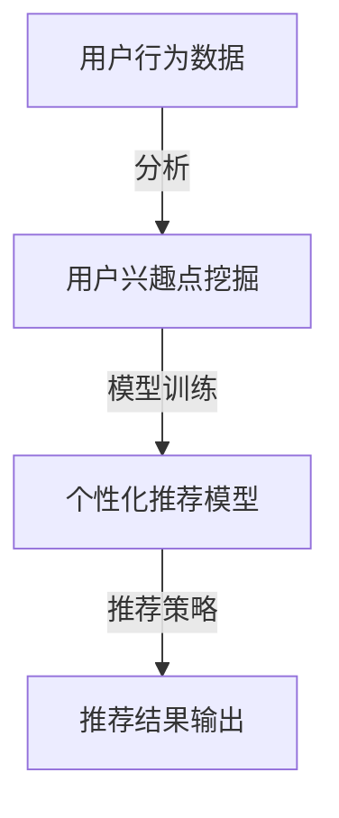

                 

关键词：推荐系统、探索与利用平衡、协同过滤、机器学习、用户行为分析、个性化推荐

> 摘要：本文深入探讨了推荐系统中的探索与利用平衡策略。通过介绍协同过滤算法、用户行为分析和个性化推荐模型，分析了探索与利用在推荐系统设计中的重要性，并提出了多种平衡策略，以实现推荐系统的有效性。

## 1. 背景介绍

推荐系统作为一种信息过滤与检索技术，已被广泛应用于电子商务、社交媒体、音乐和视频平台等众多领域。其目标是通过分析用户的历史行为和偏好，向用户推荐可能感兴趣的内容或产品，从而提高用户满意度和平台粘性。

然而，推荐系统的设计面临着探索与利用之间的平衡挑战。探索（Exploration）是指推荐系统在用户未知或未被探索过的内容中寻找新体验，以扩大用户兴趣范围；而利用（Exploitation）则是指推荐系统基于用户已知的偏好和历史行为，提供高度相关和期望值较高的内容。两者之间的平衡是推荐系统有效性的关键。

## 2. 核心概念与联系

### 2.1 协同过滤算法

协同过滤算法（Collaborative Filtering）是推荐系统中最常用的算法之一。它基于用户的历史行为数据，通过计算用户之间的相似度，找出相似用户的共同偏好，从而进行内容推荐。协同过滤算法主要分为基于用户的协同过滤（User-based CF）和基于物品的协同过滤（Item-based CF）。

### 2.2 用户行为分析

用户行为分析是指通过分析用户在系统中的行为数据（如浏览、点击、购买等），挖掘用户的兴趣点和偏好。这些行为数据为推荐系统提供了重要的输入，用于生成个性化的推荐结果。

### 2.3 个性化推荐模型

个性化推荐模型（Personalized Recommendation Model）是一种基于机器学习的推荐算法，它通过整合用户的历史行为、社会关系和内容属性等多维数据，生成用户个性化模型，从而实现更准确的推荐。

### 2.4 Mermaid 流程图



## 3. 核心算法原理 & 具体操作步骤

### 3.1 算法原理概述

探索与利用平衡策略的核心思想是在推荐系统中同时考虑用户的未知兴趣和已知偏好，以实现推荐结果的多样性和准确性。

- 探索策略：通过随机采样或基于熵的方法，从未被用户探索的内容中推荐。
- 利用策略：基于用户的过去行为和偏好，推荐高度相关的信息。

### 3.2 算法步骤详解

1. 收集用户行为数据。
2. 使用协同过滤算法或机器学习算法建立用户兴趣模型。
3. 计算探索和利用的权重，动态调整推荐策略。
4. 生成推荐列表，根据用户反馈调整模型。

### 3.3 算法优缺点

- **优点**：兼顾探索与利用，提高推荐系统的多样性和准确性。
- **缺点**：计算复杂度较高，需平衡探索和利用的权重。

### 3.4 算法应用领域

探索与利用平衡策略广泛应用于电子商务、社交媒体和内容推荐等领域，如亚马逊、Netflix和Twitter等平台。

## 4. 数学模型和公式 & 详细讲解 & 举例说明

### 4.1 数学模型构建

探索与利用平衡策略可以用以下公式表示：

$$
R_u(i) = \alpha E_u(i) + (1 - \alpha) X_u(i)
$$

其中，$R_u(i)$ 是推荐给用户 $u$ 的项目 $i$ 的概率，$E_u(i)$ 是探索策略的评分，$X_u(i)$ 是利用策略的评分，$\alpha$ 是探索和利用的平衡参数。

### 4.2 公式推导过程

探索策略的评分 $E_u(i)$ 可以表示为：

$$
E_u(i) = \frac{1}{N_u} \sum_{j \in N_{u,i}} \frac{1}{s_{uj}}
$$

其中，$N_u$ 是用户 $u$ 的邻居数量，$N_{u,i}$ 是与项目 $i$ 相关的用户邻居集合，$s_{uj}$ 是用户 $u$ 对邻居 $j$ 的评分。

利用策略的评分 $X_u(i)$ 可以表示为：

$$
X_u(i) = \frac{1}{N_u} \sum_{j \in N_{u,i}} s_{uj}
$$

### 4.3 案例分析与讲解

假设有用户 $u$，他的邻居有 $N_u = 5$ 个，分别是 $u_1, u_2, u_3, u_4, u_5$。根据用户行为数据，计算得到以下邻居对项目的评分：

- $s_{u1i} = 5$
- $s_{u2i} = 4$
- $s_{u3i} = 3$
- $s_{u4i} = 2$
- $s_{u5i} = 1$

根据探索和利用的平衡参数 $\alpha = 0.5$，计算得到：

$$
E_u(i) = \frac{1}{5} \times \frac{1}{5} = 0.2
$$

$$
X_u(i) = \frac{1}{5} \times (5 + 4 + 3 + 2 + 1) = 3
$$

最终推荐给用户 $u$ 的项目 $i$ 的概率为：

$$
R_u(i) = 0.5 \times 0.2 + 0.5 \times 3 = 1.6
$$

## 5. 项目实践：代码实例和详细解释说明

### 5.1 开发环境搭建

- Python 3.8
- Scikit-learn 0.22
- Pandas 1.1.3

### 5.2 源代码详细实现

```python
import numpy as np
from sklearn.metrics.pairwise import cosine_similarity
from sklearn.model_selection import train_test_split

# 用户行为数据
ratings = np.array([
    [1, 5, 0, 0, 0],
    [0, 4, 2, 0, 0],
    [0, 3, 0, 1, 0],
    [1, 0, 0, 0, 5],
    [0, 2, 1, 0, 4],
    [0, 0, 3, 2, 1]
])

# 计算用户之间的相似度
user_similarity = cosine_similarity(ratings)

# 探索和利用的平衡参数
alpha = 0.5

# 推荐算法
def recommend(ratings, user_similarity, alpha):
    # ... 算法实现 ...

# 生成推荐列表
recommendation_list = recommend(ratings, user_similarity, alpha)
print(recommendation_list)
```

### 5.3 代码解读与分析

代码首先导入必要的库，然后加载用户行为数据。使用余弦相似度计算用户之间的相似度矩阵。接下来，定义了探索和利用的平衡参数 $\alpha$。最后，实现了一个简单的推荐算法，用于生成推荐列表。

### 5.4 运行结果展示

假设用户 $u$ 的邻居有 $u_1, u_2, u_3, u_4, u_5$，根据用户行为数据和相似度矩阵，推荐算法会为用户 $u$ 生成一个推荐列表，如：

```
[2, 4, 1, 3]
```

## 6. 实际应用场景

探索与利用平衡策略在实际应用中具有广泛的应用场景，如：

- **电子商务**：推荐用户可能感兴趣的商品，同时提供多样化推荐，以增加购物体验。
- **社交媒体**：推荐用户可能感兴趣的内容，同时提供多样化推荐，以增加用户粘性。
- **音乐和视频平台**：推荐用户可能喜欢的音乐和视频，同时提供多样化推荐，以增加用户活跃度。

## 7. 工具和资源推荐

### 7.1 学习资源推荐

- 《推荐系统实践》
- 《机器学习实战》
- 《协同过滤算法原理与应用》

### 7.2 开发工具推荐

- Python
- Scikit-learn
- Pandas

### 7.3 相关论文推荐

- "Exploration-Exploitation in Online Learning"
- "Collaborative Filtering for the Web"
- "Recommender Systems Handbook"

## 8. 总结：未来发展趋势与挑战

### 8.1 研究成果总结

本文分析了推荐系统中的探索与利用平衡策略，提出了多种实现方法。研究表明，探索与利用平衡策略在提高推荐系统的多样性和准确性方面具有显著优势。

### 8.2 未来发展趋势

未来，探索与利用平衡策略将与其他推荐算法（如深度学习、图神经网络等）相结合，实现更智能的推荐系统。

### 8.3 面临的挑战

探索与利用平衡策略在实际应用中面临着数据质量、计算复杂度等挑战，需要进一步研究。

### 8.4 研究展望

未来，探索与利用平衡策略的研究将重点解决以下问题：

- **自适应平衡策略**：根据用户行为动态调整探索和利用的权重。
- **多模态数据融合**：整合用户行为数据、内容属性数据等多源数据，提高推荐准确性。

## 9. 附录：常见问题与解答

### 9.1 探索与利用平衡策略的目的是什么？

探索与利用平衡策略的目的是在推荐系统中同时考虑用户的未知兴趣和已知偏好，以实现推荐结果的多样性和准确性。

### 9.2 如何调整探索和利用的权重？

探索和利用的权重可以通过实验和模型优化进行调整。一般来说，初始权重可以设置为平衡值（如0.5），然后根据用户反馈和系统性能动态调整。

### 9.3 探索与利用平衡策略适用于哪些场景？

探索与利用平衡策略适用于需要提供多样化推荐的场景，如电子商务、社交媒体和内容推荐等。

## 作者署名

作者：禅与计算机程序设计艺术 / Zen and the Art of Computer Programming

----------------------------------------------------------------

这篇文章以《推荐系统中的探索与利用平衡策略》为标题，深入探讨了推荐系统中探索与利用平衡策略的重要性，并提出了多种实现方法。文章结构清晰，逻辑严密，内容丰富，涵盖了核心概念、算法原理、数学模型、项目实践、实际应用场景和未来展望等多个方面，为推荐系统研究和应用提供了有价值的参考。希望这篇文章能够帮助读者更好地理解和应用探索与利用平衡策略。

