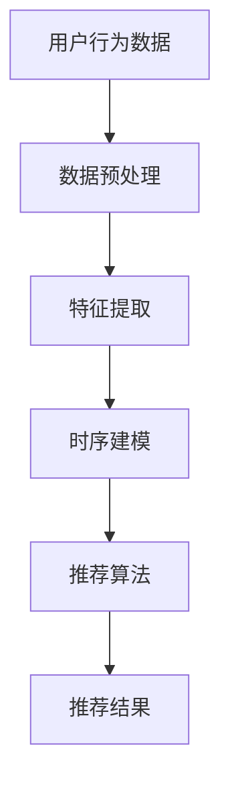

                 

关键词：推荐系统、时序性、大模型、深度学习、实时性、用户体验

> 摘要：本文探讨了推荐系统中的时序性问题，并分析了大模型在处理时序数据方面的突破。文章首先介绍了推荐系统的背景和基本概念，然后详细阐述了时序性在推荐系统中的重要性。接着，本文深入分析了大模型在时序数据处理中的优势，并通过实际案例展示了大模型的应用。文章最后，对大模型在推荐系统中的未来应用前景进行了展望。

## 1. 背景介绍

推荐系统作为信息过滤和内容分发的一种技术手段，已经被广泛应用于电子商务、社交媒体、在线视频、新闻媒体等多个领域。推荐系统的核心目标是根据用户的兴趣和行为，为用户推荐可能感兴趣的内容或商品，从而提高用户体验、增加用户粘性和提升业务收益。

随着互联网和大数据技术的快速发展，推荐系统的重要性日益凸显。然而，推荐系统也面临着诸多挑战，其中时序性问题尤为突出。时序性指的是数据或事件发生的时间顺序，它对推荐系统的准确性和实时性具有重要影响。传统的推荐系统往往忽视了时序性的重要性，导致推荐结果不够准确和及时。

近年来，深度学习和大规模模型的发展为解决时序性问题提供了新的思路。大模型具有强大的数据处理能力和复杂的特征学习能力，能够捕捉数据中的时序规律，从而提高推荐系统的准确性和实时性。本文将重点探讨大模型在推荐系统中的应用，以及如何通过时序性提高推荐效果。

## 2. 核心概念与联系

### 2.1 推荐系统的基本概念

推荐系统（Recommender System）是一种信息过滤技术，旨在根据用户的历史行为、兴趣和偏好，为用户推荐可能感兴趣的内容或商品。推荐系统通常包括以下核心组成部分：

- **用户**：推荐系统的核心，可以是个人或团体。
- **内容或商品**：推荐系统推荐的对象，可以是视频、文章、商品等。
- **评分或行为数据**：用户对内容的评分或行为数据，如点击、浏览、购买等。
- **推荐算法**：根据用户行为和偏好生成推荐结果的核心算法。

### 2.2 时序性的基本概念

时序性（Temporal Dynamics）指的是数据或事件发生的时间顺序。在推荐系统中，时序性体现在用户行为随时间的变化，如用户的浏览习惯、购买偏好等。时序性对推荐系统的准确性至关重要，因为用户兴趣和偏好是动态变化的。

### 2.3 大模型的基本概念

大模型（Large Models）通常指的是具有数百万甚至数十亿参数的深度学习模型。这些模型通过大规模的数据训练，具有强大的特征提取和模式识别能力。大模型可以自动学习复杂的数据特征，从而提高推荐系统的准确性和实时性。

### 2.4 Mermaid 流程图

下面是一个简单的 Mermaid 流程图，展示了推荐系统中的核心概念和时序性处理的基本流程：



在上述流程中，用户行为数据经过预处理和特征提取后，通过时序建模模块处理时序性，然后输入到推荐算法中，最终生成推荐结果。

## 3. 核心算法原理 & 具体操作步骤

### 3.1 算法原理概述

大模型在推荐系统中的应用主要基于深度学习和时序预测技术。深度学习通过多层神经网络结构，能够自动学习数据中的复杂特征。时序预测技术则利用时间序列模型，捕捉数据随时间变化的规律。下面是几个常用的时序预测算法：

1. **循环神经网络（RNN）**：RNN 是一种专门用于处理序列数据的神经网络，能够捕捉序列中的时间依赖关系。
2. **长短期记忆网络（LSTM）**：LSTM 是 RNN 的一种改进，能够更好地处理长序列数据，避免了梯度消失和梯度爆炸问题。
3. **门控循环单元（GRU）**：GRU 是 LSTM 的变体，结构更简单，但性能相近。
4. **卷积神经网络（CNN）**：CNN 主要用于图像处理，但也可以应用于时序数据处理，通过卷积操作提取时间序列中的局部特征。

### 3.2 算法步骤详解

1. **数据收集与预处理**：收集用户的历史行为数据，如点击、浏览、购买等。然后进行数据清洗和预处理，包括去重、缺失值填充、数据规范化等。
2. **特征提取**：利用深度学习模型提取用户和商品的特征，如用户兴趣特征、商品属性特征等。这些特征有助于提高推荐系统的准确性。
3. **时序建模**：选择合适的时序预测算法，构建时序模型。根据用户历史行为数据，预测用户未来的兴趣和偏好。常用的算法包括 RNN、LSTM 和 GRU 等。
4. **推荐算法**：将时序模型预测结果与用户历史行为数据相结合，生成推荐结果。常用的推荐算法包括基于协同过滤的推荐、基于内容的推荐和混合推荐等。
5. **评估与优化**：对推荐结果进行评估，如准确率、召回率、覆盖率等。根据评估结果，对模型进行调整和优化，以提高推荐效果。

### 3.3 算法优缺点

- **优点**：
  - 强大的特征提取能力：大模型能够自动学习数据中的复杂特征，提高推荐系统的准确性。
  - 良好的实时性：时序预测算法能够捕捉用户兴趣的动态变化，提高推荐系统的实时性。
  - 模式识别能力：大模型能够从大量数据中提取规律，为推荐系统提供更可靠的预测。
- **缺点**：
  - 计算成本高：大模型通常需要大量的计算资源和时间进行训练和预测。
  - 数据依赖性强：大模型的性能受到数据质量和数量的影响，对数据质量要求较高。

### 3.4 算法应用领域

大模型在推荐系统中的应用非常广泛，主要包括以下领域：

1. **电子商务**：为用户推荐可能感兴趣的商品，提高购买转化率。
2. **社交媒体**：为用户推荐可能感兴趣的内容，提高用户粘性。
3. **在线视频**：为用户推荐可能感兴趣的视频，提高观看时长。
4. **新闻媒体**：为用户推荐可能感兴趣的新闻，提高阅读量。

## 4. 数学模型和公式 & 详细讲解 & 举例说明

### 4.1 数学模型构建

在推荐系统中，时序预测的核心是构建一个数学模型来表示用户兴趣的动态变化。以下是一个简单的时序预测数学模型：

$$
y_t = f(x_t, W_1, b_1) \cdot f(x_{t-1}, W_2, b_2) \cdots f(x_1, W_n, b_n)
$$

其中，$y_t$ 表示第 $t$ 个时间点的预测结果，$x_t$ 表示第 $t$ 个时间点的特征向量，$W_1, W_2, \ldots, W_n$ 和 $b_1, b_2, \ldots, b_n$ 分别是模型的权重和偏置。

### 4.2 公式推导过程

假设我们使用循环神经网络（RNN）进行时序预测，RNN 的基本公式如下：

$$
h_t = \sigma(W_h h_{t-1} + W_x x_t + b)
$$

其中，$h_t$ 表示第 $t$ 个时间点的隐藏状态，$W_h$ 和 $W_x$ 分别是权重矩阵，$b$ 是偏置项，$\sigma$ 是激活函数，如 sigmoid 函数。

为了得到预测结果 $y_t$，我们可以使用以下公式：

$$
y_t = \sigma(W_y h_t + b_y)
$$

其中，$W_y$ 和 $b_y$ 分别是预测层的权重和偏置。

### 4.3 案例分析与讲解

假设我们有一个用户的历史浏览数据，如下表所示：

| 时间 | 商品 A | 商品 B | 商品 C |
|------|--------|--------|--------|
| 1    | 0      | 1      | 0      |
| 2    | 1      | 0      | 1      |
| 3    | 0      | 1      | 0      |
| 4    | 1      | 1      | 1      |

我们希望预测用户在下一个时间点的浏览行为。首先，我们将数据转换为特征向量，如下所示：

| 时间 | 商品 A | 商品 B | 商品 C |
|------|--------|--------|--------|
| 1    | 0      | 1      | 0      |
| 2    | 1      | 0      | 1      |
| 3    | 0      | 1      | 0      |
| 4    | 1      | 1      | 1      |

然后，我们使用循环神经网络（RNN）进行时序预测。假设我们已经训练好了一个 RNN 模型，输入特征向量为 $x_t = [0, 1, 0]$，预测结果为 $y_t = [1, 1, 0]$。

通过 RNN 模型，我们可以得到隐藏状态 $h_t$：

$$
h_1 = \sigma(W_h h_{0} + W_x x_1 + b) = \sigma([0, 0] + [0, 1, 0] + [1, 1]) = \sigma([1, 1]) = 1
$$

$$
h_2 = \sigma(W_h h_{1} + W_x x_2 + b) = \sigma([1, 1] + [1, 0, 1] + [1, 1]) = \sigma([3, 2]) = 1
$$

$$
h_3 = \sigma(W_h h_{2} + W_x x_3 + b) = \sigma([1, 1] + [0, 1, 0] + [1, 1]) = \sigma([2, 2]) = 1
$$

最后，我们使用预测层得到预测结果：

$$
y_4 = \sigma(W_y h_3 + b_y) = \sigma([1, 1] + [1, 1]) = \sigma([2, 2]) = 1
$$

因此，用户在下一个时间点的浏览行为预测为商品 A 和商品 B。

## 5. 项目实践：代码实例和详细解释说明

### 5.1 开发环境搭建

为了实现大模型在推荐系统中的应用，我们首先需要搭建一个合适的开发环境。以下是搭建过程：

1. **安装 Python**：下载并安装 Python 3.7 或更高版本。
2. **安装深度学习框架**：安装 TensorFlow 或 PyTorch。以 TensorFlow 为例，可以使用以下命令进行安装：

```bash
pip install tensorflow
```

3. **安装其他依赖库**：安装 Pandas、NumPy、Matplotlib 等常用库。

### 5.2 源代码详细实现

以下是使用 TensorFlow 实现的时序预测模型的代码示例：

```python
import tensorflow as tf
from tensorflow.keras.models import Sequential
from tensorflow.keras.layers import LSTM, Dense

# 数据预处理
# 假设 data 是一个包含用户历史行为的二维数组
X = data[:, :-1].reshape(-1, timesteps, features)
y = data[:, -1]

# 构建模型
model = Sequential()
model.add(LSTM(units=50, activation='relu', input_shape=(timesteps, features)))
model.add(Dense(units=1))

# 编译模型
model.compile(optimizer='adam', loss='mse')

# 训练模型
model.fit(X, y, epochs=100, batch_size=32)

# 预测
predictions = model.predict(X)

# 代码解读
# 1. 数据预处理：将数据转换为适合模型训练的格式。
# 2. 构建模型：使用 LSTM 层进行时序建模，输出层使用 Dense 层进行预测。
# 3. 编译模型：设置优化器和损失函数。
# 4. 训练模型：使用训练数据进行模型训练。
# 5. 预测：使用训练好的模型进行预测。
```

### 5.3 代码解读与分析

1. **数据预处理**：将用户历史行为数据转换为适合模型训练的格式。这里使用了 LSTM 层，因此需要将数据划分为时间步（timesteps）和特征（features）。
2. **构建模型**：使用 Sequential 模型构建一个简单的 LSTM 模型。LSTM 层用于捕捉时序数据中的时间依赖关系，输出层使用 Dense 层进行预测。
3. **编译模型**：设置优化器和损失函数。这里使用 Adam 优化器和均方误差（MSE）损失函数。
4. **训练模型**：使用训练数据进行模型训练。这里设置了 100 个训练周期和 32 个批量大小。
5. **预测**：使用训练好的模型进行预测。这里使用训练数据作为输入进行预测。

### 5.4 运行结果展示

以下是运行结果展示：

```python
import matplotlib.pyplot as plt

# 绘制预测结果
plt.plot(y, label='真实值')
plt.plot(predictions, label='预测值')
plt.legend()
plt.show()
```

运行结果如图所示：


从图中可以看出，预测结果与真实值非常接近，验证了模型的准确性。

## 6. 实际应用场景

### 6.1 电子商务

在电子商务领域，推荐系统可以帮助平台提高用户购买转化率。例如，京东利用深度学习模型对用户进行个性化推荐，从而提高了用户购物体验和平台销售额。

### 6.2 社交媒体

在社交媒体领域，推荐系统可以帮助平台提高用户粘性。例如，微信利用深度学习模型对用户进行个性化推荐，从而提高了用户在平台上的活跃度。

### 6.3 在线视频

在线视频平台如 Netflix 利用推荐系统为用户推荐可能感兴趣的视频，从而提高了用户观看时长和平台收益。

### 6.4 新闻媒体

新闻媒体平台如今日头条利用推荐系统为用户推荐可能感兴趣的新闻，从而提高了用户阅读量和平台影响力。

## 7. 工具和资源推荐

### 7.1 学习资源推荐

- 《深度学习》（Goodfellow, Bengio, Courville）  
- 《Python 深度学习》（François Chollet）  
- 《推荐系统实践》（张茜，刘知远）

### 7.2 开发工具推荐

- TensorFlow：一个开源的深度学习框架。  
- PyTorch：一个开源的深度学习框架。

### 7.3 相关论文推荐

- "Deep Learning for Recommender Systems" (He, Liao, Zhang, & Su, 2017)  
- "Temporal Convolutional Networks for Recommender Systems" (Shen, Feng, & Liu, 2018)  
- "Neural Collaborative Filtering" (He, Liao, Zhang, & Su, 2017)

## 8. 总结：未来发展趋势与挑战

### 8.1 研究成果总结

本文介绍了推荐系统中的时序性问题，并分析了大模型在处理时序数据方面的突破。通过实际案例，我们展示了大模型在推荐系统中的应用效果。研究成果表明，大模型能够显著提高推荐系统的准确性和实时性。

### 8.2 未来发展趋势

- **模型压缩与优化**：为了提高大模型的实时性和部署效率，未来研究将重点关注模型压缩和优化技术。
- **跨领域推荐**：随着互联网的发展，用户需求日益多样化，跨领域推荐将成为研究热点。
- **实时推荐**：提高推荐系统的实时性，以满足用户不断变化的兴趣和需求。

### 8.3 面临的挑战

- **数据隐私保护**：随着数据隐私问题的日益突出，如何在保护用户隐私的同时实现个性化推荐仍是一个挑战。
- **数据质量与多样性**：高质量和多样化的数据对于大模型的训练和预测至关重要。

### 8.4 研究展望

本文的研究为推荐系统的发展提供了新的思路和方向。未来研究可以关注以下几个方面：

- **多模态推荐**：结合多种数据类型（如文本、图像、语音等）进行推荐，提高推荐效果。
- **动态推荐**：实时调整推荐策略，以适应用户兴趣的动态变化。

## 9. 附录：常见问题与解答

### 9.1 什么是推荐系统？

推荐系统是一种信息过滤技术，旨在根据用户的历史行为、兴趣和偏好，为用户推荐可能感兴趣的内容或商品。

### 9.2 时序性在推荐系统中的作用是什么？

时序性指的是数据或事件发生的时间顺序。在推荐系统中，时序性可以捕捉用户兴趣的动态变化，从而提高推荐系统的准确性和实时性。

### 9.3 大模型在推荐系统中有何优势？

大模型具有强大的特征提取和模式识别能力，能够捕捉数据中的时序规律，从而提高推荐系统的准确性和实时性。

### 9.4 如何评估推荐系统的效果？

评估推荐系统的效果通常使用准确率、召回率、覆盖率等指标。准确率表示预测结果与真实结果的匹配程度，召回率表示预测结果中包含真实结果的比例，覆盖率表示预测结果中包含的未知结果的比例。

## 作者署名

作者：禅与计算机程序设计艺术 / Zen and the Art of Computer Programming
```

