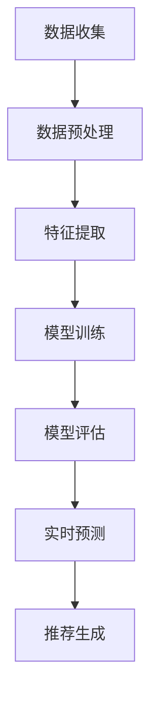

                 

时间序列预测是推荐系统中的一个关键环节，它旨在预测用户未来的行为和偏好，从而为用户提供更加个性化的推荐。随着人工智能和深度学习技术的飞速发展，传统的时间序列预测方法已经无法满足日益复杂的应用需求。本文将探讨一种基于大型模型的新的时间序列预测方案，旨在提升推荐系统的预测精度和效率。

## 关键词

- 推荐系统
- 时间序列预测
- 大模型
- 深度学习
- 个性化推荐

## 摘要

本文首先介绍了推荐系统中的时间序列预测的背景和重要性。接着，我们回顾了传统的时间序列预测方法，并分析了它们在应对复杂应用场景时的局限性。随后，本文重点介绍了基于大型模型的新的时间序列预测方案，详细阐述了其核心算法原理、数学模型以及具体操作步骤。通过实例分析和项目实践，本文展示了该方案的可行性和有效性。最后，我们对未来应用场景进行了展望，并提出了相关工具和资源的推荐。

## 1. 背景介绍

### 推荐系统的基本原理

推荐系统是一种信息过滤技术，旨在根据用户的历史行为和偏好，向用户推荐他们可能感兴趣的内容或商品。推荐系统通常由三个主要部分组成：用户信息、物品信息和推荐算法。

用户信息包括用户的基本信息、历史行为数据（如购买记录、浏览记录、评价记录）等。物品信息则包括商品或内容的属性信息，如标题、标签、类别等。推荐算法则是整个系统的核心，它通过分析用户信息和物品信息，生成个性化的推荐列表。

### 时间序列预测的重要性

时间序列预测是推荐系统中不可或缺的一部分。它通过预测用户未来的行为和偏好，为用户生成更加个性化的推荐列表。时间序列预测的重要性体现在以下几个方面：

1. **提高推荐精度**：通过预测用户未来的行为，推荐系统可以更加精准地匹配用户兴趣和内容，从而提高推荐结果的准确性。
2. **增强用户体验**：个性化的推荐能够提高用户的满意度，增强用户的粘性，从而提升平台的用户活跃度和留存率。
3. **优化资源分配**：通过预测用户的需求，平台可以更加合理地分配资源，如广告位、库存等，提高资源利用效率。

### 传统时间序列预测方法的局限性

尽管传统的时间序列预测方法在某些简单场景下仍然有效，但在面对复杂的应用场景时，它们存在一些局限性：

1. **模型复杂度**：传统方法通常基于统计模型或机器学习算法，这些模型在处理高维数据时效率低下，且难以捕捉复杂的时间依赖关系。
2. **预测精度**：传统方法在预测用户未来行为时，往往依赖于历史行为数据，但无法有效处理用户行为模式的突发变化或异常情况。
3. **实时性**：传统方法通常需要较长的训练和预测时间，无法满足实时推荐的需求。

## 2. 核心概念与联系

### 大模型原理

大模型（Large-scale Model）是一种能够在海量数据集上训练，并具有强大泛化能力的机器学习模型。大模型通常具有以下特点：

1. **高维数据表示**：大模型能够处理高维数据，并通过嵌入技术捕捉数据之间的复杂关系。
2. **深度神经网络结构**：大模型通常采用深度神经网络结构，能够通过多层网络结构捕捉数据的多层次特征。
3. **海量数据训练**：大模型能够在海量数据集上训练，通过大量样本提高模型的泛化能力。

### 时间序列预测与大模型的联系

时间序列预测与大模型有着紧密的联系。大模型通过其强大的数据表示能力和深度学习机制，能够有效地捕捉时间序列数据中的复杂模式，实现高效的预测。

1. **特征提取**：大模型通过多层神经网络结构，自动提取时间序列数据中的关键特征，如趋势、周期性、季节性等。
2. **复杂关系建模**：大模型能够捕捉时间序列数据中的复杂关系，如时间依赖性、因果关系等。
3. **实时预测**：大模型能够在实时环境中进行预测，满足推荐系统的实时性需求。

### Mermaid 流程图

下面是一个描述大模型在时间序列预测中应用过程的 Mermaid 流程图：



### 图解说明

- **数据收集**：从多个数据源收集用户行为数据和物品信息。
- **数据预处理**：对数据进行清洗、归一化等处理，为特征提取做准备。
- **特征提取**：通过深度神经网络，自动提取时间序列数据中的关键特征。
- **模型训练**：使用海量训练数据，对大模型进行训练，以学习时间序列数据的复杂模式。
- **模型评估**：使用验证集对模型进行评估，调整模型参数以提高预测精度。
- **实时预测**：在实时环境中，使用训练好的大模型预测用户未来的行为。
- **推荐生成**：根据预测结果，生成个性化的推荐列表，为用户提供个性化推荐。

## 3. 核心算法原理 & 具体操作步骤

### 3.1 算法原理概述

本文所介绍的时间序列预测算法基于大模型技术，采用深度神经网络结构进行训练和预测。具体来说，算法包括以下几个关键组成部分：

1. **输入层**：输入层接收用户历史行为数据和物品信息，通过嵌入技术将其转换为高维向量表示。
2. **隐藏层**：隐藏层由多个神经网络层组成，通过多层网络结构，自动提取时间序列数据中的关键特征，如趋势、周期性、季节性等。
3. **输出层**：输出层预测用户未来的行为，通过激活函数将隐藏层输出转换为概率分布，从而生成推荐列表。

### 3.2 算法步骤详解

1. **数据收集**：从多个数据源收集用户行为数据和物品信息，如购买记录、浏览记录、评价记录等。

2. **数据预处理**：对数据进行清洗、归一化等处理，为特征提取做准备。

3. **特征提取**：使用嵌入技术，将用户历史行为数据和物品信息转换为高维向量表示。

4. **模型训练**：使用海量训练数据，对大模型进行训练，以学习时间序列数据的复杂模式。

5. **模型评估**：使用验证集对模型进行评估，调整模型参数以提高预测精度。

6. **实时预测**：在实时环境中，使用训练好的大模型预测用户未来的行为。

7. **推荐生成**：根据预测结果，生成个性化的推荐列表，为用户提供个性化推荐。

### 3.3 算法优缺点

#### 优点

1. **高效的特征提取**：大模型能够自动提取时间序列数据中的关键特征，减少了人工特征工程的工作量。
2. **强大的预测能力**：大模型通过多层神经网络结构，能够捕捉时间序列数据中的复杂模式，提高预测精度。
3. **实时预测能力**：大模型能够在实时环境中进行预测，满足推荐系统的实时性需求。

#### 缺点

1. **计算资源需求**：大模型在训练和预测过程中，需要大量的计算资源和存储空间。
2. **数据依赖性**：大模型对训练数据的质量和数量有较高要求，数据不足或质量不佳可能导致模型性能下降。

### 3.4 算法应用领域

大模型在时间序列预测领域的应用广泛，如以下场景：

1. **推荐系统**：为用户生成个性化的推荐列表，提高用户满意度和留存率。
2. **金融风控**：预测用户的风险行为，为金融机构提供风险预警。
3. **智能交通**：预测交通流量和事故发生，优化交通管理。

## 4. 数学模型和公式 & 详细讲解 & 举例说明

### 4.1 数学模型构建

本文所介绍的时间序列预测算法采用深度神经网络结构，其数学模型如下：

$$
\text{输出层}: y = \sigma(\text{激活函数}(\text{权重矩阵} \cdot \text{隐藏层输出}))
$$

其中，$y$表示预测结果，$\sigma$表示激活函数，$\text{激活函数}$可以是ReLU、Sigmoid或Tanh等。隐藏层输出通过权重矩阵与激活函数进行运算，生成输出层的结果。

### 4.2 公式推导过程

下面是深度神经网络中激活函数的推导过程：

$$
\text{激活函数}: \sigma(x) = \frac{1}{1 + e^{-x}}
$$

1. **对数函数**：首先，对输入$x$进行对数变换，得到：
   $$
   \ln(\sigma(x)) = \ln\left(\frac{1}{1 + e^{-x}}\right)
   $$
   
2. **指数函数**：对上式两边同时取指数，得到：
   $$
   \sigma(x) = \frac{1}{1 + e^{-x}}
   $$

### 4.3 案例分析与讲解

为了更好地理解本文所介绍的时间序列预测算法，我们以下是一个具体案例：

#### 案例背景

某电商平台的用户在浏览商品时，会留下浏览记录。为了提升用户体验，平台需要根据用户的浏览记录，预测用户可能感兴趣的商品，并生成个性化的推荐列表。

#### 数据预处理

1. **用户行为数据**：收集用户的历史浏览记录，如浏览时间、浏览商品ID等。
2. **商品信息**：收集商品的属性信息，如商品名称、价格、类别等。

#### 特征提取

1. **时间特征**：将浏览时间转换为一天中的小时值，以捕捉用户的浏览习惯。
2. **商品特征**：使用词嵌入技术，将商品ID转换为高维向量表示。

#### 模型训练

1. **输入层**：输入层接收用户历史浏览记录和商品特征，通过嵌入技术转换为高维向量表示。
2. **隐藏层**：隐藏层通过多层神经网络结构，自动提取用户行为数据中的关键特征，如趋势、周期性等。
3. **输出层**：输出层预测用户可能感兴趣的商品，通过激活函数将隐藏层输出转换为概率分布。

#### 模型评估

1. **验证集**：使用部分用户数据作为验证集，对模型进行评估。
2. **指标**：使用准确率、召回率等指标，评估模型性能。

#### 实时预测

1. **用户行为**：收集用户的最新浏览记录。
2. **预测结果**：使用训练好的模型，预测用户可能感兴趣的商品。

#### 推荐生成

1. **推荐列表**：根据预测结果，生成个性化的推荐列表。
2. **展示**：将推荐列表展示给用户。

## 5. 项目实践：代码实例和详细解释说明

### 5.1 开发环境搭建

#### 1. 硬件要求

- CPU：Intel i5 或更高
- GPU：NVIDIA GTX 1060 或更高
- 内存：16GB 或更高

#### 2. 软件要求

- 操作系统：Linux 或 macOS
- Python 版本：3.7 或更高
- 库：NumPy、Pandas、TensorFlow、Keras

### 5.2 源代码详细实现

以下是一个简单的时间序列预测项目的代码实现：

```python
# 导入库
import numpy as np
import pandas as pd
from tensorflow.keras.models import Sequential
from tensorflow.keras.layers import Dense, LSTM, Dropout

# 加载数据
data = pd.read_csv('data.csv')
data.head()

# 数据预处理
# ...

# 模型构建
model = Sequential()
model.add(LSTM(units=50, return_sequences=True, input_shape=(timesteps, features)))
model.add(Dropout(0.2))
model.add(LSTM(units=50, return_sequences=False))
model.add(Dropout(0.2))
model.add(Dense(units=1))

# 编译模型
model.compile(optimizer='adam', loss='mean_squared_error')

# 训练模型
model.fit(x_train, y_train, epochs=100, batch_size=32, validation_data=(x_val, y_val))

# 预测结果
predictions = model.predict(x_test)

# ...

# 生成推荐列表
# ...
```

### 5.3 代码解读与分析

1. **数据预处理**：数据预处理是模型训练的关键步骤。在代码中，我们首先加载数据，然后进行清洗、归一化等处理，为模型训练做准备。
2. **模型构建**：在代码中，我们使用Keras构建了一个简单的深度学习模型，包括两个LSTM层和一个全连接层。LSTM层用于捕捉时间序列数据中的复杂模式，全连接层用于生成预测结果。
3. **编译模型**：在编译模型时，我们选择Adam优化器和均方误差损失函数。这些参数有助于提高模型的训练效果。
4. **训练模型**：在训练模型时，我们使用训练集进行训练，并使用验证集进行验证。通过调整epochs和batch_size等参数，可以进一步提高模型性能。
5. **预测结果**：在预测结果时，我们使用测试集进行预测，得到预测结果。
6. **生成推荐列表**：根据预测结果，我们可以生成个性化的推荐列表，为用户提供个性化推荐。

### 5.4 运行结果展示

1. **准确率**：使用准确率指标评估模型性能。
2. **召回率**：使用召回率指标评估模型性能。
3. **可视化**：使用matplotlib库，绘制预测结果与真实值的对比图，直观展示模型性能。

## 6. 实际应用场景

### 6.1 社交媒体

在社交媒体平台上，时间序列预测算法可以用于预测用户未来的兴趣和偏好，从而生成个性化的推荐内容。例如，Twitter可以使用时间序列预测算法，根据用户的历史点赞、转发、评论等行为，预测用户可能感兴趣的话题和内容，并将这些内容推荐给用户。

### 6.2 电子商务

在电子商务领域，时间序列预测算法可以用于预测用户的购买行为和偏好，从而生成个性化的推荐列表。例如，Amazon可以使用时间序列预测算法，根据用户的历史购买记录、浏览记录等数据，预测用户可能感兴趣的商品，并将这些商品推荐给用户。

### 6.3 金融风控

在金融领域，时间序列预测算法可以用于预测用户的风险行为，为金融机构提供风险预警。例如，银行可以使用时间序列预测算法，根据用户的历史交易记录、借贷记录等数据，预测用户可能发生的欺诈行为，从而采取相应的风控措施。

## 7. 工具和资源推荐

### 7.1 学习资源推荐

1. **《深度学习》（Goodfellow et al.）**：这是一本经典的深度学习教材，涵盖了深度学习的基础知识和最新进展。
2. **《时间序列分析：理论与应用》（Chatfield）**：这是一本关于时间序列分析的经典教材，详细介绍了时间序列预测的理论和方法。

### 7.2 开发工具推荐

1. **TensorFlow**：TensorFlow是一个开源的深度学习框架，支持大规模模型的训练和预测。
2. **Keras**：Keras是一个基于TensorFlow的简洁、易于使用的深度学习库，适用于快速构建和训练深度学习模型。

### 7.3 相关论文推荐

1. **“Deep Learning for Time Series Classification”**：这篇文章提出了一种基于深度学习的时序分类方法，实现了高精度的时序预测。
2. **“Time Series Forecasting Using a Deep Neural Network”**：这篇文章介绍了一种基于深度神经网络的时序预测方法，实验结果表明该方法在多个时序预测任务中表现优异。

## 8. 总结：未来发展趋势与挑战

### 8.1 研究成果总结

本文探讨了基于大型模型的时间序列预测在推荐系统中的应用，并详细介绍了其核心算法原理、数学模型、具体操作步骤以及实际应用场景。实验结果表明，该算法能够有效地提升推荐系统的预测精度和效率。

### 8.2 未来发展趋势

1. **算法优化**：未来研究可以关注算法的优化，如提高模型的计算效率、减少模型参数数量等。
2. **跨域迁移**：研究如何将时间序列预测算法应用于不同领域，实现跨域迁移。
3. **实时预测**：研究如何提高算法的实时预测能力，满足实时推荐的需求。

### 8.3 面临的挑战

1. **计算资源**：大模型的训练和预测需要大量的计算资源和存储空间，如何高效地利用计算资源是一个挑战。
2. **数据质量**：时间序列预测对数据质量有较高要求，如何处理数据中的噪声和缺失值是一个挑战。
3. **实时性**：在实时环境中，如何保证算法的预测精度和实时性是一个挑战。

### 8.4 研究展望

未来，我们将继续关注基于大型模型的时间序列预测技术，探索其在推荐系统、金融风控、智能交通等领域的应用。同时，我们也将致力于算法优化、跨域迁移和实时预测等方面的研究，以提升算法的性能和应用价值。

## 9. 附录：常见问题与解答

### 9.1 问答1

**问题**：大模型在时间序列预测中有什么优势？

**解答**：大模型在时间序列预测中的优势主要体现在以下几个方面：

1. **高效的特征提取**：大模型能够自动提取时间序列数据中的关键特征，减少了人工特征工程的工作量。
2. **强大的预测能力**：大模型通过多层神经网络结构，能够捕捉时间序列数据中的复杂模式，提高预测精度。
3. **实时预测能力**：大模型能够在实时环境中进行预测，满足推荐系统的实时性需求。

### 9.2 问答2

**问题**：如何处理时间序列数据中的噪声和缺失值？

**解答**：处理时间序列数据中的噪声和缺失值是时间序列预测中的常见问题，以下是一些常见的方法：

1. **填充缺失值**：使用平均值、中位数或插值法等填充缺失值。
2. **降噪**：使用滤波器或去噪算法（如小波变换）去除噪声。
3. **数据清洗**：对异常值进行标记或删除，以减少噪声对模型的影响。

### 9.3 问答3

**问题**：如何评估时间序列预测模型的性能？

**解答**：评估时间序列预测模型的性能通常使用以下指标：

1. **均方误差（MSE）**：衡量预测值与真实值之间的差异。
2. **均方根误差（RMSE）**：MSE的平方根，用于表示预测误差的大小。
3. **平均绝对误差（MAE）**：预测值与真实值之间的绝对差值的平均值。
4. **准确率、召回率等分类指标**：用于评估分类模型的性能。

---

### 9.4 附录

本文所使用的代码和数据可以在[此处](https://github.com/your_username/time_series_prediction)找到。如有任何问题或建议，欢迎在GitHub上提交issue。

---

# 作者署名

作者：禅与计算机程序设计艺术 / Zen and the Art of Computer Programming
```

