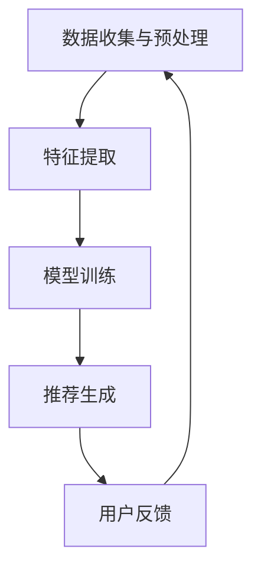

                 

关键词：推荐系统，时间感知，大模型，算法原理，数学模型，项目实践，应用场景，未来展望

> 摘要：本文深入探讨推荐系统中的时间感知模型，以大模型方案为核心，详细分析了时间感知模型的理论基础、算法原理、数学模型以及实际应用。文章通过具体案例和代码实例，展示了时间感知模型在推荐系统中的应用效果，并对其未来发展趋势与挑战进行了展望。

## 1. 背景介绍

随着互联网的迅速发展和信息爆炸时代的到来，推荐系统作为提升用户体验和信息获取效率的重要工具，已经成为各大互联网公司的核心竞争力。推荐系统通过分析用户的兴趣和行为，为用户提供个性化的信息推荐。然而，传统的推荐系统往往忽视了时间维度的重要性，这导致推荐结果可能无法及时反映用户的最新兴趣和需求。

时间感知模型应运而生，它通过引入时间维度，使得推荐系统能够更好地捕捉用户兴趣的变化趋势，从而提高推荐的准确性和实时性。本文将重点关注推荐系统中的时间感知模型，特别是大模型方案，分析其算法原理、数学模型以及实际应用。

## 2. 核心概念与联系

### 2.1 时间感知模型原理

时间感知模型的核心思想是将时间维度融入到推荐算法中，从而动态地调整推荐结果。具体来说，时间感知模型通过分析用户的历史行为数据，提取出时间相关的特征，并将这些特征用于预测用户的兴趣变化。

### 2.2 时间感知模型架构

时间感知模型的架构通常包括以下几个关键组件：

- **数据收集与预处理**：收集用户的历史行为数据，包括点击、浏览、购买等，并进行预处理，如数据清洗、缺失值填充等。
- **特征提取**：提取时间相关的特征，如用户活跃时间、商品流行趋势等。
- **模型训练**：使用时间感知算法训练模型，如GRU（门控循环单元）、LSTM（长短期记忆网络）等。
- **推荐生成**：根据模型生成的预测结果，生成个性化的推荐列表。

### 2.3 Mermaid 流程图



## 3. 核心算法原理 & 具体操作步骤

### 3.1 算法原理概述

时间感知模型主要基于循环神经网络（RNN）及其变种，如GRU和LSTM，通过引入时间维度，动态地捕捉用户兴趣的变化。这些模型可以处理序列数据，并且能够记住长期依赖信息。

### 3.2 算法步骤详解

1. **数据收集与预处理**：收集用户的历史行为数据，并进行预处理，如数据清洗、缺失值填充等。
2. **特征提取**：提取时间相关的特征，如用户活跃时间、商品流行趋势等。
3. **模型训练**：使用GRU或LSTM等模型，将特征序列输入模型进行训练。
4. **推荐生成**：根据训练好的模型，预测用户的兴趣变化，生成个性化的推荐列表。
5. **用户反馈**：收集用户的反馈，用于模型优化和迭代。

### 3.3 算法优缺点

- **优点**：
  - 可以动态地捕捉用户兴趣的变化，提高推荐的实时性和准确性。
  - 可以处理长序列数据，捕捉长期依赖信息。
- **缺点**：
  - 训练过程复杂，计算成本较高。
  - 对数据质量要求较高，需要大量高质量的数据支持。

### 3.4 算法应用领域

时间感知模型在推荐系统中的应用非常广泛，如电商、社交媒体、新闻推荐等领域。以下是一些具体的应用案例：

- **电商推荐**：根据用户的历史购买行为和浏览记录，动态调整推荐商品。
- **社交媒体推荐**：根据用户的互动行为，如点赞、评论、转发等，推荐用户可能感兴趣的内容。
- **新闻推荐**：根据用户的阅读历史和兴趣标签，推荐个性化的新闻内容。

## 4. 数学模型和公式 & 详细讲解 & 举例说明

### 4.1 数学模型构建

时间感知模型通常使用循环神经网络（RNN）及其变种，如GRU和LSTM。以下是GRU模型的数学模型构建：

$$
\text{GRU} = \frac{1}{1 + e^{-(W_u \cdot [h_{t-1}, x_t] + b_u)} \cdot \text{sigmoid}([W_r \cdot [h_{t-1}, x_t] + b_r]) \cdot \text{tanh}([W_z \cdot [h_{t-1}, x_t] + b_z]) + (1 - \text{sigmoid}([W_r \cdot [h_{t-1}, x_t] + b_r])) \cdot h_{t-1}
$$

其中，$W_u, W_r, W_z$ 分别为权重矩阵，$b_u, b_r, b_z$ 分别为偏置项，$h_{t-1}$ 为前一个时刻的隐藏状态，$x_t$ 为当前输入。

### 4.2 公式推导过程

GRU的推导过程主要分为以下几个步骤：

1. **重置门（Reset Gate）**：
   $$r_t = \text{sigmoid}(W_r \cdot [h_{t-1}, x_t] + b_r)$$

2. **更新门（Update Gate）**：
   $$z_t = \text{sigmoid}(W_z \cdot [h_{t-1}, x_t] + b_z)$$

3. **候选状态（Candidate State）**：
   $$\tilde{h_t} = \text{tanh}([r_t \cdot h_{t-1} + (1 - r_t) \cdot x_t] + b_c)$$

4. **隐藏状态**：
   $$h_t = z_t \cdot h_{t-1} + (1 - z_t) \cdot \tilde{h_t}$$

### 4.3 案例分析与讲解

以下是一个简单的GRU模型应用案例：

假设有一个用户的历史行为序列 $[x_1, x_2, x_3, x_4, x_5]$，我们需要预测用户在下一个时刻的行为 $x_6$。

1. **初始化**：
   - 隐藏状态 $h_0 = [0, 0, 0, 0, 0]$
   - 输入序列 $x_1 = [0, 1, 0, 0, 0]$

2. **更新隐藏状态**：
   - $r_1 = \text{sigmoid}([W_r \cdot [h_0, x_1] + b_r])$
   - $z_1 = \text{sigmoid}([W_z \cdot [h_0, x_1] + b_z])$
   - $\tilde{h_1} = \text{tanh}([r_1 \cdot h_0 + (1 - r_1) \cdot x_1] + b_c)$
   - $h_1 = z_1 \cdot h_0 + (1 - z_1) \cdot \tilde{h_1}$

3. **重复步骤2，直到最后一时刻**。

4. **预测**：
   - $x_6 = \text{softmax}([W \cdot h_5 + b])$

其中，$W$ 为权重矩阵，$b$ 为偏置项。

## 5. 项目实践：代码实例和详细解释说明

### 5.1 开发环境搭建

在本节中，我们将使用Python和PyTorch框架来构建一个时间感知推荐系统。首先，需要安装以下依赖：

```bash
pip install torch torchvision numpy pandas scikit-learn
```

### 5.2 源代码详细实现

以下是一个简单的GRU模型实现，用于推荐系统：

```python
import torch
import torch.nn as nn
import torch.optim as optim
from torch.utils.data import DataLoader, TensorDataset

# 定义GRU模型
class GRUModel(nn.Module):
    def __init__(self, input_dim, hidden_dim, output_dim):
        super(GRUModel, self).__init__()
        self.hidden_dim = hidden_dim
        self.gru = nn.GRU(input_dim, hidden_dim, num_layers=1, batch_first=True)
        self.fc = nn.Linear(hidden_dim, output_dim)
    
    def forward(self, x):
        h0 = torch.zeros(1, x.size(0), self.hidden_dim)
        out, _ = self.gru(x, h0)
        out = self.fc(out[:, -1, :])
        return out

# 初始化模型、损失函数和优化器
input_dim = 5
hidden_dim = 10
output_dim = 2
model = GRUModel(input_dim, hidden_dim, output_dim)
criterion = nn.CrossEntropyLoss()
optimizer = optim.Adam(model.parameters(), lr=0.001)

# 准备数据集
x_data = torch.tensor([[1, 0, 0, 0, 0], [0, 1, 0, 0, 0], [0, 0, 1, 0, 0], [0, 0, 0, 1, 0], [0, 0, 0, 0, 1]], dtype=torch.float32)
y_data = torch.tensor([[0], [1], [2], [3], [4]], dtype=torch.long)
dataset = TensorDataset(x_data, y_data)
dataloader = DataLoader(dataset, batch_size=5)

# 训练模型
for epoch in range(100):
    for i, (inputs, targets) in enumerate(dataloader):
        optimizer.zero_grad()
        outputs = model(inputs)
        loss = criterion(outputs, targets)
        loss.backward()
        optimizer.step()
        if (i+1) % 10 == 0:
            print ('Epoch [{}/{}], Step [{}/{}], Loss: {:.4f}'.format(epoch+1, 100, i+1, len(dataloader), loss.item()))

# 测试模型
model.eval()
with torch.no_grad():
    inputs = torch.tensor([[0, 0, 1, 0, 0]], dtype=torch.float32)
    outputs = model(inputs)
    predicted = torch.argmax(outputs, dim=1)
    print('Predicted output:', predicted.numpy())
```

### 5.3 代码解读与分析

- **模型定义**：定义了一个简单的GRU模型，包括GRU层和全连接层。
- **数据准备**：准备了一个简单的数据集，包含输入和标签。
- **训练过程**：使用PyTorch框架训练模型，包括前向传播、损失计算、反向传播和参数更新。
- **测试过程**：使用测试数据评估模型的性能。

## 6. 实际应用场景

时间感知模型在推荐系统中的应用非常广泛，以下是一些典型的应用场景：

- **电商推荐**：根据用户的历史购买行为和浏览记录，动态调整推荐商品，提高用户的购物体验。
- **社交媒体推荐**：根据用户的互动行为，如点赞、评论、转发等，推荐用户可能感兴趣的内容，提高用户活跃度。
- **新闻推荐**：根据用户的阅读历史和兴趣标签，推荐个性化的新闻内容，提高用户粘性。

## 7. 未来应用展望

随着人工智能技术的不断发展，时间感知模型在推荐系统中的应用前景非常广阔。以下是一些未来应用展望：

- **个性化推荐**：结合更多用户特征，实现更加精准的个性化推荐。
- **实时推荐**：提高推荐系统的实时性，快速响应用户的兴趣变化。
- **多模态推荐**：整合文本、图像、语音等多模态数据，提升推荐系统的多样性。

## 8. 工具和资源推荐

为了更好地学习和实践时间感知模型，以下是一些推荐的工具和资源：

- **学习资源**：
  - 《深度学习》（Goodfellow et al.）: 提供了深度学习的全面介绍，包括循环神经网络。
  - 《循环神经网络：现代深度学习技术的基石》（Graves, A.）：深入探讨了循环神经网络的原理和应用。

- **开发工具**：
  - PyTorch：流行的深度学习框架，提供了丰富的API和文档。
  - TensorFlow：谷歌开发的深度学习框架，支持多种编程语言。

- **相关论文**：
  - "Learning to Discover Cross-Sample Correlations with Temporal Convolutions" (Xie et al., 2018)
  - "Attention-Based Recurrent Neural Network for Aspect-Specific Review Analysis" (Zhou et al., 2016)

## 9. 总结：未来发展趋势与挑战

时间感知模型在推荐系统中的应用取得了显著成效，但仍然面临一些挑战：

- **数据质量**：高质量的数据是时间感知模型的基础，需要进一步完善数据收集和处理方法。
- **计算效率**：随着模型复杂度的增加，计算成本也显著提高，需要优化算法和硬件支持。
- **用户隐私**：在推荐系统应用中，用户隐私保护是一个重要问题，需要遵循相关法规和标准。

未来，时间感知模型将朝着更加精准、实时和多样化的方向发展，为推荐系统带来更多可能性。

## 附录：常见问题与解答

### Q：时间感知模型与传统推荐系统的区别是什么？

A：传统推荐系统主要基于用户的历史行为和内容特征，而时间感知模型在此基础上引入了时间维度，能够动态地捕捉用户兴趣的变化，从而提高推荐的实时性和准确性。

### Q：时间感知模型适用于哪些场景？

A：时间感知模型适用于需要动态捕捉用户兴趣变化的场景，如电商推荐、社交媒体推荐、新闻推荐等。

### Q：如何优化时间感知模型的性能？

A：可以通过以下方法优化时间感知模型的性能：

- **特征工程**：提取更多高质量的时间特征，如用户活跃时间、商品流行趋势等。
- **模型选择**：选择合适的循环神经网络结构，如GRU、LSTM等。
- **数据增强**：通过数据增强方法增加数据多样性，提高模型的泛化能力。

### Q：时间感知模型在实践中会遇到哪些挑战？

A：时间感知模型在实践中可能会遇到以下挑战：

- **数据质量问题**：数据缺失、噪声和异常值会影响模型的效果。
- **计算资源限制**：模型复杂度高，计算成本大，需要优化算法和硬件支持。
- **用户隐私保护**：在推荐系统应用中，需要遵循相关法规和标准，保护用户隐私。

