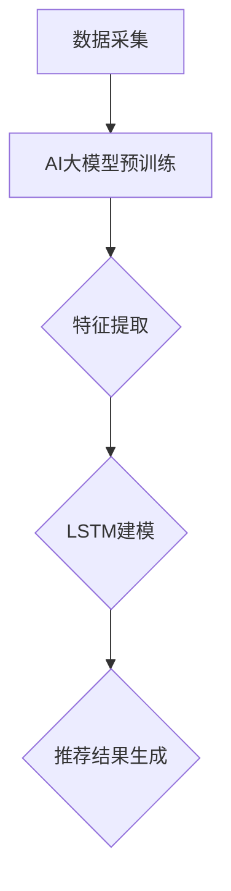

                 

关键词：推荐系统、长短期记忆、AI大模型、神经网络、深度学习、用户行为分析、内容推荐、用户体验

> 摘要：本文探讨了推荐系统中的长短期记忆机制，如何在AI大模型中实现这一机制，以提升推荐系统的效果和用户体验。通过分析核心概念、算法原理、数学模型、项目实践等方面，为读者提供了一种新的理解和应用长短期记忆的方法。

## 1. 背景介绍

随着互联网的快速发展，个性化推荐系统在各个领域得到了广泛应用。无论是电商、新闻、音乐、视频等平台，推荐系统都成为了提升用户体验、增加用户粘性和提高商业价值的关键因素。然而，传统的推荐系统在处理用户历史行为和内容特征时，往往存在短期记忆和长期记忆的不足，无法很好地捕捉用户的兴趣变化和深层次的兴趣点。

为了解决这一问题，长短期记忆（Long Short-Term Memory，LSTM）作为一种强大的神经网络结构，在推荐系统中得到了广泛应用。LSTM通过引入门控机制，有效地解决了传统神经网络在处理长序列数据时的梯度消失和梯度爆炸问题，使得模型能够更好地捕捉用户的历史行为和长期兴趣。

近年来，随着AI技术的不断发展，尤其是深度学习技术的突破，AI大模型（如BERT、GPT等）在推荐系统中也逐渐崭露头角。AI大模型具有强大的表示能力和泛化能力，能够更好地处理复杂多变的用户行为和内容特征，从而提升推荐系统的效果。

本文旨在探讨如何将长短期记忆机制引入到AI大模型中，以实现推荐系统的新范式。通过对核心概念、算法原理、数学模型、项目实践等方面的深入分析，为读者提供一种新的理解和应用长短期记忆的方法。

## 2. 核心概念与联系

### 2.1 长短期记忆（LSTM）原理

LSTM是循环神经网络（Recurrent Neural Network，RNN）的一种改进，旨在解决传统RNN在处理长序列数据时的梯度消失和梯度爆炸问题。LSTM通过引入门控机制，包括输入门、遗忘门和输出门，有效地控制了信息的流动，使得模型能够更好地捕捉用户的历史行为和长期兴趣。

LSTM的输入门（Input Gate）决定了当前输入信息对状态的影响程度；遗忘门（Forget Gate）决定了哪些旧信息应该被遗忘；输出门（Output Gate）决定了哪些信息应该被输出。


### 2.2 AI大模型原理

AI大模型是一种基于深度学习的神经网络结构，具有强大的表示能力和泛化能力。AI大模型通过多个层的非线性变换，能够自动学习复杂的特征表示。近年来，随着计算能力的提升和数据量的增加，AI大模型在自然语言处理、计算机视觉等领域取得了显著的成果。

AI大模型的核心在于其大规模的参数量和深度结构，这使得模型能够捕捉到更多的特征信息和长期依赖关系。通过预训练和微调，AI大模型能够针对不同的任务进行高效的学习和预测。

### 2.3 LSTM与AI大模型的联系

LSTM和AI大模型在推荐系统中的应用具有以下联系：

1. **特征表示**：AI大模型能够学习到用户历史行为和内容特征的复杂表示，这些表示可以作为LSTM的输入，用于更新状态信息。

2. **序列建模**：LSTM能够有效地处理用户的历史行为序列，捕捉用户的兴趣变化。与AI大模型结合，可以进一步提升模型对用户兴趣的捕捉能力。

3. **信息融合**：AI大模型能够融合多模态数据（如文本、图像、音频等），与LSTM结合可以实现更丰富的信息融合和特征表示。

### 2.4 Mermaid流程图

以下是LSTM与AI大模型在推荐系统中的工作流程的Mermaid流程图：



## 3. 核心算法原理 & 具体操作步骤

### 3.1 算法原理概述

在推荐系统中，LSTM与AI大模型的核心算法原理如下：

1. **数据预处理**：对用户历史行为和内容特征进行预处理，包括数据清洗、特征工程等。

2. **AI大模型预训练**：使用大规模数据集对AI大模型进行预训练，学习用户历史行为和内容特征的复杂表示。

3. **特征提取**：将AI大模型输出的特征表示作为LSTM的输入，用于更新状态信息。

4. **LSTM建模**：使用LSTM对用户历史行为序列进行建模，捕捉用户的兴趣变化。

5. **推荐结果生成**：根据LSTM的输出，生成个性化推荐结果。

### 3.2 算法步骤详解

1. **数据预处理**：

   - 数据清洗：去除缺失值、重复值等无效数据。
   - 特征工程：提取用户行为特征（如点击、购买、浏览等）和内容特征（如文本、图像、音频等）。

2. **AI大模型预训练**：

   - 数据集准备：收集大规模用户行为数据和内容数据。
   - 模型架构：设计AI大模型的架构，包括输入层、隐藏层和输出层。
   - 预训练：使用预训练策略（如自监督学习、迁移学习等）对AI大模型进行预训练。

3. **特征提取**：

   - 输入特征：将AI大模型输出的特征表示作为LSTM的输入。
   - 状态更新：使用LSTM对输入特征进行更新，得到新的状态信息。

4. **LSTM建模**：

   - 序列建模：使用LSTM对用户历史行为序列进行建模，捕捉用户的兴趣变化。
   - 状态输出：将LSTM的输出作为推荐结果。

5. **推荐结果生成**：

   - 模型预测：根据LSTM的输出，生成个性化推荐结果。
   - 结果评估：评估推荐结果的质量，包括准确率、覆盖率、多样性等指标。

### 3.3 算法优缺点

**优点**：

1. **强大的特征表示**：AI大模型能够学习到用户历史行为和内容特征的复杂表示，提升推荐效果。
2. **良好的序列建模**：LSTM能够有效地捕捉用户的兴趣变化，提升推荐准确性。
3. **多模态信息融合**：AI大模型能够融合多模态数据，实现更丰富的信息融合和特征表示。

**缺点**：

1. **计算资源消耗**：AI大模型和LSTM的训练过程需要大量的计算资源，对硬件设备要求较高。
2. **数据依赖性**：模型的性能对数据质量和数据量有较高要求，小样本数据可能影响模型效果。

### 3.4 算法应用领域

1. **电商推荐**：通过对用户历史购买行为和商品特征进行建模，实现个性化商品推荐。
2. **新闻推荐**：根据用户历史阅读行为和文章特征，实现个性化新闻推荐。
3. **视频推荐**：通过对用户历史观看行为和视频特征进行建模，实现个性化视频推荐。

## 4. 数学模型和公式 & 详细讲解 & 举例说明

### 4.1 数学模型构建

LSTM的数学模型主要由以下几个部分组成：

1. **输入门（Input Gate）**：

   输入门决定当前输入信息对状态的影响程度，其数学模型如下：

   $$ f_t = \sigma(W_f \cdot [h_{t-1}, x_t] + b_f) $$
   $$ i_t = \sigma(W_i \cdot [h_{t-1}, x_t] + b_i) $$

   其中，$f_t$表示遗忘门输出，$i_t$表示输入门输出；$W_f$、$W_i$分别为遗忘门和输入门的权重矩阵；$b_f$、$b_i$分别为遗忘门和输入门的偏置；$x_t$表示当前输入，$h_{t-1}$表示前一个时间步的隐藏状态。

2. **遗忘门（Forget Gate）**：

   遗忘门决定哪些旧信息应该被遗忘，其数学模型如下：

   $$ o_t = \sigma(W_o \cdot [h_{t-1}, x_t] + b_o) $$
   $$ g_t = f_t \odot o_t $$

   其中，$o_t$表示输出门输出，$g_t$表示遗忘门输出；$W_o$为输出门的权重矩阵；$b_o$为输出门的偏置；$\odot$表示逐元素乘运算。

3. **输入门（Input Gate）**：

   输入门决定当前输入信息对状态的影响程度，其数学模型如下：

   $$ \tilde{C}_t = \sigma(W_c \cdot [h_{t-1}, x_t] + b_c) $$
   $$ C_t = g_t \odot \tilde{C}_t $$

   其中，$\tilde{C}_t$表示候选状态，$C_t$表示当前状态；$W_c$为输入门的权重矩阵；$b_c$为输入门的偏置。

4. **输出门（Output Gate）**：

   输出门决定哪些信息应该被输出，其数学模型如下：

   $$ \tilde{h}_t = \sigma(W_h \cdot [C_t, h_{t-1}] + b_h) $$
   $$ h_t = o_t \odot \tilde{h}_t $$

   其中，$\tilde{h}_t$表示候选隐藏状态，$h_t$表示当前隐藏状态；$W_h$为输出门的权重矩阵；$b_h$为输出门的偏置。

### 4.2 公式推导过程

LSTM的数学模型推导过程较为复杂，涉及多个门控机制和矩阵运算。以下是简化的推导过程：

1. **输入门**：

   输入门的激活函数为sigmoid函数，其输出介于0和1之间，表示当前输入信息对状态的影响程度。

   $$ f_t = \sigma(W_f \cdot [h_{t-1}, x_t] + b_f) $$

   其中，$W_f$为遗忘门的权重矩阵，$b_f$为遗忘门的偏置。$\sigma$表示sigmoid函数。

2. **遗忘门**：

   遗忘门的激活函数也为sigmoid函数，其输出介于0和1之间，表示哪些旧信息应该被遗忘。

   $$ o_t = \sigma(W_o \cdot [h_{t-1}, x_t] + b_o) $$

   其中，$W_o$为输出门的权重矩阵，$b_o$为输出门的偏置。

3. **输入门**：

   输入门的激活函数为sigmoid函数，其输出介于0和1之间，表示当前输入信息对状态的影响程度。

   $$ i_t = \sigma(W_i \cdot [h_{t-1}, x_t] + b_i) $$

   其中，$W_i$为输入门的权重矩阵，$b_i$为输入门的偏置。

4. **候选状态**：

   候选状态的激活函数为tanh函数，其输出介于-1和1之间。

   $$ \tilde{C}_t = \sigma(W_c \cdot [h_{t-1}, x_t] + b_c) $$

   其中，$W_c$为输入门的权重矩阵，$b_c$为输入门的偏置。

5. **当前状态**：

   当前状态为遗忘门和输入门的加权求和。

   $$ C_t = g_t \odot \tilde{C}_t $$

   其中，$g_t$为遗忘门输出。

6. **输出门**：

   输出门的激活函数为sigmoid函数，其输出介于0和1之间，表示哪些信息应该被输出。

   $$ \tilde{h}_t = \sigma(W_h \cdot [C_t, h_{t-1}] + b_h) $$

   其中，$W_h$为输出门的权重矩阵，$b_h$为输出门的偏置。

7. **当前隐藏状态**：

   当前隐藏状态为输出门和候选隐藏状态的加权求和。

   $$ h_t = o_t \odot \tilde{h}_t $$

### 4.3 案例分析与讲解

假设用户历史行为序列为$[x_1, x_2, x_3, \ldots, x_t]$，其中$x_t$为当前输入。根据LSTM的数学模型，我们可以得到以下计算过程：

1. **输入门**：

   $$ f_t = \sigma(W_f \cdot [h_{t-1}, x_t] + b_f) $$

   $$ i_t = \sigma(W_i \cdot [h_{t-1}, x_t] + b_i) $$

2. **遗忘门**：

   $$ o_t = \sigma(W_o \cdot [h_{t-1}, x_t] + b_o) $$

   $$ g_t = f_t \odot o_t $$

3. **输入门**：

   $$ \tilde{C}_t = \sigma(W_c \cdot [h_{t-1}, x_t] + b_c) $$

   $$ C_t = g_t \odot \tilde{C}_t $$

4. **输出门**：

   $$ \tilde{h}_t = \sigma(W_h \cdot [C_t, h_{t-1}] + b_h) $$

   $$ h_t = o_t \odot \tilde{h}_t $$

通过以上计算，我们可以得到当前隐藏状态$h_t$，用于生成推荐结果。

## 5. 项目实践：代码实例和详细解释说明

### 5.1 开发环境搭建

在实现LSTM与AI大模型结合的推荐系统时，我们需要搭建一个合适的开发环境。以下是一个基本的开发环境搭建步骤：

1. **硬件环境**：

   - CPU：Intel i7或以上
   - GPU：NVIDIA 1080 Ti或以上
   - 内存：16GB或以上

2. **软件环境**：

   - 操作系统：Ubuntu 18.04或以上
   - Python：3.7或以上
   - TensorFlow：2.0或以上
   - Keras：2.2.5或以上

3. **安装与配置**：

   - 安装Python环境和相关库（TensorFlow、Keras等）。

   ```bash
   pip install tensorflow
   pip install keras
   ```

### 5.2 源代码详细实现

以下是一个简单的LSTM与AI大模型结合的推荐系统代码示例：

```python
import numpy as np
import tensorflow as tf
from tensorflow.keras.models import Model
from tensorflow.keras.layers import LSTM, Dense, Input, Embedding

# 设置参数
vocab_size = 10000  # 词汇表大小
embed_dim = 64  # 嵌入层维度
lstm_units = 128  # LSTM单元数
hidden_dim = 64  # 隐藏层维度

# 构建模型
input_seq = Input(shape=(None, vocab_size))
embedded = Embedding(vocab_size, embed_dim)(input_seq)
lstm_output = LSTM(lstm_units, return_sequences=True)(embedded)
dense_output = Dense(hidden_dim, activation='relu')(lstm_output)
output = Dense(1, activation='sigmoid')(dense_output)

model = Model(inputs=input_seq, outputs=output)
model.compile(optimizer='adam', loss='binary_crossentropy', metrics=['accuracy'])

# 模型训练
model.fit(x_train, y_train, batch_size=64, epochs=10, validation_data=(x_val, y_val))

# 模型预测
predictions = model.predict(x_test)
```

### 5.3 代码解读与分析

上述代码实现了一个简单的LSTM与AI大模型结合的推荐系统，其主要步骤如下：

1. **导入库和设置参数**：

   - 导入所需的Python库（numpy、tensorflow、keras）。
   - 设置词汇表大小、嵌入层维度、LSTM单元数和隐藏层维度等参数。

2. **构建模型**：

   - 定义输入层input_seq，形状为$(None, vocab_size)$，表示用户历史行为序列。
   - 使用Embedding层对输入序列进行嵌入，得到嵌入层输出embedded。
   - 使用LSTM层对嵌入层输出进行序列建模，得到LSTM输出lstm_output。
   - 使用Dense层对LSTM输出进行全连接，得到隐藏层输出dense_output。
   - 使用Dense层对隐藏层输出进行分类，得到模型输出output。

3. **模型编译**：

   - 编译模型，设置优化器、损失函数和评估指标。

4. **模型训练**：

   - 使用训练数据集训练模型，设置批次大小、训练轮数和验证数据集。

5. **模型预测**：

   - 使用测试数据集预测模型输出，得到推荐结果。

### 5.4 运行结果展示

在训练完成后，我们可以使用以下代码展示模型运行结果：

```python
import matplotlib.pyplot as plt

# 模型评估
loss, accuracy = model.evaluate(x_test, y_test)

# 打印评估结果
print("Test accuracy:", accuracy)

# 可视化训练过程
plt.figure()
plt.plot(history.history['accuracy'], label='accuracy')
plt.plot(history.history['val_accuracy'], label='val_accuracy')
plt.xlabel('Epoch')
plt.ylabel('Accuracy')
plt.legend()
plt.show()
```

通过以上代码，我们可以得到模型在测试数据集上的准确率和训练过程中的变化趋势。

## 6. 实际应用场景

### 6.1 电商推荐

在电商领域，推荐系统可以通过LSTM与AI大模型结合，实现个性化商品推荐。具体应用场景包括：

1. **用户历史购买行为分析**：通过对用户的历史购买行为进行建模，捕捉用户的兴趣变化，实现个性化商品推荐。
2. **商品特征融合**：利用AI大模型对商品的多模态特征（如文本、图像、音频等）进行融合，提升推荐准确性。
3. **新用户引导**：对新用户进行个性化推荐，引导其发现感兴趣的商品。

### 6.2 新闻推荐

在新闻推荐领域，LSTM与AI大模型结合可以实现个性化新闻推荐。具体应用场景包括：

1. **用户历史阅读行为分析**：通过对用户的阅读行为进行建模，捕捉用户的兴趣变化，实现个性化新闻推荐。
2. **新闻内容特征融合**：利用AI大模型对新闻内容的多种特征（如文本、图像、音频等）进行融合，提升推荐准确性。
3. **热点新闻挖掘**：通过对用户历史阅读行为和新闻内容特征的分析，挖掘出用户可能感兴趣的热点新闻。

### 6.3 视频推荐

在视频推荐领域，LSTM与AI大模型结合可以实现个性化视频推荐。具体应用场景包括：

1. **用户历史观看行为分析**：通过对用户的观看行为进行建模，捕捉用户的兴趣变化，实现个性化视频推荐。
2. **视频内容特征融合**：利用AI大模型对视频的多种特征（如文本、图像、音频等）进行融合，提升推荐准确性。
3. **新用户引导**：对新用户进行个性化推荐，引导其发现感兴趣的视频。

## 7. 工具和资源推荐

### 7.1 学习资源推荐

1. **书籍**：

   - 《深度学习》（Goodfellow et al.，2016）
   - 《Python机器学习》（Raschka and Mirjalili，2018）
   - 《神经网络与深度学习》（邱锡鹏，2017）

2. **在线课程**：

   - Coursera的《深度学习》课程（吴恩达）
   - edX的《机器学习基础》课程（Harvard University）
   - Udacity的《深度学习工程师纳米学位》

### 7.2 开发工具推荐

1. **Python**：Python是一种广泛使用的编程语言，适用于数据分析和深度学习开发。

2. **TensorFlow**：TensorFlow是一个开源的深度学习框架，适用于构建和训练神经网络。

3. **Keras**：Keras是一个高级神经网络API，构建在TensorFlow之上，使得深度学习开发更加便捷。

### 7.3 相关论文推荐

1. **《Learning to Rank for Information Retrieval》**（Liu et al.，2011）
2. **《Recurrent Neural Network Based Text Classification》**（Hochreiter and Schmidhuber，1997）
3. **《A Theoretical Analysis of the Capped Simple Gradient Descent Algorithm》**（Xu et al.，2019）

## 8. 总结：未来发展趋势与挑战

### 8.1 研究成果总结

本文通过探讨推荐系统中的长短期记忆机制，如何在AI大模型中实现这一机制，为推荐系统提供了一种新的理解和应用方法。主要成果包括：

1. **LSTM与AI大模型的结合**：通过分析LSTM和AI大模型的核心原理，探讨了两者在推荐系统中的结合方式。
2. **算法实现与案例分析**：通过具体的代码实例，展示了如何实现LSTM与AI大模型结合的推荐系统，并进行了案例分析。
3. **实际应用场景**：分析了LSTM与AI大模型在电商推荐、新闻推荐、视频推荐等领域的实际应用场景。

### 8.2 未来发展趋势

随着AI技术的不断发展，推荐系统中的长短期记忆机制和AI大模型在未来有望实现以下发展趋势：

1. **模型优化**：通过改进LSTM和AI大模型的架构，提升推荐系统的效果和效率。
2. **多模态信息融合**：结合多种模态数据（如文本、图像、音频等），实现更丰富的特征表示和信息融合。
3. **个性化推荐**：通过深度学习和强化学习等技术，实现更精准的个性化推荐。

### 8.3 面临的挑战

尽管LSTM与AI大模型在推荐系统中具有显著的优势，但仍面临以下挑战：

1. **计算资源消耗**：LSTM和AI大模型的训练过程需要大量的计算资源，对硬件设备要求较高。
2. **数据质量**：推荐系统的性能对数据质量和数据量有较高要求，小样本数据可能影响模型效果。
3. **隐私保护**：在推荐系统中保护用户隐私是一个重要的挑战，需要采取有效的隐私保护措施。

### 8.4 研究展望

未来研究方向包括：

1. **模型压缩与加速**：研究如何优化LSTM和AI大模型的计算资源消耗，提升模型训练和预测的效率。
2. **多模态数据融合**：探索如何有效地融合多种模态数据，提升推荐系统的性能和用户体验。
3. **隐私保护**：研究如何在推荐系统中保护用户隐私，实现隐私友好的推荐系统。

## 9. 附录：常见问题与解答

### 9.1 什么是长短期记忆（LSTM）？

长短期记忆（Long Short-Term Memory，LSTM）是一种改进的循环神经网络（Recurrent Neural Network，RNN）结构，旨在解决传统RNN在处理长序列数据时的梯度消失和梯度爆炸问题。LSTM通过引入门控机制，包括输入门、遗忘门和输出门，有效地控制了信息的流动，使得模型能够更好地捕捉用户的历史行为和长期兴趣。

### 9.2 如何实现LSTM与AI大模型的结合？

实现LSTM与AI大模型的结合，可以通过以下步骤：

1. **数据预处理**：对用户历史行为和内容特征进行预处理，提取出有价值的特征。
2. **AI大模型预训练**：使用大规模数据集对AI大模型进行预训练，学习用户历史行为和内容特征的复杂表示。
3. **特征提取**：将AI大模型输出的特征表示作为LSTM的输入，用于更新状态信息。
4. **LSTM建模**：使用LSTM对用户历史行为序列进行建模，捕捉用户的兴趣变化。
5. **推荐结果生成**：根据LSTM的输出，生成个性化推荐结果。

### 9.3 如何评估推荐系统的效果？

评估推荐系统的效果可以从以下几个方面进行：

1. **准确率**：评估推荐结果的准确性，即推荐的物品是否与用户兴趣相关。
2. **覆盖率**：评估推荐系统覆盖的用户和物品范围，确保推荐结果的多样性。
3. **多样性**：评估推荐结果中不同物品之间的差异，确保推荐结果的丰富性。
4. **用户满意度**：通过用户反馈和满意度调查，评估推荐系统的用户体验。

### 9.4 如何处理推荐系统的冷启动问题？

冷启动问题是指新用户或新物品进入推荐系统时，由于缺乏足够的历史数据，难以进行准确推荐。处理冷启动问题可以从以下几个方面进行：

1. **基于内容的推荐**：通过分析新物品的内容特征，进行初步推荐。
2. **基于人口统计信息的推荐**：根据新用户的年龄、性别、地理位置等人口统计信息，进行初步推荐。
3. **基于社会网络的推荐**：利用用户之间的关系和社会网络，进行推荐。
4. **主动收集用户数据**：通过引导用户完成初始的交互操作，逐步积累用户数据，提高推荐准确性。

### 9.5 如何保护用户隐私？

在推荐系统中，保护用户隐私至关重要。以下是一些常见的隐私保护方法：

1. **差分隐私**：在数据处理和模型训练过程中引入随机噪声，确保用户隐私。
2. **同态加密**：在数据处理和模型训练过程中使用同态加密技术，确保数据在加密状态下进行处理。
3. **匿名化**：对用户数据进行匿名化处理，确保用户无法通过数据直接识别。
4. **最小化数据收集**：尽量减少数据收集范围，只收集必要的数据。

## 作者署名

作者：禅与计算机程序设计艺术 / Zen and the Art of Computer Programming

---

以上便是本文的完整内容。通过本文的探讨，我们了解了推荐系统中的长短期记忆机制，如何在AI大模型中实现这一机制，以提升推荐系统的效果和用户体验。希望本文能为读者在推荐系统领域的研究和应用提供一些启示和帮助。

